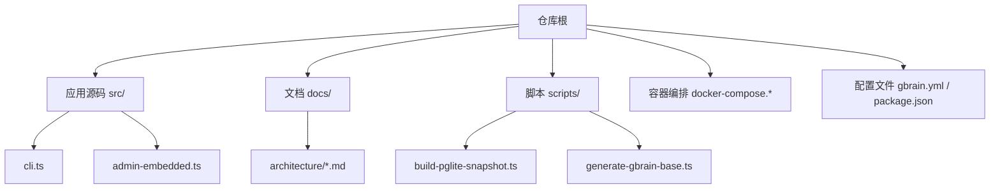
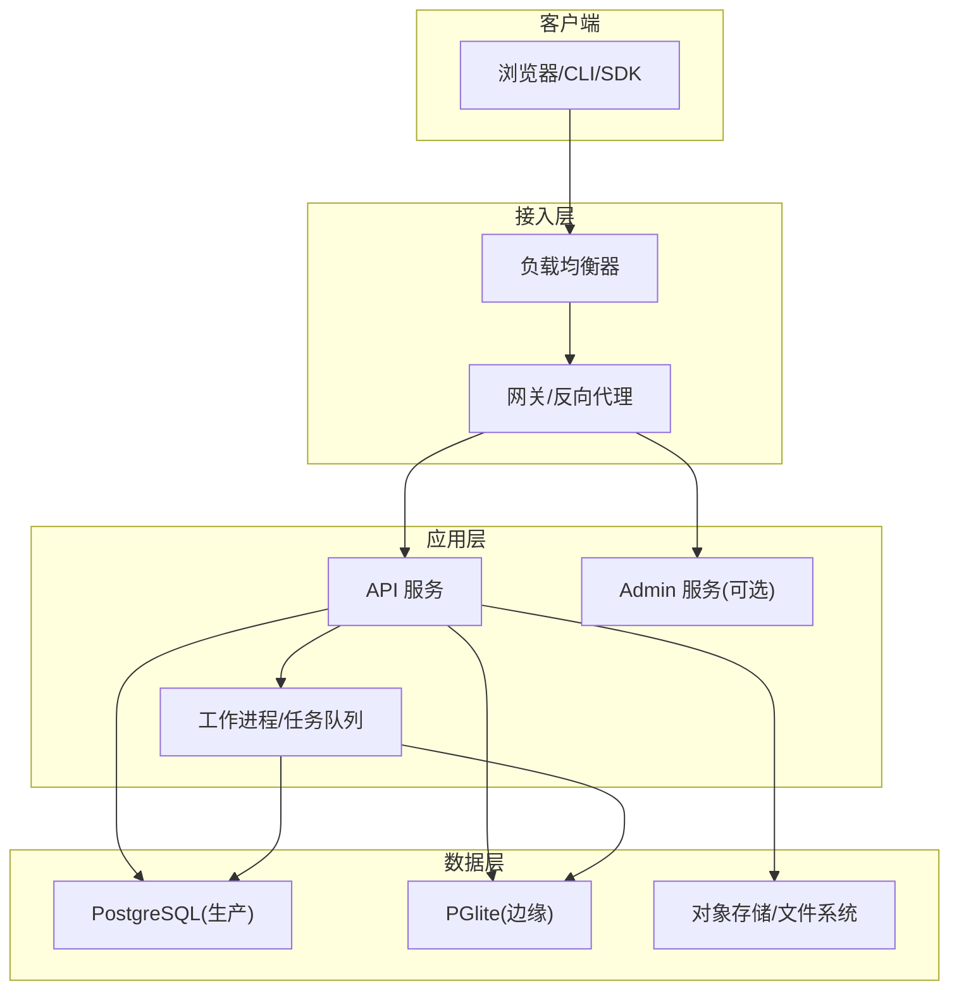
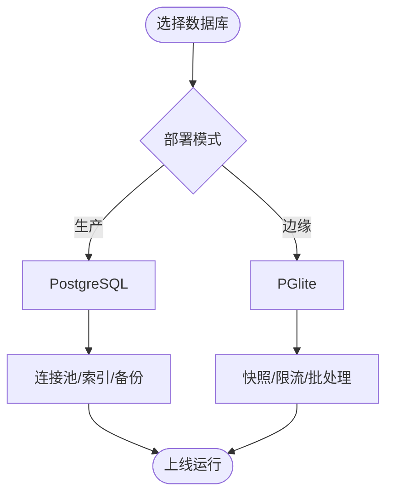
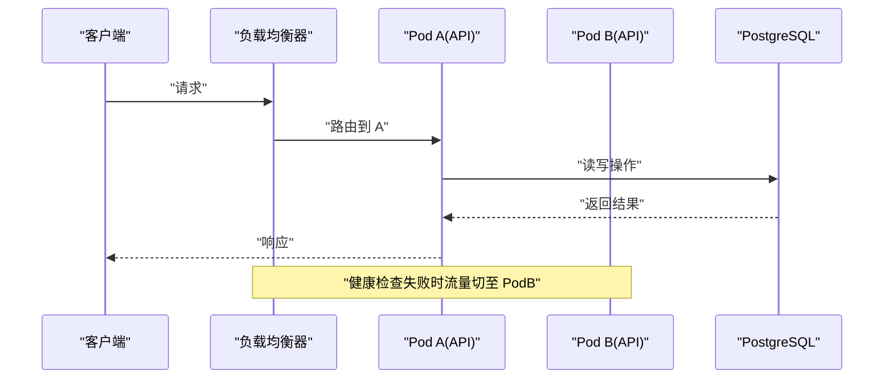
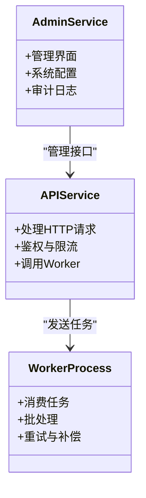
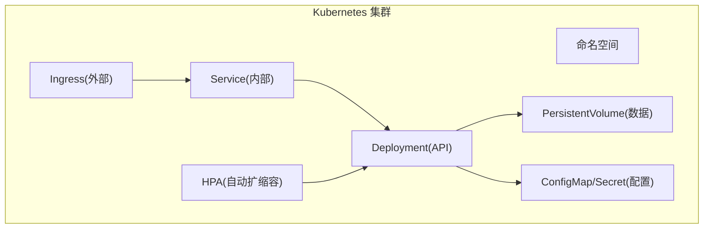
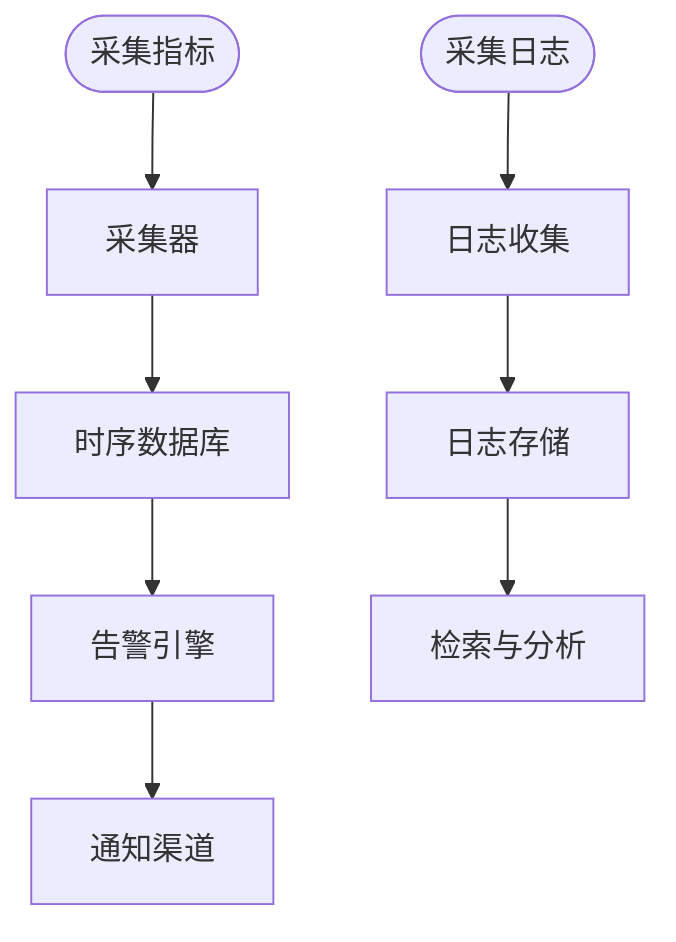
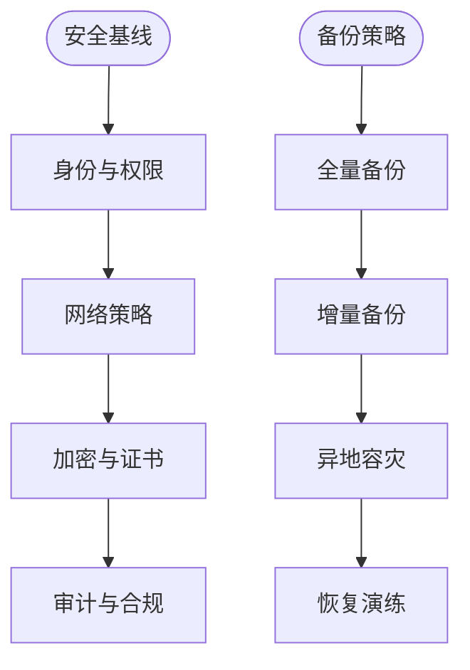
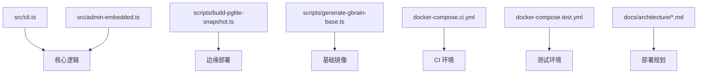

# 部署架构

<cite>
**本文引用的文件**   
- [README.md](file://README.md)
- [INSTALL.md](file://docs/INSTALL.md)
- [docker-compose.ci.yml](file://docker-compose.ci.yml)
- [docker-compose.test.yml](file://docker-compose.test.yml)
- [gbrain.yml](file://gbrain.yml)
- [package.json](file://package.json)
- [src/cli.ts](file://src/cli.ts)
- [src/admin-embedded.ts](file://src/admin-embedded.ts)
- [scripts/build-pglite-snapshot.ts](file://scripts/build-pglite-snapshot.ts)
- [scripts/generate-gbrain-base.ts](file://scripts/generate-gbrain-base.ts)
- [docs/architecture/overview.md](file://docs/architecture/overview.md)
- [docs/architecture/deployment-modes.md](file://docs/architecture/deployment-modes.md)
- [docs/architecture/data-layer.md](file://docs/architecture/data-layer.md)
- [docs/architecture/microservices-process-isolation.md](file://docs/architecture/microservices-process-isolation.md)
- [docs/architecture/load-balancing-scalability.md](file://docs/architecture/load-balancing-scalability.md)
- [docs/architecture/monitoring-alerting.md](file://docs/architecture/monitoring-alerting.md)
- [docs/architecture/security-network-backup.md](file://docs/architecture/security-network-backup.md)
- [docs/architecture/kubernetes-deployment.md](file://docs/architecture/kubernetes-deployment.md)
- [docs/architecture/service-discovery.md](file://docs/architecture/service-discovery.md)
</cite>

## 目录
1. [简介](#简介)
2. [项目结构](#项目结构)
3. [核心组件](#核心组件)
4. [架构总览](#架构总览)
5. [详细组件分析](#详细组件分析)
6. [依赖关系分析](#依赖关系分析)
7. [性能考量](#性能考量)
8. [故障排查指南](#故障排查指南)
9. [结论](#结论)
10. [附录](#附录)

## 简介
本文件面向 GBrain 的生产与边缘场景，提供覆盖单机、容器化与分布式集群的部署架构文档。重点包括：
- 多模式部署策略与适用场景
- 数据库后端选择（PostgreSQL 生产、PGlite 边缘）及配置优化
- 负载均衡、水平扩展与高可用设计
- 微服务拆分、进程隔离与资源管理
- 容器编排与 Kubernetes 部署、服务发现集成
- 监控告警、日志聚合与性能调优
- 安全加固、网络隔离与数据备份运维最佳实践

## 项目结构
GBrain 仓库包含应用源码、脚本、文档与示例等。与部署相关的关键位置如下：
- 根级配置与入口：包定义、CLI 入口、嵌入式 Admin 启动
- 容器编排：CI 与测试用 docker-compose
- 构建脚本：PGlite 快照生成、基础镜像生成
- 架构文档：部署模式、数据层、微服务与进程隔离、可观测性、安全与备份、Kubernetes 与服务发现

**图示来源**
- [package.json](file://package.json)
- [src/cli.ts](file://src/cli.ts)
- [src/admin-embedded.ts](file://src/admin-embedded.ts)
- [scripts/build-pglite-snapshot.ts](file://scripts/build-pglite-snapshot.ts)
- [scripts/generate-gbrain-base.ts](file://scripts/generate-gbrain-base.ts)
- [docker-compose.ci.yml](file://docker-compose.ci.yml)
- [docker-compose.test.yml](file://docker-compose.test.yml)
- [gbrain.yml](file://gbrain.yml)
- [docs/architecture/overview.md](file://docs/architecture/overview.md)

**章节来源**
- [README.md](file://README.md)
- [docs/INSTALL.md](file://docs/INSTALL.md)
- [package.json](file://package.json)
- [src/cli.ts](file://src/cli.ts)
- [src/admin-embedded.ts](file://src/admin-embedded.ts)
- [docker-compose.ci.yml](file://docker-compose.ci.yml)
- [docker-compose.test.yml](file://docker-compose.test.yml)
- [gbrain.yml](file://gbrain.yml)
- [scripts/build-pglite-snapshot.ts](file://scripts/build-pglite-snapshot.ts)
- [scripts/generate-gbrain-base.ts](file://scripts/generate-gbrain-base.ts)
- [docs/architecture/overview.md](file://docs/architecture/overview.md)

## 核心组件
- CLI 与主进程：负责命令分发、生命周期管理与外部交互
- 嵌入式 Admin：内嵌管理界面，便于本地与容器环境快速访问
- 数据库抽象层：统一 PostgreSQL 与 PGlite 后端，支持迁移与连接池
- 构建与镜像：PGlite 快照与基础镜像生成脚本，支撑边缘与容器化部署
- 容器编排：docker-compose 用于 CI 与测试环境的快速拉起

**章节来源**
- [src/cli.ts](file://src/cli.ts)
- [src/admin-embedded.ts](file://src/admin-embedded.ts)
- [scripts/build-pglite-snapshot.ts](file://scripts/build-pglite-snapshot.ts)
- [scripts/generate-gbrain-base.ts](file://scripts/generate-gbrain-base.ts)
- [docker-compose.ci.yml](file://docker-compose.ci.yml)
- [docker-compose.test.yml](file://docker-compose.test.yml)

## 架构总览
GBrain 支持三种主要部署模式：
- 单机部署：适合开发、演示与小规模使用
- 容器化部署：通过 Docker Compose 或镜像运行，便于环境一致性与快速交付
- 分布式集群：结合 K8s 实现水平扩展、高可用与弹性伸缩

**图示来源**
- [docs/architecture/deployment-modes.md](file://docs/architecture/deployment-modes.md)
- [docs/architecture/data-layer.md](file://docs/architecture/data-layer.md)
- [docs/architecture/load-balancing-scalability.md](file://docs/architecture/load-balancing-scalability.md)
- [docs/architecture/microservices-process-isolation.md](file://docs/architecture/microservices-process-isolation.md)
- [docs/architecture/kubernetes-deployment.md](file://docs/architecture/kubernetes-deployment.md)
- [docs/architecture/service-discovery.md](file://docs/architecture/service-discovery.md)

## 详细组件分析

### 部署模式与适用场景
- 单机部署
  - 特点：最小依赖、快速上手、单进程/单实例
  - 适用：个人开发、小规模实验、离线边缘设备
  - 关键要点：本地数据库（PGlite）、静态配置、简单日志输出
- 容器化部署
  - 特点：环境一致、易迁移、可组合编排
  - 适用：CI/CD、测试环境、中小规模生产
  - 关键要点：Docker 镜像、环境变量注入、持久卷挂载
- 分布式集群
  - 特点：多副本、无状态服务、有状态数据外置
  - 适用：高并发、高可用、跨地域容灾
  - 关键要点：K8s Deployment/Service、HPA、Ingress、持久卷、外部数据库

**章节来源**
- [docs/architecture/deployment-modes.md](file://docs/architecture/deployment-modes.md)
- [docs/INSTALL.md](file://docs/INSTALL.md)

### 数据库后端选择与优化
- 生产环境：PostgreSQL
  - 优势：事务一致性、扩展生态、成熟工具链
  - 配置要点：连接池、索引策略、读写分离（可选）、备份与恢复
- 边缘场景：PGlite
  - 优势：零依赖、嵌入式、低开销
  - 限制：并发与容量受限，需评估写入吞吐与数据量
  - 优化：快照与增量同步、冷备导出、限流与批处理

**图示来源**
- [docs/architecture/data-layer.md](file://docs/architecture/data-layer.md)
- [scripts/build-pglite-snapshot.ts](file://scripts/build-pglite-snapshot.ts)

**章节来源**
- [docs/architecture/data-layer.md](file://docs/architecture/data-layer.md)
- [scripts/build-pglite-snapshot.ts](file://scripts/build-pglite-snapshot.ts)

### 负载均衡、水平扩展与高可用
- 负载均衡
  - 方案：七层反向代理或云厂商 LB，健康检查与优雅下线
  - 会话保持：无状态服务优先；必要时引入外部会话存储
- 水平扩展
  - 策略：按 CPU/内存/自定义指标自动扩缩容
  - 分片与分区：热点数据分片、读写分离、只读副本
- 高可用
  - 多副本部署、跨可用区分布、故障转移与重试策略
  - 幂等设计与补偿机制，避免重复执行导致的数据不一致

**图示来源**
- [docs/architecture/load-balancing-scalability.md](file://docs/architecture/load-balancing-scalability.md)
- [docs/architecture/kubernetes-deployment.md](file://docs/architecture/kubernetes-deployment.md)

**章节来源**
- [docs/architecture/load-balancing-scalability.md](file://docs/architecture/load-balancing-scalability.md)
- [docs/architecture/kubernetes-deployment.md](file://docs/architecture/kubernetes-deployment.md)

### 微服务拆分、进程隔离与资源管理
- 服务拆分
  - API 服务：对外暴露 REST/GraphQL/MCP 接口
  - Admin 服务：管理界面与运维能力
  - Worker 进程：异步任务、批量处理、后台作业
- 进程隔离
  - 进程间通信：消息队列/事件总线
  - 资源隔离：CPU/内存限额、OOM 保护、优雅退出
- 资源管理
  - 容器资源请求与限制
  - 动态扩缩容与背压控制

**图示来源**
- [docs/architecture/microservices-process-isolation.md](file://docs/architecture/microservices-process-isolation.md)
- [src/admin-embedded.ts](file://src/admin-embedded.ts)
- [src/cli.ts](file://src/cli.ts)

**章节来源**
- [docs/architecture/microservices-process-isolation.md](file://docs/architecture/microservices-process-isolation.md)
- [src/admin-embedded.ts](file://src/admin-embedded.ts)
- [src/cli.ts](file://src/cli.ts)

### 容器编排与 Kubernetes 部署
- Docker Compose
  - 适用于本地与测试环境，一键拉起应用与依赖
- Kubernetes
  - Deployment：定义副本数、滚动更新、回滚策略
  - Service：内部服务发现与负载均衡
  - Ingress：外部访问入口与 TLS 终止
  - HPA：基于指标的自动扩缩容
  - ConfigMap/Secret：配置与密钥管理
  - PersistentVolume：持久化数据

**图示来源**
- [docs/architecture/kubernetes-deployment.md](file://docs/architecture/kubernetes-deployment.md)
- [docs/architecture/service-discovery.md](file://docs/architecture/service-discovery.md)
- [docker-compose.ci.yml](file://docker-compose.ci.yml)
- [docker-compose.test.yml](file://docker-compose.test.yml)

**章节来源**
- [docs/architecture/kubernetes-deployment.md](file://docs/architecture/kubernetes-deployment.md)
- [docs/architecture/service-discovery.md](file://docs/architecture/service-discovery.md)
- [docker-compose.ci.yml](file://docker-compose.ci.yml)
- [docker-compose.test.yml](file://docker-compose.test.yml)

### 监控告警、日志聚合与性能调优
- 监控告警
  - 指标采集：应用指标、系统指标、业务指标
  - 告警规则：阈值、趋势、复合条件
  - 通知渠道：邮件、IM、Webhook
- 日志聚合
  - 结构化日志、集中收集、检索与分析
  - 敏感信息脱敏与保留策略
- 性能调优
  - 数据库：索引、查询计划、连接池
  - 应用：缓存、批处理、超时与重试
  - 资源：CPU/内存配额、GC 参数

**图示来源**
- [docs/architecture/monitoring-alerting.md](file://docs/architecture/monitoring-alerting.md)

**章节来源**
- [docs/architecture/monitoring-alerting.md](file://docs/architecture/monitoring-alerting.md)

### 安全加固、网络隔离与数据备份
- 安全加固
  - 最小权限原则、密钥管理、证书与加密传输
  - 输入校验、越权防护、审计日志
- 网络隔离
  - 命名空间/子网隔离、白名单策略、零信任访问
- 数据备份
  - 全量与增量备份、异地容灾、定期演练恢复

**图示来源**
- [docs/architecture/security-network-backup.md](file://docs/architecture/security-network-backup.md)

**章节来源**
- [docs/architecture/security-network-backup.md](file://docs/architecture/security-network-backup.md)

## 依赖关系分析
- 应用入口与模块
  - CLI 作为命令行入口，负责初始化与命令分发
  - 嵌入式 Admin 提供管理界面能力
- 构建与镜像
  - PGlite 快照生成脚本用于边缘场景
  - 基础镜像生成脚本用于容器化部署
- 容器编排
  - docker-compose 用于 CI 与测试环境
- 文档与架构
  - 架构文档定义了部署模式、数据层、微服务、可观测性、安全与 K8s 部署

**图示来源**
- [src/cli.ts](file://src/cli.ts)
- [src/admin-embedded.ts](file://src/admin-embedded.ts)
- [scripts/build-pglite-snapshot.ts](file://scripts/build-pglite-snapshot.ts)
- [scripts/generate-gbrain-base.ts](file://scripts/generate-gbrain-base.ts)
- [docker-compose.ci.yml](file://docker-compose.ci.yml)
- [docker-compose.test.yml](file://docker-compose.test.yml)
- [docs/architecture/overview.md](file://docs/architecture/overview.md)

**章节来源**
- [src/cli.ts](file://src/cli.ts)
- [src/admin-embedded.ts](file://src/admin-embedded.ts)
- [scripts/build-pglite-snapshot.ts](file://scripts/build-pglite-snapshot.ts)
- [scripts/generate-gbrain-base.ts](file://scripts/generate-gbrain-base.ts)
- [docker-compose.ci.yml](file://docker-compose.ci.yml)
- [docker-compose.test.yml](file://docker-compose.test.yml)
- [docs/architecture/overview.md](file://docs/architecture/overview.md)

## 性能考量
- 数据库层面
  - 合理索引与查询优化，避免全表扫描
  - 连接池大小与超时设置，防止连接泄漏
- 应用层面
  - 缓存热点数据，减少重复计算与 IO
  - 批处理与异步化，降低峰值压力
- 资源层面
  - 为容器设置合理的请求与限制，避免争抢
  - 启用优雅退出与背压，保障稳定性

[本节为通用指导，不直接分析具体文件]

## 故障排查指南
- 常见问题定位
  - 启动失败：检查环境变量、端口占用、依赖服务可用性
  - 数据库连接异常：核对连接串、认证、网络策略
  - 任务堆积：观察队列长度、Worker 数量与错误日志
- 诊断手段
  - 查看应用与系统指标，识别瓶颈
  - 拉取并分析日志，关注错误堆栈与上下文
  - 复现问题并逐步缩小范围

**章节来源**
- [docs/architecture/monitoring-alerting.md](file://docs/architecture/monitoring-alerting.md)
- [docs/architecture/security-network-backup.md](file://docs/architecture/security-network-backup.md)

## 结论
GBrain 在多部署模式下具备良好适配性：单机快速起步、容器化提升交付效率、分布式集群满足高可用与弹性需求。通过合理的数据库选型与优化、完善的监控与日志体系、严格的安全与备份策略，可在生产环境中稳定运行并持续演进。

[本节为总结性内容，不直接分析具体文件]

## 附录
- 参考文档
  - 安装与入门：见安装文档
  - 架构概览与专项设计：见架构文档集合
- 快速验证
  - 使用 docker-compose 在本地或 CI 环境快速拉起服务
  - 通过 CLI 与 Admin 进行基本功能验证

**章节来源**
- [docs/INSTALL.md](file://docs/INSTALL.md)
- [docker-compose.ci.yml](file://docker-compose.ci.yml)
- [docker-compose.test.yml](file://docker-compose.test.yml)
- [docs/architecture/overview.md](file://docs/architecture/overview.md)