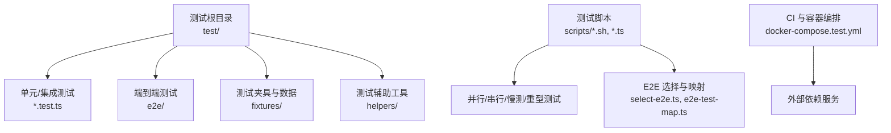
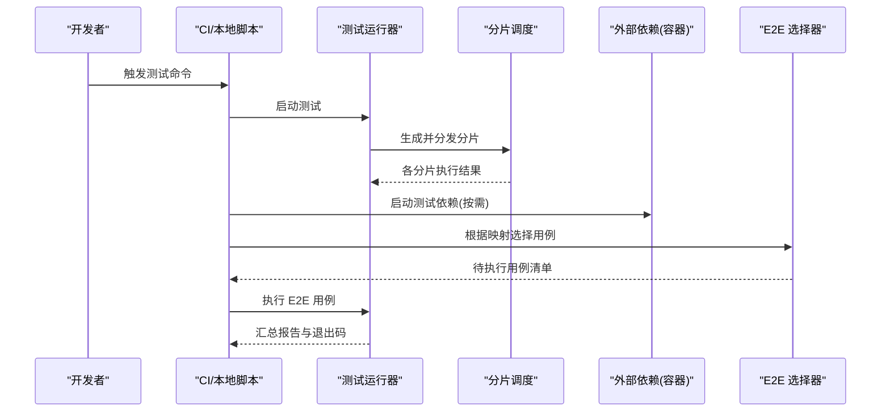
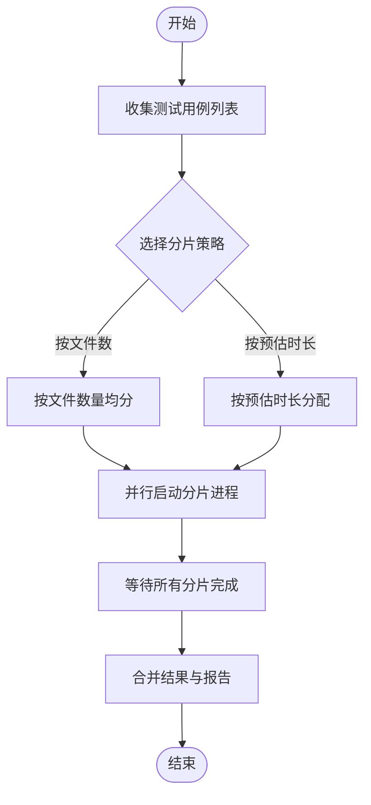
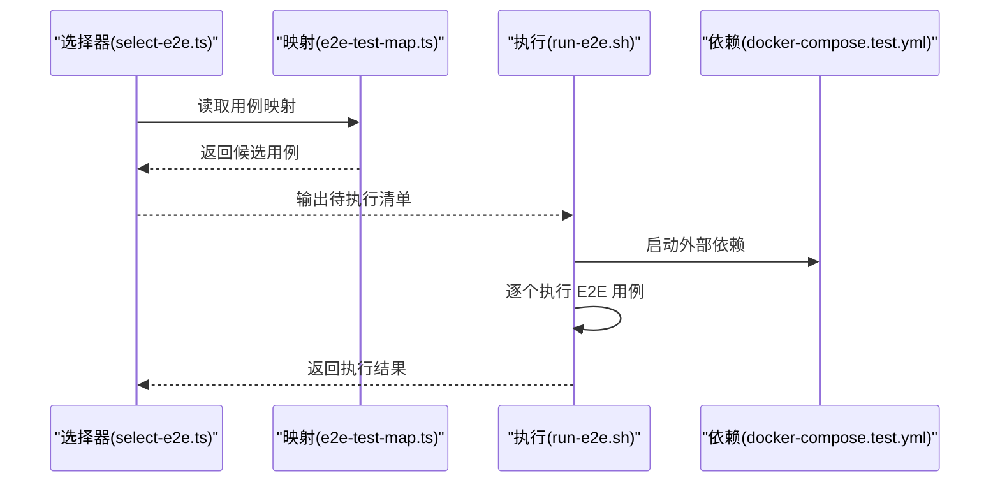
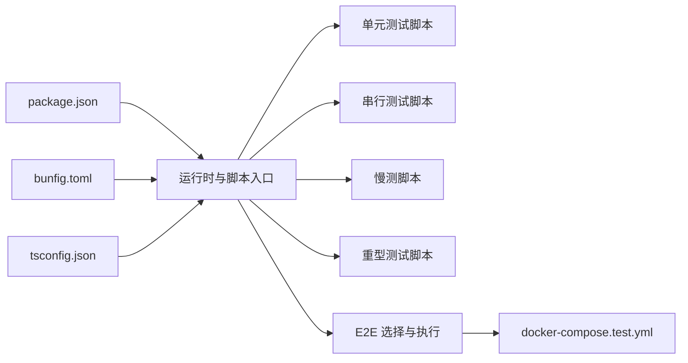

# 功能测试

<cite>
**本文引用的文件**   
- [TESTING.md](file://docs/TESTING.md)
- [package.json](file://package.json)
- [bunfig.toml](file://bunfig.toml)
- [docker-compose.test.yml](file://docker-compose.test.yml)
- [run-unit-parallel.sh](file://scripts/run-unit-parallel.sh)
- [run-serial-tests.sh](file://scripts/run-serial-tests.sh)
- [run-slow-tests.sh](file://scripts/run-slow-tests.sh)
- [run-heavy.sh](file://scripts/run-heavy.sh)
- [test-shard.sh](file://scripts/test-shard.sh)
- [sharding.ts](file://scripts/sharding.ts)
- [e2e-test-map.ts](file://scripts/e2e-test-map.ts)
- [run-e2e.sh](file://scripts/run-e2e.sh)
- [select-e2e.ts](file://scripts/select-e2e.ts)
- [profile-tests.sh](file://scripts/profile-tests.sh)
- [check-test-isolation.sh](file://scripts/check-test-isolation.sh)
- [check-test-isolation.allowlist](file://scripts/check-test-isolation.allowlist)
- [check-test-real-names.sh](file://scripts/check-test-real-names.sh)
- [smoke-test.sh](file://scripts/smoke-test.sh)
- [ci-local.sh](file://scripts/ci-local.sh)
- [tsconfig.json](file://tsconfig.json)
</cite>

## 目录
1. [简介](#简介)
2. [项目结构](#项目结构)
3. [核心组件](#核心组件)
4. [架构总览](#架构总览)
5. [详细组件分析](#详细组件分析)
6. [依赖分析](#依赖分析)
7. [性能考虑](#性能考虑)
8. [故障排查指南](#故障排查指南)
9. [结论](#结论)
10. [附录](#附录)

## 简介
本文件面向功能测试的体系化设计与落地实践，覆盖单元测试、集成测试与端到端（E2E）测试的策略、夹具管理、异步与并发场景、错误处理模式、断言与自定义匹配器、覆盖率统计与质量门禁。文档基于仓库现有脚本与配置进行归纳，旨在帮助团队在保持高可维护性的同时提升测试稳定性与执行效率。

## 项目结构
仓库采用“按领域组织”的测试目录布局：
- test/: 所有测试用例与测试辅助资源，包含 e2e、fixtures、helpers 等子目录
- scripts/: 测试运行、分片、选择、隔离检查、性能剖析等工具脚本
- docs/TESTING.md: 官方测试指南与约定
- docker-compose.test.yml: 测试环境依赖（如数据库）编排
- package.json / bunfig.toml / tsconfig.json: 运行时与构建配置

**图表来源** 
- [TESTING.md](file://docs/TESTING.md)
- [docker-compose.test.yml](file://docker-compose.test.yml)
- [run-unit-parallel.sh](file://scripts/run-unit-parallel.sh)
- [run-serial-tests.sh](file://scripts/run-serial-tests.sh)
- [run-slow-tests.sh](file://scripts/run-slow-tests.sh)
- [run-heavy.sh](file://scripts/run-heavy.sh)
- [test-shard.sh](file://scripts/test-shard.sh)
- [sharding.ts](file://scripts/sharding.ts)
- [e2e-test-map.ts](file://scripts/e2e-test-map.ts)
- [run-e2e.sh](file://scripts/run-e2e.sh)
- [select-e2e.ts](file://scripts/select-e2e.ts)

**章节来源**
- [TESTING.md](file://docs/TESTING.md)
- [docker-compose.test.yml](file://docker-compose.test.yml)
- [package.json](file://package.json)
- [bunfig.toml](file://bunfig.toml)
- [tsconfig.json](file://tsconfig.json)

## 核心组件
- 测试分层策略
  - 单元测试：聚焦纯函数、模块边界、错误分支与边界条件，强调快速与稳定
  - 集成测试：围绕子系统交互（如存储、队列、调度），使用轻量外部依赖或内存实现
  - 端到端测试：模拟真实用户路径，覆盖关键业务流程与跨进程通信
- 测试运行与分片
  - 并行执行：通过脚本将测试集切分为多个分片并行运行，缩短整体耗时
  - 串行与慢测：对存在共享状态或资源争用的用例单独串行执行；慢测与重型测试独立通道
- E2E 选择与映射
  - 通过映射表与选择脚本动态筛选要执行的 E2E 用例，支持按需回归与冒烟验证
- 隔离与一致性
  - 提供隔离检查脚本与白名单机制，确保测试间不互相污染
  - 强制命名规范检查，避免误用真实名称导致副作用

**章节来源**
- [run-unit-parallel.sh](file://scripts/run-unit-parallel.sh)
- [run-serial-tests.sh](file://scripts/run-serial-tests.sh)
- [run-slow-tests.sh](file://scripts/run-slow-tests.sh)
- [run-heavy.sh](file://scripts/run-heavy.sh)
- [test-shard.sh](file://scripts/test-shard.sh)
- [sharding.ts](file://scripts/sharding.ts)
- [e2e-test-map.ts](file://scripts/e2e-test-map.ts)
- [run-e2e.sh](file://scripts/run-e2e.sh)
- [select-e2e.ts](file://scripts/select-e2e.ts)
- [check-test-isolation.sh](file://scripts/check-test-isolation.sh)
- [check-test-isolation.allowlist](file://scripts/check-test-isolation.allowlist)
- [check-test-real-names.sh](file://scripts/check-test-real-names.sh)

## 架构总览
下图展示了从开发者触发到测试执行与结果汇总的整体流程，包括并行分片、串行/慢测通道、E2E 选择与容器依赖启动。

**图表来源** 
- [run-unit-parallel.sh](file://scripts/run-unit-parallel.sh)
- [test-shard.sh](file://scripts/test-shard.sh)
- [sharding.ts](file://scripts/sharding.ts)
- [docker-compose.test.yml](file://docker-compose.test.yml)
- [e2e-test-map.ts](file://scripts/e2e-test-map.ts)
- [select-e2e.ts](file://scripts/select-e2e.ts)
- [run-e2e.sh](file://scripts/run-e2e.sh)

## 详细组件分析

### 测试运行与分片
- 并行执行
  - 通过脚本将测试集划分为若干分片，每个分片独立运行，最大化利用多核资源
  - 分片粒度可按文件数或时间估算划分，保证均衡负载
- 串行与慢测
  - 对存在全局状态、锁竞争或共享资源的用例，使用串行脚本保障顺序与稳定性
  - 慢测与重型测试走独立通道，避免阻塞常规回归
- 分片算法
  - 分片逻辑由脚本与 TypeScript 工具共同实现，支持按规则聚合与随机打散，降低热点风险

**图表来源** 
- [run-unit-parallel.sh](file://scripts/run-unit-parallel.sh)
- [test-shard.sh](file://scripts/test-shard.sh)
- [sharding.ts](file://scripts/sharding.ts)

**章节来源**
- [run-unit-parallel.sh](file://scripts/run-unit-parallel.sh)
- [test-shard.sh](file://scripts/test-shard.sh)
- [sharding.ts](file://scripts/sharding.ts)

### 串行与慢测通道
- 串行测试
  - 针对需要严格顺序的场景（如数据库迁移、锁竞争、单例初始化）提供专用脚本
  - 建议为每个串行用例添加明确注释说明原因，便于后续优化
- 慢测与重型测试
  - 慢测通道用于 IO 密集或网络调用较多的用例
  - 重型测试通常涉及大数据集或长时间运行，建议在独立环境与低优先级队列中执行

**章节来源**
- [run-serial-tests.sh](file://scripts/run-serial-tests.sh)
- [run-slow-tests.sh](file://scripts/run-slow-tests.sh)
- [run-heavy.sh](file://scripts/run-heavy.sh)

### E2E 选择与执行
- 用例映射与选择
  - 通过映射表集中管理 E2E 用例集合，支持按标签、范围或变更影响面进行选择
  - 选择器脚本读取映射并输出待执行清单，供执行脚本消费
- 执行流程
  - 在执行前按需拉起外部依赖（如数据库、消息队列），确保环境一致性与可重复性
  - 执行完成后清理临时资源，避免残留状态影响后续任务

**图表来源** 
- [select-e2e.ts](file://scripts/select-e2e.ts)
- [e2e-test-map.ts](file://scripts/e2e-test-map.ts)
- [run-e2e.sh](file://scripts/run-e2e.sh)
- [docker-compose.test.yml](file://docker-compose.test.yml)

**章节来源**
- [e2e-test-map.ts](file://scripts/e2e-test-map.ts)
- [select-e2e.ts](file://scripts/select-e2e.ts)
- [run-e2e.sh](file://scripts/run-e2e.sh)
- [docker-compose.test.yml](file://docker-compose.test.yml)

### 测试隔离与命名规范
- 隔离检查
  - 提供脚本扫描测试代码，检测潜在的全局状态污染与共享资源访问
  - 白名单允许已知且受控的例外情况，但需定期复审
- 命名规范
  - 强制检查测试中的真实名称与敏感信息，防止泄露与副作用

**章节来源**
- [check-test-isolation.sh](file://scripts/check-test-isolation.sh)
- [check-test-isolation.allowlist](file://scripts/check-test-isolation.allowlist)
- [check-test-real-names.sh](file://scripts/check-test-real-names.sh)

### 冒烟与本地 CI
- 冒烟测试
  - 快速验证核心路径是否可用，适合提交前自检与 PR 预检
- 本地 CI
  - 封装常用测试命令与环境准备，统一开发体验与行为

**章节来源**
- [smoke-test.sh](file://scripts/smoke-test.sh)
- [ci-local.sh](file://scripts/ci-local.sh)

## 依赖分析
- 运行期依赖
  - Node/Bun 运行时与 TypeScript 编译配置
  - 测试框架与断言库（由包管理与运行时配置驱动）
- 外部服务依赖
  - 数据库、缓存、消息队列等通过容器编排启动，确保测试环境一致性
- 脚本依赖关系
  - 分片与选择脚本相互协作，形成稳定的执行流水线

**图表来源** 
- [package.json](file://package.json)
- [bunfig.toml](file://bunfig.toml)
- [tsconfig.json](file://tsconfig.json)
- [run-unit-parallel.sh](file://scripts/run-unit-parallel.sh)
- [run-serial-tests.sh](file://scripts/run-serial-tests.sh)
- [run-slow-tests.sh](file://scripts/run-slow-tests.sh)
- [run-heavy.sh](file://scripts/run-heavy.sh)
- [run-e2e.sh](file://scripts/run-e2e.sh)
- [docker-compose.test.yml](file://docker-compose.test.yml)

**章节来源**
- [package.json](file://package.json)
- [bunfig.toml](file://bunfig.toml)
- [tsconfig.json](file://tsconfig.json)
- [docker-compose.test.yml](file://docker-compose.test.yml)

## 性能考虑
- 并行与分片
  - 合理设置分片数量与粒度，避免单个分片过大导致尾部效应
  - 对热点用例进行拆分或去重，减少重复计算
- 资源隔离
  - 为不同通道（并行/串行/慢测/重型）分配独立资源池，避免相互干扰
- 预热与缓存
  - 对冷启动较慢的依赖进行预热，减少首次执行抖动
- 监控与剖析
  - 使用性能剖析脚本定位瓶颈，结合日志与指标持续优化

[本节为通用指导，无需特定文件引用]

## 故障排查指南
- 常见失败类型
  - 资源未就绪：检查容器编排与依赖启动顺序
  - 超时与不稳定：调整超时阈值、重试策略与分片均衡
  - 隔离问题：审查白名单与隔离检查规则，修复潜在污染
- 诊断步骤
  - 缩小范围：仅执行受影响的分片或 E2E 用例
  - 查看日志：结合运行脚本的输出与系统日志定位问题
  - 复现环境：使用本地 CI 脚本复现 CI 行为，提高定位效率

**章节来源**
- [docker-compose.test.yml](file://docker-compose.test.yml)
- [run-unit-parallel.sh](file://scripts/run-unit-parallel.sh)
- [run-e2e.sh](file://scripts/run-e2e.sh)
- [ci-local.sh](file://scripts/ci-local.sh)

## 结论
通过分层测试策略、严格的隔离与命名规范、完善的分片与选择机制，以及容器化的依赖管理，本项目构建了高效、稳定且可扩展的功能测试体系。建议持续优化分片策略、完善 E2E 映射与白名单治理，并结合性能剖析与覆盖率门禁进一步提升质量与交付速度。

[本节为总结性内容，无需特定文件引用]

## 附录
- 覆盖率统计与质量门禁
  - 建议在包管理中引入覆盖率工具，并在 CI 中配置最低覆盖率门槛
  - 将覆盖率报告纳入发布流程，作为质量门禁的一部分
- 最佳实践清单
  - 用例小而专注，单一职责
  - 明确描述预期行为，避免模糊断言
  - 对外部依赖进行模拟或隔离，保证可重复性
  - 对异步与并发场景增加超时与重试保护
  - 定期审查白名单与隔离规则，减少技术债

[本节为通用指导，无需特定文件引用]