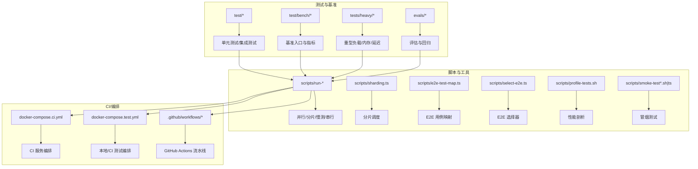
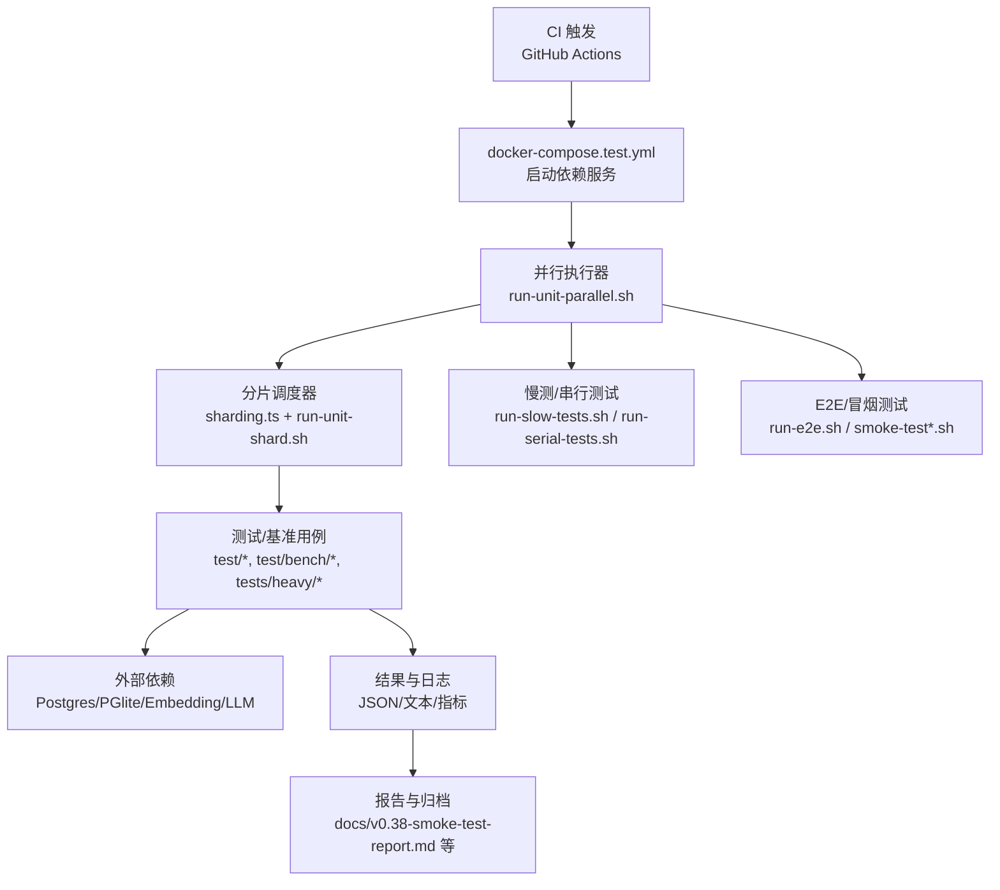
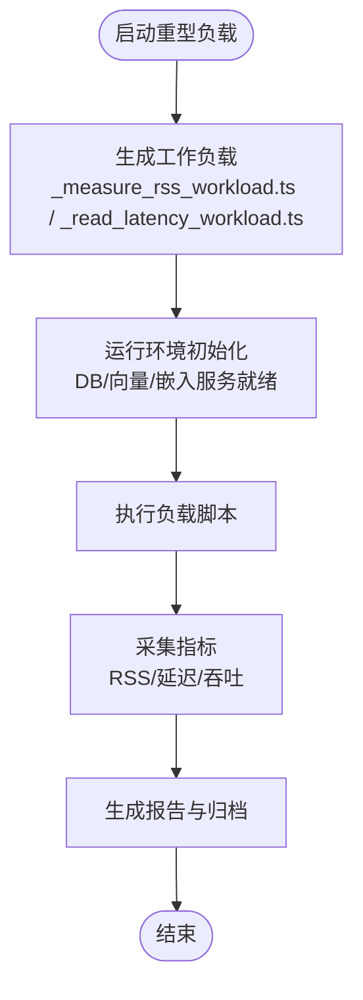
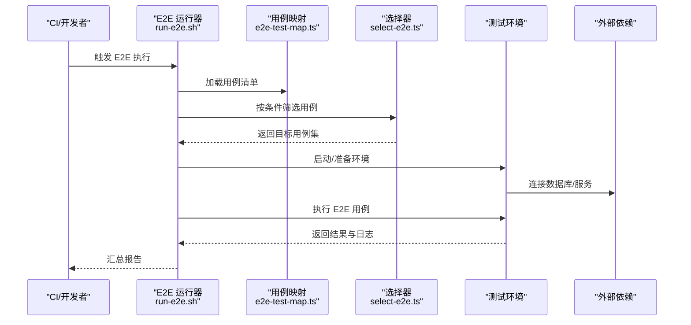
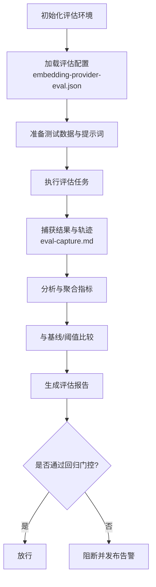
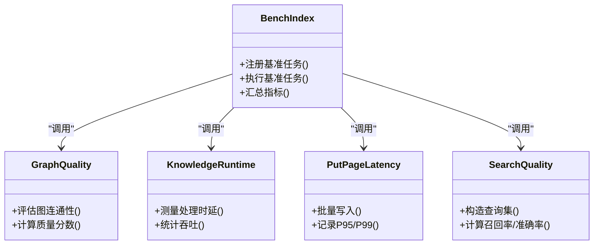
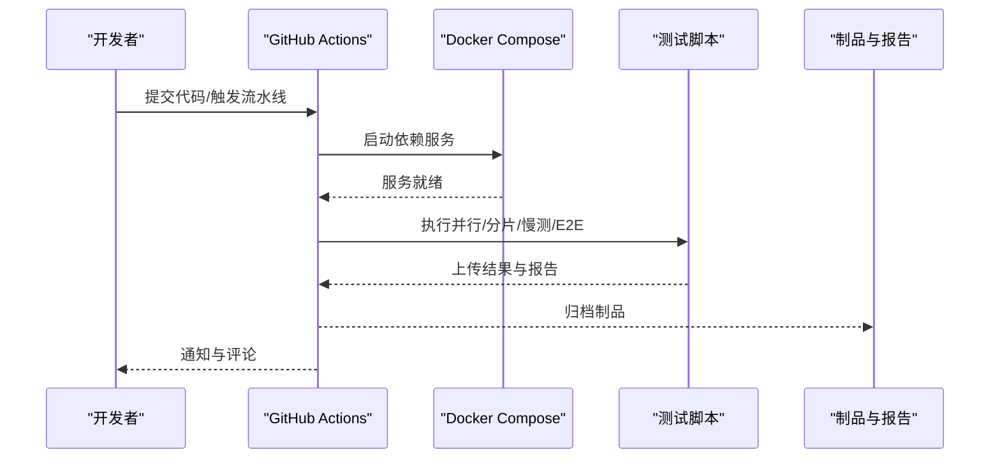
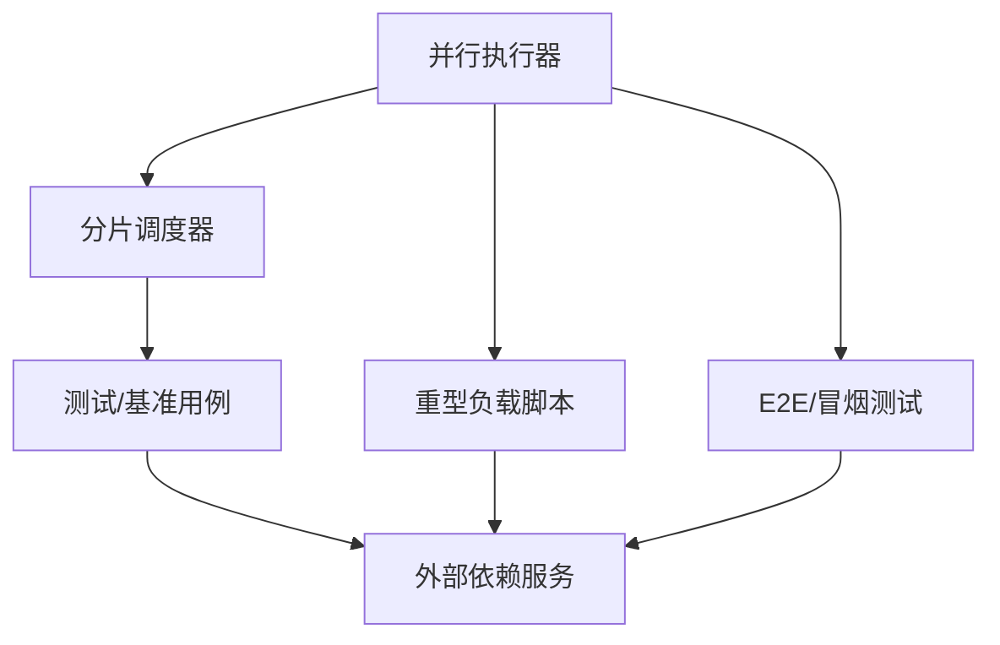

# 基准测试套件

<cite>
**本文引用的文件**   
- [README.md](file://README.md)
- [package.json](file://package.json)
- [bunfig.toml](file://bunfig.toml)
- [tsconfig.json](file://tsconfig.json)
- [docker-compose.ci.yml](file://docker-compose.ci.yml)
- [docker-compose.test.yml](file://docker-compose.test.yml)
- [gbrain.yml](file://gbrain.yml)
- [CONTRIBUTING.md](file://CONTRIBUTING.md)
- [CLAUDE.md](file://CLAUDE.md)
- [scripts/run-unit-parallel.sh](file://scripts/run-unit-parallel.sh)
- [scripts/run-unit-shard.sh](file://scripts/run-unit-shard.sh)
- [scripts/run-heavy.sh](file://scripts/run-heavy.sh)
- [scripts/run-slow-tests.sh](file://scripts/run-slow-tests.sh)
- [scripts/run-serial-tests.sh](file://scripts/run-serial-tests.sh)
- [scripts/run-e2e.sh](file://scripts/run-e2e.sh)
- [scripts/profile-tests.sh](file://scripts/profile-tests.sh)
- [scripts/ci-local.sh](file://scripts/ci-local.sh)
- [scripts/test-shard.sh](file://scripts/test-shard.sh)
- [scripts/sharding.ts](file://scripts/sharding.ts)
- [scripts/e2e-test-map.ts](file://scripts/e2e-test-map.ts)
- [scripts/select-e2e.ts](file://scripts/select-e2e.ts)
- [scripts/ship-remote-tests.sh](file://scripts/ship-remote-tests.sh)
- [scripts/smoke-test.sh](file://scripts/smoke-test.sh)
- [scripts/smoke-test-mcp.ts](file://scripts/smoke-test-mcp.ts)
- [scripts/build-pglite-snapshot.ts](file://scripts/build-pglite-snapshot.ts)
- [scripts/check-test-isolation.sh](file://scripts/check-test-isolation.sh)
- [scripts/check-test-real-names.sh](file://scripts/check-test-real-names.sh)
- [scripts/check-worker-lock-renewal-shape.sh](file://scripts/check-worker-lock-renewal-shape.sh)
- [scripts/check-worker-pool-atomicity.sh](file://scripts/check-worker-pool-atomicity.sh)
- [scripts/spike-bun-vm-timeout.ts](file://scripts/spike-bun-vm-timeout.ts)
- [test/bench/index.ts](file://test/bench/index.ts)
- [test/benchmark-graph-quality.ts](file://test/benchmark-graph-quality.ts)
- [test/benchmark-knowledge-runtime.ts](file://test/benchmark-knowledge-runtime.ts)
- [test/benchmark-put-page-latency.ts](file://test/benchmark-put-page-latency.ts)
- [test/benchmark-search-quality.ts](file://test/benchmark-search-quality.ts)
- [tests/heavy/README.md](file://tests/heavy/README.md)
- [tests/heavy/_build_legacy_fixtures.sh](file://tests/heavy/_build_legacy_fixtures.sh)
- [tests/heavy/_measure_rss_workload.ts](file://tests/heavy/_measure_rss_workload.ts)
- [tests/heavy/_read_latency_workload.ts](file://tests/heavy/_read_latency_workload.ts)
- [evals/embedding-provider-eval.json](file://evals/embedding-provider-eval.json)
- [docs/TESTING.md](file://docs/TESTING.md)
- [docs/eval-bench.md](file://docs/eval-bench.md)
- [docs/eval-capture.md](file://docs/eval-capture.md)
- [docs/eval-takes-quality.md](file://docs/eval-takes-quality.md)
- [docs/v0.38-smoke-test-report.md](file://docs/v0.38-smoke-test-report.md)
</cite>

## 目录
1. [简介](#简介)
2. [项目结构](#项目结构)
3. [核心组件](#核心组件)
4. [架构总览](#架构总览)
5. [详细组件分析](#详细组件分析)
6. [依赖关系分析](#依赖关系分析)
7. [性能考量](#性能考量)
8. [故障排除指南](#故障排除指南)
9. [结论](#结论)
10. [附录](#附录)

## 简介
本文件面向“基准测试套件”的构建、执行与分析，覆盖功能测试、性能测试、压力测试与回归测试的设计原则、数据准备方法、执行环境配置、自动化流水线与持续集成、结果分析与报告生成、调试技巧与排障策略，以及大规模并行测试的执行策略与资源管理。文档基于仓库中现有的脚本、测试组织与评估工具进行系统化梳理，帮助开发者快速搭建并稳定运行基准测试体系。

## 项目结构
仓库采用分层与按领域划分的测试组织方式：
- 单元测试与集成测试位于 test 目录，按模块与子系统划分；包含大量 .test.ts 用例。
- 基准与性能相关脚本集中于 scripts 目录，提供并行、分片、慢测、重型负载等能力。
- 重型负载与压测样例位于 tests/heavy 目录，包含工作负载脚本与说明。
- 评估（Eval）相关用例与配置位于 evals 目录，用于质量与回归评估。
- CI/CD 编排通过 docker-compose 与 GitHub Actions 工作流完成。
- 根级配置文件包括 package.json、bunfig.toml、tsconfig.json、gbrain.yml 等，统一运行时与构建行为。



图表来源
- [scripts/run-unit-parallel.sh](file://scripts/run-unit-parallel.sh)
- [scripts/run-unit-shard.sh](file://scripts/run-unit-shard.sh)
- [scripts/run-heavy.sh](file://scripts/run-heavy.sh)
- [scripts/run-slow-tests.sh](file://scripts/run-slow-tests.sh)
- [scripts/run-serial-tests.sh](file://scripts/run-serial-tests.sh)
- [scripts/run-e2e.sh](file://scripts/run-e2e.sh)
- [scripts/profile-tests.sh](file://scripts/profile-tests.sh)
- [scripts/sharding.ts](file://scripts/sharding.ts)
- [scripts/e2e-test-map.ts](file://scripts/e2e-test-map.ts)
- [scripts/select-e2e.ts](file://scripts/select-e2e.ts)
- [scripts/smoke-test.sh](file://scripts/smoke-test.sh)
- [scripts/smoke-test-mcp.ts](file://scripts/smoke-test-mcp.ts)
- [docker-compose.ci.yml](file://docker-compose.ci.yml)
- [docker-compose.test.yml](file://docker-compose.test.yml)

章节来源
- [README.md](file://README.md)
- [package.json](file://package.json)
- [bunfig.toml](file://bunfig.toml)
- [tsconfig.json](file://tsconfig.json)
- [docker-compose.ci.yml](file://docker-compose.ci.yml)
- [docker-compose.test.yml](file://docker-compose.test.yml)
- [gbrain.yml](file://gbrain.yml)
- [CONTRIBUTING.md](file://CONTRIBUTING.md)
- [CLAUDE.md](file://CLAUDE.md)

## 核心组件
- 并行与分片执行器
  - 并行执行：run-unit-parallel.sh 负责并发启动单元/集成测试，结合 bunfig.toml 与 tsconfig.json 控制运行环境与类型检查。
  - 分片执行：run-unit-shard.sh 配合 sharding.ts 将测试集切分为多个分片，实现水平扩展与失败隔离。
- 慢测与串行测试
  - run-slow-tests.sh 与 run-serial-tests.sh 分别用于标记为慢或需要串行的用例，避免资源竞争与干扰。
- 重型负载与压测
  - run-heavy.sh 驱动 tests/heavy 下的工作负载脚本，如 RSS 占用测量与读取延迟基准。
- E2E 与冒烟测试
  - run-e2e.sh 协调端到端测试；smoke-test.sh 与 smoke-test-mcp.ts 提供快速冒烟验证。
- 评估与回归
  - evals 目录下的评估配置与脚本用于质量度量与回归检测，例如 embedding-provider-eval.json 与 docs/eval-*.md 中的流程说明。
- 性能剖析
  - profile-tests.sh 提供测试性能剖析入口，便于定位热点与瓶颈。
- 测试隔离与命名规范检查
  - check-test-isolation.sh 与 check-test-real-names.sh 保障测试独立性与可维护性。

章节来源
- [scripts/run-unit-parallel.sh](file://scripts/run-unit-parallel.sh)
- [scripts/run-unit-shard.sh](file://scripts/run-unit-shard.sh)
- [scripts/run-heavy.sh](file://scripts/run-heavy.sh)
- [scripts/run-slow-tests.sh](file://scripts/run-slow-tests.sh)
- [scripts/run-serial-tests.sh](file://scripts/run-serial-tests.sh)
- [scripts/run-e2e.sh](file://scripts/run-e2e.sh)
- [scripts/profile-tests.sh](file://scripts/profile-tests.sh)
- [scripts/smoke-test.sh](file://scripts/smoke-test.sh)
- [scripts/smoke-test-mcp.ts](file://scripts/smoke-test-mcp.ts)
- [scripts/sharding.ts](file://scripts/sharding.ts)
- [scripts/e2e-test-map.ts](file://scripts/e2e-test-map.ts)
- [scripts/select-e2e.ts](file://scripts/select-e2e.ts)
- [tests/heavy/_measure_rss_workload.ts](file://tests/heavy/_measure_rss_workload.ts)
- [tests/heavy/_read_latency_workload.ts](file://tests/heavy/_read_latency_workload.ts)
- [evals/embedding-provider-eval.json](file://evals/embedding-provider-eval.json)
- [docs/eval-bench.md](file://docs/eval-bench.md)
- [docs/eval-capture.md](file://docs/eval-capture.md)
- [docs/eval-takes-quality.md](file://docs/eval-takes-quality.md)
- [scripts/check-test-isolation.sh](file://scripts/check-test-isolation.sh)
- [scripts/check-test-real-names.sh](file://scripts/check-test-real-names.sh)

## 架构总览
基准测试套件的整体架构围绕“任务编排—分片调度—执行器—外部依赖—结果收集”展开。Docker Compose 提供数据库、向量索引、嵌入服务等依赖；脚本层负责并行与分片；测试与基准代码产出结构化结果；CI 流水线聚合与发布报告。



图表来源
- [docker-compose.test.yml](file://docker-compose.test.yml)
- [scripts/run-unit-parallel.sh](file://scripts/run-unit-parallel.sh)
- [scripts/run-unit-shard.sh](file://scripts/run-unit-shard.sh)
- [scripts/sharding.ts](file://scripts/sharding.ts)
- [scripts/run-slow-tests.sh](file://scripts/run-slow-tests.sh)
- [scripts/run-serial-tests.sh](file://scripts/run-serial-tests.sh)
- [scripts/run-e2e.sh](file://scripts/run-e2e.sh)
- [scripts/smoke-test.sh](file://scripts/smoke-test.sh)
- [scripts/smoke-test-mcp.ts](file://scripts/smoke-test-mcp.ts)
- [docs/v0.38-smoke-test-report.md](file://docs/v0.38-smoke-test-report.md)

## 详细组件分析

### 并行与分片执行器
- 并行执行器
  - 职责：并发启动多进程测试，利用 Bun 的运行特性提升吞吐。
  - 关键参数：并发度、超时、重试、过滤标签。
  - 输出：汇总退出码、失败用例列表、耗时统计。
- 分片调度器
  - 职责：根据 sharding.ts 的分片算法将测试集切分为 N 个分片，由 run-unit-shard.sh 在独立进程中执行。
  - 优势：失败隔离、资源均衡、可扩展到多节点。
- 慢测与串行测试
  - 慢测：run-slow-tests.sh 仅执行被标记为慢的用例，避免阻塞常规流水线。
  - 串行：run-serial-tests.sh 针对存在共享状态或锁竞争的用例顺序执行，确保稳定性。

```mermaid
sequenceDiagram
participant Dev as "开发者/CI"
participant Par as "并行执行器<br/>run-unit-parallel.sh"
participant Shard as "分片调度器<br/>sharding.ts"
participant Proc as "分片进程<br/>run-unit-shard.sh"
participant Test as "测试/基准用例"
participant Dep as "外部依赖"
Dev->>Par : 启动并行测试
Par->>Shard : 计算分片集合
loop 每个分片
Par->>Proc : 启动分片进程
Proc->>Test : 执行分片内用例
Test->>Dep : 访问数据库/向量/嵌入服务
Test-->>Proc : 返回结果与指标
Proc-->>Par : 汇总分片结果
end
Par-->>Dev : 输出整体结果与报告
```

图表来源
- [scripts/run-unit-parallel.sh](file://scripts/run-unit-parallel.sh)
- [scripts/run-unit-shard.sh](file://scripts/run-unit-shard.sh)
- [scripts/sharding.ts](file://scripts/sharding.ts)

章节来源
- [scripts/run-unit-parallel.sh](file://scripts/run-unit-parallel.sh)
- [scripts/run-unit-shard.sh](file://scripts/run-unit-shard.sh)
- [scripts/sharding.ts](file://scripts/sharding.ts)
- [scripts/run-slow-tests.sh](file://scripts/run-slow-tests.sh)
- [scripts/run-serial-tests.sh](file://scripts/run-serial-tests.sh)

### 重型负载与压测
- 工作负载脚本
  - _measure_rss_workload.ts：测量进程 RSS 增长与峰值，识别内存泄漏与高占用路径。
  - _read_latency_workload.ts：构造读请求序列，采集延迟分布与抖动，评估存储与检索性能。
- 执行入口
  - run-heavy.sh 统一驱动 heavy 目录下的负载脚本，支持环境变量注入与结果归档。



图表来源
- [tests/heavy/_measure_rss_workload.ts](file://tests/heavy/_measure_rss_workload.ts)
- [tests/heavy/_read_latency_workload.ts](file://tests/heavy/_read_latency_workload.ts)
- [scripts/run-heavy.sh](file://scripts/run-heavy.sh)

章节来源
- [tests/heavy/README.md](file://tests/heavy/README.md)
- [tests/heavy/_build_legacy_fixtures.sh](file://tests/heavy/_build_legacy_fixtures.sh)
- [tests/heavy/_measure_rss_workload.ts](file://tests/heavy/_measure_rss_workload.ts)
- [tests/heavy/_read_latency_workload.ts](file://tests/heavy/_read_latency_workload.ts)
- [scripts/run-heavy.sh](file://scripts/run-heavy.sh)

### E2E 与冒烟测试
- E2E 编排
  - run-e2e.sh 协调端到端场景，结合 e2e-test-map.ts 与 select-e2e.ts 动态选择与分组执行。
- 冒烟测试
  - smoke-test.sh 与 smoke-test-mcp.ts 提供最小化验证路径，快速反馈服务可用性。



图表来源
- [scripts/run-e2e.sh](file://scripts/run-e2e.sh)
- [scripts/e2e-test-map.ts](file://scripts/e2e-test-map.ts)
- [scripts/select-e2e.ts](file://scripts/select-e2e.ts)
- [scripts/smoke-test.sh](file://scripts/smoke-test.sh)
- [scripts/smoke-test-mcp.ts](file://scripts/smoke-test-mcp.ts)

章节来源
- [scripts/run-e2e.sh](file://scripts/run-e2e.sh)
- [scripts/e2e-test-map.ts](file://scripts/e2e-test-map.ts)
- [scripts/select-e2e.ts](file://scripts/select-e2e.ts)
- [scripts/smoke-test.sh](file://scripts/smoke-test.sh)
- [scripts/smoke-test-mcp.ts](file://scripts/smoke-test-mcp.ts)

### 评估与回归测试
- 评估框架
  - evals 目录提供评估配置与数据集，embedding-provider-eval.json 定义提供者评测项。
  - docs/eval-bench.md、docs/eval-capture.md、docs/eval-takes-quality.md 描述评估流程、捕获与质量度量方法。
- 回归检测
  - 通过对比历史评估结果与阈值，自动标记回归风险，辅助版本发布决策。



图表来源
- [evals/embedding-provider-eval.json](file://evals/embedding-provider-eval.json)
- [docs/eval-bench.md](file://docs/eval-bench.md)
- [docs/eval-capture.md](file://docs/eval-capture.md)
- [docs/eval-takes-quality.md](file://docs/eval-takes-quality.md)

章节来源
- [evals/embedding-provider-eval.json](file://evals/embedding-provider-eval.json)
- [docs/eval-bench.md](file://docs/eval-bench.md)
- [docs/eval-capture.md](file://docs/eval-capture.md)
- [docs/eval-takes-quality.md](file://docs/eval-takes-quality.md)

### 性能剖析与基准入口
- 性能剖析
  - profile-tests.sh 提供测试性能剖析入口，便于定位热点函数与系统调用开销。
- 基准入口
  - test/bench/index.ts 作为基准测试的统一入口，组织不同维度的基准任务。
  - 专项基准：benchmark-graph-quality.ts、benchmark-knowledge-runtime.ts、benchmark-put-page-latency.ts、benchmark-search-quality.ts 分别关注图质量、知识处理时延、写入延迟与搜索质量。



图表来源
- [test/bench/index.ts](file://test/bench/index.ts)
- [test/benchmark-graph-quality.ts](file://test/benchmark-graph-quality.ts)
- [test/benchmark-knowledge-runtime.ts](file://test/benchmark-knowledge-runtime.ts)
- [test/benchmark-put-page-latency.ts](file://test/benchmark-put-page-latency.ts)
- [test/benchmark-search-quality.ts](file://test/benchmark-search-quality.ts)
- [scripts/profile-tests.sh](file://scripts/profile-tests.sh)

章节来源
- [scripts/profile-tests.sh](file://scripts/profile-tests.sh)
- [test/bench/index.ts](file://test/bench/index.ts)
- [test/benchmark-graph-quality.ts](file://test/benchmark-graph-quality.ts)
- [test/benchmark-knowledge-runtime.ts](file://test/benchmark-knowledge-runtime.ts)
- [test/benchmark-put-page-latency.ts](file://test/benchmark-put-page-latency.ts)
- [test/benchmark-search-quality.ts](file://test/benchmark-search-quality.ts)

### 测试数据生成与管理
- 数据生成
  - build-pglite-snapshot.ts 用于构建 PGlite 快照，加速测试初始化与一致性。
  - _build_legacy_fixtures.sh 构建遗留夹具，兼容旧版数据结构。
- 数据版本控制
  - 使用 Git 跟踪数据脚本与夹具生成产物，确保可复现；对大体积数据建议采用 LFS 或外部存储链接。
- 数据清理与隔离
  - 每个测试进程使用独立临时目录与数据库实例，避免跨用例污染。

章节来源
- [scripts/build-pglite-snapshot.ts](file://scripts/build-pglite-snapshot.ts)
- [tests/heavy/_build_legacy_fixtures.sh](file://tests/heavy/_build_legacy_fixtures.sh)

### 自动化流水线与持续集成
- 本地与 CI 编排
  - docker-compose.test.yml 与 docker-compose.ci.yml 分别用于本地与 CI 环境的依赖服务编排。
  - ci-local.sh 提供本地一键 CI 模拟，便于开发阶段验证。
- GitHub Actions
  - .github/workflows 下定义 PR 校验、夜间回归、发布前冒烟等流水线。
- 远程测试分发
  - ship-remote-tests.sh 将测试工件分发至远端执行，扩大测试覆盖面。



图表来源
- [docker-compose.test.yml](file://docker-compose.test.yml)
- [docker-compose.ci.yml](file://docker-compose.ci.yml)
- [scripts/ci-local.sh](file://scripts/ci-local.sh)
- [scripts/ship-remote-tests.sh](file://scripts/ship-remote-tests.sh)

章节来源
- [docker-compose.test.yml](file://docker-compose.test.yml)
- [docker-compose.ci.yml](file://docker-compose.ci.yml)
- [scripts/ci-local.sh](file://scripts/ci-local.sh)
- [scripts/ship-remote-tests.sh](file://scripts/ship-remote-tests.sh)

### 测试结果分析与报告生成
- 分析方法
  - 指标维度：成功率、耗时分布（P50/P95/P99）、错误分类、资源占用（CPU/RSS）。
  - 趋势对比：与基线或历史版本对比，识别退化与异常波动。
- 报告生成
  - 示例报告：docs/v0.38-smoke-test-report.md 展示冒烟测试报告的格式与内容。
  - 评估报告：结合 evals 与 docs/eval-*.md 的流程，生成质量与回归报告。

章节来源
- [docs/v0.38-smoke-test-report.md](file://docs/v0.38-smoke-test-report.md)
- [docs/eval-bench.md](file://docs/eval-bench.md)
- [docs/eval-capture.md](file://docs/eval-capture.md)
- [docs/eval-takes-quality.md](file://docs/eval-takes-quality.md)

### 测试环境搭建与调试技巧
- 环境搭建
  - 使用 docker-compose.test.yml 启动 Postgres、PGlite、嵌入与 LLM 代理等服务。
  - gbrain.yml 提供全局配置，统一端口、凭据与功能开关。
- 调试技巧
  - 使用 profile-tests.sh 进行性能剖析；结合分片执行缩小问题范围。
  - 启用详细日志与追踪，定位外部依赖超时与连接池耗尽问题。
- 常见陷阱
  - 并发导致的锁竞争与死锁：优先使用串行测试或增加隔离。
  - 资源不足：调整并发度与分片数量，监控 CPU/内存/IO。

章节来源
- [docker-compose.test.yml](file://docker-compose.test.yml)
- [gbrain.yml](file://gbrain.yml)
- [scripts/profile-tests.sh](file://scripts/profile-tests.sh)
- [scripts/run-unit-parallel.sh](file://scripts/run-unit-parallel.sh)
- [scripts/run-unit-shard.sh](file://scripts/run-unit-shard.sh)

### 大规模并行测试的执行策略与资源管理
- 分片策略
  - 依据 sharding.ts 的哈希与权重分配，保证各分片工作量均衡。
- 并发控制
  - 通过并行执行器的并发度参数限制同时运行的进程数，避免宿主机过载。
- 资源隔离
  - 每个分片进程使用独立临时目录与数据库实例，减少交叉影响。
- 弹性扩展
  - 在多节点上运行分片进程，结合 CI 矩阵或容器编排横向扩展。

章节来源
- [scripts/sharding.ts](file://scripts/sharding.ts)
- [scripts/run-unit-parallel.sh](file://scripts/run-unit-parallel.sh)
- [scripts/run-unit-shard.sh](file://scripts/run-unit-shard.sh)

## 依赖关系分析
- 内部依赖
  - 并行与分片脚本依赖 sharding.ts 与 Bun 运行时；E2E 与冒烟测试依赖 e2e-test-map.ts 与 select-e2e.ts。
  - 重型负载脚本依赖 tests/heavy 下的工作负载实现。
- 外部依赖
  - Docker Compose 编排 Postgres、PGlite、嵌入与 LLM 服务；CI 平台提供执行环境与制品存储。
- 耦合与内聚
  - 脚本层与测试层解耦良好，通过命令行参数与环境变量进行配置；分片逻辑集中管理，提高内聚性。



图表来源
- [scripts/run-unit-parallel.sh](file://scripts/run-unit-parallel.sh)
- [scripts/sharding.ts](file://scripts/sharding.ts)
- [scripts/run-heavy.sh](file://scripts/run-heavy.sh)
- [scripts/run-e2e.sh](file://scripts/run-e2e.sh)
- [scripts/smoke-test.sh](file://scripts/smoke-test.sh)

章节来源
- [scripts/run-unit-parallel.sh](file://scripts/run-unit-parallel.sh)
- [scripts/sharding.ts](file://scripts/sharding.ts)
- [scripts/run-heavy.sh](file://scripts/run-heavy.sh)
- [scripts/run-e2e.sh](file://scripts/run-e2e.sh)
- [scripts/smoke-test.sh](file://scripts/smoke-test.sh)

## 性能考量
- 并发与分片平衡
  - 合理设置并发度与分片数量，避免上下文切换与资源争用。
- IO 与网络优化
  - 使用本地缓存与快照减少冷启动时间；对远程服务启用重试与退避。
- 指标采集
  - 采集 P95/P99 延迟、吞吐、错误率与资源占用，建立基线与告警阈值。
- 渐进式压测
  - 从小规模逐步放大负载，观察系统拐点与瓶颈位置。

[本节为通用指导，不直接分析具体文件]

## 故障排除指南
- 常见问题
  - 连接失败：检查 docker-compose 服务状态与凭据配置。
  - 超时与重试：调整超时参数与重试策略，避免雪崩。
  - 内存泄漏：使用 _measure_rss_workload.ts 定位增长路径。
  - 锁竞争：将受影响用例迁移到串行测试。
- 诊断工具
  - profile-tests.sh 进行性能剖析；check-test-isolation.sh 与 check-test-real-names.sh 保障测试质量。
  - spike-bun-vm-timeout.ts 用于排查 VM 超时问题。

章节来源
- [tests/heavy/_measure_rss_workload.ts](file://tests/heavy/_measure_rss_workload.ts)
- [scripts/profile-tests.sh](file://scripts/profile-tests.sh)
- [scripts/check-test-isolation.sh](file://scripts/check-test-isolation.sh)
- [scripts/check-test-real-names.sh](file://scripts/check-test-real-names.sh)
- [scripts/spike-bun-vm-timeout.ts](file://scripts/spike-bun-vm-timeout.ts)

## 结论
本基准测试套件以并行与分片为核心，结合重型负载、E2E 与评估回归，形成完整的测试闭环。通过 Docker Compose 与 CI 流水线实现自动化执行与报告归档，辅以性能剖析与调优策略，能够有效支撑大规模并行测试与持续交付。建议持续完善指标基线、回归门控与资源监控，进一步提升稳定性与可观测性。

[本节为总结性内容，不直接分析具体文件]

## 附录
- 参考文档
  - TESTING.md：测试总体说明与最佳实践。
  - CONTRIBUTING.md：贡献指南与本地开发流程。
  - CLAUDE.md：AI 助手交互与命令约定。
- 常用命令
  - 并行执行：run-unit-parallel.sh
  - 分片执行：run-unit-shard.sh
  - 慢测/串行：run-slow-tests.sh / run-serial-tests.sh
  - 重型负载：run-heavy.sh
  - E2E/冒烟：run-e2e.sh / smoke-test.sh / smoke-test-mcp.ts
  - 性能剖析：profile-tests.sh
  - 本地 CI：ci-local.sh

章节来源
- [docs/TESTING.md](file://docs/TESTING.md)
- [CONTRIBUTING.md](file://CONTRIBUTING.md)
- [CLAUDE.md](file://CLAUDE.md)