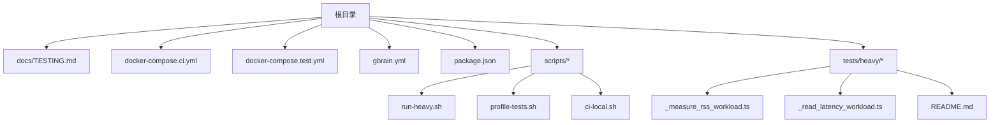
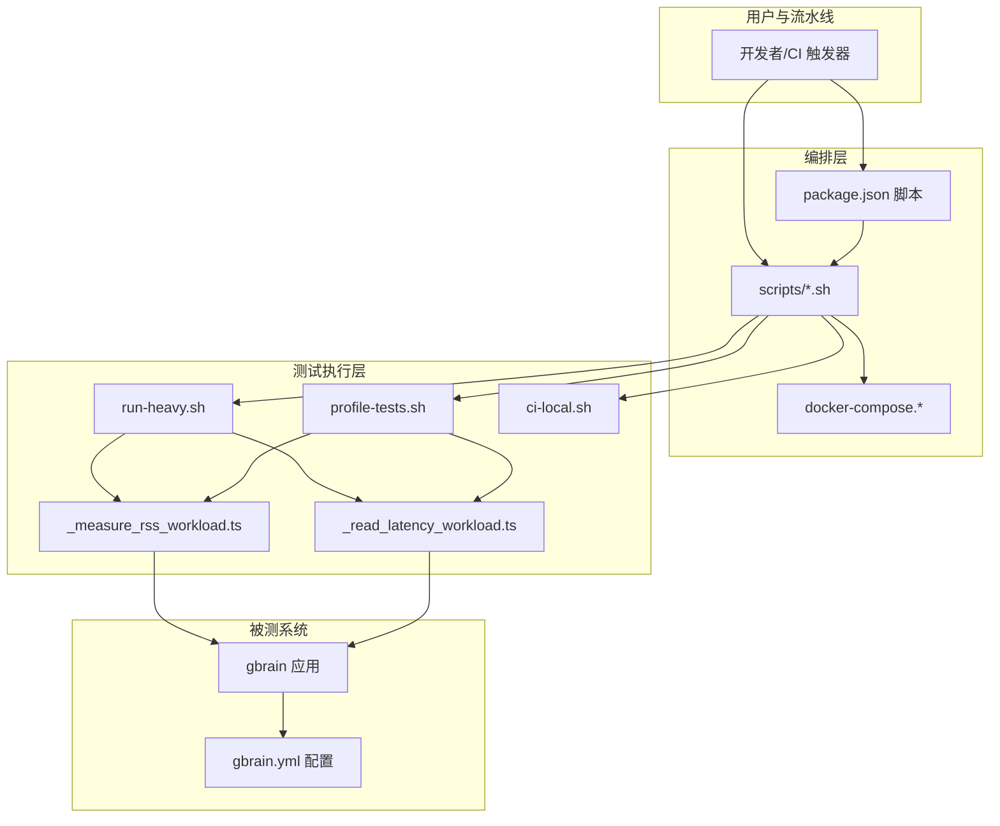
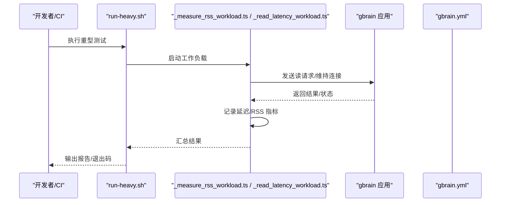
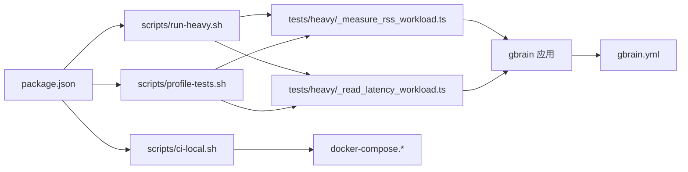

# 性能测试

<cite>
**本文引用的文件**   
- [README.md](file://README.md)
- [INSTALL.md](file://INSTALL.md)
- [TESTING.md](file://docs/TESTING.md)
- [docker-compose.ci.yml](file://docker-compose.ci.yml)
- [docker-compose.test.yml](file://docker-compose.test.yml)
- [gbrain.yml](file://gbrain.yml)
- [package.json](file://package.json)
- [scripts/run-heavy.sh](file://scripts/run-heavy.sh)
- [scripts/profile-tests.sh](file://scripts/profile-tests.sh)
- [scripts/ci-local.sh](file://scripts/ci-local.sh)
- [tests/heavy/_measure_rss_workload.ts](file://tests/heavy/_measure_rss_workload.ts)
- [tests/heavy/_read_latency_workload.ts](file://tests/heavy/_read_latency_workload.ts)
- [tests/heavy/README.md](file://tests/heavy/README.md)
- [scripts/run-slow-tests.sh](file://scripts/run-slow-tests.sh)
- [scripts/run-unit-parallel.sh](file://scripts/run-unit-parallel.sh)
- [scripts/test-shard.sh](file://scripts/test-shard.sh)
- [scripts/smoke-test.sh](file://scripts/smoke-test.sh)
</cite>

## 目录
1. [简介](#简介)
2. [项目结构](#项目结构)
3. [核心组件](#核心组件)
4. [架构总览](#架构总览)
5. [详细组件分析](#详细组件分析)
6. [依赖关系分析](#依赖关系分析)
7. [性能考量](#性能考量)
8. [故障排查指南](#故障排查指南)
9. [结论](#结论)
10. [附录](#附录)

## 简介
本文件面向性能基准、压力与稳定性测试的体系化落地，覆盖指标定义（响应时间、吞吐量、资源利用率）、测试类型（压力、负载、稳定性）、环境搭建（硬件、网络、数据规模）、自动化回归与阈值告警、瓶颈分析与调优建议，以及大规模数据集优化策略。文档同时结合仓库中已有的重型测试脚本与 CI 配置，给出可操作的实践路径。

## 项目结构
仓库中与性能相关的资产主要分布在以下位置：
- 顶层说明与安装指引：README.md、INSTALL.md
- 测试规范与说明：docs/TESTING.md
- CI/CD 编排：docker-compose.ci.yml、docker-compose.test.yml
- 应用配置：gbrain.yml
- 包管理与脚本入口：package.json、scripts/*
- 重型测试与基准：tests/heavy/*

图表来源
- [docs/TESTING.md](file://docs/TESTING.md)
- [docker-compose.ci.yml](file://docker-compose.ci.yml)
- [docker-compose.test.yml](file://docker-compose.test.yml)
- [gbrain.yml](file://gbrain.yml)
- [package.json](file://package.json)
- [scripts/run-heavy.sh](file://scripts/run-heavy.sh)
- [scripts/profile-tests.sh](file://scripts/profile-tests.sh)
- [scripts/ci-local.sh](file://scripts/ci-local.sh)
- [tests/heavy/_measure_rss_workload.ts](file://tests/heavy/_measure_rss_workload.ts)
- [tests/heavy/_read_latency_workload.ts](file://tests/heavy/_read_latency_workload.ts)
- [tests/heavy/README.md](file://tests/heavy/README.md)

章节来源
- [README.md](file://README.md)
- [INSTALL.md](file://INSTALL.md)
- [docs/TESTING.md](file://docs/TESTING.md)

## 核心组件
- 重型测试与基准套件
  - tests/heavy/_measure_rss_workload.ts：用于测量工作负载下的内存占用（RSS）变化趋势，适合评估长期运行的稳定性与内存泄漏风险。
  - tests/heavy/_read_latency_workload.ts：用于测量读路径延迟分布，适合评估查询/检索等关键路径的时延特性。
  - tests/heavy/README.md：对重型测试的使用说明与注意事项。
- 运行与编排脚本
  - scripts/run-heavy.sh：统一入口，便于在本地或 CI 中批量执行重型测试。
  - scripts/profile-tests.sh：提供测试性能剖析能力，辅助定位热点。
  - scripts/ci-local.sh：本地模拟 CI 流程，包含重型测试的执行片段。
- CI/CD 与容器编排
  - docker-compose.ci.yml：CI 环境的容器编排，定义服务、网络与资源约束。
  - docker-compose.test.yml：测试环境编排，便于隔离与复现。
- 应用与包管理
  - gbrain.yml：运行时配置项，影响并发、超时、缓存等性能相关行为。
  - package.json：脚本命令与依赖声明，作为 CLI 与工具链的统一入口。

章节来源
- [tests/heavy/_measure_rss_workload.ts](file://tests/heavy/_measure_rss_workload.ts)
- [tests/heavy/_read_latency_workload.ts](file://tests/heavy/_read_latency_workload.ts)
- [tests/heavy/README.md](file://tests/heavy/README.md)
- [scripts/run-heavy.sh](file://scripts/run-heavy.sh)
- [scripts/profile-tests.sh](file://scripts/profile-tests.sh)
- [scripts/ci-local.sh](file://scripts/ci-local.sh)
- [docker-compose.ci.yml](file://docker-compose.ci.yml)
- [docker-compose.test.yml](file://docker-compose.test.yml)
- [gbrain.yml](file://gbrain.yml)
- [package.json](file://package.json)

## 架构总览
下图展示性能测试在仓库中的整体协作关系：上层通过脚本与 CI 编排驱动底层重型测试用例，采集响应时间、吞吐与资源指标，并输出报告供回归判定与告警使用。

图表来源
- [docker-compose.ci.yml](file://docker-compose.ci.yml)
- [docker-compose.test.yml](file://docker-compose.test.yml)
- [scripts/run-heavy.sh](file://scripts/run-heavy.sh)
- [scripts/profile-tests.sh](file://scripts/profile-tests.sh)
- [scripts/ci-local.sh](file://scripts/ci-local.sh)
- [tests/heavy/_measure_rss_workload.ts](file://tests/heavy/_measure_rss_workload.ts)
- [tests/heavy/_read_latency_workload.ts](file://tests/heavy/_read_latency_workload.ts)
- [gbrain.yml](file://gbrain.yml)
- [package.json](file://package.json)

## 详细组件分析

### 重型测试套件（tests/heavy）
- 目标
  - 评估系统在真实或近似真实负载下的表现，包括延迟、吞吐、内存与 CPU 占用。
- 关键用例
  - _measure_rss_workload.ts：持续观测进程 RSS 变化，识别增长趋势与峰值。
  - _read_latency_workload.ts：构造读请求序列，统计 P50/P90/P99 延迟与错误率。
- 运行方式
  - 通过 run-heavy.sh 统一调度；也可在 CI 中由 ci-local.sh 触发。
- 产出
  - 原始时序数据（延迟、RSS 等），可用于生成报告与阈值对比。

图表来源
- [scripts/run-heavy.sh](file://scripts/run-heavy.sh)
- [tests/heavy/_measure_rss_workload.ts](file://tests/heavy/_measure_rss_workload.ts)
- [tests/heavy/_read_latency_workload.ts](file://tests/heavy/_read_latency_workload.ts)
- [gbrain.yml](file://gbrain.yml)

章节来源
- [tests/heavy/_measure_rss_workload.ts](file://tests/heavy/_measure_rss_workload.ts)
- [tests/heavy/_read_latency_workload.ts](file://tests/heavy/_read_latency_workload.ts)
- [tests/heavy/README.md](file://tests/heavy/README.md)
- [scripts/run-heavy.sh](file://scripts/run-heavy.sh)

### 性能剖析（scripts/profile-tests.sh）
- 目标
  - 在受控环境下对关键路径进行剖析，定位 CPU/IO/锁竞争等热点。
- 用法要点
  - 选择代表性用例集，开启剖析开关，收集火焰图或采样数据。
  - 结合 gbrain.yml 调整并发与超时，观察不同参数下的热点迁移。
- 输出
  - 剖析快照与聚合报告，用于迭代优化与回归比对。

章节来源
- [scripts/profile-tests.sh](file://scripts/profile-tests.sh)

### CI 集成与本地仿真（scripts/ci-local.sh）
- 目标
  - 在本地复现 CI 行为，确保重型测试与常规测试的一致性。
- 关键点
  - 复用 docker-compose.* 的环境与服务拓扑。
  - 在 CI 阶段自动执行重型测试，并将结果持久化以便后续对比。

章节来源
- [scripts/ci-local.sh](file://scripts/ci-local.sh)
- [docker-compose.ci.yml](file://docker-compose.ci.yml)
- [docker-compose.test.yml](file://docker-compose.test.yml)

### 慢测与并行执行（scripts/run-slow-tests.sh、scripts/run-unit-parallel.sh、scripts/test-shard.sh）
- 目标
  - 将耗时较长的测试分离到独立通道，避免阻塞主流程。
  - 通过分片与并行提升整体吞吐，缩短反馈周期。
- 适用场景
  - 长尾用例、外部依赖较多的端到端用例、大数据量导入/同步类用例。

章节来源
- [scripts/run-slow-tests.sh](file://scripts/run-slow-tests.sh)
- [scripts/run-unit-parallel.sh](file://scripts/run-unit-parallel.sh)
- [scripts/test-shard.sh](file://scripts/test-shard.sh)

### 冒烟测试（scripts/smoke-test.sh）
- 目标
  - 快速验证核心链路可用性与基本性能是否退化。
- 特点
  - 轻量、快速、覆盖面聚焦，适合作为每次构建的准入检查。

章节来源
- [scripts/smoke-test.sh](file://scripts/smoke-test.sh)

## 依赖关系分析
- 脚本与用例
  - run-heavy.sh 依赖 *_workload.ts 的具体实现，并通过环境变量或配置文件控制负载强度与时长。
  - profile-tests.sh 依赖语言运行时剖析工具与产物解析器。
- 环境与配置
  - docker-compose.* 定义数据库、向量索引、缓存等依赖服务的版本与资源限制。
  - gbrain.yml 决定并发度、批大小、超时、重试等关键性能参数。
- 包管理
  - package.json 暴露统一命令，屏蔽底层差异，便于跨平台执行。

图表来源
- [package.json](file://package.json)
- [scripts/run-heavy.sh](file://scripts/run-heavy.sh)
- [scripts/profile-tests.sh](file://scripts/profile-tests.sh)
- [scripts/ci-local.sh](file://scripts/ci-local.sh)
- [tests/heavy/_measure_rss_workload.ts](file://tests/heavy/_measure_rss_workload.ts)
- [tests/heavy/_read_latency_workload.ts](file://tests/heavy/_read_latency_workload.ts)
- [docker-compose.ci.yml](file://docker-compose.ci.yml)
- [docker-compose.test.yml](file://docker-compose.test.yml)
- [gbrain.yml](file://gbrain.yml)

章节来源
- [package.json](file://package.json)
- [docker-compose.ci.yml](file://docker-compose.ci.yml)
- [docker-compose.test.yml](file://docker-compose.test.yml)
- [gbrain.yml](file://gbrain.yml)

## 性能考量
- 指标定义
  - 响应时间：P50/P90/P99 延迟，关注尾部延迟与抖动。
  - 吞吐量：单位时间成功处理请求数，区分读/写与不同操作类型。
  - 资源利用率：CPU、内存（RSS）、磁盘 I/O、网络带宽与连接池占用。
  - 错误率：超时、拒绝、重试与失败比例。
- 测试类型与方法
  - 压力测试：逐步加压直至系统饱和，记录拐点与降级行为。
  - 负载测试：以目标 SLA 为约束的稳态负载，验证达标情况。
  - 稳定性测试：长时间运行（如 24h+），监控资源漂移与泄漏。
- 环境要求
  - 硬件：CPU 核数、内存容量、磁盘类型（NVMe/SSD）、网卡带宽需与生产相近或按比例缩放。
  - 网络：低内网延迟、稳定带宽，必要时引入可控丢包/抖动以模拟异常。
  - 数据规模：按生产比例准备种子数据，覆盖冷热访问模式与倾斜分布。
- 自动化回归与阈值告警
  - 在 CI 中固定执行重型测试，比较本次与基线的 P99 延迟、吞吐与 RSS 曲线。
  - 设置阈值（如 P99 上升超过 X%、RSS 持续增长、错误率超 Y%），失败即阻断合并或触发告警。
- 瓶颈分析与调优建议
  - 使用 profile-tests.sh 定位热点函数与调用栈，结合系统级工具（CPU/内存/IO）交叉验证。
  - 调整 gbrain.yml 的并发、批大小、超时与重试策略，观察指标改善幅度。
  - 针对 IO 密集路径，考虑异步化、缓冲与预取；针对 CPU 密集路径，减少序列化/反序列化与对象分配。
- 大规模数据集优化策略
  - 分层存储与冷热分离，降低热点页压力。
  - 向量化与索引优化，减少扫描范围与重排成本。
  - 读写分离与只读副本，提升查询吞吐。
  - 增量更新与批处理，降低全量重建开销。

[本节为通用指导，不直接分析具体文件]

## 故障排查指南
- 常见问题
  - 资源不足：内存溢出、CPU 打满、磁盘 IO 瓶颈。
  - 网络问题：连接池耗尽、上游限流、DNS 解析缓慢。
  - 数据倾斜：热点键导致局部过载。
- 排查步骤
  - 使用 profile-tests.sh 生成剖析快照，定位热点。
  - 在 CI 中回放相同负载，确认是否为偶发问题。
  - 调整 gbrain.yml 参数，观察指标变化，缩小问题域。
  - 结合系统监控（CPU/内存/IO/网络）与日志，定位根因。
- 回归检测
  - 将重型测试结果纳入基线库，提交变更时自动对比。
  - 若关键指标越界，阻断合并并通知责任人。

章节来源
- [scripts/profile-tests.sh](file://scripts/profile-tests.sh)
- [scripts/ci-local.sh](file://scripts/ci-local.sh)
- [gbrain.yml](file://gbrain.yml)

## 结论
通过将重型测试、剖析与 CI 集成形成闭环，可在早期发现性能退化与回归，保障系统在规模化场景下的稳定性与效率。建议持续完善指标基线与阈值策略，沉淀调优经验，推动工程化落地。

[本节为总结性内容，不直接分析具体文件]

## 附录
- 参考与入口
  - README.md：项目概览与快速上手。
  - INSTALL.md：安装与环境准备。
  - docs/TESTING.md：测试规范与最佳实践。
  - package.json：脚本命令与依赖。
  - docker-compose.ci.yml / docker-compose.test.yml：CI 与测试环境编排。
  - gbrain.yml：运行时配置项。
  - scripts/run-heavy.sh / scripts/profile-tests.sh / scripts/ci-local.sh：性能测试与剖析入口。
  - tests/heavy/*：重型测试用例与说明。

章节来源
- [README.md](file://README.md)
- [INSTALL.md](file://INSTALL.md)
- [docs/TESTING.md](file://docs/TESTING.md)
- [package.json](file://package.json)
- [docker-compose.ci.yml](file://docker-compose.ci.yml)
- [docker-compose.test.yml](file://docker-compose.test.yml)
- [gbrain.yml](file://gbrain.yml)
- [scripts/run-heavy.sh](file://scripts/run-heavy.sh)
- [scripts/profile-tests.sh](file://scripts/profile-tests.sh)
- [scripts/ci-local.sh](file://scripts/ci-local.sh)
- [tests/heavy/_measure_rss_workload.ts](file://tests/heavy/_measure_rss_workload.ts)
- [tests/heavy/_read_latency_workload.ts](file://tests/heavy/_read_latency_workload.ts)
- [tests/heavy/README.md](file://tests/heavy/README.md)