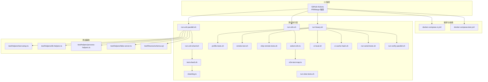
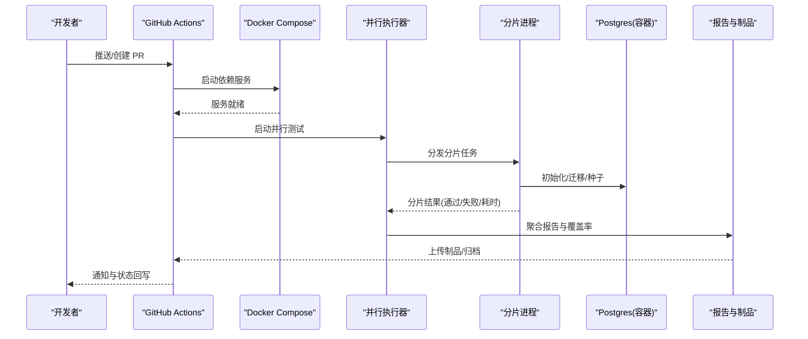
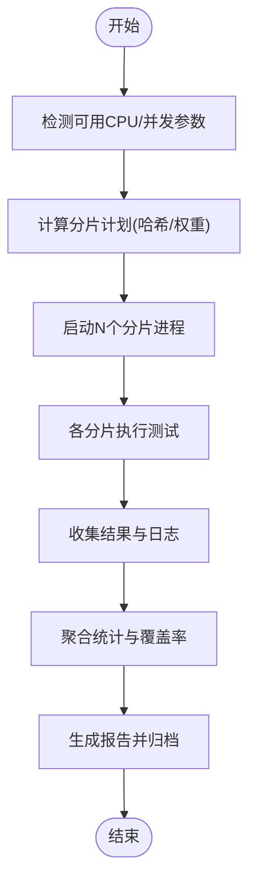
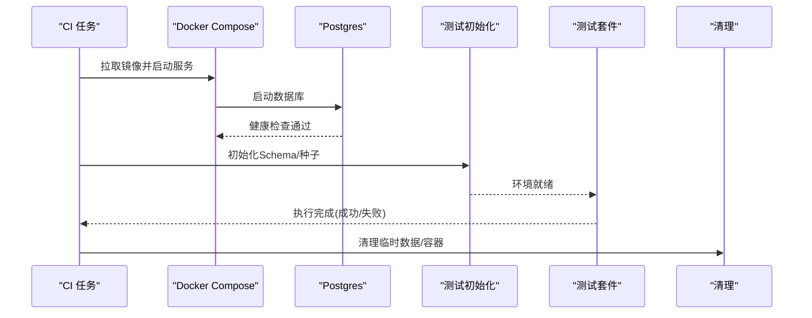
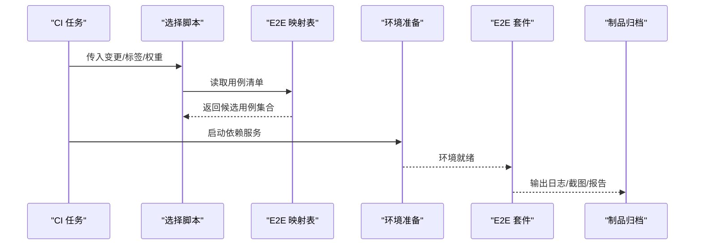
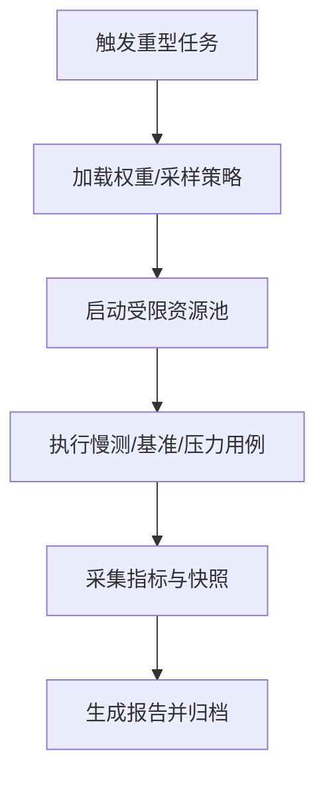
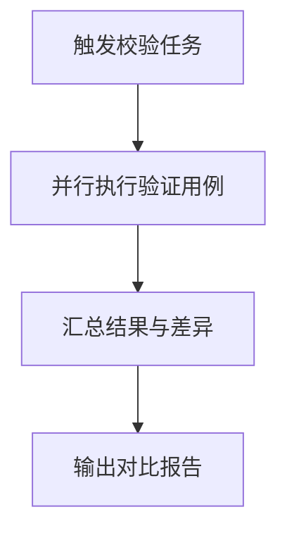
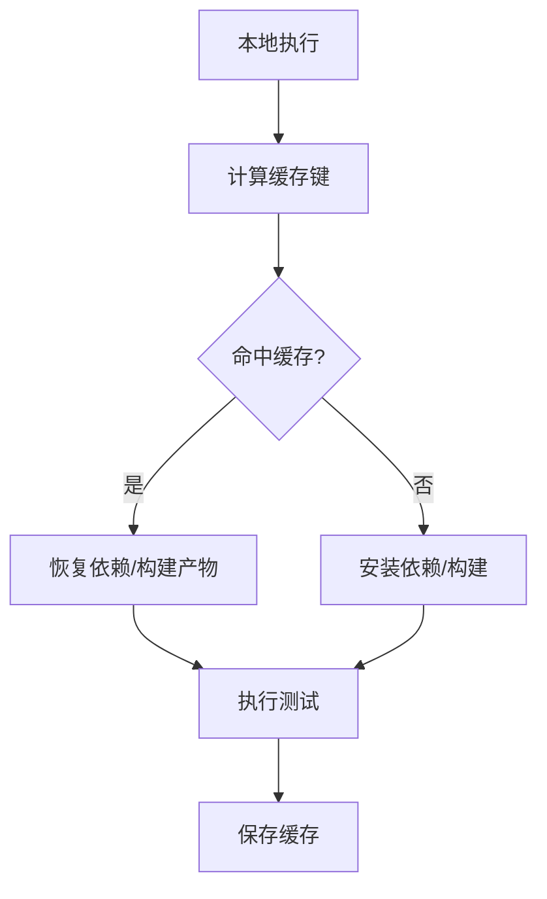
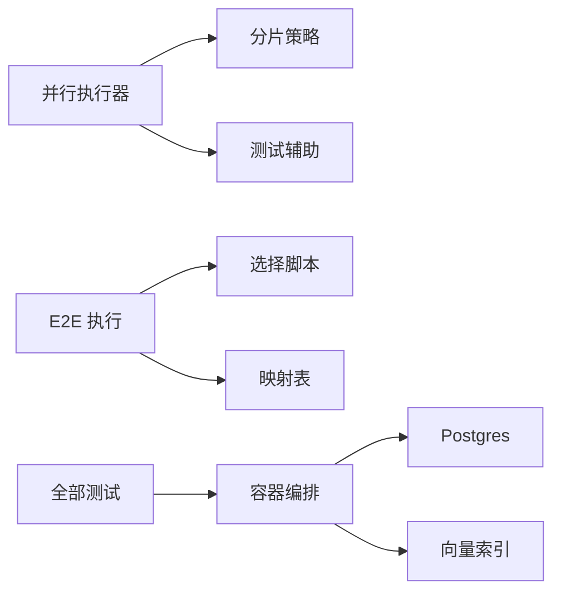

# 测试自动化

<cite>
**本文引用的文件**   
- [package.json](file://package.json)
- [bunfig.toml](file://bunfig.toml)
- [docker-compose.ci.yml](file://docker-compose.ci.yml)
- [docker-compose.test.yml](file://docker-compose.test.yml)
- [.github/workflows/ci.yml](file://.github/workflows/ci.yml)
- [scripts/run-unit-parallel.sh](file://scripts/run-unit-parallel.sh)
- [scripts/run-unit-shard.sh](file://scripts/run-unit-shard.sh)
- [scripts/test-shard.sh](file://scripts/test-shard.sh)
- [scripts/sharding.ts](file://scripts/sharding.ts)
- [scripts/run-e2e.sh](file://scripts/run-e2e.sh)
- [scripts/run-heavy.sh](file://scripts/run-heavy.sh)
- [scripts/run-slow-tests.sh](file://scripts/run-slow-tests.sh)
- [scripts/profile-tests.sh](file://scripts/profile-tests.sh)
- [scripts/smoke-test.sh](file://scripts/smoke-test.sh)
- [scripts/ship-remote-tests.sh](file://scripts/ship-remote-tests.sh)
- [scripts/e2e-test-map.ts](file://scripts/e2e-test-map.ts)
- [scripts/select-e2e.ts](file://scripts/select-e2e.ts)
- [scripts/ci-local.sh](file://scripts/ci-local.sh)
- [scripts/ci-cache-hash.sh](file://scripts/ci-cache-hash.sh)
- [scripts/run-serial-tests.sh](file://scripts/run-serial-tests.sh)
- [scripts/run-verify-parallel.sh](file://scripts/run-verify-parallel.sh)
- [test/helpers/test-setup.ts](file://test/helpers/test-setup.ts)
- [test/helpers/db-helpers.ts](file://test/helpers/db-helpers.ts)
- [test/helpers/process-helpers.ts](file://test/helpers/process-helpers.ts)
- [test/helpers/fake-server.ts](file://test/helpers/fake-server.ts)
- [test/fixtures/schema.sql](file://test/fixtures/schema.sql)
- [docs/TESTING.md](file://docs/TESTING.md)
</cite>

## 目录
1. [简介](#简介)
2. [项目结构](#项目结构)
3. [核心组件](#核心组件)
4. [架构总览](#架构总览)
5. [详细组件分析](#详细组件分析)
6. [依赖关系分析](#依赖关系分析)
7. [性能考量](#性能考量)
8. [故障排查指南](#故障排查指南)
9. [结论](#结论)
10. [附录](#附录)

## 简介
本文件面向持续集成与测试自动化，系统性说明代码提交触发、并行测试执行策略（分片、负载均衡、故障恢复）、测试环境自动化部署与管理（数据库初始化、服务启动与清理）、测试报告自动生成与归档、失败通知与告警配置，以及测试性能监控与优化建议。文档同时提供可操作的流水线设计与脚本使用指引，帮助团队在本地与 CI 环境中稳定、高效地运行单元测试、E2E 测试与重型测试。

## 项目结构
仓库围绕“脚本 + 容器 + CI 工作流”的方式组织测试自动化：
- 根级脚本：负责并行、分片、选择测试集、慢测与重测、性能剖析等
- 容器编排：为 CI 与测试提供 Postgres、向量索引等依赖服务
- GitHub Actions：定义 PR/Merge 触发的构建与测试任务
- 测试辅助：统一的测试启动、数据库工具、进程管理、模拟服务等
- 文档：测试策略与最佳实践说明

图表来源
- [.github/workflows/ci.yml:1-200](file://.github/workflows/ci.yml#L1-L200)
- [docker-compose.ci.yml:1-200](file://docker-compose.ci.yml#L1-L200)
- [docker-compose.test.yml:1-200](file://docker-compose.test.yml#L1-L200)
- [scripts/run-unit-parallel.sh:1-200](file://scripts/run-unit-parallel.sh#L1-L200)
- [scripts/run-unit-shard.sh:1-200](file://scripts/run-unit-shard.sh#L1-L200)
- [scripts/test-shard.sh:1-200](file://scripts/test-shard.sh#L1-L200)
- [scripts/sharding.ts:1-200](file://scripts/sharding.ts#L1-L200)
- [scripts/run-e2e.sh:1-200](file://scripts/run-e2e.sh#L1-L200)
- [scripts/run-heavy.sh:1-200](file://scripts/run-heavy.sh#L1-L200)
- [scripts/run-slow-tests.sh:1-200](file://scripts/run-slow-tests.sh#L1-L200)
- [scripts/profile-tests.sh:1-200](file://scripts/profile-tests.sh#L1-L200)
- [scripts/smoke-test.sh:1-200](file://scripts/smoke-test.sh#L1-L200)
- [scripts/ship-remote-tests.sh:1-200](file://scripts/ship-remote-tests.sh#L1-L200)
- [scripts/select-e2e.ts:1-200](file://scripts/select-e2e.ts#L1-L200)
- [scripts/e2e-test-map.ts:1-200](file://scripts/e2e-test-map.ts#L1-L200)
- [scripts/ci-local.sh:1-200](file://scripts/ci-local.sh#L1-L200)
- [scripts/ci-cache-hash.sh:1-200](file://scripts/ci-cache-hash.sh#L1-L200)
- [scripts/run-serial-tests.sh:1-200](file://scripts/run-serial-tests.sh#L1-L200)
- [scripts/run-verify-parallel.sh:1-200](file://scripts/run-verify-parallel.sh#L1-L200)
- [test/helpers/test-setup.ts:1-200](file://test/helpers/test-setup.ts#L1-L200)
- [test/helpers/db-helpers.ts:1-200](file://test/helpers/db-helpers.ts#L1-L200)
- [test/helpers/process-helpers.ts:1-200](file://test/helpers/process-helpers.ts#L1-L200)
- [test/helpers/fake-server.ts:1-200](file://test/helpers/fake-server.ts#L1-L200)
- [test/fixtures/schema.sql:1-200](file://test/fixtures/schema.sql#L1-L200)

章节来源
- [package.json:1-200](file://package.json#L1-L200)
- [bunfig.toml:1-200](file://bunfig.toml#L1-L200)
- [docs/TESTING.md:1-200](file://docs/TESTING.md#L1-L200)

## 核心组件
- 并行与分片执行器
  - 并行入口：按 CPU 核数或指定并发度启动多个分片进程
  - 分片策略：基于哈希将测试用例均匀分配到各分片，支持权重与动态调整
  - 结果聚合：汇总各分片退出码与覆盖率，输出统一报告
- 测试环境编排
  - 通过 docker-compose 拉起 Postgres 及可选的向量索引服务
  - 测试前初始化数据库 schema 与种子数据，测试后清理临时资源
- 测试类型与选择
  - 单元/集成/E2E/慢测/重型测试分类，支持按标签或映射表选择子集
- 报告与归档
  - 生成结构化测试结果与覆盖率，上传至制品库或持久化存储
- 通知与告警
  - 根据任务状态发送消息到协作平台，附带失败摘要与链接

章节来源
- [scripts/run-unit-parallel.sh:1-200](file://scripts/run-unit-parallel.sh#L1-L200)
- [scripts/run-unit-shard.sh:1-200](file://scripts/run-unit-shard.sh#L1-L200)
- [scripts/test-shard.sh:1-200](file://scripts/test-shard.sh#L1-L200)
- [scripts/sharding.ts:1-200](file://scripts/sharding.ts#L1-L200)
- [docker-compose.ci.yml:1-200](file://docker-compose.ci.yml#L1-L200)
- [docker-compose.test.yml:1-200](file://docker-compose.test.yml#L1-L200)
- [scripts/run-e2e.sh:1-200](file://scripts/run-e2e.sh#L1-L200)
- [scripts/run-heavy.sh:1-200](file://scripts/run-heavy.sh#L1-L200)
- [scripts/profile-tests.sh:1-200](file://scripts/profile-tests.sh#L1-L200)
- [scripts/smoke-test.sh:1-200](file://scripts/smoke-test.sh#L1-L200)
- [scripts/ship-remote-tests.sh:1-200](file://scripts/ship-remote-tests.sh#L1-L200)
- [scripts/select-e2e.ts:1-200](file://scripts/select-e2e.ts#L1-L200)
- [scripts/e2e-test-map.ts:1-200](file://scripts/e2e-test-map.ts#L1-L200)
- [test/helpers/db-helpers.ts:1-200](file://test/helpers/db-helpers.ts#L1-L200)
- [test/helpers/test-setup.ts:1-200](file://test/helpers/test-setup.ts#L1-L200)

## 架构总览
下图展示从代码提交到测试反馈的端到端流程，包括并行分片、环境准备、执行与报告归档。

图表来源
- [.github/workflows/ci.yml:1-200](file://.github/workflows/ci.yml#L1-L200)
- [docker-compose.ci.yml:1-200](file://docker-compose.ci.yml#L1-L200)
- [scripts/run-unit-parallel.sh:1-200](file://scripts/run-unit-parallel.sh#L1-L200)
- [scripts/run-unit-shard.sh:1-200](file://scripts/run-unit-shard.sh#L1-L200)
- [scripts/test-shard.sh:1-200](file://scripts/test-shard.sh#L1-L200)
- [scripts/sharding.ts:1-200](file://scripts/sharding.ts#L1-L200)
- [test/helpers/db-helpers.ts:1-200](file://test/helpers/db-helpers.ts#L1-L200)

## 详细组件分析

### 并行与分片执行器
- 并行入口
  - 根据环境变量或默认策略计算并发度，启动若干分片进程
  - 捕获每个分片的 stdout/stderr 与退出码，超时保护与重试
- 分片策略
  - 基于测试路径/名称哈希进行均衡分配，支持权重文件与动态再平衡
  - 支持跳过已知不稳定用例或按标签过滤
- 结果聚合
  - 汇总各分片通过率、失败用例、耗时分布与覆盖率
  - 输出结构化报告并归档

图表来源
- [scripts/run-unit-parallel.sh:1-200](file://scripts/run-unit-parallel.sh#L1-L200)
- [scripts/run-unit-shard.sh:1-200](file://scripts/run-unit-shard.sh#L1-L200)
- [scripts/test-shard.sh:1-200](file://scripts/test-shard.sh#L1-L200)
- [scripts/sharding.ts:1-200](file://scripts/sharding.ts#L1-L200)

章节来源
- [scripts/run-unit-parallel.sh:1-200](file://scripts/run-unit-parallel.sh#L1-L200)
- [scripts/run-unit-shard.sh:1-200](file://scripts/run-unit-shard.sh#L1-L200)
- [scripts/test-shard.sh:1-200](file://scripts/test-shard.sh#L1-L200)
- [scripts/sharding.ts:1-200](file://scripts/sharding.ts#L1-L200)

### 测试环境自动化部署与管理
- 依赖服务
  - 使用 docker-compose 启动 Postgres 与可选向量索引服务
  - 健康检查确保服务就绪后再执行测试
- 数据库初始化
  - 测试前执行 schema 初始化与种子数据注入
  - 测试后清理临时数据与中间产物，保证隔离性
- 进程与服务管理
  - 启动/停止外部服务（如 Mock 服务器）
  - 进程生命周期钩子用于资源回收与错误诊断

图表来源
- [docker-compose.ci.yml:1-200](file://docker-compose.ci.yml#L1-L200)
- [docker-compose.test.yml:1-200](file://docker-compose.test.yml#L1-L200)
- [test/helpers/db-helpers.ts:1-200](file://test/helpers/db-helpers.ts#L1-L200)
- [test/helpers/test-setup.ts:1-200](file://test/helpers/test-setup.ts#L1-L200)
- [test/helpers/process-helpers.ts:1-200](file://test/helpers/process-helpers.ts#L1-L200)
- [test/helpers/fake-server.ts:1-200](file://test/helpers/fake-server.ts#L1-L200)
- [test/fixtures/schema.sql:1-200](file://test/fixtures/schema.sql#L1-L200)

章节来源
- [docker-compose.ci.yml:1-200](file://docker-compose.ci.yml#L1-L200)
- [docker-compose.test.yml:1-200](file://docker-compose.test.yml#L1-L200)
- [test/helpers/db-helpers.ts:1-200](file://test/helpers/db-helpers.ts#L1-L200)
- [test/helpers/test-setup.ts:1-200](file://test/helpers/test-setup.ts#L1-L200)
- [test/helpers/process-helpers.ts:1-200](file://test/helpers/process-helpers.ts#L1-L200)
- [test/helpers/fake-server.ts:1-200](file://test/helpers/fake-server.ts#L1-L200)
- [test/fixtures/schema.sql:1-200](file://test/fixtures/schema.sql#L1-L200)

### E2E 测试选择与执行
- 选择策略
  - 基于映射表与选择脚本筛选需要执行的 E2E 用例
  - 支持按变更范围、标签或权重选择子集
- 执行流程
  - 启动必要的外部依赖（如 API 网关、Mock 服务）
  - 顺序或并行执行选定的 E2E 用例，记录断言与截图/日志
  - 失败时保留现场以便复现

图表来源
- [scripts/select-e2e.ts:1-200](file://scripts/select-e2e.ts#L1-L200)
- [scripts/e2e-test-map.ts:1-200](file://scripts/e2e-test-map.ts#L1-L200)
- [scripts/run-e2e.sh:1-200](file://scripts/run-e2e.sh#L1-L200)

章节来源
- [scripts/select-e2e.ts:1-200](file://scripts/select-e2e.ts#L1-L200)
- [scripts/e2e-test-map.ts:1-200](file://scripts/e2e-test-map.ts#L1-L200)
- [scripts/run-e2e.sh:1-200](file://scripts/run-e2e.sh#L1-L200)

### 慢测与重型测试
- 慢测
  - 单独执行标记为慢的用例，避免阻塞快速反馈
- 重型测试
  - 独立任务执行，包含性能基准、压力测试与稳定性验证
  - 支持采样与限流，防止资源耗尽
- 冒烟与远程测试
  - 冒烟测试快速验证关键路径
  - 远程测试将用例打包发送到远端执行，便于跨环境验证

图表来源
- [scripts/run-heavy.sh:1-200](file://scripts/run-heavy.sh#L1-L200)
- [scripts/run-slow-tests.sh:1-200](file://scripts/run-slow-tests.sh#L1-L200)
- [scripts/profile-tests.sh:1-200](file://scripts/profile-tests.sh#L1-L200)
- [scripts/smoke-test.sh:1-200](file://scripts/smoke-test.sh#L1-L200)
- [scripts/ship-remote-tests.sh:1-200](file://scripts/ship-remote-tests.sh#L1-L200)

章节来源
- [scripts/run-heavy.sh:1-200](file://scripts/run-heavy.sh#L1-L200)
- [scripts/run-slow-tests.sh:1-200](file://scripts/run-slow-tests.sh#L1-L200)
- [scripts/profile-tests.sh:1-200](file://scripts/profile-tests.sh#L1-L200)
- [scripts/smoke-test.sh:1-200](file://scripts/smoke-test.sh#L1-L200)
- [scripts/ship-remote-tests.sh:1-200](file://scripts/ship-remote-tests.sh#L1-L200)

### 串行与校验任务
- 串行任务
  - 对存在共享状态或强顺序要求的用例采用串行执行，避免竞争条件
- 校验任务
  - 并行执行验证类用例，聚焦契约与兼容性检查

图表来源
- [scripts/run-serial-tests.sh:1-200](file://scripts/run-serial-tests.sh#L1-L200)
- [scripts/run-verify-parallel.sh:1-200](file://scripts/run-verify-parallel.sh#L1-L200)

章节来源
- [scripts/run-serial-tests.sh:1-200](file://scripts/run-serial-tests.sh#L1-L200)
- [scripts/run-verify-parallel.sh:1-200](file://scripts/run-verify-parallel.sh#L1-L200)

### 本地 CI 与缓存
- 本地 CI
  - 在本地模拟 CI 环境，复用相同脚本与配置，提升一致性
- 缓存
  - 基于依赖与构建产物哈希命中缓存，缩短冷启动时间

图表来源
- [scripts/ci-local.sh:1-200](file://scripts/ci-local.sh#L1-L200)
- [scripts/ci-cache-hash.sh:1-200](file://scripts/ci-cache-hash.sh#L1-L200)

章节来源
- [scripts/ci-local.sh:1-200](file://scripts/ci-local.sh#L1-L200)
- [scripts/ci-cache-hash.sh:1-200](file://scripts/ci-cache-hash.sh#L1-L200)

## 依赖关系分析
- 组件耦合
  - 并行执行器依赖分片策略与测试辅助；E2E 执行依赖选择脚本与映射表
  - 所有测试均依赖容器编排提供的数据库与外部服务
- 外部依赖
  - Postgres、向量索引服务、Mock 服务、制品存储
- 潜在循环依赖
  - 通过脚本分层与职责分离避免循环调用

图表来源
- [scripts/run-unit-parallel.sh:1-200](file://scripts/run-unit-parallel.sh#L1-L200)
- [scripts/sharding.ts:1-200](file://scripts/sharding.ts#L1-L200)
- [scripts/run-e2e.sh:1-200](file://scripts/run-e2e.sh#L1-L200)
- [scripts/select-e2e.ts:1-200](file://scripts/select-e2e.ts#L1-L200)
- [scripts/e2e-test-map.ts:1-200](file://scripts/e2e-test-map.ts#L1-L200)
- [docker-compose.ci.yml:1-200](file://docker-compose.ci.yml#L1-L200)
- [docker-compose.test.yml:1-200](file://docker-compose.test.yml#L1-L200)

章节来源
- [scripts/run-unit-parallel.sh:1-200](file://scripts/run-unit-parallel.sh#L1-L200)
- [scripts/sharding.ts:1-200](file://scripts/sharding.ts#L1-L200)
- [scripts/run-e2e.sh:1-200](file://scripts/run-e2e.sh#L1-L200)
- [scripts/select-e2e.ts:1-200](file://scripts/select-e2e.ts#L1-L200)
- [scripts/e2e-test-map.ts:1-200](file://scripts/e2e-test-map.ts#L1-L200)
- [docker-compose.ci.yml:1-200](file://docker-compose.ci.yml#L1-L200)
- [docker-compose.test.yml:1-200](file://docker-compose.test.yml#L1-L200)

## 性能考量
- 并行度调优
  - 根据 CPU 核数与 I/O 特征设置合理并发度，避免上下文切换开销过大
- 分片均衡
  - 使用哈希与权重降低长尾效应，必要时引入动态再平衡
- 资源限制
  - 为重型测试设置内存/CPU上限与超时，防止资源耗尽
- 缓存利用
  - 依赖与构建产物缓存命中率直接影响冷启动时间
- 报告与覆盖
  - 增量覆盖率与并行合并减少 IO 瓶颈

[本节为通用指导，不直接分析具体文件]

## 故障排查指南
- 常见失败定位
  - 查看分片日志与聚合报告，定位失败用例与堆栈
  - 检查数据库连接与健康状态，确认初始化是否成功
  - 核对外部服务可用性（端口、鉴权、网络策略）
- 环境与资源
  - 确认容器资源配额与磁盘空间
  - 检查超时与重试策略是否合理
- 复现与回归
  - 使用本地 CI 脚本复现问题
  - 保留现场制品与快照，便于后续分析

章节来源
- [scripts/run-unit-parallel.sh:1-200](file://scripts/run-unit-parallel.sh#L1-L200)
- [scripts/run-unit-shard.sh:1-200](file://scripts/run-unit-shard.sh#L1-L200)
- [scripts/test-shard.sh:1-200](file://scripts/test-shard.sh#L1-L200)
- [test/helpers/db-helpers.ts:1-200](file://test/helpers/db-helpers.ts#L1-L200)
- [test/helpers/process-helpers.ts:1-200](file://test/helpers/process-helpers.ts#L1-L200)

## 结论
通过“并行分片 + 容器编排 + 选择策略 + 报告归档 + 通知告警”的组合，本项目实现了高吞吐、高可靠且可观测的测试自动化体系。建议在持续演进中关注分片均衡、资源限制与缓存优化，并结合性能监控与告警机制进一步提升稳定性与效率。

[本节为总结，不直接分析具体文件]

## 附录
- 快速参考
  - 并行执行：使用并行入口脚本，自动分片与聚合
  - E2E 执行：通过选择脚本与映射表控制用例范围
  - 慢测与重型测试：独立任务执行，配合限流与采样
  - 本地 CI：复用 CI 脚本与配置，保持一致性
- 最佳实践
  - 用例隔离：避免共享状态，优先使用事务与临时数据
  - 失败重试：对网络与外部依赖增加有限重试
  - 报告归档：保留关键日志、截图与覆盖率，便于回溯

[本节为补充信息，不直接分析具体文件]