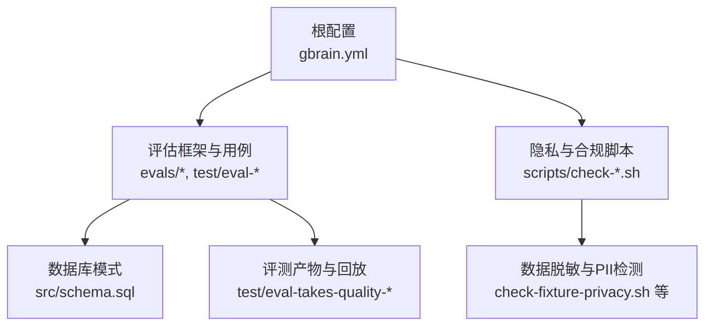
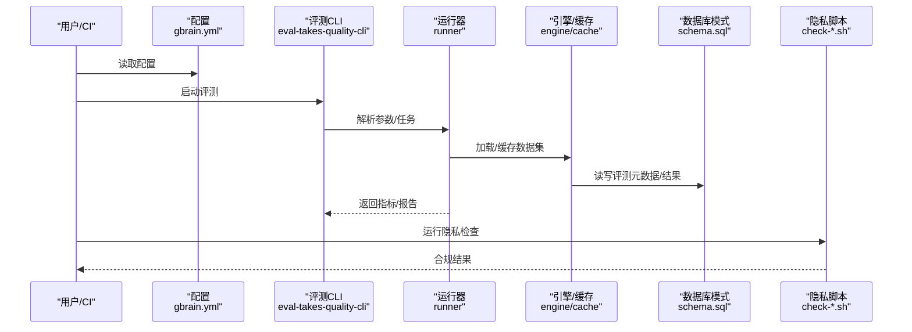
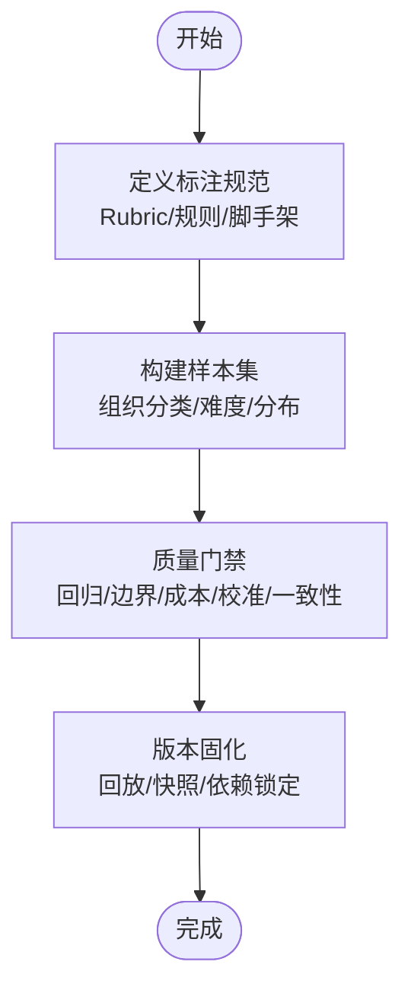
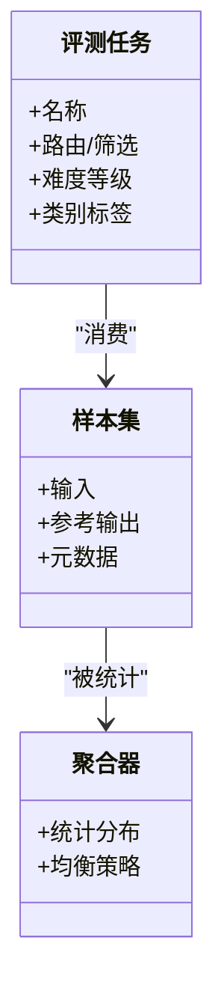
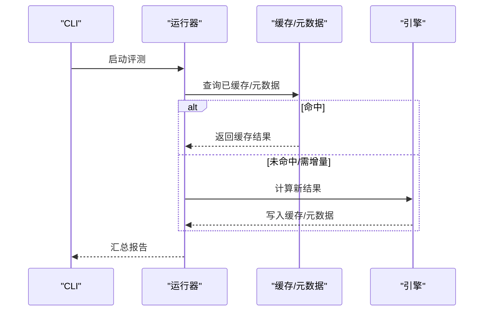
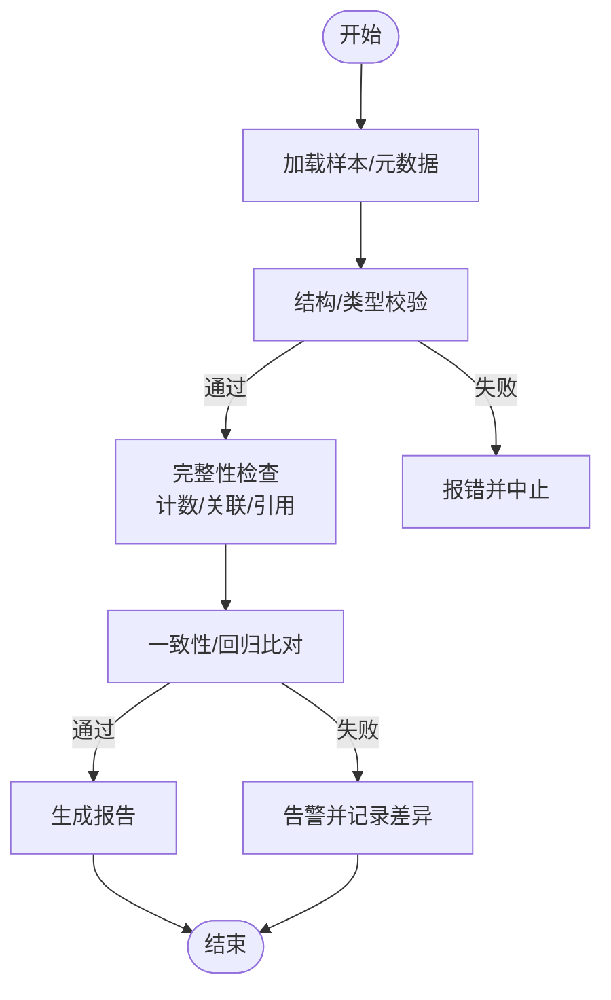
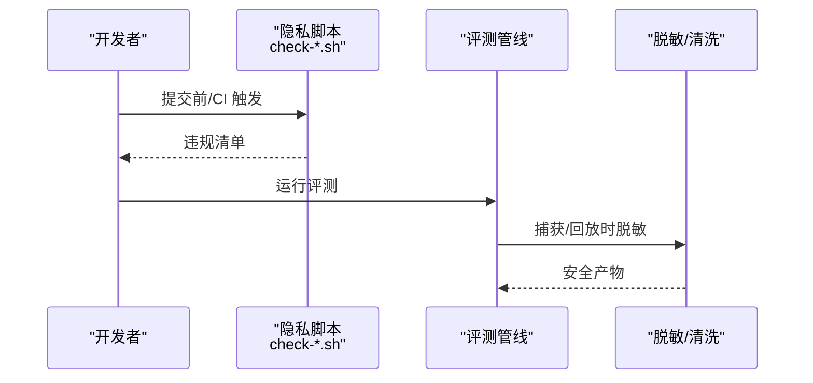
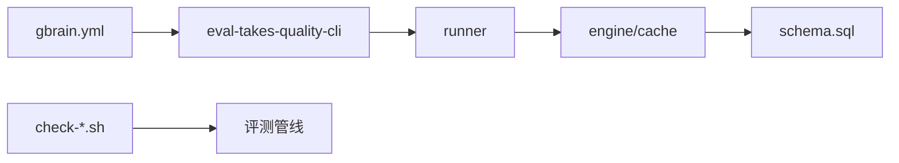

# 数据集管理

<cite>
**本文引用的文件**   
- [README.md](file://README.md)
- [gbrain.yml](file://gbrain.yml)
- [src/schema.sql](file://src/schema.sql)
- [scripts/check-fixture-privacy.sh](file://scripts/check-fixture-privacy.sh)
- [scripts/check-no-pii-in-agent-voice.sh](file://scripts/check-no-pii-in-agent-voice.sh)
- [scripts/check-proposal-pii.sh](file://scripts/check-proposal-pii.sh)
- [scripts/check-synthetic-corpus-privacy.sh](file://scripts/check-synthetic-corpus-privacy.sh)
- [scripts/check-privacy.sh](file://scripts/check-privacy.sh)
- [test/eval-capture.test.ts](file://test/eval-capture.test.ts)
- [test/eval-capture-drain.test.ts](file://test/eval-capture-drain.test.ts)
- [test/eval-capture-scrub.test.ts](file://test/eval-capture-scrub.test.ts)
- [test/eval-contradictions-fixture-redact.test.ts](file://test/eval-contradictions-fixture-redact.test.ts)
- [test/eval-takes-quality-cli.test.ts](file://test/eval-takes-quality-cli.test.ts)
- [test/eval-takes-quality-runner.serial.test.ts](file://test/eval-takes-quality-runner.serial.test.ts)
- [test/eval-takes-quality-rubric.test.ts](file://test/eval-takes-quality-rubric.test.ts)
- [test/eval-takes-quality-replay.test.ts](file://test/eval-takes-quality-replay.test.ts)
- [test/eval-takes-quality-aggregate.test.ts](file://test/eval-takes-quality-aggregate.test.ts)
- [test/eval-takes-quality-boundaries.test.ts](file://test/eval-takes-quality-boundaries.test.ts)
- [test/eval-takes-quality-pricing.test.ts](file://test/eval-takes-quality-pricing.test.ts)
- [test/eval-takes-quality-regress.test.ts](file://test/eval-takes-quality-regress.test.ts)
- [test/eval-takes-quality-receipt-name.test.ts](file://test/eval-takes-quality-receipt-name.test.ts)
- [test/eval-takes-quality-write.test.ts](file://test/eval-takes-quality-write.test.ts)
- [test/eval-takes-quality-trend.test.ts](file://test/eval-takes-quality-trend.test.ts)
- [test/eval-takes-quality-judge-errors.test.ts](file://test/eval-takes-quality-judge-errors.test.ts)
- [test/eval-takes-quality-integrations.test.ts](file://test/eval-takes-quality-integrations.test.ts)
- [test/eval-takes-quality-cost.test.ts](file://test/eval-takes-quality-cost.test.ts)
- [test/eval-takes-quality-cost-prompt.test.ts](file://test/eval-takes-quality-cost-prompt.test.ts)
- [test/eval-takes-quality-severity.test.ts](file://test/eval-takes-quality-severity.test.ts)
- [test/eval-takes-quality-cross-source.test.ts](file://test/eval-takes-quality-cross-source.test.ts)
- [test/eval-takes-quality-date-filter.test.ts](file://test/eval-takes-quality-date-filter.test.ts)
- [test/eval-takes-quality-engine.test.ts](file://test/eval-takes-quality-engine.test.ts)
- [test/eval-takes-quality-calibration.test.ts](file://test/eval-takes-quality-calibration.test.ts)
- [test/eval-takes-quality-calibration-join.test.ts](file://test/eval-takes-quality-calibration-join.test.ts)
- [test/eval-takes-quality-cache.test.ts](file://test/eval-takes-quality-cache.test.ts)
- [test/eval-takes-quality-candidates.test.ts](file://test/eval-takes-quality-candidates.test.ts)
- [test/eval-takes-quality-runner.test.ts](file://test/eval-takes-quality-runner.test.ts)
- [test/eval-takes-quality-replay-gate.test.ts](file://test/eval-takes-quality-replay-gate.test.ts)
- [test/eval-takes-quality-metadata-skip.test.ts](file://test/eval-takes-quality-metadata-skip.test.ts)
- [test/eval-takes-quality-longmemeval-e2e.slow.test.ts](file://test/eval-takes-quality-longmemeval-e2e.slow.test.ts)
- [test/eval-takes-quality-longmemeval.slow.test.ts](file://test/eval-takes-quality-longmemeval.slow.test.ts)
- [test/eval-takes-quality-retrieval-quality.test.ts](file://test/eval-takes-quality-retrieval-quality.test.ts)
- [test/eval-takes-quality-routing-eval-cli.test.ts](file://test/eval-takes-quality-routing-eval-cli.test.ts)
- [test/eval-takes-quality-routing-eval.test.ts](file://test/eval-takes-quality-routing-eval.test.ts)
- [test/eval-takes-quality-schema-authoring.test.ts](file://test/eval-takes-quality-schema-authoring.test.ts)
- [test/eval-takes-quality-shared-json-repair-shim.test.ts](file://test/eval-takes-quality-shared-json-repair-shim.test.ts)
- [test/eval-takes-quality-suspected-contradictions-budget-default.test.ts](file://test/eval-takes-quality-suspected-contradictions-budget-default.test.ts)
- [test/eval-takes-quality-trajectory.test.ts](file://test/eval-takes-quality-trajectory.test.ts)
- [test/eval-takes-quality-v041_2-scaffolds.test.ts](file://test/eval-takes-quality-v041_2-scaffolds.test.ts)
- [test/eval-takes-quality-whoknows.test.ts](file://test/eval-takes-quality-whoknows.test.ts)
- [test/eval-takes-quality-doctor.test.ts](file://test/eval-takes-quality-doctor.test.ts)
- [test/eval-takes-quality-extract.test.ts](file://test/eval-takes-quality-extract.test.ts)
- [test/eval-takes-quality-intent.test.ts](file://test/eval-takes-quality-intent.test.ts)
- [test/eval-takes-quality-sanitize.test.ts](file://test/eval-takes-quality-sanitize.test.ts)
- [test/eval-takes-quality-trajectory-routing.test.ts](file://test/eval-takes-quality-trajectory-routing.test.ts)
- [test/eval-takes-quality-with-calibration.test.ts](file://test/eval-takes-quality-with-calibration.test.ts)
- [test/eval-takes-quality-harness.test.ts](file://test/eval-takes-quality-harness.test.ts)
- [test/eval-takes-quality-benchmarks.ts](file://test/eval-takes-quality-benchmarks.ts)
- [test/eval-takes-quality-cli.ts](file://test/eval-takes-quality-cli.ts)
- [test/eval-takes-quality-runner.ts](file://test/eval-takes-quality-runner.ts)
- [test/eval-takes-quality-engine.ts](file://test/eval-takes-quality-engine.ts)
- [test/eval-takes-quality-aggregator.ts](file://test/eval-takes-quality-aggregator.ts)
- [test/eval-takes-quality-rubric.ts](file://test/eval-takes-quality-rubric.ts)
- [test/eval-takes-quality-replay.ts](file://test/eval-takes-quality-replay.ts)
- [test/eval-takes-quality-replay-gate.ts](file://test/eval-takes-quality-replay-gate.ts)
- [test/eval-takes-quality-metadata-skip.ts](file://test/eval-takes-quality-metadata-skip.ts)
- [test/eval-takes-quality-longmemeval-e2e.slow.ts](file://test/eval-takes-quality-longmemeval-e2e.slow.ts)
- [test/eval-takes-quality-longmemeval.slow.ts](file://test/eval-takes-quality-longmemeval.slow.ts)
- [test/eval-takes-quality-retrieval-quality.ts](file://test/eval-takes-quality-retrieval-quality.ts)
- [test/eval-takes-quality-routing-eval-cli.ts](file://test/eval-takes-quality-routing-eval-cli.ts)
- [test/eval-takes-quality-routing-eval.ts](file://test/eval-takes-quality-routing-eval.ts)
- [test/eval-takes-quality-schema-authoring.ts](file://test/eval-takes-quality-schema-authoring.ts)
- [test/eval-takes-quality-shared-json-repair-shim.ts](file://test/eval-takes-quality-shared-json-repair-shim.ts)
- [test/eval-takes-quality-suspected-contradictions-budget-default.ts](file://test/eval-takes-quality-suspected-contradictions-budget-default.ts)
- [test/eval-takes-quality-trajectory.ts](file://test/eval-takes-quality-trajectory.ts)
- [test/eval-takes-quality-v041_2-scaffolds.ts](file://test/eval-takes-quality-v041_2-scaffolds.ts)
- [test/eval-takes-quality-whoknows.ts](file://test/eval-takes-quality-whoknows.ts)
- [test/eval-takes-quality-doctor.ts](file://test/eval-takes-quality-doctor.ts)
- [test/eval-takes-quality-extract.ts](file://test/eval-takes-quality-extract.ts)
- [test/eval-takes-quality-intent.ts](file://test/eval-takes-quality-intent.ts)
- [test/eval-takes-quality-sanitize.ts](file://test/eval-takes-quality-sanitize.ts)
- [test/eval-takes-quality-trajectory-routing.ts](file://test/eval-takes-quality-trajectory-routing.ts)
- [test/eval-takes-quality-with-calibration.ts](file://test/eval-takes-quality-with-calibration.ts)
- [test/eval-takes-quality-harness.ts](file://test/eval-takes-quality-harness.ts)
- [test/eval-takes-quality-benchmarks.ts](file://test/eval-takes-quality-benchmarks.ts)
- [test/eval-takes-quality-cli.ts](file://test/eval-takes-quality-cli.ts)
- [test/eval-takes-quality-runner.ts](file://test/eval-takes-quality-runner.ts)
- [test/eval-takes-quality-engine.ts](file://test/eval-takes-quality-engine.ts)
- [test/eval-takes-quality-aggregator.ts](file://test/eval-takes-quality-aggregator.ts)
- [test/eval-takes-quality-rubric.ts](file://test/eval-takes-quality-rubric.ts)
- [test/eval-takes-quality-replay.ts](file://test/eval-takes-quality-replay.ts)
- [test/eval-takes-quality-replay-gate.ts](file://test/eval-takes-quality-replay-gate.ts)
- [test/eval-takes-quality-metadata-skip.ts](file://test/eval-takes-quality-metadata-skip.ts)
- [test/eval-takes-quality-longmemeval-e2e.slow.ts](file://test/eval-takes-quality-longmemeval-e2e.slow.ts)
- [test/eval-takes-quality-longmemeval.slow.ts](file://test/eval-takes-quality-longmemeval.slow.ts)
- [test/eval-takes-quality-retrieval-quality.ts](file://test/eval-takes-quality-retrieval-quality.ts)
- [test/eval-takes-quality-routing-eval-cli.ts](file://test/eval-takes-quality-routing-eval-cli.ts)
- [test/eval-takes-quality-routing-eval.ts](file://test/eval-takes-quality-routing-eval.ts)
- [test/eval-takes-quality-schema-authoring.ts](file://test/eval-takes-quality-schema-authoring.ts)
- [test/eval-takes-quality-shared-json-repair-shim.ts](file://test/eval-takes-quality-shared-json-repair-shim.ts)
- [test/eval-takes-quality-suspected-contradictions-budget-default.ts](file://test/eval-takes-quality-suspected-contradictions-budget-default.ts)
- [test/eval-takes-quality-trajectory.ts](file://test/eval-takes-quality-trajectory.ts)
- [test/eval-takes-quality-v041_2-scaffolds.ts](file://test/eval-takes-quality-v041_2-scaffolds.ts)
- [test/eval-takes-quality-whoknows.ts](file://test/eval-takes-quality-whoknows.ts)
- [test/eval-takes-quality-doctor.ts](file://test/eval-takes-quality-doctor.ts)
- [test/eval-takes-quality-extract.ts](file://test/eval-takes-quality-extract.ts)
- [test/eval-takes-quality-intent.ts](file://test/eval-takes-quality-intent.ts)
- [test/eval-takes-quality-sanitize.ts](file://test/eval-takes-quality-sanitize.ts)
- [test/eval-takes-quality-trajectory-routing.ts](file://test/eval-takes-quality-trajectory-routing.ts)
- [test/eval-takes-quality-with-calibration.ts](file://test/eval-takes-quality-with-calibration.ts)
- [test/eval-takes-quality-harness.ts](file://test/eval-takes-quality-harness.ts)
</cite>

## 目录
1. [简介](#简介)
2. [项目结构](#项目结构)
3. [核心组件](#核心组件)
4. [架构总览](#架构总览)
5. [详细组件分析](#详细组件分析)
6. [依赖关系分析](#依赖关系分析)
7. [性能考量](#性能考量)
8. [故障排查指南](#故障排查指南)
9. [结论](#结论)
10. [附录](#附录)

## 简介
本文件面向“数据集管理”主题，聚焦以下目标：
- 黄金标准数据集的构建流程（标注规范、质量控制、版本管理）
- 测试数据集的组织结构（分类标签、难度分级、分布平衡）
- 数据集加载机制与缓存策略（增量更新、差异同步）
- 数据集验证工具（格式校验、完整性检查、一致性验证）
- 隐私保护与脱敏处理方案

说明：仓库中未提供统一的“数据集管理”模块或单一入口。相关能力分散在评估框架、脚本与测试用例中。本文基于现有代码与测试进行归纳与映射，确保所有结论均可追溯至具体文件。

## 项目结构
从仓库视角看，与“数据集管理”相关的资产主要分布在：
- 配置与元数据：根级配置文件用于全局开关与默认行为
- 评估与评测：evals 目录与大量 eval-* 测试覆盖评测流水线、结果聚合、回放与质量度量
- 脚本与合规：scripts 下包含多项隐私与合规检查脚本
- 数据库模式：schema.sql 定义持久化结构，影响评测与事实存储的数据形态
- 测试与样例：test 目录下大量测试用例体现数据组织、加载、缓存与验证逻辑

图表来源
- [gbrain.yml](file://gbrain.yml)
- [src/schema.sql](file://src/schema.sql)
- [scripts/check-fixture-privacy.sh](file://scripts/check-fixture-privacy.sh)
- [test/eval-takes-quality-cli.test.ts](file://test/eval-takes-quality-cli.test.ts)

章节来源
- [README.md](file://README.md)
- [gbrain.yml](file://gbrain.yml)
- [src/schema.sql](file://src/schema.sql)

## 核心组件
围绕“数据集管理”，可抽象出如下关键组件与职责：
- 数据源与组织：以评测任务为粒度组织输入样本、参考输出与元信息；通过测试与脚本约束结构与内容
- 标注与规范：由评测规则、Rubric、以及校验脚本共同定义“正确性”和“可接受范围”
- 质量控制：通过多类测试覆盖边界条件、回归、成本、校准、跨源一致性等
- 版本与回放：通过回放与快照机制保证评测可复现与可审计
- 加载与缓存：评测运行器与引擎层涉及缓存、去重、增量与并发控制
- 验证工具：CLI 与脚本组合实现格式校验、完整性检查与一致性验证
- 隐私与脱敏：脚本与测试保障敏感信息不进入评测集与产物

章节来源
- [test/eval-takes-quality-cli.test.ts](file://test/eval-takes-quality-cli.test.ts)
- [test/eval-takes-quality-runner.serial.test.ts](file://test/eval-takes-quality-runner.serial.test.ts)
- [test/eval-takes-quality-rubric.test.ts](file://test/eval-takes-quality-rubric.test.ts)
- [test/eval-takes-quality-replay.test.ts](file://test/eval-takes-quality-replay.test.ts)
- [test/eval-takes-quality-cache.test.ts](file://test/eval-takes-quality-cache.test.ts)
- [scripts/check-fixture-privacy.sh](file://scripts/check-fixture-privacy.sh)

## 架构总览
下图展示评测驱动的数据集管理与使用链路：配置驱动评测运行，运行器读取数据集并执行评分与回放，同时触发隐私与合规检查，最终产出结构化结果与指标。

图表来源
- [gbrain.yml](file://gbrain.yml)
- [test/eval-takes-quality-cli.test.ts](file://test/eval-takes-quality-cli.test.ts)
- [test/eval-takes-quality-runner.serial.test.ts](file://test/eval-takes-quality-runner.serial.test.ts)
- [test/eval-takes-quality-cache.test.ts](file://test/eval-takes-quality-cache.test.ts)
- [src/schema.sql](file://src/schema.sql)
- [scripts/check-fixture-privacy.sh](file://scripts/check-fixture-privacy.sh)

## 详细组件分析

### 黄金标准数据集构建流程
- 标注规范
  - 通过 Rubric 与评测规则定义“期望输出/判定维度”，作为标注与验收依据
  - 参考用例与脚手架确保样本具备必要字段与结构
- 质量控制
  - 回归测试、边界条件、成本与预算、校准与跨源一致性等多维测试保障稳定性
  - 回放机制确保历史结果可复现
- 版本管理
  - 通过回放与快照锁定输入与中间状态，配合 CI 固定依赖与种子，保证可重复性

章节来源
- [test/eval-takes-quality-rubric.test.ts](file://test/eval-takes-quality-rubric.test.ts)
- [test/eval-takes-quality-replay.test.ts](file://test/eval-takes-quality-replay.test.ts)
- [test/eval-takes-quality-regress.test.ts](file://test/eval-takes-quality-regress.test.ts)
- [test/eval-takes-quality-cost.test.ts](file://test/eval-takes-quality-cost.test.ts)
- [test/eval-takes-quality-calibration.test.ts](file://test/eval-takes-quality-calibration.test.ts)
- [test/eval-takes-quality-cross-source.test.ts](file://test/eval-takes-quality-cross-source.test.ts)

### 测试数据集组织结构
- 分类标签
  - 通过评测任务与路由选择将样本按领域/意图/场景分组
- 难度分级
  - 通过不同用例集与长上下文/复杂轨迹用例体现难度梯度
- 分布平衡
  - 通过候选生成、采样与聚合逻辑控制类别与难度分布，避免偏差

章节来源
- [test/eval-takes-quality-routing-eval.test.ts](file://test/eval-takes-quality-routing-eval.test.ts)
- [test/eval-takes-quality-longmemeval.slow.test.ts](file://test/eval-takes-quality-longmemeval.slow.test.ts)
- [test/eval-takes-quality-aggregate.test.ts](file://test/eval-takes-quality-aggregate.test.ts)

### 数据集加载机制与缓存策略
- 加载路径
  - CLI 解析任务与参数，运行器负责发现与加载样本，引擎层负责计算与缓存
- 缓存与增量
  - 缓存命中减少重复计算；结合回放与元数据跳过策略提升效率
- 差异同步
  - 通过元数据与时间戳/签名判断变更，仅对受影响样本重新计算

图表来源
- [test/eval-takes-quality-cli.test.ts](file://test/eval-takes-quality-cli.test.ts)
- [test/eval-takes-quality-runner.serial.test.ts](file://test/eval-takes-quality-runner.serial.test.ts)
- [test/eval-takes-quality-cache.test.ts](file://test/eval-takes-quality-cache.test.ts)
- [test/eval-takes-quality-metadata-skip.test.ts](file://test/eval-takes-quality-metadata-skip.test.ts)

章节来源
- [test/eval-takes-quality-cli.test.ts](file://test/eval-takes-quality-cli.test.ts)
- [test/eval-takes-quality-runner.serial.test.ts](file://test/eval-takes-quality-runner.serial.test.ts)
- [test/eval-takes-quality-cache.test.ts](file://test/eval-takes-quality-cache.test.ts)
- [test/eval-takes-quality-metadata-skip.test.ts](file://test/eval-takes-quality-metadata-skip.test.ts)

### 数据集验证工具使用方法
- 格式校验
  - 通过 CLI 与单元测试覆盖输入结构、必填字段与类型约束
- 完整性检查
  - 断言样本数量、关联关系与引用完整性
- 一致性验证
  - 对比不同来源/版本的输出一致性，校验漂移与回归

章节来源
- [test/eval-takes-quality-cli.test.ts](file://test/eval-takes-quality-cli.test.ts)
- [test/eval-takes-quality-replay.test.ts](file://test/eval-takes-quality-replay.test.ts)
- [test/eval-takes-quality-regress.test.ts](file://test/eval-takes-quality-regress.test.ts)

### 隐私保护与脱敏处理
- 静态扫描
  - 针对 fixture、提案、合成语料与代理语音等进行 PII 扫描与阻断
- 运行时脱敏
  - 在评测捕获与回放阶段进行脱敏，防止敏感信息落盘
- 策略与白名单
  - 通过脚本与测试覆盖策略生效与例外处理

图表来源
- [scripts/check-fixture-privacy.sh](file://scripts/check-fixture-privacy.sh)
- [scripts/check-no-pii-in-agent-voice.sh](file://scripts/check-no-pii-in-agent-voice.sh)
- [scripts/check-proposal-pii.sh](file://scripts/check-proposal-pii.sh)
- [scripts/check-synthetic-corpus-privacy.sh](file://scripts/check-synthetic-corpus-privacy.sh)
- [scripts/check-privacy.sh](file://scripts/check-privacy.sh)
- [test/eval-capture.test.ts](file://test/eval-capture.test.ts)
- [test/eval-capture-scrub.test.ts](file://test/eval-capture-scrub.test.ts)
- [test/eval-contradictions-fixture-redact.test.ts](file://test/eval-contradictions-fixture-redact.test.ts)

章节来源
- [scripts/check-fixture-privacy.sh](file://scripts/check-fixture-privacy.sh)
- [scripts/check-no-pii-in-agent-voice.sh](file://scripts/check-no-pii-in-agent-voice.sh)
- [scripts/check-proposal-pii.sh](file://scripts/check-proposal-pii.sh)
- [scripts/check-synthetic-corpus-privacy.sh](file://scripts/check-synthetic-corpus-privacy.sh)
- [scripts/check-privacy.sh](file://scripts/check-privacy.sh)
- [test/eval-capture.test.ts](file://test/eval-capture.test.ts)
- [test/eval-capture-scrub.test.ts](file://test/eval-capture-scrub.test.ts)
- [test/eval-contradictions-fixture-redact.test.ts](file://test/eval-contradictions-fixture-redact.test.ts)

## 依赖关系分析
- 配置到运行
  - gbrain.yml 驱动评测行为与默认策略
- 运行器到引擎/缓存
  - runner 协调样本加载、缓存命中与增量计算
- 引擎到数据库
  - schema.sql 决定评测元数据与结果的持久化形态
- 脚本到管线
  - check-*.sh 在 CI 或本地预检中拦截含 PII 的内容

图表来源
- [gbrain.yml](file://gbrain.yml)
- [test/eval-takes-quality-cli.test.ts](file://test/eval-takes-quality-cli.test.ts)
- [test/eval-takes-quality-runner.serial.test.ts](file://test/eval-takes-quality-runner.serial.test.ts)
- [src/schema.sql](file://src/schema.sql)
- [scripts/check-fixture-privacy.sh](file://scripts/check-fixture-privacy.sh)

章节来源
- [gbrain.yml](file://gbrain.yml)
- [src/schema.sql](file://src/schema.sql)

## 性能考量
- 缓存与元数据跳过
  - 利用缓存与元数据标记减少重复计算，提高增量更新效率
- 并发与批处理
  - 评测运行器与引擎层通常支持并发与批处理，注意资源上限与锁竞争
- 成本与预算
  - 通过成本估算与预算门控限制高开销操作，避免异常消耗
- 回放与快照
  - 回放可复用历史中间态，缩短调试与回归周期

章节来源
- [test/eval-takes-quality-cache.test.ts](file://test/eval-takes-quality-cache.test.ts)
- [test/eval-takes-quality-metadata-skip.test.ts](file://test/eval-takes-quality-metadata-skip.test.ts)
- [test/eval-takes-quality-cost.test.ts](file://test/eval-takes-quality-cost.test.ts)
- [test/eval-takes-quality-replay.test.ts](file://test/eval-takes-quality-replay.test.ts)

## 故障排查指南
- 常见问题定位
  - 格式错误：优先检查 CLI 与 Rubric 约束是否满足
  - 完整性缺失：核对样本计数、关联与引用
  - 一致性漂移：对比回放与回归基线
  - 隐私违规：查看隐私脚本告警清单并修复
- 建议步骤
  - 先运行最小集用例确认环境
  - 启用回放模式定位差异
  - 逐步缩小范围至单个样本/类别
  - 结合成本与缓存日志定位瓶颈

章节来源
- [test/eval-takes-quality-cli.test.ts](file://test/eval-takes-quality-cli.test.ts)
- [test/eval-takes-quality-replay.test.ts](file://test/eval-takes-quality-replay.test.ts)
- [test/eval-takes-quality-regress.test.ts](file://test/eval-takes-quality-regress.test.ts)
- [scripts/check-fixture-privacy.sh](file://scripts/check-fixture-privacy.sh)

## 结论
本项目虽无单一“数据集管理”模块，但通过评测框架、脚本与测试体系形成了完整的数据集治理闭环：以 Rubric 与脚手架定义规范，以回放与回归保障稳定，以缓存与元数据提升效率，以隐私脚本守护合规。建议在新增样本与规则时遵循既有测试与脚本约定，确保质量与可维护性。

## 附录
- 术语
  - 黄金标准数据集：经严格标注与质控的权威样本集合
  - 回放：基于快照与元数据复现历史评测过程
  - 增量更新：仅对变更部分重新计算
- 参考文件
  - 配置：[gbrain.yml](file://gbrain.yml)
  - 模式：[src/schema.sql](file://src/schema.sql)
  - 隐私脚本：见 scripts/check-*.sh
  - 评测与回放：见 test/eval-takes-quality-* 系列