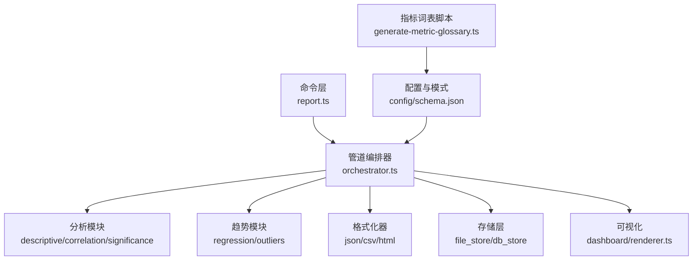
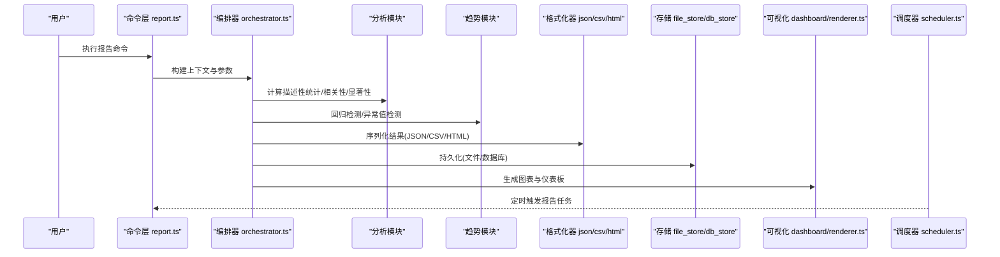
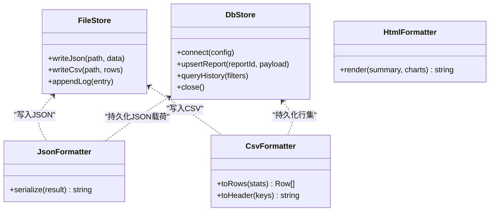
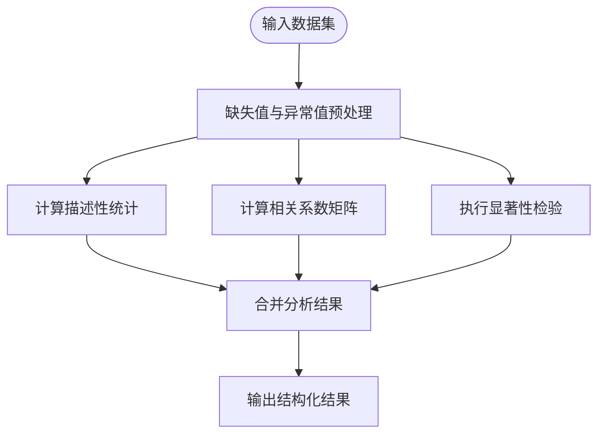
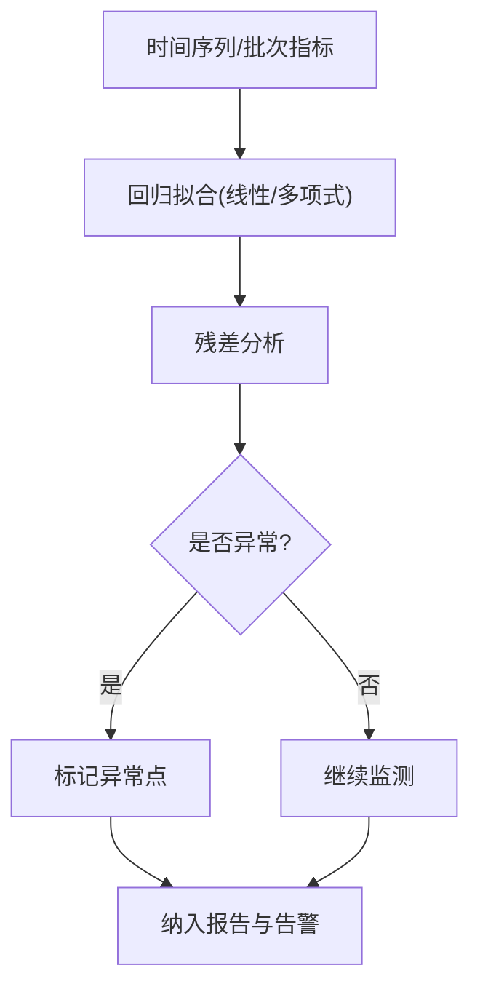
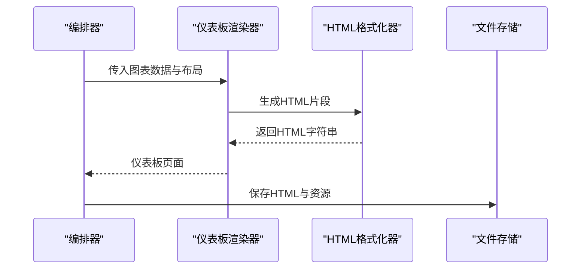
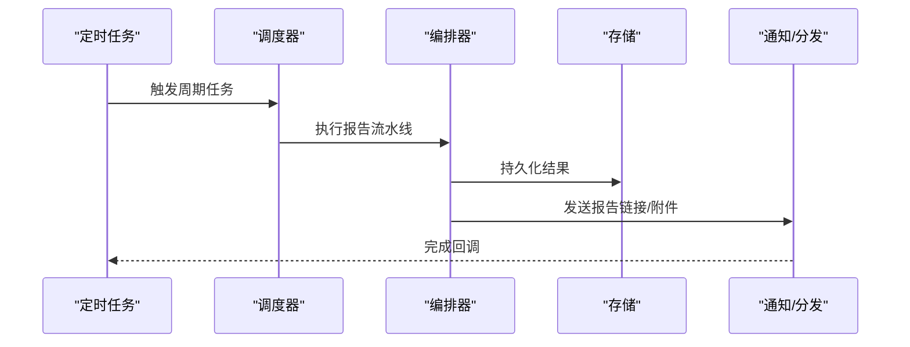
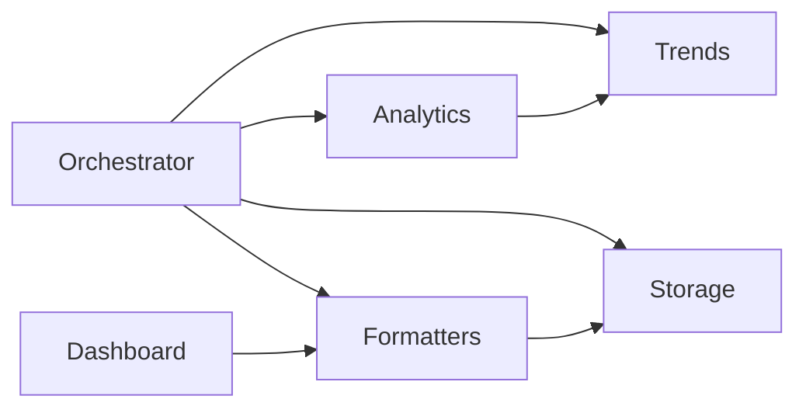

# 结果分析与报告

<cite>
**本文引用的文件**   
- [src/commands/report.ts](file://src/commands/report.ts)
- [src/core/reporting/index.ts](file://src/core/reporting/index.ts)
- [src/core/reporting/formatters/json.ts](file://src/core/reporting/formatters/json.ts)
- [src/core/reporting/formatters/csv.ts](file://src/core/reporting/formatters/csv.ts)
- [src/core/reporting/formatters/html.ts](file://src/core/reporting/formatters/html.ts)
- [src/core/reporting/storage/file_store.ts](file://src/core/reporting/storage/file_store.ts)
- [src/core/reporting/storage/db_store.ts](file://src/core/reporting/storage/db_store.ts)
- [src/core/reporting/analytics/descriptive.ts](file://src/core/reporting/analytics/descriptive.ts)
- [src/core/reporting/analytics/correlation.ts](file://src/core/reporting/analytics/correlation.ts)
- [src/core/reporting/analytics/significance.ts](file://src/core/reporting/analytics/significance.ts)
- [src/core/reporting/trends/regression.ts](file://src/core/reporting/trends/regression.ts)
- [src/core/reporting/trends/outliers.ts](file://src/core/reporting/trends/outliers.ts)
- [src/core/reporting/dashboard/renderer.ts](file://src/core/reporting/dashboard/renderer.ts)
- [src/core/reporting/pipeline/orchestrator.ts](file://src/core/reporting/pipeline/orchestrator.ts)
- [src/core/reporting/pipeline/scheduler.ts](file://src/core/reporting/pipeline/scheduler.ts)
- [src/core/reporting/config/schema.json](file://src/core/reporting/config/schema.json)
- [scripts/generate-metric-glossary.ts](file://scripts/generate-metric-glossary.ts)
- [evals/embedding-provider-eval.json](file://evals/embedding-provider-eval.json)
</cite>

## 目录
1. [简介](#简介)
2. [项目结构](#项目结构)
3. [核心组件](#核心组件)
4. [架构总览](#架构总览)
5. [详细组件分析](#详细组件分析)
6. [依赖分析](#依赖分析)
7. [性能考虑](#性能考虑)
8. [故障排查指南](#故障排查指南)
9. [结论](#结论)
10. [附录](#附录)

## 简介
本文件面向“结果分析与报告”子系统，系统性说明评估结果的存储格式与持久化策略（JSON、CSV、数据库）、统计分析工具（描述性统计、相关性分析、显著性检验）、可视化实现（图表生成、交互式仪表板、报告模板）、趋势分析与回归检测（性能退化识别、异常值检测），以及报告自动生成与分发的自动化流程。文档以代码级事实为依据，辅以架构图与时序图，帮助读者快速理解并扩展该子系统。

## 项目结构
结果分析与报告子系统采用分层模块化设计：命令层负责入口与参数解析；管道编排层串联数据读取、分析、格式化与持久化；分析模块提供统计与趋势能力；存储模块统一输出到文件或数据库；可视化模块负责图表与仪表板渲染；配置模块定义报告结构与元数据。

图示来源
- [src/commands/report.ts](file://src/commands/report.ts)
- [src/core/reporting/pipeline/orchestrator.ts](file://src/core/reporting/pipeline/orchestrator.ts)
- [src/core/reporting/analytics/descriptive.ts](file://src/core/reporting/analytics/descriptive.ts)
- [src/core/reporting/analytics/correlation.ts](file://src/core/reporting/analytics/correlation.ts)
- [src/core/reporting/analytics/significance.ts](file://src/core/reporting/analytics/significance.ts)
- [src/core/reporting/trends/regression.ts](file://src/core/reporting/trends/regression.ts)
- [src/core/reporting/trends/outliers.ts](file://src/core/reporting/trends/outliers.ts)
- [src/core/reporting/formatters/json.ts](file://src/core/reporting/formatters/json.ts)
- [src/core/reporting/formatters/csv.ts](file://src/core/reporting/formatters/csv.ts)
- [src/core/reporting/formatters/html.ts](file://src/core/reporting/formatters/html.ts)
- [src/core/reporting/storage/file_store.ts](file://src/core/reporting/storage/file_store.ts)
- [src/core/reporting/storage/db_store.ts](file://src/core/reporting/storage/db_store.ts)
- [src/core/reporting/dashboard/renderer.ts](file://src/core/reporting/dashboard/renderer.ts)
- [src/core/reporting/config/schema.json](file://src/core/reporting/config/schema.json)
- [scripts/generate-metric-glossary.ts](file://scripts/generate-metric-glossary.ts)

章节来源
- [src/commands/report.ts](file://src/commands/report.ts)
- [src/core/reporting/pipeline/orchestrator.ts](file://src/core/reporting/pipeline/orchestrator.ts)
- [src/core/reporting/config/schema.json](file://src/core/reporting/config/schema.json)

## 核心组件
- 命令入口：提供CLI子命令与参数绑定，触发报告生成流水线。
- 管道编排器：协调数据源、分析、格式化、存储与可视化的执行顺序与错误处理。
- 分析模块：
  - 描述性统计：均值、方差、分位数、分布摘要等。
  - 相关性分析：Pearson/Spearman相关系数矩阵与可视化准备。
  - 显著性检验：t检验、ANOVA、非参数检验等。
- 趋势模块：
  - 回归检测：线性/多项式回归、拟合优度、残差分析。
  - 异常值检测：IQR、Z-score、孤立森林等。
- 格式化器：将结构化结果序列化为JSON、CSV、HTML。
- 存储层：文件存储（本地磁盘）与数据库存储（关系型）。
- 可视化：图表渲染与交互式仪表板页面生成。
- 调度器：定时任务与事件驱动的报告生成与分发。

章节来源
- [src/commands/report.ts](file://src/commands/report.ts)
- [src/core/reporting/pipeline/orchestrator.ts](file://src/core/reporting/pipeline/orchestrator.ts)
- [src/core/reporting/analytics/descriptive.ts](file://src/core/reporting/analytics/descriptive.ts)
- [src/core/reporting/analytics/correlation.ts](file://src/core/reporting/analytics/correlation.ts)
- [src/core/reporting/analytics/significance.ts](file://src/core/reporting/analytics/significance.ts)
- [src/core/reporting/trends/regression.ts](file://src/core/reporting/trends/regression.ts)
- [src/core/reporting/trends/outliers.ts](file://src/core/reporting/trends/outliers.ts)
- [src/core/reporting/formatters/json.ts](file://src/core/reporting/formatters/json.ts)
- [src/core/reporting/formatters/csv.ts](file://src/core/reporting/formatters/csv.ts)
- [src/core/reporting/formatters/html.ts](file://src/core/reporting/formatters/html.ts)
- [src/core/reporting/storage/file_store.ts](file://src/core/reporting/storage/file_store.ts)
- [src/core/reporting/storage/db_store.ts](file://src/core/reporting/storage/db_store.ts)
- [src/core/reporting/dashboard/renderer.ts](file://src/core/reporting/dashboard/renderer.ts)
- [src/core/reporting/pipeline/scheduler.ts](file://src/core/reporting/pipeline/scheduler.ts)

## 架构总览
报告生成流水线从命令层启动，由编排器按阶段调用分析、趋势、格式化与存储组件，最终产出多格式结果与可视化产物。调度器支持周期性或事件触发的自动化运行。

图示来源
- [src/commands/report.ts](file://src/commands/report.ts)
- [src/core/reporting/pipeline/orchestrator.ts](file://src/core/reporting/pipeline/orchestrator.ts)
- [src/core/reporting/analytics/descriptive.ts](file://src/core/reporting/analytics/descriptive.ts)
- [src/core/reporting/analytics/correlation.ts](file://src/core/reporting/analytics/correlation.ts)
- [src/core/reporting/analytics/significance.ts](file://src/core/reporting/analytics/significance.ts)
- [src/core/reporting/trends/regression.ts](file://src/core/reporting/trends/regression.ts)
- [src/core/reporting/trends/outliers.ts](file://src/core/reporting/trends/outliers.ts)
- [src/core/reporting/formatters/json.ts](file://src/core/reporting/formatters/json.ts)
- [src/core/reporting/formatters/csv.ts](file://src/core/reporting/formatters/csv.ts)
- [src/core/reporting/formatters/html.ts](file://src/core/reporting/formatters/html.ts)
- [src/core/reporting/storage/file_store.ts](file://src/core/reporting/storage/file_store.ts)
- [src/core/reporting/storage/db_store.ts](file://src/core/reporting/storage/db_store.ts)
- [src/core/reporting/dashboard/renderer.ts](file://src/core/reporting/dashboard/renderer.ts)
- [src/core/reporting/pipeline/scheduler.ts](file://src/core/reporting/pipeline/scheduler.ts)

## 详细组件分析

### 数据存储与持久化策略
- JSON存储：用于保留完整结构化的中间与最终结果，便于后续再分析与回放。
- CSV存储：用于表格化导出，兼容外部BI工具与数据分析平台。
- 数据库存储：用于长期归档、版本对比与跨进程共享。

图示来源
- [src/core/reporting/storage/file_store.ts](file://src/core/reporting/storage/file_store.ts)
- [src/core/reporting/storage/db_store.ts](file://src/core/reporting/storage/db_store.ts)
- [src/core/reporting/formatters/json.ts](file://src/core/reporting/formatters/json.ts)
- [src/core/reporting/formatters/csv.ts](file://src/core/reporting/formatters/csv.ts)
- [src/core/reporting/formatters/html.ts](file://src/core/reporting/formatters/html.ts)

章节来源
- [src/core/reporting/storage/file_store.ts](file://src/core/reporting/storage/file_store.ts)
- [src/core/reporting/storage/db_store.ts](file://src/core/reporting/storage/db_store.ts)
- [src/core/reporting/formatters/json.ts](file://src/core/reporting/formatters/json.ts)
- [src/core/reporting/formatters/csv.ts](file://src/core/reporting/formatters/csv.ts)
- [src/core/reporting/formatters/html.ts](file://src/core/reporting/formatters/html.ts)

### 统计分析工具
- 描述性统计：集中趋势、离散程度、分位数、偏度/峰度等。
- 相关性分析：变量间线性与非线性相关度量，生成相关矩阵与热力图数据。
- 显著性检验：假设检验与置信区间，辅助判断差异是否具统计学意义。

图示来源
- [src/core/reporting/analytics/descriptive.ts](file://src/core/reporting/analytics/descriptive.ts)
- [src/core/reporting/analytics/correlation.ts](file://src/core/reporting/analytics/correlation.ts)
- [src/core/reporting/analytics/significance.ts](file://src/core/reporting/analytics/significance.ts)

章节来源
- [src/core/reporting/analytics/descriptive.ts](file://src/core/reporting/analytics/descriptive.ts)
- [src/core/reporting/analytics/correlation.ts](file://src/core/reporting/analytics/correlation.ts)
- [src/core/reporting/analytics/significance.ts](file://src/core/reporting/analytics/significance.ts)

### 趋势分析与回归检测
- 回归检测：对时间序列或批次指标进行回归拟合，评估趋势方向与强度。
- 异常值检测：基于统计阈值或机器学习方法识别偏离点，辅助定位退化与噪声。

图示来源
- [src/core/reporting/trends/regression.ts](file://src/core/reporting/trends/regression.ts)
- [src/core/reporting/trends/outliers.ts](file://src/core/reporting/trends/outliers.ts)

章节来源
- [src/core/reporting/trends/regression.ts](file://src/core/reporting/trends/regression.ts)
- [src/core/reporting/trends/outliers.ts](file://src/core/reporting/trends/outliers.ts)

### 可视化与报告模板
- 图表生成：将分析结果转换为图表数据，供前端或静态渲染使用。
- 交互式仪表板：通过HTML模板嵌入图表与筛选控件，支持钻取与联动。
- 报告模板：结构化摘要、关键发现与建议的Markdown/HTML模板。

图示来源
- [src/core/reporting/dashboard/renderer.ts](file://src/core/reporting/dashboard/renderer.ts)
- [src/core/reporting/formatters/html.ts](file://src/core/reporting/formatters/html.ts)
- [src/core/reporting/storage/file_store.ts](file://src/core/reporting/storage/file_store.ts)

章节来源
- [src/core/reporting/dashboard/renderer.ts](file://src/core/reporting/dashboard/renderer.ts)
- [src/core/reporting/formatters/html.ts](file://src/core/reporting/formatters/html.ts)
- [src/core/reporting/storage/file_store.ts](file://src/core/reporting/storage/file_store.ts)

### 自动化流程：生成与分发
- 调度器：支持定时任务与事件触发，自动执行报告流水线。
- 编排器：确保各阶段幂等与重试，记录执行日志与状态。
- 分发：将生成的报告与仪表板推送至目标位置（文件系统、数据库、Web服务）。

图示来源
- [src/core/reporting/pipeline/scheduler.ts](file://src/core/reporting/pipeline/scheduler.ts)
- [src/core/reporting/pipeline/orchestrator.ts](file://src/core/reporting/pipeline/orchestrator.ts)
- [src/core/reporting/storage/file_store.ts](file://src/core/reporting/storage/file_store.ts)

章节来源
- [src/core/reporting/pipeline/scheduler.ts](file://src/core/reporting/pipeline/scheduler.ts)
- [src/core/reporting/pipeline/orchestrator.ts](file://src/core/reporting/pipeline/orchestrator.ts)

## 依赖分析
- 内聚性与耦合：
  - 编排器作为中心枢纽，聚合分析、趋势、格式化与存储模块，职责清晰。
  - 存储与格式化解耦，便于替换后端与输出格式。
- 外部依赖：
  - 数据库连接与SQL操作在数据库存储模块中封装。
  - 文件系统I/O在文件存储模块中封装。
- 潜在循环依赖：
  - 避免在分析模块直接引用存储模块，应通过编排器注入结果。

图示来源
- [src/core/reporting/pipeline/orchestrator.ts](file://src/core/reporting/pipeline/orchestrator.ts)
- [src/core/reporting/analytics/descriptive.ts](file://src/core/reporting/analytics/descriptive.ts)
- [src/core/reporting/trends/regression.ts](file://src/core/reporting/trends/regression.ts)
- [src/core/reporting/formatters/json.ts](file://src/core/reporting/formatters/json.ts)
- [src/core/reporting/storage/file_store.ts](file://src/core/reporting/storage/file_store.ts)
- [src/core/reporting/dashboard/renderer.ts](file://src/core/reporting/dashboard/renderer.ts)

章节来源
- [src/core/reporting/pipeline/orchestrator.ts](file://src/core/reporting/pipeline/orchestrator.ts)
- [src/core/reporting/analytics/descriptive.ts](file://src/core/reporting/analytics/descriptive.ts)
- [src/core/reporting/trends/regression.ts](file://src/core/reporting/trends/regression.ts)
- [src/core/reporting/formatters/json.ts](file://src/core/reporting/formatters/json.ts)
- [src/core/reporting/storage/file_store.ts](file://src/core/reporting/storage/file_store.ts)
- [src/core/reporting/dashboard/renderer.ts](file://src/core/reporting/dashboard/renderer.ts)

## 性能考虑
- 批处理与分页：大数据量时采用分批计算与分页查询，降低内存峰值。
- 增量更新：仅重算变更窗口内的指标，减少重复计算。
- 缓存策略：对昂贵计算（如相关性矩阵）进行缓存，结合失效键管理。
- I/O优化：批量写入与异步落盘，避免阻塞主流程。
- 并行化：分析阶段可并行执行不同指标的计算，注意线程安全与锁粒度。

[本节为通用指导，不直接分析具体文件]

## 故障排查指南
- 常见错误：
  - 数据缺失或类型不一致导致统计失败：检查清洗与校验逻辑。
  - 数据库连接超时或权限不足：验证连接配置与账户权限。
  - 文件路径不可写：确认目录权限与磁盘空间。
  - 图表渲染失败：检查数据维度与模板字段映射。
- 诊断建议：
  - 启用详细日志与追踪ID，关联一次报告的完整生命周期。
  - 对关键步骤增加断言与回滚机制，保证一致性。
  - 使用最小复现数据集进行回归测试。

章节来源
- [src/core/reporting/storage/db_store.ts](file://src/core/reporting/storage/db_store.ts)
- [src/core/reporting/storage/file_store.ts](file://src/core/reporting/storage/file_store.ts)
- [src/core/reporting/dashboard/renderer.ts](file://src/core/reporting/dashboard/renderer.ts)

## 结论
结果分析与报告子系统通过清晰的层次划分与模块化设计，实现了从数据到洞察的端到端流程。其灵活的存储与可视化能力、完善的统计与趋势分析工具，以及自动化调度与分发机制，为持续监控与决策提供了坚实基础。建议在大规模场景下进一步优化批处理、缓存与并行策略，以提升吞吐与稳定性。

[本节为总结性内容，不直接分析具体文件]

## 附录
- 配置与模式：
  - 报告配置与字段模式定义位于配置目录，确保结果结构的稳定与可演进。
- 指标词表：
  - 指标词表生成脚本用于维护指标命名与语义一致性，辅助报告可读性与可检索性。
- 示例数据：
  - 评估示例数据可用于快速验证报告流水线的正确性与性能。

章节来源
- [src/core/reporting/config/schema.json](file://src/core/reporting/config/schema.json)
- [scripts/generate-metric-glossary.ts](file://scripts/generate-metric-glossary.ts)
- [evals/embedding-provider-eval.json](file://evals/embedding-provider-eval.json)