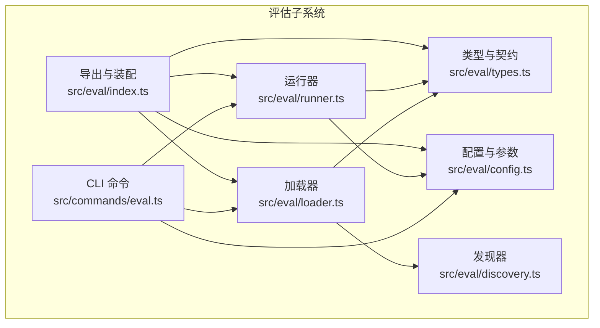
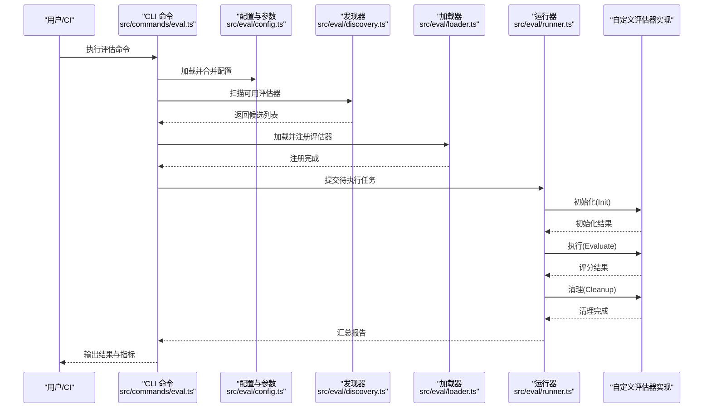
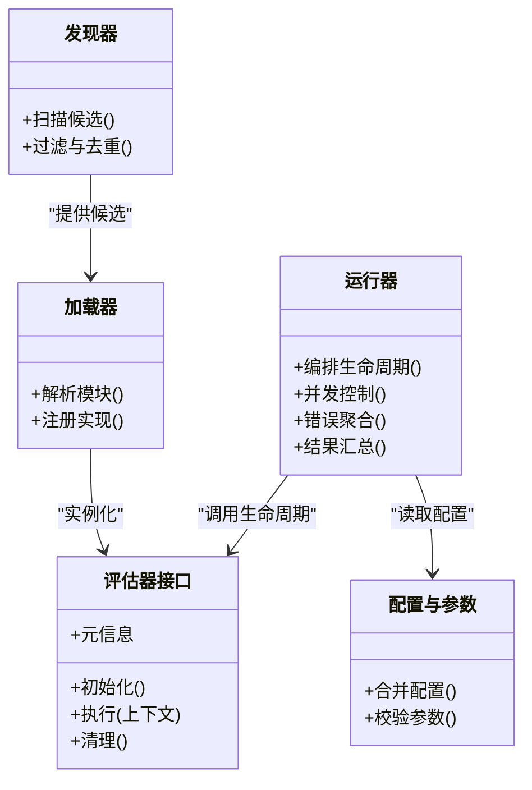
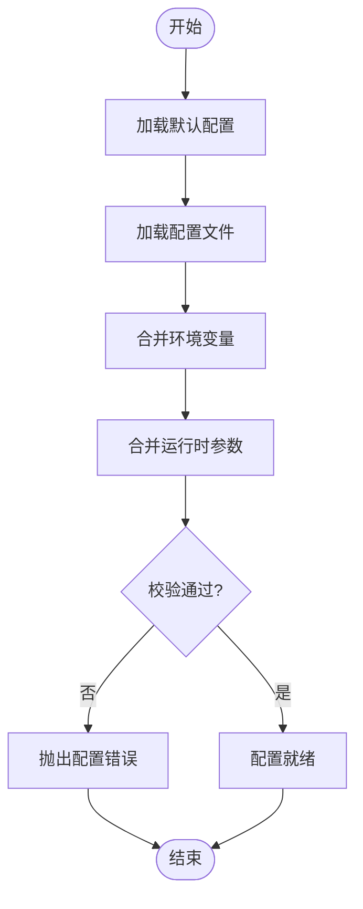
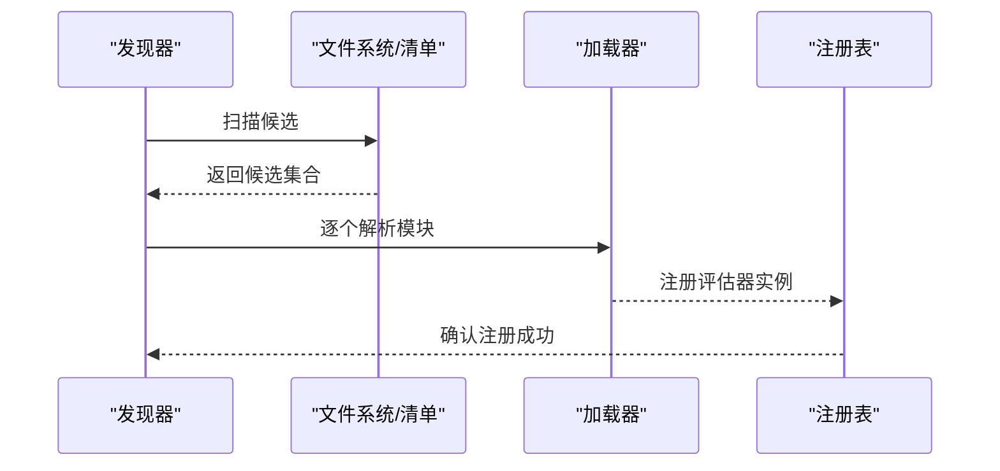
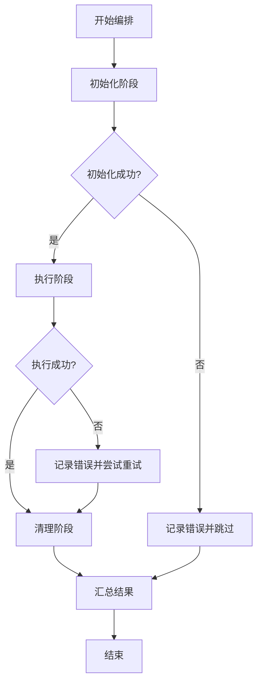
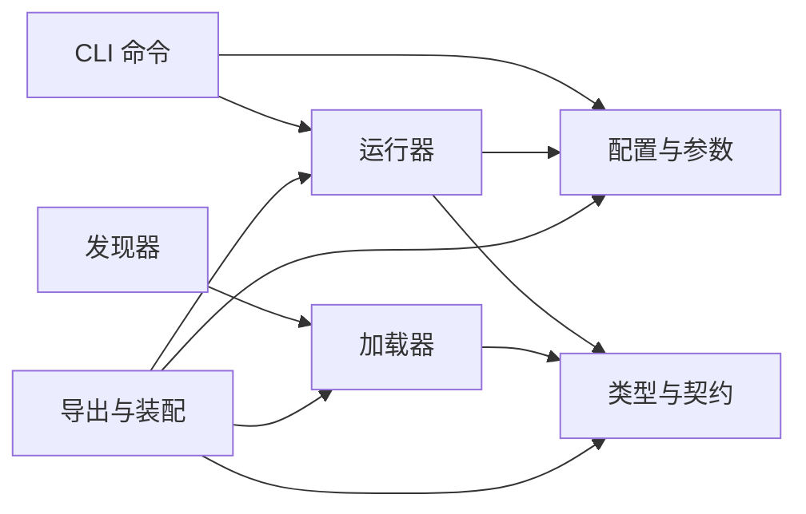

# 自定义评估器开发

<cite>
**本文引用的文件**   
- [src/eval/index.ts](file://src/eval/index.ts)
- [src/eval/types.ts](file://src/eval/types.ts)
- [src/eval/loader.ts](file://src/eval/loader.ts)
- [src/eval/runner.ts](file://src/eval/runner.ts)
- [src/eval/config.ts](file://src/eval/config.ts)
- [src/eval/discovery.ts](file://src/eval/discovery.ts)
- [src/commands/eval.ts](file://src/commands/eval.ts)
- [test/eval.test.ts](file://test/eval.test.ts)
- [test/eval-runner.test.ts](file://test/eval-runner.test.ts)
- [test/eval-schema-authoring.test.ts](file://test/eval-schema-authoring.test.ts)
- [evals/embedding-provider-eval.json](file://evals/embedding-provider-eval.json)
</cite>

## 目录
1. [简介](#简介)
2. [项目结构](#项目结构)
3. [核心组件](#核心组件)
4. [架构总览](#架构总览)
5. [详细组件分析](#详细组件分析)
6. [依赖关系分析](#依赖关系分析)
7. [性能考虑](#性能考虑)
8. [故障排查指南](#故障排查指南)
9. [结论](#结论)
10. [附录](#附录)

## 简介
本文件面向希望为系统编写“自定义评估器”的开发者，系统性说明评估器的接口规范、生命周期管理（初始化、执行、清理）、配置与参数传递机制（环境变量、配置文件、运行时参数）、注册与发现机制（插件化与动态加载），以及调试与测试工具的使用方法（单元测试、集成测试、基准测试）。文档同时提供最佳实践与常见问题解决方案，帮助快速构建稳定、可维护、可观测的评估器。

## 项目结构
围绕评估器能力，仓库中相关代码主要分布在以下位置：
- 类型与契约定义：位于 src/eval/types.ts，统一描述评估器输入输出、结果结构与错误模型。
- 加载与发现：位于 src/eval/loader.ts 与 src/eval/discovery.ts，负责扫描、解析与注册评估器实现。
- 运行编排：位于 src/eval/runner.ts，负责生命周期调度、并发控制、错误聚合与结果汇总。
- 配置与参数：位于 src/eval/config.ts，集中处理环境变量、配置文件与运行时参数的合并与校验。
- CLI 入口：位于 src/commands/eval.ts，暴露命令行选项并驱动评估流程。
- 示例与数据：evals 目录下包含示例评估配置与数据集。
- 测试：test/eval*.ts 覆盖评估器核心路径、边界条件与回归用例。

图表来源
- [src/eval/index.ts](file://src/eval/index.ts)
- [src/eval/types.ts](file://src/eval/types.ts)
- [src/eval/loader.ts](file://src/eval/loader.ts)
- [src/eval/discovery.ts](file://src/eval/discovery.ts)
- [src/eval/runner.ts](file://src/eval/runner.ts)
- [src/eval/config.ts](file://src/eval/config.ts)
- [src/commands/eval.ts](file://src/commands/eval.ts)

章节来源
- [src/eval/index.ts](file://src/eval/index.ts)
- [src/eval/types.ts](file://src/eval/types.ts)
- [src/eval/loader.ts](file://src/eval/loader.ts)
- [src/eval/discovery.ts](file://src/eval/discovery.ts)
- [src/eval/runner.ts](file://src/eval/runner.ts)
- [src/eval/config.ts](file://src/eval/config.ts)
- [src/commands/eval.ts](file://src/commands/eval.ts)

## 核心组件
- 类型与契约（types）
  - 定义评估器元信息、输入上下文、评分结果、错误与诊断信息的结构化类型。
  - 明确生命周期回调签名与返回值约束，确保各阶段可被统一编排与观测。
- 加载器（loader）
  - 负责从指定路径或包中解析评估器模块，按约定命名或清单进行实例化。
  - 将已发现的评估器注册到全局注册表，供运行器按需调用。
- 发现器（discovery）
  - 基于文件系统或包清单扫描候选评估器，支持过滤、去重与版本选择。
  - 提供扩展点以接入第三方发现策略（如远程索引、注册中心）。
- 运行器（runner）
  - 编排评估器生命周期：初始化 → 执行 → 清理。
  - 管理并发度、超时、重试、断点续跑与结果持久化。
- 配置与参数（config）
  - 合并优先级：默认值 < 配置文件 < 环境变量 < 运行时参数。
  - 提供强类型校验与提示，避免非法配置导致启动失败。
- CLI 命令（commands/eval）
  - 暴露子命令与选项，驱动配置加载、评估器发现与运行。
  - 输出结构化日志与结果，便于自动化流水线集成。

章节来源
- [src/eval/types.ts](file://src/eval/types.ts)
- [src/eval/loader.ts](file://src/eval/loader.ts)
- [src/eval/discovery.ts](file://src/eval/discovery.ts)
- [src/eval/runner.ts](file://src/eval/runner.ts)
- [src/eval/config.ts](file://src/eval/config.ts)
- [src/commands/eval.ts](file://src/commands/eval.ts)

## 架构总览
下图展示评估器在系统中的整体交互关系与控制流。

图表来源
- [src/commands/eval.ts](file://src/commands/eval.ts)
- [src/eval/config.ts](file://src/eval/config.ts)
- [src/eval/discovery.ts](file://src/eval/discovery.ts)
- [src/eval/loader.ts](file://src/eval/loader.ts)
- [src/eval/runner.ts](file://src/eval/runner.ts)

## 详细组件分析

### 评估器接口规范与生命周期
- 接口契约
  - 评估器需遵循统一的类型定义，包括元信息、输入上下文、评分结果与错误模型。
  - 生命周期方法签名由类型层约束，确保运行器可安全编排。
- 生命周期阶段
  - 初始化：用于准备资源、建立连接、预热缓存等；失败应尽早返回错误以便快速失败。
  - 执行：核心评估逻辑，读取输入上下文，产出结构化评分结果。
  - 清理：释放外部资源、关闭连接、清理临时文件；即使执行异常也应保证清理执行。
- 错误与诊断
  - 错误对象需携带可观测字段（如错误码、上下文快照、建议修复步骤）。
  - 运行器会捕获并聚合错误，生成诊断摘要。

图表来源
- [src/eval/types.ts](file://src/eval/types.ts)
- [src/eval/runner.ts](file://src/eval/runner.ts)
- [src/eval/config.ts](file://src/eval/config.ts)
- [src/eval/discovery.ts](file://src/eval/discovery.ts)
- [src/eval/loader.ts](file://src/eval/loader.ts)

章节来源
- [src/eval/types.ts](file://src/eval/types.ts)
- [src/eval/runner.ts](file://src/eval/runner.ts)

### 配置选项与参数传递机制
- 配置来源与优先级
  - 默认值：内置基础配置。
  - 配置文件：来自本地或远端配置文件，支持多环境覆盖。
  - 环境变量：通过环境变量注入敏感或运行时差异项。
  - 运行时参数：CLI 传入的参数具有最高优先级。
- 合并与校验
  - 采用深度合并策略，对关键字段进行类型与范围校验。
  - 未通过校验的配置会在启动阶段报错，避免隐式行为。
- 典型配置项
  - 并发度、超时时间、重试次数、日志级别、结果输出路径、外部服务凭据等。

图表来源
- [src/eval/config.ts](file://src/eval/config.ts)
- [src/commands/eval.ts](file://src/commands/eval.ts)

章节来源
- [src/eval/config.ts](file://src/eval/config.ts)
- [src/commands/eval.ts](file://src/commands/eval.ts)

### 注册与发现机制（插件架构与动态加载）
- 发现策略
  - 基于文件系统扫描或包清单，识别符合约定的评估器模块。
  - 支持过滤规则（名称前缀、标签、版本）与去重策略。
- 加载与注册
  - 加载器解析模块导出，构造评估器实例并注册至全局注册表。
  - 注册表提供按名称或标签查询的能力，供运行器按需拉取。
- 动态加载
  - 支持热插拔场景下的增量发现与重新加载。
  - 提供回滚与一致性检查，防止不兼容版本污染运行期。

图表来源
- [src/eval/discovery.ts](file://src/eval/discovery.ts)
- [src/eval/loader.ts](file://src/eval/loader.ts)

章节来源
- [src/eval/discovery.ts](file://src/eval/discovery.ts)
- [src/eval/loader.ts](file://src/eval/loader.ts)

### 运行编排与错误处理
- 生命周期编排
  - 运行器依次调用评估器的初始化、执行、清理阶段。
  - 支持并行执行多个评估器实例，并通过信号量限制并发度。
- 错误与恢复
  - 捕获各阶段异常，记录诊断信息并继续其他任务。
  - 支持重试与退避策略，针对瞬态错误提升鲁棒性。
- 结果与观测
  - 标准化评分结果结构，便于后续聚合与可视化。
  - 输出结构化日志与指标，便于链路追踪与问题定位。

图表来源
- [src/eval/runner.ts](file://src/eval/runner.ts)

章节来源
- [src/eval/runner.ts](file://src/eval/runner.ts)

### 调试与测试工具
- 单元测试框架
  - 使用现有测试套件组织评估器单测，覆盖正常路径、边界条件与错误分支。
  - 参考测试文件路径：[test/eval.test.ts](file://test/eval.test.ts)、[test/eval-runner.test.ts](file://test/eval-runner.test.ts)。
- 集成测试
  - 端到端验证评估器与外部依赖的交互，包括配置加载、发现与运行全流程。
  - 参考测试文件路径：[test/eval-schema-authoring.test.ts](file://test/eval-schema-authoring.test.ts)。
- 基准测试
  - 针对高吞吐场景设计基准用例，测量延迟、吞吐与资源占用。
  - 建议在 CI 中定期运行，监控回归。
- 示例数据
  - 使用 evals 目录中的示例评估配置作为最小可运行样例，便于快速上手与回归对比。
  - 示例文件路径：[evals/embedding-provider-eval.json](file://evals/embedding-provider-eval.json)。

章节来源
- [test/eval.test.ts](file://test/eval.test.ts)
- [test/eval-runner.test.ts](file://test/eval-runner.test.ts)
- [test/eval-schema-authoring.test.ts](file://test/eval-schema-authoring.test.ts)
- [evals/embedding-provider-eval.json](file://evals/embedding-provider-eval.json)

## 依赖关系分析
- 组件耦合
  - CLI 依赖配置与运行器；运行器依赖类型与配置；加载器与发现器共同支撑注册表。
- 直接依赖
  - 类型层为所有组件提供契约；配置层贯穿 CLI、运行器与加载器。
- 潜在循环依赖
  - 通过分层与接口抽象避免循环引用；若新增功能，优先引入新接口而非修改既有契约。
- 外部依赖
  - 文件系统、网络请求、数据库与第三方服务应在评估器内部隔离，并通过配置注入。

图表来源
- [src/commands/eval.ts](file://src/commands/eval.ts)
- [src/eval/config.ts](file://src/eval/config.ts)
- [src/eval/runner.ts](file://src/eval/runner.ts)
- [src/eval/types.ts](file://src/eval/types.ts)
- [src/eval/loader.ts](file://src/eval/loader.ts)
- [src/eval/discovery.ts](file://src/eval/discovery.ts)
- [src/eval/index.ts](file://src/eval/index.ts)

章节来源
- [src/commands/eval.ts](file://src/commands/eval.ts)
- [src/eval/config.ts](file://src/eval/config.ts)
- [src/eval/runner.ts](file://src/eval/runner.ts)
- [src/eval/types.ts](file://src/eval/types.ts)
- [src/eval/loader.ts](file://src/eval/loader.ts)
- [src/eval/discovery.ts](file://src/eval/discovery.ts)
- [src/eval/index.ts](file://src/eval/index.ts)

## 性能考虑
- 并发与限流
  - 合理设置并发度，避免资源争用；对慢依赖使用队列与令牌桶限流。
- 超时与重试
  - 为外部调用设置合理超时与指数退避重试，避免雪崩。
- 内存与 IO
  - 大对象及时释放，避免长生命周期引用；批量写入与分页读取降低峰值内存。
- 可观测性
  - 关键路径埋点耗时与错误率，结合指标面板进行容量规划与瓶颈定位。

## 故障排查指南
- 常见错误
  - 配置缺失或类型不匹配：检查环境变量与配置文件是否完整，关注启动阶段的校验错误。
  - 发现不到评估器：确认扫描路径与命名约定，查看发现器日志。
  - 初始化失败：检查外部依赖连通性与凭据，关注初始化阶段的错误码与诊断信息。
  - 执行超时或 OOM：调整并发度与批大小，增加资源配额。
- 定位手段
  - 启用更详细的日志级别，收集结构化日志与指标。
  - 使用最小可复现配置与数据，逐步缩小问题范围。
  - 借助测试套件中的断言与夹具，验证预期行为。

章节来源
- [src/eval/config.ts](file://src/eval/config.ts)
- [src/eval/discovery.ts](file://src/eval/discovery.ts)
- [src/eval/runner.ts](file://src/eval/runner.ts)

## 结论
通过统一的类型契约、清晰的配置合并策略、健壮的发现与加载机制，以及完善的运行编排与错误处理，自定义评估器可以以插件方式无缝融入系统。配合完善的测试与基准体系，可在保证质量的同时持续提升评估能力与稳定性。

## 附录
- 最佳实践
  - 保持评估器无状态或轻量有状态，外部依赖通过配置注入。
  - 严格遵循生命周期语义，确保清理阶段可靠执行。
  - 输出结构化结果与诊断信息，便于自动化消费与问题定位。
  - 在单测中覆盖异常路径，在集成测试中验证端到端流程。
- 参考路径
  - 类型与契约：[src/eval/types.ts](file://src/eval/types.ts)
  - 运行编排：[src/eval/runner.ts](file://src/eval/runner.ts)
  - 配置与参数：[src/eval/config.ts](file://src/eval/config.ts)
  - 发现与加载：[src/eval/discovery.ts](file://src/eval/discovery.ts)、[src/eval/loader.ts](file://src/eval/loader.ts)
  - CLI 入口：[src/commands/eval.ts](file://src/commands/eval.ts)
  - 示例数据：[evals/embedding-provider-eval.json](file://evals/embedding-provider-eval.json)
  - 测试参考：[test/eval.test.ts](file://test/eval.test.ts)、[test/eval-runner.test.ts](file://test/eval-runner.test.ts)、[test/eval-schema-authoring.test.ts](file://test/eval-schema-authoring.test.ts)