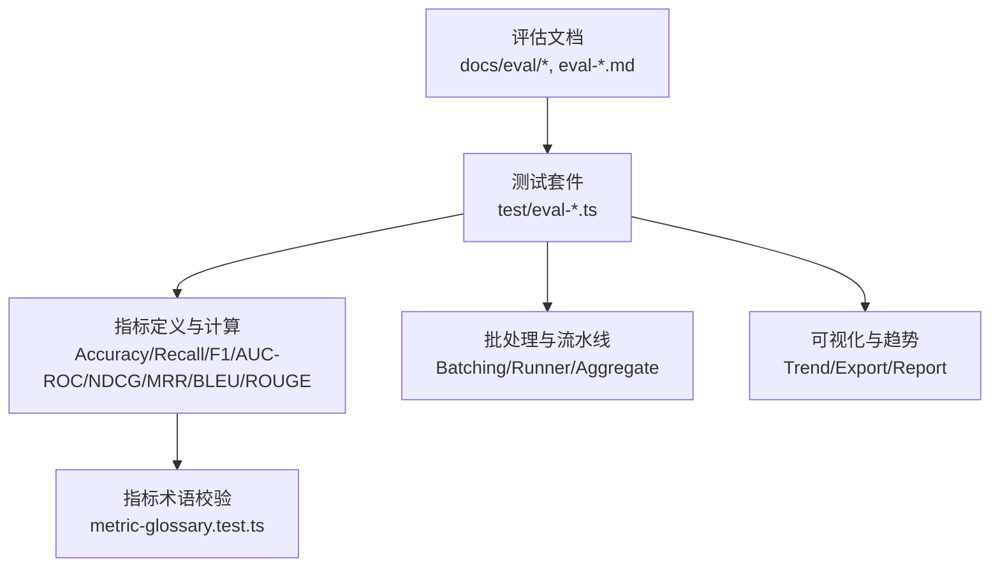
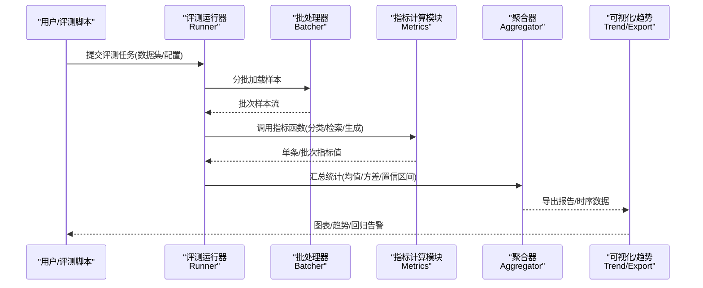
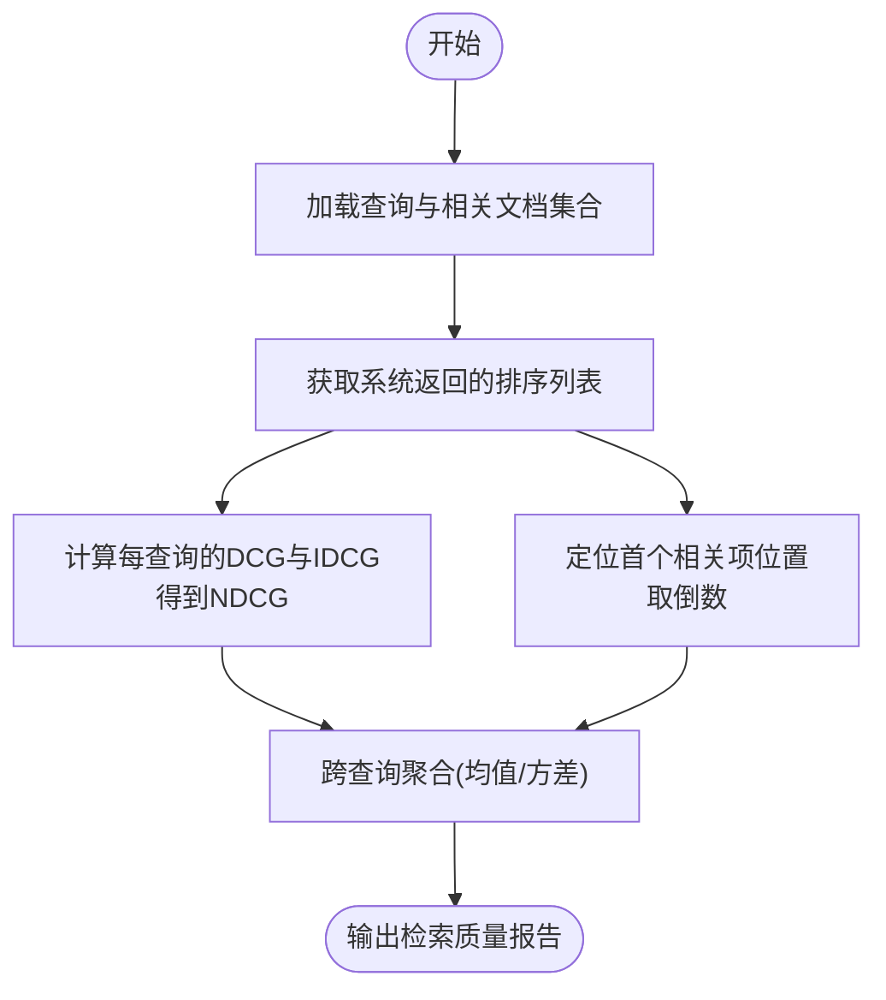
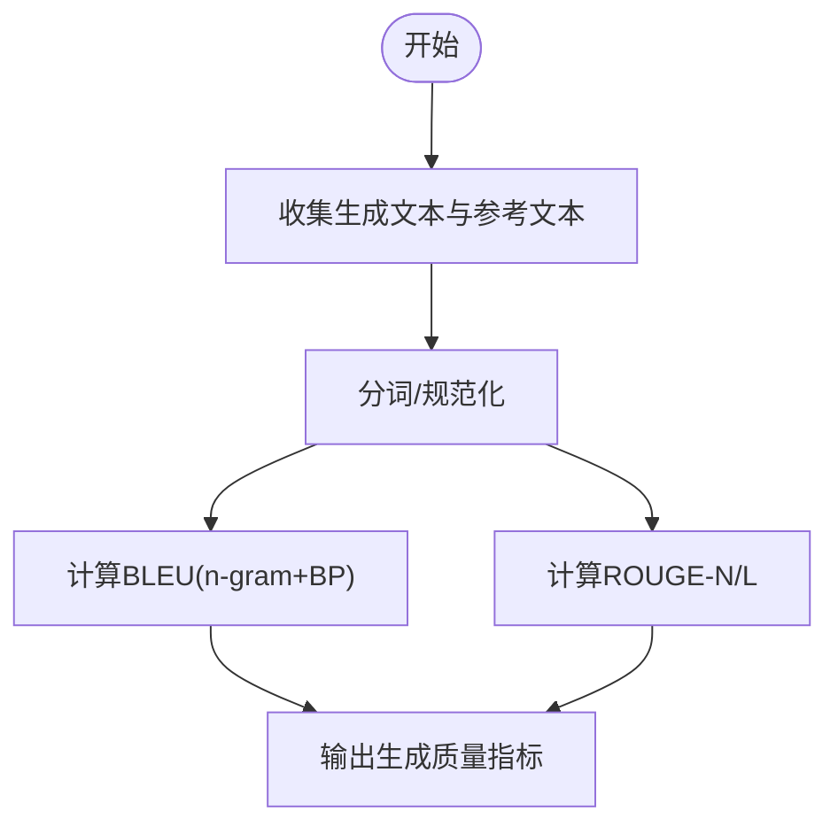
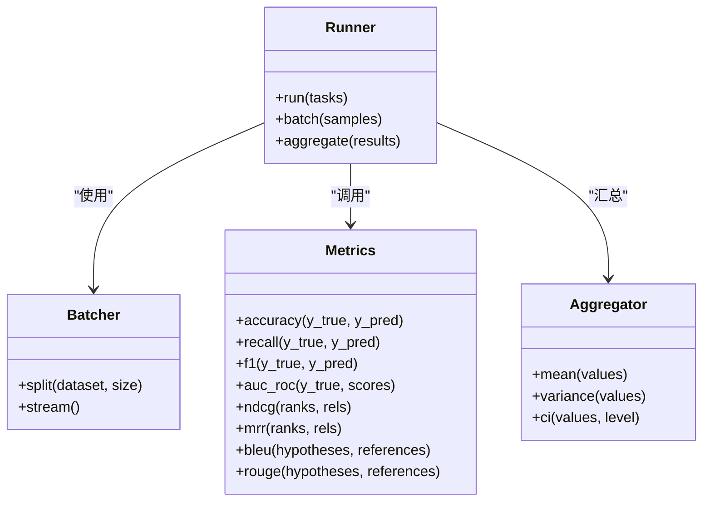
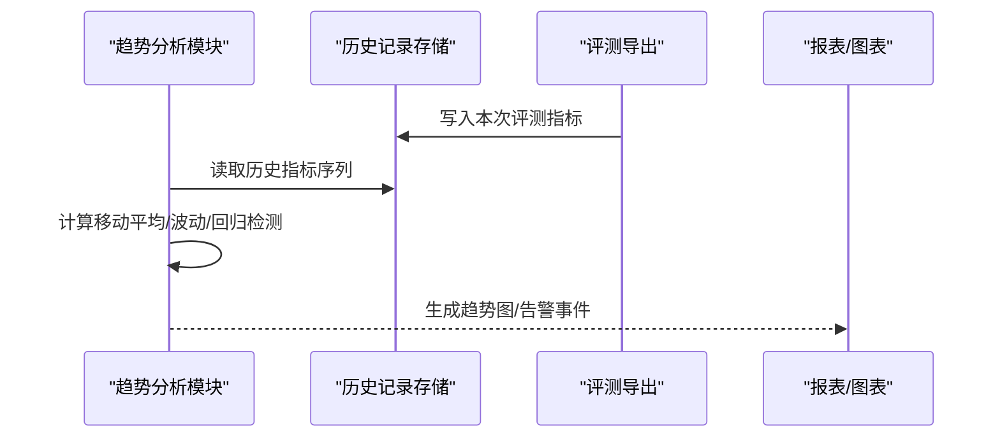
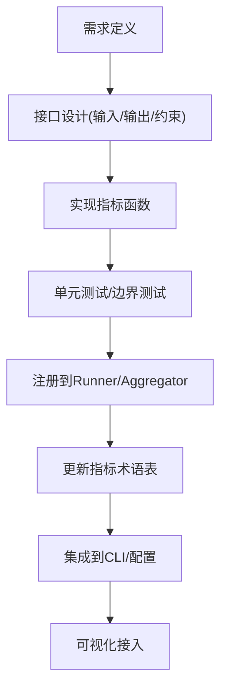
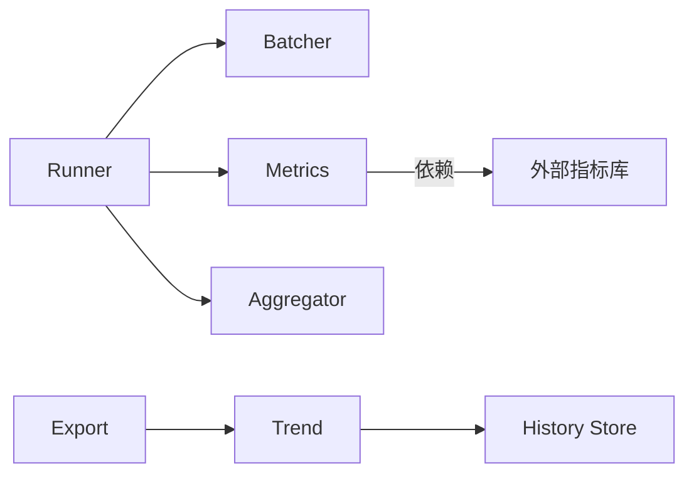

# 评估指标体系

<cite>
**本文引用的文件**   
- [eval/README.md](file://docs/eval/README.md)
- [eval-bench.md](file://docs/eval-bench.md)
- [eval-capture.md](file://docs/eval-capture.md)
- [eval-takes-quality.md](file://docs/eval-takes-quality.md)
- [eval-cross-modal-batch.test.ts](file://test/eval-cross-modal-batch.test.ts)
- [eval-retrieval-quality.test.ts](file://test/eval-retrieval-quality.test.ts)
- [eval-takes-quality-aggregate.test.ts](file://test/eval-takes-quality-aggregate.test.ts)
- [eval-takes-quality-cli.test.ts](file://test/eval-takes-quality-cli.test.ts)
- [eval-takes-quality-rubric.test.ts](file://test/eval-takes-quality-rubric.test.ts)
- [eval-takes-quality-runner.serial.test.ts](file://test/eval-takes-quality-runner.serial.test.ts)
- [eval-takes-quality-trend.test.ts](file://test/eval-takes-quality-trend.test.ts)
- [eval-contradictions-trends.test.ts](file://test/eval-contradictions-trends.test.ts)
- [metric-glossary.test.ts](file://test/metric-glossary.test.ts)
</cite>

## 目录
1. [引言](#引言)
2. [项目结构](#项目结构)
3. [核心组件](#核心组件)
4. [架构总览](#架构总览)
5. [详细组件分析](#详细组件分析)
6. [依赖分析](#依赖分析)
7. [性能考虑](#性能考虑)
8. [故障排查指南](#故障排查指南)
9. [结论](#结论)
10. [附录](#附录)

## 引言
本文件系统化梳理仓库中的“评估指标体系”，覆盖通用分类与排序指标（准确性、召回率、F1、AUC-ROC）、检索质量指标（NDCG、MRR）、生成质量指标（BLEU、ROUGE）的定义与计算要点，并给出批量处理策略、自定义指标开发指南、可视化与趋势分析方法。文档同时结合仓库中现有测试与文档，说明如何落地这些指标以及如何在工程实践中进行集成与扩展。

## 项目结构
围绕评估指标的相关实现与验证主要分布在以下位置：
- 文档层：评估相关的设计与使用说明位于 docs/eval 与根级 eval-*.md 文档
- 测试层：大量针对评估流程、批处理、趋势聚合、CLI 的测试用例位于 test/eval-* 与 test/eval-contradictions-* 等路径
- 指标术语：指标词汇表与一致性校验在 metric-glossary.test.ts 中体现

图表来源
- [eval/README.md](file://docs/eval/README.md)
- [eval-bench.md](file://docs/eval-bench.md)
- [eval-capture.md](file://docs/eval-capture.md)
- [eval-takes-quality.md](file://docs/eval-takes-quality.md)
- [eval-cross-modal-batch.test.ts](file://test/eval-cross-modal-batch.test.ts)
- [eval-retrieval-quality.test.ts](file://test/eval-retrieval-quality.test.ts)
- [eval-takes-quality-aggregate.test.ts](file://test/eval-takes-quality-aggregate.test.ts)
- [eval-takes-quality-cli.test.ts](file://test/eval-takes-quality-cli.test.ts)
- [eval-takes-quality-rubric.test.ts](file://test/eval-takes-quality-rubric.test.ts)
- [eval-takes-quality-runner.serial.test.ts](file://test/eval-takes-quality-runner.serial.test.ts)
- [eval-takes-quality-trend.test.ts](file://test/eval-takes-quality-trend.test.ts)
- [eval-contradictions-trends.test.ts](file://test/eval-contradictions-trends.test.ts)
- [metric-glossary.test.ts](file://test/metric-glossary.test.ts)

章节来源
- [eval/README.md](file://docs/eval/README.md)
- [eval-bench.md](file://docs/eval-bench.md)
- [eval-capture.md](file://docs/eval-capture.md)
- [eval-takes-quality.md](file://docs/eval-takes-quality.md)
- [eval-cross-modal-batch.test.ts](file://test/eval-cross-modal-batch.test.ts)
- [eval-retrieval-quality.test.ts](file://test/eval-retrieval-quality.test.ts)
- [eval-takes-quality-aggregate.test.ts](file://test/eval-takes-quality-aggregate.test.ts)
- [eval-takes-quality-cli.test.ts](file://test/eval-takes-quality-cli.test.ts)
- [eval-takes-quality-rubric.test.ts](file://test/eval-takes-quality-rubric.test.ts)
- [eval-takes-quality-runner.serial.test.ts](file://test/eval-takes-quality-runner.serial.test.ts)
- [eval-takes-quality-trend.test.ts](file://test/eval-takes-quality-trend.test.ts)
- [eval-contradictions-trends.test.ts](file://test/eval-contradictions-trends.test.ts)
- [metric-glossary.test.ts](file://test/metric-glossary.test.ts)

## 核心组件
本节聚焦指标体系的构成与职责划分：
- 指标定义层：统一描述 Accuracy、Recall、F1、AUC-ROC、NDCG、MRR、BLEU、ROUGE 的计算口径与边界条件
- 任务适配层：将通用指标映射到具体任务（如检索、生成、分类），提供专用评分函数
- 批处理与运行器：支持批量样本计算、分片并行、结果聚合与导出
- 可视化与趋势：对历史指标进行时间序列聚合、对比与回归检测
- 指标治理：通过术语表与契约测试确保指标命名与语义一致

章节来源
- [eval/README.md](file://docs/eval/README.md)
- [eval-bench.md](file://docs/eval-bench.md)
- [eval-capture.md](file://docs/eval-capture.md)
- [eval-takes-quality.md](file://docs/eval-takes-quality.md)
- [metric-glossary.test.ts](file://test/metric-glossary.test.ts)

## 架构总览
下图展示从数据输入到指标输出与可视化的端到端流程，涵盖批处理、指标计算、聚合与趋势分析。

图表来源
- [eval-cross-modal-batch.test.ts](file://test/eval-cross-modal-batch.test.ts)
- [eval-takes-quality-runner.serial.test.ts](file://test/eval-takes-quality-runner.serial.test.ts)
- [eval-takes-quality-aggregate.test.ts](file://test/eval-takes-quality-aggregate.test.ts)
- [eval-takes-quality-trend.test.ts](file://test/eval-takes-quality-trend.test.ts)
- [eval-contradictions-trends.test.ts](file://test/eval-contradictions-trends.test.ts)

## 详细组件分析

### 通用分类与排序指标
- 准确性（Accuracy）
  - 适用场景：多分类/二分类整体正确率
  - 计算要点：预测正确样本数 / 总样本数；类别不平衡时需配合其他指标解读
- 召回率（Recall）
  - 适用场景：关注漏报成本高的任务（如安全拦截、关键信息抽取）
  - 计算要点：真正例 / (真正例 + 假负例)；可按类或宏/微平均
- F1分数（F1-Score）
  - 适用场景：综合精确率与召回率的平衡度量
  - 计算要点：2 × (Precision × Recall) / (Precision + Recall)；支持宏/微/加权平均
- AUC-ROC
  - 适用场景：阈值无关的排序能力评估，尤其适用于概率输出模型
  - 计算要点：ROC曲线下面积；注意类别不平衡时的解释性

章节来源
- [eval/README.md](file://docs/eval/README.md)
- [eval-bench.md](file://docs/eval-bench.md)
- [eval-capture.md](file://docs/eval-capture.md)
- [eval-takes-quality.md](file://docs/eval-takes-quality.md)
- [eval-retrieval-quality.test.ts](file://test/eval-retrieval-quality.test.ts)

### 检索质量指标
- NDCG（归一化折损累计增益）
  - 适用场景：排序相关性评估，强调高相关结果靠前
  - 计算要点：按位置衰减累积增益，再除以理想排序的增益作为归一化
- MRR（平均倒数排名）
  - 适用场景：首个相关结果的排名敏感任务
  - 计算要点：每个查询取第一个相关项排名的倒数，再求平均

图表来源
- [eval-retrieval-quality.test.ts](file://test/eval-retrieval-quality.test.ts)

章节来源
- [eval-retrieval-quality.test.ts](file://test/eval-retrieval-quality.test.ts)

### 生成质量指标
- BLEU
  - 适用场景：文本生成相似度评估（翻译、摘要等）
  - 计算要点：n-gram 精确度与 brevity penalty 的组合；通常使用 BLEU-4
- ROUGE
  - 适用场景：摘要/问答等基于重叠的评估
  - 计算要点：ROUGE-N（n-gram重叠）、ROUGE-L（最长公共子序列）

图表来源
- [eval/README.md](file://docs/eval/README.md)
- [eval-bench.md](file://docs/eval-bench.md)
- [eval-capture.md](file://docs/eval-capture.md)
- [eval-takes-quality.md](file://docs/eval-takes-quality.md)

章节来源
- [eval/README.md](file://docs/eval/README.md)
- [eval-bench.md](file://docs/eval-bench.md)
- [eval-capture.md](file://docs/eval-capture.md)
- [eval-takes-quality.md](file://docs/eval-takes-quality.md)

### 批处理与运行器
- 批处理策略
  - 分片与并发：将大规模评测集切分为批次，利用并发提升吞吐
  - 内存控制：限制批次大小，避免峰值内存过高
  - 容错与重试：失败样本记录与重试机制，保证评测稳定性
- 运行器与聚合
  - Runner 负责调度批次、驱动指标计算、汇总结果
  - Aggregator 负责跨批次/跨任务的统计（均值、方差、置信区间）

图表来源
- [eval-cross-modal-batch.test.ts](file://test/eval-cross-modal-batch.test.ts)
- [eval-takes-quality-runner.serial.test.ts](file://test/eval-takes-quality-runner.serial.test.ts)
- [eval-takes-quality-aggregate.test.ts](file://test/eval-takes-quality-aggregate.test.ts)

章节来源
- [eval-cross-modal-batch.test.ts](file://test/eval-cross-modal-batch.test.ts)
- [eval-takes-quality-runner.serial.test.ts](file://test/eval-takes-quality-runner.serial.test.ts)
- [eval-takes-quality-aggregate.test.ts](file://test/eval-takes-quality-aggregate.test.ts)

### 可视化与趋势分析
- 可视化
  - 指标随版本/时间的变化曲线
  - 不同任务/模型的对比图
- 趋势分析
  - 滚动窗口平滑与异常点检测
  - 回归告警：当关键指标低于阈值或出现显著下降时触发

图表来源
- [eval-takes-quality-trend.test.ts](file://test/eval-takes-quality-trend.test.ts)
- [eval-contradictions-trends.test.ts](file://test/eval-contradictions-trends.test.ts)

章节来源
- [eval-takes-quality-trend.test.ts](file://test/eval-takes-quality-trend.test.ts)
- [eval-contradictions-trends.test.ts](file://test/eval-contradictions-trends.test.ts)

### 自定义指标开发与集成
- 设计原则
  - 明确输入输出契约：定义标签、预测、权重、分组键等字段
  - 可组合性：支持按任务/维度切片与聚合
  - 可复现性：固定随机种子与数据版本
- 开发步骤
  - 新增指标函数：遵循统一的签名与错误约定
  - 注册到运行器：在 Runner 中声明新指标
  - 编写测试：覆盖边界条件与数值稳定性
  - 更新术语表：在 metric-glossary 中登记名称与含义
- 集成方式
  - CLI 参数注入：通过命令行开关启用/禁用指标
  - 配置文件驱动：以 YAML/JSON 指定指标清单与参数
  - 管道式扩展：在 Batcher 与 Aggregator 之间插入自定义阶段

图表来源
- [eval-takes-quality-rubric.test.ts](file://test/eval-takes-quality-rubric.test.ts)
- [eval-takes-quality-cli.test.ts](file://test/eval-takes-quality-cli.test.ts)
- [metric-glossary.test.ts](file://test/metric-glossary.test.ts)

章节来源
- [eval-takes-quality-rubric.test.ts](file://test/eval-takes-quality-rubric.test.ts)
- [eval-takes-quality-cli.test.ts](file://test/eval-takes-quality-cli.test.ts)
- [metric-glossary.test.ts](file://test/metric-glossary.test.ts)

## 依赖分析
- 内部依赖
  - 评测运行器依赖批处理器与指标计算模块
  - 聚合器依赖运行器的中间结果
  - 趋势模块依赖历史记录与导出产物
- 外部依赖
  - 指标库（如 sklearn、nltk、rouge-score 等）用于标准指标计算
  - 可视化库（如 matplotlib、plotly）用于图表输出
- 潜在耦合点
  - 指标命名与术语表需保持一致，避免下游解析错误
  - 批大小与并发度需与硬件资源匹配，避免 OOM 或 CPU 争用

图表来源
- [eval-cross-modal-batch.test.ts](file://test/eval-cross-modal-batch.test.ts)
- [eval-takes-quality-runner.serial.test.ts](file://test/eval-takes-quality-runner.serial.test.ts)
- [eval-takes-quality-aggregate.test.ts](file://test/eval-takes-quality-aggregate.test.ts)
- [eval-takes-quality-trend.test.ts](file://test/eval-takes-quality-trend.test.ts)

章节来源
- [eval-cross-modal-batch.test.ts](file://test/eval-cross-modal-batch.test.ts)
- [eval-takes-quality-runner.serial.test.ts](file://test/eval-takes-quality-runner.serial.test.ts)
- [eval-takes-quality-aggregate.test.ts](file://test/eval-takes-quality-aggregate.test.ts)
- [eval-takes-quality-trend.test.ts](file://test/eval-takes-quality-trend.test.ts)

## 性能考虑
- 批处理优化
  - 动态批大小：根据内存占用自适应调整批次规模
  - 预取与流水线：I/O 与计算重叠，减少空闲等待
- 指标计算优化
  - 向量化计算：优先使用矩阵/向量操作替代循环
  - 增量更新：对滚动窗口指标采用增量算法降低复杂度
- 并发与资源
  - 进程/线程池：合理设置并发度，避免上下文切换开销过大
  - 缓存：对重复计算的中间结果进行缓存（如 n-gram 计数）
- 监控与诊断
  - 记录耗时分布与内存峰值，定位瓶颈
  - 采样日志：对长尾样本进行抽样分析

[本节为通用指导，不直接分析具体文件]

## 故障排查指南
- 常见问题
  - 指标缺失或为空：检查输入标签与预测格式是否匹配契约
  - 数值不稳定：确认浮点精度与除零保护逻辑
  - 批处理失败：查看批次大小与内存上限，必要时减小批次
- 调试建议
  - 最小复现：构造最小样本集快速定位问题
  - 断点与日志：在 Runner 与 Metrics 的关键分支添加日志
  - 回归测试：为新指标补充边界与异常用例

章节来源
- [eval-takes-quality-cli.test.ts](file://test/eval-takes-quality-cli.test.ts)
- [eval-takes-quality-rubric.test.ts](file://test/eval-takes-quality-rubric.test.ts)
- [eval-takes-quality-runner.serial.test.ts](file://test/eval-takes-quality-runner.serial.test.ts)

## 结论
本评估指标体系以通用指标为基础，结合检索与生成任务的专用指标，形成完整的评测闭环。通过批处理与运行器实现高效计算，借助聚合与趋势模块完成可视化与回归检测。建议在持续迭代中完善指标术语表与契约测试，确保指标的一致性与可维护性。

[本节为总结性内容，不直接分析具体文件]

## 附录
- 指标术语表与一致性校验
  - 通过 metric-glossary.test.ts 确保指标命名与语义稳定
- 评测基准与捕获
  - eval-bench.md 与 eval-capture.md 提供评测基准与数据捕获规范
- 任务型评测示例
  - eval-takes-quality.md 及相关测试展示了面向特定任务的评测流程

章节来源
- [metric-glossary.test.ts](file://test/metric-glossary.test.ts)
- [eval-bench.md](file://docs/eval-bench.md)
- [eval-capture.md](file://docs/eval-capture.md)
- [eval-takes-quality.md](file://docs/eval-takes-quality.md)