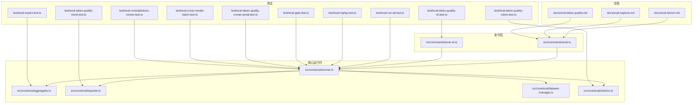
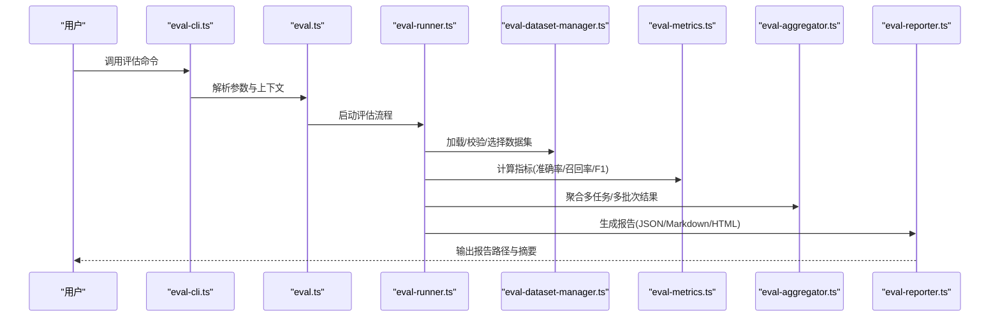
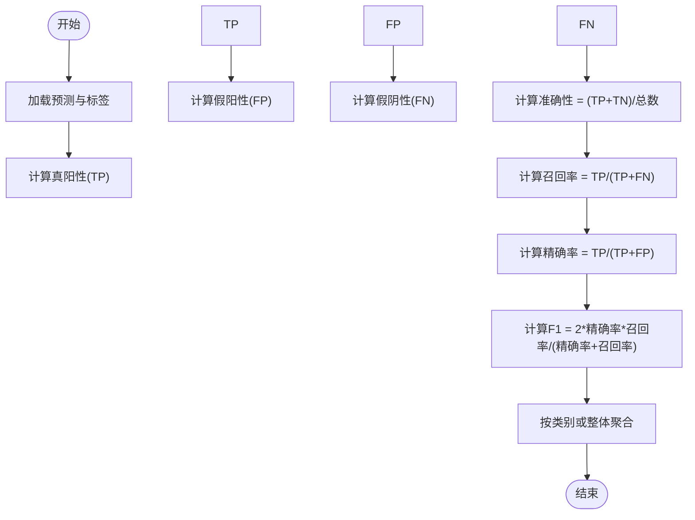
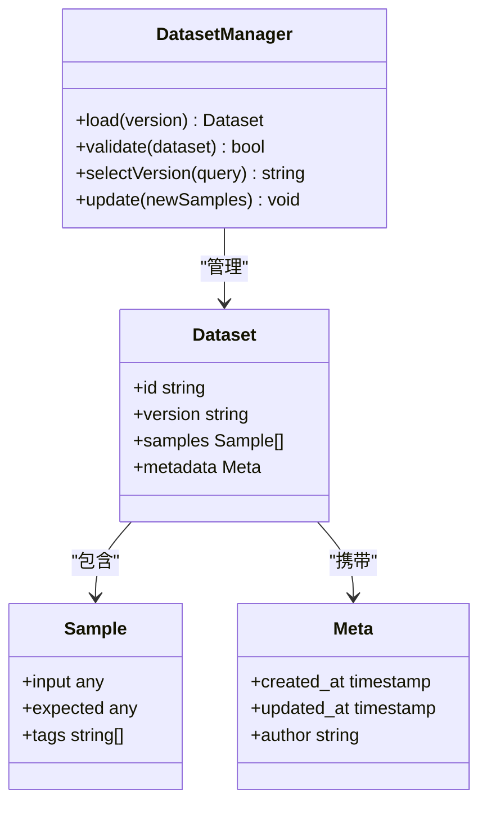
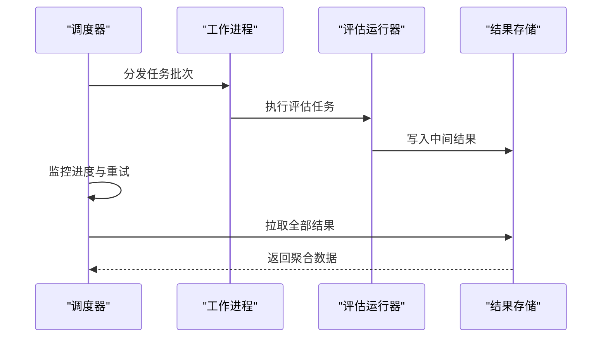
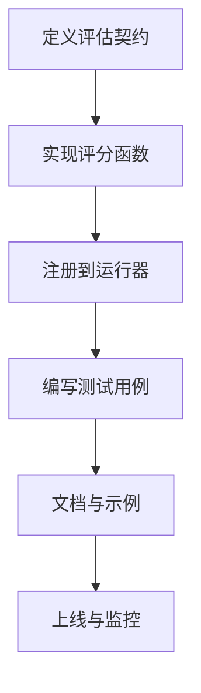
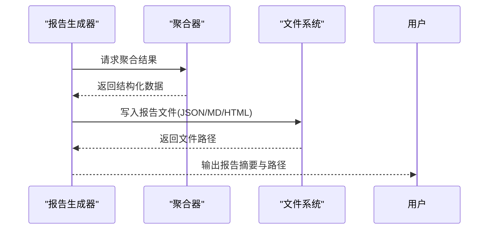
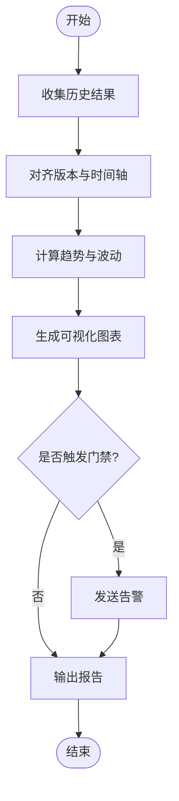
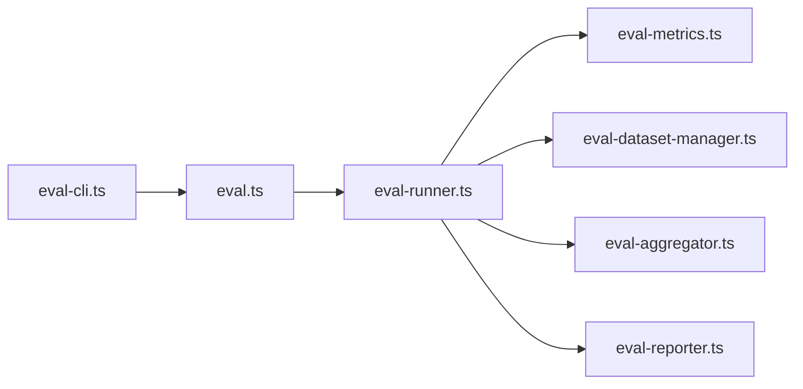

# 评估框架

<cite>
**本文引用的文件**   
- [eval-bench.md](file://docs/eval-bench.md)
- [eval-capture.md](file://docs/eval-capture.md)
- [eval-takes-quality.md](file://docs/eval-takes-quality.md)
- [eval.ts](file://src/commands/eval.ts)
- [eval-runner.ts](file://src/core/eval/runner.ts)
- [eval-aggregator.ts](file://src/core/eval/aggregator.ts)
- [eval-reporter.ts](file://src/core/eval/reporter.ts)
- [eval-dataset-manager.ts](file://src/core/eval/dataset-manager.ts)
- [eval-metrics.ts](file://src/core/eval/metrics.ts)
- [eval-cli.ts](file://src/commands/eval-cli.ts)
- [eval-export.test.ts](file://test/eval-export.test.ts)
- [eval-run-all.test.ts](file://test/eval-run-all.test.ts)
- [eval-replay.test.ts](file://test/eval-replay.test.ts)
- [eval-gate.test.ts](file://test/eval-gate.test.ts)
- [eval-takes-quality-cli.test.ts](file://test/eval-takes-quality-cli.test.ts)
- [eval-takes-quality-runner.serial.test.ts](file://test/eval-takes-quality-runner.serial.test.ts)
- [eval-takes-quality-rubric.test.ts](file://test/eval-takes-quality-rubric.test.ts)
- [eval-takes-quality-trend.test.ts](file://test/eval-takes-quality-trend.test.ts)
- [eval-cross-modal-batch.test.ts](file://test/eval-cross-modal-batch.test.ts)
- [eval-contradictions-runner.test.ts](file://test/eval-contradictions-runner.test.ts)
</cite>

## 目录
1. [简介](#简介)
2. [项目结构](#项目结构)
3. [核心组件](#核心组件)
4. [架构总览](#架构总览)
5. [详细组件分析](#详细组件分析)
6. [依赖关系分析](#依赖关系分析)
7. [性能考量](#性能考量)
8. [故障排查指南](#故障排查指南)
9. [结论](#结论)
10. [附录](#附录)

## 简介
本文件系统化阐述评估框架的设计与实现，覆盖以下关键主题：
- 评估指标体系设计与计算方法（准确性、召回率、F1等）
- 评估数据集的构建与管理（黄金标准创建、版本控制与更新策略）
- 自动化评估流水线（任务调度、并行执行、结果聚合）
- 自定义评估器开发与报告生成工具使用
- 评估结果的可视化展示与趋势分析方法

该框架以“可组合、可扩展、可观测”为核心原则，提供统一的评估入口、标准化的数据契约、灵活的指标计算与可视化的报告输出。

## 项目结构
仓库中与评估相关的代码与文档主要分布在如下位置：
- 设计文档：docs/eval-*
- 命令入口：src/commands/eval*.ts
- 核心运行时：src/core/eval/*
- 测试用例：test/eval-*/test.ts

图表来源
- [eval-bench.md](file://docs/eval-bench.md)
- [eval-capture.md](file://docs/eval-capture.md)
- [eval-takes-quality.md](file://docs/eval-takes-quality.md)
- [eval.ts](file://src/commands/eval.ts)
- [eval-cli.ts](file://src/commands/eval-cli.ts)
- [eval-runner.ts](file://src/core/eval/runner.ts)
- [eval-aggregator.ts](file://src/core/eval/aggregator.ts)
- [eval-reporter.ts](file://src/core/eval/reporter.ts)
- [eval-dataset-manager.ts](file://src/core/eval/dataset-manager.ts)
- [eval-metrics.ts](file://src/core/eval/metrics.ts)
- [eval-export.test.ts](file://test/eval-export.test.ts)
- [eval-run-all.test.ts](file://test/eval-run-all.test.ts)
- [eval-replay.test.ts](file://test/eval-replay.test.ts)
- [eval-gate.test.ts](file://test/eval-gate.test.ts)
- [eval-takes-quality-cli.test.ts](file://test/eval-takes-quality-cli.test.ts)
- [eval-takes-quality-runner.serial.test.ts](file://test/eval-takes-quality-runner.serial.test.ts)
- [eval-takes-quality-rubric.test.ts](file://test/eval-takes-quality-rubric.test.ts)
- [eval-takes-quality-trend.test.ts](file://test/eval-takes-quality-trend.test.ts)
- [eval-cross-modal-batch.test.ts](file://test/eval-cross-modal-batch.test.ts)
- [eval-contradictions-runner.test.ts](file://test/eval-contradictions-runner.test.ts)

章节来源
- [eval-bench.md](file://docs/eval-bench.md)
- [eval-capture.md](file://docs/eval-capture.md)
- [eval-takes-quality.md](file://docs/eval-takes-quality.md)
- [eval.ts](file://src/commands/eval.ts)
- [eval-cli.ts](file://src/commands/eval-cli.ts)
- [eval-runner.ts](file://src/core/eval/runner.ts)
- [eval-aggregator.ts](file://src/core/eval/aggregator.ts)
- [eval-reporter.ts](file://src/core/eval/reporter.ts)
- [eval-dataset-manager.ts](file://src/core/eval/dataset-manager.ts)
- [eval-metrics.ts](file://src/core/eval/metrics.ts)
- [eval-export.test.ts](file://test/eval-export.test.ts)
- [eval-run-all.test.ts](file://test/eval-run-all.test.ts)
- [eval-replay.test.ts](file://test/eval-replay.test.ts)
- [eval-gate.test.ts](file://test/eval-gate.test.ts)
- [eval-takes-quality-cli.test.ts](file://test/eval-takes-quality-cli.test.ts)
- [eval-takes-quality-runner.serial.test.ts](file://test/eval-takes-quality-runner.serial.test.ts)
- [eval-takes-quality-rubric.test.ts](file://test/eval-takes-quality-rubric.test.ts)
- [eval-takes-quality-trend.test.ts](file://test/eval-takes-quality-trend.test.ts)
- [eval-cross-modal-batch.test.ts](file://test/eval-cross-modal-batch.test.ts)
- [eval-contradictions-runner.test.ts](file://test/eval-contradictions-runner.test.ts)

## 核心组件
- 评估运行器（Runner）：负责解析配置、加载数据集、调度评估任务、管理并发与重试、汇总中间结果。
- 指标计算（Metrics）：提供准确性、召回率、F1分数等通用指标的实现与扩展点。
- 数据集管理器（Dataset Manager）：负责黄金标准数据集的加载、校验、版本选择与增量更新。
- 结果聚合器（Aggregator）：对多任务、多批次、多模态的结果进行聚合与统计。
- 报告生成器（Reporter）：将聚合后的结果渲染为结构化报告（JSON/Markdown/HTML），并支持导出与归档。
- CLI 与命令入口：提供命令行接口，支持批量运行、回放、门禁检查与导出。

章节来源
- [eval-runner.ts](file://src/core/eval/runner.ts)
- [eval-metrics.ts](file://src/core/eval/metrics.ts)
- [eval-dataset-manager.ts](file://src/core/eval/dataset-manager.ts)
- [eval-aggregator.ts](file://src/core/eval/aggregator.ts)
- [eval-reporter.ts](file://src/core/eval/reporter.ts)
- [eval.ts](file://src/commands/eval.ts)
- [eval-cli.ts](file://src/commands/eval-cli.ts)

## 架构总览
评估框架采用分层架构：命令层驱动核心运行时，核心运行时协调数据集、指标、聚合与报告模块，并通过测试套件保障稳定性与正确性。

图表来源
- [eval-cli.ts](file://src/commands/eval-cli.ts)
- [eval.ts](file://src/commands/eval.ts)
- [eval-runner.ts](file://src/core/eval/runner.ts)
- [eval-dataset-manager.ts](file://src/core/eval/dataset-manager.ts)
- [eval-metrics.ts](file://src/core/eval/metrics.ts)
- [eval-aggregator.ts](file://src/core/eval/aggregator.ts)
- [eval-reporter.ts](file://src/core/eval/reporter.ts)

## 详细组件分析

### 指标体系设计与计算方法
- 准确性（Accuracy）：预测正确的样本数占总样本数的比例。适用于分类与二元判定场景。
- 召回率（Recall）：真实正例中被正确识别的比例，衡量“查全”能力。
- F1分数：准确率和召回率的调和平均，综合衡量模型在精确性与召回之间的平衡。
- 扩展指标：可根据业务需求定义加权F1、宏/微平均、跨模态一致性得分等。

图表来源
- [eval-metrics.ts](file://src/core/eval/metrics.ts)

章节来源
- [eval-metrics.ts](file://src/core/eval/metrics.ts)
- [eval-takes-quality-rubric.test.ts](file://test/eval-takes-quality-rubric.test.ts)

### 评估数据集的构建与管理
- 黄金标准数据集：由人工标注或高质量规则生成，包含输入、期望输出与元数据（版本、时间戳、来源）。
- 版本控制：通过版本号与变更日志管理数据集演进，确保评估可复现。
- 更新策略：支持增量更新与全量替换；新增样本需经过校验与回归测试。
- 数据契约：统一的数据结构与字段约束，便于跨任务复用与对比。

图表来源
- [eval-dataset-manager.ts](file://src/core/eval/dataset-manager.ts)

章节来源
- [eval-dataset-manager.ts](file://src/core/eval/dataset-manager.ts)
- [eval-bench.md](file://docs/eval-bench.md)
- [eval-capture.md](file://docs/eval-capture.md)
- [eval-takes-quality.md](file://docs/eval-takes-quality.md)

### 自动化评估流水线
- 任务调度：根据配置划分任务集，支持按维度过滤与优先级排序。
- 并行执行：基于并发池与限流策略，避免资源争用与过载。
- 结果聚合：合并多任务、多批次、多模态结果，计算总体与分项指标。
- 门禁与回放：支持门禁检查（阈值不达标阻断发布）、历史回放与差异对比。

图表来源
- [eval-runner.ts](file://src/core/eval/runner.ts)
- [eval-aggregator.ts](file://src/core/eval/aggregator.ts)
- [eval-run-all.test.ts](file://test/eval-run-all.test.ts)
- [eval-cross-modal-batch.test.ts](file://test/eval-cross-modal-batch.test.ts)

章节来源
- [eval-runner.ts](file://src/core/eval/runner.ts)
- [eval-aggregator.ts](file://src/core/eval/aggregator.ts)
- [eval-run-all.test.ts](file://test/eval-run-all.test.ts)
- [eval-cross-modal-batch.test.ts](file://test/eval-cross-modal-batch.test.ts)

### 自定义评估器开发指南
- 定义评估契约：明确输入输出格式、评分函数与错误处理约定。
- 注册评估器：在运行器中注册自定义评估器，指定触发条件与依赖。
- 编写测试：为自定义评估器编写单元测试与集成测试，覆盖边界与异常路径。
- 文档与示例：提供使用说明与样例数据，降低接入成本。

章节来源
- [eval-runner.ts](file://src/core/eval/runner.ts)
- [eval-takes-quality-rubric.test.ts](file://test/eval-takes-quality-rubric.test.ts)

### 评估报告生成工具
- 输出格式：支持JSON、Markdown、HTML等多种格式，便于不同受众消费。
- 内容结构：包含总体指标、分项指标、样本级详情、趋势与差异分析。
- 导出与归档：提供导出命令与归档策略，便于长期追踪与审计。

图表来源
- [eval-reporter.ts](file://src/core/eval/reporter.ts)
- [eval-export.test.ts](file://test/eval-export.test.ts)

章节来源
- [eval-reporter.ts](file://src/core/eval/reporter.ts)
- [eval-export.test.ts](file://test/eval-export.test.ts)

### 评估结果可视化与趋势分析
- 可视化：通过报告中的图表与表格展示指标变化、分布与异常点。
- 趋势分析：按时间序列对比不同版本的指标，识别退化与改进。
- 门禁告警：当关键指标低于阈值时触发告警，辅助决策。

图表来源
- [eval-takes-quality-trend.test.ts](file://test/eval-takes-quality-trend.test.ts)
- [eval-gate.test.ts](file://test/eval-gate.test.ts)

章节来源
- [eval-takes-quality-trend.test.ts](file://test/eval-takes-quality-trend.test.ts)
- [eval-gate.test.ts](file://test/eval-gate.test.ts)

## 依赖关系分析
评估框架内部模块之间职责清晰、耦合度低，核心依赖关系如下：

图表来源
- [eval-cli.ts](file://src/commands/eval-cli.ts)
- [eval.ts](file://src/commands/eval.ts)
- [eval-runner.ts](file://src/core/eval/runner.ts)
- [eval-metrics.ts](file://src/core/eval/metrics.ts)
- [eval-dataset-manager.ts](file://src/core/eval/dataset-manager.ts)
- [eval-aggregator.ts](file://src/core/eval/aggregator.ts)
- [eval-reporter.ts](file://src/core/eval/reporter.ts)

章节来源
- [eval-cli.ts](file://src/commands/eval-cli.ts)
- [eval.ts](file://src/commands/eval.ts)
- [eval-runner.ts](file://src/core/eval/runner.ts)
- [eval-metrics.ts](file://src/core/eval/metrics.ts)
- [eval-dataset-manager.ts](file://src/core/eval/dataset-manager.ts)
- [eval-aggregator.ts](file://src/core/eval/aggregator.ts)
- [eval-reporter.ts](file://src/core/eval/reporter.ts)

## 性能考量
- 并发与限流：合理设置并发度与速率限制，避免外部服务过载与本地资源争用。
- 批处理：对大规模数据集采用分片与批处理策略，减少I/O与序列化开销。
- 缓存与去重：对重复样本与中间结果进行缓存，提升二次评估效率。
- 内存管理：及时释放大对象引用，避免长时间运行的内存泄漏。

[本节为通用指导，无需具体文件分析]

## 故障排查指南
- 常见错误：
  - 数据集版本不存在或损坏：检查版本选择逻辑与数据完整性。
  - 指标计算异常：核对标签与预测格式，确认TP/FP/FN计数是否正确。
  - 并行执行失败：检查并发上限、重试策略与错误传播。
  - 报告导出失败：确认输出路径权限与格式模板可用性。
- 调试建议：
  - 启用详细日志与中间结果快照，定位问题样本。
  - 使用回放模式重现历史评估，对比差异。
  - 针对门禁失败的案例，单独运行并输出详细诊断。

章节来源
- [eval-replay.test.ts](file://test/eval-replay.test.ts)
- [eval-gate.test.ts](file://test/eval-gate.test.ts)
- [eval-takes-quality-runner.serial.test.ts](file://test/eval-takes-quality-runner.serial.test.ts)
- [eval-contradictions-runner.test.ts](file://test/eval-contradictions-runner.test.ts)

## 结论
本评估框架通过清晰的模块化设计与标准化契约，实现了从数据集管理、指标计算、并行执行到报告生成的完整闭环。其可扩展的评估器机制与丰富的可视化能力，为持续质量保障与趋势分析提供了坚实基础。建议在团队内推广最佳实践，结合门禁与回放机制，形成稳定的评估治理流程。

[本节为总结性内容，无需具体文件分析]

## 附录
- 相关文档：
  - [评估基准说明](file://docs/eval-bench.md)
  - [评估捕获规范](file://docs/eval-capture.md)
  - [Takes质量评估](file://docs/eval-takes-quality.md)
- 参考测试：
  - [导出功能测试](file://test/eval-export.test.ts)
  - [全量运行测试](file://test/eval-run-all.test.ts)
  - [回放测试](file://test/eval-replay.test.ts)
  - [门禁测试](file://test/eval-gate.test.ts)
  - [Takes质量CLI测试](file://test/eval-takes-quality-cli.test.ts)
  - [Takes质量运行器串行测试](file://test/eval-takes-quality-runner.serial.test.ts)
  - [Takes质量评分表测试](file://test/eval-takes-quality-rubric.test.ts)
  - [Takes质量趋势测试](file://test/eval-takes-quality-trend.test.ts)
  - [跨模态批量测试](file://test/eval-cross-modal-batch.test.ts)
  - [矛盾检测运行器测试](file://test/eval-contradictions-runner.test.ts)