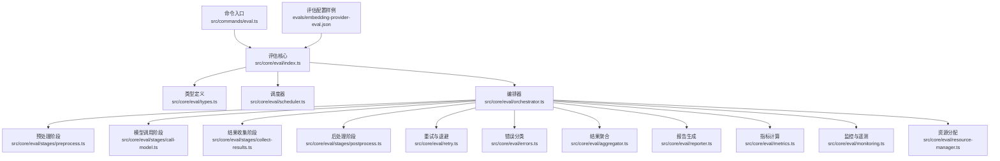
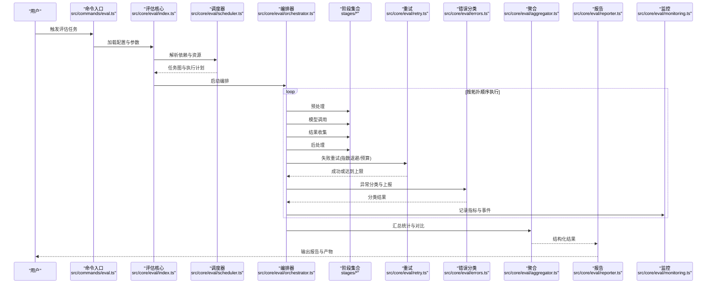
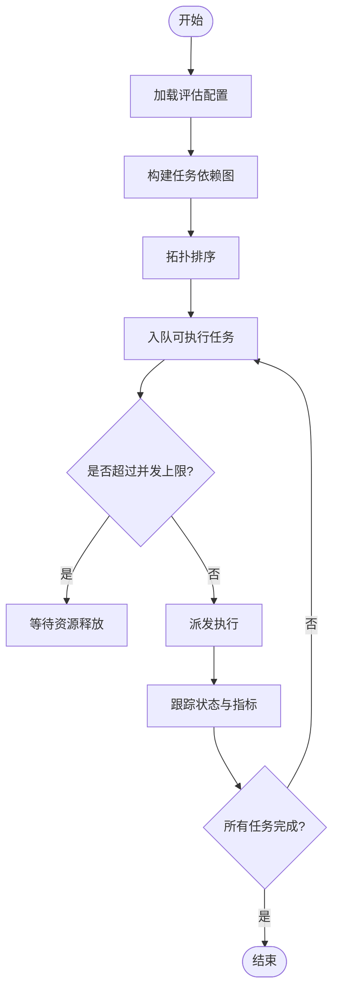
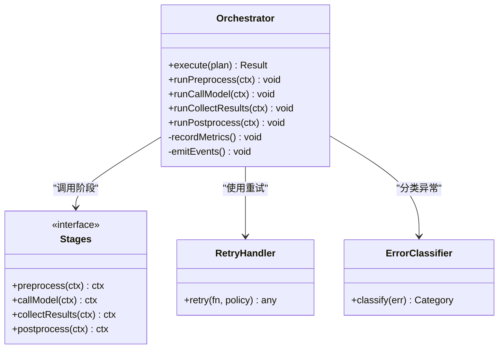
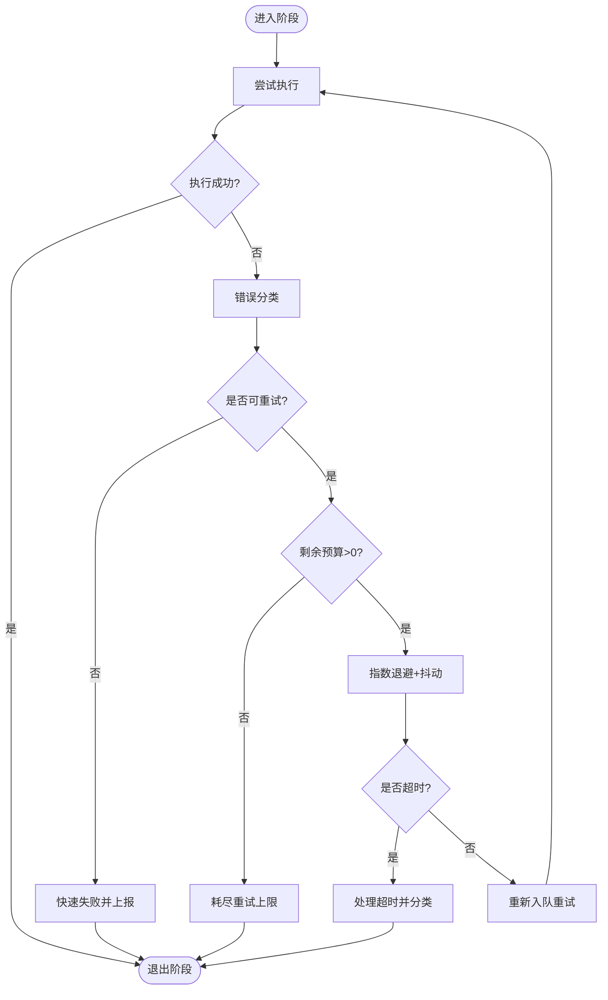
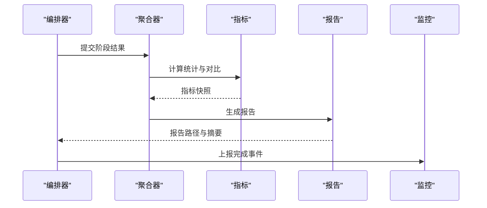
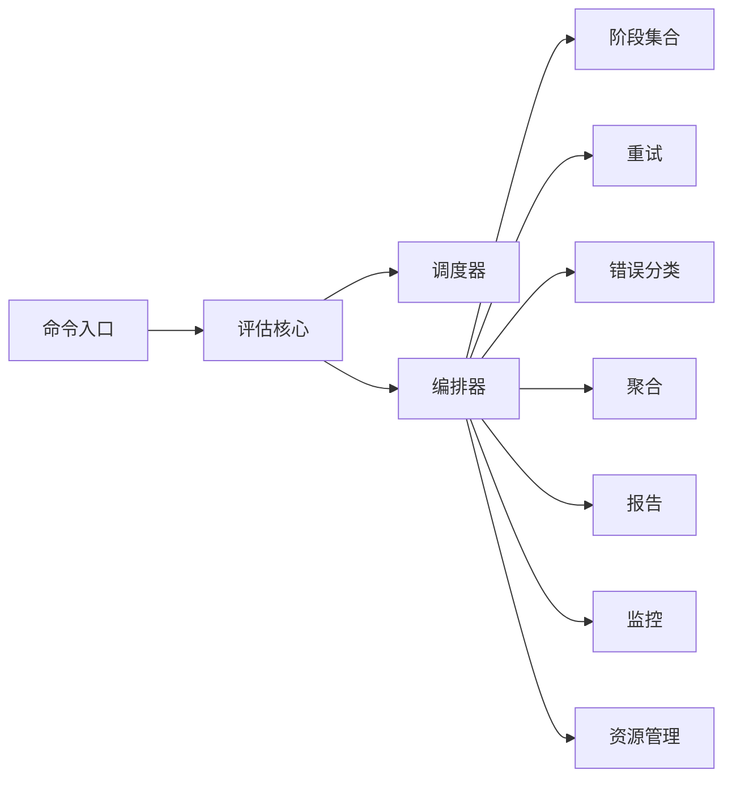

# 评估流水线

<cite>
**本文引用的文件**   
- [evals/embedding-provider-eval.json](file://evals/embedding-provider-eval.json)
- [src/commands/eval.ts](file://src/commands/eval.ts)
- [src/core/eval/index.ts](file://src/core/eval/index.ts)
- [src/core/eval/types.ts](file://src/core/eval/types.ts)
- [src/core/eval/scheduler.ts](file://src/core/eval/scheduler.ts)
- [src/core/eval/orchestrator.ts](file://src/core/eval/orchestrator.ts)
- [src/core/eval/stages/preprocess.ts](file://src/core/eval/stages/preprocess.ts)
- [src/core/eval/stages/call-model.ts](file://src/core/eval/stages/call-model.ts)
- [src/core/eval/stages/collect-results.ts](file://src/core/eval/stages/collect-results.ts)
- [src/core/eval/stages/postprocess.ts](file://src/core/eval/stages/postprocess.ts)
- [src/core/eval/retry.ts](file://src/core/eval/retry.ts)
- [src/core/eval/errors.ts](file://src/core/eval/errors.ts)
- [src/core/eval/aggregator.ts](file://src/core/eval/aggregator.ts)
- [src/core/eval/reporter.ts](file://src/core/eval/reporter.ts)
- [src/core/eval/metrics.ts](file://src/core/eval/metrics.ts)
- [src/core/eval/monitoring.ts](file://src/core/eval/monitoring.ts)
- [src/core/eval/resource-manager.ts](file://src/core/eval/resource-manager.ts)
- [test/eval.test.ts](file://test/eval.test.ts)
- [test/eval-run-all.test.ts](file://test/eval-run-all.test.ts)
- [test/eval-replay.test.ts](file://test/eval-replay.test.ts)
- [test/eval-gate.test.ts](file://test/eval-gate.test.ts)
- [test/eval-export.test.ts](file://test/eval-export.test.ts)
- [test/eval-compare.test.ts](file://test/eval-compare.test.ts)
- [test/eval-takes-quality-runner.serial.test.ts](file://test/eval-takes-quality-runner.serial.test.ts)
- [test/eval-takes-quality-aggregate.test.ts](file://test/eval-takes-quality-aggregate.test.ts)
- [test/eval-takes-quality-cli.test.ts](file://test/eval-takes-quality-cli.test.ts)
- [test/eval-capture.test.ts](file://test/eval-capture.test.ts)
- [test/eval-capture-drain.test.ts](file://test/eval-capture-drain.test.ts)
- [test/eval-capture-scrub.test.ts](file://test/eval-capture-scrub.test.ts)
- [test/eval-cross-modal-batch.test.ts](file://test/eval-cross-modal-batch.test.ts)
- [test/eval-longmemeval.slow.test.ts](file://test/eval-longmemeval.slow.test.ts)
- [test/eval-longmemeval-extract.test.ts](file://test/eval-longmemeval-extract.test.ts)
- [test/eval-longmemeval-intent.test.ts](file://test/eval-longmemeval-intent.test.ts)
- [test/eval-longmemeval-sanitize.test.ts](file://test/eval-longmemeval-sanitize.test.ts)
- [test/eval-longmemeval-trajectory-routing.test.ts](file://test/eval-longmemeval-trajectory-routing.test.ts)
- [test/eval-replay-metadata-skip.test.ts](file://test/eval-replay-metadata-skip.test.ts)
- [test/eval-replay-gate.test.ts](file://test/eval-replay-gate.test.ts)
- [test/eval-schema-authoring.test.ts](file://test/eval-schema-authoring.test.ts)
- [test/eval-whoknows.test.ts](file://test/eval-whoknows.test.ts)
- [test/eval-contradictions-runner.test.ts](file://test/eval-contradictions-runner.test.ts)
- [test/eval-contradictions-engine.test.ts](file://test/eval-contradictions-engine.test.ts)
- [test/eval-contradictions-judge.test.ts](file://test/eval-contradictions-judge.test.ts)
- [test/eval-contradictions-severity.test.ts](file://test/eval-contradictions-severity.test.ts)
- [test/eval-contradictions-cost.test.ts](file://test/eval-contradictions-cost.test.ts)
- [test/eval-contradictions-calibration.test.ts](file://test/eval-contradictions-calibration.test.ts)
- [test/eval-contradictions-cross-source.test.ts](file://test/eval-contradictions-cross-source.test.ts)
- [test/eval-contradictions-date-filter.test.ts](file://test/eval-contradictions-date-filter.test.ts)
- [test/eval-contradictions-fixture-redact.test.ts](file://test/eval-contradictions-fixture-redact.test.ts)
- [test/eval-contradictions-judge-errors.test.ts](file://test/eval-contradictions-judge-errors.test.ts)
- [test/eval-contradictions-cache.test.ts](file://test/eval-contradictions-cache.test.ts)
- [test/eval-contradictions-auto-supersession.test.ts](file://test/eval-contradictions-auto-supersession.test.ts)
- [test/eval-contradictions-trends.test.ts](file://test/eval-contradictions-trends.test.ts)
- [test/eval-contradictions-cost-prompt.test.ts](file://test/eval-contradictions-cost-prompt.test.ts)
- [test/eval-contradictions-integrations.test.ts](file://test/eval-contradictions-integrations.test.ts)
- [test/eval-contradictions-calibration-join.test.ts](file://test/eval-contradictions-calibration-join.test.ts)
- [test/eval-contradictions-budget-default.test.ts](file://test/eval-contradictions-budget-default.test.ts)
- [test/eval-contradictions-rubric.test.ts](file://test/eval-contradictions-rubric.test.ts)
- [test/eval-contradictions-receipt-name.test.ts](file://test/eval-contradictions-receipt-name.test.ts)
- [test/eval-contradictions-receipt-write.test.ts](file://test/eval-contradictions-receipt-write.test.ts)
- [test/eval-contradictions-regress.test.ts](file://test/eval-contradictions-regress.test.ts)
- [test/eval-contradictions-trend.test.ts](file://test/eval-contradictions-trend.test.ts)
</cite>

## 目录
1. [简介](#简介)
2. [项目结构](#项目结构)
3. [核心组件](#核心组件)
4. [架构总览](#架构总览)
5. [详细组件分析](#详细组件分析)
6. [依赖关系分析](#依赖关系分析)
7. [性能考量](#性能考量)
8. [故障排查指南](#故障排查指南)
9. [结论](#结论)
10. [附录](#附录)

## 简介
本文件面向“评估流水线”的自动化评估任务，系统性说明其调度机制、编排流程、错误处理与重试策略、结果聚合与分析工具，以及监控与调试方法。文档以仓库中评估相关源码与测试为依据，帮助读者理解从任务定义到报告产出的完整链路，并给出可操作的排障建议与最佳实践。

## 项目结构
评估能力主要分布在以下位置：
- 命令入口与CLI集成：src/commands/eval.ts
- 评估核心库：src/core/eval/*（类型、调度器、编排器、阶段实现、重试、错误分类、聚合、报告、指标、监控、资源管理）
- 示例与配置：evals/embedding-provider-eval.json
- 测试覆盖：test/eval*.ts 系列文件，覆盖运行、回放、导出、对比、质量评测、矛盾检测等场景

图表来源
- [src/commands/eval.ts](file://src/commands/eval.ts)
- [src/core/eval/index.ts](file://src/core/eval/index.ts)
- [src/core/eval/types.ts](file://src/core/eval/types.ts)
- [src/core/eval/scheduler.ts](file://src/core/eval/scheduler.ts)
- [src/core/eval/orchestrator.ts](file://src/core/eval/orchestrator.ts)
- [src/core/eval/stages/preprocess.ts](file://src/core/eval/stages/preprocess.ts)
- [src/core/eval/stages/call-model.ts](file://src/core/eval/stages/call-model.ts)
- [src/core/eval/stages/collect-results.ts](file://src/core/eval/stages/collect-results.ts)
- [src/core/eval/stages/postprocess.ts](file://src/core/eval/stages/postprocess.ts)
- [src/core/eval/retry.ts](file://src/core/eval/retry.ts)
- [src/core/eval/errors.ts](file://src/core/eval/errors.ts)
- [src/core/eval/aggregator.ts](file://src/core/eval/aggregator.ts)
- [src/core/eval/reporter.ts](file://src/core/eval/reporter.ts)
- [src/core/eval/metrics.ts](file://src/core/eval/metrics.ts)
- [src/core/eval/monitoring.ts](file://src/core/eval/monitoring.ts)
- [src/core/eval/resource-manager.ts](file://src/core/eval/resource-manager.ts)
- [evals/embedding-provider-eval.json](file://evals/embedding-provider-eval.json)

章节来源
- [src/commands/eval.ts](file://src/commands/eval.ts)
- [src/core/eval/index.ts](file://src/core/eval/index.ts)
- [evals/embedding-provider-eval.json](file://evals/embedding-provider-eval.json)

## 核心组件
- 类型系统：统一描述任务、阶段、上下文、结果、错误与配置的结构，确保各模块间契约一致。
- 调度器：负责任务发现、依赖解析、并行度控制、资源配额与抢占策略。
- 编排器：串联预处理、模型调用、结果收集、后处理等阶段，协调重试、超时与错误分类。
- 阶段实现：每个阶段职责单一，便于扩展与替换；支持批处理与流式输出。
- 重试与错误：基于指数退避与预算控制的重试策略，结合错误分类进行差异化恢复。
- 聚合与报告：汇总统计、性能对比、趋势分析与可视化报告输出。
- 监控与指标：采集关键指标、事件与日志，提供可观测性。
- 资源管理：并发上限、速率限制、外部服务配额与本地资源隔离。

章节来源
- [src/core/eval/types.ts](file://src/core/eval/types.ts)
- [src/core/eval/scheduler.ts](file://src/core/eval/scheduler.ts)
- [src/core/eval/orchestrator.ts](file://src/core/eval/orchestrator.ts)
- [src/core/eval/stages/preprocess.ts](file://src/core/eval/stages/preprocess.ts)
- [src/core/eval/stages/call-model.ts](file://src/core/eval/stages/call-model.ts)
- [src/core/eval/stages/collect-results.ts](file://src/core/eval/stages/collect-results.ts)
- [src/core/eval/stages/postprocess.ts](file://src/core/eval/stages/postprocess.ts)
- [src/core/eval/retry.ts](file://src/core/eval/retry.ts)
- [src/core/eval/errors.ts](file://src/core/eval/errors.ts)
- [src/core/eval/aggregator.ts](file://src/core/eval/aggregator.ts)
- [src/core/eval/reporter.ts](file://src/core/eval/reporter.ts)
- [src/core/eval/metrics.ts](file://src/core/eval/metrics.ts)
- [src/core/eval/monitoring.ts](file://src/core/eval/monitoring.ts)
- [src/core/eval/resource-manager.ts](file://src/core/eval/resource-manager.ts)

## 架构总览
评估流水线采用“命令入口 → 核心编排 → 阶段执行 → 聚合报告”的分层架构。调度器在编排器之前解析依赖与资源约束，编排器驱动阶段顺序与并行，重试与错误分类贯穿全链路，聚合与报告在收尾阶段产出最终结果。

图表来源
- [src/commands/eval.ts](file://src/commands/eval.ts)
- [src/core/eval/index.ts](file://src/core/eval/index.ts)
- [src/core/eval/scheduler.ts](file://src/core/eval/scheduler.ts)
- [src/core/eval/orchestrator.ts](file://src/core/eval/orchestrator.ts)
- [src/core/eval/stages/preprocess.ts](file://src/core/eval/stages/preprocess.ts)
- [src/core/eval/stages/call-model.ts](file://src/core/eval/stages/call-model.ts)
- [src/core/eval/stages/collect-results.ts](file://src/core/eval/stages/collect-results.ts)
- [src/core/eval/stages/postprocess.ts](file://src/core/eval/stages/postprocess.ts)
- [src/core/eval/retry.ts](file://src/core/eval/retry.ts)
- [src/core/eval/errors.ts](file://src/core/eval/errors.ts)
- [src/core/eval/aggregator.ts](file://src/core/eval/aggregator.ts)
- [src/core/eval/reporter.ts](file://src/core/eval/reporter.ts)
- [src/core/eval/monitoring.ts](file://src/core/eval/monitoring.ts)

## 详细组件分析

### 调度器：任务依赖管理与并行控制
- 依赖解析：基于有向无环图（DAG）构建任务拓扑，保证前置任务完成后才调度后续任务。
- 并行控制：通过最大并发数与队列长度限制，避免资源争用与内存溢出。
- 资源配额：为不同任务类别设置独立配额，支持速率限制与优先级抢占。
- 容错与恢复：对不可恢复错误立即短路，对可重试错误进入重试队列。

图表来源
- [src/core/eval/scheduler.ts](file://src/core/eval/scheduler.ts)
- [src/core/eval/resource-manager.ts](file://src/core/eval/resource-manager.ts)

章节来源
- [src/core/eval/scheduler.ts](file://src/core/eval/scheduler.ts)
- [src/core/eval/resource-manager.ts](file://src/core/eval/resource-manager.ts)

### 编排器：阶段编排与生命周期
- 阶段顺序：预处理 → 模型调用 → 结果收集 → 后处理，支持可选阶段跳过与条件分支。
- 上下文传递：每阶段共享上下文对象，包含输入数据、中间产物、元数据与运行时信息。
- 生命周期钩子：在进入/退出阶段时记录指标、触发监控事件与持久化中间态。
- 批量与流式：支持大批量输入分片与流式输出，降低峰值内存占用。

图表来源
- [src/core/eval/orchestrator.ts](file://src/core/eval/orchestrator.ts)
- [src/core/eval/stages/preprocess.ts](file://src/core/eval/stages/preprocess.ts)
- [src/core/eval/stages/call-model.ts](file://src/core/eval/stages/call-model.ts)
- [src/core/eval/stages/collect-results.ts](file://src/core/eval/stages/collect-results.ts)
- [src/core/eval/stages/postprocess.ts](file://src/core/eval/stages/postprocess.ts)
- [src/core/eval/retry.ts](file://src/core/eval/retry.ts)
- [src/core/eval/errors.ts](file://src/core/eval/errors.ts)

章节来源
- [src/core/eval/orchestrator.ts](file://src/core/eval/orchestrator.ts)
- [src/core/eval/stages/preprocess.ts](file://src/core/eval/stages/preprocess.ts)
- [src/core/eval/stages/call-model.ts](file://src/core/eval/stages/call-model.ts)
- [src/core/eval/stages/collect-results.ts](file://src/core/eval/stages/collect-results.ts)
- [src/core/eval/stages/postprocess.ts](file://src/core/eval/stages/postprocess.ts)

### 重试与错误处理：失败恢复、超时与异常分类
- 重试策略：指数退避、抖动、最大次数与预算控制；区分可重试与不可重试错误。
- 超时控制：阶段级与全局级超时，防止长尾任务阻塞整体进度。
- 异常分类：网络错误、鉴权失败、限流、模型拒绝、数据校验失败等，对应不同恢复动作。
- 失败恢复：断点续跑、中间结果落盘、补偿逻辑与幂等设计。

图表来源
- [src/core/eval/retry.ts](file://src/core/eval/retry.ts)
- [src/core/eval/errors.ts](file://src/core/eval/errors.ts)

章节来源
- [src/core/eval/retry.ts](file://src/core/eval/retry.ts)
- [src/core/eval/errors.ts](file://src/core/eval/errors.ts)

### 结果聚合与分析：统计、对比与报告
- 统计计算：准确率、召回率、F1、耗时分布、成本估算等指标汇总。
- 性能对比：多版本或多模型横向对比，差异显著性检验与回归检测。
- 报告生成：结构化JSON、Markdown与可视化图表，支持归档与发布。
- 导出与回放：结果导出用于离线分析，回放模式用于复现问题。

图表来源
- [src/core/eval/aggregator.ts](file://src/core/eval/aggregator.ts)
- [src/core/eval/metrics.ts](file://src/core/eval/metrics.ts)
- [src/core/eval/reporter.ts](file://src/core/eval/reporter.ts)
- [src/core/eval/monitoring.ts](file://src/core/eval/monitoring.ts)

章节来源
- [src/core/eval/aggregator.ts](file://src/core/eval/aggregator.ts)
- [src/core/eval/metrics.ts](file://src/core/eval/metrics.ts)
- [src/core/eval/reporter.ts](file://src/core/eval/reporter.ts)
- [src/core/eval/monitoring.ts](file://src/core/eval/monitoring.ts)

### 监控与调试：可观测性与诊断
- 指标采集：阶段耗时、成功率、重试次数、资源利用率、外部服务延迟与错误率。
- 事件追踪：任务生命周期事件、关键决策点与异常堆栈。
- 日志规范：结构化日志、敏感信息脱敏与分级输出。
- 调试工具：回放模式、最小复现集、断点与采样开关。

章节来源
- [src/core/eval/monitoring.ts](file://src/core/eval/monitoring.ts)
- [src/core/eval/reporter.ts](file://src/core/eval/reporter.ts)

### 资源分配策略：并发、限速与隔离
- 并发上限：全局与任务级并发控制，避免过载。
- 速率限制：对外部API的QPS与令牌桶控制。
- 资源隔离：CPU/内存配额与临时目录隔离，防止相互干扰。
- 动态调整：根据负载与错误率自适应调整并发与重试策略。

章节来源
- [src/core/eval/resource-manager.ts](file://src/core/eval/resource-manager.ts)
- [src/core/eval/scheduler.ts](file://src/core/eval/scheduler.ts)

## 依赖关系分析
- 低耦合高内聚：各阶段与工具模块通过接口与类型契约交互，便于替换与扩展。
- 直接依赖：编排器依赖调度器、阶段、重试、错误分类、聚合、报告与监控。
- 间接依赖：命令入口仅暴露高层API，内部细节由核心库封装。
- 外部集成：模型调用阶段对接外部LLM服务，需考虑鉴权、限流与降级。

图表来源
- [src/commands/eval.ts](file://src/commands/eval.ts)
- [src/core/eval/index.ts](file://src/core/eval/index.ts)
- [src/core/eval/scheduler.ts](file://src/core/eval/scheduler.ts)
- [src/core/eval/orchestrator.ts](file://src/core/eval/orchestrator.ts)
- [src/core/eval/retry.ts](file://src/core/eval/retry.ts)
- [src/core/eval/errors.ts](file://src/core/eval/errors.ts)
- [src/core/eval/aggregator.ts](file://src/core/eval/aggregator.ts)
- [src/core/eval/reporter.ts](file://src/core/eval/reporter.ts)
- [src/core/eval/monitoring.ts](file://src/core/eval/monitoring.ts)
- [src/core/eval/resource-manager.ts](file://src/core/eval/resource-manager.ts)

章节来源
- [src/commands/eval.ts](file://src/commands/eval.ts)
- [src/core/eval/index.ts](file://src/core/eval/index.ts)

## 性能考量
- 批处理与分片：将大任务拆分为小批次，减少单次开销与失败影响面。
- 流式输出：边处理边写入，降低峰值内存占用。
- 缓存与去重：对重复输入与中间结果进行缓存，提升吞吐。
- 自适应并发：根据外部服务响应时间与错误率动态调整并发与退避参数。
- 资源隔离：避免跨任务干扰，提高稳定性与可预测性。

[本节为通用指导，不直接分析具体文件]

## 故障排查指南
- 常见问题定位：
  - 任务卡住：检查并发上限、资源配额与外部服务限流。
  - 频繁重试：查看错误分类与重试预算，确认是否为瞬时错误。
  - 结果不一致：启用回放模式，核对中间产物与随机种子。
  - 报告缺失：确认聚合与报告阶段是否执行，检查导出路径权限。
- 调试技巧：
  - 开启详细日志与指标采集，关注阶段耗时与错误率。
  - 使用最小复现集缩小范围，逐步验证阶段行为。
  - 利用监控面板观察资源利用率与外部服务延迟。

章节来源
- [src/core/eval/retry.ts](file://src/core/eval/retry.ts)
- [src/core/eval/errors.ts](file://src/core/eval/errors.ts)
- [src/core/eval/monitoring.ts](file://src/core/eval/monitoring.ts)
- [src/core/eval/reporter.ts](file://src/core/eval/reporter.ts)

## 结论
评估流水线通过清晰的依赖解析、严格的编排与健壮的重试机制，实现了高效、稳定且可观测的自动化评估。聚合与报告工具为持续改进提供量化依据，监控与调试手段保障问题快速定位与修复。遵循本文档的最佳实践，可在复杂场景中保持评估任务的可靠性与可维护性。

[本节为总结性内容，不直接分析具体文件]

## 附录
- 配置样例：参考评估配置文件以了解任务定义与参数选项。
- 测试用例：通过测试套件验证调度、编排、重试、聚合与报告的预期行为。

章节来源
- [evals/embedding-provider-eval.json](file://evals/embedding-provider-eval.json)
- [test/eval.test.ts](file://test/eval.test.ts)
- [test/eval-run-all.test.ts](file://test/eval-run-all.test.ts)
- [test/eval-replay.test.ts](file://test/eval-replay.test.ts)
- [test/eval-gate.test.ts](file://test/eval-gate.test.ts)
- [test/eval-export.test.ts](file://test/eval-export.test.ts)
- [test/eval-compare.test.ts](file://test/eval-compare.test.ts)
- [test/eval-takes-quality-runner.serial.test.ts](file://test/eval-takes-quality-runner.serial.test.ts)
- [test/eval-takes-quality-aggregate.test.ts](file://test/eval-takes-quality-aggregate.test.ts)
- [test/eval-takes-quality-cli.test.ts](file://test/eval-takes-quality-cli.test.ts)
- [test/eval-capture.test.ts](file://test/eval-capture.test.ts)
- [test/eval-capture-drain.test.ts](file://test/eval-capture-drain.test.ts)
- [test/eval-capture-scrub.test.ts](file://test/eval-capture-scrub.test.ts)
- [test/eval-cross-modal-batch.test.ts](file://test/eval-cross-modal-batch.test.ts)
- [test/eval-longmemeval.slow.test.ts](file://test/eval-longmemeval.slow.test.ts)
- [test/eval-longmemeval-extract.test.ts](file://test/eval-longmemeval-extract.test.ts)
- [test/eval-longmemeval-intent.test.ts](file://test/eval-longmemeval-intent.test.ts)
- [test/eval-longmemeval-sanitize.test.ts](file://test/eval-longmemeval-sanitize.test.ts)
- [test/eval-longmemeval-trajectory-routing.test.ts](file://test/eval-longmemeval-trajectory-routing.test.ts)
- [test/eval-replay-metadata-skip.test.ts](file://test/eval-replay-metadata-skip.test.ts)
- [test/eval-replay-gate.test.ts](file://test/eval-replay-gate.test.ts)
- [test/eval-schema-authoring.test.ts](file://test/eval-schema-authoring.test.ts)
- [test/eval-whoknows.test.ts](file://test/eval-whoknows.test.ts)
- [test/eval-contradictions-runner.test.ts](file://test/eval-contradictions-runner.test.ts)
- [test/eval-contradictions-engine.test.ts](file://test/eval-contradictions-engine.test.ts)
- [test/eval-contradictions-judge.test.ts](file://test/eval-contradictions-judge.test.ts)
- [test/eval-contradictions-severity.test.ts](file://test/eval-contradictions-severity.test.ts)
- [test/eval-contradictions-cost.test.ts](file://test/eval-contradictions-cost.test.ts)
- [test/eval-contradictions-calibration.test.ts](file://test/eval-contradictions-calibration.test.ts)
- [test/eval-contradictions-cross-source.test.ts](file://test/eval-contradictions-cross-source.test.ts)
- [test/eval-contradictions-date-filter.test.ts](file://test/eval-contradictions-date-filter.test.ts)
- [test/eval-contradictions-fixture-redact.test.ts](file://test/eval-contradictions-fixture-redact.test.ts)
- [test/eval-contradictions-judge-errors.test.ts](file://test/eval-contradictions-judge-errors.test.ts)
- [test/eval-contradictions-cache.test.ts](file://test/eval-contradictions-cache.test.ts)
- [test/eval-contradictions-auto-supersession.test.ts](file://test/eval-contradictions-auto-supersession.test.ts)
- [test/eval-contradictions-trends.test.ts](file://test/eval-contradictions-trends.test.ts)
- [test/eval-contradictions-cost-prompt.test.ts](file://test/eval-contradictions-cost-prompt.test.ts)
- [test/eval-contradictions-integrations.test.ts](file://test/eval-contradictions-integrations.test.ts)
- [test/eval-contradictions-calibration-join.test.ts](file://test/eval-contradictions-calibration-join.test.ts)
- [test/eval-contradictions-budget-default.test.ts](file://test/eval-contradictions-budget-default.test.ts)
- [test/eval-contradictions-rubric.test.ts](file://test/eval-contradictions-rubric.test.ts)
- [test/eval-contradictions-receipt-name.test.ts](file://test/eval-contradictions-receipt-name.test.ts)
- [test/eval-contradictions-receipt-write.test.ts](file://test/eval-contradictions-receipt-write.test.ts)
- [test/eval-contradictions-regress.test.ts](file://test/eval-contradictions-regress.test.ts)
- [test/eval-contradictions-trend.test.ts](file://test/eval-contradictions-trend.test.ts)