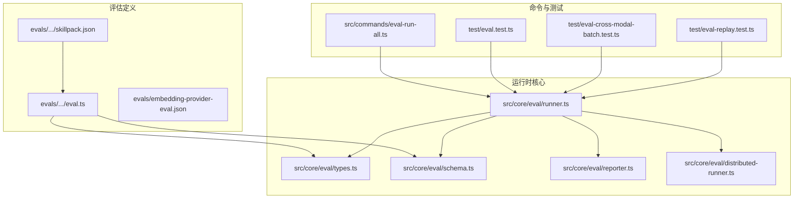
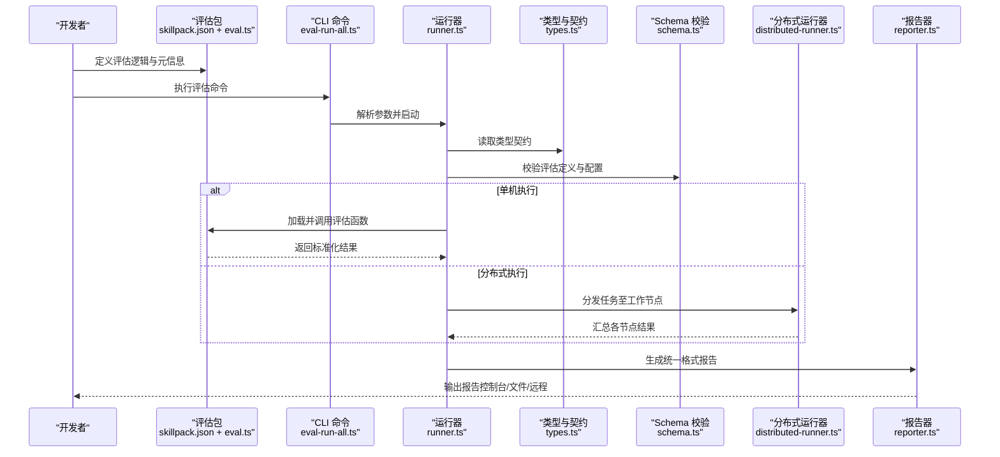
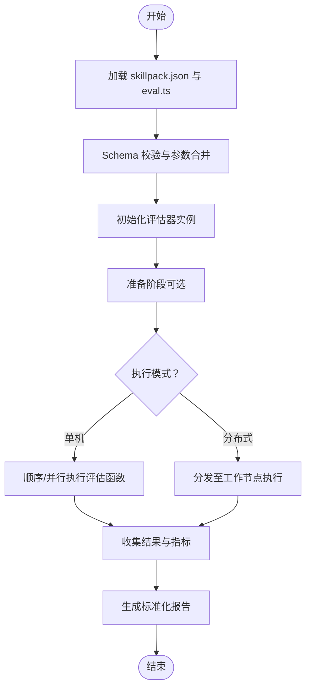
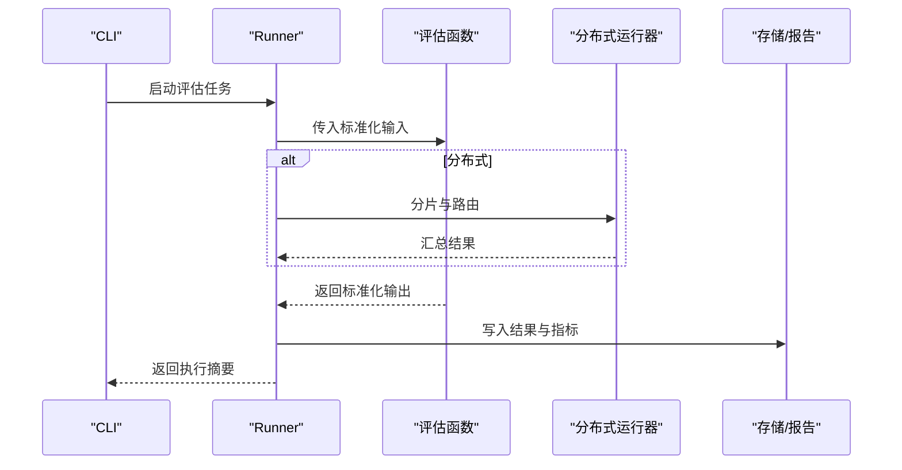
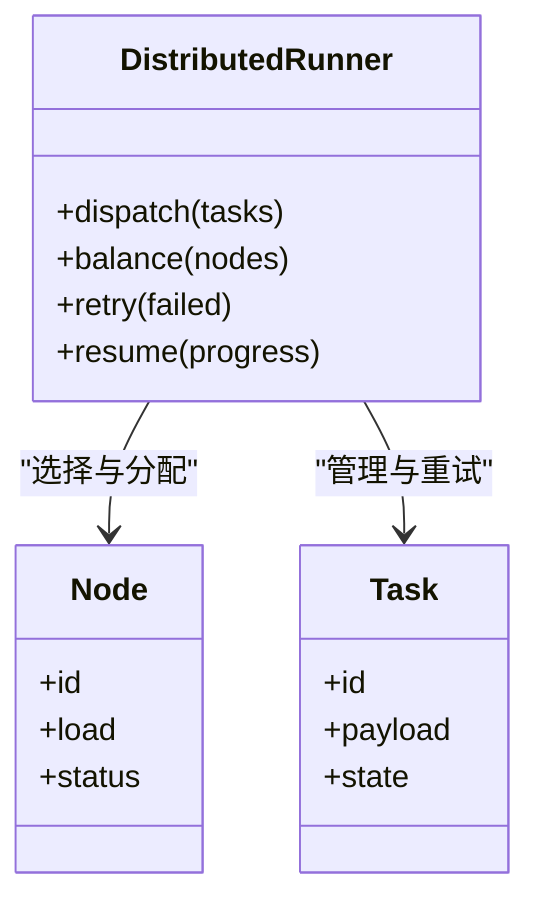
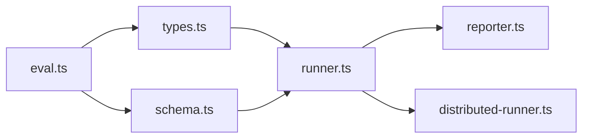

# 自定义评估器开发

<cite>
**本文引用的文件**   
- [README.md](file://README.md)
- [evals/embedding-provider-eval.json](file://evals/embedding-provider-eval.json)
- [evals/functional-area-resolver/skillpack.json](file://evals/functional-area-resolver/skillpack.json)
- [evals/functional-area-resolver/eval.ts](file://evals/functional-area-resolver/eval.ts)
- [evals/functional-area-resolver/test.ts](file://evals/functional-area-resolver/test.ts)
- [evals/skillopt-judge/eval.ts](file://evals/skillopt-judge/eval.ts)
- [evals/skillopt-reflect/eval.ts](file://evals/skillopt-reflect/eval.ts)
- [src/commands/eval-run-all.ts](file://src/commands/eval-run-all.ts)
- [src/core/eval/runner.ts](file://src/core/eval/runner.ts)
- [src/core/eval/types.ts](file://src/core/eval/types.ts)
- [src/core/eval/schema.ts](file://src/core/eval/schema.ts)
- [src/core/eval/reporter.ts](file://src/core/eval/reporter.ts)
- [src/core/eval/distributed-runner.ts](file://src/core/eval/distributed-runner.ts)
- [test/eval.test.ts](file://test/eval.test.ts)
- [test/eval-takes-quality-cli.test.ts](file://test/eval-takes-quality-cli.test.ts)
- [test/eval-cross-modal-batch.test.ts](file://test/eval-cross-modal-batch.test.ts)
- [test/eval-replay.test.ts](file://test/eval-replay.test.ts)
</cite>

## 目录
1. [简介](#简介)
2. [项目结构](#项目结构)
3. [核心组件](#核心组件)
4. [架构总览](#架构总览)
5. [详细组件分析](#详细组件分析)
6. [依赖关系分析](#依赖关系分析)
7. [性能考虑](#性能考虑)
8. [故障排查指南](#故障排查指南)
9. [结论](#结论)
10. [附录](#附录)

## 简介
本指南面向希望为系统编写“自定义评估器”的开发者，围绕评估器的架构设计、接口规范、生命周期管理、注册与配置、执行流程、输入输出格式与数据转换、结果标准化与报告生成、测试策略与调试工具、分布式执行模式与负载均衡、以及完整示例与最佳实践进行系统化说明。文档内容基于仓库中现有评估实现与运行框架，确保读者能够按图索骥完成从定义到落地的全流程。

## 项目结构
仓库中与评估相关的代码主要分布在以下位置：
- 评估定义与样例：evals 目录下包含多个评估包（如 functional-area-resolver、skillopt-judge、skillopt-reflect），每个包通常包含 skillpack.json 描述元信息，以及 eval.ts 等实现文件。
- 评估运行与调度：src/core/eval 下提供类型定义、Schema 校验、Runner 执行器、Reporter 报告器以及分布式 Runner 等核心能力。
- CLI 入口：src/commands 下提供评估相关命令（例如批量运行）。
- 测试用例：test 目录下覆盖评估运行、回放、跨模态批处理、CLI 行为等场景。

图表来源
- [evals/functional-area-resolver/skillpack.json](file://evals/functional-area-resolver/skillpack.json)
- [evals/functional-area-resolver/eval.ts](file://evals/functional-area-resolver/eval.ts)
- [evals/embedding-provider-eval.json](file://evals/embedding-provider-eval.json)
- [src/core/eval/types.ts](file://src/core/eval/types.ts)
- [src/core/eval/schema.ts](file://src/core/eval/schema.ts)
- [src/core/eval/runner.ts](file://src/core/eval/runner.ts)
- [src/core/eval/reporter.ts](file://src/core/eval/reporter.ts)
- [src/core/eval/distributed-runner.ts](file://src/core/eval/distributed-runner.ts)
- [src/commands/eval-run-all.ts](file://src/commands/eval-run-all.ts)
- [test/eval.test.ts](file://test/eval.test.ts)
- [test/eval-cross-modal-batch.test.ts](file://test/eval-cross-modal-batch.test.ts)
- [test/eval-replay.test.ts](file://test/eval-replay.test.ts)

章节来源
- [README.md](file://README.md)
- [evals/functional-area-resolver/skillpack.json](file://evals/functional-area-resolver/skillpack.json)
- [evals/functional-area-resolver/eval.ts](file://evals/functional-area-resolver/eval.ts)
- [evals/embedding-provider-eval.json](file://evals/embedding-provider-eval.json)
- [src/core/eval/types.ts](file://src/core/eval/types.ts)
- [src/core/eval/schema.ts](file://src/core/eval/schema.ts)
- [src/core/eval/runner.ts](file://src/core/eval/runner.ts)
- [src/core/eval/reporter.ts](file://src/core/eval/reporter.ts)
- [src/core/eval/distributed-runner.ts](file://src/core/eval/distributed-runner.ts)
- [src/commands/eval-run-all.ts](file://src/commands/eval-run-all.ts)
- [test/eval.test.ts](file://test/eval.test.ts)
- [test/eval-cross-modal-batch.test.ts](file://test/eval-cross-modal-batch.test.ts)
- [test/eval-replay.test.ts](file://test/eval-replay.test.ts)

## 核心组件
- 类型与契约（types.ts）：定义评估任务、输入输出、指标、上下文、错误与状态等核心数据结构，是评估器与运行时的契约边界。
- Schema 校验（schema.ts）：对评估定义与运行参数进行结构化校验，保障输入合法性与一致性。
- 运行器（runner.ts）：负责加载评估定义、解析配置、编排执行、收集指标、持久化结果与触发报告。
- 报告器（reporter.ts）：将评估结果转换为统一格式的报告，支持多种输出目标（控制台、文件、远程等）。
- 分布式运行器（distributed-runner.ts）：在集群或多进程环境下分发评估任务，实现负载均衡与容错重试。
- CLI 命令（eval-run-all.ts）：提供命令行入口，支持批量运行、过滤、并发控制与结果导出。

章节来源
- [src/core/eval/types.ts](file://src/core/eval/types.ts)
- [src/core/eval/schema.ts](file://src/core/eval/schema.ts)
- [src/core/eval/runner.ts](file://src/core/eval/runner.ts)
- [src/core/eval/reporter.ts](file://src/core/eval/reporter.ts)
- [src/core/eval/distributed-runner.ts](file://src/core/eval/distributed-runner.ts)
- [src/commands/eval-run-all.ts](file://src/commands/eval-run-all.ts)

## 架构总览
下图展示了自定义评估器从定义到执行的端到端流程，包括注册、配置、执行、结果标准化与报告生成，以及分布式扩展点。

图表来源
- [src/commands/eval-run-all.ts](file://src/commands/eval-run-all.ts)
- [src/core/eval/runner.ts](file://src/core/eval/runner.ts)
- [src/core/eval/types.ts](file://src/core/eval/types.ts)
- [src/core/eval/schema.ts](file://src/core/eval/schema.ts)
- [src/core/eval/distributed-runner.ts](file://src/core/eval/distributed-runner.ts)
- [src/core/eval/reporter.ts](file://src/core/eval/reporter.ts)
- [evals/functional-area-resolver/skillpack.json](file://evals/functional-area-resolver/skillpack.json)
- [evals/functional-area-resolver/eval.ts](file://evals/functional-area-resolver/eval.ts)

## 详细组件分析

### 评估器接口与生命周期
- 接口契约
  - 输入：遵循 types.ts 定义的请求体，包含任务标识、上下文、参数、资源引用等。
  - 输出：遵循 types.ts 定义的响应体，包含评分、指标、诊断信息、证据链接等。
  - 错误：统一的错误结构与可恢复性标记，便于重试与降级。
- 生命周期
  - 初始化：加载 skillpack.json 中的元信息与依赖；根据 schema.ts 校验配置。
  - 准备：按需预热外部服务或缓存数据。
  - 执行：按批次或单条处理输入，产出中间结果与最终指标。
  - 收尾：清理临时资源、上报遥测、写入审计日志。
- 注册机制
  - 通过 skillpack.json 声明式注册评估器名称、版本、入口文件与参数 Schema。
  - 运行器在发现评估包后自动纳入调度队列。

图表来源
- [evals/functional-area-resolver/skillpack.json](file://evals/functional-area-resolver/skillpack.json)
- [evals/functional-area-resolver/eval.ts](file://evals/functional-area-resolver/eval.ts)
- [src/core/eval/schema.ts](file://src/core/eval/schema.ts)
- [src/core/eval/runner.ts](file://src/core/eval/runner.ts)
- [src/core/eval/distributed-runner.ts](file://src/core/eval/distributed-runner.ts)

章节来源
- [src/core/eval/types.ts](file://src/core/eval/types.ts)
- [src/core/eval/schema.ts](file://src/core/eval/schema.ts)
- [src/core/eval/runner.ts](file://src/core/eval/runner.ts)
- [evals/functional-area-resolver/skillpack.json](file://evals/functional-area-resolver/skillpack.json)
- [evals/functional-area-resolver/eval.ts](file://evals/functional-area-resolver/eval.ts)

### 评估器注册与配置方法
- 注册
  - 在评估包的 skillpack.json 中声明评估器名称、版本、入口文件、参数 Schema 与依赖。
  - 运行器扫描已安装评估包，将其加入可用列表。
- 配置
  - 使用 JSON/YAML 或环境变量注入参数，由 schema.ts 进行强类型校验。
  - 支持默认值、必填项、枚举约束与范围限制。
- 选择与过滤
  - CLI 支持按名称、标签、版本筛选要运行的评估器集合。

章节来源
- [evals/functional-area-resolver/skillpack.json](file://evals/functional-area-resolver/skillpack.json)
- [src/core/eval/schema.ts](file://src/core/eval/schema.ts)
- [src/commands/eval-run-all.ts](file://src/commands/eval-run-all.ts)

### 执行流程与数据转换
- 执行流程
  - CLI 接收用户指令，解析参数并调用 runner.ts。
  - runner.ts 加载评估定义，校验配置，创建执行上下文。
  - 根据配置决定单机或分布式执行，收集结果并持久化。
- 数据转换
  - 输入侧：将外部数据源（JSON、CSV、数据库查询等）映射为 types.ts 要求的输入结构。
  - 输出侧：将评估器内部结果规范化为统一指标与证据结构，便于报告聚合。

图表来源
- [src/commands/eval-run-all.ts](file://src/commands/eval-run-all.ts)
- [src/core/eval/runner.ts](file://src/core/eval/runner.ts)
- [src/core/eval/distributed-runner.ts](file://src/core/eval/distributed-runner.ts)
- [evals/functional-area-resolver/eval.ts](file://evals/functional-area-resolver/eval.ts)

章节来源
- [src/core/eval/runner.ts](file://src/core/eval/runner.ts)
- [src/core/eval/distributed-runner.ts](file://src/core/eval/distributed-runner.ts)
- [evals/functional-area-resolver/eval.ts](file://evals/functional-area-resolver/eval.ts)

### 评估结果的标准化格式与报告生成
- 标准化格式
  - 使用 types.ts 定义的统一结果结构，包含评分、置信度、指标明细、证据与元数据。
- 报告生成
  - reporter.ts 将结果渲染为人类可读与机器可解析的报告，支持多目标输出。
  - 支持对比历史基线、趋势分析与回归检测。

章节来源
- [src/core/eval/types.ts](file://src/core/eval/types.ts)
- [src/core/eval/reporter.ts](file://src/core/eval/reporter.ts)

### 分布式评估的执行模式与负载均衡
- 执行模式
  - 任务分片：按输入键或哈希将数据集切分为子任务。
  - 工作节点：分布式运行器将子任务派发至可用节点，支持动态扩缩容。
- 负载均衡
  - 基于节点负载与网络延迟的动态分配，避免热点与长尾。
- 容错与重试
  - 失败任务自动重试，具备幂等性与去重机制。
  - 断点续跑：记录进度，支持中断恢复。

图表来源
- [src/core/eval/distributed-runner.ts](file://src/core/eval/distributed-runner.ts)

章节来源
- [src/core/eval/distributed-runner.ts](file://src/core/eval/distributed-runner.ts)

### 评估逻辑编写方法与最佳实践
- 编写要点
  - 严格遵循 types.ts 的输入输出契约，避免隐式依赖。
  - 将外部调用封装为可重试、可超时的模块，保证鲁棒性。
  - 输出尽可能多的可解释指标与证据，便于回溯与审计。
- 数据转换
  - 在评估函数入口处做最小必要的数据清洗与对齐，保持主逻辑纯净。
- 可观测性
  - 记录关键路径耗时、错误分类与资源使用，便于定位瓶颈。

章节来源
- [src/core/eval/types.ts](file://src/core/eval/types.ts)
- [evals/functional-area-resolver/eval.ts](file://evals/functional-area-resolver/eval.ts)
- [evals/skillopt-judge/eval.ts](file://evals/skillopt-judge/eval.ts)
- [evals/skillopt-reflect/eval.ts](file://evals/skillopt-reflect/eval.ts)

### 测试策略与调试工具
- 单元测试
  - 针对评估函数的输入输出进行断言，覆盖边界与异常分支。
- 集成测试
  - 使用 test/eval.test.ts 验证运行器与报告器链路。
- 回放与快照
  - 利用 test/eval-replay.test.ts 的能力对历史结果进行回放与比对。
- 批处理与跨模态
  - 参考 test/eval-cross-modal-batch.test.ts 验证大规模与多模态场景。
- CLI 行为
  - 通过 test/eval-takes-quality-cli.test.ts 验证命令参数与输出格式。

章节来源
- [test/eval.test.ts](file://test/eval.test.ts)
- [test/eval-replay.test.ts](file://test/eval-replay.test.ts)
- [test/eval-cross-modal-batch.test.ts](file://test/eval-cross-modal-batch.test.ts)
- [test/eval-takes-quality-cli.test.ts](file://test/eval-takes-quality-cli.test.ts)

### 完整开发示例与最佳实践清单
- 示例包
  - functional-area-resolver：展示评估包结构、skillpack.json 与 eval.ts 的配合方式。
  - skillopt-judge / skillopt-reflect：展示不同评估范式下的实现差异。
- 最佳实践清单
  - 明确契约：以 types.ts 为准绳，避免漂移。
  - 强校验：以 schema.ts 为前置门控，尽早失败。
  - 幂等与重试：确保分布式环境下的稳定性。
  - 可观测性：埋点与日志贯穿全链路。
  - 报告驱动：以 reporter.ts 的输出为目标反向设计指标。

章节来源
- [evals/functional-area-resolver/skillpack.json](file://evals/functional-area-resolver/skillpack.json)
- [evals/functional-area-resolver/eval.ts](file://evals/functional-area-resolver/eval.ts)
- [evals/skillopt-judge/eval.ts](file://evals/skillopt-judge/eval.ts)
- [evals/skillopt-reflect/eval.ts](file://evals/skillopt-reflect/eval.ts)

## 依赖关系分析
- 组件耦合
  - 评估函数仅依赖 types.ts 与 schema.ts，降低与运行时的耦合。
  - runner.ts 作为编排中心，协调 distributed-runner.ts 与 reporter.ts。
- 外部依赖
  - 评估函数可能依赖外部模型或服务，应通过适配器隔离。
- 循环依赖
  - 当前结构无循环依赖风险，职责清晰。

图表来源
- [src/core/eval/types.ts](file://src/core/eval/types.ts)
- [src/core/eval/schema.ts](file://src/core/eval/schema.ts)
- [src/core/eval/runner.ts](file://src/core/eval/runner.ts)
- [src/core/eval/reporter.ts](file://src/core/eval/reporter.ts)
- [src/core/eval/distributed-runner.ts](file://src/core/eval/distributed-runner.ts)
- [evals/functional-area-resolver/eval.ts](file://evals/functional-area-resolver/eval.ts)

章节来源
- [src/core/eval/types.ts](file://src/core/eval/types.ts)
- [src/core/eval/schema.ts](file://src/core/eval/schema.ts)
- [src/core/eval/runner.ts](file://src/core/eval/runner.ts)
- [src/core/eval/reporter.ts](file://src/core/eval/reporter.ts)
- [src/core/eval/distributed-runner.ts](file://src/core/eval/distributed-runner.ts)
- [evals/functional-area-resolver/eval.ts](file://evals/functional-area-resolver/eval.ts)

## 性能考虑
- 批处理与并发
  - 合理设置批大小与并发度，平衡吞吐与内存占用。
- 缓存与复用
  - 对昂贵的外部调用引入缓存层，减少重复计算。
- 流式与增量
  - 对大数据集采用流式处理，避免一次性加载导致 OOM。
- 监控与调优
  - 关注关键路径耗时与错误率，结合分布式运行器的指标进行容量规划。

[本节为通用指导，不直接分析具体文件]

## 故障排查指南
- 常见问题
  - 参数校验失败：检查 skillpack.json 与运行时参数的 Schema 匹配。
  - 外部服务超时：增加重试与退避策略，确认网络与配额。
  - 结果不一致：核对输入数据的确定性，启用回放与快照对比。
- 定位手段
  - 使用 CLI 的详细日志与报告输出，结合 reporter.ts 的多目标输出进行交叉验证。
  - 借助分布式运行器的重试与进度记录，快速定位失败节点与任务。

章节来源
- [src/core/eval/schema.ts](file://src/core/eval/schema.ts)
- [src/core/eval/reporter.ts](file://src/core/eval/reporter.ts)
- [src/core/eval/distributed-runner.ts](file://src/core/eval/distributed-runner.ts)

## 结论
通过明确的类型契约与 Schema 校验、清晰的运行器编排与报告器输出、以及可扩展的分布式执行能力，自定义评估器能够在保证一致性与可观测性的前提下高效落地。建议以现有评估包为模板，逐步完善输入输出、指标体系与报告形态，并在测试与回放中持续迭代优化。

[本节为总结性内容，不直接分析具体文件]

## 附录
- 参考样例
  - embedding-provider-eval.json：展示 JSON 形式的评估定义样例。
- 命令参考
  - eval-run-all.ts：批量运行评估的命令入口与常用选项。

章节来源
- [evals/embedding-provider-eval.json](file://evals/embedding-provider-eval.json)
- [src/commands/eval-run-all.ts](file://src/commands/eval-run-all.ts)