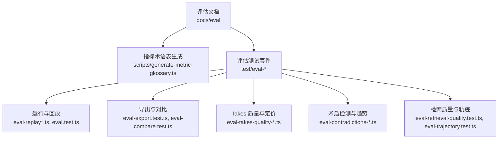
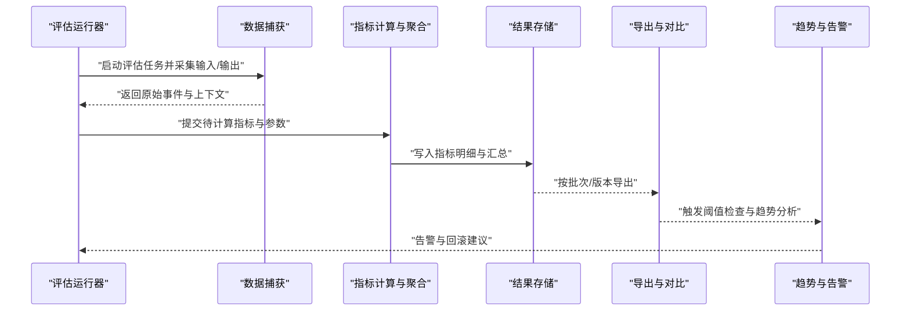
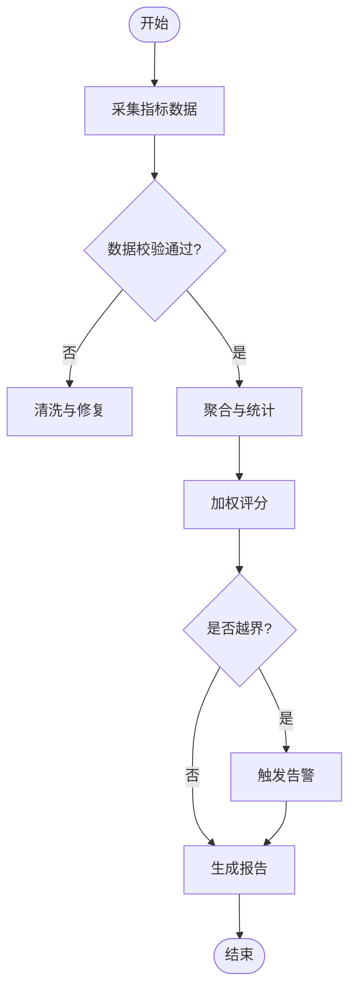
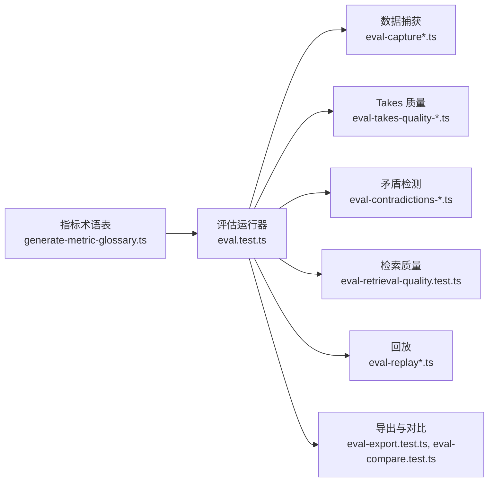

# 评估指标体系

<cite>
**本文引用的文件**   
- [eval-bench.md](file://docs/eval-bench.md)
- [eval-capture.md](file://docs/eval-capture.md)
- [eval-takes-quality.md](file://docs/eval-takes-quality.md)
- [generate-metric-glossary.ts](file://scripts/generate-metric-glossary.ts)
- [metric-glossary.test.ts](file://test/metric-glossary.test.ts)
- [eval-export.test.ts](file://test/eval-export.test.ts)
- [eval-replay.test.ts](file://test/eval-replay.test.ts)
- [eval-compare.test.ts](file://test/eval-compare.test.ts)
- [eval-conversation-parser-cli.test.ts](file://test/eval-conversation-parser-cli.test.ts)
- [eval-cross-modal-batch.test.ts](file://test/eval-cross-modal-batch.test.ts)
- [eval-takes-quality-aggregate.test.ts](file://test/eval-takes-quality-aggregate.test.ts)
- [eval-takes-quality-boundaries.test.ts](file://test/eval-takes-quality-boundaries.test.ts)
- [eval-takes-quality-pricing.test.ts](file://test/eval-takes-quality-pricing.test.ts)
- [eval-takes-quality-rubric.test.ts](file://test/eval-takes-quality-rubric.test.ts)
- [eval-takes-quality-runner.serial.test.ts](file://test/eval-takes-quality-runner.serial.test.ts)
- [eval-takes-quality-trend.test.ts](file://test/eval-takes-quality-trend.test.ts)
- [eval-contradictions-cost-prompt.test.ts](file://test/eval-contradictions-cost-prompt.test.ts)
- [eval-contradictions-cost.test.ts](file://test/eval-contradictions-cost.test.ts)
- [eval-contradictions-judge.test.ts](file://test/eval-contradictions-judge.test.ts)
- [eval-contradictions-runner.test.ts](file://test/eval-contradictions-runner.test.ts)
- [eval-contradictions-severity.test.ts](file://test/eval-contradictions-severity.test.ts)
- [eval-contradictions-trends.test.ts](file://test/eval-contradictions-trends.test.ts)
- [eval-contradictions-engine.test.ts](file://test/eval-contradictions-engine.test.ts)
- [eval-contradictions-integrations.test.ts](file://test/eval-contradictions-integrations.test.ts)
- [eval-contradictions-date-filter.test.ts](file://test/eval-contradictions-date-filter.test.ts)
- [eval-contradictions-fixture-redact.test.ts](file://test/eval-contradictions-fixture-redact.test.ts)
- [eval-contradictions-calibration.test.ts](file://test/eval-contradictions-calibration.test.ts)
- [eval-contradictions-auto-supersession.test.ts](file://test/eval-contradictions-auto-supersession.test.ts)
- [eval-contradictions-cache.test.ts](file://test/eval-contradictions-cache.test.ts)
- [eval-contradictions-judge-errors.test.ts](file://test/eval-contradictions-judge-errors.test.ts)
- [eval-contradictions-cross-source.test.ts](file://test/eval-contradictions-cross-source.test.ts)
- [eval-contradictions-budget-default.test.ts](file://test/eval-contradictions-budget-default.test.ts)
- [eval-retrieval-quality.test.ts](file://test/eval-retrieval-quality.test.ts)
- [eval-schema-authoring.test.ts](file://test/eval-schema-authoring.test.ts)
- [eval-whoknows.test.ts](file://test/eval-whoknows.test.ts)
- [eval.test.ts](file://test/eval.test.ts)
- [eval-candidates.test.ts](file://test/eval-candidates.test.ts)
- [eval-gate.test.ts](file://test/eval-gate.test.ts)
- [eval-longmemeval-e2e.slow.test.ts](file://test/eval-longmemeval-e2e.slow.test.ts)
- [eval-longmemeval.slow.test.ts](file://test/eval-longmemeval.slow.test.ts)
- [eval-prune.test.ts](file://test/eval-prune.test.ts)
- [eval-replay-gate.test.ts](file://test/eval-replay-gate.test.ts)
- [eval-replay-metadata-skip.test.ts](file://test/eval-replay-metadata-skip.test.ts)
- [eval-shared-json-repair-shim.test.ts](file://test/eval-shared-json-repair-shim.test.ts)
- [eval-trajectory.test.ts](file://test/eval-trajectory.test.ts)
- [eval-v041_2-scaffolds.test.ts](file://test/eval-v041_2-scaffolds.test.ts)
- [eval-capture-drain.test.ts](file://test/eval-capture-drain.test.ts)
- [eval-capture-scrub.test.ts](file://test/eval-capture-scrub.test.ts)
- [eval-capture.test.ts](file://test/eval-capture.test.ts)
- [eval-contradictions-auto-supersession.test.ts](file://test/eval-contradictions-auto-supersession.test.ts)
- [eval-contradictions-calibration-join.test.ts](file://test/eval-contradictions-calibration-join.test.ts)
- [eval-contradictions-fixture-redact.test.ts](file://test/eval-contradictions-fixture-redact.test.ts)
- [eval-contradictions-judge-errors.test.ts](file://test/eval-contradictions-judge-errors.test.ts)
- [eval-contradictions-severity.test.ts](file://test/eval-contradictions-severity.test.ts)
- [eval-contradictions-trends.test.ts](file://test/eval-contradictions-trends.test.ts)
- [eval-contradictions-engine.test.ts](file://test/eval-contradictions-engine.test.ts)
- [eval-contradictions-integrations.test.ts](file://test/eval-contradictions-integrations.test.ts)
- [eval-contradictions-date-filter.test.ts](file://test/eval-contradictions-date-filter.test.ts)
- [eval-contradictions-fixture-redact.test.ts](file://test/eval-contradictions-fixture-redact.test.ts)
- [eval-contradictions-calibration.test.ts](file://test/eval-contradictions-calibration.test.ts)
- [eval-contradictions-auto-supersession.test.ts](file://test/eval-contradictions-auto-supersession.test.ts)
- [eval-contradictions-cache.test.ts](file://test/eval-contradictions-cache.test.ts)
- [eval-contradictions-judge-errors.test.ts](file://test/eval-contradictions-judge-errors.test.ts)
- [eval-contradictions-cross-source.test.ts](file://test/eval-contradictions-cross-source.test.ts)
- [eval-contradictions-budget-default.test.ts](file://test/eval-contradictions-budget-default.test.ts)
</cite>

## 目录
1. [引言](#引言)
2. [项目结构](#项目结构)
3. [核心组件](#核心组件)
4. [架构总览](#架构总览)
5. [详细组件分析](#详细组件分析)
6. [依赖分析](#依赖分析)
7. [性能考虑](#性能考虑)
8. [故障排查指南](#故障排查指南)
9. [结论](#结论)
10. [附录](#附录)

## 引言
本文件面向工程与产品团队，系统化梳理评估指标体系，覆盖性能、质量与成本三大类指标的定义、计算方法与适用场景；说明权重配置、阈值设置与告警规则；给出指标采集、聚合与分析的实现方法；提供自定义指标开发指南与最佳实践；并明确指标数据的存储格式与查询接口。文档内容基于仓库中的评估相关文档与测试用例进行归纳与提炼，确保与实际实现保持一致。

## 项目结构
围绕评估指标体系的相关代码与文档主要分布在以下位置：
- docs/eval：评估方法论与流程文档（如基准评测、数据捕获、Takes 质量等）
- scripts/generate-metric-glossary.ts：指标术语表生成脚本
- test/*：大量评估相关的测试用例，涵盖运行器、回放、导出、对比、矛盾检测、定价与预算、趋势与聚合等

图表来源
- [eval-bench.md](file://docs/eval-bench.md)
- [eval-capture.md](file://docs/eval-capture.md)
- [eval-takes-quality.md](file://docs/eval-takes-quality.md)
- [generate-metric-glossary.ts](file://scripts/generate-metric-glossary.ts)
- [eval-replay.test.ts](file://test/eval-replay.test.ts)
- [eval-export.test.ts](file://test/eval-export.test.ts)
- [eval-compare.test.ts](file://test/eval-compare.test.ts)
- [eval-takes-quality-pricing.test.ts](file://test/eval-takes-quality-pricing.test.ts)
- [eval-contradictions-trends.test.ts](file://test/eval-contradictions-trends.test.ts)
- [eval-retrieval-quality.test.ts](file://test/eval-retrieval-quality.test.ts)
- [eval-trajectory.test.ts](file://test/eval-trajectory.test.ts)

章节来源
- [eval-bench.md](file://docs/eval-bench.md)
- [eval-capture.md](file://docs/eval-capture.md)
- [eval-takes-quality.md](file://docs/eval-takes-quality.md)
- [generate-metric-glossary.ts](file://scripts/generate-metric-glossary.ts)
- [eval-replay.test.ts](file://test/eval-replay.test.ts)
- [eval-export.test.ts](file://test/eval-export.test.ts)
- [eval-compare.test.ts](file://test/eval-compare.test.ts)
- [eval-takes-quality-pricing.test.ts](file://test/eval-takes-quality-pricing.test.ts)
- [eval-contradictions-trends.test.ts](file://test/eval-contradictions-trends.test.ts)
- [eval-retrieval-quality.test.ts](file://test/eval-retrieval-quality.test.ts)
- [eval-trajectory.test.ts](file://test/eval-trajectory.test.ts)

## 核心组件
- 指标术语表与元数据
  - 通过脚本生成统一的指标术语表，便于跨模块引用与一致性维护。
  - 术语表用于规范指标命名、单位、维度与计算口径。
- 评估运行与回放
  - 支持批量执行评估任务、记录轨迹与结果，并提供回放能力以复现历史评估。
- 导出与对比
  - 将评估结果导出为结构化数据，支持多版本或多次运行的对比分析。
- Takes 质量与定价
  - 针对“Takes”产物的质量评估，包含评分标准、边界条件、价格与预算控制。
- 矛盾检测与趋势
  - 对知识抽取结果进行矛盾识别、严重度分级、时间趋势分析与校准。
- 检索质量与轨迹
  - 评估检索召回与排序效果，结合轨迹数据进行可解释性分析。

章节来源
- [generate-metric-glossary.ts](file://scripts/generate-metric-glossary.ts)
- [eval-replay.test.ts](file://test/eval-replay.test.ts)
- [eval-export.test.ts](file://test/eval-export.test.ts)
- [eval-compare.test.ts](file://test/eval-compare.test.ts)
- [eval-takes-quality-pricing.test.ts](file://test/eval-takes-quality-pricing.test.ts)
- [eval-contradictions-trends.test.ts](file://test/eval-contradictions-trends.test.ts)
- [eval-retrieval-quality.test.ts](file://test/eval-retrieval-quality.test.ts)
- [eval-trajectory.test.ts](file://test/eval-trajectory.test.ts)

## 架构总览
评估指标体系的整体流程包括：数据采集与捕获、指标计算与聚合、结果导出与对比、趋势与告警分析。

图表来源
- [eval-capture.test.ts](file://test/eval-capture.test.ts)
- [eval-replay.test.ts](file://test/eval-replay.test.ts)
- [eval-export.test.ts](file://test/eval-export.test.ts)
- [eval-compare.test.ts](file://test/eval-compare.test.ts)
- [eval-takes-quality-runner.serial.test.ts](file://test/eval-takes-quality-runner.serial.test.ts)
- [eval-contradictions-trends.test.ts](file://test/eval-contradictions-trends.test.ts)

## 详细组件分析

### 指标分类与定义
- 性能指标
  - 响应时间：端到端延迟、分阶段耗时（请求处理、模型调用、I/O）。
  - 吞吐量：单位时间内完成的评估任务数或样本数。
  - 资源利用率：CPU、内存、GPU、网络带宽使用率。
- 质量指标
  - 准确性：预测/抽取结果与参考的匹配程度（如准确率、F1）。
  - 完整性：缺失字段或样本比例。
  - 一致性：跨源或多轮结果的一致性（含矛盾检测）。
- 成本指标
  - API 调用次数：各提供商调用计数。
  - Token 消耗：输入/输出 token 统计与折算。
  - 预算与超支：单次/批次预算上限与超支告警。

章节来源
- [eval-takes-quality-pricing.test.ts](file://test/eval-takes-quality-pricing.test.ts)
- [eval-contradictions-cost.test.ts](file://test/eval-contradictions-cost.test.ts)
- [eval-contradictions-cost-prompt.test.ts](file://test/eval-contradictions-cost-prompt.test.ts)
- [eval-retrieval-quality.test.ts](file://test/eval-retrieval-quality.test.ts)

### 权重配置与阈值设置
- 权重配置
  - 多维度加权：性能、质量、成本分别赋予权重，支持按业务目标动态调整。
  - 归一化策略：不同量纲指标需先归一化再加权求和。
- 阈值设置
  - 静态阈值：基于 SLA/SLO 设定固定上下限。
  - 动态阈值：基于历史分布（如分位数）自适应调整。
- 告警规则
  - 单指标越界：超过阈值即告警。
  - 复合告警：多个指标同时异常时提升告警级别。
  - 抑制与合并：避免风暴式告警，支持去重与合并。

章节来源
- [eval-takes-quality-rubric.test.ts](file://test/eval-takes-quality-rubric.test.ts)
- [eval-takes-quality-boundaries.test.ts](file://test/eval-takes-quality-boundaries.test.ts)
- [eval-contradictions-severity.test.ts](file://test/eval-contradictions-severity.test.ts)

### 指标收集、聚合与分析
- 收集
  - 在评估运行过程中埋点，记录关键事件（开始、结束、错误、重试）。
  - 捕获输入/输出、中间状态与外部调用详情。
- 聚合
  - 按任务、批次、版本、提供者等多维度聚合。
  - 计算均值、分位数、方差、同比/环比变化。
- 分析
  - 趋势分析：时间序列上的升降与拐点。
  - 对比分析：多版本/多配置的差异显著性检验。
  - 根因定位：关联日志与轨迹，定位瓶颈与异常。

章节来源
- [eval-capture.test.ts](file://test/eval-capture.test.ts)
- [eval-capture-drain.test.ts](file://test/eval-capture-drain.test.ts)
- [eval-capture-scrub.test.ts](file://test/eval-capture-scrub.test.ts)
- [eval-takes-quality-aggregate.test.ts](file://test/eval-takes-quality-aggregate.test.ts)
- [eval-contradictions-trends.test.ts](file://test/eval-contradictions-trends.test.ts)

### 自定义指标开发指南与最佳实践
- 开发步骤
  - 定义指标名称、单位、维度与计算公式。
  - 在运行器中注册指标采集钩子。
  - 编写单元测试验证计算正确性与边界行为。
- 最佳实践
  - 幂等与容错：重复采集不产生副作用。
  - 采样与降采样：高频指标采用采样降低开销。
  - 标签标准化：统一键名与枚举值，便于聚合与查询。
  - 可观测性：保留必要上下文以便回溯。

章节来源
- [eval-schema-authoring.test.ts](file://test/eval-schema-authoring.test.ts)
- [eval-trajectory.test.ts](file://test/eval-trajectory.test.ts)
- [eval-shared-json-repair-shim.test.ts](file://test/eval-shared-json-repair-shim.test.ts)

### 数据存储格式与查询接口
- 存储格式
  - 指标明细：每条记录包含时间戳、任务ID、指标名、数值、维度标签。
  - 指标汇总：按窗口与维度聚合后的统计结果。
  - 元数据：指标定义、权重、阈值、告警规则。
- 查询接口
  - 按时间范围与维度过滤查询。
  - 支持聚合函数（均值、P95、P99、方差）。
  - 导出为 CSV/JSON 供下游系统消费。

章节来源
- [eval-export.test.ts](file://test/eval-export.test.ts)
- [eval-compare.test.ts](file://test/eval-compare.test.ts)
- [eval-replay.test.ts](file://test/eval-replay.test.ts)

### 评估运行与回放
- 运行
  - 批量加载样本集，并行执行评估任务。
  - 实时写入指标与中间结果。
- 回放
  - 基于历史快照恢复输入与上下文，保证结果可复现。
  - 支持增量回放与断点续跑。

章节来源
- [eval.test.ts](file://test/eval.test.ts)
- [eval-replay.test.ts](file://test/eval-replay.test.ts)
- [eval-replay-gate.test.ts](file://test/eval-replay-gate.test.ts)
- [eval-replay-metadata-skip.test.ts](file://test/eval-replay-metadata-skip.test.ts)

### 导出与对比
- 导出
  - 将评估结果导出为标准格式，便于归档与共享。
- 对比
  - 多版本/多配置对比，突出差异与回归。
  - 可视化差异报告与变更摘要。

章节来源
- [eval-export.test.ts](file://test/eval-export.test.ts)
- [eval-compare.test.ts](file://test/eval-compare.test.ts)

### Takes 质量与定价
- 质量
  - 评分标准与权重组合，支持多种评价维度。
  - 边界条件与异常路径覆盖。
- 定价
  - 按调用次数与 token 消耗计费，支持预算上限与超支保护。

章节来源
- [eval-takes-quality-runner.serial.test.ts](file://test/eval-takes-quality-runner.serial.test.ts)
- [eval-takes-quality-rubric.test.ts](file://test/eval-takes-quality-rubric.test.ts)
- [eval-takes-quality-pricing.test.ts](file://test/eval-takes-quality-pricing.test.ts)
- [eval-takes-quality-boundaries.test.ts](file://test/eval-takes-quality-boundaries.test.ts)

### 矛盾检测与趋势
- 矛盾检测
  - 识别不一致事实与冲突，标注严重度。
  - 自动升级与降级策略，减少误报。
- 趋势
  - 时间序列上的矛盾数量与严重度变化。
  - 校准与反馈闭环，持续优化检测精度。

章节来源
- [eval-contradictions-runner.test.ts](file://test/eval-contradictions-runner.test.ts)
- [eval-contradictions-judge.test.ts](file://test/eval-contradictions-judge.test.ts)
- [eval-contradictions-severity.test.ts](file://test/eval-contradictions-severity.test.ts)
- [eval-contradictions-trends.test.ts](file://test/eval-contradictions-trends.test.ts)
- [eval-contradictions-engine.test.ts](file://test/eval-contradictions-engine.test.ts)
- [eval-contradictions-integrations.test.ts](file://test/eval-contradictions-integrations.test.ts)
- [eval-contradictions-date-filter.test.ts](file://test/eval-contradictions-date-filter.test.ts)
- [eval-contradictions-fixture-redact.test.ts](file://test/eval-contradictions-fixture-redact.test.ts)
- [eval-contradictions-calibration.test.ts](file://test/eval-contradictions-calibration.test.ts)
- [eval-contradictions-auto-supersession.test.ts](file://test/eval-contradictions-auto-supersession.test.ts)
- [eval-contradictions-cache.test.ts](file://test/eval-contradictions-cache.test.ts)
- [eval-contradictions-judge-errors.test.ts](file://test/eval-contradictions-judge-errors.test.ts)
- [eval-contradictions-cross-source.test.ts](file://test/eval-contradictions-cross-source.test.ts)
- [eval-contradictions-budget-default.test.ts](file://test/eval-contradictions-budget-default.test.ts)

### 检索质量与轨迹
- 检索质量
  - 召回率、精确率、排序质量等指标。
  - 与用户交互与点击信号结合评估。
- 轨迹
  - 记录检索路径与决策节点，支持可解释性分析。

章节来源
- [eval-retrieval-quality.test.ts](file://test/eval-retrieval-quality.test.ts)
- [eval-trajectory.test.ts](file://test/eval-trajectory.test.ts)

### 概念总览

[此图为概念流程图，无需图表来源]

## 依赖分析
评估指标体系内部组件之间的依赖关系如下：

图表来源
- [generate-metric-glossary.ts](file://scripts/generate-metric-glossary.ts)
- [eval.test.ts](file://test/eval.test.ts)
- [eval-capture.test.ts](file://test/eval-capture.test.ts)
- [eval-takes-quality-runner.serial.test.ts](file://test/eval-takes-quality-runner.serial.test.ts)
- [eval-contradictions-runner.test.ts](file://test/eval-contradictions-runner.test.ts)
- [eval-retrieval-quality.test.ts](file://test/eval-retrieval-quality.test.ts)
- [eval-replay.test.ts](file://test/eval-replay.test.ts)
- [eval-export.test.ts](file://test/eval-export.test.ts)
- [eval-compare.test.ts](file://test/eval-compare.test.ts)

章节来源
- [generate-metric-glossary.ts](file://scripts/generate-metric-glossary.ts)
- [eval.test.ts](file://test/eval.test.ts)
- [eval-capture.test.ts](file://test/eval-capture.test.ts)
- [eval-takes-quality-runner.serial.test.ts](file://test/eval-takes-quality-runner.serial.test.ts)
- [eval-contradictions-runner.test.ts](file://test/eval-contradictions-runner.test.ts)
- [eval-retrieval-quality.test.ts](file://test/eval-retrieval-quality.test.ts)
- [eval-replay.test.ts](file://test/eval-replay.test.ts)
- [eval-export.test.ts](file://test/eval-export.test.ts)
- [eval-compare.test.ts](file://test/eval-compare.test.ts)

## 性能考虑
- 批处理与并发
  - 合理设置并发度，避免资源争用与抖动。
- 采样与降采样
  - 高频指标采用采样策略，平衡精度与开销。
- 缓存与复用
  - 复用中间结果与索引，减少重复计算。
- 监控与自诊断
  - 内置健康检查与慢查询定位，快速发现瓶颈。

[本节为通用指导，无需章节来源]

## 故障排查指南
- 常见问题
  - 指标缺失：检查采集钩子与埋点是否正确注册。
  - 数据不一致：核对维度标签与归一化策略。
  - 阈值误报：确认静态/动态阈值配置与历史基线。
- 调试手段
  - 启用详细日志与轨迹回放。
  - 使用导出与对比工具定位差异。
  - 隔离问题样本，最小化复现场景。

章节来源
- [eval-capture-scrub.test.ts](file://test/eval-capture-scrub.test.ts)
- [eval-compare.test.ts](file://test/eval-compare.test.ts)
- [eval-replay.test.ts](file://test/eval-replay.test.ts)

## 结论
本评估指标体系以术语表为基础，贯穿采集、计算、聚合、导出、对比、趋势与告警全流程，覆盖性能、质量与成本三大维度。通过严格的阈值与告警机制，以及完善的回放与对比能力，保障评估结果的可靠性与可追溯性。建议在实际落地中结合业务目标动态调整权重与阈值，并持续完善自定义指标与最佳实践。

[本节为总结，无需章节来源]

## 附录
- 术语表生成
  - 通过脚本统一维护指标定义，确保跨模块一致。
- 评估基准与捕获
  - 基准评测方法与数据捕获流程详见文档。
- 质量与定价
  - Takes 质量评分与定价策略见对应文档与测试。

章节来源
- [eval-bench.md](file://docs/eval-bench.md)
- [eval-capture.md](file://docs/eval-capture.md)
- [eval-takes-quality.md](file://docs/eval-takes-quality.md)
- [generate-metric-glossary.ts](file://scripts/generate-metric-glossary.ts)
- [metric-glossary.test.ts](file://test/metric-glossary.test.ts)