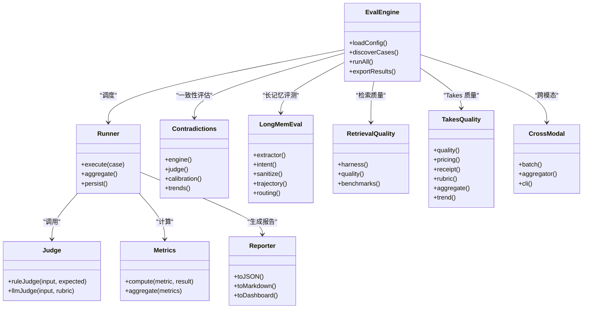
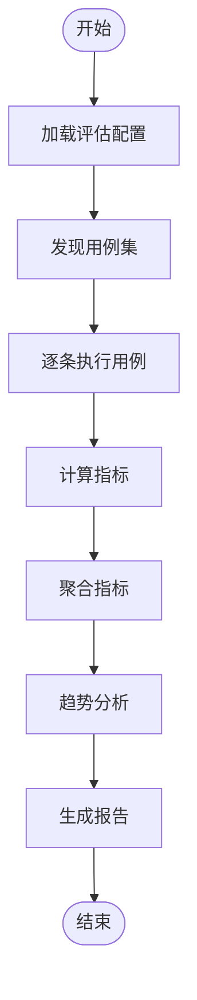
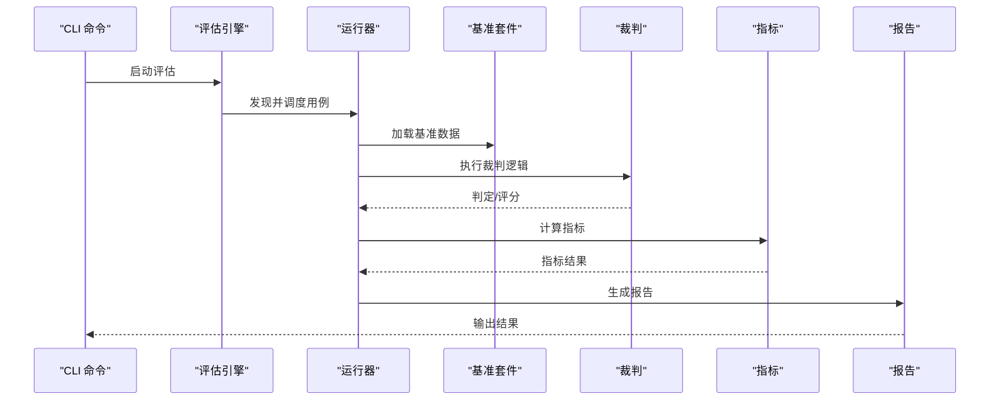
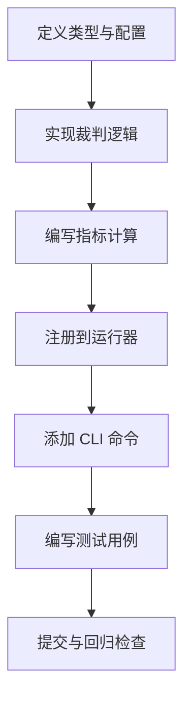
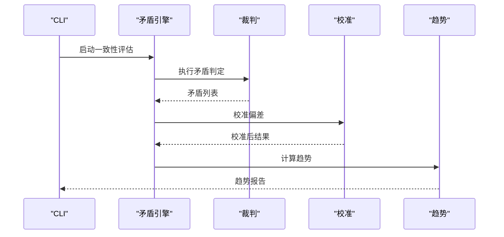
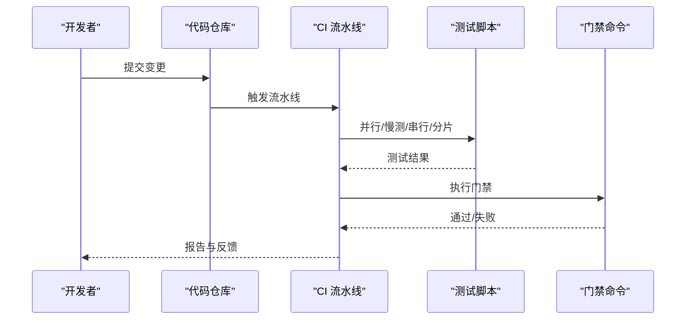
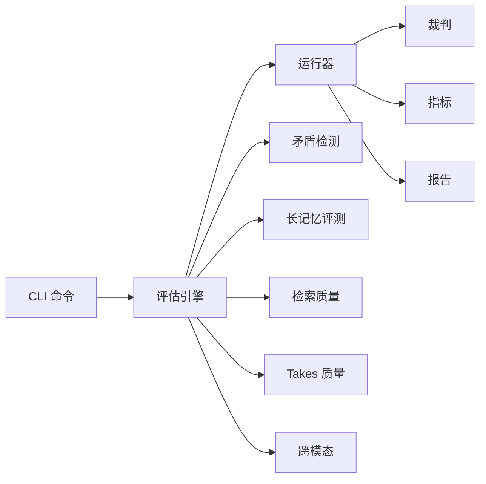

# 评估框架

<cite>
**本文引用的文件**   
- [README.md](file://README.md)
- [eval-bench.md](file://docs/eval-bench.md)
- [eval-capture.md](file://docs/eval-capture.md)
- [eval-takes-quality.md](file://docs/eval-takes-quality.md)
- [package.json](file://package.json)
- [tsconfig.json](file://tsconfig.json)
- [bunfig.toml](file://bunfig.toml)
- [docker-compose.ci.yml](file://docker-compose.ci.yml)
- [docker-compose.test.yml](file://docker-compose.test.yml)
- [scripts/run-unit-parallel.sh](file://scripts/run-unit-parallel.sh)
- [scripts/run-heavy.sh](file://scripts/run-heavy.sh)
- [scripts/run-slow-tests.sh](file://scripts/run-slow-tests.sh)
- [scripts/run-serial-tests.sh](file://scripts/run-serial-tests.sh)
- [scripts/test-shard.sh](file://scripts/test-shard.sh)
- [scripts/ci-local.sh](file://scripts/ci-local.sh)
- [scripts/smoke-test.sh](file://scripts/smoke-test.sh)
- [scripts/profile-tests.sh](file://scripts/profile-tests.sh)
- [scripts/e2e-test-map.ts](file://scripts/e2e-test-map.ts)
- [scripts/select-e2e.ts](file://scripts/select-e2e.ts)
- [scripts/sharding.ts](file://scripts/sharding.ts)
- [scripts/generate-metric-glossary.ts](file://scripts/generate-metric-glossary.ts)
- [src/cli.ts](file://src/cli.ts)
- [src/commands/eval-run-all.ts](file://src/commands/eval-run-all.ts)
- [src/commands/eval-export.ts](file://src/commands/eval-export.ts)
- [src/commands/eval-replay.ts](file://src/commands/eval-replay.ts)
- [src/commands/eval-gate.ts](file://src/commands/eval-gate.ts)
- [src/commands/eval-retrieval-quality.ts](file://src/commands/eval-retrieval-quality.ts)
- [src/commands/eval-takes-quality-cli.ts](file://src/commands/eval-takes-quality-cli.ts)
- [src/core/eval/engine.ts](file://src/core/eval/engine.ts)
- [src/core/eval/runner.ts](file://src/core/eval/runner.ts)
- [src/core/eval/judge.ts](file://src/core/eval/judge.ts)
- [src/core/eval/metrics.ts](file://src/core/eval/metrics.ts)
- [src/core/eval/reporter.ts](file://src/core/eval/reporter.ts)
- [src/core/eval/types.ts](file://src/core/eval/types.ts)
- [src/core/eval/config.ts](file://src/core/eval/config.ts)
- [src/core/eval/contradictions/engine.ts](file://src/core/eval/contradictions/engine.ts)
- [src/core/eval/contradictions/judge.ts](file://src/core/eval/contradictions/judge.ts)
- [src/core/eval/contradictions/calibration.ts](file://src/core/eval/contradictions/calibration.ts)
- [src/core/eval/contradictions/trends.ts](file://src/core/eval/contradictions/trends.ts)
- [src/core/eval/longmemeval/extractor.ts](file://src/core/eval/longmemeval/extractor.ts)
- [src/core/eval/longmemeval/intent.ts](file://src/core/eval/longmemeval/intent.ts)
- [src/core/eval/longmemeval/sanitize.ts](file://src/core/eval/longmemeval/sanitize.ts)
- [src/core/eval/longmemeval/trajectory.ts](file://src/core/eval/longmemeval/trajectory.ts)
- [src/core/eval/longmemeval/routing.ts](file://src/core/eval/longmemeval/routing.ts)
- [src/core/eval/retrieval/harness.ts](file://src/core/eval/retrieval/harness.ts)
- [src/core/eval/retrieval/quality.ts](file://src/core/eval/retrieval/quality.ts)
- [src/core/eval/retrieval/benchmarks.ts](file://src/core/eval/retrieval/benchmarks.ts)
- [src/core/eval/takes/quality.ts](file://src/core/eval/takes/quality.ts)
- [src/core/eval/takes/pricing.ts](file://src/core/eval/takes/pricing.ts)
- [src/core/eval/takes/receipt.ts](file://src/core/eval/takes/receipt.ts)
- [src/core/eval/takes/rubric.ts](file://src/core/eval/takes/rubric.ts)
- [src/core/eval/takes/aggregate.ts](file://src/core/eval/takes/aggregate.ts)
- [src/core/eval/takes/trend.ts](file://src/core/eval/takes/trend.ts)
- [src/core/eval/cross-modal/batch.ts](file://src/core/eval/cross-modal/batch.ts)
- [src/core/eval/cross-modal/aggregator.ts](file://src/core/eval/cross-modal/aggregator.ts)
- [src/core/eval/cross-modal/cli.ts](file://src/core/eval/cross-modal/cli.ts)
- [evals/embedding-provider-eval.json](file://evals/embedding-provider-eval.json)
- [examples/skillpack-reference/evals/example-eval.json](file://examples/skillpack-reference/evals/example-eval.json)
- [test/eval.test.ts](file://test/eval.test.ts)
- [test/eval-run-all.test.ts](file://test/eval-run-all.test.ts)
- [test/eval-export.test.ts](file://test/eval-export.test.ts)
- [test/eval-replay.test.ts](file://test/eval-replay.test.ts)
- [test/eval-gate.test.ts](file://test/eval-gate.test.ts)
- [test/eval-retrieval-quality.test.ts](file://test/eval-retrieval-quality.test.ts)
- [test/eval-takes-quality-runner.serial.test.ts](file://test/eval-takes-quality-runner.serial.test.ts)
- [test/eval-takes-quality-rubric.test.ts](file://test/eval-takes-quality-rubric.test.ts)
- [test/eval-takes-quality-pricing.test.ts](file://test/eval-takes-quality-pricing.test.ts)
- [test/eval-takes-quality-aggregate.test.ts](file://test/eval-takes-quality-aggregate.test.ts)
- [test/eval-takes-quality-trend.test.ts](file://test/eval-takes-quality-trend.test.ts)
- [test/eval-contradictions-engine.test.ts](file://test/eval-contradictions-engine.test.ts)
- [test/eval-contradictions-judge.test.ts](file://test/eval-contradictions-judge.test.ts)
- [test/eval-contradictions-calibration.test.ts](file://test/eval-contradictions-calibration.test.ts)
- [test/eval-contradictions-trends.test.ts](file://test/eval-contradictions-trends.test.ts)
- [test/eval-cross-modal-batch.test.ts](file://test/eval-cross-modal-batch.test.ts)
- [test/eval-longmemeval.slow.test.ts](file://test/eval-longmemeval.slow.test.ts)
- [test/eval-longmemeval-extract.test.ts](file://test/eval-longmemeval-extract.test.ts)
- [test/eval-longmemeval-intent.test.ts](file://test/eval-longmemeval-intent.test.ts)
- [test/eval-longmemeval-sanitize.test.ts](file://test/eval-longmemeval-sanitize.test.ts)
- [test/eval-longmemeval-trajectory-routing.test.ts](file://test/eval-longmemeval-trajectory-routing.test.ts)
</cite>

## 目录
1. [简介](#简介)
2. [项目结构](#项目结构)
3. [核心组件](#核心组件)
4. [架构总览](#架构总览)
5. [详细组件分析](#详细组件分析)
6. [依赖关系分析](#依赖关系分析)
7. [性能考量](#性能考量)
8. [故障排查指南](#故障排查指南)
9. [结论](#结论)
10. [附录](#附录)

## 简介
本文件面向“评估框架”的开发者与使用者，系统化阐述指标体系、基准测试套件、自定义评估器开发方法，覆盖性能评估、质量评估与一致性评估的实现路径。文档同时给出评估数据准备、测试用例设计、结果分析与可视化、自动化流水线与回归策略、大规模并行与资源管理、以及调优建议等实践指导。

## 项目结构
仓库围绕“评估能力”在多处组织：
- 文档层：评估方法论与流程说明（如基准、捕获、Takes 质量等）
- 源码层：评估引擎、运行器、裁判、指标、报告、子域（矛盾检测、长记忆评测、检索质量、跨模态、Takes 质量等）
- 命令层：CLI 入口与具体评估命令（运行全部、导出、回放、门禁、检索质量、Takes 质量等）
- 测试层：针对各模块的单元测试与集成测试
- 脚本层：并行、分片、慢测、重测、CI 本地执行、冒烟测试、性能剖析等
- 配置层：包配置、TS 编译、Bun 运行时、Docker Compose CI/Test 编排
- 示例与数据集：示例 Skillpack 中的 eval 定义、嵌入提供者评估数据

```mermaid
graph TB
subgraph "文档"
D1["docs/eval-bench.md"]
D2["docs/eval-capture.md"]
D3["docs/eval-takes-quality.md"]
end
subgraph "源码"
C1["src/core/eval/*"]
C2["src/commands/*eval*"]
C3["src/core/eval/contradictions/*"]
C4["src/core/eval/longmemeval/*"]
C5["src/core/eval/retrieval/*"]
C6["src/core/eval/takes/*"]
C7["src/core/eval/cross-modal/*"]
end
subgraph "测试"
T1["test/eval*.ts"]
end
subgraph "脚本"
S1["scripts/run-unit-parallel.sh"]
S2["scripts/run-heavy.sh"]
S3["scripts/run-slow-tests.sh"]
S4["scripts/run-serial-tests.sh"]
S5["scripts/test-shard.sh"]
S6["scripts/ci-local.sh"]
S7["scripts/smoke-test.sh"]
S8["scripts/profile-tests.sh"]
S9["scripts/e2e-test-map.ts"]
S10["scripts/select-e2e.ts"]
S11["scripts/sharding.ts"]
S12["scripts/generate-metric-glossary.ts"]
end
subgraph "配置"
P1["package.json"]
P2["tsconfig.json"]
P3["bunfig.toml"]
P4["docker-compose.ci.yml"]
P5["docker-compose.test.yml"]
end
subgraph "示例/数据"
E1["examples/skillpack-reference/evals/*"]
E2["evals/embedding-provider-eval.json"]
end
D1 --> C1
D2 --> C1
D3 --> C6
C2 --> C1
C1 --> T1
S1 --> T1
S2 --> T1
S3 --> T1
S4 --> T1
S5 --> T1
S6 --> S1
S7 --> T1
S8 --> T1
S9 --> T1
S10 --> T1
S11 --> T1
S12 --> C1
P1 --> C2
P2 --> C1
P3 --> C1
P4 --> S6
P5 --> S6
E1 --> C2
E2 --> C2
```

图表来源
- [docs/eval-bench.md:1-200](file://docs/eval-bench.md#L1-L200)
- [docs/eval-capture.md:1-200](file://docs/eval-capture.md#L1-L200)
- [docs/eval-takes-quality.md:1-200](file://docs/eval-takes-quality.md#L1-L200)
- [src/core/eval/engine.ts:1-200](file://src/core/eval/engine.ts#L1-L200)
- [src/commands/eval-run-all.ts:1-200](file://src/commands/eval-run-all.ts#L1-L200)
- [scripts/run-unit-parallel.sh:1-200](file://scripts/run-unit-parallel.sh#L1-L200)
- [scripts/run-heavy.sh:1-200](file://scripts/run-heavy.sh#L1-L200)
- [scripts/run-slow-tests.sh:1-200](file://scripts/run-slow-tests.sh#L1-L200)
- [scripts/run-serial-tests.sh:1-200](file://scripts/run-serial-tests.sh#L1-L200)
- [scripts/test-shard.sh:1-200](file://scripts/test-shard.sh#L1-L200)
- [scripts/ci-local.sh:1-200](file://scripts/ci-local.sh#L1-L200)
- [scripts/smoke-test.sh:1-200](file://scripts/smoke-test.sh#L1-L200)
- [scripts/profile-tests.sh:1-200](file://scripts/profile-tests.sh#L1-L200)
- [scripts/e2e-test-map.ts:1-200](file://scripts/e2e-test-map.ts#L1-L200)
- [scripts/select-e2e.ts:1-200](file://scripts/select-e2e.ts#L1-L200)
- [scripts/sharding.ts:1-200](file://scripts/sharding.ts#L1-L200)
- [scripts/generate-metric-glossary.ts:1-200](file://scripts/generate-metric-glossary.ts#L1-L200)
- [package.json:1-200](file://package.json#L1-L200)
- [tsconfig.json:1-200](file://tsconfig.json#L1-L200)
- [bunfig.toml:1-200](file://bunfig.toml#L1-L200)
- [docker-compose.ci.yml:1-200](file://docker-compose.ci.yml#L1-L200)
- [docker-compose.test.yml:1-200](file://docker-compose.test.yml#L1-L200)
- [examples/skillpack-reference/evals/example-eval.json:1-200](file://examples/skillpack-reference/evals/example-eval.json#L1-L200)
- [evals/embedding-provider-eval.json:1-200](file://evals/embedding-provider-eval.json#L1-L200)

章节来源
- [README.md:1-200](file://README.md#L1-L200)
- [docs/eval-bench.md:1-200](file://docs/eval-bench.md#L1-L200)
- [docs/eval-capture.md:1-200](file://docs/eval-capture.md#L1-L200)
- [docs/eval-takes-quality.md:1-200](file://docs/eval-takes-quality.md#L1-L200)
- [package.json:1-200](file://package.json#L1-L200)
- [tsconfig.json:1-200](file://tsconfig.json#L1-L200)
- [bunfig.toml:1-200](file://bunfig.toml#L1-L200)
- [docker-compose.ci.yml:1-200](file://docker-compose.ci.yml#L1-L200)
- [docker-compose.test.yml:1-200](file://docker-compose.test.yml#L1-L200)

## 核心组件
- 评估引擎与运行器：负责加载配置、发现用例、调度执行、聚合结果与持久化
- 裁判系统：用于判定输出是否符合预期或评分（含 LLM-as-a-Judge 与规则裁判）
- 指标与报告：统一指标计算、汇总、对比、趋势与报告生成
- 子域评估：
  - 矛盾检测：一致性评估，包含校准、预算控制、趋势分析
  - 长记忆评测：提取、意图识别、清洗、轨迹路由
  - 检索质量：检索基准与质量度量
  - Takes 质量：价格、收据、评分表、聚合与趋势
  - 跨模态：批处理、聚合、CLI
- CLI 命令：提供运行全部、导出、回放、门禁、检索质量、Takes 质量等入口
- 测试与脚本：单元/集成/慢测/重测/分片/并行/CI 本地执行/冒烟/性能剖析

章节来源
- [src/core/eval/engine.ts:1-200](file://src/core/eval/engine.ts#L1-L200)
- [src/core/eval/runner.ts:1-200](file://src/core/eval/runner.ts#L1-L200)
- [src/core/eval/judge.ts:1-200](file://src/core/eval/judge.ts#L1-L200)
- [src/core/eval/metrics.ts:1-200](file://src/core/eval/metrics.ts#L1-L200)
- [src/core/eval/reporter.ts:1-200](file://src/core/eval/reporter.ts#L1-L200)
- [src/core/eval/types.ts:1-200](file://src/core/eval/types.ts#L1-L200)
- [src/core/eval/config.ts:1-200](file://src/core/eval/config.ts#L1-L200)
- [src/core/eval/contradictions/engine.ts:1-200](file://src/core/eval/contradictions/engine.ts#L1-L200)
- [src/core/eval/contradictions/judge.ts:1-200](file://src/core/eval/contradictions/judge.ts#L1-L200)
- [src/core/eval/contradictions/calibration.ts:1-200](file://src/core/eval/contradictions/calibration.ts#L1-L200)
- [src/core/eval/contradictions/trends.ts:1-200](file://src/core/eval/contradictions/trends.ts#L1-L200)
- [src/core/eval/longmemeval/extractor.ts:1-200](file://src/core/eval/longmemeval/extractor.ts#L1-L200)
- [src/core/eval/longmemeval/intent.ts:1-200](file://src/core/eval/longmemeval/intent.ts#L1-L200)
- [src/core/eval/longmemeval/sanitize.ts:1-200](file://src/core/eval/longmemeval/sanitize.ts#L1-L200)
- [src/core/eval/longmemeval/trajectory.ts:1-200](file://src/core/eval/longmemeval/trajectory.ts#L1-L200)
- [src/core/eval/longmemeval/routing.ts:1-200](file://src/core/eval/longmemeval/routing.ts#L1-L200)
- [src/core/eval/retrieval/harness.ts:1-200](file://src/core/eval/retrieval/harness.ts#L1-L200)
- [src/core/eval/retrieval/quality.ts:1-200](file://src/core/eval/retrieval/quality.ts#L1-L200)
- [src/core/eval/retrieval/benchmarks.ts:1-200](file://src/core/eval/retrieval/benchmarks.ts#L1-L200)
- [src/core/eval/takes/quality.ts:1-200](file://src/core/eval/takes/quality.ts#L1-L200)
- [src/core/eval/takes/pricing.ts:1-200](file://src/core/eval/takes/pricing.ts#L1-L200)
- [src/core/eval/takes/receipt.ts:1-200](file://src/core/eval/takes/receipt.ts#L1-L200)
- [src/core/eval/takes/rubric.ts:1-200](file://src/core/eval/takes/rubric.ts#L1-L200)
- [src/core/eval/takes/aggregate.ts:1-200](file://src/core/eval/takes/aggregate.ts#L1-L200)
- [src/core/eval/takes/trend.ts:1-200](file://src/core/eval/takes/trend.ts#L1-L200)
- [src/core/eval/cross-modal/batch.ts:1-200](file://src/core/eval/cross-modal/batch.ts#L1-L200)
- [src/core/eval/cross-modal/aggregator.ts:1-200](file://src/core/eval/cross-modal/aggregator.ts#L1-L200)
- [src/core/eval/cross-modal/cli.ts:1-200](file://src/core/eval/cross-modal/cli.ts#L1-L200)
- [src/commands/eval-run-all.ts:1-200](file://src/commands/eval-run-all.ts#L1-L200)
- [src/commands/eval-export.ts:1-200](file://src/commands/eval-export.ts#L1-L200)
- [src/commands/eval-replay.ts:1-200](file://src/commands/eval-replay.ts#L1-L200)
- [src/commands/eval-gate.ts:1-200](file://src/commands/eval-gate.ts#L1-L200)
- [src/commands/eval-retrieval-quality.ts:1-200](file://src/commands/eval-retrieval-quality.ts#L1-L200)
- [src/commands/eval-takes-quality-cli.ts:1-200](file://src/commands/eval-takes-quality-cli.ts#L1-L200)

## 架构总览
评估框架采用“命令驱动 + 领域模块化”的架构：CLI 命令作为入口，调用评估引擎与运行器；运行器按配置发现并调度用例；裁判与指标模块对结果进行判定与度量；报告模块输出结构化结果；子域模块提供特定评估能力（矛盾、长记忆、检索、Takes、跨模态）。

图表来源
- [src/core/eval/engine.ts:1-200](file://src/core/eval/engine.ts#L1-L200)
- [src/core/eval/runner.ts:1-200](file://src/core/eval/runner.ts#L1-L200)
- [src/core/eval/judge.ts:1-200](file://src/core/eval/judge.ts#L1-L200)
- [src/core/eval/metrics.ts:1-200](file://src/core/eval/metrics.ts#L1-L200)
- [src/core/eval/reporter.ts:1-200](file://src/core/eval/reporter.ts#L1-L200)
- [src/core/eval/contradictions/engine.ts:1-200](file://src/core/eval/contradictions/engine.ts#L1-L200)
- [src/core/eval/contradictions/judge.ts:1-200](file://src/core/eval/contradictions/judge.ts#L1-L200)
- [src/core/eval/contradictions/calibration.ts:1-200](file://src/core/eval/contradictions/calibration.ts#L1-L200)
- [src/core/eval/contradictions/trends.ts:1-200](file://src/core/eval/contradictions/trends.ts#L1-L200)
- [src/core/eval/longmemeval/extractor.ts:1-200](file://src/core/eval/longmemeval/extractor.ts#L1-L200)
- [src/core/eval/longmemeval/intent.ts:1-200](file://src/core/eval/longmemeval/intent.ts#L1-L200)
- [src/core/eval/longmemeval/sanitize.ts:1-200](file://src/core/eval/longmemeval/sanitize.ts#L1-L200)
- [src/core/eval/longmemeval/trajectory.ts:1-200](file://src/core/eval/longmemeval/trajectory.ts#L1-L200)
- [src/core/eval/longmemeval/routing.ts:1-200](file://src/core/eval/longmemeval/routing.ts#L1-L200)
- [src/core/eval/retrieval/harness.ts:1-200](file://src/core/eval/retrieval/harness.ts#L1-L200)
- [src/core/eval/retrieval/quality.ts:1-200](file://src/core/eval/retrieval/quality.ts#L1-L200)
- [src/core/eval/retrieval/benchmarks.ts:1-200](file://src/core/eval/retrieval/benchmarks.ts#L1-L200)
- [src/core/eval/takes/quality.ts:1-200](file://src/core/eval/takes/quality.ts#L1-L200)
- [src/core/eval/takes/pricing.ts:1-200](file://src/core/eval/takes/pricing.ts#L1-L200)
- [src/core/eval/takes/receipt.ts:1-200](file://src/core/eval/takes/receipt.ts#L1-L200)
- [src/core/eval/takes/rubric.ts:1-200](file://src/core/eval/takes/rubric.ts#L1-L200)
- [src/core/eval/takes/aggregate.ts:1-200](file://src/core/eval/takes/aggregate.ts#L1-L200)
- [src/core/eval/takes/trend.ts:1-200](file://src/core/eval/takes/trend.ts#L1-L200)
- [src/core/eval/cross-modal/batch.ts:1-200](file://src/core/eval/cross-modal/batch.ts#L1-L200)
- [src/core/eval/cross-modal/aggregator.ts:1-200](file://src/core/eval/cross-modal/aggregator.ts#L1-L200)
- [src/core/eval/cross-modal/cli.ts:1-200](file://src/core/eval/cross-modal/cli.ts#L1-L200)

## 详细组件分析

### 评估指标体系
- 指标分类
  - 性能类：吞吐、延迟、资源占用、成本估算
  - 质量类：准确性、鲁棒性、可解释性、合规性
  - 一致性类：矛盾检测、漂移检测、稳定性
- 指标计算与聚合
  - 单用例指标计算
  - 多用例聚合（均值、方差、P95/P99、分布）
  - 趋势与阈值告警
- 指标字典生成
  - 通过脚本自动生成指标术语与释义，便于文档与可视化对齐

图表来源
- [src/core/eval/metrics.ts:1-200](file://src/core/eval/metrics.ts#L1-L200)
- [src/core/eval/reporter.ts:1-200](file://src/core/eval/reporter.ts#L1-L200)
- [scripts/generate-metric-glossary.ts:1-200](file://scripts/generate-metric-glossary.ts#L1-L200)

章节来源
- [src/core/eval/metrics.ts:1-200](file://src/core/eval/metrics.ts#L1-L200)
- [src/core/eval/reporter.ts:1-200](file://src/core/eval/reporter.ts#L1-L200)
- [scripts/generate-metric-glossary.ts:1-200](file://scripts/generate-metric-glossary.ts#L1-L200)

### 基准测试套件
- 基准类型
  - 检索质量基准：召回率、准确率、排序质量
  - 长记忆评测基准：提取、意图、清洗、轨迹
  - Takes 质量基准：价格、收据、评分表
  - 跨模态基准：多模态输入输出一致性
- 基准数据
  - 示例 Skillpack 中提供 eval 定义
  - 嵌入提供者评估数据

图表来源
- [src/commands/eval-run-all.ts:1-200](file://src/commands/eval-run-all.ts#L1-L200)
- [src/core/eval/engine.ts:1-200](file://src/core/eval/engine.ts#L1-L200)
- [src/core/eval/runner.ts:1-200](file://src/core/eval/runner.ts#L1-L200)
- [src/core/eval/judge.ts:1-200](file://src/core/eval/judge.ts#L1-L200)
- [src/core/eval/metrics.ts:1-200](file://src/core/eval/metrics.ts#L1-L200)
- [src/core/eval/reporter.ts:1-200](file://src/core/eval/reporter.ts#L1-L200)
- [examples/skillpack-reference/evals/example-eval.json:1-200](file://examples/skillpack-reference/evals/example-eval.json#L1-L200)
- [evals/embedding-provider-eval.json:1-200](file://evals/embedding-provider-eval.json#L1-L200)

章节来源
- [docs/eval-bench.md:1-200](file://docs/eval-bench.md#L1-L200)
- [examples/skillpack-reference/evals/example-eval.json:1-200](file://examples/skillpack-reference/evals/example-eval.json#L1-L200)
- [evals/embedding-provider-eval.json:1-200](file://evals/embedding-provider-eval.json#L1-L200)

### 自定义评估器开发
- 开发步骤
  - 定义评估类型与数据结构（types）
  - 实现裁判逻辑（规则或 LLM 裁判）
  - 编写指标计算与聚合函数
  - 注册到运行器与命令入口
  - 编写测试用例验证正确性与边界条件
- 最佳实践
  - 保持裁判纯函数化，避免副作用
  - 指标计算幂等，支持离线复算
  - 使用配置驱动，便于切换模型与参数
  - 为每个评估器提供最小可运行样例

章节来源
- [src/core/eval/types.ts:1-200](file://src/core/eval/types.ts#L1-L200)
- [src/core/eval/judge.ts:1-200](file://src/core/eval/judge.ts#L1-L200)
- [src/core/eval/metrics.ts:1-200](file://src/core/eval/metrics.ts#L1-L200)
- [src/core/eval/runner.ts:1-200](file://src/core/eval/runner.ts#L1-L200)
- [src/commands/eval-run-all.ts:1-200](file://src/commands/eval-run-all.ts#L1-L200)

### 性能评估
- 关注点
  - 端到端延迟、吞吐、并发度、内存/CPU 占用
  - 外部服务调用成本与配额
- 实施方法
  - 使用性能剖析脚本定位热点
  - 通过并行与分片提升吞吐
  - 设置超时与重试上限，避免雪崩
- 优化建议
  - 批量处理与缓存命中
  - 惰性加载与按需计算
  - 限制并发度与队列深度

章节来源
- [scripts/profile-tests.sh:1-200](file://scripts/profile-tests.sh#L1-L200)
- [scripts/run-unit-parallel.sh:1-200](file://scripts/run-unit-parallel.sh#L1-L200)
- [scripts/test-shard.sh:1-200](file://scripts/test-shard.sh#L1-L200)

### 质量评估
- 维度
  - 准确性：与期望输出的匹配度
  - 鲁棒性：噪声与异常输入下的稳定性
  - 可解释性：裁判依据与证据链
- 实施方法
  - 规则裁判与 LLM 裁判结合
  - 评分表（Rubric）驱动
  - 结果回放与对比

章节来源
- [src/core/eval/judge.ts:1-200](file://src/core/eval/judge.ts#L1-L200)
- [src/core/eval/takes/rubric.ts:1-200](file://src/core/eval/takes/rubric.ts#L1-L200)
- [src/commands/eval-replay.ts:1-200](file://src/commands/eval-replay.ts#L1-L200)

### 一致性评估（矛盾检测）
- 目标
  - 检测事实/陈述间的矛盾与冲突
  - 校准裁判偏差，控制预算
  - 跟踪矛盾趋势
- 关键模块
  - 引擎、裁判、校准、趋势

图表来源
- [src/core/eval/contradictions/engine.ts:1-200](file://src/core/eval/contradictions/engine.ts#L1-L200)
- [src/core/eval/contradictions/judge.ts:1-200](file://src/core/eval/contradictions/judge.ts#L1-L200)
- [src/core/eval/contradictions/calibration.ts:1-200](file://src/core/eval/contradictions/calibration.ts#L1-L200)
- [src/core/eval/contradictions/trends.ts:1-200](file://src/core/eval/contradictions/trends.ts#L1-L200)

章节来源
- [src/core/eval/contradictions/engine.ts:1-200](file://src/core/eval/contradictions/engine.ts#L1-L200)
- [src/core/eval/contradictions/judge.ts:1-200](file://src/core/eval/contradictions/judge.ts#L1-L200)
- [src/core/eval/contradictions/calibration.ts:1-200](file://src/core/eval/contradictions/calibration.ts#L1-L200)
- [src/core/eval/contradictions/trends.ts:1-200](file://src/core/eval/contradictions/trends.ts#L1-L200)

### 长记忆评测
- 流程
  - 提取：从长文本中提取关键片段
  - 意图：识别用户意图与上下文
  - 清洗：去噪与标准化
  - 轨迹：构建交互轨迹
  - 路由：根据意图与轨迹选择合适处理路径
- 适用场景
  - 对话式 Agent 的长期记忆与上下文管理

章节来源
- [src/core/eval/longmemeval/extractor.ts:1-200](file://src/core/eval/longmemeval/extractor.ts#L1-L200)
- [src/core/eval/longmemeval/intent.ts:1-200](file://src/core/eval/longmemeval/intent.ts#L1-L200)
- [src/core/eval/longmemeval/sanitize.ts:1-200](file://src/core/eval/longmemeval/sanitize.ts#L1-L200)
- [src/core/eval/longmemeval/trajectory.ts:1-200](file://src/core/eval/longmemeval/trajectory.ts#L1-L200)
- [src/core/eval/longmemeval/routing.ts:1-200](file://src/core/eval/longmemeval/routing.ts#L1-L200)

### 检索质量评估
- 指标
  - 召回率、准确率、排序质量、时延
- 工具
  - 基准套件、质量计算、HARNESS 封装

章节来源
- [src/core/eval/retrieval/harness.ts:1-200](file://src/core/eval/retrieval/harness.ts#L1-L200)
- [src/core/eval/retrieval/quality.ts:1-200](file://src/core/eval/retrieval/quality.ts#L1-L200)
- [src/core/eval/retrieval/benchmarks.ts:1-200](file://src/core/eval/retrieval/benchmarks.ts#L1-L200)
- [src/commands/eval-retrieval-quality.ts:1-200](file://src/commands/eval-retrieval-quality.ts#L1-L200)

### Takes 质量评估
- 维度
  - 价格合理性、收据完整性、评分表符合度
  - 聚合统计与趋势分析
- 工具
  - 质量、定价、收据、评分表、聚合、趋势

章节来源
- [src/core/eval/takes/quality.ts:1-200](file://src/core/eval/takes/quality.ts#L1-L200)
- [src/core/eval/takes/pricing.ts:1-200](file://src/core/eval/takes/pricing.ts#L1-L200)
- [src/core/eval/takes/receipt.ts:1-200](file://src/core/eval/takes/receipt.ts#L1-L200)
- [src/core/eval/takes/rubric.ts:1-200](file://src/core/eval/takes/rubric.ts#L1-L200)
- [src/core/eval/takes/aggregate.ts:1-200](file://src/core/eval/takes/aggregate.ts#L1-L200)
- [src/core/eval/takes/trend.ts:1-200](file://src/core/eval/takes/trend.ts#L1-L200)
- [src/commands/eval-takes-quality-cli.ts:1-200](file://src/commands/eval-takes-quality-cli.ts#L1-L200)

### 跨模态评估
- 能力
  - 批处理、聚合、CLI 入口
- 适用场景
  - 多模态输入输出的一致性、质量与效率评估

章节来源
- [src/core/eval/cross-modal/batch.ts:1-200](file://src/core/eval/cross-modal/batch.ts#L1-L200)
- [src/core/eval/cross-modal/aggregator.ts:1-200](file://src/core/eval/cross-modal/aggregator.ts#L1-L200)
- [src/core/eval/cross-modal/cli.ts:1-200](file://src/core/eval/cross-modal/cli.ts#L1-L200)

### 评估数据准备
- 数据来源
  - 示例 Skillpack 中的 eval 定义
  - 嵌入提供者评估数据
- 数据格式
  - JSON 描述用例、期望输出、评分表
- 数据治理
  - 隐私脱敏、版本化管理、可追溯

章节来源
- [examples/skillpack-reference/evals/example-eval.json:1-200](file://examples/skillpack-reference/evals/example-eval.json#L1-L200)
- [evals/embedding-provider-eval.json:1-200](file://evals/embedding-provider-eval.json#L1-L200)
- [docs/eval-capture.md:1-200](file://docs/eval-capture.md#L1-L200)

### 测试用例设计与结果分析
- 设计原则
  - 覆盖正常、边界、异常路径
  - 隔离外部依赖，使用桩与模拟
  - 可回放与可对比
- 分析方法
  - 指标对比、趋势图、差异报告
  - 失败归因与根因分析

章节来源
- [test/eval.test.ts:1-200](file://test/eval.test.ts#L1-L200)
- [test/eval-run-all.test.ts:1-200](file://test/eval-run-all.test.ts#L1-L200)
- [test/eval-export.test.ts:1-200](file://test/eval-export.test.ts#L1-L200)
- [test/eval-replay.test.ts:1-200](file://test/eval-replay.test.ts#L1-L200)
- [test/eval-gate.test.ts:1-200](file://test/eval-gate.test.ts#L1-L200)

### 自动化评估流水线与持续集成
- 流水线组成
  - 并行单元测、慢测、串行测、重测、分片
  - CI 本地执行、冒烟测试、性能剖析
- 持续集成
  - Docker Compose 编排 CI/Test 环境
  - 门禁命令阻断不合格变更

图表来源
- [scripts/run-unit-parallel.sh:1-200](file://scripts/run-unit-parallel.sh#L1-L200)
- [scripts/run-slow-tests.sh:1-200](file://scripts/run-slow-tests.sh#L1-L200)
- [scripts/run-serial-tests.sh:1-200](file://scripts/run-serial-tests.sh#L1-L200)
- [scripts/test-shard.sh:1-200](file://scripts/test-shard.sh#L1-L200)
- [scripts/ci-local.sh:1-200](file://scripts/ci-local.sh#L1-L200)
- [scripts/smoke-test.sh:1-200](file://scripts/smoke-test.sh#L1-L200)
- [scripts/profile-tests.sh:1-200](file://scripts/profile-tests.sh#L1-L200)
- [docker-compose.ci.yml:1-200](file://docker-compose.ci.yml#L1-L200)
- [docker-compose.test.yml:1-200](file://docker-compose.test.yml#L1-L200)
- [src/commands/eval-gate.ts:1-200](file://src/commands/eval-gate.ts#L1-L200)

章节来源
- [scripts/run-unit-parallel.sh:1-200](file://scripts/run-unit-parallel.sh#L1-L200)
- [scripts/run-heavy.sh:1-200](file://scripts/run-heavy.sh#L1-L200)
- [scripts/run-slow-tests.sh:1-200](file://scripts/run-slow-tests.sh#L1-L200)
- [scripts/run-serial-tests.sh:1-200](file://scripts/run-serial-tests.sh#L1-L200)
- [scripts/test-shard.sh:1-200](file://scripts/test-shard.sh#L1-L200)
- [scripts/ci-local.sh:1-200](file://scripts/ci-local.sh#L1-L200)
- [scripts/smoke-test.sh:1-200](file://scripts/smoke-test.sh#L1-L200)
- [scripts/profile-tests.sh:1-200](file://scripts/profile-tests.sh#L1-L200)
- [docker-compose.ci.yml:1-200](file://docker-compose.ci.yml#L1-L200)
- [docker-compose.test.yml:1-200](file://docker-compose.test.yml#L1-L200)
- [src/commands/eval-gate.ts:1-200](file://src/commands/eval-gate.ts#L1-L200)

### 回归测试策略
- 策略
  - 全量回归与增量回归结合
  - 慢测与重测分离，降低阻塞时间
  - 基于变更范围选择相关用例
- 工具
  - 分片与并行、E2E 选择映射

章节来源
- [scripts/run-heavy.sh:1-200](file://scripts/run-heavy.sh#L1-L200)
- [scripts/run-slow-tests.sh:1-200](file://scripts/run-slow-tests.sh#L1-L200)
- [scripts/e2e-test-map.ts:1-200](file://scripts/e2e-test-map.ts#L1-L200)
- [scripts/select-e2e.ts:1-200](file://scripts/select-e2e.ts#L1-L200)
- [scripts/sharding.ts:1-200](file://scripts/sharding.ts#L1-L200)

### 评估报告生成、可视化与趋势分析
- 报告
  - JSON/Markdown/Dashboard 多格式输出
- 可视化
  - 指标趋势、分布、对比
- 趋势
  - 时间序列分析、阈值告警

章节来源
- [src/core/eval/reporter.ts:1-200](file://src/core/eval/reporter.ts#L1-L200)
- [src/core/eval/takes/trend.ts:1-200](file://src/core/eval/takes/trend.ts#L1-L200)
- [src/core/eval/contradictions/trends.ts:1-200](file://src/core/eval/contradictions/trends.ts#L1-L200)
- [src/commands/eval-export.ts:1-200](file://src/commands/eval-export.ts#L1-L200)

### 评估结果解读指南与性能调优建议
- 解读
  - 关注关键指标变化与显著性
  - 区分系统性退化与随机波动
- 调优
  - 调整并发与批大小
  - 引入缓存与预取
  - 裁剪不必要的外部调用
  - 优化裁判提示词与评分表

章节来源
- [src/core/eval/metrics.ts:1-200](file://src/core/eval/metrics.ts#L1-L200)
- [src/core/eval/judge.ts:1-200](file://src/core/eval/judge.ts#L1-L200)
- [scripts/profile-tests.sh:1-200](file://scripts/profile-tests.sh#L1-L200)

### 大规模评估的并行处理与资源管理
- 并行
  - 单元并行、分片、E2E 选择
- 资源
  - 并发度上限、队列深度、超时与重试
  - 容器化环境隔离与限流

章节来源
- [scripts/run-unit-parallel.sh:1-200](file://scripts/run-unit-parallel.sh#L1-L200)
- [scripts/test-shard.sh:1-200](file://scripts/test-shard.sh#L1-L200)
- [scripts/e2e-test-map.ts:1-200](file://scripts/e2e-test-map.ts#L1-L200)
- [scripts/select-e2e.ts:1-200](file://scripts/select-e2e.ts#L1-L200)
- [docker-compose.ci.yml:1-200](file://docker-compose.ci.yml#L1-L200)
- [docker-compose.test.yml:1-200](file://docker-compose.test.yml#L1-L200)

## 依赖关系分析
- 内部依赖
  - CLI 命令依赖评估引擎与运行器
  - 运行器依赖裁判、指标与报告
  - 子域模块被引擎组合调用
- 外部依赖
  - 测试脚本与 CI 编排
  - 配置与运行时（Bun、TS）

图表来源
- [src/commands/eval-run-all.ts:1-200](file://src/commands/eval-run-all.ts#L1-L200)
- [src/core/eval/engine.ts:1-200](file://src/core/eval/engine.ts#L1-L200)
- [src/core/eval/runner.ts:1-200](file://src/core/eval/runner.ts#L1-L200)
- [src/core/eval/judge.ts:1-200](file://src/core/eval/judge.ts#L1-L200)
- [src/core/eval/metrics.ts:1-200](file://src/core/eval/metrics.ts#L1-L200)
- [src/core/eval/reporter.ts:1-200](file://src/core/eval/reporter.ts#L1-L200)
- [src/core/eval/contradictions/engine.ts:1-200](file://src/core/eval/contradictions/engine.ts#L1-L200)
- [src/core/eval/longmemeval/extractor.ts:1-200](file://src/core/eval/longmemeval/extractor.ts#L1-L200)
- [src/core/eval/retrieval/harness.ts:1-200](file://src/core/eval/retrieval/harness.ts#L1-L200)
- [src/core/eval/takes/quality.ts:1-200](file://src/core/eval/takes/quality.ts#L1-L200)
- [src/core/eval/cross-modal/batch.ts:1-200](file://src/core/eval/cross-modal/batch.ts#L1-L200)

章节来源
- [package.json:1-200](file://package.json#L1-L200)
- [tsconfig.json:1-200](file://tsconfig.json#L1-L200)
- [bunfig.toml:1-200](file://bunfig.toml#L1-L200)

## 性能考量
- 并行与分片：提高吞吐，缩短整体耗时
- 批处理与缓存：减少重复计算与外部调用
- 超时与重试：防止长时间阻塞与级联失败
- 资源隔离：容器化与限流，避免相互影响
- 监控与剖析：定位瓶颈，持续优化

[本节为通用指导，不直接分析具体文件]

## 故障排查指南
- 常见问题
  - 用例执行超时或失败：检查裁判逻辑与外部依赖
  - 指标异常：确认计算逻辑与数据格式
  - 报告缺失：确认导出与持久化路径
- 调试手段
  - 回放模式：复现问题与对比差异
  - 日志与追踪：定位调用链与错误堆栈
  - 门禁失败：查看门禁规则与阈值

章节来源
- [src/commands/eval-replay.ts:1-200](file://src/commands/eval-replay.ts#L1-L200)
- [src/commands/eval-gate.ts:1-200](file://src/commands/eval-gate.ts#L1-L200)
- [src/core/eval/reporter.ts:1-200](file://src/core/eval/reporter.ts#L1-L200)

## 结论
本评估框架以模块化与命令驱动为核心，提供统一的指标体系、基准套件与自定义评估器开发路径，覆盖性能、质量与一致性三大评估维度。通过完善的测试与脚本生态、CI 门禁与报告机制，支撑大规模并行评估与持续改进。建议在实践中遵循数据治理、裁判纯函数化、指标幂等与资源限流等最佳实践，持续提升评估的可信度与效率。

[本节为总结性内容，不直接分析具体文件]

## 附录
- 快速上手
  - 安装与运行：参考包配置与 CLI 命令
  - 示例评估：使用示例 Skillpack 中的 eval 定义
- 常用命令
  - 运行全部评估
  - 导出评估结果
  - 回放历史评估
  - 执行门禁检查
  - 检索质量评估
  - Takes 质量评估

章节来源
- [package.json:1-200](file://package.json#L1-L200)
- [src/cli.ts:1-200](file://src/cli.ts#L1-L200)
- [src/commands/eval-run-all.ts:1-200](file://src/commands/eval-run-all.ts#L1-L200)
- [src/commands/eval-export.ts:1-200](file://src/commands/eval-export.ts#L1-L200)
- [src/commands/eval-replay.ts:1-200](file://src/commands/eval-replay.ts#L1-L200)
- [src/commands/eval-gate.ts:1-200](file://src/commands/eval-gate.ts#L1-L200)
- [src/commands/eval-retrieval-quality.ts:1-200](file://src/commands/eval-retrieval-quality.ts#L1-L200)
- [src/commands/eval-takes-quality-cli.ts:1-200](file://src/commands/eval-takes-quality-cli.ts#L1-L200)