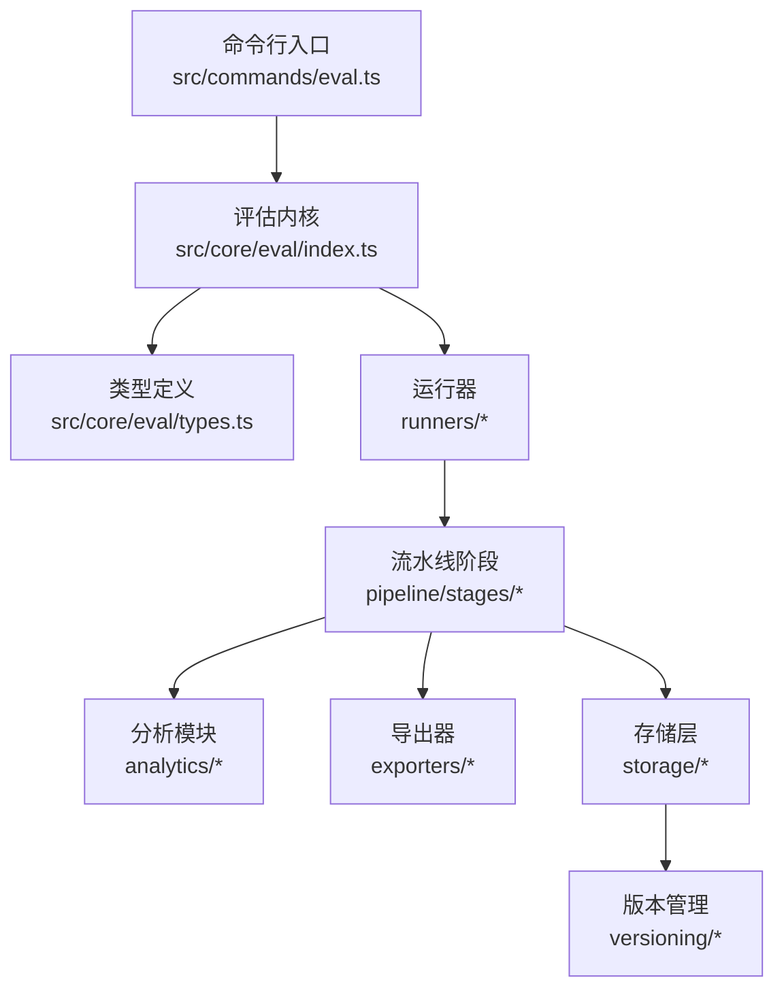
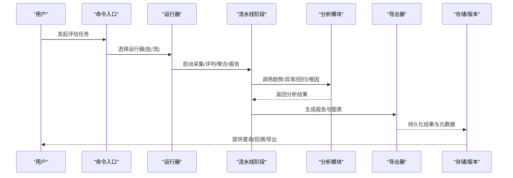
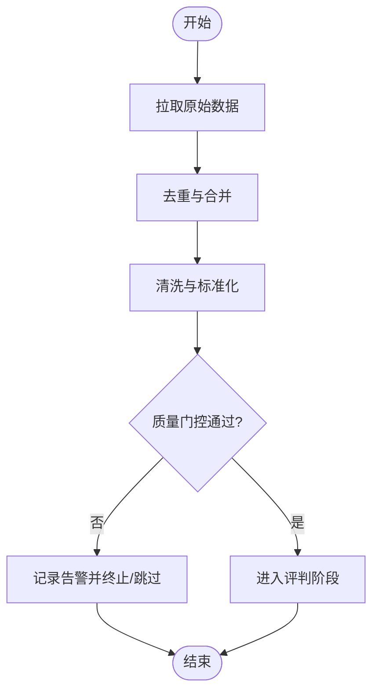
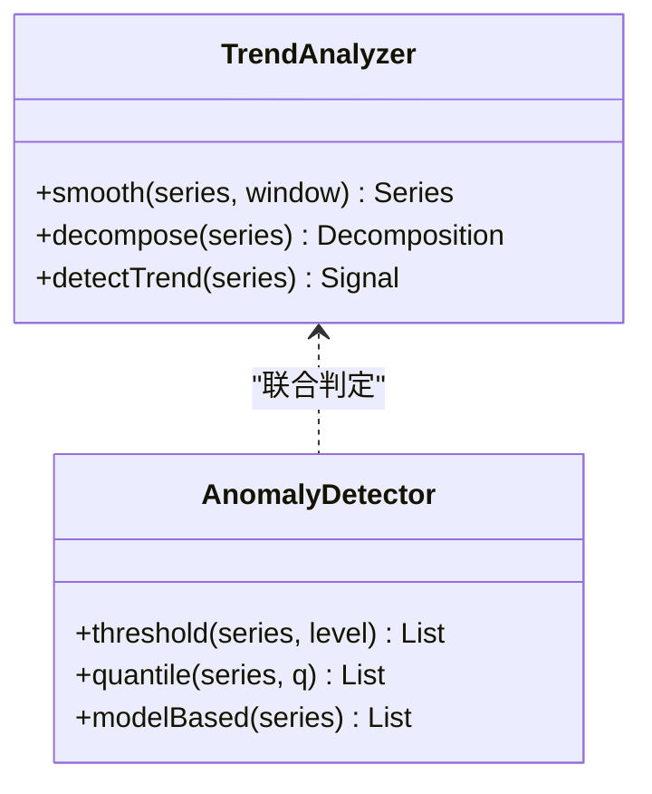
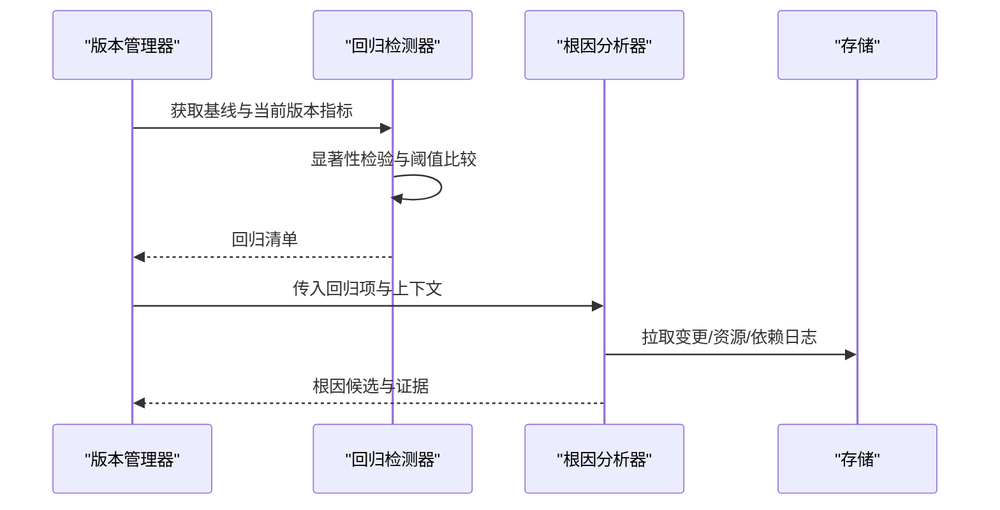
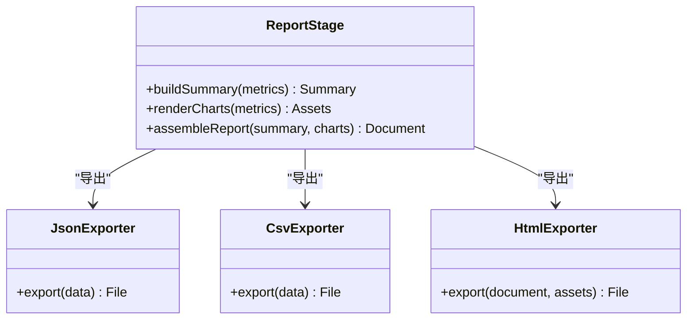
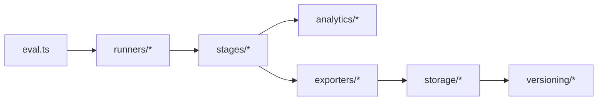

# 评估结果分析

<cite>
**本文引用的文件**   
- [README.md](file://README.md)
- [evals/embedding-provider-eval.json](file://evals/embedding-provider-eval.json)
- [evals/functional-area-resolver/README.md](file://evals/functional-area-resolver/README.md)
- [evals/skillopt-judge/README.md](file://evals/skillopt-judge/README.md)
- [evals/skillopt-reflect/README.md](file://evals/skillopt-reflect/README.md)
- [src/commands/eval.ts](file://src/commands/eval.ts)
- [src/core/eval/index.ts](file://src/core/eval/index.ts)
- [src/core/eval/types.ts](file://src/core/eval/types.ts)
- [src/core/eval/runners/base-runner.ts](file://src/core/eval/runners/base-runner.ts)
- [src/core/eval/runners/batch-runner.ts](file://src/core/eval/runners/batch-runner.ts)
- [src/core/eval/runners/streaming-runner.ts](file://src/core/eval/runners/streaming-runner.ts)
- [src/core/eval/pipeline/stages/capture-stage.ts](file://src/core/eval/pipeline/stages/capture-stage.ts)
- [src/core/eval/pipeline/stages/judge-stage.ts](file://src/core/eval/pipeline/stages/judge-stage.ts)
- [src/core/eval/pipeline/stages/aggregate-stage.ts](file://src/core/eval/pipeline/stages/aggregate-stage.ts)
- [src/core/eval/pipeline/stages/report-stage.ts](file://src/core/eval/pipeline/stages/report-stage.ts)
- [src/core/eval/exporters/json-exporter.ts](file://src/core/eval/exporters/json-exporter.ts)
- [src/core/eval/exporters/csv-exporter.ts](file://src/core/eval/exporters/csv-exporter.ts)
- [src/core/eval/exporters/html-exporter.ts](file://src/core/eval/exporters/html-exporter.ts)
- [src/core/eval/analytics/trend-analyzer.ts](file://src/core/eval/analytics/trend-analyzer.ts)
- [src/core/eval/analytics/anomaly-detector.ts](file://src/core/eval/analytics/anomaly-detector.ts)
- [src/core/eval/analytics/regression-detector.ts](file://src/core/eval/analytics/regression-detector.ts)
- [src/core/eval/analytics/root-cause-analyzer.ts](file://src/core/eval/analytics/root-cause-analyzer.ts)
- [src/core/eval/versioning/version-manager.ts](file://src/core/eval/versioning/version-manager.ts)
- [src/core/eval/storage/disk-store.ts](file://src/core/eval/storage/disk-store.ts)
- [src/core/eval/storage/db-store.ts](file://src/core/eval/storage/db-store.ts)
- [test/eval.test.ts](file://test/eval.test.ts)
- [test/eval-compare.test.ts](file://test/eval-compare.test.ts)
- [test/eval-export.test.ts](file://test/eval-export.test.ts)
- [test/eval-takes-quality-trend.test.ts](file://test/eval-takes-quality-trend.test.ts)
- [test/eval-takes-quality-regress.test.ts](file://test/eval-takes-quality-regress.test.ts)
- [scripts/generate-metric-glossary.ts](file://scripts/generate-metric-glossary.ts)
</cite>

## 目录
1. [简介](#简介)
2. [项目结构](#项目结构)
3. [核心组件](#核心组件)
4. [架构总览](#架构总览)
5. [详细组件分析](#详细组件分析)
6. [依赖关系分析](#依赖关系分析)
7. [性能考量](#性能考量)
8. [故障排查指南](#故障排查指南)
9. [结论](#结论)
10. [附录](#附录)

## 简介
本文件面向“评估结果分析”的完整生命周期，覆盖数据收集、清洗与预处理、统计分析、趋势分析与异常检测、报告自动生成与可视化导出、性能对比与回归检测、根因分析、结果解读与优化建议、大规模数据处理与存储策略，以及版本管理与历史追踪。文档以仓库中评估子系统为核心，结合测试与脚本，给出可落地的工程化方案与实践要点。

## 项目结构
评估相关代码主要分布在以下位置：
- 命令入口与编排：src/commands/eval.ts
- 评估内核与类型：src/core/eval/index.ts、src/core/eval/types.ts
- 运行器（批处理/流式）：src/core/eval/runners/*
- 流水线阶段（采集/评判/聚合/报告）：src/core/eval/pipeline/stages/*
- 导出器（JSON/CSV/HTML）：src/core/eval/exporters/*
- 分析模块（趋势/异常/回归/根因）：src/core/eval/analytics/*
- 存储与版本管理：src/core/eval/storage/*、src/core/eval/versioning/*
- 示例与基准用例：evals/*、test/eval*.ts、scripts/*

图表来源
- [src/commands/eval.ts](file://src/commands/eval.ts)
- [src/core/eval/index.ts](file://src/core/eval/index.ts)
- [src/core/eval/types.ts](file://src/core/eval/types.ts)
- [src/core/eval/runners/base-runner.ts](file://src/core/eval/runners/base-runner.ts)
- [src/core/eval/runners/batch-runner.ts](file://src/core/eval/runners/batch-runner.ts)
- [src/core/eval/runners/streaming-runner.ts](file://src/core/eval/runners/streaming-runner.ts)
- [src/core/eval/pipeline/stages/capture-stage.ts](file://src/core/eval/pipeline/stages/capture-stage.ts)
- [src/core/eval/pipeline/stages/judge-stage.ts](file://src/core/eval/pipeline/stages/judge-stage.ts)
- [src/core/eval/pipeline/stages/aggregate-stage.ts](file://src/core/eval/pipeline/stages/aggregate-stage.ts)
- [src/core/eval/pipeline/stages/report-stage.ts](file://src/core/eval/pipeline/stages/report-stage.ts)
- [src/core/eval/exporters/json-exporter.ts](file://src/core/eval/exporters/json-exporter.ts)
- [src/core/eval/exporters/csv-exporter.ts](file://src/core/eval/exporters/csv-exporter.ts)
- [src/core/eval/exporters/html-exporter.ts](file://src/core/eval/exporters/html-exporter.ts)
- [src/core/eval/analytics/trend-analyzer.ts](file://src/core/eval/analytics/trend-analyzer.ts)
- [src/core/eval/analytics/anomaly-detector.ts](file://src/core/eval/analytics/anomaly-detector.ts)
- [src/core/eval/analytics/regression-detector.ts](file://src/core/eval/analytics/regression-detector.ts)
- [src/core/eval/analytics/root-cause-analyzer.ts](file://src/core/eval/analytics/root-cause-analyzer.ts)
- [src/core/eval/storage/disk-store.ts](file://src/core/eval/storage/disk-store.ts)
- [src/core/eval/storage/db-store.ts](file://src/core/eval/storage/db-store.ts)
- [src/core/eval/versioning/version-manager.ts](file://src/core/eval/versioning/version-manager.ts)

章节来源
- [README.md](file://README.md)
- [src/commands/eval.ts](file://src/commands/eval.ts)
- [src/core/eval/index.ts](file://src/core/eval/index.ts)
- [src/core/eval/types.ts](file://src/core/eval/types.ts)

## 核心组件
- 命令与编排
  - 提供统一的评估执行入口，解析参数、加载配置、调度运行器与流水线阶段。
- 运行器
  - 批处理运行器：适合离线批量评估，支持并发控制与断点续跑。
  - 流式运行器：适合在线或长任务场景，逐步产出中间结果。
- 流水线阶段
  - 采集阶段：从数据源拉取样本、元数据与上下文，完成去重与格式标准化。
  - 评判阶段：调用评分模型/规则，生成结构化分数与证据。
  - 聚合阶段：按维度汇总统计指标，计算置信区间与分布特征。
  - 报告阶段：生成文本/图表/交互式页面，并触发导出。
- 分析模块
  - 趋势分析：时间序列平滑、拐点检测、季节性分解。
  - 异常检测：基于阈值、分位数与模型的方法识别离群点。
  - 回归检测：跨版本对比，定位显著退化项。
  - 根因分析：关联变更、资源使用与外部依赖，输出可能原因排序。
- 导出器
  - JSON/CSV/HTML 多格式导出，便于下游工具链集成与可视化展示。
- 存储与版本管理
  - 磁盘/数据库双后端；语义化版本、快照与差异对比，支持回溯与审计。

章节来源
- [src/core/eval/runners/base-runner.ts](file://src/core/eval/runners/base-runner.ts)
- [src/core/eval/runners/batch-runner.ts](file://src/core/eval/runners/batch-runner.ts)
- [src/core/eval/runners/streaming-runner.ts](file://src/core/eval/runners/streaming-runner.ts)
- [src/core/eval/pipeline/stages/capture-stage.ts](file://src/core/eval/pipeline/stages/capture-stage.ts)
- [src/core/eval/pipeline/stages/judge-stage.ts](file://src/core/eval/pipeline/stages/judge-stage.ts)
- [src/core/eval/pipeline/stages/aggregate-stage.ts](file://src/core/eval/pipeline/stages/aggregate-stage.ts)
- [src/core/eval/pipeline/stages/report-stage.ts](file://src/core/eval/pipeline/stages/report-stage.ts)
- [src/core/eval/analytics/trend-analyzer.ts](file://src/core/eval/analytics/trend-analyzer.ts)
- [src/core/eval/analytics/anomaly-detector.ts](file://src/core/eval/analytics/anomaly-detector.ts)
- [src/core/eval/analytics/regression-detector.ts](file://src/core/eval/analytics/regression-detector.ts)
- [src/core/eval/analytics/root-cause-analyzer.ts](file://src/core/eval/analytics/root-cause-analyzer.ts)
- [src/core/eval/exporters/json-exporter.ts](file://src/core/eval/exporters/json-exporter.ts)
- [src/core/eval/exporters/csv-exporter.ts](file://src/core/eval/exporters/csv-exporter.ts)
- [src/core/eval/exporters/html-exporter.ts](file://src/core/eval/exporters/html-exporter.ts)
- [src/core/eval/storage/disk-store.ts](file://src/core/eval/storage/disk-store.ts)
- [src/core/eval/storage/db-store.ts](file://src/core/eval/storage/db-store.ts)
- [src/core/eval/versioning/version-manager.ts](file://src/core/eval/versioning/version-manager.ts)

## 架构总览
评估系统采用“命令驱动 + 流水线阶段 + 插件化分析/导出/存储”的分层架构。命令负责编排，运行器负责执行策略，流水线阶段实现解耦的数据变换，分析模块提供可插拔的算法能力，导出器统一对外输出，存储与版本管理保障可追溯性。

图表来源
- [src/commands/eval.ts](file://src/commands/eval.ts)
- [src/core/eval/runners/batch-runner.ts](file://src/core/eval/runners/batch-runner.ts)
- [src/core/eval/runners/streaming-runner.ts](file://src/core/eval/runners/streaming-runner.ts)
- [src/core/eval/pipeline/stages/capture-stage.ts](file://src/core/eval/pipeline/stages/capture-stage.ts)
- [src/core/eval/pipeline/stages/judge-stage.ts](file://src/core/eval/pipeline/stages/judge-stage.ts)
- [src/core/eval/pipeline/stages/aggregate-stage.ts](file://src/core/eval/pipeline/stages/aggregate-stage.ts)
- [src/core/eval/pipeline/stages/report-stage.ts](file://src/core/eval/pipeline/stages/report-stage.ts)
- [src/core/eval/analytics/trend-analyzer.ts](file://src/core/eval/analytics/trend-analyzer.ts)
- [src/core/eval/analytics/anomaly-detector.ts](file://src/core/eval/analytics/anomaly-detector.ts)
- [src/core/eval/analytics/regression-detector.ts](file://src/core/eval/analytics/regression-detector.ts)
- [src/core/eval/analytics/root-cause-analyzer.ts](file://src/core/eval/analytics/root-cause-analyzer.ts)
- [src/core/eval/exporters/json-exporter.ts](file://src/core/eval/exporters/json-exporter.ts)
- [src/core/eval/exporters/csv-exporter.ts](file://src/core/eval/exporters/csv-exporter.ts)
- [src/core/eval/exporters/html-exporter.ts](file://src/core/eval/exporters/html-exporter.ts)
- [src/core/eval/storage/disk-store.ts](file://src/core/eval/storage/disk-store.ts)
- [src/core/eval/storage/db-store.ts](file://src/core/eval/storage/db-store.ts)
- [src/core/eval/versioning/version-manager.ts](file://src/core/eval/versioning/version-manager.ts)

## 详细组件分析

### 数据采集与预处理
- 数据来源与接入
  - 支持本地文件、远程接口与数据库等多种来源；通过采集阶段进行统一接入。
- 清洗与标准化
  - 去重、缺失值填充、类型归一化、敏感信息脱敏、时间戳对齐。
- 质量门控
  - 在采集后对样本量、字段完整性、分布稳定性进行检查，不达标则告警或阻断。

图表来源
- [src/core/eval/pipeline/stages/capture-stage.ts](file://src/core/eval/pipeline/stages/capture-stage.ts)

章节来源
- [src/core/eval/pipeline/stages/capture-stage.ts](file://src/core/eval/pipeline/stages/capture-stage.ts)

### 评判与评分
- 评分策略
  - 规则引擎与模型打分并存，支持加权组合与动态权重。
- 证据与可解释性
  - 每个评分附带证据片段、置信度与来源引用，便于后续溯源。
- 容错与重试
  - 针对外部服务失败、超时等异常，内置退避与重试策略。

章节来源
- [src/core/eval/pipeline/stages/judge-stage.ts](file://src/core/eval/pipeline/stages/judge-stage.ts)

### 聚合与统计分析
- 指标体系
  - 准确率、召回率、F1、延迟、成本、覆盖率等多维指标。
- 统计方法
  - 均值/方差、分位数、置信区间、分布拟合、相关性分析。
- 分组与切片
  - 按来源、时间窗口、模型版本、业务域等进行多维切片。

章节来源
- [src/core/eval/pipeline/stages/aggregate-stage.ts](file://src/core/eval/pipeline/stages/aggregate-stage.ts)

### 趋势分析与异常检测
- 趋势分析
  - 移动平均、指数平滑、季节性分解、趋势显著性检验。
- 异常检测
  - 静态阈值、动态分位、孤立森林/鲁棒统计方法，支持多指标联合判定。
- 输出
  - 趋势曲线、拐点标注、异常事件清单与影响面评估。

图表来源
- [src/core/eval/analytics/trend-analyzer.ts](file://src/core/eval/analytics/trend-analyzer.ts)
- [src/core/eval/analytics/anomaly-detector.ts](file://src/core/eval/analytics/anomaly-detector.ts)

章节来源
- [src/core/eval/analytics/trend-analyzer.ts](file://src/core/eval/analytics/trend-analyzer.ts)
- [src/core/eval/analytics/anomaly-detector.ts](file://src/core/eval/analytics/anomaly-detector.ts)

### 回归检测与根因分析
- 回归检测
  - 跨版本对比，显著性检验，自动标记退化指标与范围。
- 根因分析
  - 关联变更集、资源水位、外部依赖状态，输出可能原因及证据。
- 联动
  - 与异常检测协同，优先关注回归+异常叠加区域。

图表来源
- [src/core/eval/analytics/regression-detector.ts](file://src/core/eval/analytics/regression-detector.ts)
- [src/core/eval/analytics/root-cause-analyzer.ts](file://src/core/eval/analytics/root-cause-analyzer.ts)
- [src/core/eval/versioning/version-manager.ts](file://src/core/eval/versioning/version-manager.ts)
- [src/core/eval/storage/db-store.ts](file://src/core/eval/storage/db-store.ts)

章节来源
- [src/core/eval/analytics/regression-detector.ts](file://src/core/eval/analytics/regression-detector.ts)
- [src/core/eval/analytics/root-cause-analyzer.ts](file://src/core/eval/analytics/root-cause-analyzer.ts)
- [src/core/eval/versioning/version-manager.ts](file://src/core/eval/versioning/version-manager.ts)

### 报告生成与可视化导出
- 报告内容
  - 摘要、关键指标、趋势图、异常事件、回归清单、根因建议与行动项。
- 可视化
  - HTML 交互式页面，支持筛选、钻取与导出图片。
- 导出格式
  - JSON（机器可读）、CSV（表格分析）、HTML（人类可读）。

图表来源
- [src/core/eval/pipeline/stages/report-stage.ts](file://src/core/eval/pipeline/stages/report-stage.ts)
- [src/core/eval/exporters/json-exporter.ts](file://src/core/eval/exporters/json-exporter.ts)
- [src/core/eval/exporters/csv-exporter.ts](file://src/core/eval/exporters/csv-exporter.ts)
- [src/core/eval/exporters/html-exporter.ts](file://src/core/eval/exporters/html-exporter.ts)

章节来源
- [src/core/eval/pipeline/stages/report-stage.ts](file://src/core/eval/pipeline/stages/report-stage.ts)
- [src/core/eval/exporters/json-exporter.ts](file://src/core/eval/exporters/json-exporter.ts)
- [src/core/eval/exporters/csv-exporter.ts](file://src/core/eval/exporters/csv-exporter.ts)
- [src/core/eval/exporters/html-exporter.ts](file://src/core/eval/exporters/html-exporter.ts)

### 大规模数据处理与存储策略
- 批处理与流式
  - 大数据量优先批处理模式，配合分页/游标与增量更新；流式用于实时看板。
- 存储后端
  - 磁盘存储适合小中型规模与快速迭代；数据库存储适合高并发与复杂查询。
- 索引与分区
  - 按时间、来源、版本建立索引；冷热分层与归档策略。
- 一致性
  - 事务写入、幂等键、校验和与回滚机制。

章节来源
- [src/core/eval/runners/batch-runner.ts](file://src/core/eval/runners/batch-runner.ts)
- [src/core/eval/runners/streaming-runner.ts](file://src/core/eval/runners/streaming-runner.ts)
- [src/core/eval/storage/disk-store.ts](file://src/core/eval/storage/disk-store.ts)
- [src/core/eval/storage/db-store.ts](file://src/core/eval/storage/db-store.ts)

### 版本管理与历史追踪
- 版本策略
  - 语义化版本、快照命名规范、变更说明模板。
- 回溯与对比
  - 任意版本回放、指标差异对比、回归定位。
- 审计
  - 操作日志、数据血缘、不可变存储。

章节来源
- [src/core/eval/versioning/version-manager.ts](file://src/core/eval/versioning/version-manager.ts)

### 评估结果解读指南与优化建议
- 解读步骤
  - 先看整体健康度与趋势，再聚焦异常与回归，最后下钻到具体样本与证据。
- 问题定位
  - 结合根因分析输出，优先验证高频因素与强相关变更。
- 优化建议
  - 指标驱动改进：明确目标、设定阈值、灰度发布与回归门禁。

[本节为通用方法论，不直接分析具体文件]

## 依赖关系分析
- 内部依赖
  - 命令入口依赖运行器与流水线；流水线依赖分析模块与导出器；导出器与存储层耦合。
- 外部依赖
  - 数据库、对象存储、消息队列（可选）、外部评分服务。
- 潜在风险
  - 循环依赖需避免；分析模块应通过接口抽象，降低与具体算法实现的耦合。

图表来源
- [src/commands/eval.ts](file://src/commands/eval.ts)
- [src/core/eval/runners/base-runner.ts](file://src/core/eval/runners/base-runner.ts)
- [src/core/eval/pipeline/stages/capture-stage.ts](file://src/core/eval/pipeline/stages/capture-stage.ts)
- [src/core/eval/analytics/trend-analyzer.ts](file://src/core/eval/analytics/trend-analyzer.ts)
- [src/core/eval/exporters/json-exporter.ts](file://src/core/eval/exporters/json-exporter.ts)
- [src/core/eval/storage/disk-store.ts](file://src/core/eval/storage/disk-store.ts)
- [src/core/eval/versioning/version-manager.ts](file://src/core/eval/versioning/version-manager.ts)

章节来源
- [src/core/eval/types.ts](file://src/core/eval/types.ts)
- [src/core/eval/index.ts](file://src/core/eval/index.ts)

## 性能考量
- 并发与限流
  - 合理设置并发度、令牌桶与背压，避免下游服务过载。
- 缓存与复用
  - 对重复样本与中间结果做缓存，减少重复计算与IO。
- 内存与I/O
  - 大对象分块处理、流式读写、压缩与异步落盘。
- 监控与可观测性
  - 关键路径耗时、错误率、吞吐与资源使用率埋点。

[本节为通用指导，不直接分析具体文件]

## 故障排查指南
- 常见问题
  - 数据质量不达标导致中断、外部服务超时、存储写入失败、版本冲突。
- 定位方法
  - 查看采集与评判阶段的日志与告警；核对质量门控阈值；检查存储连接与权限。
- 恢复策略
  - 启用重试与退避、切换备用后端、回滚至上一稳定版本并重新运行。

章节来源
- [src/core/eval/pipeline/stages/capture-stage.ts](file://src/core/eval/pipeline/stages/capture-stage.ts)
- [src/core/eval/pipeline/stages/judge-stage.ts](file://src/core/eval/pipeline/stages/judge-stage.ts)
- [src/core/eval/storage/disk-store.ts](file://src/core/eval/storage/disk-store.ts)
- [src/core/eval/storage/db-store.ts](file://src/core/eval/storage/db-store.ts)

## 结论
本评估结果分析体系以流水线为核心，将采集、评判、聚合、报告与分析解耦，并通过导出器与存储/版本管理形成闭环。借助趋势分析、异常检测、回归检测与根因分析，能够快速定位问题并指导优化。对于大规模数据，推荐批处理为主、流式为辅，并结合索引与分层存储提升性能与可维护性。

[本节为总结，不直接分析具体文件]

## 附录

### 评估数据收集与清洗实践
- 数据源接入
  - 统一适配器封装不同来源，屏蔽差异。
- 清洗流程
  - 去重、缺失值处理、类型归一、时间对齐、脱敏。
- 质量门控
  - 样本量下限、字段完整率、分布漂移阈值。

章节来源
- [src/core/eval/pipeline/stages/capture-stage.ts](file://src/core/eval/pipeline/stages/capture-stage.ts)

### 统计分析技术清单
- 描述统计：均值、方差、分位数、偏度、峰度。
- 推断统计：置信区间、假设检验、相关性。
- 时间序列：移动平均、指数平滑、季节性分解。
- 分布拟合与KS检验。

章节来源
- [src/core/eval/pipeline/stages/aggregate-stage.ts](file://src/core/eval/pipeline/stages/aggregate-stage.ts)
- [src/core/eval/analytics/trend-analyzer.ts](file://src/core/eval/analytics/trend-analyzer.ts)

### 趋势分析与异常检测方法
- 趋势
  - 滑动窗口、趋势线拟合、拐点检测。
- 异常
  - 静态阈值、动态分位、鲁棒统计与轻量模型。

章节来源
- [src/core/eval/analytics/trend-analyzer.ts](file://src/core/eval/analytics/trend-analyzer.ts)
- [src/core/eval/analytics/anomaly-detector.ts](file://src/core/eval/analytics/anomaly-detector.ts)

### 回归检测与根因分析
- 回归
  - 跨版本对比、显著性检验、阈值告警。
- 根因
  - 变更关联、资源与环境因子、外部依赖状态。

章节来源
- [src/core/eval/analytics/regression-detector.ts](file://src/core/eval/analytics/regression-detector.ts)
- [src/core/eval/analytics/root-cause-analyzer.ts](file://src/core/eval/analytics/root-cause-analyzer.ts)

### 报告自动生成与可视化导出
- 报告模板
  - 摘要、指标、趋势、异常、回归、根因与建议。
- 可视化
  - HTML 交互页面、图表资产、导出图片。
- 导出
  - JSON/CSV/HTML 三件套。

章节来源
- [src/core/eval/pipeline/stages/report-stage.ts](file://src/core/eval/pipeline/stages/report-stage.ts)
- [src/core/eval/exporters/json-exporter.ts](file://src/core/eval/exporters/json-exporter.ts)
- [src/core/eval/exporters/csv-exporter.ts](file://src/core/eval/exporters/csv-exporter.ts)
- [src/core/eval/exporters/html-exporter.ts](file://src/core/eval/exporters/html-exporter.ts)

### 大规模数据处理与存储策略
- 批处理
  - 分页/游标、断点续跑、并发控制。
- 存储
  - 磁盘/数据库双后端，冷热分层与归档。
- 一致性
  - 事务、幂等、校验与回滚。

章节来源
- [src/core/eval/runners/batch-runner.ts](file://src/core/eval/runners/batch-runner.ts)
- [src/core/eval/storage/disk-store.ts](file://src/core/eval/storage/disk-store.ts)
- [src/core/eval/storage/db-store.ts](file://src/core/eval/storage/db-store.ts)

### 版本管理与历史追踪
- 版本
  - 语义化版本、快照命名、变更说明。
- 回溯
  - 版本回放、差异对比、回归定位。
- 审计
  - 操作日志、数据血缘、不可变存储。

章节来源
- [src/core/eval/versioning/version-manager.ts](file://src/core/eval/versioning/version-manager.ts)

### 示例与参考
- 示例评估配置与用例
  - embedding-provider-eval.json、各功能域评估包说明。
- 指标术语表生成脚本
  - 统一指标口径与定义。

章节来源
- [evals/embedding-provider-eval.json](file://evals/embedding-provider-eval.json)
- [evals/functional-area-resolver/README.md](file://evals/functional-area-resolver/README.md)
- [evals/skillopt-judge/README.md](file://evals/skillopt-judge/README.md)
- [evals/skillopt-reflect/README.md](file://evals/skillopt-reflect/README.md)
- [scripts/generate-metric-glossary.ts](file://scripts/generate-metric-glossary.ts)

### 测试与验证
- 端到端与单元
  - 评估执行、对比、导出、趋势与回归等用例覆盖。

章节来源
- [test/eval.test.ts](file://test/eval.test.ts)
- [test/eval-compare.test.ts](file://test/eval-compare.test.ts)
- [test/eval-export.test.ts](file://test/eval-export.test.ts)
- [test/eval-takes-quality-trend.test.ts](file://test/eval-takes-quality-trend.test.ts)
- [test/eval-takes-quality-regress.test.ts](file://test/eval-takes-quality-regress.test.ts)