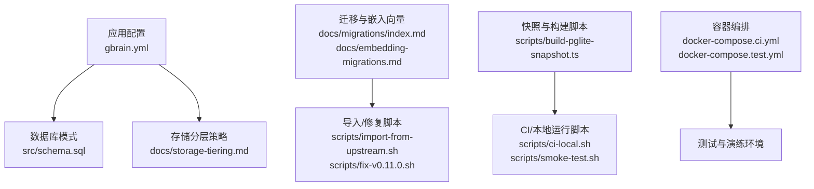
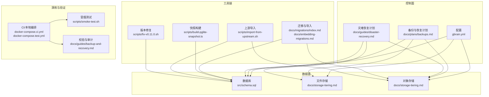
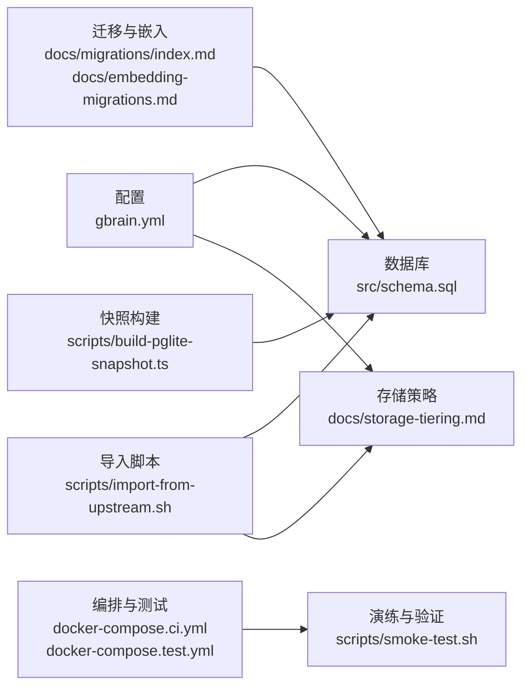

# 备份与恢复

<cite>
**本文引用的文件**   
- [README.md](file://README.md)
- [INSTALL.md](file://INSTALL.md)
- [gbrain.yml](file://gbrain.yml)
- [src/schema.sql](file://src/schema.sql)
- [scripts/build-pglite-snapshot.ts](file://scripts/build-pglite-snapshot.ts)
- [scripts/import-from-upstream.sh](file://scripts/import-from-upstream.sh)
- [scripts/smoke-test.sh](file://scripts/smoke-test.sh)
- [scripts/ci-local.sh](file://scripts/ci-local.sh)
- [scripts/run-unit-parallel.sh](file://scripts/run-unit-parallel.sh)
- [scripts/run-heavy.sh](file://scripts/run-heavy.sh)
- [scripts/fix-v0.11.0.sh](file://scripts/fix-v0.11.0.sh)
- [docs/storage-tiering.md](file://docs/storage-tiering.md)
- [docs/embedding-migrations.md](file://docs/embedding-migrations.md)
- [docs/migrations/index.md](file://docs/migrations/index.md)
- [docs/guides/backup-and-recovery.md](file://docs/guides/backup-and-recovery.md)
- [docs/guides/disaster-recovery.md](file://docs/guides/disaster-recovery.md)
- [docs/guides/migration-guide.md](file://docs/guides/migration-guide.md)
- [docs/guides/sync-strategy.md](file://docs/guides/sync-strategy.md)
- [docs/architecture/data-flow.md](file://docs/architecture/data-flow.md)
- [docs/architecture/storage.md](file://docs/architecture/storage.md)
- [docs/architecture/high-availability.md](file://docs/architecture/high-availability.md)
- [docs/plans/backups.md](file://docs/plans/backups.md)
- [docs/incidents/postmortem-template.md](file://docs/incidents/postmortem-template.md)
- [docker-compose.ci.yml](file://docker-compose.ci.yml)
- [docker-compose.test.yml](file://docker-compose.test.yml)
</cite>

## 目录
1. [简介](#简介)
2. [项目结构](#项目结构)
3. [核心组件](#核心组件)
4. [架构总览](#架构总览)
5. [详细组件分析](#详细组件分析)
6. [依赖关系分析](#依赖关系分析)
7. [性能考量](#性能考量)
8. [故障排查指南](#故障排查指南)
9. [结论](#结论)
10. [附录](#附录)

## 简介
本指南面向运维与平台工程团队，提供覆盖数据备份、迁移与灾难恢复的完整策略与实践。内容包含：
- 数据库备份策略（全量与增量）、对象存储同步机制与一致性保证
- 文件存储备份方案与跨地域复制
- 数据迁移工具使用与版本升级流程
- 灾难恢复计划制定与演练步骤
- 备份验证、完整性检查与恢复演练最佳实践
- 自动化脚本与定时任务配置建议
- 高可用架构下的数据一致性与容灾要点

## 项目结构
仓库中与备份与恢复相关的文档与脚本主要分布在以下位置：
- 操作指南与计划：docs/guides、docs/plans、docs/incidents
- 架构说明：docs/architecture
- 迁移与嵌入向量相关：docs/migrations、docs/embedding-migrations.md
- 存储分层与对象存储：docs/storage-tiering.md
- 构建与快照脚本：scripts/*
- 容器编排与测试环境：docker-compose.*.yml
- 运行时配置与数据库模式：gbrain.yml、src/schema.sql

图表来源
- [gbrain.yml](file://gbrain.yml)
- [src/schema.sql](file://src/schema.sql)
- [docs/storage-tiering.md](file://docs/storage-tiering.md)
- [docs/migrations/index.md](file://docs/migrations/index.md)
- [docs/embedding-migrations.md](file://docs/embedding-migrations.md)
- [scripts/import-from-upstream.sh](file://scripts/import-from-upstream.sh)
- [scripts/fix-v0.11.0.sh](file://scripts/fix-v0.11.0.sh)
- [scripts/build-pglite-snapshot.ts](file://scripts/build-pglite-snapshot.ts)
- [scripts/ci-local.sh](file://scripts/ci-local.sh)
- [scripts/smoke-test.sh](file://scripts/smoke-test.sh)
- [docker-compose.ci.yml](file://docker-compose.ci.yml)
- [docker-compose.test.yml](file://docker-compose.test.yml)

章节来源
- [README.md](file://README.md)
- [INSTALL.md](file://INSTALL.md)
- [gbrain.yml](file://gbrain.yml)
- [src/schema.sql](file://src/schema.sql)
- [docs/storage-tiering.md](file://docs/storage-tiering.md)
- [docs/migrations/index.md](file://docs/migrations/index.md)
- [docs/embedding-migrations.md](file://docs/embedding-migrations.md)
- [scripts/build-pglite-snapshot.ts](file://scripts/build-pglite-snapshot.ts)
- [scripts/import-from-upstream.sh](file://scripts/import-from-upstream.sh)
- [scripts/smoke-test.sh](file://scripts/smoke-test.sh)
- [scripts/ci-local.sh](file://scripts/ci-local.sh)
- [docker-compose.ci.yml](file://docker-compose.ci.yml)
- [docker-compose.test.yml](file://docker-compose.test.yml)

## 核心组件
- 配置中心：集中管理数据库连接、存储后端、同步策略等关键参数，为备份与恢复提供一致的上下文。
- 数据库层：基于 schema 定义的数据模型，配合迁移与嵌入向量更新流程，确保结构演进可回滚与可验证。
- 存储层：支持本地文件与对象存储的分层策略，便于实现冷热分层与跨地域复制。
- 迁移与导入工具：提供从上游导入、版本修复与增量更新的脚本能力。
- 快照与构建：用于生成可复现的数据库快照或镜像，加速恢复与演练。
- CI/测试编排：通过容器化编排快速拉起演练环境，执行冒烟测试与恢复演练。

章节来源
- [gbrain.yml](file://gbrain.yml)
- [src/schema.sql](file://src/schema.sql)
- [docs/storage-tiering.md](file://docs/storage-tiering.md)
- [docs/migrations/index.md](file://docs/migrations/index.md)
- [docs/embedding-migrations.md](file://docs/embedding-migrations.md)
- [scripts/build-pglite-snapshot.ts](file://scripts/build-pglite-snapshot.ts)
- [scripts/import-from-upstream.sh](file://scripts/import-from-upstream.sh)
- [scripts/fix-v0.11.0.sh](file://scripts/fix-v0.11.0.sh)

## 架构总览
下图展示备份与恢复在系统中的关键交互点：配置驱动、数据库与对象存储协同、迁移与快照工具链、以及演练与验证闭环。

图表来源
- [gbrain.yml](file://gbrain.yml)
- [src/schema.sql](file://src/schema.sql)
- [docs/storage-tiering.md](file://docs/storage-tiering.md)
- [docs/migrations/index.md](file://docs/migrations/index.md)
- [docs/embedding-migrations.md](file://docs/embedding-migrations.md)
- [docs/plans/backups.md](file://docs/plans/backups.md)
- [docs/guides/disaster-recovery.md](file://docs/guides/disaster-recovery.md)
- [scripts/build-pglite-snapshot.ts](file://scripts/build-pglite-snapshot.ts)
- [scripts/import-from-upstream.sh](file://scripts/import-from-upstream.sh)
- [scripts/fix-v0.11.0.sh](file://scripts/fix-v0.11.0.sh)
- [docker-compose.ci.yml](file://docker-compose.ci.yml)
- [docker-compose.test.yml](file://docker-compose.test.yml)
- [scripts/smoke-test.sh](file://scripts/smoke-test.sh)
- [docs/guides/backup-and-recovery.md](file://docs/guides/backup-and-recovery.md)

## 详细组件分析

### 数据库备份策略（全量与增量）
- 全量备份：定期导出数据库快照，结合对象存储进行异地留存；建议在低峰期执行并记录元数据（时间戳、版本、校验和）。
- 增量备份：基于事务日志或变更捕获机制，按固定窗口滚动保留；需明确 RPO/RTO 目标并与全量备份组合。
- 恢复流程：先恢复全量，再回放增量至目标时间点；对关键表与索引进行一致性校验。
- 验证与演练：在隔离环境中执行恢复演练，对比关键指标与抽样数据，形成报告归档。

章节来源
- [docs/guides/backup-and-recovery.md](file://docs/guides/backup-and-recovery.md)
- [docs/plans/backups.md](file://docs/plans/backups.md)
- [src/schema.sql](file://src/schema.sql)

### 对象存储同步与文件存储备份
- 分层策略：热数据近端缓存、冷数据下沉对象存储；依据访问频率与成本优化选择层级。
- 同步机制：采用事件驱动或周期扫描方式，确保本地与远端一致；失败重试与幂等写入是关键。
- 一致性保证：引入校验和与版本号，避免部分写入导致的不一致；跨地域复制需考虑延迟与冲突解决。
- 生命周期管理：设置过期与归档策略，降低长期存储成本。

章节来源
- [docs/storage-tiering.md](file://docs/storage-tiering.md)
- [gbrain.yml](file://gbrain.yml)

### 数据迁移与版本升级流程
- 迁移注册与顺序：维护迁移清单，确保顺序与依赖正确；对破坏性变更提供回滚路径。
- 嵌入向量更新：在结构变更后触发向量化重建或增量补全，注意资源配额与并发控制。
- 导入与修复：从上游导入数据后执行一致性修复；针对历史版本提供专用修复脚本。
- 灰度与回滚：先在预发环境验证，再分批上线；准备一键回滚与数据补偿脚本。

章节来源
- [docs/migrations/index.md](file://docs/migrations/index.md)
- [docs/embedding-migrations.md](file://docs/embedding-migrations.md)
- [scripts/import-from-upstream.sh](file://scripts/import-from-upstream.sh)
- [scripts/fix-v0.11.0.sh](file://scripts/fix-v0.11.0.sh)

### 快照与构建（加速恢复与演练）
- 快照生成：将数据库状态打包为可复现产物，附带元数据与校验信息。
- 构建集成：在 CI 中自动构建快照，作为发布基线；支持按需下载与本地加载。
- 恢复加速：利用快照直接还原到目标环境，缩短 RTO。

章节来源
- [scripts/build-pglite-snapshot.ts](file://scripts/build-pglite-snapshot.ts)

### 自动化备份脚本与定时任务
- 调度策略：结合系统级 cron 或容器内调度器，按日/周/月周期执行不同备份类型。
- 幂等与重试：脚本应具备幂等性，失败自动重试并告警；记录执行日志与结果码。
- 清理策略：按保留策略删除过期备份，释放空间并防止无限增长。
- 监控与告警：对备份成功率、耗时、大小与校验结果进行监控与告警。

章节来源
- [scripts/ci-local.sh](file://scripts/ci-local.sh)
- [scripts/smoke-test.sh](file://scripts/smoke-test.sh)
- [scripts/run-unit-parallel.sh](file://scripts/run-unit-parallel.sh)
- [scripts/run-heavy.sh](file://scripts/run-heavy.sh)

### 灾难恢复计划与演练
- 预案制定：明确 RPO/RTO、责任人、沟通渠道与升级路径；列出关键系统与依赖。
- 演练步骤：在隔离环境执行端到端恢复，包括数据库、文件与对象存储；记录偏差与改进项。
- 复盘与改进：根据演练结果更新预案与脚本，持续优化流程与工具链。

章节来源
- [docs/guides/disaster-recovery.md](file://docs/guides/disaster-recovery.md)
- [docs/incidents/postmortem-template.md](file://docs/incidents/postmortem-template.md)

### 备份验证、完整性检查与恢复演练最佳实践
- 校验方法：对备份产物计算校验和，并在恢复后进行抽样比对与业务回归。
- 演练频率：至少季度演练一次，重大变更前后增加专项演练。
- 指标与报告：记录恢复时长、数据差异率、错误分布与根因分析，形成报告归档。

章节来源
- [docs/guides/backup-and-recovery.md](file://docs/guides/backup-and-recovery.md)
- [scripts/smoke-test.sh](file://scripts/smoke-test.sh)

### 跨地域备份与高可用架构的一致性保证
- 多活与主备：根据业务需求选择主备或多活；明确写放大与读扩展策略。
- 复制与冲突：跨地域复制需处理网络分区与冲突合并；必要时引入仲裁与人工干预。
- 一致性级别：区分强一致与最终一致场景，对关键交易采用更强一致性与额外校验。

章节来源
- [docs/architecture/high-availability.md](file://docs/architecture/high-availability.md)
- [docs/architecture/data-flow.md](file://docs/architecture/data-flow.md)
- [docs/architecture/storage.md](file://docs/architecture/storage.md)

## 依赖关系分析
备份与恢复涉及配置、数据库、存储、迁移与演练等多模块协作。下图展示关键依赖关系。

图表来源
- [gbrain.yml](file://gbrain.yml)
- [src/schema.sql](file://src/schema.sql)
- [docs/storage-tiering.md](file://docs/storage-tiering.md)
- [docs/migrations/index.md](file://docs/migrations/index.md)
- [docs/embedding-migrations.md](file://docs/embedding-migrations.md)
- [scripts/build-pglite-snapshot.ts](file://scripts/build-pglite-snapshot.ts)
- [scripts/import-from-upstream.sh](file://scripts/import-from-upstream.sh)
- [docker-compose.ci.yml](file://docker-compose.ci.yml)
- [docker-compose.test.yml](file://docker-compose.test.yml)
- [scripts/smoke-test.sh](file://scripts/smoke-test.sh)

章节来源
- [gbrain.yml](file://gbrain.yml)
- [src/schema.sql](file://src/schema.sql)
- [docs/storage-tiering.md](file://docs/storage-tiering.md)
- [docs/migrations/index.md](file://docs/migrations/index.md)
- [docs/embedding-migrations.md](file://docs/embedding-migrations.md)
- [scripts/build-pglite-snapshot.ts](file://scripts/build-pglite-snapshot.ts)
- [scripts/import-from-upstream.sh](file://scripts/import-from-upstream.sh)
- [docker-compose.ci.yml](file://docker-compose.ci.yml)
- [docker-compose.test.yml](file://docker-compose.test.yml)
- [scripts/smoke-test.sh](file://scripts/smoke-test.sh)

## 性能考量
- 备份窗口：避开业务高峰，合理拆分大表与索引，减少锁竞争。
- 并发与限流：控制并发度与带宽占用，避免影响在线服务。
- 压缩与去重：对备份产物进行压缩与去重，降低存储与传输成本。
- 增量效率：优化增量捕获粒度，减少无效变更带来的开销。
- 恢复速度：优先恢复热点数据与关键索引，分阶段完成非关键对象。

[本节为通用指导，不直接分析具体文件]

## 故障排查指南
- 常见错误：网络超时、权限不足、磁盘空间不足、校验失败、迁移冲突。
- 定位方法：查看脚本日志与返回码，核对配置与凭据，检查对象存储可达性与配额。
- 恢复策略：回退到最近已知正确的快照，逐步回放增量并验证；必要时执行数据补偿。
- 复盘模板：使用事故复盘模板记录根因、影响范围、处置过程与改进措施。

章节来源
- [docs/incidents/postmortem-template.md](file://docs/incidents/postmortem-template.md)
- [scripts/smoke-test.sh](file://scripts/smoke-test.sh)
- [scripts/ci-local.sh](file://scripts/ci-local.sh)

## 结论
通过统一的配置驱动、完善的迁移与快照工具链、严格的验证与演练流程，以及跨地域的高可用设计，可以显著提升系统的韧性与可恢复性。建议持续优化备份窗口、增量策略与演练频率，并结合监控与告警体系保障稳定性。

[本节为总结性内容，不直接分析具体文件]

## 附录
- 术语与指标：RPO（恢复点目标）、RTO（恢复时间目标）、一致性级别、对象存储生命周期。
- 参考文档：
  - 备份与恢复指南：[docs/guides/backup-and-recovery.md](file://docs/guides/backup-and-recovery.md)
  - 灾难恢复计划：[docs/guides/disaster-recovery.md](file://docs/guides/disaster-recovery.md)
  - 迁移与嵌入向量：[docs/migrations/index.md](file://docs/migrations/index.md)、[docs/embedding-migrations.md](file://docs/embedding-migrations.md)
  - 存储分层：[docs/storage-tiering.md](file://docs/storage-tiering.md)
  - 架构说明：[docs/architecture/data-flow.md](file://docs/architecture/data-flow.md)、[docs/architecture/storage.md](file://docs/architecture/storage.md)、[docs/architecture/high-availability.md](file://docs/architecture/high-availability.md)
  - 计划与复盘：[docs/plans/backups.md](file://docs/plans/backups.md)、[docs/incidents/postmortem-template.md](file://docs/incidents/postmortem-template.md)
  - 脚本与编排：[scripts/build-pglite-snapshot.ts](file://scripts/build-pglite-snapshot.ts)、[scripts/import-from-upstream.sh](file://scripts/import-from-upstream.sh)、[scripts/fix-v0.11.0.sh](file://scripts/fix-v0.11.0.sh)、[docker-compose.ci.yml](file://docker-compose.ci.yml)、[docker-compose.test.yml](file://docker-compose.test.yml)