# 安全与合规

<cite>
**本文引用的文件**   
- [SECURITY.md](file://SECURITY.md)
- [.gitleaks.toml](file://.gitleaks.toml)
- [docker-compose.ci.yml](file://docker-compose.ci.yml)
- [docker-compose.test.yml](file://docker-compose.test.yml)
- [scripts/check-no-pii-in-agent-voice.sh](file://scripts/check-no-pii-in-agent-voice.sh)
- [scripts/check-privacy.sh](file://scripts/check-privacy.sh)
- [scripts/check-proposal-pii.sh](file://scripts/check-proposal-pii.sh)
- [scripts/check-source-config-leak.sh](file://scripts/check-source-config-leak.sh)
- [scripts/check-synthetic-corpus-privacy.sh](file://scripts/check-synthetic-corpus-privacy.sh)
- [scripts/check-test-isolation.sh](file://scripts/check-test隔离.sh)
- [src/commands/serve-http.ts](file://src/commands/serve-http.ts)
- [test/serve-http-cors.test.ts](file://test/serve-http-cors.test.ts)
- [test/serve-http-trust-proxy.test.ts](file://test/serve-http-trust-proxy.test.ts)
- [test/file-upload-security.test.ts](file://test/file-upload-security.test.ts)
- [test/ssrf-validate.test.ts](file://test/ssrf-validate.test.ts)
- [test/mcp-client-hardening.test.ts](file://test/mcp-client-hardening.test.ts)
- [test/oauth.test.ts](file://test/oauth.test.ts)
- [test/oauth-authorize-scope-default.test.ts](file://test/oauth-authorize-scope-default.test.ts)
- [test/oauth-confidential-client.test.ts](file://test/oauth-confidential-client.test.ts)
- [test/oauth-scope-probe.test.ts](file://test/oauth-scope-probe.test.ts)
- [test/guardrails.test.ts](file://test/guardrails.test.ts)
- [test/redos-hardening.test.ts](file://test/redos-hardening.test.ts)
- [test/url-redact.test.ts](file://test/url-redact.test.ts)
- [test/source-config-redact.test.ts](file://test/source-config-redact.test.ts)
- [test/minions-shell-redact.test.ts](file://test/minions-shell-redact.test.ts)
- [test/eval-capture-sanitize.test.ts](file://test/eval-capture-sanitize.test.ts)
- [test/query-sanitization.test.ts](file://test/query-sanitization.test.ts)
- [test/think-sanitize-trajectory.test.ts](file://test/think-sanitize-trajectory.test.ts)
- [test/audit-slug-fallback.serial.test.ts](file://test/audit-slug-fallback.serial.test.ts)
- [test/filing-audit.test.ts](file://test/filing-audit.test.ts)
- [test/subagent-audit.test.ts](file://test/subagent-audit.test.ts)
- [test/supervisor-audit.test.ts](file://test/supervisor-audit.test.ts)
- [test/db-disconnect-audit.test.ts](file://test/db-disconnect-audit.test.ts)
- [test/operations-allow-list.test.ts](file://test/operations-allow-list.test.ts)
- [test/operations-trust-boundary.test.ts](file://test/operations-trust-boundary.test.ts)
- [test/trust-boundary-contract.test.ts](file://test/trust-boundary-contract.test.ts)
- [test/skill-catalog-security.test.ts](file://test/skill-catalog-security.test.ts)
- [test/serve-http-health.test.ts](file://test/serve-http-health.test.ts)
</cite>

## 目录
1. [简介](#简介)
2. [项目结构](#项目结构)
3. [核心组件](#核心组件)
4. [架构总览](#架构总览)
5. [详细组件分析](#详细组件分析)
6. [依赖分析](#依赖分析)
7. [性能考虑](#性能考虑)
8. [故障排查指南](#故障排查指南)
9. [结论](#结论)
10. [附录](#附录)

## 简介
本指南面向安全与合规负责人、研发与运维团队，围绕身份认证、授权管理、会话安全、数据加密、传输与存储安全、网络安全与入侵检测、代码安全扫描与漏洞修复、隐私保护与脱敏、审计与日志、事件响应与应急预案等主题，提供可落地的配置与实践建议。文档内容严格基于仓库现有实现与测试用例进行归纳，确保与实际代码一致并可追溯。

## 项目结构
与安全相关的工程化能力主要分布在以下位置：
- 安全策略与规范：根级安全策略与密钥泄露检测配置
- CI/CD 集成：容器编排与流水线脚本
- 服务端入口与 HTTP 安全：HTTP 服务命令与相关测试
- 隐私与脱敏：脚本与测试覆盖 PII 检查、URL/配置脱敏、评估捕获清洗
- 访问控制与信任边界：操作白名单、信任边界契约、OAuth 范围与客户端类型
- 运行时防护：SSRF 校验、RCE/正则拒绝服务加固、MCP 客户端加固
- 审计与可观测性：各类审计与日志记录测试

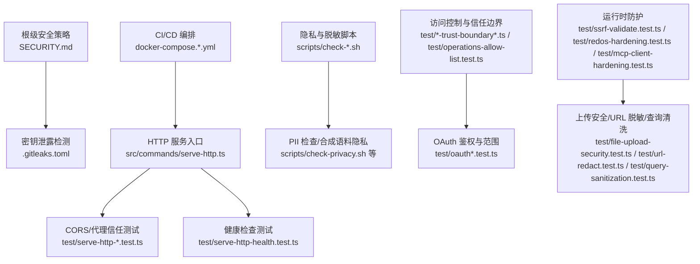

图示来源
- [SECURITY.md](file://SECURITY.md)
- [.gitleaks.toml](file://.gitleaks.toml)
- [docker-compose.ci.yml](file://docker-compose.ci.yml)
- [docker-compose.test.yml](file://docker-compose.test.yml)
- [src/commands/serve-http.ts](file://src/commands/serve-http.ts)
- [test/serve-http-cors.test.ts](file://test/serve-http-cors.test.ts)
- [test/serve-http-trust-proxy.test.ts](file://test/serve-http-trust-proxy.test.ts)
- [test/serve-http-health.test.ts](file://test/serve-http-health.test.ts)
- [scripts/check-privacy.sh](file://scripts/check-privacy.sh)
- [test/ssrf-validate.test.ts](file://test/ssrf-validate.test.ts)
- [test/redos-hardening.test.ts](file://test/redos-hardening.test.ts)
- [test/mcp-client-hardening.test.ts](file://test/mcp-client-hardening.test.ts)
- [test/file-upload-security.test.ts](file://test/file-upload-security.test.ts)
- [test/url-redact.test.ts](file://test/url-redact.test.ts)
- [test/query-sanitization.test.ts](file://test/query-sanitization.test.ts)

章节来源
- [SECURITY.md](file://SECURITY.md)
- [.gitleaks.toml](file://.gitleaks.toml)
- [docker-compose.ci.yml](file://docker-compose.ci.yml)
- [docker-compose.test.yml](file://docker-compose.test.yml)
- [src/commands/serve-http.ts](file://src/commands/serve-http.ts)

## 核心组件
- 安全策略与披露流程：定义漏洞报告渠道与处理原则，作为整体安全治理的基线
- 密钥泄露检测：在提交阶段拦截敏感信息外泄
- HTTP 服务安全：CORS、反向代理信任、健康端点暴露面控制
- 隐私与脱敏：构建期与运行期对 PII、URL、配置项进行脱敏与校验
- 访问控制与信任边界：操作白名单、OAuth 范围最小化、机密客户端约束
- 运行时防护：SSRF 防护、正则表达式拒绝服务缓解、第三方协议客户端加固
- 审计与可观测性：关键路径审计、数据库连接异常审计、子进程/调度器审计

章节来源
- [SECURITY.md](file://SECURITY.md)
- [.gitleaks.toml](file://.gitleaks.toml)
- [test/serve-http-cors.test.ts](file://test/serve-http-cors.test.ts)
- [test/serve-http-trust-proxy.test.ts](file://test/serve-http-trust-proxy.test.ts)
- [test/serve-http-health.test.ts](file://test/serve-http-health.test.ts)
- [scripts/check-privacy.sh](file://scripts/check-privacy.sh)
- [test/ssrf-validate.test.ts](file://test/ssrf-validate.test.ts)
- [test/redos-hardening.test.ts](file://test/redos-hardening.test.ts)
- [test/mcp-client-hardening.test.ts](file://test/mcp-client-hardening.test.ts)
- [test/operations-allow-list.test.ts](file://test/operations-allow-list.test.ts)
- [test/trust-boundary-contract.test.ts](file://test/trust-boundary-contract.test.ts)
- [test/oauth.test.ts](file://test/oauth.test.ts)
- [test/db-disconnect-audit.test.ts](file://test/db-disconnect-audit.test.ts)

## 架构总览
从“请求进入—鉴权—授权—执行—审计”的全链路视角，结合现有测试与入口，形成如下端到端安全视图：

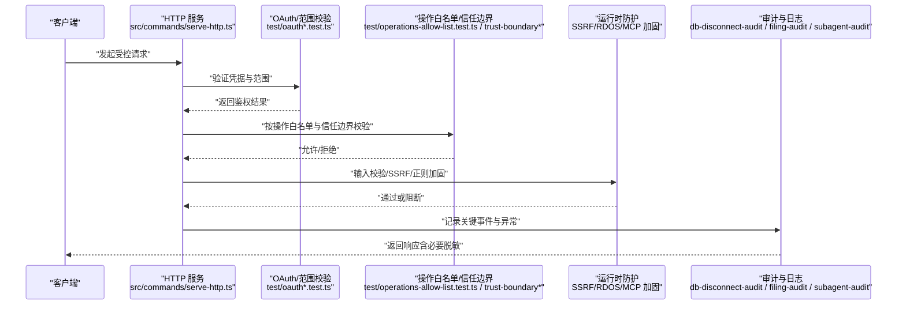

图示来源
- [src/commands/serve-http.ts](file://src/commands/serve-http.ts)
- [test/oauth.test.ts](file://test/oauth.test.ts)
- [test/oauth-authorize-scope-default.test.ts](file://test/oauth-authorize-scope-default.test.ts)
- [test/oauth-confidential-client.test.ts](file://test/oauth-confidential-client.test.ts)
- [test/oauth-scope-probe.test.ts](file://test/oauth-scope-probe.test.ts)
- [test/operations-allow-list.test.ts](file://test/operations-allow-list.test.ts)
- [test/trust-boundary-contract.test.ts](file://test/trust-boundary-contract.test.ts)
- [test/ssrf-validate.test.ts](file://test/ssrf-validate.test.ts)
- [test/redos-hardening.test.ts](file://test/redos-hardening.test.ts)
- [test/mcp-client-hardening.test.ts](file://test/mcp-client-hardening.test.ts)
- [test/db-disconnect-audit.test.ts](file://test/db-disconnect-audit.test.ts)
- [test/filing-audit.test.ts](file://test/filing-audit.test.ts)
- [test/subagent-audit.test.ts](file://test/subagent-audit.test.ts)

## 详细组件分析

### 身份认证与会话安全
- OAuth 鉴权与范围最小化：通过测试覆盖默认授权范围、机密客户端约束与范围探测，确保仅授予必要权限
- 会话安全建议：结合反向代理信任与 CORS 策略，避免跨域误配导致会话劫持风险；在生产环境启用强制 HTTPS 与安全的 Cookie 属性（如 Secure、HttpOnly、SameSite）

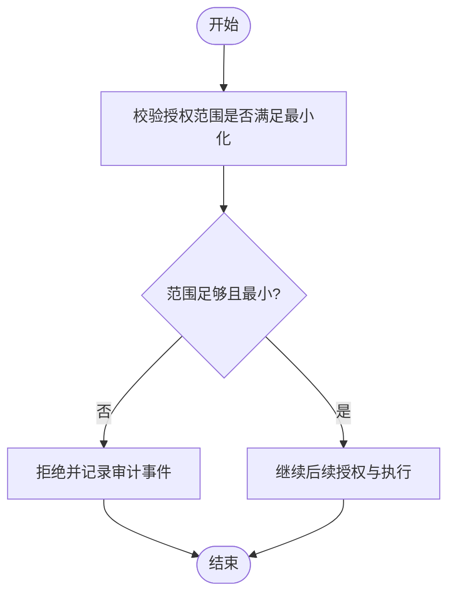

图示来源
- [test/oauth.test.ts](file://test/oauth.test.ts)
- [test/oauth-authorize-scope-default.test.ts](file://test/oauth-authorize-scope-default.test.ts)
- [test/oauth-confidential-client.test.ts](file://test/oauth-confidential-client.test.ts)
- [test/oauth-scope-probe.test.ts](file://test/oauth-scope-probe.test.ts)

章节来源
- [test/oauth.test.ts](file://test/oauth.test.ts)
- [test/oauth-authorize-scope-default.test.ts](file://test/oauth-authorize-scope-default.test.ts)
- [test/oauth-confidential-client.test.ts](file://test/oauth-confidential-client.test.ts)
- [test/oauth-scope-probe.test.ts](file://test/oauth-scope-probe.test.ts)

### 授权管理与信任边界
- 操作白名单：通过操作层白名单机制限制可执行动作，降低越权风险
- 信任边界契约：以契约形式明确各组件间信任关系与数据流边界，防止横向越权

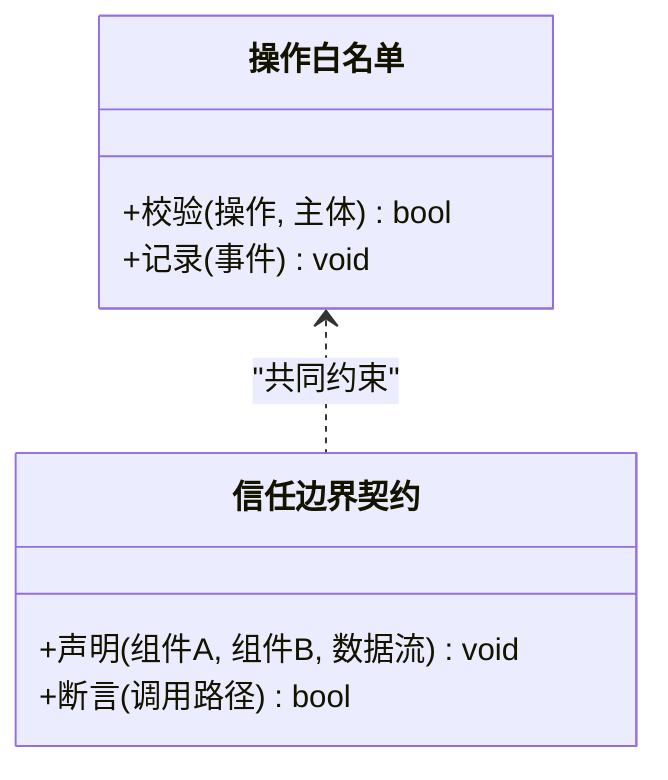

图示来源
- [test/operations-allow-list.test.ts](file://test/operations-allow-list.test.ts)
- [test/trust-boundary-contract.test.ts](file://test/trust-boundary-contract.test.ts)

章节来源
- [test/operations-allow-list.test.ts](file://test/operations-allow-list.test.ts)
- [test/trust-boundary-contract.test.ts](file://test/trust-boundary-contract.test.ts)

### 传输安全与网络安全
- CORS 与反向代理信任：通过测试验证跨域策略与代理头信任配置，避免错误放行导致的安全问题
- 健康检查端点：将健康检查与业务接口解耦，减少攻击面

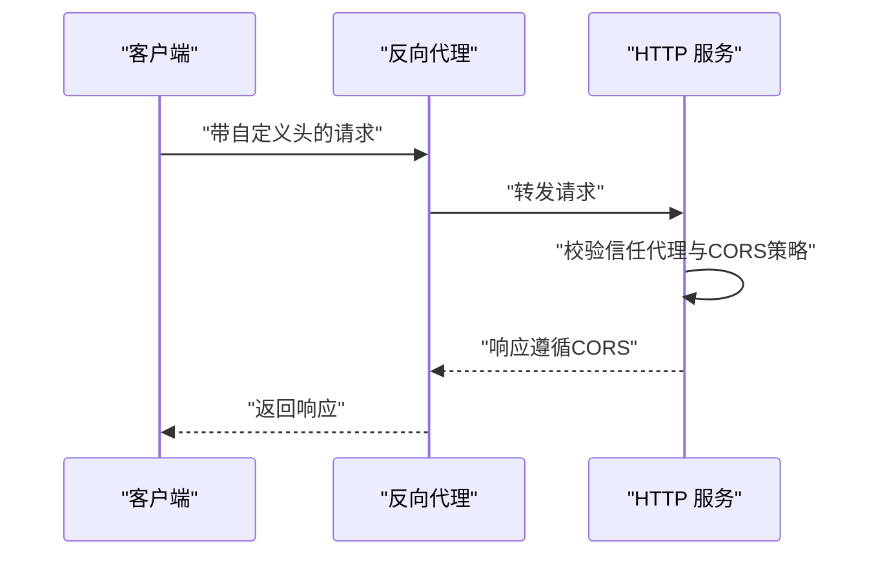

图示来源
- [test/serve-http-cors.test.ts](file://test/serve-http-cors.test.ts)
- [test/serve-http-trust-proxy.test.ts](file://test/serve-http-trust-proxy.test.ts)
- [test/serve-http-health.test.ts](file://test/serve-http-health.test.ts)

章节来源
- [test/serve-http-cors.test.ts](file://test/serve-http-cors.test.ts)
- [test/serve-http-trust-proxy.test.ts](file://test/serve-http-trust-proxy.test.ts)
- [test/serve-http-health.test.ts](file://test/serve-http-health.test.ts)

### 数据加密与存储安全
- 密钥与配置泄露防护：使用密钥泄露检测工具在提交阶段拦截敏感信息
- 配置项脱敏：针对源配置中的敏感字段进行脱敏，避免日志或输出泄露
- URL 脱敏：对包含凭据的 URL 进行脱敏处理，防止意外暴露

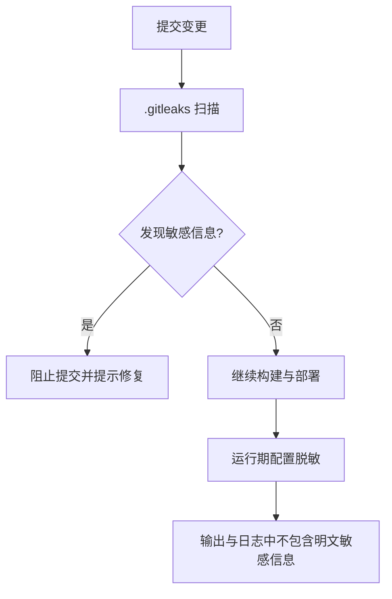

图示来源
- [.gitleaks.toml](file://.gitleaks.toml)
- [test/source-config-redact.test.ts](file://test/source-config-redact.test.ts)
- [test/url-redact.test.ts](file://test/url-redact.test.ts)

章节来源
- [.gitleaks.toml](file://.gitleaks.toml)
- [test/source-config-redact.test.ts](file://test/source-config-redact.test.ts)
- [test/url-redact.test.ts](file://test/url-redact.test.ts)

### 隐私保护与数据脱敏
- 构建期 PII 检查：通过脚本在构建阶段扫描潜在的个人身份信息泄露
- 合成语料隐私：确保合成数据集不包含真实用户隐私
- 评估捕获清洗：在评估过程中对捕获数据进行清洗，避免敏感信息进入评测产物

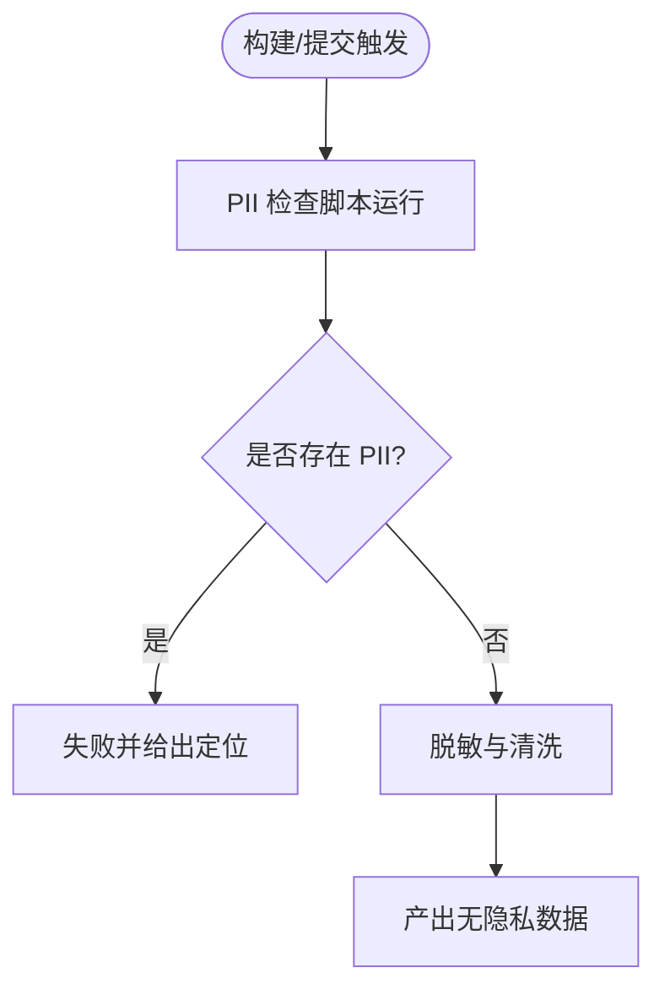

图示来源
- [scripts/check-no-pii-in-agent-voice.sh](file://scripts/check-no-pii-in-agent-voice.sh)
- [scripts/check-privacy.sh](file://scripts/check-privacy.sh)
- [scripts/check-proposal-pii.sh](file://scripts/check-proposal-pii.sh)
- [scripts/check-synthetic-corpus-privacy.sh](file://scripts/check-synthetic-corpus-privacy.sh)
- [test/eval-capture-sanitize.test.ts](file://test/eval-capture-sanitize.test.ts)

章节来源
- [scripts/check-no-pii-in-agent-voice.sh](file://scripts/check-no-pii-in-agent-voice.sh)
- [scripts/check-privacy.sh](file://scripts/check-privacy.sh)
- [scripts/check-proposal-pii.sh](file://scripts/check-proposal-pii.sh)
- [scripts/check-synthetic-corpus-privacy.sh](file://scripts/check-synthetic-corpus-privacy.sh)
- [test/eval-capture-sanitize.test.ts](file://test/eval-capture-sanitize.test.ts)

### 运行时防护与输入校验
- SSRF 防护：对外部资源访问进行域名/IP 白名单或内网地址拦截
- 正则拒绝服务缓解：对正则表达式进行复杂度与回溯限制，避免恶意输入导致 CPU 耗尽
- MCP 客户端加固：对第三方协议客户端进行能力裁剪与输入校验，降低注入风险
- 文件上传安全：对上传文件的类型、大小与内容进行校验，防止恶意载荷执行

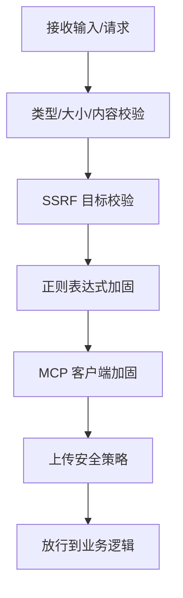

图示来源
- [test/ssrf-validate.test.ts](file://test/ssrf-validate.test.ts)
- [test/redos-hardening.test.ts](file://test/redos-hardening.test.ts)
- [test/mcp-client-hardening.test.ts](file://test/mcp-client-hardening.test.ts)
- [test/file-upload-security.test.ts](file://test/file-upload-security.test.ts)

章节来源
- [test/ssrf-validate.test.ts](file://test/ssrf-validate.test.ts)
- [test/redos-hardening.test.ts](file://test/redos-hardening.test.ts)
- [test/mcp-client-hardening.test.ts](file://test/mcp-client-hardening.test.ts)
- [test/file-upload-security.test.ts](file://test/file-upload-security.test.ts)

### 查询与轨迹安全
- 查询清洗：对用户输入的查询进行清洗，防止注入与越权读取
- 思维轨迹清洗：对模型推理过程中的中间结果进行清洗，避免敏感信息泄露

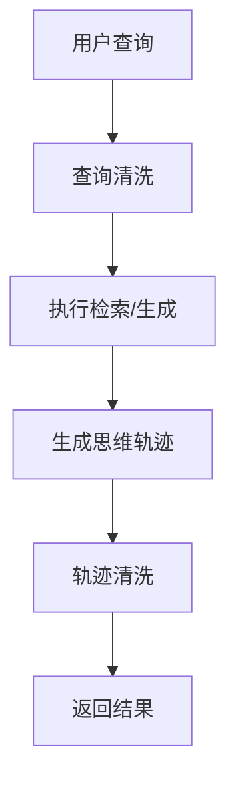

图示来源
- [test/query-sanitization.test.ts](file://test/query-sanitization.test.ts)
- [test/think-sanitize-trajectory.test.ts](file://test/think-sanitize-trajectory.test.ts)

章节来源
- [test/query-sanitization.test.ts](file://test/query-sanitization.test.ts)
- [test/think-sanitize-trajectory.test.ts](file://test/think-sanitize-trajectory.test.ts)

### 安全审计、日志与事件响应
- 审计覆盖：包括归档审计、子代理审计、调度器审计、数据库连接异常审计等
- 事件响应：基于审计日志快速定位异常，配合告警与工单系统开展处置

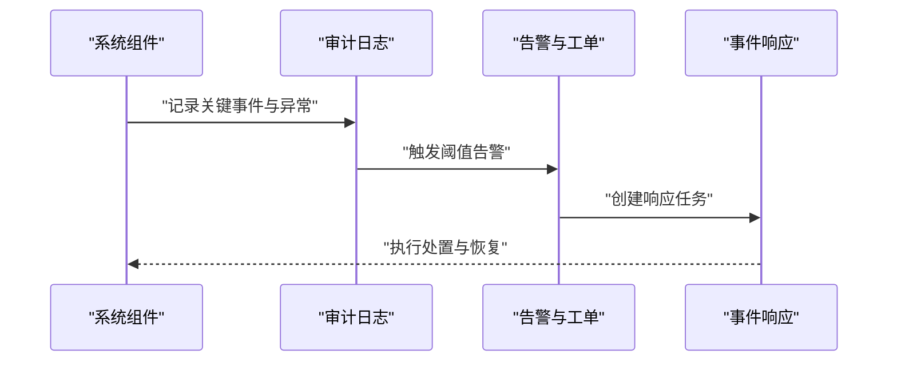

图示来源
- [test/filing-audit.test.ts](file://test/filing-audit.test.ts)
- [test/subagent-audit.test.ts](file://test/subagent-audit.test.ts)
- [test/supervisor-audit.test.ts](file://test/supervisor-audit.test.ts)
- [test/db-disconnect-audit.test.ts](file://test/db-disconnect-audit.test.ts)
- [test/audit-slug-fallback.serial.test.ts](file://test/audit-slug-fallback.serial.test.ts)

章节来源
- [test/filing-audit.test.ts](file://test/filing-audit.test.ts)
- [test/subagent-audit.test.ts](file://test/subagent-audit.test.ts)
- [test/supervisor-audit.test.ts](file://test/supervisor-audit.test.ts)
- [test/db-disconnect-audit.test.ts](file://test/db-disconnect-audit.test.ts)
- [test/audit-slug-fallback.serial.test.ts](file://test/audit-slug-fallback.serial.test.ts)

### 供应链与制品安全
- 技能目录安全：对技能包来源、签名与完整性进行校验，防止恶意扩展
- 测试隔离：确保测试环境与生产环境隔离，避免污染与泄露

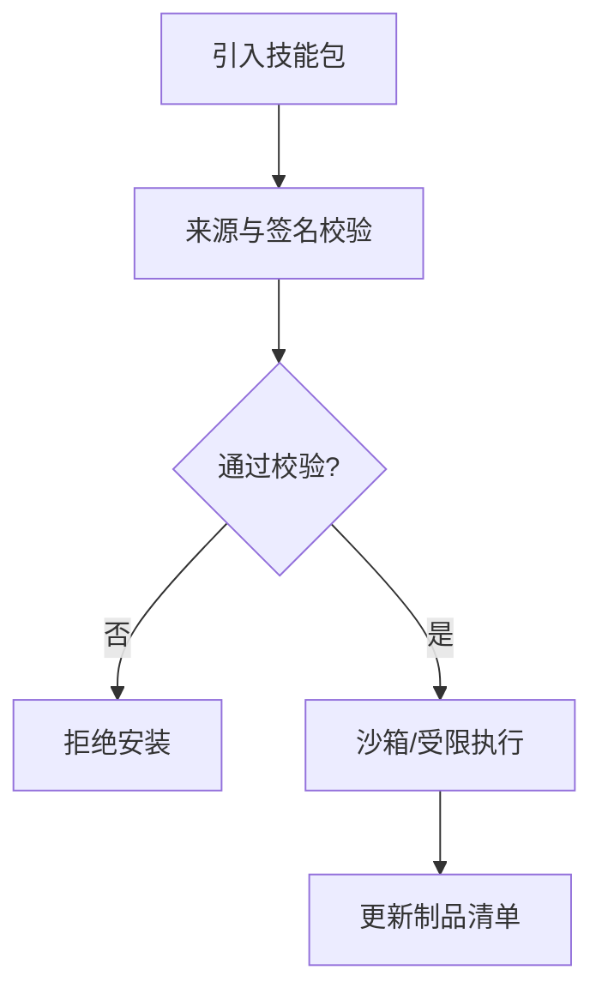

图示来源
- [test/skill-catalog-security.test.ts](file://test/skill-catalog-security.test.ts)
- [scripts/check-test-isolation.sh](file://scripts/check-test-isolation.sh)

章节来源
- [test/skill-catalog-security.test.ts](file://test/skill-catalog-security.test.ts)
- [scripts/check-test-isolation.sh](file://scripts/check-test-isolation.sh)

## 依赖分析
安全相关能力在 CI/CD 与本地开发中的依赖关系如下：

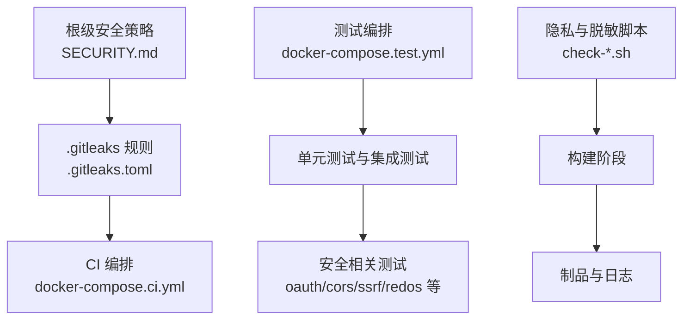

图示来源
- [SECURITY.md](file://SECURITY.md)
- [.gitleaks.toml](file://.gitleaks.toml)
- [docker-compose.ci.yml](file://docker-compose.ci.yml)
- [docker-compose.test.yml](file://docker-compose.test.yml)
- [scripts/check-privacy.sh](file://scripts/check-privacy.sh)

章节来源
- [SECURITY.md](file://SECURITY.md)
- [.gitleaks.toml](file://.gitleaks.toml)
- [docker-compose.ci.yml](file://docker-compose.ci.yml)
- [docker-compose.test.yml](file://docker-compose.test.yml)
- [scripts/check-privacy.sh](file://scripts/check-privacy.sh)

## 性能考虑
- 安全校验应尽可能前置与短路，避免对正常路径造成额外开销
- 正则表达式加固需平衡安全性与匹配性能，必要时采用预编译与超时保护
- 审计日志写入应采用异步与批量化策略，避免阻塞主流程
- 健康检查与监控指标应轻量，避免影响业务吞吐

## 故障排查指南
- 若提交被密钥泄露检测阻断，请根据提示定位并移除敏感信息，或使用忽略规则进行例外管理
- 若出现跨域或代理信任问题，请检查 CORS 配置与反向代理头信任策略
- 若发生外部资源访问异常，请核查 SSRF 白名单与网络策略
- 若评估或日志中出现敏感信息，请确认脱敏与清洗流程是否生效
- 若审计缺失或异常未告警，请检查审计埋点与告警阈值配置

章节来源
- [.gitleaks.toml](file://.gitleaks.toml)
- [test/serve-http-cors.test.ts](file://test/serve-http-cors.test.ts)
- [test/serve-http-trust-proxy.test.ts](file://test/serve-http-trust-proxy.test.ts)
- [test/ssrf-validate.test.ts](file://test/ssrf-validate.test.ts)
- [test/url-redact.test.ts](file://test/url-redact.test.ts)
- [test/source-config-redact.test.ts](file://test/source-config-redact.test.ts)
- [test/db-disconnect-audit.test.ts](file://test/db-disconnect-audit.test.ts)

## 结论
本项目在安全与合规方面已形成较为完整的工程化体系：从提交阶段的密钥泄露检测，到运行期的输入校验、访问控制与审计，再到构建期的隐私检查与制品安全，覆盖了全生命周期的关键风险点。建议持续完善威胁建模与风险评估流程，建立常态化的演练与应急预案，确保安全能力随业务演进同步提升。

## 附录
- 安全策略与披露流程参见根级安全策略文件
- 密钥泄露检测规则参见根级配置文件
- CI/CD 编排与测试编排参见对应 YAML 文件
- 隐私与脱敏脚本位于 scripts 目录
- 安全相关测试集中于 test 目录，可按模块检索