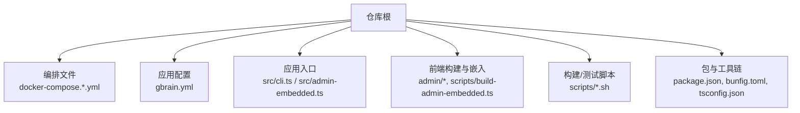
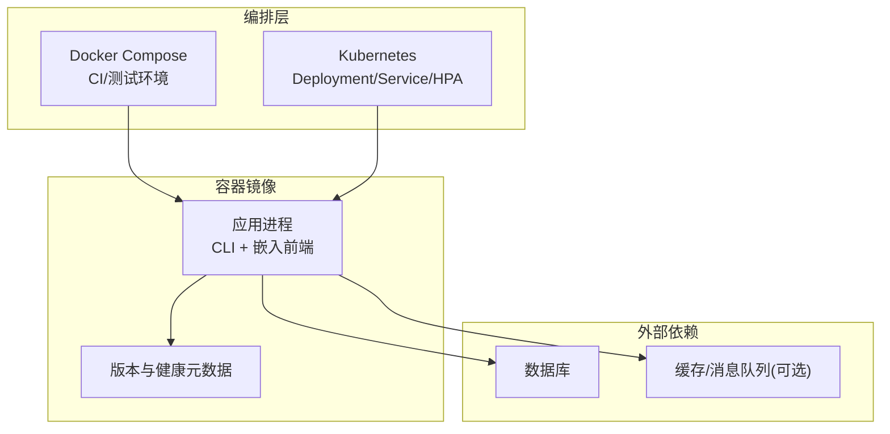
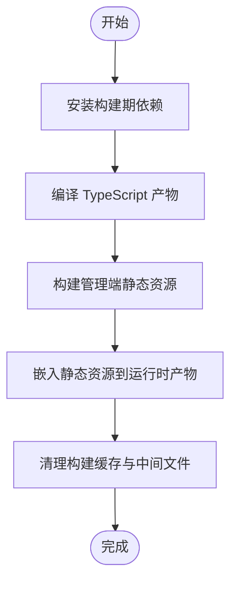
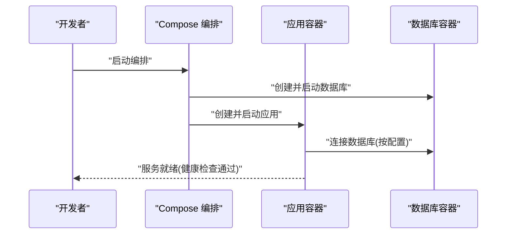
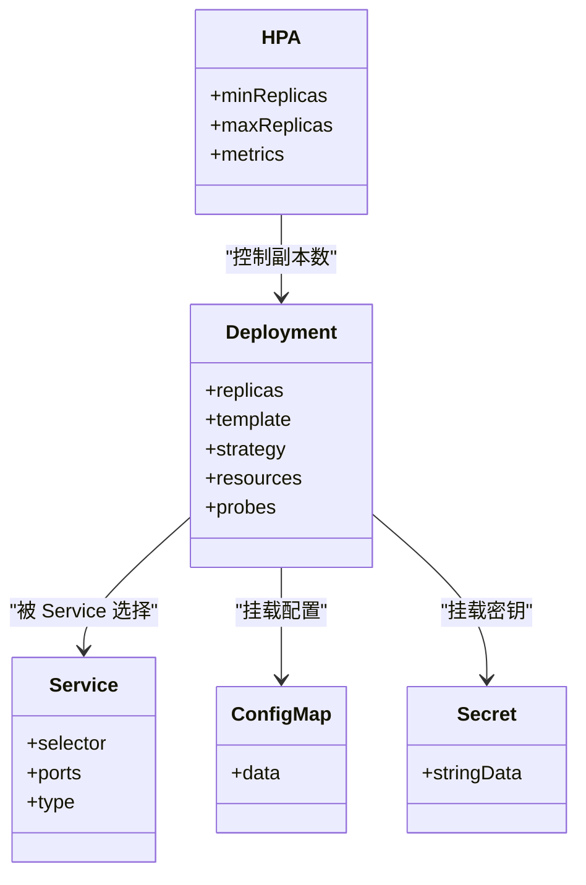
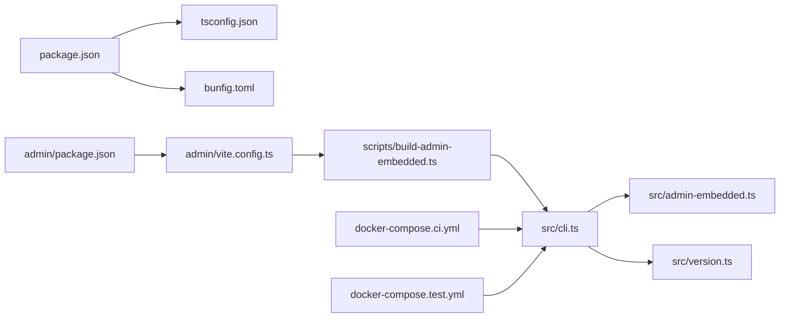

# 容器化部署

<cite>
**本文引用的文件**   
- [docker-compose.ci.yml](file://docker-compose.ci.yml)
- [docker-compose.test.yml](file://docker-compose.test.yml)
- [gbrain.yml](file://gbrain.yml)
- [package.json](file://package.json)
- [bunfig.toml](file://bunfig.toml)
- [tsconfig.json](file://tsconfig.json)
- [admin/package.json](file://admin/package.json)
- [admin/vite.config.ts](file://admin/vite.config.ts)
- [scripts/build-admin-embedded.ts](file://scripts/build-admin-embedded.ts)
- [scripts/check-admin-build.sh](file://scripts/check-admin-build.sh)
- [scripts/ci-local.sh](file://scripts/ci-local.sh)
- [scripts/smoke-test.sh](file://scripts/smoke-test.sh)
- [scripts/run-unit-parallel.sh](file://scripts/run-unit-parallel.sh)
- [src/cli.ts](file://src/cli.ts)
- [src/admin-embedded.ts](file://src/admin-embedded.ts)
- [src/version.ts](file://src/version.ts)
</cite>

## 目录
1. [简介](#简介)
2. [项目结构](#项目结构)
3. [核心组件](#核心组件)
4. [架构总览](#架构总览)
5. [详细组件分析](#详细组件分析)
6. [依赖关系分析](#依赖关系分析)
7. [性能与资源限制](#性能与资源限制)
8. [故障诊断与排错](#故障诊断与排错)
9. [结论](#结论)
10. [附录](#附录)

## 简介
本指南面向希望将本项目进行容器化部署的工程师，覆盖镜像构建、优化与安全加固；编排配置（Docker Compose）的结构与参数调优；Kubernetes 部署清单与服务发现；健康检查、自动扩缩容；日志收集、监控集成与故障诊断；以及主流云平台（AWS、GCP、Azure）的容器部署最佳实践。文档内容基于仓库中现有的编排脚本、配置文件与入口程序进行分析与总结，确保建议与现有实现保持一致。

## 项目结构
仓库包含用于本地/CI 的 Docker Compose 编排文件、应用主入口、管理端前端构建脚本与相关配置。关键位置如下：
- 编排与测试：docker-compose.ci.yml、docker-compose.test.yml
- 应用配置：gbrain.yml
- 应用入口与版本：src/cli.ts、src/admin-embedded.ts、src/version.ts
- 前端构建与嵌入：admin/package.json、admin/vite.config.ts、scripts/build-admin-embedded.ts、scripts/check-admin-build.sh
- 构建与运行脚本：scripts/ci-local.sh、scripts/smoke-test.sh、scripts/run-unit-parallel.sh
- 包与工具链：package.json、bunfig.toml、tsconfig.json

**章节来源**
- [docker-compose.ci.yml](file://docker-compose.ci.yml)
- [docker-compose.test.yml](file://docker-compose.test.yml)
- [gbrain.yml](file://gbrain.yml)
- [src/cli.ts](file://src/cli.ts)
- [src/admin-embedded.ts](file://src/admin-embedded.ts)
- [src/version.ts](file://src/version.ts)
- [admin/package.json](file://admin/package.json)
- [admin/vite.config.ts](file://admin/vite.config.ts)
- [scripts/build-admin-embedded.ts](file://scripts/build-admin-embedded.ts)
- [scripts/check-admin-build.sh](file://scripts/check-admin-build.sh)
- [scripts/ci-local.sh](file://scripts/ci-local.sh)
- [scripts/smoke-test.sh](file://scripts/smoke-test.sh)
- [scripts/run-unit-parallel.sh](file://scripts/run-unit-parallel.sh)
- [package.json](file://package.json)
- [bunfig.toml](file://bunfig.toml)
- [tsconfig.json](file://tsconfig.json)

## 核心组件
- 应用运行时入口
  - CLI 入口负责启动服务进程，承载 HTTP 接口与内部任务调度。
  - 管理端嵌入模块提供内置的管理界面能力，便于在单镜像内提供运维面板。
  - 版本信息模块对外暴露版本元数据，便于健康检查与可观测性上报。
- 前端构建与嵌入
  - 管理端使用 Vite 构建静态资源，并通过专用脚本将其嵌入到后端二进制或运行时产物中，从而减少镜像层数与体积。
- 编排与测试
  - CI 与测试环境通过独立的 docker-compose 文件定义依赖服务与运行参数，保证一致性。
- 构建与运行脚本
  - 提供本地 CI、冒烟测试、并行单元测试等脚本，作为容器化流水线的基础。

**章节来源**
- [src/cli.ts](file://src/cli.ts)
- [src/admin-embedded.ts](file://src/admin-embedded.ts)
- [src/version.ts](file://src/version.ts)
- [admin/package.json](file://admin/package.json)
- [admin/vite.config.ts](file://admin/vite.config.ts)
- [scripts/build-admin-embedded.ts](file://scripts/build-admin-embedded.ts)
- [scripts/check-admin-build.sh](file://scripts/check-admin-build.sh)
- [docker-compose.ci.yml](file://docker-compose.ci.yml)
- [docker-compose.test.yml](file://docker-compose.test.yml)

## 架构总览
下图展示了容器化后的主要组件与交互关系：应用镜像包含运行时与嵌入的前端资源；编排层根据环境加载不同 compose 文件；外部数据库与缓存为可选依赖；Kubernetes 场景下由控制器管理副本、探针与扩缩容策略。

[此图为概念性架构图，不直接映射具体源码文件]

## 详细组件分析

### 镜像构建与多阶段构建策略
- 目标
  - 最小化最终镜像体积，隔离构建期依赖，提升安全面。
- 推荐策略
  - 构建期阶段：安装 Node/Bun 及依赖，编译 TypeScript，构建管理端静态资源并嵌入。
  - 运行期阶段：仅包含运行时解释器、系统库与产物，避免保留构建缓存与源码。
- 关键输入与产物
  - 输入：TypeScript 源码、管理端前端源码、构建脚本。
  - 产物：可执行入口、嵌入的前端静态资源、运行时依赖。
- 参考路径
  - 管理端构建与嵌入流程：[admin/package.json](file://admin/package.json)、[admin/vite.config.ts](file://admin/vite.config.ts)、[scripts/build-admin-embedded.ts](file://scripts/build-admin-embedded.ts)、[scripts/check-admin-build.sh](file://scripts/check-admin-build.sh)
  - 应用入口与嵌入模块：[src/cli.ts](file://src/cli.ts)、[src/admin-embedded.ts](file://src/admin-embedded.ts)

[此流程图展示通用多阶段构建思路，未直接映射具体源码文件]

**章节来源**
- [admin/package.json](file://admin/package.json)
- [admin/vite.config.ts](file://admin/vite.config.ts)
- [scripts/build-admin-embedded.ts](file://scripts/build-admin-embedded.ts)
- [scripts/check-admin-build.sh](file://scripts/check-admin-build.sh)
- [src/cli.ts](file://src/cli.ts)
- [src/admin-embedded.ts](file://src/admin-embedded.ts)

### 镜像大小优化与安全加固
- 体积优化
  - 使用多阶段构建，分离构建与运行环境。
  - 合并 RUN 指令，删除不必要的临时文件与缓存。
  - 仅拷贝必要产物，剔除源码与测试文件。
- 安全加固
  - 以非 root 用户运行容器。
  - 固定基础镜像版本，启用只读根文件系统（必要时通过卷挂载写入）。
  - 扫描镜像漏洞，定期更新基础镜像与依赖。
  - 最小权限原则：仅开放必要端口，禁用不必要系统命令。
- 参考路径
  - 包管理与构建配置：[package.json](file://package.json)、[bunfig.toml](file://bunfig.toml)、[tsconfig.json](file://tsconfig.json)

**章节来源**
- [package.json](file://package.json)
- [bunfig.toml](file://bunfig.toml)
- [tsconfig.json](file://tsconfig.json)

### Docker Compose 配置结构与参数调优
- 文件定位
  - CI 环境编排：[docker-compose.ci.yml](file://docker-compose.ci.yml)
  - 测试环境编排：[docker-compose.test.yml](file://docker-compose.test.yml)
- 常见要点
  - 环境变量注入：数据库连接、密钥、功能开关等通过环境变量传入。
  - 网络与存储：为持久化数据与跨服务通信配置网络与卷。
  - 健康检查：对依赖服务与应用自身配置健康检查，保障启动顺序与自愈。
  - 资源限制：设置 CPU/内存上限，防止资源争用。
- 参考路径
  - 应用配置：[gbrain.yml](file://gbrain.yml)
  - 编排文件：[docker-compose.ci.yml](file://docker-compose.ci.yml)、[docker-compose.test.yml](file://docker-compose.test.yml)

**章节来源**
- [docker-compose.ci.yml](file://docker-compose.ci.yml)
- [docker-compose.test.yml](file://docker-compose.test.yml)
- [gbrain.yml](file://gbrain.yml)

### Kubernetes 部署清单与服务发现
- 部署对象
  - Deployment：定义副本数、镜像、环境变量、探针与资源限制。
  - Service：提供稳定的集群内访问入口与负载均衡。
  - Ingress：对外暴露 HTTP/HTTPS 流量。
  - ConfigMap/Secret：集中管理配置与敏感信息。
  - HPA：基于 CPU/内存或自定义指标进行自动扩缩容。
- 服务发现
  - 使用 Service DNS 名称访问后端服务，避免硬编码 IP。
- 健康检查
  - Liveness/Readiness Probe：结合应用健康端点，确保滚动升级与故障恢复。
- 参考路径
  - 应用入口与版本信息：[src/cli.ts](file://src/cli.ts)、[src/version.ts](file://src/version.ts)

[此图为概念性类图，用于说明 K8s 对象关系，不直接映射具体源码文件]

**章节来源**
- [src/cli.ts](file://src/cli.ts)
- [src/version.ts](file://src/version.ts)

### 健康检查与自动扩缩容
- 健康检查
  - 利用版本信息与内部状态暴露健康端点，供 Liveness/Readiness 探测。
  - 在 Compose 与 K8s 中分别配置健康检查，确保启动顺序与滚动升级安全。
- 自动扩缩容
  - 基于 CPU/内存利用率或业务指标（如请求延迟、队列长度）触发扩缩容。
  - 合理设置最小/最大副本与冷却时间，避免抖动。
- 参考路径
  - 版本与入口：[src/version.ts](file://src/version.ts)、[src/cli.ts](file://src/cli.ts)

**章节来源**
- [src/version.ts](file://src/version.ts)
- [src/cli.ts](file://src/cli.ts)

### 日志收集、监控集成与可观测性
- 日志
  - 输出结构化日志到标准输出，由容器运行时统一采集。
  - 在 Compose/K8s 中配置日志驱动与轮转策略。
- 监控
  - 暴露指标端点，接入 Prometheus/Grafana 或云原生监控。
  - 结合版本信息上报实例标识与环境标签。
- 追踪
  - 在关键路径添加分布式追踪上下文，便于链路排查。
- 参考路径
  - 入口与版本：[src/cli.ts](file://src/cli.ts)、[src/version.ts](file://src/version.ts)

**章节来源**
- [src/cli.ts](file://src/cli.ts)
- [src/version.ts](file://src/version.ts)

### 不同云平台的容器部署最佳实践
- AWS
  - 使用 ECR 托管镜像，EKS 运行工作负载，配合 ALB/NLB 暴露服务。
  - 使用 Secrets Manager/SSM Parameter Store 管理敏感信息。
  - 通过 CloudWatch 收集日志与指标，设置告警。
- GCP
  - 使用 Artifact Registry 托管镜像，GKE 运行工作负载，配合 Ingress/LoadBalancer。
  - 使用 Secret Manager 管理密钥，Cloud Logging/Monitoring 收集日志与指标。
- Azure
  - 使用 ACR 托管镜像，AKS 运行工作负载，配合 Ingress/LoadBalancer。
  - 使用 Key Vault 管理密钥，Azure Monitor/Log Analytics 收集日志与指标。

[本节为通用最佳实践总结，不直接映射具体源码文件]

## 依赖关系分析
- 构建与运行依赖
  - 包管理与构建：package.json、bunfig.toml、tsconfig.json
  - 前端构建与嵌入：admin/package.json、admin/vite.config.ts、scripts/build-admin-embedded.ts
  - 应用入口与嵌入：src/cli.ts、src/admin-embedded.ts、src/version.ts
- 编排与测试
  - docker-compose.ci.yml、docker-compose.test.yml
  - 脚本：scripts/ci-local.sh、scripts/smoke-test.sh、scripts/run-unit-parallel.sh

**图表来源**
- [package.json](file://package.json)
- [bunfig.toml](file://bunfig.toml)
- [tsconfig.json](file://tsconfig.json)
- [admin/package.json](file://admin/package.json)
- [admin/vite.config.ts](file://admin/vite.config.ts)
- [scripts/build-admin-embedded.ts](file://scripts/build-admin-embedded.ts)
- [src/cli.ts](file://src/cli.ts)
- [src/admin-embedded.ts](file://src/admin-embedded.ts)
- [src/version.ts](file://src/version.ts)
- [docker-compose.ci.yml](file://docker-compose.ci.yml)
- [docker-compose.test.yml](file://docker-compose.test.yml)

**章节来源**
- [package.json](file://package.json)
- [bunfig.toml](file://bunfig.toml)
- [tsconfig.json](file://tsconfig.json)
- [admin/package.json](file://admin/package.json)
- [admin/vite.config.ts](file://admin/vite.config.ts)
- [scripts/build-admin-embedded.ts](file://scripts/build-admin-embedded.ts)
- [src/cli.ts](file://src/cli.ts)
- [src/admin-embedded.ts](file://src/admin-embedded.ts)
- [src/version.ts](file://src/version.ts)
- [docker-compose.ci.yml](file://docker-compose.ci.yml)
- [docker-compose.test.yml](file://docker-compose.test.yml)

## 性能与资源限制
- 容器资源限制
  - 在 Compose/K8s 中为应用设置 requests/limits，避免资源争用与 OOM。
  - 针对 I/O 密集型与 CPU 密集型任务分别调整资源配额。
- 并发与线程池
  - 依据宿主 CPU 核数与内存规模调整并发度，避免过度竞争。
- 缓存与存储
  - 合理使用本地缓存与外部缓存，降低数据库压力。
  - 对大文件与模型权重采用分层存储与按需加载。
- 参考路径
  - 编排与脚本：[docker-compose.ci.yml](file://docker-compose.ci.yml)、[docker-compose.test.yml](file://docker-compose.test.yml)、[scripts/ci-local.sh](file://scripts/ci-local.sh)、[scripts/run-unit-parallel.sh](file://scripts/run-unit-parallel.sh)

**章节来源**
- [docker-compose.ci.yml](file://docker-compose.ci.yml)
- [docker-compose.test.yml](file://docker-compose.test.yml)
- [scripts/ci-local.sh](file://scripts/ci-local.sh)
- [scripts/run-unit-parallel.sh](file://scripts/run-unit-parallel.sh)

## 故障诊断与排错
- 常见问题
  - 启动失败：检查环境变量与配置项是否完整，确认数据库连通性。
  - 健康检查失败：验证健康端点返回码与响应体，检查依赖服务状态。
  - 资源不足：查看容器资源限制与宿主资源使用情况，调整配额。
  - 日志缺失：确认日志输出格式与采集配置，检查磁盘空间与轮转策略。
- 诊断步骤
  - 进入容器查看进程与端口占用。
  - 拉取最近日志与堆栈信息，定位异常调用链。
  - 对比不同环境的配置差异，逐步缩小范围。
- 参考路径
  - 编排与测试脚本：[docker-compose.ci.yml](file://docker-compose.ci.yml)、[docker-compose.test.yml](file://docker-compose.test.yml)、[scripts/smoke-test.sh](file://scripts/smoke-test.sh)、[scripts/ci-local.sh](file://scripts/ci-local.sh)

**章节来源**
- [docker-compose.ci.yml](file://docker-compose.ci.yml)
- [docker-compose.test.yml](file://docker-compose.test.yml)
- [scripts/smoke-test.sh](file://scripts/smoke-test.sh)
- [scripts/ci-local.sh](file://scripts/ci-local.sh)

## 结论
通过将构建期与运行期解耦、嵌入前端资源、完善健康检查与可观测性，并结合 Compose/K8s 的资源限制与自动扩缩容，可实现稳定高效的容器化部署。在不同云平台上遵循各自的最佳实践，能够进一步提升安全性、可维护性与可扩展性。

## 附录
- 快速参考
  - 应用入口与嵌入：[src/cli.ts](file://src/cli.ts)、[src/admin-embedded.ts](file://src/admin-embedded.ts)
  - 版本信息：[src/version.ts](file://src/version.ts)
  - 管理端构建与嵌入：[admin/package.json](file://admin/package.json)、[admin/vite.config.ts](file://admin/vite.config.ts)、[scripts/build-admin-embedded.ts](file://scripts/build-admin-embedded.ts)
  - 编排与测试：[docker-compose.ci.yml](file://docker-compose.ci.yml)、[docker-compose.test.yml](file://docker-compose.test.yml)
  - 构建与运行脚本：[scripts/ci-local.sh](file://scripts/ci-local.sh)、[scripts/smoke-test.sh](file://scripts/smoke-test.sh)、[scripts/run-unit-parallel.sh](file://scripts/run-unit-parallel.sh)
  - 包与工具链：[package.json](file://package.json)、[bunfig.toml](file://bunfig.toml)、[tsconfig.json](file://tsconfig.json)
  - 应用配置：[gbrain.yml](file://gbrain.yml)