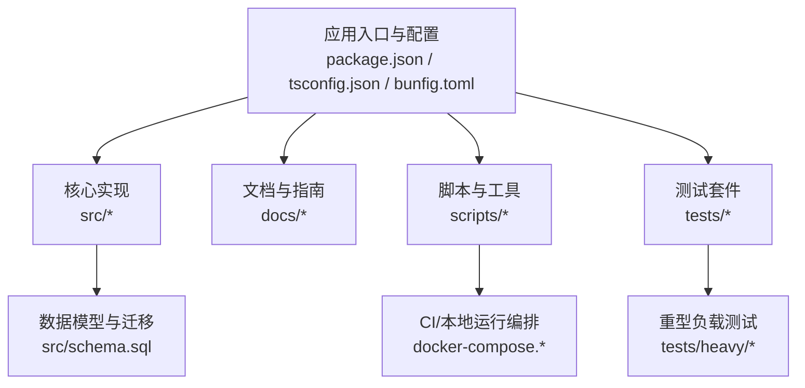
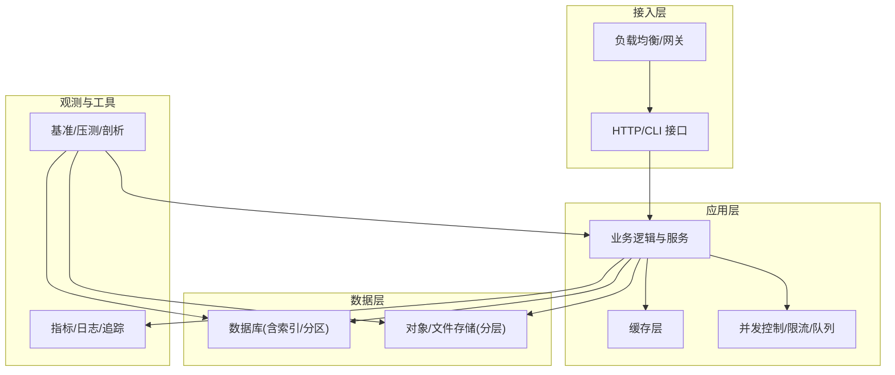
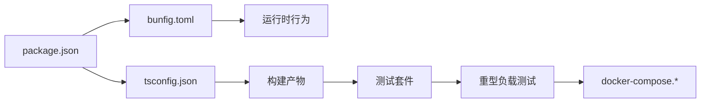

# 性能调优

<cite>
**本文引用的文件**   
- [README.md](file://README.md)
- [INSTALL.md](file://docs/INSTALL.md)
- [ENGINES.md](file://docs/ENGINES.md)
- [storage-tiering.md](file://docs/storage-tiering.md)
- [eval-bench.md](file://docs/eval-bench.md)
- [v0.38-smoke-test-report.md](file://docs/v0.38-smoke-test-report.md)
- [gbrain.yml](file://gbrain.yml)
- [docker-compose.ci.yml](file://docker-compose.ci.yml)
- [docker-compose.test.yml](file://docker-compose.test.yml)
- [bunfig.toml](file://bunfig.toml)
- [package.json](file://package.json)
- [tsconfig.json](file://tsconfig.json)
- [scripts/profile-tests.sh](file://scripts/profile-tests.sh)
- [scripts/run-heavy.sh](file://scripts/run-heavy.sh)
- [scripts/smoke-test.sh](file://scripts/smoke-test.sh)
- [scripts/ci-local.sh](file://scripts/ci-local.sh)
- [scripts/run-unit-parallel.sh](file://scripts/run-unit-parallel.sh)
- [scripts/run-slow-tests.sh](file://scripts/run-slow-tests.sh)
- [scripts/run-serial-tests.sh](file://scripts/run-serial-tests.sh)
- [scripts/test-shard.sh](file://scripts/test-shard.sh)
- [scripts/e2e-test-map.ts](file://scripts/e2e-test-map.ts)
- [scripts/sharding.ts](file://scripts/sharding.ts)
- [scripts/generate-metric-glossary.ts](file://scripts/generate-metric-glossary.ts)
- [scripts/check-no-double-retry.sh](file://scripts/check-no-double-retry.sh)
- [scripts/check-worker-pool-atomicity.sh](file://scripts/check-worker-pool-atomicity.sh)
- [scripts/check-worker-lock-renewal-shape.sh](file://scripts/check-worker-lock-renewal-shape.sh)
- [src/schema.sql](file://src/schema.sql)
- [tests/heavy/_measure_rss_workload.ts](file://tests/heavy/_measure_rss_workload.ts)
- [tests/heavy/_read_latency_workload.ts](file://tests/heavy/_read_latency_workload.ts)
- [tests/heavy/README.md](file://tests/heavy/README.md)
</cite>

## 目录
1. [简介](#简介)
2. [项目结构](#项目结构)
3. [核心组件](#核心组件)
4. [架构总览](#架构总览)
5. [详细组件分析](#详细组件分析)
6. [依赖关系分析](#依赖关系分析)
7. [性能考量](#性能考量)
8. [故障排查指南](#故障排查指南)
9. [结论](#结论)
10. [附录](#附录)

## 简介
本指南面向系统工程师与运维人员，围绕 gbrain 的性能调优、容量规划与成本优化提供系统化方法。内容覆盖数据库查询与索引、连接池配置、内存管理与缓存策略、并发控制、负载均衡与水平/垂直扩展、基准与压力测试、瓶颈定位、监控与分析工具使用，以及不同负载场景下的调优经验与案例研究，并给出成本优化措施与ROI评估方法。

## 项目结构
仓库采用“源码 + 文档 + 脚本 + 测试”的分层组织方式：
- docs：架构与设计文档、操作指南、迁移与版本说明等
- scripts：构建、测试、性能与质量检查脚本
- src：核心实现与数据模型定义（含 schema）
- tests：单元、集成与重型负载测试套件
- docker-compose.*：CI/测试环境编排
- 根级配置：包管理、运行时与工程配置

图表来源
- [package.json:1-200](file://package.json#L1-L200)
- [tsconfig.json:1-200](file://tsconfig.json#L1-L200)
- [bunfig.toml:1-200](file://bunfig.toml#L1-L200)
- [src/schema.sql:1-200](file://src/schema.sql#L1-L200)
- [docs/INSTALL.md:1-200](file://docs/INSTALL.md#L1-L200)
- [docker-compose.ci.yml:1-200](file://docker-compose.ci.yml#L1-L200)
- [docker-compose.test.yml:1-200](file://docker-compose.test.yml#L1-L200)

章节来源
- [README.md:1-200](file://README.md#L1-L200)
- [docs/INSTALL.md:1-200](file://docs/INSTALL.md#L1-L200)
- [docs/ENGINES.md:1-200](file://docs/ENGINES.md#L1-L200)
- [docs/storage-tiering.md:1-200](file://docs/storage-tiering.md#L1-L200)
- [gbrain.yml:1-200](file://gbrain.yml#L1-L200)
- [docker-compose.ci.yml:1-200](file://docker-compose.ci.yml#L1-L200)
- [docker-compose.test.yml:1-200](file://docker-compose.test.yml#L1-L200)
- [bunfig.toml:1-200](file://bunfig.toml#L1-L200)
- [package.json:1-200](file://package.json#L1-L200)
- [tsconfig.json:1-200](file://tsconfig.json#L1-L200)

## 核心组件
- 引擎与存储分层：文档定义了多引擎支持与存储分层策略，为性能与成本权衡提供基础能力。
- 配置中心：集中式配置用于统一参数下发，便于在不同环境进行差异化调优。
- 测试与基准：包含重型负载与延迟测量脚本，支撑压测与回归基线。
- CI/编排：通过 Compose 与脚本组合，快速搭建可复现的压测与评测环境。

章节来源
- [docs/ENGINES.md:1-200](file://docs/ENGINES.md#L1-L200)
- [docs/storage-tiering.md:1-200](file://docs/storage-tiering.md#L1-L200)
- [gbrain.yml:1-200](file://gbrain.yml#L1-L200)
- [docs/eval-bench.md:1-200](file://docs/eval-bench.md#L1-L200)
- [scripts/run-heavy.sh:1-200](file://scripts/run-heavy.sh#L1-L200)
- [tests/heavy/_measure_rss_workload.ts:1-200](file://tests/heavy/_measure_rss_workload.ts#L1-L200)
- [tests/heavy/_read_latency_workload.ts:1-200](file://tests/heavy/_read_latency_workload.ts#L1-L200)

## 架构总览
下图展示从外部请求到内部处理、存储与观测的关键路径，突出与性能相关的组件与边界。

[此图为概念性架构图，不直接映射具体源文件，故无图表来源]

## 详细组件分析

### 数据库查询优化与索引设计
- 查询优化要点
  - 优先选择选择性高的列作为过滤条件，避免全表扫描
  - 将高频读路径拆分为只读副本或物化视图，降低主库压力
  - 对大结果集分页与投影裁剪，减少网络与序列化开销
- 索引设计建议
  - 复合索引按等值条件在前、范围条件在后排列
  - 覆盖索引减少回表；注意写入放大与空间占用
  - 定期统计信息更新，确保执行计划稳定
- 连接池配置
  - 根据CPU核数与I/O特性设置最大连接数
  - 合理设置空闲回收与超时，避免连接泄漏
  - 读写分离时分别配置独立池，隔离慢查询影响

章节来源
- [src/schema.sql:1-200](file://src/schema.sql#L1-L200)
- [docs/ENGINES.md:1-200](file://docs/ENGINES.md#L1-L200)

### 内存管理与缓存策略
- 内存管理
  - 限制单进程堆大小，启用GC阈值与频率调节
  - 大对象走外存或分块处理，避免峰值OOM
  - 监控RSS与VMS，识别内存泄漏与碎片
- 缓存策略
  - 多级缓存：进程内 -> 本地共享 -> 分布式
  - 热点键TTL与淘汰策略（LRU/LFU），结合访问热度动态调整
  - 缓存一致性：写穿/失效广播，避免脏读

章节来源
- [bunfig.toml:1-200](file://bunfig.toml#L1-L200)
- [tests/heavy/_measure_rss_workload.ts:1-200](file://tests/heavy/_measure_rss_workload.ts#L1-L200)

### 并发控制与资源隔离
- 并发模型
  - 基于事件循环的异步IO，避免线程切换开销
  - 任务分级：高优先级短任务优先调度
- 限流与背压
  - 令牌桶/漏桶控制上游流量
  - 下游依赖失败快速失败与退避重试
- 资源隔离
  - 按租户/模块划分工作池，防止相互干扰
  - 关键路径独占资源，非关键路径降级

章节来源
- [scripts/check-worker-pool-atomicity.sh:1-200](file://scripts/check-worker-pool-atomicity.sh#L1-L200)
- [scripts/check-worker-lock-renewal-shape.sh:1-200](file://scripts/check-worker-lock-renewal-shape.sh#L1-L200)

### 负载均衡、水平扩展与垂直扩展
- 负载均衡
  - 四层/七层LB结合健康检查与权重路由
  - 会话保持与粘性路由按需开启
- 水平扩展
  - 无状态服务横向扩容，配合自动扩缩容
  - 分片与一致性哈希保证数据均匀分布
- 垂直扩展
  - CPU/内存/磁盘I/O按比例提升，关注热节点瓶颈
  - 升级后重新校准连接池与缓存尺寸

章节来源
- [docker-compose.ci.yml:1-200](file://docker-compose.ci.yml#L1-L200)
- [docker-compose.test.yml:1-200](file://docker-compose.test.yml#L1-L200)
- [docs/storage-tiering.md:1-200](file://docs/storage-tiering.md#L1-L200)

### 性能基准测试、压力测试与瓶颈分析
- 基准测试
  - 建立稳定的基线用例与数据集，固定硬件与环境
  - 输出吞吐、P95/P99延迟、错误率与资源利用率
- 压力测试
  - 阶梯加压与突发流量模拟，观察拐点与退化曲线
  - 长稳态压测发现内存泄漏与锁竞争
- 瓶颈分析
  - 链路追踪定位慢调用链
  - 剖析CPU热点与GC停顿
  - 数据库慢查询与锁等待分析

章节来源
- [docs/eval-bench.md:1-200](file://docs/eval-bench.md#L1-L200)
- [scripts/profile-tests.sh:1-200](file://scripts/profile-tests.sh#L1-L200)
- [scripts/run-heavy.sh:1-200](file://scripts/run-heavy.sh#L1-L200)
- [tests/heavy/_read_latency_workload.ts:1-200](file://tests/heavy/_read_latency_workload.ts#L1-L200)
- [tests/heavy/_measure_rss_workload.ts:1-200](file://tests/heavy/_measure_rss_workload.ts#L1-L200)

### 资源使用监控、性能分析与调优工具
- 监控指标
  - 应用：QPS、延迟分位、错误率、队列长度、缓存命中率
  - 系统：CPU、内存、磁盘I/O、网络带宽、上下文切换
  - 数据库：连接数、锁等待、慢查询、缓冲命中
- 分析工具
  - 火焰图与采样器定位热点
  - 分布式追踪串联跨服务调用
  - 数据库EXPLAIN/ANALYZE辅助优化

章节来源
- [scripts/generate-metric-glossary.ts:1-200](file://scripts/generate-metric-glossary.ts#L1-L200)
- [docs/v0.38-smoke-test-report.md:1-200](file://docs/v0.38-smoke-test-report.md#L1-L200)

### 不同负载场景下的配置调优经验与案例
- 读多写少
  - 扩大只读副本与缓存比例，缩短TTL
  - 索引偏向查询模式，适当冗余
- 写多读少
  - 批量写入与合并提交，降低锁粒度
  - 预分配与顺序写入，减少碎片
- 突发流量
  - 弹性扩容与队列削峰，保护后端
  - 降级策略：非关键路径短路

章节来源
- [docs/storage-tiering.md:1-200](file://docs/storage-tiering.md#L1-L200)
- [docs/v0.38-smoke-test-report.md:1-200](file://docs/v0.38-smoke-test-report.md#L1-L200)

### 成本优化措施与ROI评估
- 成本优化
  - 冷热分层存储，低频数据下沉至低成本介质
  - 实例规格与数量动态调整，利用预留实例/竞价实例
  - 缓存命中率提升减少昂贵后端调用
- ROI评估
  - 以单位时间节省成本对比优化投入（人力/变更风险）
  - 以SLA改善带来的业务收益折算
  - 建立持续度量看板，跟踪长期收益

章节来源
- [docs/storage-tiering.md:1-200](file://docs/storage-tiering.md#L1-L200)
- [gbrain.yml:1-200](file://gbrain.yml#L1-L200)

## 依赖关系分析
- 构建与运行依赖
  - 包管理与类型配置决定编译产物与运行行为
  - 运行时配置影响并发、缓存与资源上限
- 测试与CI依赖
  - 并行与串行测试脚本组合，保障回归稳定性
  - 重型负载脚本与Compose编排提供一致压测环境

图表来源
- [package.json:1-200](file://package.json#L1-L200)
- [tsconfig.json:1-200](file://tsconfig.json#L1-L200)
- [bunfig.toml:1-200](file://bunfig.toml#L1-L200)
- [docker-compose.ci.yml:1-200](file://docker-compose.ci.yml#L1-L200)
- [docker-compose.test.yml:1-200](file://docker-compose.test.yml#L1-L200)

章节来源
- [package.json:1-200](file://package.json#L1-L200)
- [tsconfig.json:1-200](file://tsconfig.json#L1-L200)
- [bunfig.toml:1-200](file://bunfig.toml#L1-L200)
- [docker-compose.ci.yml:1-200](file://docker-compose.ci.yml#L1-L200)
- [docker-compose.test.yml:1-200](file://docker-compose.test.yml#L1-L200)

## 性能考量
- 端到端延迟与吞吐的平衡：在P99延迟目标下最大化吞吐
- 资源利用率与稳定性：避免过度饱和，保留安全边际
- 可扩展性与弹性：支持分钟级扩缩容，平滑应对波动
- 可观测性先行：先建指标与告警，再实施变更

[本节为通用指导，不直接分析具体文件]

## 故障排查指南
- 常见问题定位
  - 连接池耗尽：检查最大连接、空闲回收与泄漏点
  - 缓存穿透/击穿：增加空值缓存与互斥重建
  - 锁竞争：缩小事务范围，拆分热点行
- 诊断流程
  - 收集指标与日志，关联时间窗口
  - 复现实验：固定输入与并发度，逐步放宽约束
  - 验证修复：回归基线与灰度发布

章节来源
- [scripts/check-no-double-retry.sh:1-200](file://scripts/check-no-double-retry.sh#L1-L200)
- [scripts/check-worker-pool-atomicity.sh:1-200](file://scripts/check-worker-pool-atomicity.sh#L1-L200)
- [scripts/check-worker-lock-renewal-shape.sh:1-200](file://scripts/check-worker-lock-renewal-shape.sh#L1-L200)

## 结论
通过体系化的查询与索引优化、合理的连接池与缓存策略、严格的并发控制与资源隔离、完善的基准与压测体系、以及持续的监控与成本治理，可在保障SLA的前提下持续提升吞吐、降低延迟与总体拥有成本。建议在每次重大变更后回归基线，形成闭环优化。

[本节为总结性内容，不直接分析具体文件]

## 附录

### 常用命令与脚本参考
- 本地与CI运行
  - 本地快速运行与调试
  - CI流水线与测试编排
- 测试与压测
  - 并行/串行/慢用例执行
  - 重型负载与延迟测量
- 质量与规范
  - 代码与配置检查脚本

章节来源
- [scripts/ci-local.sh:1-200](file://scripts/ci-local.sh#L1-L200)
- [scripts/run-unit-parallel.sh:1-200](file://scripts/run-unit-parallel.sh#L1-L200)
- [scripts/run-slow-tests.sh:1-200](file://scripts/run-slow-tests.sh#L1-L200)
- [scripts/run-serial-tests.sh:1-200](file://scripts/run-serial-tests.sh#L1-L200)
- [scripts/test-shard.sh:1-200](file://scripts/test-shard.sh#L1-L200)
- [scripts/e2e-test-map.ts:1-200](file://scripts/e2e-test-map.ts#L1-L200)
- [scripts/sharding.ts:1-200](file://scripts/sharding.ts#L1-L200)
- [scripts/smoke-test.sh:1-200](file://scripts/smoke-test.sh#L1-L200)
- [scripts/run-heavy.sh:1-200](file://scripts/run-heavy.sh#L1-L200)
- [tests/heavy/README.md:1-200](file://tests/heavy/README.md#L1-L200)