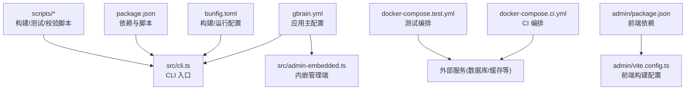
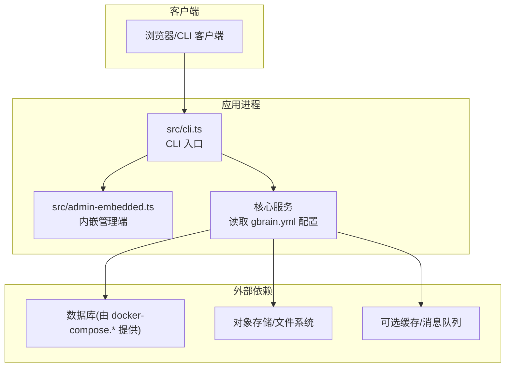
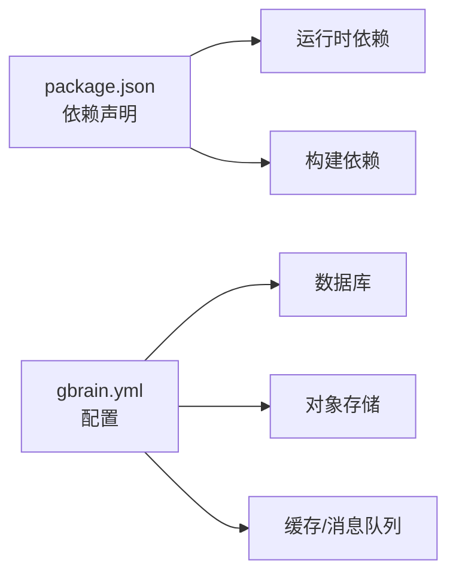

# 环境配置

<cite>
**本文引用的文件**   
- [gbrain.yml](file://gbrain.yml)
- [INSTALL.md](file://docs/INSTALL.md)
- [docker-compose.ci.yml](file://docker-compose.ci.yml)
- [docker-compose.test.yml](file://docker-compose.test.yml)
- [package.json](file://package.json)
- [bunfig.toml](file://bunfig.toml)
- [src/cli.ts](file://src/cli.ts)
- [src/admin-embedded.ts](file://src/admin-embedded.ts)
- [scripts/smoke-test.sh](file://scripts/smoke-test.sh)
- [scripts/run-unit-parallel.sh](file://scripts/run-unit-parallel.sh)
- [scripts/ci-local.sh](file://scripts/ci-local.sh)
- [scripts/build-admin-embedded.ts](file://scripts/build-admin-embedded.ts)
- [admin/package.json](file://admin/package.json)
- [admin/vite.config.ts](file://admin/vite.config.ts)
</cite>

## 目录
1. [简介](#简介)
2. [项目结构](#项目结构)
3. [核心组件](#核心组件)
4. [架构总览](#架构总览)
5. [详细组件分析](#详细组件分析)
6. [依赖分析](#依赖分析)
7. [性能考虑](#性能考虑)
8. [故障排查指南](#故障排查指南)
9. [结论](#结论)
10. [附录](#附录)

## 简介
本指南面向开发、测试与生产环境的搭建与运维，覆盖系统要求、依赖安装、基础配置、环境变量与参数调优，以及单机、集群与云原生部署的环境准备清单。同时包含数据库初始化、存储与网络设置、安全相关配置（认证、授权、加密）及常见问题排查方案。

## 项目结构
仓库采用“后端服务 + 管理前端 + 脚本与文档”的复合结构：
- 根级配置文件：gbrain.yml（应用主配置）、bunfig.toml（构建与运行期配置）、package.json（Node/Bun 依赖与脚本）。
- 容器编排：docker-compose.ci.yml、docker-compose.test.yml（CI/测试环境）。
- 入口与命令：src/cli.ts（CLI 入口）、src/admin-embedded.ts（内嵌管理端启动逻辑）。
- 管理前端：admin/（Vite 工程，含 package.json 与 vite.config.ts）。
- 脚本：scripts/（构建、测试、校验等）。
- 文档：docs/（安装、迁移、评估、集成等）。

图表来源
- [gbrain.yml:1-200](file://gbrain.yml#L1-L200)
- [src/cli.ts:1-200](file://src/cli.ts#L1-L200)
- [src/admin-embedded.ts:1-200](file://src/admin-embedded.ts#L1-L200)
- [bunfig.toml:1-200](file://bunfig.toml#L1-L200)
- [package.json:1-200](file://package.json#L1-L200)
- [docker-compose.ci.yml:1-200](file://docker-compose.ci.yml#L1-L200)
- [docker-compose.test.yml:1-200](file://docker-compose.test.yml#L1-L200)
- [admin/package.json:1-200](file://admin/package.json#L1-L200)
- [admin/vite.config.ts:1-200](file://admin/vite.config.ts#L1-L200)

章节来源
- [gbrain.yml:1-200](file://gbrain.yml#L1-L200)
- [package.json:1-200](file://package.json#L1-L200)
- [bunfig.toml:1-200](file://bunfig.toml#L1-L200)
- [docker-compose.ci.yml:1-200](file://docker-compose.ci.yml#L1-L200)
- [docker-compose.test.yml:1-200](file://docker-compose.test.yml#L1-L200)
- [src/cli.ts:1-200](file://src/cli.ts#L1-L200)
- [src/admin-embedded.ts:1-200](file://src/admin-embedded.ts#L1-L200)
- [admin/package.json:1-200](file://admin/package.json#L1-L200)
- [admin/vite.config.ts:1-200](file://admin/vite.config.ts#L1-L200)

## 核心组件
- 应用主配置 gbrain.yml：集中定义数据库连接、存储路径、网络监听、日志级别、功能开关等关键运行时参数。
- CLI 入口 src/cli.ts：解析命令行参数与环境变量，加载配置并启动服务或执行子命令。
- 内嵌管理端 src/admin-embedded.ts：负责在进程内启动管理前端资源与路由。
- 构建与运行配置 bunfig.toml：控制 Bun 行为（如包管理器、缓存、模块解析等），影响开发与构建体验。
- 依赖与脚本 package.json：声明 Node/Bun 依赖、可执行脚本（构建、测试、发布等）。
- 容器编排 docker-compose.*：为 CI 与测试环境提供数据库、缓存等外部依赖的快速拉起能力。
- 管理前端 admin/*：基于 Vite 的前端工程，通过内嵌方式由后端托管。

章节来源
- [gbrain.yml:1-200](file://gbrain.yml#L1-L200)
- [src/cli.ts:1-200](file://src/cli.ts#L1-L200)
- [src/admin-embedded.ts:1-200](file://src/admin-embedded.ts#L1-L200)
- [bunfig.toml:1-200](file://bunfig.toml#L1-L200)
- [package.json:1-200](file://package.json#L1-L200)
- [docker-compose.ci.yml:1-200](file://docker-compose.ci.yml#L1-L200)
- [docker-compose.test.yml:1-200](file://docker-compose.test.yml#L1-L200)
- [admin/package.json:1-200](file://admin/package.json#L1-L200)
- [admin/vite.config.ts:1-200](file://admin/vite.config.ts#L1-L200)

## 架构总览
下图展示典型部署中各组件的关系与数据流向：用户通过浏览器访问管理端，请求经后端 CLI 启动的服务转发至内嵌管理端；业务逻辑读写数据库与对象存储；CI/测试环境通过 Compose 拉起依赖。

图表来源
- [src/cli.ts:1-200](file://src/cli.ts#L1-L200)
- [src/admin-embedded.ts:1-200](file://src/admin-embedded.ts#L1-L200)
- [gbrain.yml:1-200](file://gbrain.yml#L1-L200)
- [docker-compose.ci.yml:1-200](file://docker-compose.ci.yml#L1-L200)
- [docker-compose.test.yml:1-200](file://docker-compose.test.yml#L1-L200)

## 详细组件分析

### 应用主配置 gbrain.yml
- 作用：集中管理数据库连接、存储路径、网络监听、日志级别、功能开关等。
- 建议：
  - 将敏感信息（如数据库密码、密钥）通过环境变量注入，避免硬编码。
  - 按环境拆分配置片段或使用多份配置文件，结合环境变量覆盖。
  - 明确区分开发、测试、生产的默认值与覆盖策略。

章节来源
- [gbrain.yml:1-200](file://gbrain.yml#L1-L200)

### CLI 入口与命令体系
- 职责：解析命令行参数与环境变量，加载配置，启动服务或执行子命令（如迁移、导入、查询等）。
- 关键点：
  - 支持从环境变量覆盖配置项。
  - 提供健康检查、版本输出、调试模式等常用子命令。
  - 与内嵌管理端协作，统一生命周期管理。

章节来源
- [src/cli.ts:1-200](file://src/cli.ts#L1-L200)

### 内嵌管理端
- 职责：在应用进程内托管管理前端资源，提供 Web 控制台。
- 关键点：
  - 前端资源由 scripts/build-admin-embedded.ts 构建产物嵌入。
  - 可通过环境变量控制是否启用内嵌管理端与端口绑定。

章节来源
- [src/admin-embedded.ts:1-200](file://src/admin-embedded.ts#L1-L200)
- [scripts/build-admin-embedded.ts:1-200](file://scripts/build-admin-embedded.ts#L1-L200)
- [admin/package.json:1-200](file://admin/package.json#L1-L200)
- [admin/vite.config.ts:1-200](file://admin/vite.config.ts#L1-L200)

### 构建与运行配置 bunfig.toml
- 作用：控制 Bun 的行为（包管理器、缓存、模块解析、构建选项等）。
- 建议：
  - 开发环境开启热重载与更详细的错误输出。
  - 生产环境关闭调试输出，优化缓存策略。

章节来源
- [bunfig.toml:1-200](file://bunfig.toml#L1-L200)

### 依赖与脚本 package.json
- 作用：声明运行时与开发时依赖，定义构建、测试、发布等脚本。
- 建议：
  - 使用锁定文件（bun.lock）确保依赖一致性。
  - 将敏感凭据放入环境变量，不在脚本中明文传递。

章节来源
- [package.json:1-200](file://package.json#L1-L200)

### 容器编排 docker-compose.*
- 作用：为 CI 与测试环境快速拉起数据库、缓存等外部依赖，保证环境一致性与可重复性。
- 建议：
  - 使用 .env 文件管理凭据，并在 CI 中通过 Secrets 注入。
  - 为不同环境维护独立的 compose 文件或覆盖配置。

章节来源
- [docker-compose.ci.yml:1-200](file://docker-compose.ci.yml#L1-L200)
- [docker-compose.test.yml:1-200](file://docker-compose.test.yml#L1-L200)

### 脚本工具集
- 用途：封装常见操作（构建、测试、校验、冒烟测试等），提升效率与一致性。
- 示例：
  - 冒烟测试脚本用于验证基本链路可用。
  - 单元测试并行脚本加速本地与 CI 反馈。
  - CI 本地脚本模拟流水线步骤。

章节来源
- [scripts/smoke-test.sh:1-200](file://scripts/smoke-test.sh#L1-L200)
- [scripts/run-unit-parallel.sh:1-200](file://scripts/run-unit-parallel.sh#L1-L200)
- [scripts/ci-local.sh:1-200](file://scripts/ci-local.sh#L1-L200)

## 依赖分析
- 运行时依赖：数据库驱动、HTTP 服务器、对象存储 SDK、日志库等。
- 构建依赖：Bun/Vite 及相关插件。
- 外部服务：数据库（PostgreSQL/兼容）、对象存储（S3/兼容）、缓存（Redis/兼容）。

图表来源
- [package.json:1-200](file://package.json#L1-L200)
- [gbrain.yml:1-200](file://gbrain.yml#L1-L200)

章节来源
- [package.json:1-200](file://package.json#L1-L200)
- [gbrain.yml:1-200](file://gbrain.yml#L1-L200)

## 性能考虑
- 数据库连接池：根据并发量调整最大连接数与超时时间。
- 对象存储：启用分块上传与压缩，合理设置缓存与 CDN。
- 日志级别：生产环境降低日志级别，减少 I/O 开销。
- 并发与线程：根据 CPU 核数与内存限制调整工作进程/线程数。
- 缓存策略：热点数据入缓存，注意失效与一致性。

[本节为通用指导，不直接分析具体文件]

## 故障排查指南
- 无法连接数据库：
  - 检查 gbrain.yml 中的数据库连接串与凭据是否正确。
  - 确认 docker-compose.* 已拉起数据库且端口可达。
  - 查看 CLI 启动日志与数据库侧错误日志。
- 管理端无法访问：
  - 确认内嵌管理端已启用且端口未被占用。
  - 检查防火墙与安全组规则。
- 构建失败：
  - 清理缓存后重试，检查 Node/Bun 版本与依赖锁定文件。
  - 查看构建脚本输出定位问题。
- 权限与认证：
  - 核对环境变量注入的密钥与令牌。
  - 检查代理与反向代理的证书与头转发配置。

章节来源
- [gbrain.yml:1-200](file://gbrain.yml#L1-L200)
- [docker-compose.ci.yml:1-200](file://docker-compose.ci.yml#L1-L200)
- [docker-compose.test.yml:1-200](file://docker-compose.test.yml#L1-L200)
- [src/cli.ts:1-200](file://src/cli.ts#L1-L200)
- [src/admin-embedded.ts:1-200](file://src/admin-embedded.ts#L1-L200)

## 结论
通过统一的配置中心（gbrain.yml）、清晰的 CLI 入口与内嵌管理端、完善的容器编排与脚本工具，本项目能够在开发、测试与生产环境中保持一致的部署体验。配合环境变量与密钥管理、合理的性能调优与排障流程，可有效提升稳定性与可维护性。

[本节为总结性内容，不直接分析具体文件]

## 附录

### 系统要求
- 操作系统：Linux/macOS/Windows（推荐 Linux）。
- 运行时：Bun 或 Node.js（以 package.json 与 bunfig.toml 为准）。
- 数据库：PostgreSQL 或兼容实现（由 docker-compose.* 提供）。
- 对象存储：S3 兼容服务或本地文件系统。
- 内存与 CPU：根据并发与数据规模评估，建议至少 2C4G 起步。

章节来源
- [package.json:1-200](file://package.json#L1-L200)
- [bunfig.toml:1-200](file://bunfig.toml#L1-L200)
- [docker-compose.ci.yml:1-200](file://docker-compose.ci.yml#L1-L200)
- [docker-compose.test.yml:1-200](file://docker-compose.test.yml#L1-L200)

### 依赖安装与基础配置
- 安装依赖：使用包管理器安装 package.json 中声明的依赖。
- 基础配置：复制 gbrain.yml 到目标环境，按需修改数据库、存储与网络参数。
- 环境变量：将敏感信息通过环境变量注入，避免写入配置文件。

章节来源
- [package.json:1-200](file://package.json#L1-L200)
- [gbrain.yml:1-200](file://gbrain.yml#L1-L200)

### 配置文件结构与说明
- gbrain.yml：集中式配置，涵盖数据库、存储、网络、日志、功能开关等。
- bunfig.toml：构建与运行期配置，影响包管理与构建行为。
- admin/vite.config.ts：管理前端构建与代理配置。

章节来源
- [gbrain.yml:1-200](file://gbrain.yml#L1-L200)
- [bunfig.toml:1-200](file://bunfig.toml#L1-L200)
- [admin/vite.config.ts:1-200](file://admin/vite.config.ts#L1-L200)

### 环境变量设置与参数调优
- 环境变量：数据库连接串、密钥、令牌、日志级别、功能开关等。
- 参数调优：连接池大小、超时、并发度、缓存命中率阈值等。
- 最佳实践：使用 .env 文件管理本地变量，CI/生产使用平台 Secret 管理。

章节来源
- [gbrain.yml:1-200](file://gbrain.yml#L1-L200)
- [docker-compose.ci.yml:1-200](file://docker-compose.ci.yml#L1-L200)
- [docker-compose.test.yml:1-200](file://docker-compose.test.yml#L1-L200)

### 部署模式与环境准备清单
- 单机模式：
  - 拉取依赖，准备本地数据库与对象存储。
  - 配置 gbrain.yml 指向本地服务。
  - 启动 CLI 服务与管理端。
- 集群模式：
  - 使用外部数据库与对象存储。
  - 多实例部署，负载均衡器前置。
  - 共享配置与密钥管理。
- 云原生模式：
  - 使用容器镜像与编排平台（Kubernetes）。
  - 通过 ConfigMap/Secret 注入配置与凭据。
  - 使用 Ingress 暴露管理端与服务接口。

章节来源
- [docker-compose.ci.yml:1-200](file://docker-compose.ci.yml#L1-L200)
- [docker-compose.test.yml:1-200](file://docker-compose.test.yml#L1-L200)
- [gbrain.yml:1-200](file://gbrain.yml#L1-L200)

### 数据库初始化与迁移
- 初始化：创建数据库与必要表结构（参考迁移脚本与 schema）。
- 迁移：通过 CLI 子命令执行迁移，确保版本一致。
- 回滚：制定回滚计划与数据备份策略。

章节来源
- [src/cli.ts:1-200](file://src/cli.ts#L1-L200)
- [gbrain.yml:1-200](file://gbrain.yml#L1-L200)

### 存储配置与网络设置
- 存储：配置对象存储地址、桶名、访问密钥与区域。
- 网络：监听端口、TLS 证书、反向代理头转发、CORS 策略。
- 安全：仅开放必要端口，启用最小权限原则。

章节来源
- [gbrain.yml:1-200](file://gbrain.yml#L1-L200)
- [admin/vite.config.ts:1-200](file://admin/vite.config.ts#L1-L200)

### 安全配置（认证、授权、加密）
- 认证：启用令牌或 OAuth，配置客户端与应用凭据。
- 授权：基于角色或范围的访问控制，最小权限原则。
- 加密：传输层 TLS，静态数据加密（对象存储服务端加密）。

章节来源
- [gbrain.yml:1-200](file://gbrain.yml#L1-L200)
- [src/cli.ts:1-200](file://src/cli.ts#L1-L200)

### 常见环境问题与解决方案
- 端口冲突：更换监听端口或释放占用进程。
- 依赖缺失：重新安装依赖并锁定版本。
- 数据库不可达：检查网络连通性与凭据。
- 构建失败：清理缓存与重建，检查 Node/Bun 版本。

章节来源
- [scripts/smoke-test.sh:1-200](file://scripts/smoke-test.sh#L1-L200)
- [scripts/run-unit-parallel.sh:1-200](file://scripts/run-unit-parallel.sh#L1-L200)
- [scripts/ci-local.sh:1-200](file://scripts/ci-local.sh#L1-L200)

### 安装与快速开始
- 参考安装文档获取完整步骤与注意事项。
- 使用容器编排快速拉起依赖并验证基本链路。

章节来源
- [docs/INSTALL.md:1-200](file://docs/INSTALL.md#L1-L200)
- [docker-compose.ci.yml:1-200](file://docker-compose.ci.yml#L1-L200)
- [docker-compose.test.yml:1-200](file://docker-compose.test.yml#L1-L200)