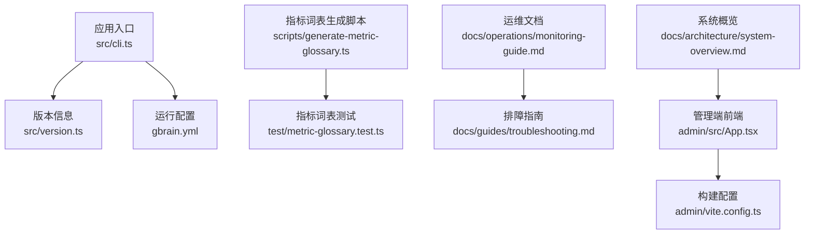
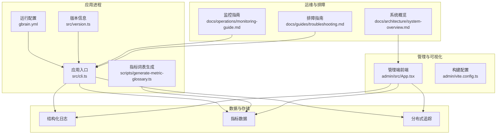
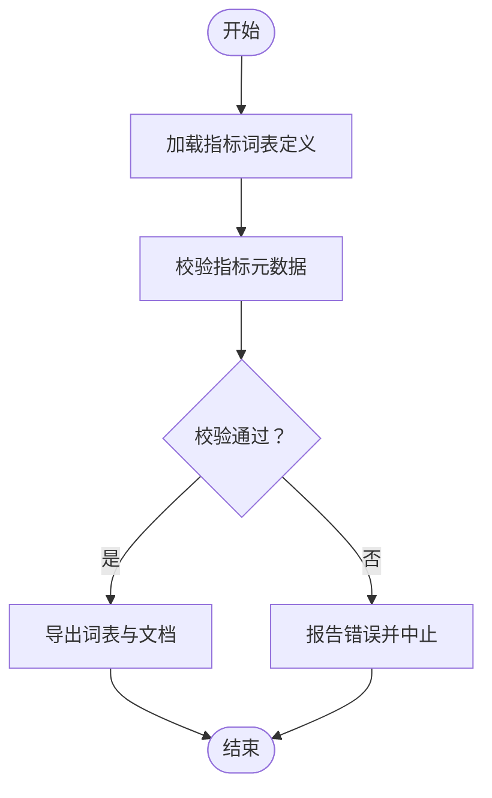
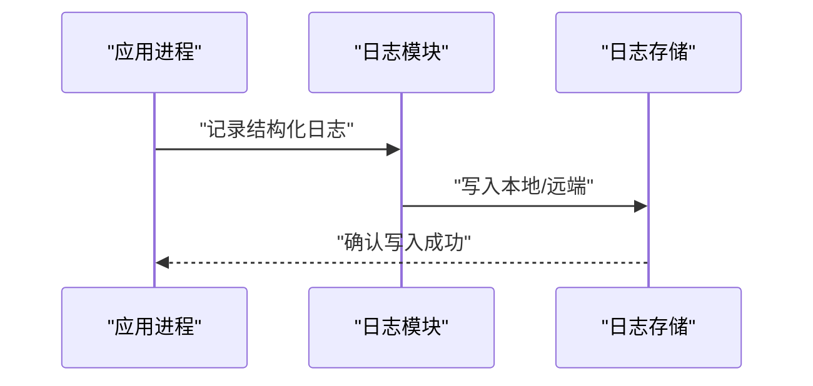
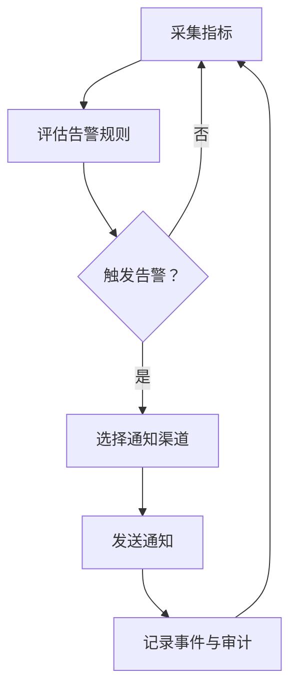
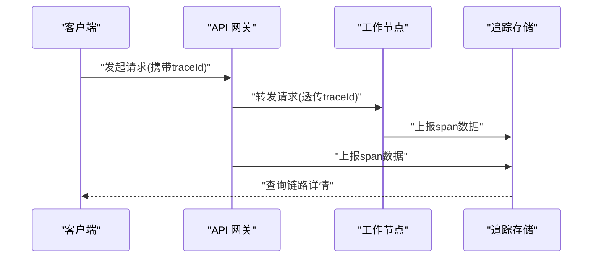
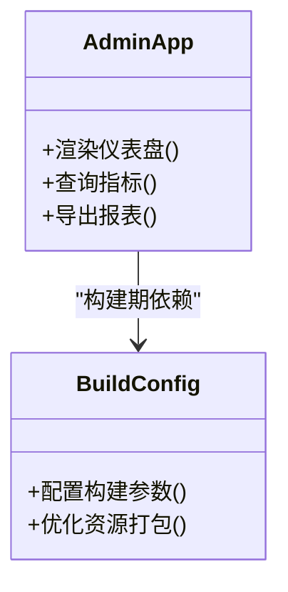
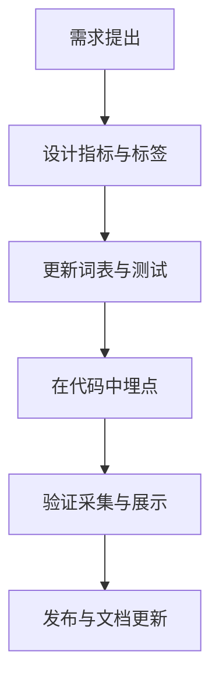
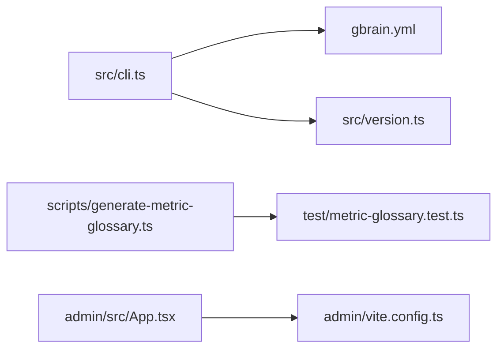

# 监控与日志

<cite>
**本文引用的文件**   
- [README.md](file://README.md)
- [gbrain.yml](file://gbrain.yml)
- [src/cli.ts](file://src/cli.ts)
- [src/version.ts](file://src/version.ts)
- [scripts/generate-metric-glossary.ts](file://scripts/generate-metric-glossary.ts)
- [test/metric-glossary.test.ts](file://test/metric-glossary.test.ts)
- [docs/operations/monitoring-guide.md](file://docs/operations/monitoring-guide.md)
- [docs/architecture/system-overview.md](file://docs/architecture/system-overview.md)
- [docs/guides/troubleshooting.md](file://docs/guides/troubleshooting.md)
- [admin/src/App.tsx](file://admin/src/App.tsx)
- [admin/vite.config.ts](file://admin/vite.config.ts)
</cite>

## 目录
1. [简介](#简介)
2. [项目结构](#项目结构)
3. [核心组件](#核心组件)
4. [架构总览](#架构总览)
5. [详细组件分析](#详细组件分析)
6. [依赖关系分析](#依赖关系分析)
7. [性能考量](#性能考量)
8. [故障排查指南](#故障排查指南)
9. [结论](#结论)
10. [附录](#附录)

## 简介
本指南面向运维、研发与平台工程团队，系统化阐述 gBrain 的监控与日志体系：指标采集与展示、结构化日志配置与集中化、告警规则与通知渠道、分布式追踪与链路分析、可视化与报表生成，以及扩展开发与自定义指标接入。文档以仓库现有实现为依据，结合操作手册与测试用例，提供从入门到进阶的完整路径。

## 项目结构
与监控与日志相关的代码与文档主要分布在以下位置：
- 应用入口与版本信息：src/cli.ts、src/version.ts
- 指标词表生成脚本与对应测试：scripts/generate-metric-glossary.ts、test/metric-glossary.test.ts
- 运行期配置：gbrain.yml
- 运维与排障文档：docs/operations/monitoring-guide.md、docs/guides/troubleshooting.md
- 管理端前端（用于可视化）：admin/src/App.tsx、admin/vite.config.ts
- 系统概览文档：docs/architecture/system-overview.md
- 项目说明：README.md

图表来源
- [src/cli.ts](file://src/cli.ts)
- [src/version.ts](file://src/version.ts)
- [gbrain.yml](file://gbrain.yml)
- [scripts/generate-metric-glossary.ts](file://scripts/generate-metric-glossary.ts)
- [test/metric-glossary.test.ts](file://test/metric-glossary.test.ts)
- [docs/operations/monitoring-guide.md](file://docs/operations/monitoring-guide.md)
- [docs/guides/troubleshooting.md](file://docs/guides/troubleshooting.md)
- [docs/architecture/system-overview.md](file://docs/architecture/system-overview.md)
- [admin/src/App.tsx](file://admin/src/App.tsx)
- [admin/vite.config.ts](file://admin/vite.config.ts)

章节来源
- [README.md](file://README.md)
- [gbrain.yml](file://gbrain.yml)
- [src/cli.ts](file://src/cli.ts)
- [src/version.ts](file://src/version.ts)
- [scripts/generate-metric-glossary.ts](file://scripts/generate-metric-glossary.ts)
- [test/metric-glossary.test.ts](file://test/metric-glossary.test.ts)
- [docs/operations/monitoring-guide.md](file://docs/operations/monitoring-guide.md)
- [docs/architecture/system-overview.md](file://docs/architecture/system-overview.md)
- [docs/guides/troubleshooting.md](file://docs/guides/troubleshooting.md)
- [admin/src/App.tsx](file://admin/src/App.tsx)
- [admin/vite.config.ts](file://admin/vite.config.ts)

## 核心组件
- 指标词表与生成工具
  - 通过脚本集中维护指标命名与元数据，并配套测试保障一致性。
  - 参考路径：[scripts/generate-metric-glossary.ts](file://scripts/generate-metric-glossary.ts)、[test/metric-glossary.test.ts](file://test/metric-glossary.test.ts)
- 运行期配置
  - 使用统一配置文件驱动运行时行为，包括监控相关开关与输出目标。
  - 参考路径：[gbrain.yml](file://gbrain.yml)
- 应用入口与版本
  - 入口负责初始化子系统，版本信息可用于指标标签或日志上下文。
  - 参考路径：[src/cli.ts](file://src/cli.ts)、[src/version.ts](file://src/version.ts)
- 运维与排障文档
  - 提供监控实践、日志规范与常见问题定位方法。
  - 参考路径：[docs/operations/monitoring-guide.md](file://docs/operations/monitoring-guide.md)、[docs/guides/troubleshooting.md](file://docs/guides/troubleshooting.md)
- 管理端可视化
  - 前端应用承载仪表盘与报表能力。
  - 参考路径：[admin/src/App.tsx](file://admin/src/App.tsx)、[admin/vite.config.ts](file://admin/vite.config.ts)

章节来源
- [scripts/generate-metric-glossary.ts](file://scripts/generate-metric-glossary.ts)
- [test/metric-glossary.test.ts](file://test/metric-glossary.test.ts)
- [gbrain.yml](file://gbrain.yml)
- [src/cli.ts](file://src/cli.ts)
- [src/version.ts](file://src/version.ts)
- [docs/operations/monitoring-guide.md](file://docs/operations/monitoring-guide.md)
- [docs/guides/troubleshooting.md](file://docs/guides/troubleshooting.md)
- [admin/src/App.tsx](file://admin/src/App.tsx)
- [admin/vite.config.ts](file://admin/vite.config.ts)

## 架构总览
下图展示了监控与日志在系统中的关键交互：应用进程采集指标与日志，写入本地或远端存储；管理端读取数据并提供可视化；运维文档指导告警与排障流程。

图表来源
- [src/cli.ts](file://src/cli.ts)
- [src/version.ts](file://src/version.ts)
- [gbrain.yml](file://gbrain.yml)
- [scripts/generate-metric-glossary.ts](file://scripts/generate-metric-glossary.ts)
- [admin/src/App.tsx](file://admin/src/App.tsx)
- [admin/vite.config.ts](file://admin/vite.config.ts)
- [docs/operations/monitoring-guide.md](file://docs/operations/monitoring-guide.md)
- [docs/guides/troubleshooting.md](file://docs/guides/troubleshooting.md)
- [docs/architecture/system-overview.md](file://docs/architecture/system-overview.md)

## 详细组件分析

### 指标采集与词表治理
- 指标词表集中定义，确保命名一致性与可发现性。
- 生成脚本负责校验与导出词表，测试覆盖保证变更安全。
- 建议将业务与系统指标分层管理，按域划分标签维度。

图表来源
- [scripts/generate-metric-glossary.ts](file://scripts/generate-metric-glossary.ts)
- [test/metric-glossary.test.ts](file://test/metric-glossary.test.ts)

章节来源
- [scripts/generate-metric-glossary.ts](file://scripts/generate-metric-glossary.ts)
- [test/metric-glossary.test.ts](file://test/metric-glossary.test.ts)

### 结构化日志配置与轮转
- 日志格式采用结构化键值对，便于检索与聚合。
- 通过运行配置控制输出目标、级别与采样策略。
- 建议启用日志轮转与压缩，避免磁盘占用增长。

图表来源
- [gbrain.yml](file://gbrain.yml)

章节来源
- [gbrain.yml](file://gbrain.yml)

### 告警规则与通知渠道
- 基于指标阈值与复合条件定义告警规则。
- 支持多渠道通知（如邮件、IM、Webhook），并具备抑制与升级策略。
- 建议将告警与排障指南联动，形成闭环。

图表来源
- [docs/operations/monitoring-guide.md](file://docs/operations/monitoring-guide.md)

章节来源
- [docs/operations/monitoring-guide.md](file://docs/operations/monitoring-guide.md)

### 分布式追踪与链路分析
- 为关键请求注入追踪上下文，跨服务传递 traceId/spanId。
- 汇聚后支持端到端耗时、错误率与热点调用链分析。
- 建议与日志关联，提升问题定位效率。

图表来源
- [docs/architecture/system-overview.md](file://docs/architecture/system-overview.md)

章节来源
- [docs/architecture/system-overview.md](file://docs/architecture/system-overview.md)

### 可视化展示与报表生成
- 管理端提供仪表盘、趋势图与报表导出能力。
- 通过构建配置优化资源打包与部署体验。
- 建议按角色定制视图，区分开发、运维与管理视角。

图表来源
- [admin/src/App.tsx](file://admin/src/App.tsx)
- [admin/vite.config.ts](file://admin/vite.config.ts)

章节来源
- [admin/src/App.tsx](file://admin/src/App.tsx)
- [admin/vite.config.ts](file://admin/vite.config.ts)

### 扩展开发与自定义指标接入
- 遵循指标词表规范，新增指标需同步更新词表与测试。
- 在关键路径埋点，确保标签维度完整且稳定。
- 建议提供示例与自检脚本，降低接入成本。

图表来源
- [scripts/generate-metric-glossary.ts](file://scripts/generate-metric-glossary.ts)
- [test/metric-glossary.test.ts](file://test/metric-glossary.test.ts)

章节来源
- [scripts/generate-metric-glossary.ts](file://scripts/generate-metric-glossary.ts)
- [test/metric-glossary.test.ts](file://test/metric-glossary.test.ts)

## 依赖关系分析
- 入口与配置
  - 应用入口依赖运行配置与版本信息，初始化监控与日志子系统。
- 指标词表与测试
  - 生成脚本与测试相互依赖，保障指标定义的稳定性。
- 管理端与构建
  - 前端应用依赖构建配置进行打包与优化。

图表来源
- [src/cli.ts](file://src/cli.ts)
- [gbrain.yml](file://gbrain.yml)
- [src/version.ts](file://src/version.ts)
- [scripts/generate-metric-glossary.ts](file://scripts/generate-metric-glossary.ts)
- [test/metric-glossary.test.ts](file://test/metric-glossary.test.ts)
- [admin/src/App.tsx](file://admin/src/App.tsx)
- [admin/vite.config.ts](file://admin/vite.config.ts)

章节来源
- [src/cli.ts](file://src/cli.ts)
- [gbrain.yml](file://gbrain.yml)
- [src/version.ts](file://src/version.ts)
- [scripts/generate-metric-glossary.ts](file://scripts/generate-metric-glossary.ts)
- [test/metric-glossary.test.ts](file://test/metric-glossary.test.ts)
- [admin/src/App.tsx](file://admin/src/App.tsx)
- [admin/vite.config.ts](file://admin/vite.config.ts)

## 性能考量
- 指标采集
  - 控制采样频率与标签基数，避免高基数字段导致存储膨胀。
  - 批量上报与合并计算，减少网络与序列化开销。
- 日志写入
  - 异步落盘与批处理，合理设置缓冲大小与刷新间隔。
  - 启用压缩与分级保留策略，平衡检索性能与成本。
- 追踪开销
  - 限制采样比例与 span 数量，仅对关键路径全量采集。
  - 避免在高频路径注入过多上下文字段。

## 故障排查指南
- 快速定位
  - 依据排障指南中的检查清单，逐步缩小范围。
  - 结合日志关键字与追踪 ID 进行跨层关联。
- 常见症状
  - 指标缺失：检查词表与埋点是否生效。
  - 日志丢失：检查轮转与存储连通性。
  - 告警风暴：调整抑制与去重策略。
- 自愈机制
  - 自动重试与熔断降级，防止级联故障。
  - 健康检查与自恢复任务，缩短恢复时间。

章节来源
- [docs/guides/troubleshooting.md](file://docs/guides/troubleshooting.md)

## 结论
通过统一的指标词表、结构化日志、完善的告警与追踪体系，以及可视化的管理端，gBrain 构建了可观测性的闭环。建议在持续演进中保持指标与文档的一致性，强化自动化与自愈能力，提升整体稳定性与可维护性。

## 附录
- 术语与约定
  - 指标命名：按域-子域-度量类型组织，标签维度最小必要原则。
  - 日志级别：DEBUG/INFO/WARN/ERROR，生产环境默认 INFO。
  - 追踪采样：关键路径 100%，普通路径按比例采样。
- 参考路径
  - 指标词表与测试：[scripts/generate-metric-glossary.ts](file://scripts/generate-metric-glossary.ts)、[test/metric-glossary.test.ts](file://test/metric-glossary.test.ts)
  - 运行配置：[gbrain.yml](file://gbrain.yml)
  - 入口与版本：[src/cli.ts](file://src/cli.ts)、[src/version.ts](file://src/version.ts)
  - 运维与排障：[docs/operations/monitoring-guide.md](file://docs/operations/monitoring-guide.md)、[docs/guides/troubleshooting.md](file://docs/guides/troubleshooting.md)
  - 系统概览：[docs/architecture/system-overview.md](file://docs/architecture/system-overview.md)
  - 管理端：[admin/src/App.tsx](file://admin/src/App.tsx)、[admin/vite.config.ts](file://admin/vite.config.ts)
  - 项目说明：[README.md](file://README.md)