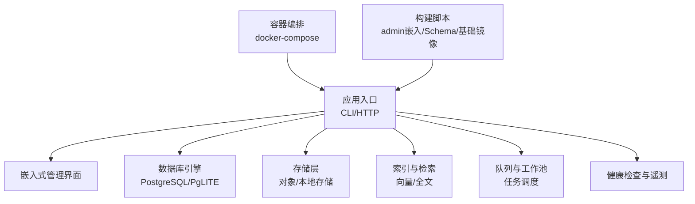
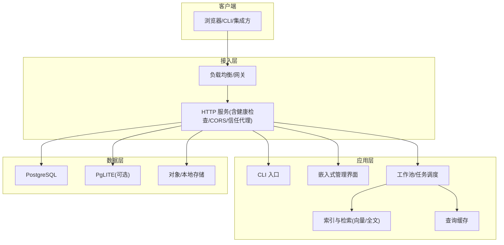
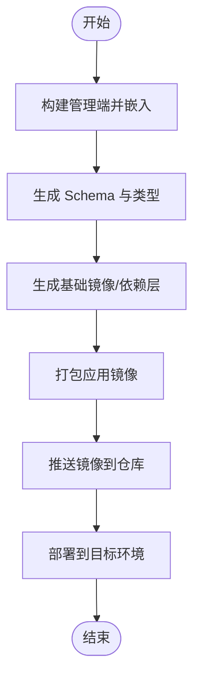
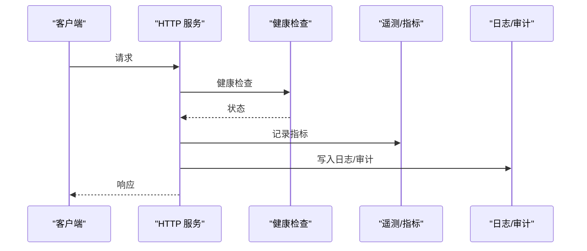
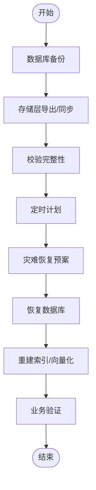
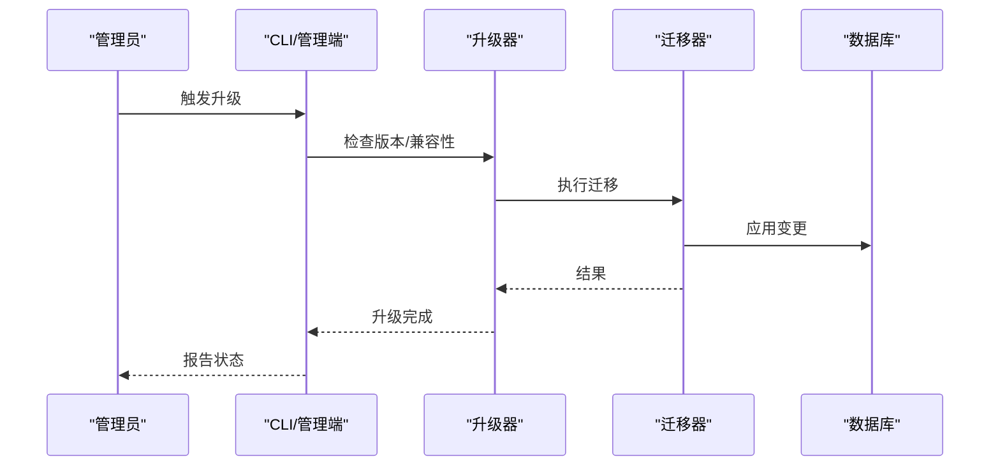
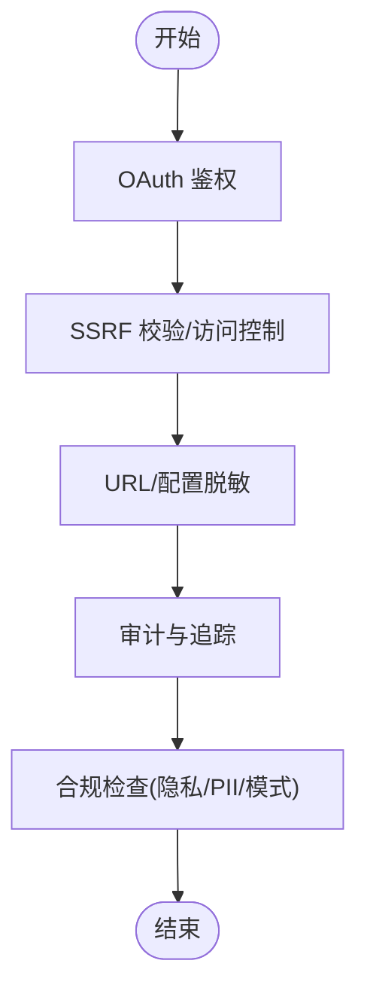
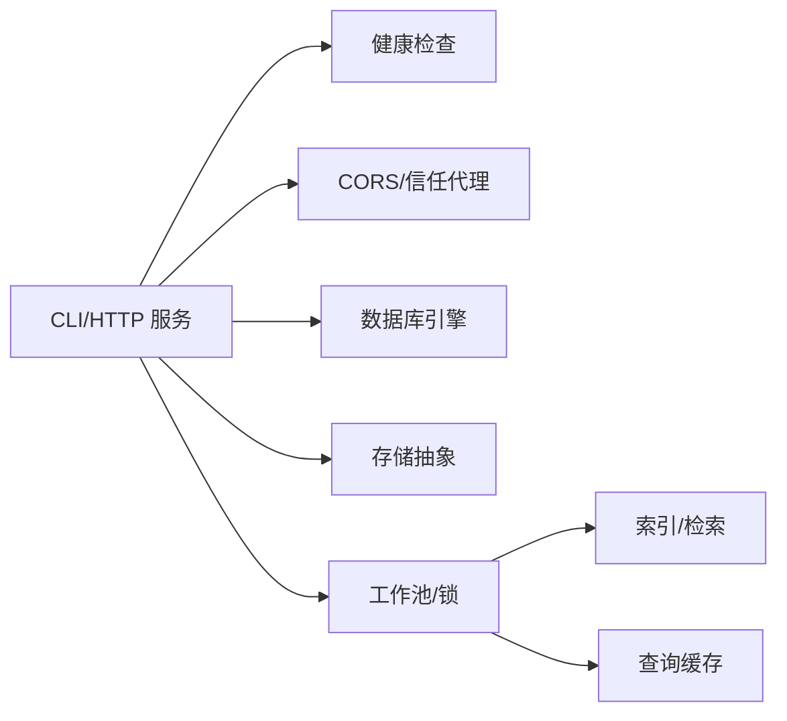
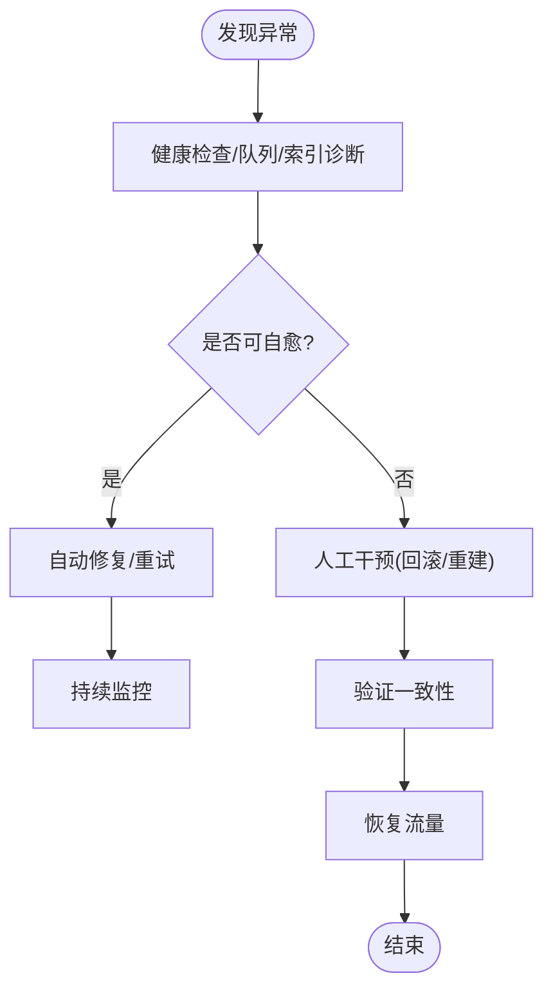

# 部署与运维

<cite>
**本文引用的文件**   
- [README.md](file://README.md)
- [INSTALL.md](file://docs/INSTALL.md)
- [docker-compose.ci.yml](file://docker-compose.ci.yml)
- [docker-compose.test.yml](file://docker-compose.test.yml)
- [gbrain.yml](file://gbrain.yml)
- [package.json](file://package.json)
- [tsconfig.json](file://tsconfig.json)
- [bunfig.toml](file://bunfig.toml)
- [src/cli.ts](file://src/cli.ts)
- [src/admin-embedded.ts](file://src/admin-embedded.ts)
- [scripts/build-admin-embedded.ts](file://scripts/build-admin-embedded.ts)
- [scripts/smoke-test.sh](file://scripts/smoke-test.sh)
- [scripts/run-e2e.sh](file://scripts/run-e2e.sh)
- [scripts/ci-local.sh](file://scripts/ci-local.sh)
- [scripts/check-image-decoders-embedded.sh](file://scripts/check-image-decoders-embedded.sh)
- [scripts/generate-gbrain-base.ts](file://scripts/generate-gbrain-base.ts)
- [scripts/build-schema.sh](file://scripts/build-schema.sh)
- [scripts/import-from-upstream.sh](file://scripts/import-from-upstream.sh)
- [scripts/ship-remote-tests.sh](file://scripts/ship-remote-tests.sh)
- [scripts/profile-tests.sh](file://scripts/profile-tests.sh)
- [scripts/run-heavy.sh](file://scripts/run-heavy.sh)
- [scripts/test-shard.sh](file://scripts/test-shard.sh)
- [scripts/e2e-test-map.ts](file://scripts/e2e-test-map.ts)
- [scripts/select-e2e.ts](file://scripts/select-e2e.ts)
- [scripts/migrate-extensions.test.ts](file://test/migrate-extensions.test.ts)
- [test/apply-migrations-pglite-spawn.serial.test.ts](file://test/apply-migrations-pglite-spawn.serial.test.ts)
- [test/postgres-engine.test.ts](file://test/postgres-engine.test.ts)
- [test/pglite-engine.test.ts](file://test/pglite-engine.test.ts)
- [test/storage-config.test.ts](file://test/storage-config.test.ts)
- [test/storage-status.test.ts](file://test/storage-status.test.ts)
- [test/storage-export.test.ts](file://test/storage-export.test.ts)
- [test/storage-sync.test.ts](file://test/storage-sync.test.ts)
- [test/supervisor.test.ts](file://test/supervisor.test.ts)
- [test/process-watchdog.test.ts](file://test/process-watchdog.test.ts)
- [test/serve-http-health.test.ts](file://test/serve-http-health.test.ts)
- [test/serve-http-cors.test.ts](file://test/serve-http-cors.test.ts)
- [test/serve-http-trust-proxy.test.ts](file://test/serve-http-trust-proxy.test.ts)
- [test/serve-http-bootstrap-token.test.ts](file://test/serve-http-bootstrap-token.test.ts)
- [test/worker-supervised-db-probe.test.ts](file://test/worker-supervised-db-probe.test.ts)
- [test/db-lock-reap.test.ts](file://test/db-lock-reap.test.ts)
- [test/db-lock-refresh.test.ts](file://test/db-lock-refresh.test.ts)
- [test/db-lock-inspect.test.ts](file://test/db-lock-inspect.test.ts)
- [test/doctor-cli-smoke.serial.test.ts](file://test/doctor-cli-smoke.serial.test.ts)
- [test/doctor-self-upgrade.test.ts](file://test/doctor-self-upgrade.test.ts)
- [test/self-upgrade-checkonly.serial.test.ts](file://test/self-upgrade-checkonly.serial.test.ts)
- [test/self-upgrade.test.ts](file://test/self-upgrade.test.ts)
- [test/binary-self-update.test.ts](file://test/binary-self-update.test.ts)
- [test/upgrade-checkpoint.serial.test.ts](file://test/upgrade-checkpoint.serial.test.ts)
- [test/upgrade.serial.test.ts](file://test/upgrade.serial.test.ts)
- [test/reindex.test.ts](file://test/reindex.test.ts)
- [test/reindex-code.test.ts](file://test/reindex-code.test.ts)
- [test/embed-backfill-submit.test.ts](file://test/embed-backfill-submit.test.ts)
- [test/embedding-dim-check.test.ts](file://test/embedding-dim-check.test.ts)
- [test/embedding-dim-check-facts.test.ts](file://test/embedding-dim-check-facts.test.ts)
- [test/vector-index-lifecycle.test.ts](file://test/vector-index-lifecycle.test.ts)
- [test/query-cache.test.ts](file://test/query-cache.test.ts)
- [test/query-cache-knobs-hash.serial.test.ts](file://test/query-cache-knobs-hash.serial.test.ts)
- [test/search.test.ts](file://test/search.test.ts)
- [test/search-telemetry.test.ts](file://test/search-telemetry.test.ts)
- [test/queue-getstats-wedge.test.ts](file://test/queue-getstats-wedge.test.ts)
- [test/lease-cap-controller.test.ts](file://test/lease-cap-controller.test.ts)
- [test/rate-leases.test.ts](file://test/rate-leases.test.ts)
- [test/rate-leases-uncapped.test.ts](file://test/rate-leases-uncapped.test.ts)
- [test/worker-rss.test.ts](file://test/worker-rss.test.ts)
- [test/worker-shutdown-disconnect.test.ts](file://test/worker-shutdown-disconnect.test.ts)
- [test/worker-lock-renewal.test.ts](file://test/worker-lock-renewal.test.ts)
- [test/worker-lock-renewal-shape.test.ts](file://test/worker-lock-renewal-shape.test.ts)
- [test/worker-lock-renewal-e2e.serial.test.ts](file://test/worker-lock-renewal-e2e.serial.test.ts)
- [test/worker-pool.test.ts](file://test/worker-pool.test.ts)
- [test/worker-registry.serial.test.ts](file://test/worker-registry.serial.test.ts)
- [test/worker-watchdog-trigger.test.ts](file://test/worker-watchdog-trigger.test.ts)
- [test/worker-supervised-db-probe.test.ts](file://test/worker-supervised-db-probe.test.ts)
- [test/telemetry.test.ts](file://test/telemetry.test.ts)
- [test/audit-slug-fallback.serial.test.ts](file://test/audit-slug-fallback.serial.test.ts)
- [test/audit-synopsis.serial.test.ts](file://test/audit-synopsis.serial.test.ts)
- [test/audit.test.ts](file://test/audit.test.ts)
- [test/oauth.test.ts](file://test/oauth.test.ts)
- [test/oauth-authorize-scope-probe.test.ts](file://test/oauth-authorize-scope-probe.test.ts)
- [test/oauth-confidential-client.test.ts](file://test/oauth-confidential-client.test.ts)
- [test/ssrf-validate.test.ts](file://test/ssrf-validate.test.ts)
- [test/file-upload-security.test.ts](file://test/file-upload-security.test.ts)
- [test/url-redact.test.ts](file://test/url-redact.test.ts)
- [test/source-config-redact.test.ts](file://test/source-config-redact.test.ts)
- [test/check-pg-url-redaction.sh](file://scripts/check-pg-url-redaction.sh)
- [test/check-no-pii-in-agent-voice.sh](file://scripts/check-no-pii-in-agent-voice.sh)
- [test/check-privacy.sh](file://scripts/check-privacy.sh)
- [test/check-jsonb-pattern.sh](file://scripts/check-jsonb-pattern.sh)
- [test/check-key-files-current-state.sh](file://scripts/check-key-files-current-state.sh)
- [test/check-source-id-projection.sh](file://scripts/check-source-id-projection.sh)
- [test/check-system-of-record.sh](file://scripts/check-system-of-record.sh)
- [test/check-operations-filter-bypass.sh](file://scripts/check-operations-filter-bypass.sh)
- [test/check-trailing-newline.sh](file://scripts/check-trailing-newline.sh)
- [test/check-wasm-embedded.sh](file://scripts/check-wasm-embedded.sh)
- [test/check-worker-lock-renewal-shape.sh](file://scripts/check-worker-lock-renewal-shape.sh)
- [test/check-worker-pool-atomicity.sh](file://scripts/check-worker-pool-atomicity.sh)
- [test/check-no-double-retry.sh](file://scripts/check-no-double-retry.sh)
- [test/check-progress-to-stdout.sh](file://scripts/check-progress-to-stdout.sh)
- [test/check-gateway-routed-no-direct-anthropic.sh](file://scripts/check-gateway-routed-no-direct-anthropic.sh)
- [test/check-fixture-privacy.sh](file://scripts/check-fixture-privacy.sh)
- [test/check-exports-count.sh](file://scripts/check-exports-count.sh)
- [test/check-admin-build.sh](file://scripts/check-admin-build.sh)
- [test/check-admin-embedded.sh](file://scripts/check-admin-embedded.sh)
- [test/check-admin-scope-drift.sh](file://scripts/check-admin-scope-drift.sh)
- [test/check-batch-audit-site.sh](file://scripts/check-batch-audit-site.sh)
- [test/check-eval-glossary-fresh.sh](file://scripts/check-eval-glossary-fresh.sh)
- [test/check-image-decoders-embedded.sh](file://scripts/check-image-decoders-embedded.sh)
- [test/check-no-legacy-getconnection.sh](file://scripts/check-no-legacy-getconnection.sh)
- [test/check-pagetype-exhaustive.sh](file://scripts/check-pagetype-exhaustive.sh)
- [test/check-skill-brain-first.sh](file://scripts/check-skill-brain-first.sh)
- [test/check-source-scope-onboard.sh](file://scripts/check-source-scope-onboard.sh)
- [test/check-synthetic-corpus-privacy.sh](file://scripts/check-synthetic-corpus-privacy.sh)
- [test/check-test-isolation.allowlist](file://scripts/check-test-isolation.allowlist)
- [test/check-test-isolation.sh](file://scripts/check-test-isolation.sh)
- [test/check-test-real-names.sh](file://scripts/check-test-real-names.sh)
</cite>

## 目录
1. [简介](#简介)
2. [项目结构](#项目结构)
3. [核心组件](#核心组件)
4. [架构总览](#架构总览)
5. [详细组件分析](#详细组件分析)
6. [依赖分析](#依赖分析)
7. [性能考虑](#性能考虑)
8. [故障处理指南](#故障处理指南)
9. [结论](#结论)
10. [附录](#附录)

## 简介
本指南面向生产环境的部署与运维，覆盖单机、集群与云原生拓扑选择与配置；容器化打包、镜像优化与编排；监控日志与告警；备份恢复、数据迁移与灾难恢复；性能调优、容量规划与成本优化；安全加固、合规要求与审计跟踪。文档内容基于仓库中的安装说明、脚本、测试用例与配置文件进行归纳总结，确保可落地执行。

## 项目结构
仓库包含应用源码、管理前端、构建与测试脚本、示例与技能包、以及大量用于验证系统行为的测试用例。与部署运维直接相关的要点：
- 安装与运行入口：CLI 命令、嵌入式管理界面、HTTP 服务与健康检查
- 容器编排：CI 与测试用的 docker-compose 文件
- 构建与发布：管理端嵌入构建、Schema 生成、基础镜像生成等脚本
- 质量与安全：大量校验脚本与测试，覆盖隐私、URL 脱敏、WASM 嵌入、锁与并发、升级路径等

图表来源
- [src/cli.ts:1-200](file://src/cli.ts#L1-L200)
- [src/admin-embedded.ts:1-200](file://src/admin-embedded.ts#L1-L200)
- [docker-compose.ci.yml:1-200](file://docker-compose.ci.yml#L1-L200)
- [docker-compose.test.yml:1-200](file://docker-compose.test.yml#L1-L200)
- [scripts/build-admin-embedded.ts:1-200](file://scripts/build-admin-embedded.ts#L1-L200)
- [scripts/build-schema.sh:1-200](file://scripts/build-schema.sh#L1-L200)
- [scripts/generate-gbrain-base.ts:1-200](file://scripts/generate-gbrain-base.ts#L1-L200)

章节来源
- [README.md:1-200](file://README.md#L1-L200)
- [docs/INSTALL.md:1-200](file://docs/INSTALL.md#L1-L200)
- [docker-compose.ci.yml:1-200](file://docker-compose.ci.yml#L1-L200)
- [docker-compose.test.yml:1-200](file://docker-compose.test.yml#L1-L200)
- [gbrain.yml:1-200](file://gbrain.yml#L1-L200)
- [package.json:1-200](file://package.json#L1-L200)
- [tsconfig.json:1-200](file://tsconfig.json#L1-L200)
- [bunfig.toml:1-200](file://bunfig.toml#L1-L200)

## 核心组件
- CLI 与服务启动：提供命令行入口与 HTTP 服务引导，支持健康检查、CORS、信任代理、Bootstrap Token 等能力
- 嵌入式管理界面：通过构建脚本将管理前端嵌入到应用中，减少外部依赖
- 数据库与存储：支持 PostgreSQL 与 PgLITE 两种引擎；存储抽象支持多种后端
- 索引与检索：向量索引生命周期、重索引、查询缓存、搜索遥测
- 工作池与进程守护：Worker 注册、锁续期、RSS 监控、优雅关闭
- 升级与迁移：自升级、二进制更新、迁移扩展、版本升级检查点
- 安全与合规：OAuth、SSRF 校验、URL 与敏感信息脱敏、隐私检查

章节来源
- [src/cli.ts:1-200](file://src/cli.ts#L1-L200)
- [src/admin-embedded.ts:1-200](file://src/admin-embedded.ts#L1-L200)
- [test/serve-http-health.test.ts:1-200](file://test/serve-http-health.test.ts#L1-L200)
- [test/serve-http-cors.test.ts:1-200](file://test/serve-http-cors.test.ts#L1-L200)
- [test/serve-http-trust-proxy.test.ts:1-200](file://test/serve-http-trust-proxy.test.ts#L1-L200)
- [test/serve-http-bootstrap-token.test.ts:1-200](file://test/serve-http-bootstrap-token.test.ts#L1-L200)
- [test/postgres-engine.test.ts:1-200](file://test/postgres-engine.test.ts#L1-L200)
- [test/pglite-engine.test.ts:1-200](file://test/pglite-engine.test.ts#L1-L200)
- [test/storage-config.test.ts:1-200](file://test/storage-config.test.ts#L1-L200)
- [test/storage-status.test.ts:1-200](file://test/storage-status.test.ts#L1-L200)
- [test/storage-export.test.ts:1-200](file://test/storage-export.test.ts#L1-L200)
- [test/storage-sync.test.ts:1-200](file://test/storage-sync.test.ts#L1-L200)
- [test/vector-index-lifecycle.test.ts:1-200](file://test/vector-index-lifecycle.test.ts#L1-L200)
- [test/reindex.test.ts:1-200](file://test/reindex.test.ts#L1-L200)
- [test/reindex-code.test.ts:1-200](file://test/reindex-code.test.ts#L1-L200)
- [test/query-cache.test.ts:1-200](file://test/query-cache.test.ts#L1-L200)
- [test/search-telemetry.test.ts:1-200](file://test/search-telemetry.test.ts#L1-L200)
- [test/worker-pool.test.ts:1-200](file://test/worker-pool.test.ts#L1-L200)
- [test/worker-lock-renewal.test.ts:1-200](file://test/worker-lock-renewal.test.ts#L1-L200)
- [test/worker-rss.test.ts:1-200](file://test/worker-rss.test.ts#L1-L200)
- [test/worker-shutdown-disconnect.test.ts:1-200](file://test/worker-shutdown-disconnect.test.ts#L1-L200)
- [test/self-upgrade.test.ts:1-200](file://test/self-upgrade.test.ts#L1-L200)
- [test/binary-self-update.test.ts:1-200](file://test/binary-self-update.test.ts#L1-L200)
- [test/oauth.test.ts:1-200](file://test/oauth.test.ts#L1-L200)
- [test/ssrf-validate.test.ts:1-200](file://test/ssrf-validate.test.ts#L1-L200)
- [test/url-redact.test.ts:1-200](file://test/url-redact.test.ts#L1-L200)
- [test/source-config-redact.test.ts:1-200](file://test/source-config-redact.test.ts#L1-L200)

## 架构总览
下图展示生产环境常见拓扑：单节点（开发/小规模）、多副本集群（水平扩展）、云原生（Kubernetes）。所有拓扑共享同一套应用组件与数据/索引/存储抽象。

图表来源
- [src/cli.ts:1-200](file://src/cli.ts#L1-L200)
- [src/admin-embedded.ts:1-200](file://src/admin-embedded.ts#L1-L200)
- [test/serve-http-health.test.ts:1-200](file://test/serve-http-health.test.ts#L1-L200)
- [test/serve-http-cors.test.ts:1-200](file://test/serve-http-cors.test.ts#L1-L200)
- [test/serve-http-trust-proxy.test.ts:1-200](file://test/serve-http-trust-proxy.test.ts#L1-L200)
- [test/postgres-engine.test.ts:1-200](file://test/postgres-engine.test.ts#L1-L200)
- [test/pglite-engine.test.ts:1-200](file://test/pglite-engine.test.ts#L1-L200)
- [test/storage-config.test.ts:1-200](file://test/storage-config.test.ts#L1-L200)
- [test/vector-index-lifecycle.test.ts:1-200](file://test/vector-index-lifecycle.test.ts#L1-L200)
- [test/query-cache.test.ts:1-200](file://test/query-cache.test.ts#L1-L200)

## 详细组件分析

### 部署拓扑与配置
- 单机部署
  - 适用场景：开发、小团队或低负载生产
  - 关键要点：使用内置 SQLite/PgLITE 或本地 PostgreSQL；启用健康检查与基本日志
  - 参考：安装说明、CLI 启动、健康检查测试
- 集群部署
  - 适用场景：高可用、水平扩展
  - 关键要点：多副本无状态服务 + 外部共享数据库；引入负载均衡；关注 Worker 锁续期与租约上限
  - 参考：HTTP 服务特性、Worker 锁续期、租约控制、队列统计
- 云原生部署
  - 适用场景：Kubernetes 平台
  - 关键要点：容器镜像、探针、资源限制、滚动升级、配置外置（ConfigMap/Secret）
  - 参考：docker-compose 模板、构建脚本、升级与迁移测试

章节来源
- [docs/INSTALL.md:1-200](file://docs/INSTALL.md#L1-L200)
- [test/serve-http-health.test.ts:1-200](file://test/serve-http-health.test.ts#L1-L200)
- [test/worker-lock-renewal.test.ts:1-200](file://test/worker-lock-renewal.test.ts#L1-L200)
- [test/lease-cap-controller.test.ts:1-200](file://test/lease-cap-controller.test.ts#L1-L200)
- [test/queue-getstats-wedge.test.ts:1-200](file://test/queue-getstats-wedge.test.ts#L1-L200)
- [docker-compose.ci.yml:1-200](file://docker-compose.ci.yml#L1-L200)
- [docker-compose.test.yml:1-200](file://docker-compose.test.yml#L1-L200)

### 容器化与镜像优化
- 容器编排
  - CI 与测试环境使用 docker-compose 定义服务组合，便于本地复现与回归
- 镜像构建
  - 管理端嵌入构建脚本将前端产物内嵌至应用，减少运行时依赖
  - Schema 生成与基础镜像生成脚本用于标准化构建流程
- 优化建议
  - 分层缓存：先安装依赖再拷贝源码
  - 多阶段构建：分离构建与运行镜像
  - 最小化运行时：仅保留必要二进制与库

图表来源
- [scripts/build-admin-embedded.ts:1-200](file://scripts/build-admin-embedded.ts#L1-L200)
- [scripts/build-schema.sh:1-200](file://scripts/build-schema.sh#L1-L200)
- [scripts/generate-gbrain-base.ts:1-200](file://scripts/generate-gbrain-base.ts#L1-L200)
- [docker-compose.ci.yml:1-200](file://docker-compose.ci.yml#L1-L200)
- [docker-compose.test.yml:1-200](file://docker-compose.test.yml#L1-L200)

章节来源
- [scripts/build-admin-embedded.ts:1-200](file://scripts/build-admin-embedded.ts#L1-L200)
- [scripts/build-schema.sh:1-200](file://scripts/build-schema.sh#L1-L200)
- [scripts/generate-gbrain-base.ts:1-200](file://scripts/generate-gbrain-base.ts#L1-L200)
- [docker-compose.ci.yml:1-200](file://docker-compose.ci.yml#L1-L200)
- [docker-compose.test.yml:1-200](file://docker-compose.test.yml#L1-L200)

### 监控、日志与告警
- 指标与遥测
  - 搜索遥测、队列统计、Worker RSS 监控、锁续期与心跳
- 健康检查
  - HTTP 健康检查端点，结合负载均衡器进行存活探测
- 日志与审计
  - 审计事件（slug 回退、摘要）、隐私与脱敏检查
- 告警建议
  - 基于健康检查失败、队列积压、锁续期异常、RSS 增长过快触发告警

图表来源
- [test/serve-http-health.test.ts:1-200](file://test/serve-http-health.test.ts#L1-L200)
- [test/search-telemetry.test.ts:1-200](file://test/search-telemetry.test.ts#L1-L200)
- [test/queue-getstats-wedge.test.ts:1-200](file://test/queue-getstats-wedge.test.ts#L1-L200)
- [test/worker-rss.test.ts:1-200](file://test/worker-rss.test.ts#L1-L200)
- [test/audit-slug-fallback.serial.test.ts:1-200](file://test/audit-slug-fallback.serial.test.ts#L1-L200)
- [test/audit-synopsis.serial.test.ts:1-200](file://test/audit-synopsis.serial.test.ts#L1-L200)

章节来源
- [test/serve-http-health.test.ts:1-200](file://test/serve-http-health.test.ts#L1-L200)
- [test/search-telemetry.test.ts:1-200](file://test/search-telemetry.test.ts#L1-L200)
- [test/queue-getstats-wedge.test.ts:1-200](file://test/queue-getstats-wedge.test.ts#L1-L200)
- [test/worker-rss.test.ts:1-200](file://test/worker-rss.test.ts#L1-L200)
- [test/audit-slug-fallback.serial.test.ts:1-200](file://test/audit-slug-fallback.serial.test.ts#L1-L200)
- [test/audit-synopsis.serial.test.ts:1-200](file://test/audit-synopsis.serial.test.ts#L1-L200)

### 备份、恢复与灾难恢复
- 备份策略
  - 数据库快照（PostgreSQL 逻辑/物理备份）
  - 对象存储与本地存储的定期导出与同步
- 恢复演练
  - 从快照恢复数据库、重建索引、校验一致性
- 灾难恢复
  - 多区域复制、跨地域容灾、RTO/RPO 目标设定

图表来源
- [test/storage-export.test.ts:1-200](file://test/storage-export.test.ts#L1-L200)
- [test/storage-sync.test.ts:1-200](file://test/storage-sync.test.ts#L1-L200)
- [test/reindex.test.ts:1-200](file://test/reindex.test.ts#L1-L200)
- [test/reindex-code.test.ts:1-200](file://test/reindex-code.test.ts#L1-L200)
- [test/vector-index-lifecycle.test.ts:1-200](file://test/vector-index-lifecycle.test.ts#L1-L200)

章节来源
- [test/storage-export.test.ts:1-200](file://test/storage-export.test.ts#L1-L200)
- [test/storage-sync.test.ts:1-200](file://test/storage-sync.test.ts#L1-L200)
- [test/reindex.test.ts:1-200](file://test/reindex.test.ts#L1-L200)
- [test/reindex-code.test.ts:1-200](file://test/reindex-code.test.ts#L1-L200)
- [test/vector-index-lifecycle.test.ts:1-200](file://test/vector-index-lifecycle.test.ts#L1-L200)

### 数据迁移与版本升级
- 迁移与扩展
  - 迁移扩展测试、PGlite 迁移流程、Schema 变更
- 自升级与二进制更新
  - 自升级检查、二进制更新、升级检查点、串行升级路径
- 最佳实践
  - 灰度发布、回滚策略、幂等迁移、增量索引重建

图表来源
- [test/migrate-extensions.test.ts:1-200](file://test/migrate-extensions.test.ts#L1-L200)
- [test/apply-migrations-pglite-spawn.serial.test.ts:1-200](file://test/apply-migrations-pglite-spawn.serial.test.ts#L1-L200)
- [test/self-upgrade.test.ts:1-200](file://test/self-upgrade.test.ts#L1-L200)
- [test/binary-self-update.test.ts:1-200](file://test/binary-self-update.test.ts#L1-L200)
- [test/upgrade-checkpoint.serial.test.ts:1-200](file://test/upgrade-checkpoint.serial.test.ts#L1-L200)
- [test/upgrade.serial.test.ts:1-200](file://test/upgrade.serial.test.ts#L1-L200)

章节来源
- [test/migrate-extensions.test.ts:1-200](file://test/migrate-extensions.test.ts#L1-L200)
- [test/apply-migrations-pglite-spawn.serial.test.ts:1-200](file://test/apply-migrations-pglite-spawn.serial.test.ts#L1-L200)
- [test/self-upgrade.test.ts:1-200](file://test/self-upgrade.test.ts#L1-L200)
- [test/binary-self-update.test.ts:1-200](file://test/binary-self-update.test.ts#L1-L200)
- [test/upgrade-checkpoint.serial.test.ts:1-200](file://test/upgrade-checkpoint.serial.test.ts#L1-L200)
- [test/upgrade.serial.test.ts:1-200](file://test/upgrade.serial.test.ts#L1-L200)

### 安全加固与合规
- 认证与授权
  - OAuth 授权、范围探测、机密客户端
- 输入与访问控制
  - SSRF 校验、URL 与敏感信息脱敏、源配置脱敏
- 审计与追踪
  - 审计 slug 回退与摘要、操作过滤绕过检查
- 合规检查
  - 隐私检查、PII 扫描、JSONB 模式约束、WASM 嵌入校验

图表来源
- [test/oauth.test.ts:1-200](file://test/oauth.test.ts#L1-L200)
- [test/oauth-authorize-scope-probe.test.ts:1-200](file://test/oauth-authorize-scope-probe.test.ts#L1-L200)
- [test/oauth-confidential-client.test.ts:1-200](file://test/oauth-confidential-client.test.ts#L1-L200)
- [test/ssrf-validate.test.ts:1-200](file://test/ssrf-validate.test.ts#L1-L200)
- [test/url-redact.test.ts:1-200](file://test/url-redact.test.ts#L1-L200)
- [test/source-config-redact.test.ts:1-200](file://test/source-config-redact.test.ts#L1-L200)
- [test/audit-slug-fallback.serial.test.ts:1-200](file://test/audit-slug-fallback.serial.test.ts#L1-L200)
- [test/audit-synopsis.serial.test.ts:1-200](file://test/audit-synopsis.serial.test.ts#L1-L200)
- [test/check-privacy.sh:1-200](file://scripts/check-privacy.sh#L1-L200)
- [test/check-no-pii-in-agent-voice.sh:1-200](file://scripts/check-no-pii-in-agent-voice.sh#L1-L200)
- [test/check-jsonb-pattern.sh:1-200](file://scripts/check-jsonb-pattern.sh#L1-L200)
- [test/check-wasm-embedded.sh:1-200](file://scripts/check-wasm-embedded.sh#L1-L200)

章节来源
- [test/oauth.test.ts:1-200](file://test/oauth.test.ts#L1-L200)
- [test/oauth-authorize-scope-probe.test.ts:1-200](file://test/oauth-authorize-scope-probe.test.ts#L1-L200)
- [test/oauth-confidential-client.test.ts:1-200](file://test/oauth-confidential-client.test.ts#L1-L200)
- [test/ssrf-validate.test.ts:1-200](file://test/ssrf-validate.test.ts#L1-L200)
- [test/url-redact.test.ts:1-200](file://test/url-redact.test.ts#L1-L200)
- [test/source-config-redact.test.ts:1-200](file://test/source-config-redact.test.ts#L1-L200)
- [test/audit-slug-fallback.serial.test.ts:1-200](file://test/audit-slug-fallback.serial.test.ts#L1-L200)
- [test/audit-synopsis.serial.test.ts:1-200](file://test/audit-synopsis.serial.test.ts#L1-L200)
- [scripts/check-privacy.sh:1-200](file://scripts/check-privacy.sh#L1-L200)
- [scripts/check-no-pii-in-agent-voice.sh:1-200](file://scripts/check-no-pii-in-agent-voice.sh#L1-L200)
- [scripts/check-jsonb-pattern.sh:1-200](file://scripts/check-jsonb-pattern.sh#L1-L200)
- [scripts/check-wasm-embedded.sh:1-200](file://scripts/check-wasm-embedded.sh#L1-L200)

## 依赖分析
- 内部依赖
  - CLI 与服务启动依赖 HTTP 健康检查、CORS、信任代理、Bootstrap Token 等能力
  - 存储与数据库抽象被索引、检索、迁移与升级流程广泛使用
  - 工作池与锁机制支撑分布式任务与并发控制
- 外部依赖
  - 数据库（PostgreSQL/PgLITE）、对象存储、可能的第三方 LLM 网关（由路由与模型相关测试体现）

图表来源
- [src/cli.ts:1-200](file://src/cli.ts#L1-L200)
- [test/serve-http-health.test.ts:1-200](file://test/serve-http-health.test.ts#L1-L200)
- [test/serve-http-cors.test.ts:1-200](file://test/serve-http-cors.test.ts#L1-L200)
- [test/serve-http-trust-proxy.test.ts:1-200](file://test/serve-http-trust-proxy.test.ts#L1-L200)
- [test/postgres-engine.test.ts:1-200](file://test/postgres-engine.test.ts#L1-L200)
- [test/pglite-engine.test.ts:1-200](file://test/pglite-engine.test.ts#L1-L200)
- [test/storage-config.test.ts:1-200](file://test/storage-config.test.ts#L1-L200)
- [test/worker-pool.test.ts:1-200](file://test/worker-pool.test.ts#L1-L200)
- [test/query-cache.test.ts:1-200](file://test/query-cache.test.ts#L1-L200)

章节来源
- [src/cli.ts:1-200](file://src/cli.ts#L1-L200)
- [test/serve-http-health.test.ts:1-200](file://test/serve-http-health.test.ts#L1-L200)
- [test/serve-http-cors.test.ts:1-200](file://test/serve-http-cors.test.ts#L1-L200)
- [test/serve-http-trust-proxy.test.ts:1-200](file://test/serve-http-trust-proxy.test.ts#L1-L200)
- [test/postgres-engine.test.ts:1-200](file://test/postgres-engine.test.ts#L1-L200)
- [test/pglite-engine.test.ts:1-200](file://test/pglite-engine.test.ts#L1-L200)
- [test/storage-config.test.ts:1-200](file://test/storage-config.test.ts#L1-L200)
- [test/worker-pool.test.ts:1-200](file://test/worker-pool.test.ts#L1-L200)
- [test/query-cache.test.ts:1-200](file://test/query-cache.test.ts#L1-L200)

## 性能考虑
- 索引与检索
  - 向量索引生命周期管理、增量重建、查询缓存键控与失效
- 并发与锁
  - Worker 锁续期、租约上限控制、队列积压检测
- 资源监控
  - Worker RSS 监控、进程守护、优雅关闭
- 容量规划
  - 根据 QPS、索引规模、存储增长趋势规划 CPU/内存/磁盘
- 成本优化
  - 按需扩缩容、冷数据归档、索引重建窗口化

章节来源
- [test/vector-index-lifecycle.test.ts:1-200](file://test/vector-index-lifecycle.test.ts#L1-L200)
- [test/reindex.test.ts:1-200](file://test/reindex.test.ts#L1-L200)
- [test/query-cache.test.ts:1-200](file://test/query-cache.test.ts#L1-L200)
- [test/query-cache-knobs-hash.serial.test.ts:1-200](file://test/query-cache-knobs-hash.serial.test.ts#L1-L200)
- [test/worker-lock-renewal.test.ts:1-200](file://test/worker-lock-renewal.test.ts#L1-L200)
- [test/lease-cap-controller.test.ts:1-200](file://test/lease-cap-controller.test.ts#L1-L200)
- [test/queue-getstats-wedge.test.ts:1-200](file://test/queue-getstats-wedge.test.ts#L1-L200)
- [test/worker-rss.test.ts:1-200](file://test/worker-rss.test.ts#L1-L200)
- [test/worker-shutdown-disconnect.test.ts:1-200](file://test/worker-shutdown-disconnect.test.ts#L1-L200)

## 故障处理指南
- 常见问题定位
  - 健康检查失败：检查 HTTP 服务、依赖数据库连通性、CORS/信任代理配置
  - 队列积压：查看队列统计、Worker 数量与锁续期状态
  - 索引异常：执行重索引、检查维度一致性与向量化回填
  - 升级失败：回滚到上一个检查点、确认迁移幂等性
- 诊断工具
  - Doctor 自检、进程守护、Worker 注册表、锁续期形状校验
- 恢复步骤
  - 停止写入、备份当前状态、执行修复/重建、逐步恢复流量

图表来源
- [test/doctor-cli-smoke.serial.test.ts:1-200](file://test/doctor-cli-smoke.serial.test.ts#L1-L200)
- [test/doctor-self-upgrade.test.ts:1-200](file://test/doctor-self-upgrade.test.ts#L1-L200)
- [test/serve-http-health.test.ts:1-200](file://test/serve-http-health.test.ts#L1-L200)
- [test/queue-getstats-wedge.test.ts:1-200](file://test/queue-getstats-wedge.test.ts#L1-L200)
- [test/reindex.test.ts:1-200](file://test/reindex.test.ts#L1-L200)
- [test/self-upgrade-checkonly.serial.test.ts:1-200](file://test/self-upgrade-checkonly.serial.test.ts#L1-L200)

章节来源
- [test/doctor-cli-smoke.serial.test.ts:1-200](file://test/doctor-cli-smoke.serial.test.ts#L1-L200)
- [test/doctor-self-upgrade.test.ts:1-200](file://test/doctor-self-upgrade.test.ts#L1-L200)
- [test/serve-http-health.test.ts:1-200](file://test/serve-http-health.test.ts#L1-L200)
- [test/queue-getstats-wedge.test.ts:1-200](file://test/queue-getstats-wedge.test.ts#L1-L200)
- [test/reindex.test.ts:1-200](file://test/reindex.test.ts#L1-L200)
- [test/self-upgrade-checkonly.serial.test.ts:1-200](file://test/self-upgrade-checkonly.serial.test.ts#L1-L200)

## 结论
本指南基于仓库现有安装说明、脚本与测试用例，总结了生产环境部署与运维的关键实践。建议在上线前完成容器化与编排验证、建立完善的监控与告警体系、制定备份与灾难恢复预案，并通过严格的升级与回滚流程保障稳定性。同时，强化安全与合规检查，确保系统在可扩展、可观测、可恢复的前提下稳定运行。

## 附录
- 快速清单
  - 部署前：环境准备、依赖校验、镜像构建与推送
  - 部署中：蓝绿/金丝雀发布、健康检查就绪、滚动升级
  - 部署后：监控接入、基线指标、演练恢复
- 常用脚本
  - 构建与管理：admin 嵌入、Schema 生成、基础镜像
  - 测试与验收：冒烟测试、E2E 测试、远程测试分发、性能剖析
  - 质量门禁：隐私/PII/模式/WASM/锁与并发等检查

章节来源
- [scripts/build-admin-embedded.ts:1-200](file://scripts/build-admin-embedded.ts#L1-L200)
- [scripts/build-schema.sh:1-200](file://scripts/build-schema.sh#L1-L200)
- [scripts/generate-gbrain-base.ts:1-200](file://scripts/generate-gbrain-base.ts#L1-L200)
- [scripts/smoke-test.sh:1-200](file://scripts/smoke-test.sh#L1-L200)
- [scripts/run-e2e.sh:1-200](file://scripts/run-e2e.sh#L1-L200)
- [scripts/ci-local.sh:1-200](file://scripts/ci-local.sh#L1-L200)
- [scripts/ship-remote-tests.sh:1-200](file://scripts/ship-remote-tests.sh#L1-L200)
- [scripts/profile-tests.sh:1-200](file://scripts/profile-tests.sh#L1-L200)
- [scripts/run-heavy.sh:1-200](file://scripts/run-heavy.sh#L1-L200)
- [scripts/test-shard.sh:1-200](file://scripts/test-shard.sh#L1-L200)
- [scripts/e2e-test-map.ts:1-200](file://scripts/e2e-test-map.ts#L1-L200)
- [scripts/select-e2e.ts:1-200](file://scripts/select-e2e.ts#L1-L200)