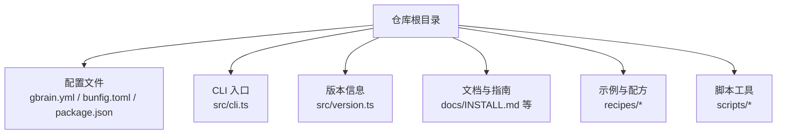
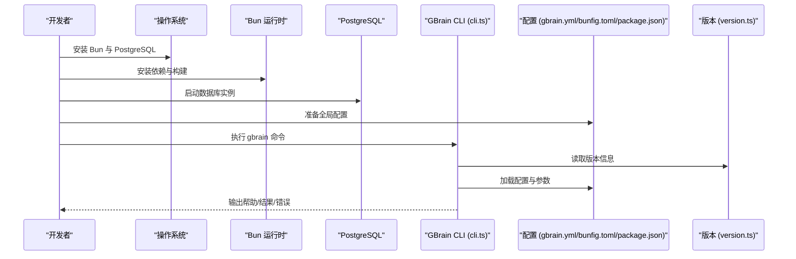
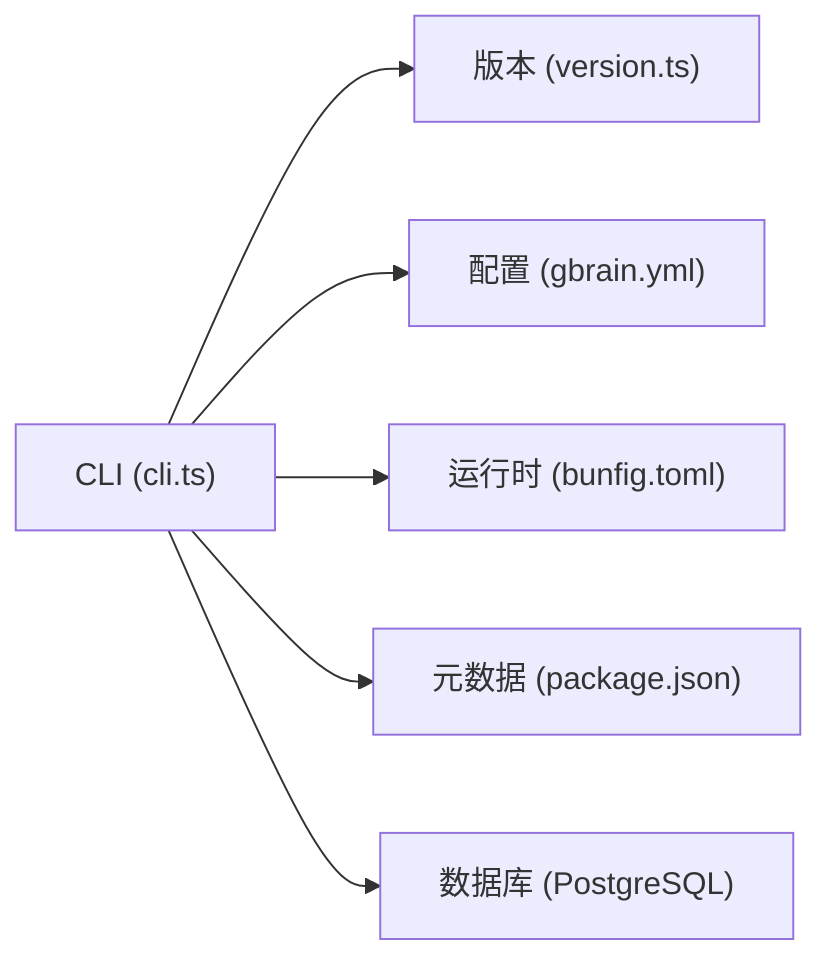

# 快速开始

<cite>
**本文引用的文件**   
- [README.md](file://README.md)
- [INSTALL.md](file://docs/INSTALL.md)
- [gbrain.yml](file://gbrain.yml)
- [package.json](file://package.json)
- [bunfig.toml](file://bunfig.toml)
- [src/cli.ts](file://src/cli.ts)
- [src/version.ts](file://src/version.ts)
- [scripts/generate-gbrain-base.ts](file://scripts/generate-gbrain-base.ts)
- [recipes/ngrok-tunnel.md](file://recipes/ngrok-tunnel.md)
</cite>

## 目录
1. [简介](#简介)
2. [项目结构](#项目结构)
3. [核心组件](#核心组件)
4. [架构总览](#架构总览)
5. [详细组件分析](#详细组件分析)
6. [依赖分析](#依赖分析)
7. [性能考虑](#性能考虑)
8. [故障排除指南](#故障排除指南)
9. [结论](#结论)
10. [附录](#附录)

## 简介
本指南面向希望在最短时间内搭建并运行第一个 GBrain 智能体应用的开发者。你将完成以下目标：
- 准备环境（Bun、PostgreSQL）
- 安装依赖与初始化配置
- 创建第一个智能体并启动服务
- 常见初始化命令与基础配置说明
- 常见问题排查，确保在 15 分钟内成功运行并执行首个任务

## 项目结构
GBrain 仓库采用多模块组织方式，包含 CLI 入口、核心逻辑、文档、示例与脚本等。快速开始主要涉及以下位置：
- 根级配置文件：用于全局行为与运行时参数
- CLI 入口：提供命令行能力与子命令
- 版本信息：用于诊断与兼容性检查
- 生成脚本：辅助初始化或脚手架类操作
- 官方安装文档：提供权威的环境与安装步骤

图表来源
- [gbrain.yml](file://gbrain.yml)
- [bunfig.toml](file://bunfig.toml)
- [package.json](file://package.json)
- [src/cli.ts](file://src/cli.ts)
- [src/version.ts](file://src/version.ts)
- [docs/INSTALL.md](file://docs/INSTALL.md)

章节来源
- [README.md](file://README.md)
- [docs/INSTALL.md](file://docs/INSTALL.md)
- [gbrain.yml](file://gbrain.yml)
- [bunfig.toml](file://bunfig.toml)
- [package.json](file://package.json)
- [src/cli.ts](file://src/cli.ts)
- [src/version.ts](file://src/version.ts)

## 核心组件
- 运行时与包管理：使用 Bun 作为运行时与包管理器，相关配置位于 bunfig.toml；应用元信息与脚本定义位于 package.json。
- 全局配置：gbrain.yml 提供全局默认配置项，便于统一管理与覆盖。
- CLI 入口：src/cli.ts 暴露命令行接口，负责解析参数、分发子命令与调用核心能力。
- 版本信息：src/version.ts 提供当前版本标识，便于诊断与升级检查。
- 安装与初始化：docs/INSTALL.md 提供权威的安装与环境要求说明。

章节来源
- [bunfig.toml](file://bunfig.toml)
- [package.json](file://package.json)
- [gbrain.yml](file://gbrain.yml)
- [src/cli.ts](file://src/cli.ts)
- [src/version.ts](file://src/version.ts)
- [docs/INSTALL.md](file://docs/INSTALL.md)

## 架构总览
下图展示了快速开始阶段的关键交互：从环境准备到首次运行 CLI 的端到端流程。

图表来源
- [src/cli.ts](file://src/cli.ts)
- [src/version.ts](file://src/version.ts)
- [gbrain.yml](file://gbrain.yml)
- [bunfig.toml](file://bunfig.toml)
- [package.json](file://package.json)

## 详细组件分析

### 环境与依赖准备
- 环境要求
  - 运行时：Bun（用于依赖安装与执行）
  - 数据库：PostgreSQL（用于持久化存储）
- 依赖安装
  - 使用包管理器进行依赖安装与构建（参考 package.json 中的脚本与依赖声明）
- 初始配置
  - 全局配置：gbrain.yml（建议根据实际部署调整）
  - 运行时配置：bunfig.toml（Bun 行为与缓存等）
  - 应用元数据：package.json（版本、脚本、依赖）

章节来源
- [docs/INSTALL.md](file://docs/INSTALL.md)
- [package.json](file://package.json)
- [bunfig.toml](file://bunfig.toml)
- [gbrain.yml](file://gbrain.yml)

### 创建第一个智能体
- 初始化工作区
  - 在项目根目录执行初始化命令（具体命令请参考 CLI 帮助与安装文档）
- 基本参数配置
  - 通过 gbrain.yml 设置默认模型、数据库连接、日志级别等
  - 如需覆盖特定场景，可在 CLI 命令中传入参数或使用环境变量
- 启动服务
  - 使用 CLI 启动服务或运行任务（例如 serve 或 run 子命令，具体以 CLI 帮助为准）

章节来源
- [src/cli.ts](file://src/cli.ts)
- [gbrain.yml](file://gbrain.yml)
- [docs/INSTALL.md](file://docs/INSTALL.md)

### 常用初始化命令与基础配置选项
- 常用命令
  - 查看帮助：gbrain --help
  - 初始化工作区：gbrain init（如存在该子命令）
  - 启动服务：gbrain serve（如存在该子命令）
  - 运行任务：gbrain run <task>（如存在该子命令）
- 基础配置选项
  - 数据库连接：在 gbrain.yml 中配置 PostgreSQL 连接串
  - 模型与提供商：在 gbrain.yml 中配置默认模型与凭据
  - 日志与调试：在 bunfig.toml 或 gbrain.yml 中调整日志级别
  - 端口与网络：在 gbrain.yml 中配置监听端口与代理设置

章节来源
- [src/cli.ts](file://src/cli.ts)
- [gbrain.yml](file://gbrain.yml)
- [bunfig.toml](file://bunfig.toml)

### 本地开发与服务暴露
- 本地访问
  - 启动后通过浏览器访问本地地址（端口以配置为准）
- 外网访问（可选）
  - 可使用 ngrok 等隧道工具将本地服务暴露到公网（参考 recipes/ngrok-tunnel.md）

章节来源
- [recipes/ngrok-tunnel.md](file://recipes/ngrok-tunnel.md)

## 依赖分析
- 运行时依赖
  - Bun：作为 Node.js 兼容的运行时与包管理器，提升安装与执行效率
- 外部依赖
  - PostgreSQL：用于结构化数据存储与查询
- 内部依赖关系
  - CLI 入口依赖版本信息与配置加载器
  - 配置加载器优先读取 gbrain.yml，其次 bunfig.toml 与 package.json 中的相关字段

图表来源
- [src/cli.ts](file://src/cli.ts)
- [src/version.ts](file://src/version.ts)
- [gbrain.yml](file://gbrain.yml)
- [bunfig.toml](file://bunfig.toml)
- [package.json](file://package.json)

章节来源
- [src/cli.ts](file://src/cli.ts)
- [src/version.ts](file://src/version.ts)
- [gbrain.yml](file://gbrain.yml)
- [bunfig.toml](file://bunfig.toml)
- [package.json](file://package.json)

## 性能考虑
- 数据库连接池与并发：合理配置 PostgreSQL 的连接数与超时，避免资源争用
- 模型调用速率限制：在配置中设置合理的并发与重试策略，防止触发上游限流
- 日志级别：生产环境降低日志级别以减少 I/O 开销
- 缓存与索引：为高频查询建立合适索引，必要时启用查询缓存

[本节为通用指导，不直接分析具体文件]

## 故障排除指南
- 无法找到 Bun 或版本过低
  - 确认已安装最新稳定版 Bun，并在 PATH 中可用
  - 若仍失败，尝试重新安装或切换至系统包管理器提供的版本
- PostgreSQL 连接失败
  - 检查数据库是否启动、用户名/密码/主机/端口是否正确
  - 确认防火墙与安全组允许本机或容器访问
  - 验证 gbrain.yml 中的连接串格式与权限
- 端口被占用或服务无法启动
  - 修改 gbrain.yml 中的监听端口或释放占用进程
  - 使用 netstat/ss 查看端口占用情况
- 模型提供商凭据无效
  - 检查 API Key 是否过期或权限不足
  - 确认网络可达性与代理设置
- 初始化命令无响应或报错
  - 查看 CLI 帮助确认子命令是否存在与参数正确
  - 使用更详细的日志级别定位问题

章节来源
- [docs/INSTALL.md](file://docs/INSTALL.md)
- [gbrain.yml](file://gbrain.yml)
- [src/cli.ts](file://src/cli.ts)

## 结论
通过以上步骤，你可以在 15 分钟内完成 GBrain 的环境准备、依赖安装、初始配置与首次运行。建议后续阅读安装文档与 CLI 帮助，逐步扩展你的智能体能力与集成方案。

[本节为总结性内容，不直接分析具体文件]

## 附录
- 推荐参考
  - 安装与环境：docs/INSTALL.md
  - 全局配置：gbrain.yml
  - 运行时配置：bunfig.toml
  - 应用元数据：package.json
  - CLI 入口与版本：src/cli.ts、src/version.ts
  - 本地隧道：recipes/ngrok-tunnel.md

章节来源
- [docs/INSTALL.md](file://docs/INSTALL.md)
- [gbrain.yml](file://gbrain.yml)
- [bunfig.toml](file://bunfig.toml)
- [package.json](file://package.json)
- [src/cli.ts](file://src/cli.ts)
- [src/version.ts](file://src/version.ts)
- [recipes/ngrok-tunnel.md](file://recipes/ngrok-tunnel.md)