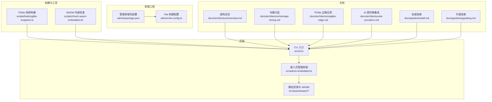
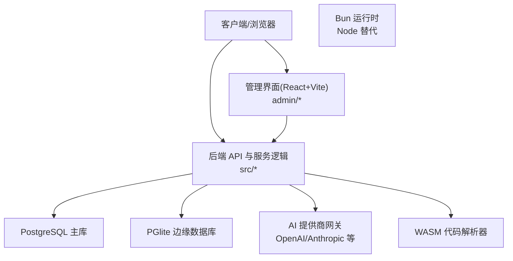
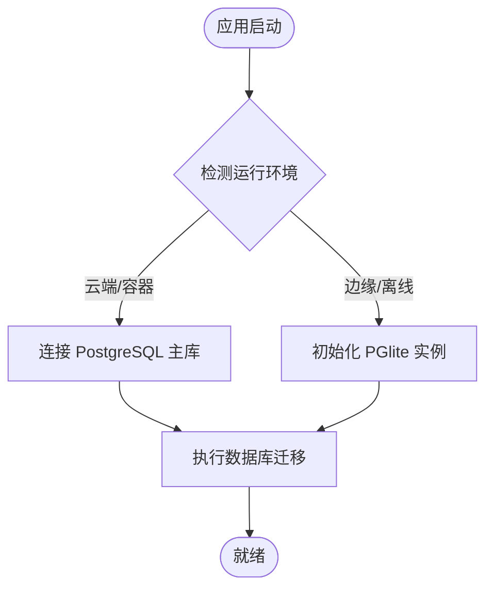
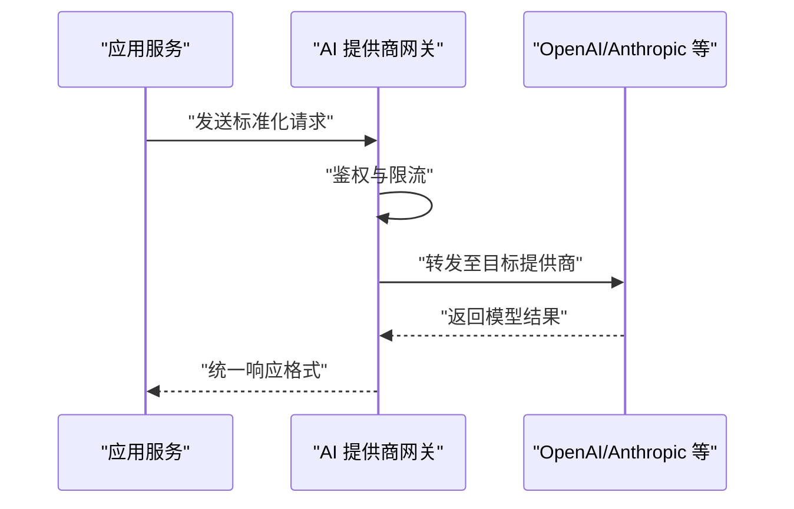
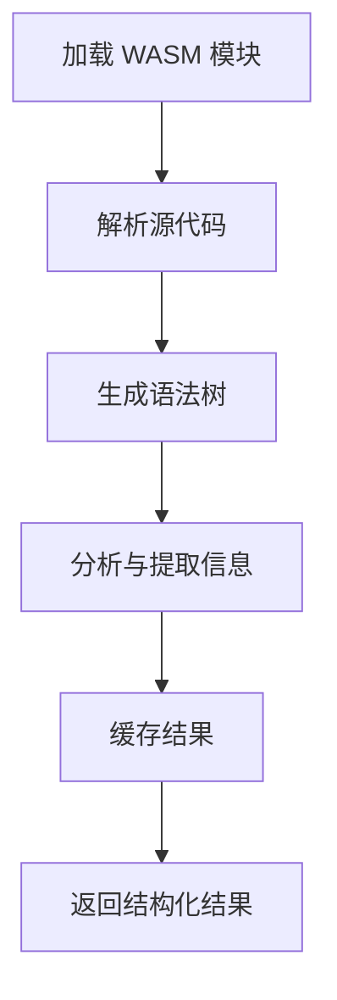
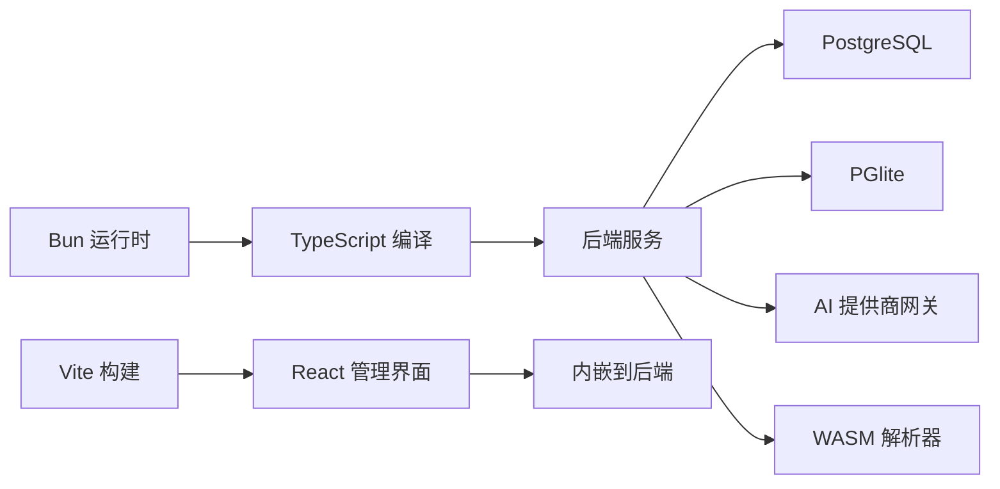

# 技术栈

<cite>
**本文引用的文件**   
- [package.json](file://package.json)
- [bunfig.toml](file://bunfig.toml)
- [tsconfig.json](file://tsconfig.json)
- [admin/package.json](file://admin/package.json)
- [admin/vite.config.ts](file://admin/vite.config.ts)
- [src/cli.ts](file://src/cli.ts)
- [src/admin-embedded.ts](file://src/admin-embedded.ts)
- [scripts/build-pglite-snapshot.ts](file://scripts/build-pglite-snapshot.ts)
- [scripts/check-wasm-embedded.sh](file://scripts/check-wasm-embedded.sh)
- [src/assets/wasm/README.md](file://src/assets/wasm/README.md)
- [docs/architecture/overview.md](file://docs/architecture/overview.md)
- [docs/architecture/storage-tiering.md](file://docs/architecture/storage-tiering.md)
- [docs/architecture/pglite-edge.md](file://docs/architecture/pglite-edge.md)
- [docs/architecture/ai-providers.md](file://docs/architecture/ai-providers.md)
- [docs/guides/install.md](file://docs/guides/install.md)
- [docs/guides/upgrading.md](file://docs/guides/upgrading.md)
- [docs/migrations/schema-v1.md](file://docs/migrations/schema-v1.md)
- [gbrain.yml](file://gbrain.yml)
</cite>

## 目录
1. [简介](#简介)
2. [项目结构](#项目结构)
3. [核心组件](#核心组件)
4. [架构总览](#架构总览)
5. [详细组件分析](#详细组件分析)
6. [依赖关系分析](#依赖关系分析)
7. [性能考量](#性能考量)
8. [故障排查指南](#故障排查指南)
9. [结论](#结论)
10. [附录](#附录)

## 简介
本文件系统性梳理 GBrain 的技术栈与选型理由，重点覆盖：
- Bun 运行时在性能与开发体验上的优势
- PostgreSQL 作为主数据库的考量，以及 PGlite 在边缘场景的应用
- 前端技术栈（React + Vite）与管理界面设计理念
- AI 服务提供商集成策略（OpenAI、Anthropic 等）与多模型支持架构
- WASM 技术在代码解析与语法分析中的应用
- 版本兼容矩阵与升级路径建议
为开发者选择合适的技术组合提供可操作的参考依据。

## 项目结构
GBrain 采用“后端服务 + 管理前端 + 构建脚本 + 文档”的分层组织方式：
- 后端服务：以 TypeScript 编写，使用 Bun 运行，入口位于 src/cli.ts；内置 HTTP 管理与嵌入式前端资源。
- 管理前端：位于 admin 子工程，基于 React + Vite 构建，并通过脚本嵌入到后端二进制中。
- 构建与质量保障：scripts 下包含 PGlite 快照构建、WASM 内嵌检查、CI 校验等脚本。
- 文档：docs 下涵盖架构设计、迁移指南、安装与升级说明等。

图表来源
- [src/cli.ts](file://src/cli.ts)
- [src/admin-embedded.ts](file://src/admin-embedded.ts)
- [admin/package.json](file://admin/package.json)
- [admin/vite.config.ts](file://admin/vite.config.ts)
- [scripts/build-pglite-snapshot.ts](file://scripts/build-pglite-snapshot.ts)
- [scripts/check-wasm-embedded.sh](file://scripts/check-wasm-embedded.sh)
- [docs/architecture/overview.md](file://docs/architecture/overview.md)
- [docs/architecture/storage-tiering.md](file://docs/architecture/storage-tiering.md)
- [docs/architecture/pglite-edge.md](file://docs/architecture/pglite-edge.md)
- [docs/architecture/ai-providers.md](file://docs/architecture/ai-providers.md)
- [docs/guides/install.md](file://docs/guides/install.md)
- [docs/guides/upgrading.md](file://docs/guides/upgrading.md)

章节来源
- [src/cli.ts](file://src/cli.ts)
- [src/admin-embedded.ts](file://src/admin-embedded.ts)
- [admin/package.json](file://admin/package.json)
- [admin/vite.config.ts](file://admin/vite.config.ts)
- [scripts/build-pglite-snapshot.ts](file://scripts/build-pglite-snapshot.ts)
- [scripts/check-wasm-embedded.sh](file://scripts/check-wasm-embedded.sh)
- [docs/architecture/overview.md](file://docs/architecture/overview.md)
- [docs/architecture/storage-tiering.md](file://docs/architecture/storage-tiering.md)
- [docs/architecture/pglite-edge.md](file://docs/architecture/pglite-edge.md)
- [docs/architecture/ai-providers.md](file://docs/architecture/ai-providers.md)
- [docs/guides/install.md](file://docs/guides/install.md)
- [docs/guides/upgrading.md](file://docs/guides/upgrading.md)

## 核心组件
- 运行时与工程化
  - 使用 Bun 作为 Node.js 替代运行时，统一包管理与构建链路，提升冷启动与 I/O 性能。
  - TypeScript 编译与类型约束通过 tsconfig.json 统一管理。
- 管理前端
  - 基于 React + Vite 的管理界面，独立工程化，构建产物由后端内嵌分发。
- 数据持久化
  - 生产环境以 PostgreSQL 为主库；边缘或离线场景通过 PGlite 提供轻量级嵌入式数据库能力。
- AI 服务集成
  - 抽象统一的 LLM 网关，支持 OpenAI、Anthropic 等多厂商模型，便于扩展与切换。
- 代码解析与语法分析
  - 借助 WASM 模块实现高性能的代码解析与语法树生成，降低跨平台差异并提升执行效率。

章节来源
- [package.json](file://package.json)
- [bunfig.toml](file://bunfig.toml)
- [tsconfig.json](file://tsconfig.json)
- [admin/package.json](file://admin/package.json)
- [admin/vite.config.ts](file://admin/vite.config.ts)
- [docs/architecture/storage-tiering.md](file://docs/architecture/storage-tiering.md)
- [docs/architecture/pglite-edge.md](file://docs/architecture/pglite-edge.md)
- [docs/architecture/ai-providers.md](file://docs/architecture/ai-providers.md)
- [src/assets/wasm/README.md](file://src/assets/wasm/README.md)

## 架构总览
下图展示 GBrain 的整体技术架构与关键交互：Bun 运行时承载后端服务与嵌入式管理前端；PostgreSQL 作为主数据存储；PGlite 用于边缘场景；AI 提供商通过统一网关接入；WASM 模块用于代码解析与分析。

图表来源
- [docs/architecture/overview.md](file://docs/architecture/overview.md)
- [docs/architecture/storage-tiering.md](file://docs/architecture/storage-tiering.md)
- [docs/architecture/pglite-edge.md](file://docs/architecture/pglite-edge.md)
- [docs/architecture/ai-providers.md](file://docs/architecture/ai-providers.md)
- [src/assets/wasm/README.md](file://src/assets/wasm/README.md)

## 详细组件分析

### 运行时与工程化（Bun + TypeScript）
- 选择理由
  - 性能：Bun 在启动速度、I/O 并发与打包方面具备显著优势，适合高并发与低延迟的后端服务。
  - 开发体验：统一包管理、快速热重载与原生 TS 支持，减少工具链复杂度。
  - 兼容性：与现有 Node 生态良好兼容，平滑迁移成本低。
- 工程化要点
  - 通过 bunfig.toml 调整构建与运行参数。
  - 使用 tsconfig.json 统一类型与编译选项。
  - 通过 package.json 声明依赖与脚本命令。

章节来源
- [package.json](file://package.json)
- [bunfig.toml](file://bunfig.toml)
- [tsconfig.json](file://tsconfig.json)

### 管理界面（React + Vite）
- 设计理念
  - 前后端解耦：管理前端独立工程化，构建产物由后端内嵌分发，简化部署。
  - 快速迭代：Vite 提供极速 HMR 与按需加载，提升开发与调试效率。
  - 一致性：通过统一样式与组件规范，保证管理界面的可用性与可维护性。
- 集成方式
  - 构建产物被后端静态资源服务器直接提供，无需额外反向代理。

章节来源
- [admin/package.json](file://admin/package.json)
- [admin/vite.config.ts](file://admin/vite.config.ts)
- [src/admin-embedded.ts](file://src/admin-embedded.ts)

### 数据持久化（PostgreSQL + PGlite）
- PostgreSQL 作为主库
  - 成熟稳定：事务、索引、JSONB、全文检索等特性完备，满足复杂业务需求。
  - 可扩展性：水平与垂直扩展方案丰富，社区生态完善。
- PGlite 在边缘场景
  - 轻量内嵌：在边缘节点或离线环境中提供类 SQL 的本地数据库能力。
  - 同步策略：与主库进行增量同步与冲突解决，确保一致性与可用性。
- 存储分层
  - 冷热数据分层与归档策略，结合向量索引与全文检索优化查询性能。

图表来源
- [docs/architecture/storage-tiering.md](file://docs/architecture/storage-tiering.md)
- [docs/architecture/pglite-edge.md](file://docs/architecture/pglite-edge.md)
- [scripts/build-pglite-snapshot.ts](file://scripts/build-pglite-snapshot.ts)

章节来源
- [docs/architecture/storage-tiering.md](file://docs/architecture/storage-tiering.md)
- [docs/architecture/pglite-edge.md](file://docs/architecture/pglite-edge.md)
- [scripts/build-pglite-snapshot.ts](file://scripts/build-pglite-snapshot.ts)

### AI 服务提供商集成（OpenAI、Anthropic 等）
- 统一网关
  - 抽象模型调用接口，屏蔽不同厂商的差异，提供一致的请求/响应格式。
  - 支持多模型路由、负载均衡与降级策略。
- 配置与密钥管理
  - 通过配置文件与环境变量注入密钥与模型参数，避免硬编码。
- 扩展性
  - 新增提供商只需实现适配器接口，即可无缝接入统一网关。

图表来源
- [docs/architecture/ai-providers.md](file://docs/architecture/ai-providers.md)

章节来源
- [docs/architecture/ai-providers.md](file://docs/architecture/ai-providers.md)

### WASM 在代码解析与语法分析中的应用
- 选择理由
  - 性能：WASM 接近原生执行速度，适合 CPU 密集型的解析任务。
  - 跨平台：同一份二进制可在多种平台上运行，降低移植成本。
  - 安全隔离：沙箱执行，降低恶意代码风险。
- 内嵌与构建
  - 构建脚本负责将 WASM 模块内嵌到最终产物，确保部署简洁。
  - 运行时按需加载，减少内存占用。

图表来源
- [src/assets/wasm/README.md](file://src/assets/wasm/README.md)
- [scripts/check-wasm-embedded.sh](file://scripts/check-wasm-embedded.sh)

章节来源
- [src/assets/wasm/README.md](file://src/assets/wasm/README.md)
- [scripts/check-wasm-embedded.sh](file://scripts/check-wasm-embedded.sh)

## 依赖关系分析
- 运行时依赖
  - Bun 作为主要运行时，提供包管理与执行环境。
  - TypeScript 编译器与类型定义用于静态检查与开发体验。
- 前端依赖
  - React 与 Vite 构成管理前端的构建与运行基础。
- 数据与 AI 依赖
  - PostgreSQL 驱动与 PGlite 用于数据持久化。
  - AI 提供商 SDK 通过统一网关间接依赖。
- 构建与质量
  - 脚本负责内嵌资源、快照构建与合规检查。

图表来源
- [package.json](file://package.json)
- [bunfig.toml](file://bunfig.toml)
- [tsconfig.json](file://tsconfig.json)
- [admin/package.json](file://admin/package.json)
- [admin/vite.config.ts](file://admin/vite.config.ts)
- [docs/architecture/storage-tiering.md](file://docs/architecture/storage-tiering.md)
- [docs/architecture/pglite-edge.md](file://docs/architecture/pglite-edge.md)
- [docs/architecture/ai-providers.md](file://docs/architecture/ai-providers.md)
- [src/assets/wasm/README.md](file://src/assets/wasm/README.md)

章节来源
- [package.json](file://package.json)
- [bunfig.toml](file://bunfig.toml)
- [tsconfig.json](file://tsconfig.json)
- [admin/package.json](file://admin/package.json)
- [admin/vite.config.ts](file://admin/vite.config.ts)
- [docs/architecture/storage-tiering.md](file://docs/architecture/storage-tiering.md)
- [docs/architecture/pglite-edge.md](file://docs/architecture/pglite-edge.md)
- [docs/architecture/ai-providers.md](file://docs/architecture/ai-providers.md)
- [src/assets/wasm/README.md](file://src/assets/wasm/README.md)

## 性能考量
- 运行时层面
  - 利用 Bun 的高并发与低延迟特性，优化 I/O 密集型任务。
  - 合理设置线程池与工作进程数量，避免资源争用。
- 数据库层面
  - 针对高频查询建立合适索引，合理使用 JSONB 与全文检索。
  - 对 PGlite 进行快照预热，减少冷启动时间。
- AI 调用层面
  - 启用请求批处理与重试退避，降低网络抖动影响。
  - 实施速率限制与熔断策略，保护上游服务稳定性。
- 前端层面
  - 使用 Vite 的按需加载与代码分割，减小首屏体积。
  - 静态资源压缩与缓存策略提升加载速度。

[本节为通用性能指导，不直接分析具体文件]

## 故障排查指南
- 常见问题定位
  - 启动失败：检查环境变量与配置文件是否正确注入。
  - 数据库连接异常：验证 PostgreSQL 地址、端口与认证信息；确认 PGlite 快照是否完整。
  - AI 调用失败：核对密钥与模型 ID，查看网关日志与错误码。
  - WASM 模块缺失：确认内嵌脚本执行成功，检查构建产物完整性。
- 诊断步骤
  - 启用详细日志与追踪，定位瓶颈与错误堆栈。
  - 使用健康检查端点监控服务状态。
  - 对关键路径进行压测与回归测试，确保变更稳定性。

章节来源
- [docs/guides/install.md](file://docs/guides/install.md)
- [docs/guides/upgrading.md](file://docs/guides/upgrading.md)

## 结论
GBrain 通过 Bun 运行时、PostgreSQL 与 PGlite 的组合，兼顾了高性能与灵活性；管理前端采用 React + Vite 提升开发体验；AI 提供商通过统一网关实现多模型支持与平滑扩展；WASM 在代码解析场景中发挥关键作用。整体技术栈在性能、可维护性与扩展性之间取得良好平衡，适合构建现代化智能系统。

[本节为总结性内容，不直接分析具体文件]

## 附录

### 版本兼容矩阵与升级路径建议
- 版本矩阵
  - 列出当前版本与支持的最低运行时版本、数据库版本与前端构建工具版本。
  - 标注已弃用的功能与迁移提示。
- 升级路径
  - 小版本升级：遵循向后兼容原则，逐步更新依赖与配置。
  - 大版本升级：按迁移文档执行数据库迁移与配置变更，并进行充分测试。
  - 回滚策略：保留旧版本镜像与数据快照，确保快速回滚。

章节来源
- [docs/guides/upgrading.md](file://docs/guides/upgrading.md)
- [docs/migrations/schema-v1.md](file://docs/migrations/schema-v1.md)
- [gbrain.yml](file://gbrain.yml)