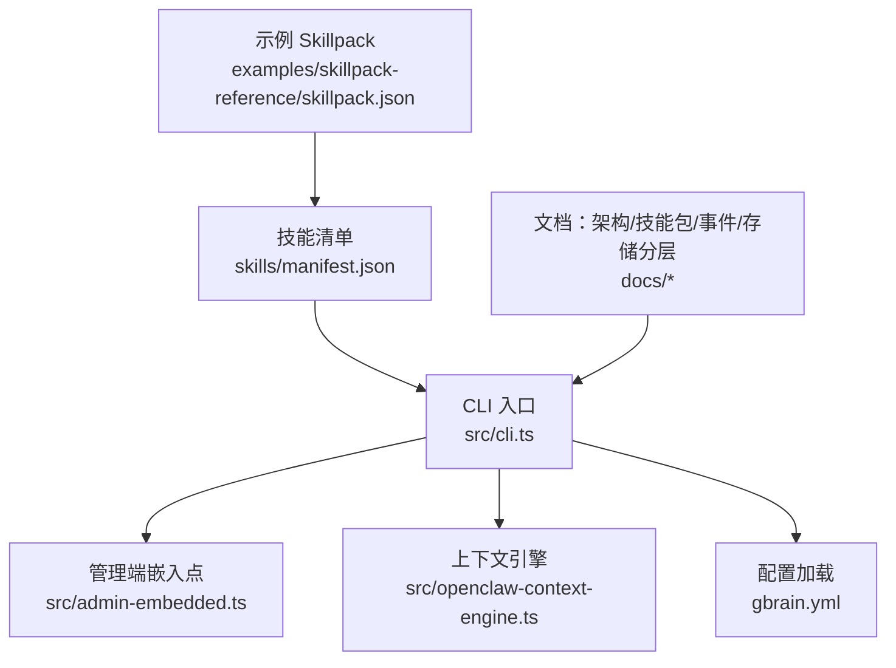
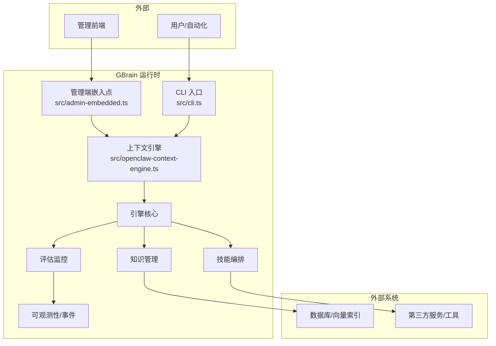
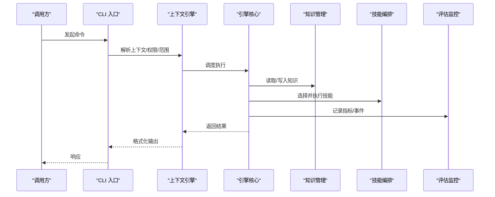
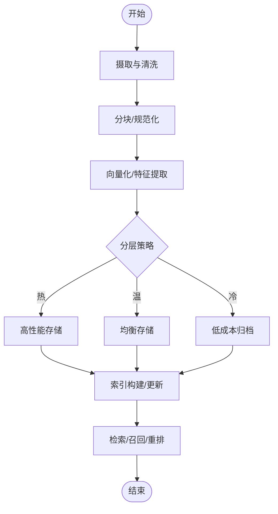
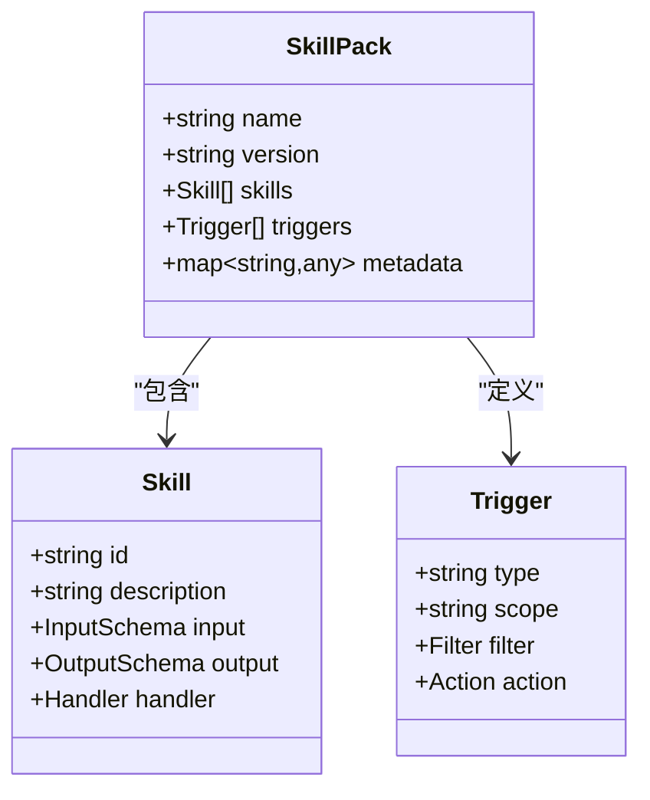
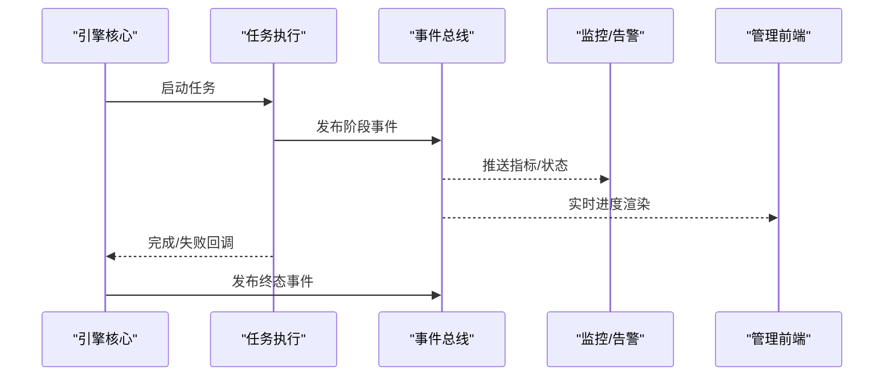
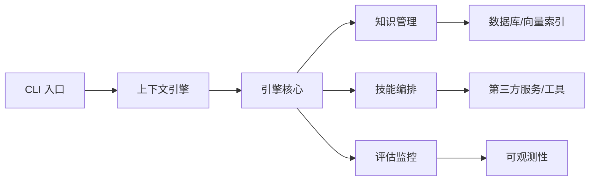

# 架构总览

<cite>
**本文引用的文件**   
- [README.md](file://README.md)
- [DESIGN.md](file://DESIGN.md)
- [src/cli.ts](file://src/cli.ts)
- [src/admin-embedded.ts](file://src/admin-embedded.ts)
- [src/openclaw-context-engine.ts](file://src/openclaw-context-engine.ts)
- [gbrain.yml](file://gbrain.yml)
- [package.json](file://package.json)
- [tsconfig.json](file://tsconfig.json)
- [docker-compose.ci.yml](file://docker-compose.ci.yml)
- [docker-compose.test.yml](file://docker-compose.test.yml)
- [skills/manifest.json](file://skills/manifest.json)
- [examples/skillpack-reference/skillpack.json](file://examples/skillpack-reference/skillpack.json)
- [docs/architecture/ENGINES.md](file://docs/architecture/ENGINES.md)
- [docs/GBRAIN_SKILLPACK.md](file://docs/GBRAIN_SKILLPACK.md)
- [docs/progress-events.md](file://docs/progress-events.md)
- [docs/storage-tiering.md](file://docs/storage-tiering.md)
- [docs/guardrails.md](file://docs/guardrails.md)
- [docs/integrations/README.md](file://docs/integrations/README.md)
</cite>

## 目录
1. [简介](#简介)
2. [项目结构](#项目结构)
3. [核心组件](#核心组件)
4. [架构总览](#架构总览)
5. [详细组件分析](#详细组件分析)
6. [依赖关系分析](#依赖关系分析)
7. [性能与可扩展性](#性能与可扩展性)
8. [故障排查指南](#故障排查指南)
9. [结论](#结论)
10. [附录](#附录)

## 简介
本架构总览面向 GBrain 的开发者与运维人员，旨在提供系统的高层视图、微服务化设计思路、事件驱动与插件机制的实现要点，以及核心模块的职责划分（引擎核心、知识管理、技能编排、评估监控等）。文档同时给出部署拓扑与服务间通信协议说明，为后续深入的技术文档奠定清晰的背景。

## 项目结构
GBrain 采用“核心库 + CLI + 嵌入式管理前端 + 可插拔技能包”的组织方式：
- src：核心运行时入口、命令分发、上下文引擎与管理端嵌入点
- skills：内置技能清单与示例；通过 skillpack 规范进行扩展
- docs：架构与设计文档、集成指南、存储分层、进度事件等
- scripts：构建、测试、质量检查脚本
- admin：管理前端源码与构建产物
- examples：参考实现与示例 skillpack
- docker-compose.*：CI 与测试环境编排
- gbrain.yml：全局配置入口
- package.json/tsconfig.json：工程元数据与编译配置

图表来源
- [src/cli.ts](file://src/cli.ts)
- [src/admin-embedded.ts](file://src/admin-embedded.ts)
- [src/openclaw-context-engine.ts](file://src/openclaw-context-engine.ts)
- [gbrain.yml](file://gbrain.yml)
- [skills/manifest.json](file://skills/manifest.json)
- [examples/skillpack-reference/skillpack.json](file://examples/skillpack-reference/skillpack.json)
- [docs/architecture/ENGINES.md](file://docs/architecture/ENGINES.md)
- [docs/GBRAIN_SKILLPACK.md](file://docs/GBRAIN_SKILLPACK.md)
- [docs/progress-events.md](file://docs/progress-events.md)
- [docs/storage-tiering.md](file://docs/storage-tiering.md)

章节来源
- [README.md](file://README.md)
- [DESIGN.md](file://DESIGN.md)
- [package.json](file://package.json)
- [tsconfig.json](file://tsconfig.json)

## 核心组件
- 引擎核心：负责进程启动、命令路由、生命周期管理与资源协调，对外暴露 CLI 与嵌入式 API。
- 知识管理：围绕事实抽取、索引与检索，结合存储分层策略，支撑多源知识的持久化与查询。
- 技能编排：基于 skillpack 规范发现、安装与执行技能，支持触发器、工具与结果回写。
- 评估监控：采集运行期指标、进度事件与审计日志，提供健康检查与可观测性。
- 管理前端：嵌入式 Web 界面，用于配置、诊断与可视化。

章节来源
- [src/cli.ts](file://src/cli.ts)
- [src/admin-embedded.ts](file://src/admin-embedded.ts)
- [src/openclaw-context-engine.ts](file://src/openclaw-context-engine.ts)
- [docs/architecture/ENGINES.md](file://docs/architecture/ENGINES.md)
- [docs/GBRAIN_SKILLPACK.md](file://docs/GBRAIN_SKILLPACK.md)
- [docs/progress-events.md](file://docs/progress-events.md)
- [docs/storage-tiering.md](file://docs/storage-tiering.md)

## 架构总览
下图展示 GBrain 的高层架构：外部调用通过 CLI 或嵌入式 HTTP 进入，由命令路由到具体能力；知识管理与技能编排作为核心子系统协同工作；评估与监控贯穿全链路；管理前端提供可视化操作面。

图表来源
- [src/cli.ts](file://src/cli.ts)
- [src/admin-embedded.ts](file://src/admin-embedded.ts)
- [src/openclaw-context-engine.ts](file://src/openclaw-context-engine.ts)
- [docs/architecture/ENGINES.md](file://docs/architecture/ENGINES.md)
- [docs/GBRAIN_SKILLPACK.md](file://docs/GBRAIN_SKILLPACK.md)
- [docs/progress-events.md](file://docs/progress-events.md)
- [docs/storage-tiering.md](file://docs/storage-tiering.md)

## 详细组件分析

### 引擎核心（Engine Core）
职责
- 进程初始化、配置加载、命令注册与分发
- 生命周期钩子、优雅关闭与错误恢复
- 与上下文引擎、知识管理、技能编排、评估监控的协调

关键流程（概念序列图）

图表来源
- [src/cli.ts](file://src/cli.ts)
- [src/openclaw-context-engine.ts](file://src/openclaw-context-engine.ts)
- [docs/architecture/ENGINES.md](file://docs/architecture/ENGINES.md)

章节来源
- [src/cli.ts](file://src/cli.ts)
- [src/openclaw-context-engine.ts](file://src/openclaw-context-engine.ts)
- [docs/architecture/ENGINES.md](file://docs/architecture/ENGINES.md)

### 知识管理（Knowledge Management）
职责
- 多源摄取、分块与向量化
- 索引构建、增量更新与一致性保障
- 检索增强与混合搜索

存储分层（概念流程图）

图表来源
- [docs/storage-tiering.md](file://docs/storage-tiering.md)

章节来源
- [docs/storage-tiering.md](file://docs/storage-tiering.md)

### 技能编排（Skill Orchestration）
职责
- 技能发现、版本管理与依赖解析
- 触发器绑定、参数校验与执行沙箱
- 结果回写、审计与重试补偿

Skillpack 结构（概念类图）

图表来源
- [docs/GBRAIN_SKILLPACK.md](file://docs/GBRAIN_SKILLPACK.md)
- [skills/manifest.json](file://skills/manifest.json)
- [examples/skillpack-reference/skillpack.json](file://examples/skillpack-reference/skillpack.json)

章节来源
- [docs/GBRAIN_SKILLPACK.md](file://docs/GBRAIN_SKILLPACK.md)
- [skills/manifest.json](file://skills/manifest.json)
- [examples/skillpack-reference/skillpack.json](file://examples/skillpack-reference/skillpack.json)

### 评估与监控（Evaluation & Observability）
职责
- 运行期指标采集、进度事件上报与健康检查
- 评估用例执行、结果聚合与回归检测
- 审计日志与可观测性面板

进度事件流（概念时序图）

图表来源
- [docs/progress-events.md](file://docs/progress-events.md)
- [src/admin-embedded.ts](file://src/admin-embedded.ts)

章节来源
- [docs/progress-events.md](file://docs/progress-events.md)
- [src/admin-embedded.ts](file://src/admin-embedded.ts)

### 管理前端（Admin Frontend）
职责
- 嵌入式 Web 界面，提供配置、诊断、可视化与操作入口
- 与后端通过嵌入式 HTTP 接口交互

章节来源
- [src/admin-embedded.ts](file://src/admin-embedded.ts)

## 依赖关系分析
- 内部耦合
  - CLI 与上下文引擎强耦合，负责请求解析与上下文注入
  - 引擎核心对知识管理与技能编排松耦合，通过接口/契约协作
  - 评估监控以事件形式接入，降低侵入性
- 外部依赖
  - 数据库/向量索引：知识持久化与检索
  - 第三方服务/工具：技能执行时调用的外部能力
- 配置文件
  - gbrain.yml 作为全局配置入口，影响引擎行为与集成开关
- 容器编排
  - docker-compose.* 用于 CI 与测试环境的快速拉起

图表来源
- [src/cli.ts](file://src/cli.ts)
- [src/openclaw-context-engine.ts](file://src/openclaw-context-engine.ts)
- [docs/architecture/ENGINES.md](file://docs/architecture/ENGINES.md)
- [docs/storage-tiering.md](file://docs/storage-tiering.md)

章节来源
- [gbrain.yml](file://gbrain.yml)
- [docker-compose.ci.yml](file://docker-compose.ci.yml)
- [docker-compose.test.yml](file://docker-compose.test.yml)

## 性能与可扩展性
- 并发与批处理
  - 摄取与索引阶段建议批量提交，减少 I/O 与锁竞争
  - 检索阶段启用缓存与预取，降低尾延迟
- 存储分层
  - 按热度分层读写路径，平衡成本与性能
- 事件驱动
  - 使用异步事件解耦长耗时任务，提升吞吐与弹性
- 插件化
  - 通过 skillpack 扩展新能力，避免修改核心代码
- 可观测性
  - 完善指标与日志，定位瓶颈与异常

[本节为通用指导，不直接分析具体文件]

## 故障排查指南
- 常见问题
  - 配置错误：检查 gbrain.yml 中的连接串、模型与存储参数
  - 技能加载失败：核对 skillpack 清单与依赖版本
  - 索引不一致：查看摄取与合并阶段的错误日志与重试计数
  - 事件未消费：确认事件总线与消费者订阅关系
- 定位手段
  - 启用更详细的日志级别
  - 导出进度事件与审计日志
  - 使用管理前端的健康检查与诊断页面

章节来源
- [docs/guardrails.md](file://docs/guardrails.md)
- [docs/progress-events.md](file://docs/progress-events.md)

## 结论
GBrain 以“引擎核心 + 知识管理 + 技能编排 + 评估监控”的分层架构为基础，借助事件驱动与插件机制实现高内聚、低耦合与易扩展。配合存储分层与完善的可观测性，可在保证性能的同时持续演进能力边界。

[本节为总结性内容，不直接分析具体文件]

## 附录
- 集成模式
  - 通过 skillpack 将外部系统与工具封装为可复用技能
  - 使用统一的事件格式对接监控系统
- 部署拓扑
  - 单节点：CLI + 嵌入式管理前端 + 本地存储
  - 分布式：独立的知识存储与向量索引，多实例水平扩展
- 参考文档
  - 架构与引擎：docs/architecture/ENGINES.md
  - 技能包规范：docs/GBRAIN_SKILLPACK.md
  - 进度事件：docs/progress-events.md
  - 存储分层：docs/storage-tiering.md
  - 安全护栏：docs/guardrails.md
  - 集成概览：docs/integrations/README.md

章节来源
- [docs/architecture/ENGINES.md](file://docs/architecture/ENGINES.md)
- [docs/GBRAIN_SKILLPACK.md](file://docs/GBRAIN_SKILLPACK.md)
- [docs/progress-events.md](file://docs/progress-events.md)
- [docs/storage-tiering.md](file://docs/storage-tiering.md)
- [docs/guardrails.md](file://docs/guardrails.md)
- [docs/integrations/README.md](file://docs/integrations/README.md)