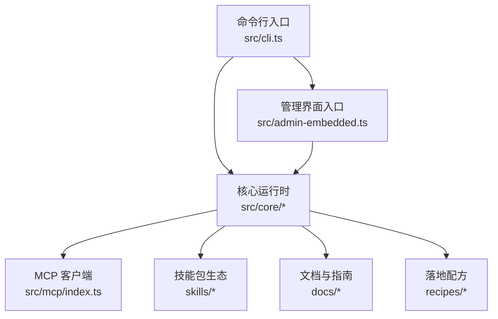
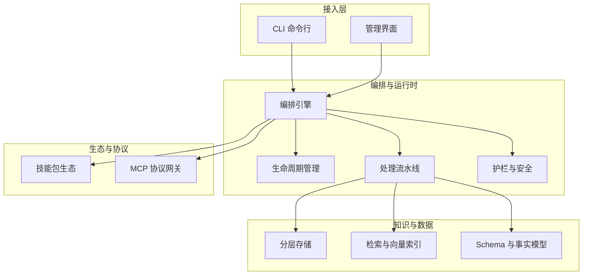
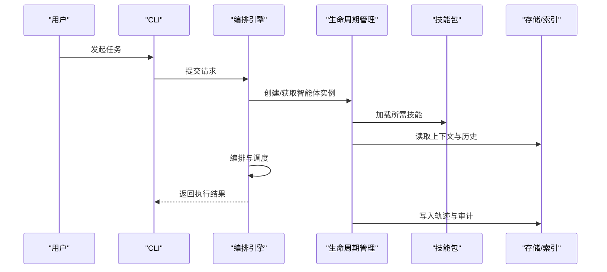
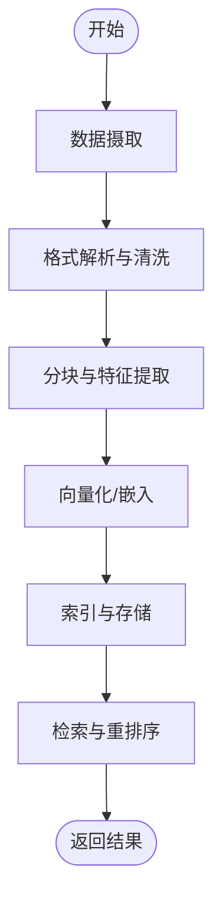
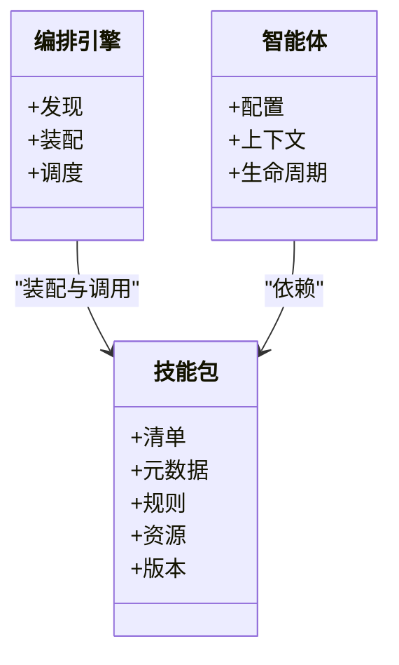
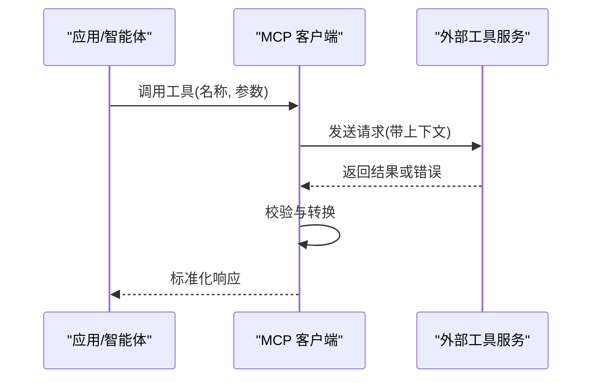
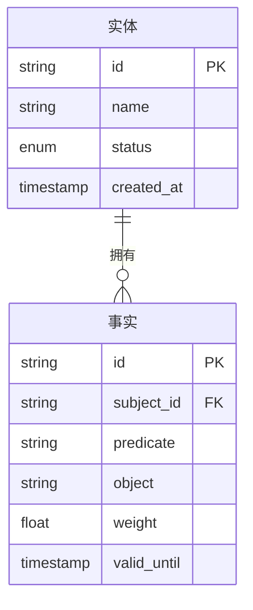
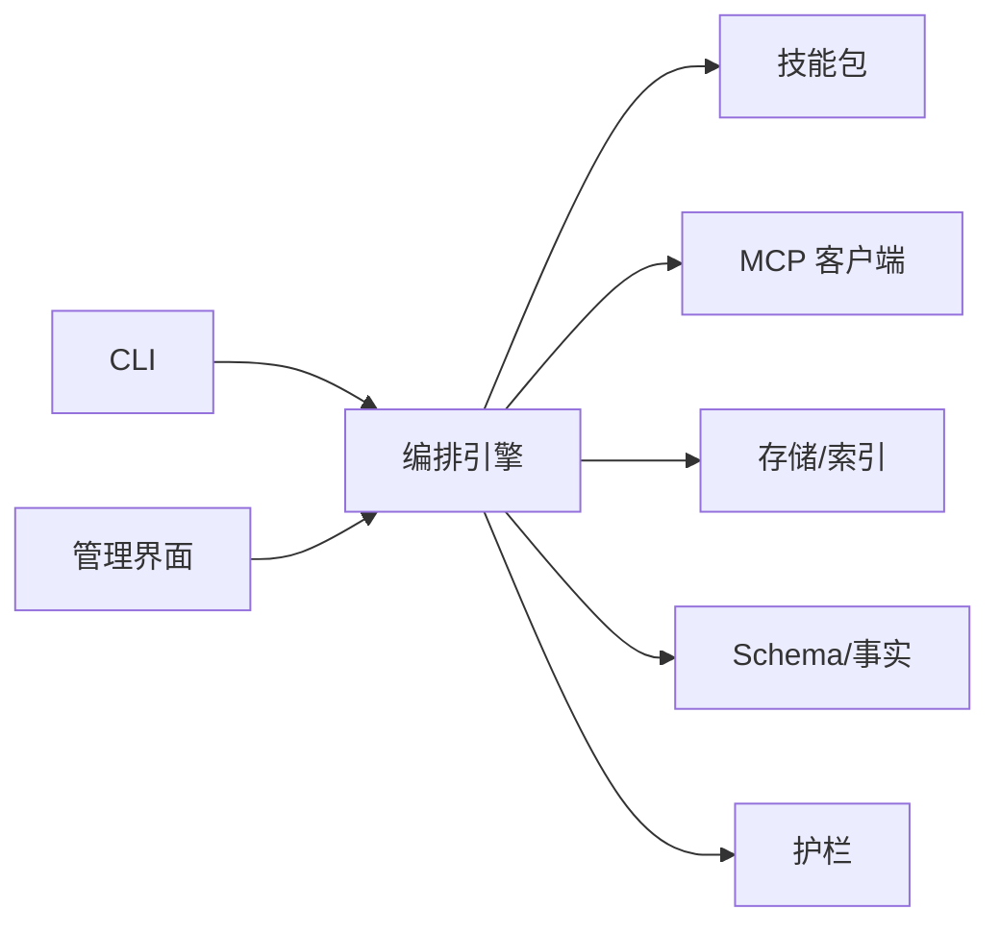

# 项目介绍

<cite>
**本文引用的文件**   
- [README.md](file://README.md)
- [DESIGN.md](file://DESIGN.md)
- [INSTALL.md](file://docs/INSTALL.md)
- [GBRAIN_SKILLPACK.md](file://docs/GBRAIN_SKILLPACK.md)
- [ENGINES.md](file://docs/ENGINES.md)
- [guardrails.md](file://docs/guardrails.md)
- [mcp-overview.md](file://docs/mcp/mcp-overview.md)
- [mcp-client.md](file://docs/mcp/mcp-client.md)
- [skillpack-anatomy.md](file://docs/skillpack-anatomy.md)
- [schema-author-tutorial.md](file://docs/schema-author-tutorial.md)
- [storage-tiering.md](file://docs/storage-tiering.md)
- [recipes/calendar-to-brain.md](file://recipes/calendar-to-brain.md)
- [recipes/email-to-brain.md](file://recipes/email-to-brain.md)
- [recipes/meeting-sync.md](file://recipes/meeting-sync.md)
- [recipes/retrieval-reflex.md](file://recipes/retrieval-reflex.md)
- [recipes/twilio-voice-brain.md](file://recipes/twilio-voice-brain.md)
- [recipes/x-to-brain.md](file://recipes/x-to-brain.md)
- [src/cli.ts](file://src/cli.ts)
- [src/admin-embedded.ts](file://src/admin-embedded.ts)
- [src/openclaw-context-engine.ts](file://src/openclaw-context-engine.ts)
- [src/mcp/index.ts](file://src/mcp/index.ts)
</cite>

## 目录
1. [简介](#简介)
2. [项目结构](#项目结构)
3. [核心组件](#核心组件)
4. [架构总览](#架构总览)
5. [详细组件分析](#详细组件分析)
6. [依赖关系分析](#依赖关系分析)
7. [性能与可扩展性](#性能与可扩展性)
8. [故障排查指南](#故障排查指南)
9. [结论](#结论)
10. [附录](#附录)

## 简介
GBrain 是一个面向企业级的 AI 智能体编排引擎与知识管理平台。它以“可组合、可治理、可观测”的核心理念，帮助团队将多源异构数据转化为结构化知识，并通过技能包生态与 MCP（Model Context Protocol）协议能力，让智能体在真实业务场景中可靠地执行任务。与传统“脚本+手工集成”的方式相比，GBrain 提供统一的智能体生命周期管理、多模态数据处理流水线、可插拔的技能体系以及标准化的外部工具接入协议，显著降低构建与维护成本，提升交付质量与可运维性。

核心价值主张
- 企业级编排：统一调度、可观测、可回滚、可审计的智能体运行环境
- 知识即资产：从文档、代码、音视频到系统日志的多模态摄取与检索增强
- 技能生态：以“技能包”为单位的可复用能力封装与分发
- 协议互通：基于 MCP 的外部工具与服务接入，打通现有系统
- 安全合规：内置护栏与权限边界，满足企业治理要求

适用场景
- 企业内部知识库与问答助手
- 研发效能提升（代码理解、变更影响分析、自动化报告）
- 运营自动化（日程、邮件、会议、工单等流程编排）
- 客服与销售辅助（多渠道信息聚合与智能应答）
- 数据与研究助理（文献抓取、摘要、对比与洞察生成）

目标用户
- 平台与后端工程师、AI 应用开发者
- 产品与运营团队（通过低门槛方式扩展智能体能力）
- 安全与合规团队（治理、审计、策略管控）

## 项目结构
仓库采用“核心源码 + 文档 + 示例与配方 + 技能包 + 测试”的分层组织方式，便于快速上手与持续演进。

- 核心源码
  - src/core：智能体运行时、编排、存储、搜索、嵌入、迁移、MCP 客户端等核心模块
  - src/commands：CLI 命令实现，覆盖安装、初始化、同步、发布、诊断等
  - src/mcp：MCP 协议客户端与适配层
  - src/admin-embedded.ts：嵌入式管理界面入口
  - src/cli.ts：命令行主入口
  - src/openclaw-context-engine.ts：上下文引擎相关实现
- 文档
  - docs：架构设计、使用指南、MCP 规范、评估与排障等
- 技能包
  - skills：官方与社区技能包集合，涵盖摄取、抽取、校验、发布、研究等
- 示例与配方
  - recipes：端到端落地方案（日历、邮件、会议、语音、社交等）
- 测试
  - test：单元、集成与 E2E 测试，保障稳定性与回归防护

图表来源
- [src/cli.ts](file://src/cli.ts)
- [src/admin-embedded.ts](file://src/admin-embedded.ts)
- [src/mcp/index.ts](file://src/mcp/index.ts)

章节来源
- [README.md](file://README.md)
- [DESIGN.md](file://DESIGN.md)
- [docs/INSTALL.md](file://docs/INSTALL.md)

## 核心组件
- 智能体生命周期管理
  - 负责智能体的创建、配置、部署、运行、监控、升级与下线，提供幂等与可恢复的运行语义
- 多模态数据处理
  - 支持文本、图片、音频、视频等多模态内容的摄取、分块、嵌入与检索增强
- 技能包生态系统
  - 以“技能包”为单位封装可复用的能力，包含清单、元数据、规则与资源，支持安装、更新与版本治理
- MCP 协议支持
  - 通过 MCP 客户端与工具服务交互，标准化外部工具调用与上下文传递
- 知识与模式定义
  - 提供 Schema 与事实模型，支撑结构化知识抽取、校验与一致性维护
- 存储与检索
  - 分层存储与混合检索，兼顾性能与成本；支持增量同步与断点续传
- 安全与护栏
  - 内置访问控制、审计与护栏机制，确保调用链路与输出可控

章节来源
- [docs/GBRAIN_SKILLPACK.md](file://docs/GBRAIN_SKILLPACK.md)
- [docs/ENGINES.md](file://docs/ENGINES.md)
- [docs/guardrails.md](file://docs/guardrails.md)
- [docs/schema-author-tutorial.md](file://docs/schema-author-tutorial.md)
- [docs/storage-tiering.md](file://docs/storage-tiering.md)

## 架构总览
GBrain 的整体架构围绕“编排引擎 + 知识中枢 + 技能生态 + 协议网关”展开。CLI 与管理界面作为统一入口，驱动核心运行时完成数据摄取、知识抽取、检索增强与任务编排；技能包提供领域能力；MCP 网关对接外部工具与服务；存储与索引层提供持久化与检索能力。

图表来源
- [src/cli.ts](file://src/cli.ts)
- [src/admin-embedded.ts](file://src/admin-embedded.ts)
- [src/mcp/index.ts](file://src/mcp/index.ts)
- [docs/ENGINES.md](file://docs/ENGINES.md)
- [docs/GBRAIN_SKILLPACK.md](file://docs/GBRAIN_SKILLPACK.md)
- [docs/guardrails.md](file://docs/guardrails.md)

## 详细组件分析

### 智能体生命周期管理
- 关键职责
  - 注册与发现：集中管理智能体实例与其配置
  - 启动与编排：按策略调度任务，支持并发与限流
  - 状态与可观测：记录运行轨迹、指标与事件
  - 升级与回滚：平滑升级与失败回退
- 典型流程
  - 初始化 → 加载技能包 → 建立连接 → 执行任务 → 产出结果 → 归档与审计

图表来源
- [src/cli.ts](file://src/cli.ts)
- [src/admin-embedded.ts](file://src/admin-embedded.ts)
- [docs/ENGINES.md](file://docs/ENGINES.md)

章节来源
- [docs/ENGINES.md](file://docs/ENGINES.md)

### 多模态数据处理流水线
- 能力概览
  - 摄取：支持多种来源（文件系统、远程仓库、API、消息队列等）
  - 解析：文本、图像、音频、视频等格式识别与预处理
  - 分块与嵌入：自适应分块与向量化，支持跨模态对齐
  - 检索增强：混合检索与重排序，提高召回与准确率
- 关键优化
  - 增量同步与去重，避免重复计算
  - 批处理与并行化，提升吞吐
  - 缓存与预热，降低冷启动延迟

图表来源
- [docs/storage-tiering.md](file://docs/storage-tiering.md)
- [docs/ENGINES.md](file://docs/ENGINES.md)

章节来源
- [docs/storage-tiering.md](file://docs/storage-tiering.md)
- [docs/ENGINES.md](file://docs/ENGINES.md)

### 技能包生态系统
- 概念与价值
  - 技能包是能力的最小可复用单元，包含清单、元数据、规则与资源，可按需装配到智能体
- 组成要素
  - 清单与版本：描述能力范围、依赖与兼容性
  - 规则与模板：约束输入输出、保证一致性与可验证性
  - 资源与脚本：实现具体逻辑与外部集成
- 生命周期
  - 开发 → 校验 → 打包 → 安装 → 运行 → 更新与下线

图表来源
- [docs/GBRAIN_SKILLPACK.md](file://docs/GBRAIN_SKILLPACK.md)
- [docs/skillpack-anatomy.md](file://docs/skillpack-anatomy.md)

章节来源
- [docs/GBRAIN_SKILLPACK.md](file://docs/GBRAIN_SKILLPACK.md)
- [docs/skillpack-anatomy.md](file://docs/skillpack-anatomy.md)

### MCP 协议支持与工具接入
- 定位与作用
  - 通过 MCP 客户端与外部工具/服务进行标准化交互，屏蔽底层差异，统一上下文与错误语义
- 关键特性
  - 工具发现与注册
  - 参数校验与类型映射
  - 超时、重试与熔断
  - 审计与追踪
- 典型调用序列

图表来源
- [docs/mcp/mcp-overview.md](file://docs/mcp/mcp-overview.md)
- [docs/mcp/mcp-client.md](file://docs/mcp/mcp-client.md)
- [src/mcp/index.ts](file://src/mcp/index.ts)

章节来源
- [docs/mcp/mcp-overview.md](file://docs/mcp/mcp-overview.md)
- [docs/mcp/mcp-client.md](file://docs/mcp/mcp-client.md)
- [src/mcp/index.ts](file://src/mcp/index.ts)

### 知识与模式定义（Schema 与事实）
- 目标
  - 用 Schema 描述数据结构与约束，用事实模型表达实体与关系，支撑抽取、校验与一致性维护
- 实践要点
  - 明确命名空间与别名
  - 定义必填字段与取值域
  - 建立关联与引用关系
  - 配合校验与审计，保障数据质量

图表来源
- [docs/schema-author-tutorial.md](file://docs/schema-author-tutorial.md)

章节来源
- [docs/schema-author-tutorial.md](file://docs/schema-author-tutorial.md)

### 安全与护栏
- 能力概述
  - 访问控制与权限边界
  - 输入输出过滤与脱敏
  - 审计日志与可追溯性
  - 风险检测与阻断
- 最佳实践
  - 最小权限原则
  - 白名单与黑名单策略
  - 敏感信息扫描与告警

章节来源
- [docs/guardrails.md](file://docs/guardrails.md)

## 依赖关系分析
- 内部依赖
  - CLI 与管理界面作为入口，依赖编排引擎与生命周期管理
  - 编排引擎依赖技能包、MCP 客户端、存储与索引、Schema 与护栏
- 外部依赖
  - MCP 工具服务、外部数据源与 API
- 耦合与内聚
  - 通过技能包与 MCP 协议解耦领域能力与外部集成
  - 通过 Schema 与事实模型统一数据契约，降低耦合度

图表来源
- [src/cli.ts](file://src/cli.ts)
- [src/admin-embedded.ts](file://src/admin-embedded.ts)
- [src/mcp/index.ts](file://src/mcp/index.ts)
- [docs/GBRAIN_SKILLPACK.md](file://docs/GBRAIN_SKILLPACK.md)
- [docs/guardrails.md](file://docs/guardrails.md)

章节来源
- [src/cli.ts](file://src/cli.ts)
- [src/admin-embedded.ts](file://src/admin-embedded.ts)
- [src/mcp/index.ts](file://src/mcp/index.ts)

## 性能与可扩展性
- 性能优化
  - 分层存储与冷热分离，平衡成本与延迟
  - 批量处理与并行化，提升吞吐
  - 缓存与预热，减少冷启动开销
- 可扩展性
  - 插件化的技能包体系，按需装配
  - MCP 协议开放外部工具接入
  - 水平扩展的编排与索引服务

[本节为通用指导，不直接分析具体文件]

## 故障排查指南
- 常见问题定位
  - 检查 CLI 与管理界面的健康状态与日志
  - 确认 MCP 工具服务的连通性与鉴权
  - 核对技能包版本与依赖是否匹配
  - 查看 Schema 校验与事实一致性报告
- 建议步骤
  - 启用更详细的日志与追踪
  - 逐步缩小问题范围（隔离技能包与外部依赖）
  - 使用评估与回放工具复现问题

章节来源
- [docs/INSTALL.md](file://docs/INSTALL.md)
- [docs/guardrails.md](file://docs/guardrails.md)

## 结论
GBrain 以企业级编排引擎为核心，结合知识管理与技能包生态，为 AI 应用提供稳定、可治理、可扩展的基础设施。通过 MCP 协议打通外部工具与服务，借助多模态数据处理与检索增强，显著提升智能体在复杂业务场景中的可用性与可靠性。对于希望快速落地 AI 应用的团队而言，GBrain 提供了从数据到决策的一体化路径。

[本节为总结性内容，不直接分析具体文件]

## 附录

### 快速上手
- 安装与初始化
  - 参考安装指南完成环境准备与基础配置
- 运行第一个智能体
  - 使用 CLI 或管理界面创建并运行智能体，观察执行轨迹与结果

章节来源
- [docs/INSTALL.md](file://docs/INSTALL.md)

### 典型落地案例（配方）
- 日历到知识脑：将日程事件自动入库，形成时间线知识
- 邮件到知识脑：抓取与解析邮件，抽取关键信息与行动项
- 会议同步：将会议纪要与录音转写整合为结构化知识
- 检索自反射：对检索结果进行反思与修正，提升准确性
- 语音助手：通过 Twilio 语音通道接入，实现语音问答与任务执行
- 社交平台到知识脑：采集与分析社交内容，生成洞察与摘要

章节来源
- [recipes/calendar-to-brain.md](file://recipes/calendar-to-brain.md)
- [recipes/email-to-brain.md](file://recipes/email-to-brain.md)
- [recipes/meeting-sync.md](file://recipes/meeting-sync.md)
- [recipes/retrieval-reflex.md](file://recipes/retrieval-reflex.md)
- [recipes/twilio-voice-brain.md](file://recipes/twilio-voice-brain.md)
- [recipes/x-to-brain.md](file://recipes/x-to-brain.md)