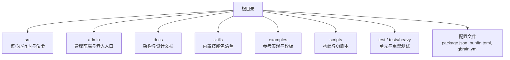
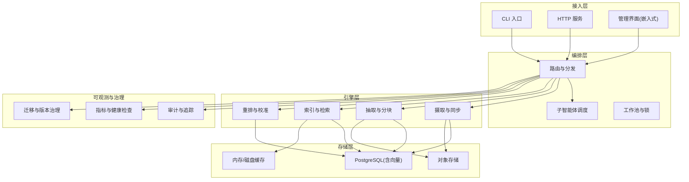
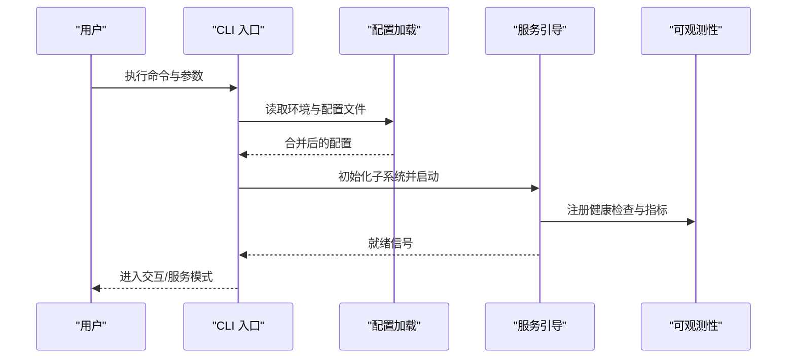
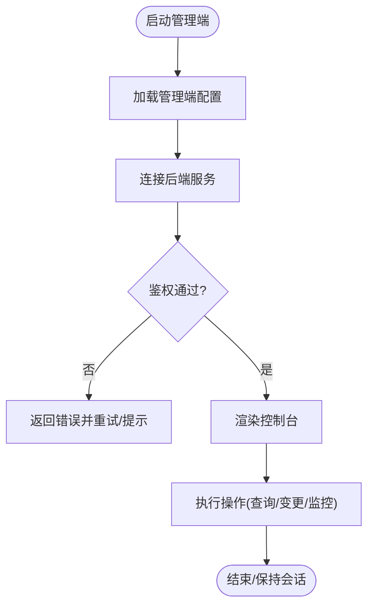
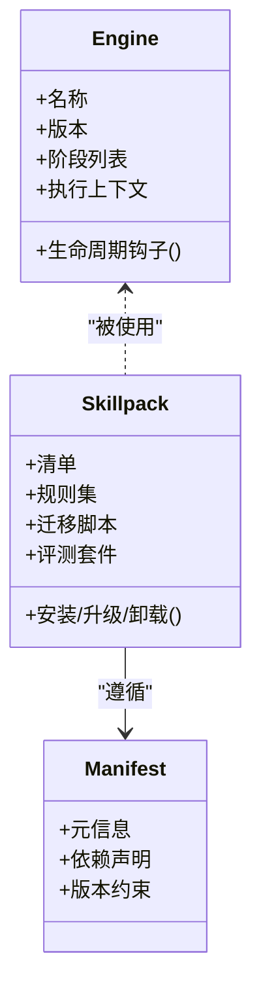
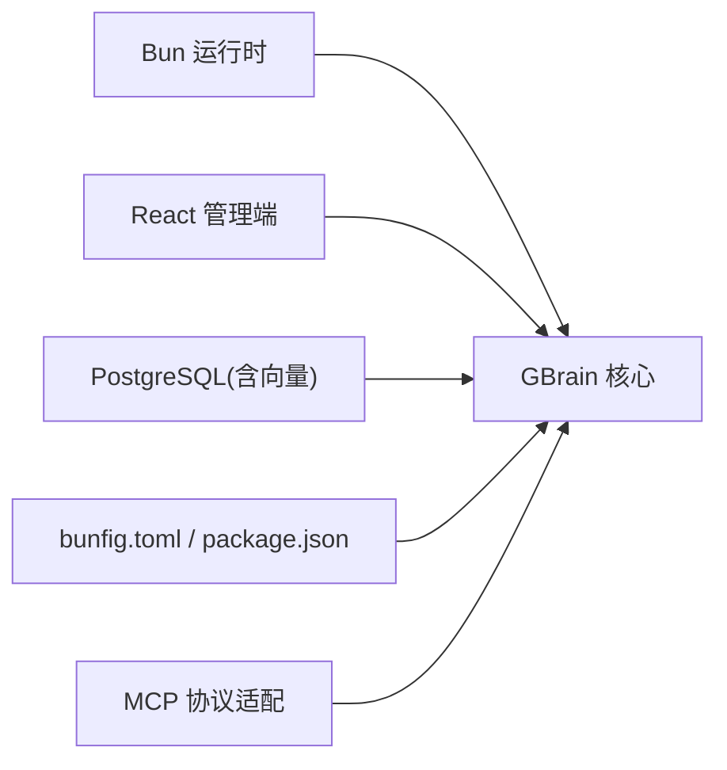

# 项目概述

<cite>
**本文引用的文件**   
- [README.md](file://README.md)
- [DESIGN.md](file://DESIGN.md)
- [package.json](file://package.json)
- [bunfig.toml](file://bunfig.toml)
- [gbrain.yml](file://gbrain.yml)
- [src/cli.ts](file://src/cli.ts)
- [src/admin-embedded.ts](file://src/admin-embedded.ts)
- [admin/DESIGN.md](file://admin/DESIGN.md)
- [docs/INSTALL.md](file://docs/INSTALL.md)
- [docs/ENGINES.md](file://docs/ENGINES.md)
- [docs/GBRAIN_SKILLPACK.md](file://docs/GBRAIN_SKILLPACK.md)
- [skills/manifest.json](file://skills/manifest.json)
</cite>

## 目录
1. [简介](#简介)
2. [项目结构](#项目结构)
3. [核心组件](#核心组件)
4. [架构总览](#架构总览)
5. [详细组件分析](#详细组件分析)
6. [依赖分析](#依赖分析)
7. [性能考量](#性能考量)
8. [故障排查指南](#故障排查指南)
9. [结论](#结论)
10. [附录：术语表](#附录术语表)

## 简介
GBrain 是一个面向企业级 AI 应用的智能体编排引擎与知识管理平台。它以“大脑（Brain）”为核心，将多源异构数据统一建模、索引与检索，并通过可插拔的“技能包（Skillpack）”和“引擎（Engine）”扩展能力，实现从数据采集、抽取、融合到推理与执行的闭环。其设计强调：
- 以事件驱动与插件化为核心的可扩展架构
- 面向生产的高可用、可观测与可治理
- 通过 Schema 与 Skillpack 解耦业务逻辑与运行时
- 提供统一的 CLI、HTTP 与管理界面，便于集成与运维

GBrain 的定位是“AI 智能体编排引擎 + 知识管理中枢”，在企业中承担以下职责：
- 作为统一的知识底座，支撑检索增强生成（RAG）、事实抽取、矛盾检测与质量评估
- 作为智能体编排层，调度子智能体、工具与外部系统，完成复杂任务
- 作为平台化基础设施，为上层应用提供稳定、安全、可审计的 API 与服务

## 项目结构
仓库采用多模块组织方式，核心源码位于 src，管理与前端在 admin，文档集中于 docs，技能包与示例位于 skills 与 examples，测试覆盖 test 与 tests/heavy，构建与脚本在 scripts。

图表来源
- [src/cli.ts:1-50](file://src/cli.ts#L1-L50)
- [src/admin-embedded.ts:1-50](file://src/admin-embedded.ts#L1-L50)
- [admin/DESIGN.md:1-50](file://admin/DESIGN.md#L1-L50)
- [docs/ENGINES.md:1-50](file://docs/ENGINES.md#L1-L50)
- [skills/manifest.json:1-50](file://skills/manifest.json#L1-L50)

章节来源
- [README.md:1-120](file://README.md#L1-L120)
- [DESIGN.md:1-120](file://DESIGN.md#L1-L120)
- [package.json:1-120](file://package.json#L1-L120)
- [bunfig.toml:1-120](file://bunfig.toml#L1-L120)
- [gbrain.yml:1-120](file://gbrain.yml#L1-L120)

## 核心组件
- 命令行入口与进程生命周期：CLI 负责启动、参数解析、服务引导与优雅退出，贯穿整个运行期。
- 嵌入式管理端：提供 Web 管理界面的嵌入点，便于在容器或单二进制内托管。
- 引擎与技能包：引擎定义数据处理与推理流水线；技能包封装具体业务能力，支持安装、升级与版本治理。
- 配置与环境：通过全局配置与运行时环境变量控制行为，包括数据库连接、模型网关、存储分层等。

章节来源
- [src/cli.ts:1-120](file://src/cli.ts#L1-L120)
- [src/admin-embedded.ts:1-120](file://src/admin-embedded.ts#L1-L120)
- [docs/ENGINES.md:1-120](file://docs/ENGINES.md#L1-L120)
- [docs/GBRAIN_SKILLPACK.md:1-120](file://docs/GBRAIN_SKILLPACK.md#L1-L120)
- [gbrain.yml:1-120](file://gbrain.yml#L1-L120)

## 架构总览
GBrain 采用“微内核 + 插件”的架构模式，结合事件驱动与可插拔引擎，形成高内聚、低耦合的系统。整体由以下层次组成：
- 接入层：CLI、HTTP 接口、MCP 协议适配与管理界面
- 编排层：任务路由、子智能体调度、工作池与锁机制
- 引擎层：数据摄取、分块、抽取、索引、检索与重排
- 存储层：PostgreSQL（关系与向量）、对象存储与本地缓存
- 可观测与治理：审计日志、指标、健康检查与迁移

图表来源
- [src/cli.ts:1-120](file://src/cli.ts#L1-L120)
- [src/admin-embedded.ts:1-120](file://src/admin-embedded.ts#L1-L120)
- [docs/ENGINES.md:1-120](file://docs/ENGINES.md#L1-L120)
- [docs/GBRAIN_SKILLPACK.md:1-120](file://docs/GBRAIN_SKILLPACK.md#L1-L120)

## 详细组件分析

### 命令行入口与进程引导
- 职责：解析参数、加载配置、初始化子系统、启动服务、处理信号与退出码。
- 关键点：
  - 参数与配置合并策略，确保开发/测试/生产环境一致性
  - 优雅关闭流程，保证事务与队列的完整性
  - 与嵌入式管理端的集成路径

图表来源
- [src/cli.ts:1-120](file://src/cli.ts#L1-L120)
- [bunfig.toml:1-120](file://bunfig.toml#L1-L120)
- [gbrain.yml:1-120](file://gbrain.yml#L1-L120)

章节来源
- [src/cli.ts:1-120](file://src/cli.ts#L1-L120)
- [bunfig.toml:1-120](file://bunfig.toml#L1-L120)
- [gbrain.yml:1-120](file://gbrain.yml#L1-L120)

### 嵌入式管理界面
- 职责：提供可视化控制台，用于脑库管理、作业监控、配置与诊断。
- 关键点：
  - 与后端服务的通信契约（REST/MCP）
  - 权限与安全边界
  - 与 CLI 的生命周期协同

图表来源
- [src/admin-embedded.ts:1-120](file://src/admin-embedded.ts#L1-L120)
- [admin/DESIGN.md:1-120](file://admin/DESIGN.md#L1-L120)

章节来源
- [src/admin-embedded.ts:1-120](file://src/admin-embedded.ts#L1-L120)
- [admin/DESIGN.md:1-120](file://admin/DESIGN.md#L1-L120)

### 引擎与技能包体系
- 引擎：定义数据处理的阶段与流水线，如摄取、抽取、索引、检索、重排等。
- 技能包：封装领域能力，包含清单、规则、迁移与评测，支持安装、升级与回滚。
- 关系：引擎提供通用能力，技能包基于引擎组合出业务方案。

图表来源
- [docs/ENGINES.md:1-120](file://docs/ENGINES.md#L1-L120)
- [docs/GBRAIN_SKILLPACK.md:1-120](file://docs/GBRAIN_SKILLPACK.md#L1-L120)
- [skills/manifest.json:1-120](file://skills/manifest.json#L1-L120)

章节来源
- [docs/ENGINES.md:1-120](file://docs/ENGINES.md#L1-L120)
- [docs/GBRAIN_SKILLPACK.md:1-120](file://docs/GBRAIN_SKILLPACK.md#L1-L120)
- [skills/manifest.json:1-120](file://skills/manifest.json#L1-L120)

## 依赖分析
- 语言与运行时：Bun 作为高性能运行时，提升启动与并发性能。
- 前端：React 生态用于管理界面与可视化。
- 数据库：PostgreSQL 作为主存储，结合向量扩展支持语义检索。
- 配置与打包：bunfig.toml 与 package.json 统一管理依赖与构建选项。
- 外部集成：通过 MCP 协议与外部系统进行工具调用与消息交换。

图表来源
- [package.json:1-120](file://package.json#L1-L120)
- [bunfig.toml:1-120](file://bunfig.toml#L1-L120)
- [docs/INSTALL.md:1-120](file://docs/INSTALL.md#L1-L120)

章节来源
- [package.json:1-120](file://package.json#L1-L120)
- [bunfig.toml:1-120](file://bunfig.toml#L1-L120)
- [docs/INSTALL.md:1-120](file://docs/INSTALL.md#L1-L120)

## 性能考量
- 并发与资源隔离：利用 Bun 的并发优势与工作池，合理设置并行度与超时。
- 存储分层：热数据走内存/近线存储，冷数据下沉至对象存储，降低延迟与成本。
- 索引与检索：向量化与全文检索混合，结合重排与召回优化提升准确率。
- 可观测性：通过指标与健康检查定位瓶颈，配合灰度与限流保障稳定性。

[本节为通用指导，不直接分析具体文件]

## 故障排查指南
- 启动失败：检查 CLI 参数与配置文件是否冲突，确认数据库连接与网络可达。
- 服务不可用：查看健康检查与指标，关注工作池与锁状态，排查死锁与OOM。
- 技能包异常：校验清单与依赖版本，检查迁移脚本与评测套件输出。
- 检索质量差：核对索引阶段与重排策略，验证模型与权重配置。

章节来源
- [docs/INSTALL.md:1-120](file://docs/INSTALL.md#L1-L120)
- [docs/ENGINES.md:1-120](file://docs/ENGINES.md#L1-L120)
- [docs/GBRAIN_SKILLPACK.md:1-120](file://docs/GBRAIN_SKILLPACK.md#L1-L120)

## 结论
GBrain 以“大脑”为中心，通过引擎与技能包的解耦设计，为企业级 AI 应用提供了可扩展、可治理、可观测的智能体编排与知识管理基座。借助 Bun、PostgreSQL、React 等技术栈，以及微服务、事件驱动与插件架构，GBrain 能够在复杂业务场景中稳定交付高质量结果，并为后续演进预留充足空间。

[本节为总结性内容，不直接分析具体文件]

## 附录：术语表
- 大脑（Brain）：项目的核心实体，承载知识图谱、索引与检索能力。
- 引擎（Engine）：定义数据处理流水线与阶段的抽象，如摄取、抽取、索引、检索、重排。
- 技能包（Skillpack）：封装领域能力的可安装单元，包含清单、规则、迁移与评测。
- 清单（Manifest）：描述技能包元信息、依赖与版本的声明文件。
- 摄取（Ingest）：从外部源拉取数据并入库的过程。
- 抽取（Extract）：从非结构化内容中提取结构化事实与片段。
- 索引（Index）：对数据进行向量化与全文索引，支持高效检索。
- 检索（Retrieval）：根据查询条件召回相关片段与实体。
- 重排（Rerank）：对召回结果进行排序与校准，提升相关性。
- 子智能体（Subagent）：由编排层调度的独立执行单元，完成特定任务。
- 工作池（Worker Pool）：管理并发任务的线程/进程集合。
- 锁（Lock）：分布式或进程间锁，避免竞态与重复执行。
- 审计（Audit）：记录关键操作的日志与轨迹，满足合规与追溯。
- 指标（Metrics）：系统运行时的度量数据，用于监控与告警。
- 迁移（Migration）：数据库与配置的版本演进脚本。
- MCP：Model Context Protocol，用于与外部系统进行工具调用与消息交换的协议。

[本节为概念说明，不直接分析具体文件]