# 安全架构

<cite>
**本文引用的文件**   
- [SECURITY.md](file://SECURITY.md)
- [.gitleaks.toml](file://.gitleaks.toml)
- [guardrails.md](file://docs/guardrails.md)
- [trust-boundary-contract.test.ts](file://test/trust-boundary-contract.test.ts)
- [operations-trust-boundary.test.ts](file://test/operations-trust-boundary.test.ts)
- [skill-catalog-security.test.ts](file://test/skill-catalog-security.test.ts)
- [mcp-client-hardening.test.ts](file://test/mcp-client-hardening.test.ts)
- [ssrf-validate.test.ts](file://test/ssrf-validate.test.ts)
- [redos-hardening.test.ts](file://test/redos-hardening.test.ts)
- [serve-http-health.test.ts](file://test/serve-http-health.test.ts)
- [serve-http-cors.test.ts](file://test/serve-http-cors.test.ts)
- [serve-http-trust-proxy.test.ts](file://test/serve-http-trust-proxy.test.ts)
- [serve-http-bootstrap-token.test.ts](file://test/serve-http-bootstrap-token.test.ts)
- [source-config-redact.test.ts](file://test/source-config-redact.test.ts)
- [check-pg-url-redaction.sh](file://scripts/check-pg-url-redaction.sh)
- [check-no-pii-in-agent-voice.sh](file://scripts/check-no-pii-in-agent-voice.sh)
- [check-privacy.sh](file://scripts/check-privacy.sh)
- [check-fixture-privacy.sh](file://scripts/check-fixture-privacy.sh)
- [check-proposal-pii.sh](file://scripts/check-proposal-pii.sh)
- [check-source-config-leak.sh](file://scripts/check-source-config-leak.sh)
- [check-synthetic-corpus-privacy.sh](file://scripts/check-synthetic-corpus-privacy.sh)
- [anomalies.test.ts](file://test/anomalies.test.ts)
- [rate-leases.test.ts](file://test/rate-leases.test.ts)
- [rate-leases-uncapped.test.ts](file://test/rate-leases-uncapped.test.ts)
- [supervisor-audit.test.ts](file://test/supervisor-audit.test.ts)
- [subagent-audit.test.ts](file://test/subagent-audit.test.ts)
- [filing-audit.test.ts](file://test/filing-audit.test.ts)
- [audit-slug-fallback.serial.test.ts](file://test/audit-slug-fallback.serial.test.ts)
- [audit-synopsis.serial.test.ts](file://test/audit-synopsis.serial.test.ts)
- [db-disconnect-audit.test.ts](file://test/db-disconnect-audit.test.ts)
- [oauth.test.ts](file://test/oauth.test.ts)
- [oauth-authorize-scope-default.test.ts](file://test/oauth-authorize-scope-default.test.ts)
- [oauth-confidential-client.test.ts](file://test/oauth-confidential-client.test.ts)
- [oauth-scope-probe.test.ts](file://test/oauth-scope-probe.test.ts)
- [query-sanitization.test.ts](file://test/query-sanitization.test.ts)
- [think-sanitize-trajectory.test.ts](file://test/think-sanitize-trajectory.test.ts)
- [minions-shell-redact.test.ts](file://test/minions-shell-redact.test.ts)
- [eval-capture-scrub.test.ts](file://test/eval-capture-scrub.test.ts)
- [eval-catch-all-error-handling.test.ts](file://test/eval-catch-all-error-handling.test.ts)
- [error-classify.test.ts](file://test/error-classify.test.ts)
- [errors.test.ts](file://test/errors.test.ts)
- [timeout.test.ts](file://test/timeout.test.ts)
- [process-watchdog.test.ts](file://test/process-watchdog.test.ts)
- [worker-supervised-db-probe.test.ts](file://test/worker-supervised-db-probe.test.ts)
- [worker-lock-renewal.test.ts](file://test/worker-lock-renewal.test.ts)
- [worker-lock-renewal-shape.test.ts](file://test/worker-lock-renewal-shape.test.ts)
- [worker-lock-renewal-e2e.serial.test.ts](file://test/worker-lock-renewal-e2e.serial.test.ts)
- [reindex-cost-refusal.test.ts](file://test/reindex-cost-refusal.test.ts)
- [token-budget.test.ts](file://test/token-budget.test.ts)
- [budget-meter.test.ts](file://test/budget-meter.test.ts)
- [budget-tracker.test.ts](file://test/budget-tracker.test.ts)
- [llm-intent-hybrid-integration.serial.test.ts](file://test/llm-intent-hybrid-integration.serial.test.ts)
- [llm-intent-escalation.test.ts](file://test/llm-intent-escalation.test.ts)
- [think-intent.test.ts](file://test/think-intent.test.ts)
- [think-trajectory-injection.test.ts](file://test/think-trajectory-injection.test.ts)
- [gateway-model-messages.test.ts](file://test/gateway-model-messages.test.ts)
- [openai-compat-multimodal.test.ts](file://test/openai-compat-multimodal.test.ts)
- [voyage-response-cap.test.ts](file://test/voyage-response-cap.test.ts)
- [anthropic-pricing.test.ts](file://test/anthropic-pricing.test.ts)
- [model-pricing.test.ts](file://test/model-pricing.test.ts)
- [embedding-signature-stale.test.ts](file://test/embedding-signature-stale.test.ts)
- [embed-input-type-wire.serial.test.ts](file://test/embed-input-type-wire.serial.test.ts)
- [embed-preflight.test.ts](file://test/embed-preflight.test.ts)
- [schema-pack-trust-boundary.test.ts](file://test/schema-pack-trust边界.test.ts)
- [scope-agent-isolation.test.ts](file://test/scope-agent-isolation.test.ts)
- [gbrain-home-isolation.test.ts](file://test/gbrain-home-isolation.test.ts)
- [file-upload-security.test.ts](file://test/file-upload-security.test.ts)
- [check-operations-filter-bypass.sh](file://scripts/check-operations-filter-bypass.sh)
- [check-gateway-routed-no-direct-anthropic.sh](file://scripts/check-gateway-routed-no-direct-anthropic.sh)
</cite>

## 目录
1. [简介](#简介)
2. [项目结构](#项目结构)
3. [核心组件](#核心组件)
4. [架构总览](#架构总览)
5. [详细组件分析](#详细组件分析)
6. [依赖分析](#依赖分析)
7. [性能考虑](#性能考虑)
8. [故障排查指南](#故障排查指南)
9. [结论](#结论)
10. [附录](#附录)

## 简介
本文件面向GBrain的安全架构，系统性阐述安全设计原则、威胁防护机制与合规要求。内容覆盖输入验证、输出过滤、沙箱隔离、身份认证与授权、数据保护（脱敏与传输加密）、API安全（限流与异常检测）、审计日志与安全事件响应、漏洞管理流程，以及安全配置最佳实践、安全扫描集成与合规检查清单。文档以仓库中的测试与脚本为依据，确保可追溯与可落地。

## 项目结构
从安全视角看，GBrain在以下层面具备完善的安全能力：
- 策略与规范：安全政策、供应链与密钥泄露扫描、隐私合规检查等
- 运行时防护：HTTP服务加固、CORS与代理信任、SSRF与正则拒绝服务防护、意图识别与越权拦截
- 数据与模型：敏感信息脱敏、查询与轨迹清洗、模型调用预算与成本拒绝
- 进程与资源：超时、看门狗、锁续期与数据库探针
- 审计与可观测：操作审计、子代理审计、文件归档审计、数据库断开审计
- 合规与治理：OAuth范围默认值、机密客户端、评估捕获清理、合成语料隐私

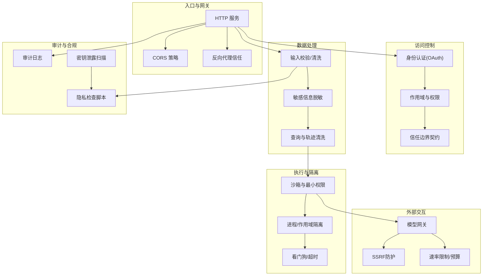

[此图为概念性结构图，不直接映射具体源码文件]

## 核心组件
- 安全策略与规范
  - 安全政策与披露流程
  - 密钥与敏感信息泄露扫描
  - 隐私与PII检查脚本集
- 访问控制与信任边界
  - OAuth认证与作用域默认值
  - 机密客户端与范围探测
  - 信任边界契约与操作级信任边界
- 输入/输出与数据保护
  - 输入校验与查询清洗
  - 敏感信息脱敏（配置、URL、评估捕获）
  - 模型消息与多模态输入校验
- 执行环境与隔离
  - 沙箱与最小权限
  - 进程/作用域隔离与Home目录隔离
  - 超时与看门狗、锁续期与DB探针
- 外部交互与网络防护
  - SSRF防护
  - 模型网关路由与直连阻断
  - 速率限制与预算控制
- 审计与可观测
  - 操作审计、子代理审计、文件归档审计、数据库断开审计
- 合规与治理
  - 隐私检查、合成语料隐私、提案PII检查
  - 评估捕获清理与错误分类

**章节来源**
- [SECURITY.md](file://SECURITY.md)
- [.gitleaks.toml](file://.gitleaks.toml)
- [guardrails.md](file://docs/guardrails.md)

## 架构总览
下图展示从请求进入、鉴权、输入校验、执行隔离到输出过滤与审计的端到端路径，并标注关键安全点。

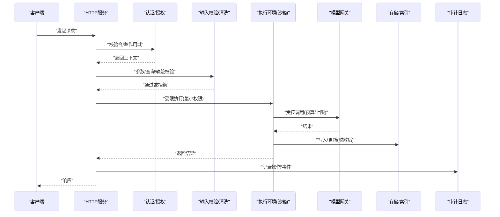

[此图为概念性序列图，不直接映射具体源码文件]

## 详细组件分析

### 输入验证与输出过滤
- 输入验证
  - 查询与轨迹清洗：对查询与思维轨迹进行清洗，防止注入与污染
  - 模型消息与多模态输入：对模型消息结构与类型进行校验，避免畸形输入
- 输出过滤
  - 评估捕获清理：在评估过程中清理敏感片段
  - 查询结果与轨迹输出：确保不包含未脱敏的敏感信息

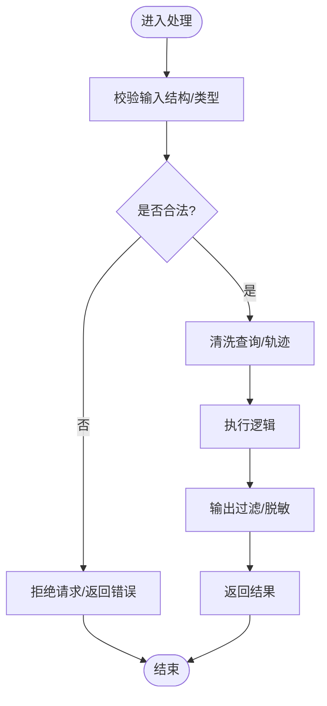

**章节来源**
- [query-sanitization.test.ts](file://test/query-sanitization.test.ts)
- [think-sanitize-trajectory.test.ts](file://test/think-sanitize-trajectory.test.ts)
- [gateway-model-messages.test.ts](file://test/gateway-model-messages.test.ts)
- [openai-compat-multimodal.test.ts](file://test/openai-compat-multimodal.test.ts)
- [eval-capture-scrub.test.ts](file://test/eval-capture-scrub.test.ts)

### 沙箱隔离与最小权限
- 沙箱与最小权限
  - 子代理与技能执行采用最小权限原则，限制系统调用与文件系统访问
- 进程/作用域隔离
  - 基于作用域的Agent隔离与Home目录隔离，防止跨脑/跨用户数据泄漏
- 超时与看门狗
  - 强制超时与进程看门狗，避免长时间占用与僵尸进程

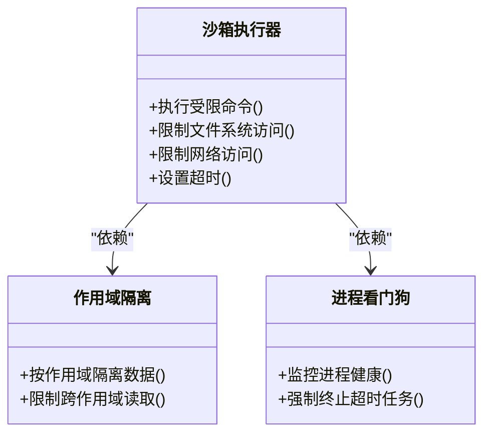

**章节来源**
- [skill-catalog-security.test.ts](file://test/skill-catalog-security.test.ts)
- [scope-agent-isolation.test.ts](file://test/scope-agent-isolation.test.ts)
- [gbrain-home-isolation.test.ts](file://test/gbrain-home-isolation.test.ts)
- [timeout.test.ts](file://test/timeout.test.ts)
- [process-watchdog.test.ts](file://test/process-watchdog.test.ts)

### 身份认证、授权与访问控制
- 身份认证
  - OAuth支持，包括授权码流程与范围探测
- 授权与范围
  - 默认作用域策略与机密客户端校验
- 信任边界
  - 信任边界契约与操作级信任边界，确保跨模块调用遵循最小权限

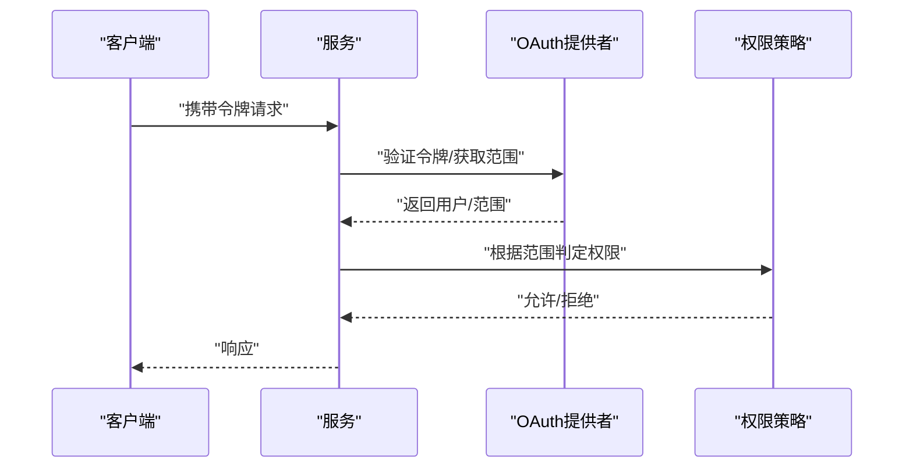

**章节来源**
- [oauth.test.ts](file://test/oauth.test.ts)
- [oauth-authorize-scope-default.test.ts](file://test/oauth-authorize-scope-default.test.ts)
- [oauth-confidential-client.test.ts](file://test/oauth-confidential-client.test.ts)
- [oauth-scope-probe.test.ts](file://test/oauth-scope-probe.test.ts)
- [trust-boundary-contract.test.ts](file://test/trust-boundary-contract.test.ts)
- [operations-trust-boundary.test.ts](file://test/operations-trust-boundary.test.ts)

### 数据安全保护、敏感信息脱敏与传输加密
- 敏感信息脱敏
  - 源配置脱敏、PostgreSQL URL脱敏、评估捕获清理、合成语料隐私检查
- 传输加密
  - 通过HTTPS与反向代理信任配置保障传输安全
- 隐私合规
  - 通用隐私检查脚本与PII扫描

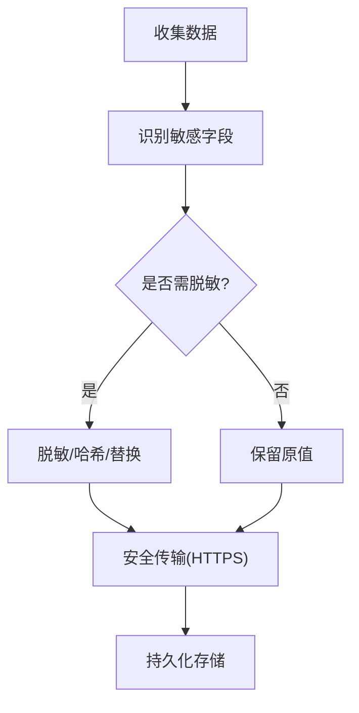

**章节来源**
- [source-config-redact.test.ts](file://test/source-config-redact.test.ts)
- [check-pg-url-redaction.sh](file://scripts/check-pg-url-redaction.sh)
- [eval-capture-scrub.test.ts](file://test/eval-capture-scrub.test.ts)
- [check-synthetic-corpus-privacy.sh](file://scripts/check-synthetic-corpus-privacy.sh)
- [check-privacy.sh](file://scripts/check-privacy.sh)
- [check-no-pii-in-agent-voice.sh](file://scripts/check-no-pii-in-agent-voice.sh)
- [check-proposal-pii.sh](file://scripts/check-proposal-pii.sh)
- [serve-http-trust-proxy.test.ts](file://test/serve-http-trust-proxy.test.ts)
- [serve-http-cors.test.ts](file://test/serve-http-cors.test.ts)

### API安全防护、请求限流与异常检测
- API安全
  - CORS策略、反向代理信任、引导令牌
- 请求限流与预算
  - 租约速率限制、Token预算与成本拒绝
- 异常检测与错误分类
  - 异常模式检测、错误分类与统一错误处理

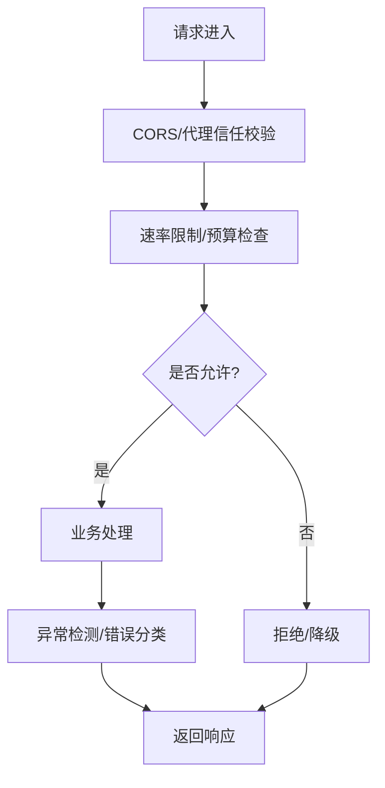

**章节来源**
- [serve-http-health.test.ts](file://test/serve-http-health.test.ts)
- [serve-http-cors.test.ts](file://test/serve-http-cors.test.ts)
- [serve-http-trust-proxy.test.ts](file://test/serve-http-trust-proxy.test.ts)
- [serve-http-bootstrap-token.test.ts](file://test/serve-http-bootstrap-token.test.ts)
- [rate-leases.test.ts](file://test/rate-leases.test.ts)
- [rate-leases-uncapped.test.ts](file://test/rate-leases-uncapped.test.ts)
- [token-budget.test.ts](file://test/token-budget.test.ts)
- [budget-meter.test.ts](file://test/budget-meter.test.ts)
- [budget-tracker.test.ts](file://test/budget-tracker.test.ts)
- [reindex-cost-refusal.test.ts](file://test/reindex-cost-refusal.test.ts)
- [anomalies.test.ts](file://test/anomalies.test.ts)
- [error-classify.test.ts](file://test/error-classify.test.ts)
- [errors.test.ts](file://test/errors.test.ts)

### 安全审计日志、安全事件响应与漏洞管理
- 审计日志
  - 操作审计、子代理审计、文件归档审计、数据库断开审计、审计摘要与回退
- 安全事件响应
  - 异常检测与错误分类驱动的事件上报与处置
- 漏洞管理
  - 安全披露流程与密钥泄露扫描

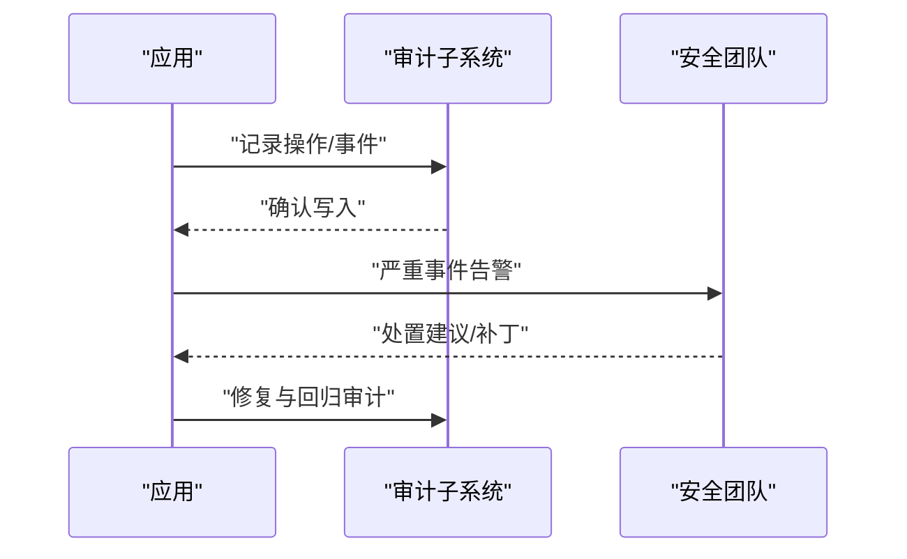

**章节来源**
- [supervisor-audit.test.ts](file://test/supervisor-audit.test.ts)
- [subagent-audit.test.ts](file://test/subagent-audit.test.ts)
- [filing-audit.test.ts](file://test/filing-audit.test.ts)
- [audit-slug-fallback.serial.test.ts](file://test/audit-slug-fallback.serial.test.ts)
- [audit-synopsis.serial.test.ts](file://test/audit-synopsis.serial.test.ts)
- [db-disconnect-audit.test.ts](file://test/db-disconnect-audit.test.ts)
- [SECURITY.md](file://SECURITY.md)
- [.gitleaks.toml](file://.gitleaks.toml)

### 外部交互与网络防护
- SSRF防护
  - 对外部URL访问进行白名单/域名校验与协议限制
- 模型网关路由
  - 禁止直连特定供应商，强制走网关；对响应长度与价格进行约束
- MCP客户端加固
  - 强化MCP客户端行为，防止恶意工具定义与越权调用

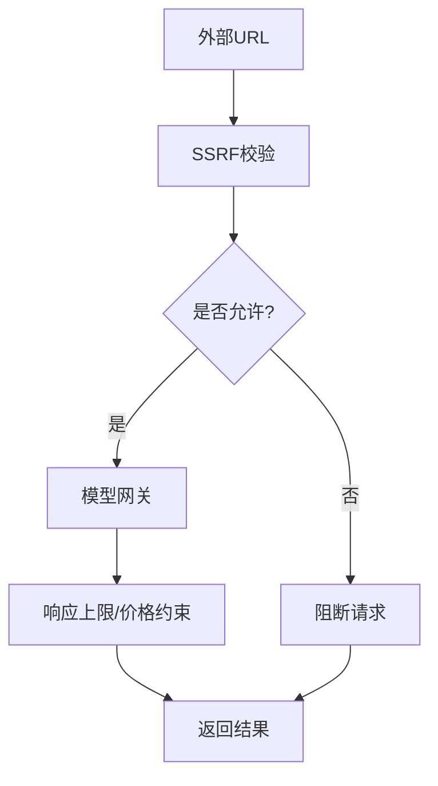

**章节来源**
- [ssrf-validate.test.ts](file://test/ssrf-validate.test.ts)
- [check-gateway-routed-no-direct-anthropic.sh](file://scripts/check-gateway-routed-no-direct-anthropic.sh)
- [voyage-response-cap.test.ts](file://test/voyage-response-cap.test.ts)
- [anthropic-pricing.test.ts](file://test/anthropic-pricing.test.ts)
- [model-pricing.test.ts](file://test/model-pricing.test.ts)
- [mcp-client-hardening.test.ts](file://test/mcp-client-hardening.test.ts)

### 意图识别、越权拦截与注入防护
- 意图识别与升级
  - 对高风险意图进行检测与升级，结合网关与预算控制
- 轨迹注入防护
  - 对思维轨迹与提示注入进行防护
- 操作过滤器绕过防护
  - 针对操作过滤器的绕过场景进行检查与加固

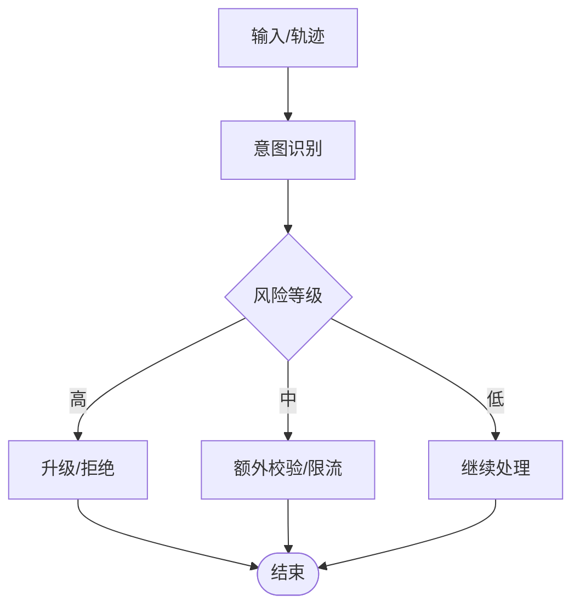

**章节来源**
- [llm-intent-hybrid-integration.serial.test.ts](file://test/llm-intent-hybrid-integration.serial.test.ts)
- [llm-intent-escalation.test.ts](file://test/llm-intent-escalation.test.ts)
- [think-intent.test.ts](file://test/think-intent.test.ts)
- [think-trajectory-injection.test.ts](file://test/think-trajectory-injection.test.ts)
- [check-operations-filter-bypass.sh](file://scripts/check-operations-filter-bypass.sh)

### 嵌入与向量索引安全
- 嵌入签名与版本一致性
  - 嵌入签名过期检测，防止旧模型产物被误用
- 输入类型与预检
  - 嵌入输入类型校验与预检，避免非法数据进入索引

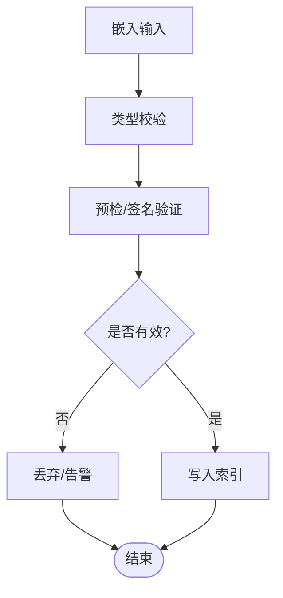

**章节来源**
- [embedding-signature-stale.test.ts](file://test/embedding-signature-stale.test.ts)
- [embed-input-type-wire.serial.test.ts](file://test/embed-input-type-wire.serial.test.ts)
- [embed-preflight.test.ts](file://test/embed-preflight.test.ts)

### 进程与资源健壮性
- 锁续期与DB探针
  - 工作锁续期形状与E2E验证，数据库探针确保连接健康
- 超时与看门狗
  - 强制超时与进程看门狗，避免资源耗尽

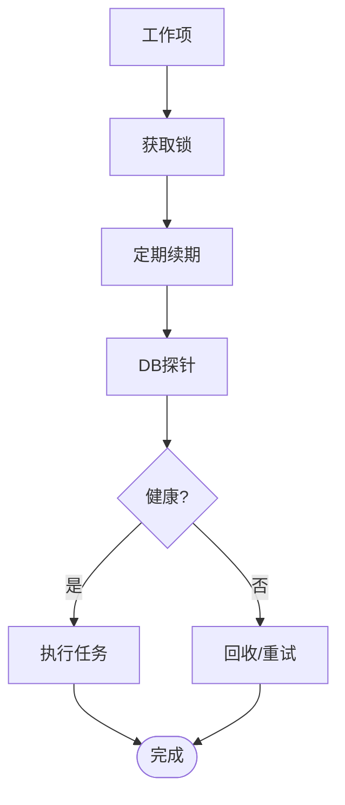

**章节来源**
- [worker-lock-renewal.test.ts](file://test/worker-lock-renewal.test.ts)
- [worker-lock-renewal-shape.test.ts](file://test/worker-lock-renewal-shape.test.ts)
- [worker-lock-renewal-e2e.serial.test.ts](file://test/worker-lock-renewal-e2e.serial.test.ts)
- [worker-supervised-db-probe.test.ts](file://test/worker-supervised-db-probe.test.ts)
- [timeout.test.ts](file://test/timeout.test.ts)
- [process-watchdog.test.ts](file://test/process-watchdog.test.ts)

## 依赖分析
- 组件耦合与内聚
  - 输入校验与输出过滤集中在处理链路前端与出口，降低下游风险
  - 认证与授权作为前置依赖，贯穿所有受保护接口
  - 审计与隐私检查作为横切关注点，贯穿各子系统
- 外部依赖与集成点
  - OAuth提供者、模型网关、数据库与对象存储
- 潜在循环依赖
  - 通过分层与接口抽象避免循环依赖，如将审计与隐私检查解耦为独立模块

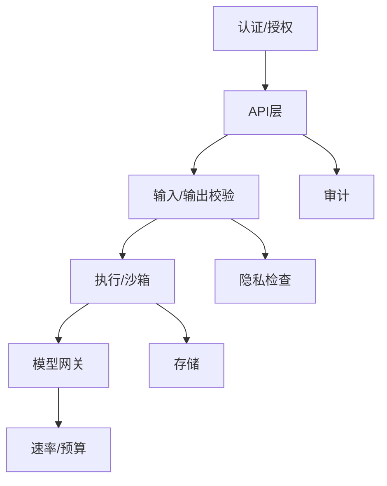

[此图为概念性依赖图，不直接映射具体源码文件]

## 性能考虑
- 限流与预算控制有助于在高并发下保护后端资源
- 脱敏与清洗应在尽可能早的阶段进行，减少不必要的数据流转
- 嵌入预检与签名校验可降低无效计算与索引重建开销
- 锁续期与DB探针提升系统稳定性，避免长事务导致的性能退化

[本节提供一般性指导，无需源码引用]

## 故障排查指南
- 常见问题定位
  - 认证失败：检查OAuth令牌与作用域配置
  - 输入校验失败：查看查询与轨迹清洗规则
  - 速率限制触发：调整预算与配额策略
  - 审计缺失：确认审计写入与回退逻辑
- 调试建议
  - 启用详细错误分类与异常检测
  - 使用隐私检查脚本快速发现敏感信息泄漏
  - 使用密钥泄露扫描工具定位硬编码凭证

**章节来源**
- [error-classify.test.ts](file://test/error-classify.test.ts)
- [errors.test.ts](file://test/errors.test.ts)
- [anomalies.test.ts](file://test/anomalies.test.ts)
- [check-privacy.sh](file://scripts/check-privacy.sh)
- [.gitleaks.toml](file://.gitleaks.toml)

## 结论
GBrain的安全架构围绕“最小权限、纵深防御、可观测与可审计”的原则构建。通过严格的输入验证与输出过滤、完善的认证与授权、全面的敏感信息脱敏与传输加密、强大的沙箱与隔离、健壮的限流与异常检测、以及完备的审计与合规检查，系统在威胁防护与合规方面具备较强的工程化落地能力。建议在持续集成中常态化运行隐私与密钥扫描，并将安全策略纳入变更评审流程。

## 附录
- 安全配置最佳实践
  - 强制HTTPS与严格CORS策略
  - 最小权限与默认拒绝的授权策略
  - 统一的脱敏与清洗规则
  - 明确的速率限制与预算阈值
- 安全扫描集成
  - 在CI中集成密钥泄露扫描与隐私检查脚本
  - 对模型网关与外部URL访问进行白名单校验
- 安全合规检查清单
  - 认证与授权：OAuth范围默认值、机密客户端、作用域探测
  - 数据保护：配置与URL脱敏、评估捕获清理、合成语料隐私
  - 网络与执行：SSRF防护、MCP客户端加固、沙箱与隔离
  - 审计与事件：操作/子代理/归档/DB断开审计
  - 性能与稳定：锁续期、DB探针、超时与看门狗

**章节来源**
- [SECURITY.md](file://SECURITY.md)
- [.gitleaks.toml](file://.gitleaks.toml)
- [guardrails.md](file://docs/guardrails.md)
- [check-privacy.sh](file://scripts/check-privacy.sh)
- [check-no-pii-in-agent-voice.sh](file://scripts/check-no-pii-in-agent-voice.sh)
- [check-proposal-pii.sh](file://scripts/check-proposal-pii.sh)
- [check-synthetic-corpus-privacy.sh](file://scripts/check-synthetic-corpus-privacy.sh)
- [source-config-redact.test.ts](file://test/source-config-redact.test.ts)
- [check-pg-url-redaction.sh](file://scripts/check-pg-url-redaction.sh)
- [ssrf-validate.test.ts](file://test/ssrf-validate.test.ts)
- [mcp-client-hardening.test.ts](file://test/mcp-client-hardening.test.ts)
- [rate-leases.test.ts](file://test/rate-leases.test.ts)
- [token-budget.test.ts](file://test/token-budget.test.ts)
- [supervisor-audit.test.ts](file://test/supervisor-audit.test.ts)
- [subagent-audit.test.ts](file://test/subagent-audit.test.ts)
- [filing-audit.test.ts](file://test/filing-audit.test.ts)
- [db-disconnect-audit.test.ts](file://test/db-disconnect-audit.test.ts)
- [worker-lock-renewal.test.ts](file://test/worker-lock-renewal.test.ts)
- [worker-supervised-db-probe.test.ts](file://test/worker-supervised-db-probe.test.ts)
- [timeout.test.ts](file://test/timeout.test.ts)
- [process-watchdog.test.ts](file://test/process-watchdog.test.ts)