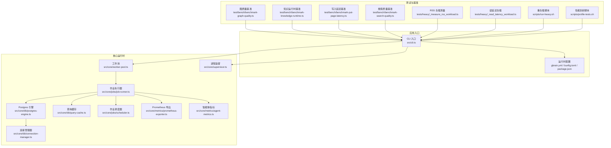
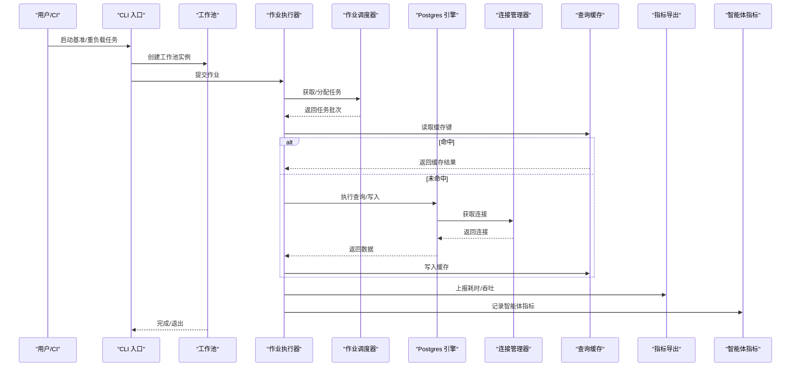
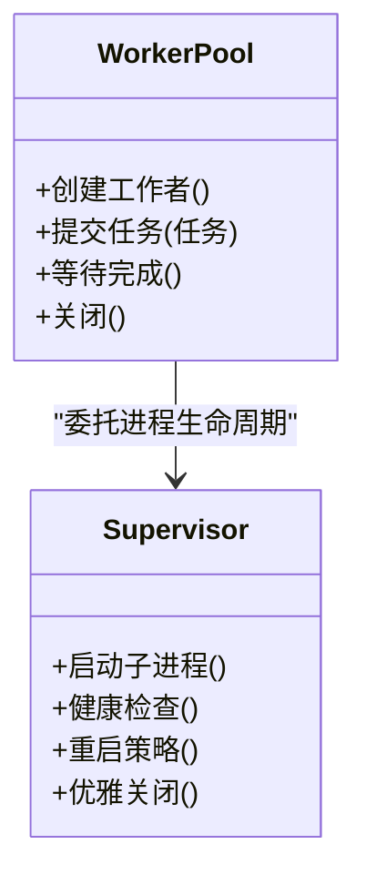
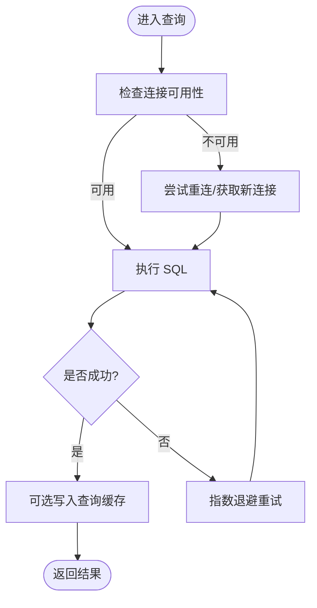
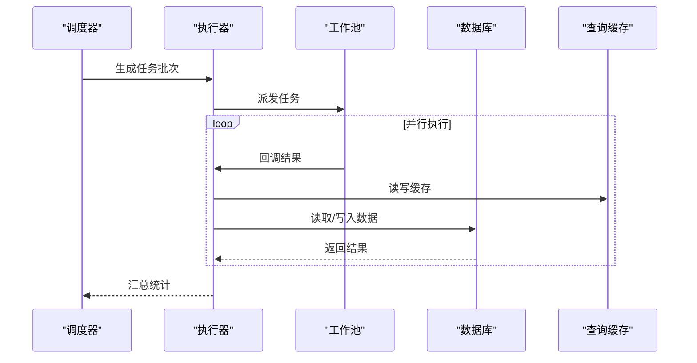
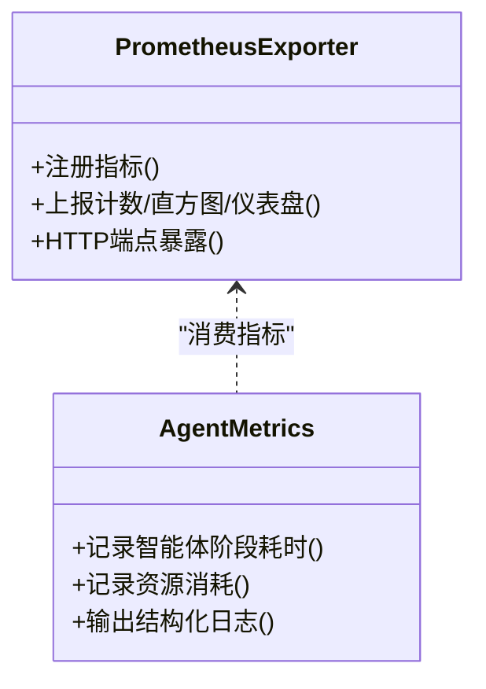
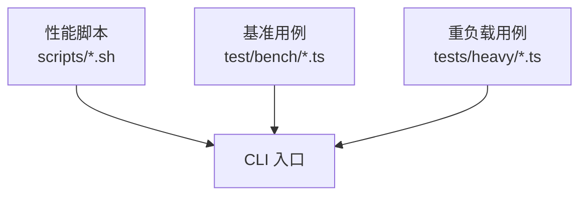
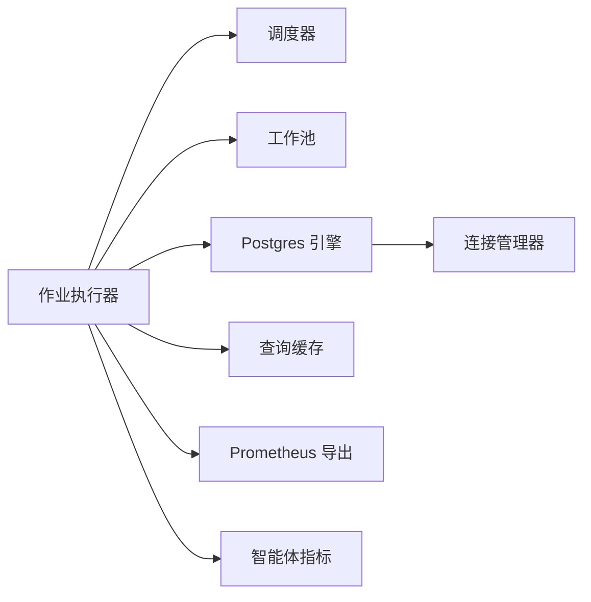

# 性能优化

<cite>
**本文引用的文件**   
- [package.json](file://package.json)
- [bunfig.toml](file://bunfig.toml)
- [gbrain.yml](file://gbrain.yml)
- [src/cli.ts](file://src/cli.ts)
- [src/core/worker-pool.ts](file://src/core/worker-pool.ts)
- [src/core/supervisor.ts](file://src/core/supervisor.ts)
- [src/core/db/postgres-engine.ts](file://src/core/db/postgres-engine.ts)
- [src/core/db/query-cache.ts](file://src/core/db/query-cache.ts)
- [src/core/db/connection-manager.ts](file://src/core/db/connection-manager.ts)
- [src/core/jobs/job-runner.ts](file://src/core/jobs/job-runner.ts)
- [src/core/jobs/scheduler.ts](file://src/core/jobs/scheduler.ts)
- [src/core/metrics/prometheus-exporter.ts](file://src/core/metrics/prometheus-exporter.ts)
- [src/core/metrics/agent-metrics.ts](file://src/core/metrics/agent-metrics.ts)
- [scripts/run-heavy.sh](file://scripts/run-heavy.sh)
- [scripts/profile-tests.sh](file://scripts/profile-tests.sh)
- [test/bench/benchmark-graph-quality.ts](file://test/bench/benchmark-graph-quality.ts)
- [test/bench/benchmark-knowledge-runtime.ts](file://test/bench/benchmark-knowledge-runtime.ts)
- [test/bench/benchmark-put-page-latency.ts](file://test/bench/benchmark-put-page-latency.ts)
- [test/bench/benchmark-search-quality.ts](file://test/bench/benchmark-search-quality.ts)
- [tests/heavy/_measure_rss_workload.ts](file://tests/heavy/_measure_rss_workload.ts)
- [tests/heavy/_read_latency_workload.ts](file://tests/heavy/_read_latency_workload.ts)
</cite>

## 目录
1. [简介](#简介)
2. [项目结构](#项目结构)
3. [核心组件](#核心组件)
4. [架构总览](#架构总览)
5. [详细组件分析](#详细组件分析)
6. [依赖分析](#依赖分析)
7. [性能考量](#性能考量)
8. [故障排查指南](#故障排查指南)
9. [结论](#结论)
10. [附录](#附录)

## 简介
本文件面向 gbrain 项目的性能优化，聚焦系统级调优策略、内存管理与并发处理。内容覆盖智能体执行的性能监控指标、资源使用分析与瓶颈识别方法；数据库查询优化、索引策略与连接池配置；工作池管理、任务调度优化与负载均衡；大规模数据处理最佳实践、缓存机制设计与异步处理优化；并提供基准测试方法、压力测试场景与性能回归检测方案。文档同时给出内存泄漏检测、垃圾回收调优与资源清理策略建议，帮助读者在生产环境中稳定、高效地运行系统。

## 项目结构
仓库采用分层与按功能域组织的方式：
- src/core 包含核心运行时能力（工作池、进程监督、数据库引擎、查询缓存、作业调度与执行器、指标导出等）
- scripts 提供构建、测试与性能相关脚本
- test/bench 与 tests/heavy 提供基准与重负载测试工具
- 根配置文件 package.json、bunfig.toml、gbrain.yml 控制运行时行为与默认参数

图表来源
- [src/cli.ts](file://src/cli.ts)
- [src/core/worker-pool.ts](file://src/core/worker-pool.ts)
- [src/core/supervisor.ts](file://src/core/supervisor.ts)
- [src/core/db/postgres-engine.ts](file://src/core/db/postgres-engine.ts)
- [src/core/db/query-cache.ts](file://src/core/db/query-cache.ts)
- [src/core/db/connection-manager.ts](file://src/core/db/connection-manager.ts)
- [src/core/jobs/job-runner.ts](file://src/core/jobs/job-runner.ts)
- [src/core/jobs/scheduler.ts](file://src/core/jobs/scheduler.ts)
- [src/core/metrics/prometheus-exporter.ts](file://src/core/metrics/prometheus-exporter.ts)
- [src/core/metrics/agent-metrics.ts](file://src/core/metrics/agent-metrics.ts)
- [test/bench/benchmark-graph-quality.ts](file://test/bench/benchmark-graph-quality.ts)
- [test/bench/benchmark-knowledge-runtime.ts](file://test/bench/benchmark-knowledge-runtime.ts)
- [test/bench/benchmark-put-page-latency.ts](file://test/bench/benchmark-put-page-latency.ts)
- [test/bench/benchmark-search-quality.ts](file://test/bench/benchmark-search-quality.ts)
- [tests/heavy/_measure_rss_workload.ts](file://tests/heavy/_measure_rss_workload.ts)
- [tests/heavy/_read_latency_workload.ts](file://tests/heavy/_read_latency_workload.ts)
- [scripts/run-heavy.sh](file://scripts/run-heavy.sh)
- [scripts/profile-tests.sh](file://scripts/profile-tests.sh)

章节来源
- [package.json](file://package.json)
- [bunfig.toml](file://bunfig.toml)
- [gbrain.yml](file://gbrain.yml)
- [src/cli.ts](file://src/cli.ts)

## 核心组件
- 工作池与进程监督：负责子进程生命周期、隔离与回收，避免单点阻塞影响整体吞吐。
- 数据库引擎与连接管理：封装 Postgres 连接复用、错误恢复与重试，保障高并发下的稳定性。
- 查询缓存：对热点查询结果进行短期缓存，降低重复计算与 IO 开销。
- 作业调度与执行器：将任务分片、限流与重试，结合工作池实现水平扩展。
- 指标导出与智能体指标：采集关键性能指标并暴露给监控系统，支撑可观测性与回归检测。

章节来源
- [src/core/worker-pool.ts](file://src/core/worker-pool.ts)
- [src/core/supervisor.ts](file://src/core/supervisor.ts)
- [src/core/db/postgres-engine.ts](file://src/core/db/postgres-engine.ts)
- [src/core/db/connection-manager.ts](file://src/core/db/connection-manager.ts)
- [src/core/db/query-cache.ts](file://src/core/db/query-cache.ts)
- [src/core/jobs/job-runner.ts](file://src/core/jobs/job-runner.ts)
- [src/core/jobs/scheduler.ts](file://src/core/jobs/scheduler.ts)
- [src/core/metrics/prometheus-exporter.ts](file://src/core/metrics/prometheus-exporter.ts)
- [src/core/metrics/agent-metrics.ts](file://src/core/metrics/agent-metrics.ts)

## 架构总览
下图展示从 CLI 到核心运行时再到外部依赖的调用关系，以及基准与重负载测试如何驱动这些组件以评估性能。

图表来源
- [src/cli.ts](file://src/cli.ts)
- [src/core/worker-pool.ts](file://src/core/worker-pool.ts)
- [src/core/jobs/job-runner.ts](file://src/core/jobs/job-runner.ts)
- [src/core/jobs/scheduler.ts](file://src/core/jobs/scheduler.ts)
- [src/core/db/postgres-engine.ts](file://src/core/db/postgres-engine.ts)
- [src/core/db/connection-manager.ts](file://src/core/db/connection-manager.ts)
- [src/core/db/query-cache.ts](file://src/core/db/query-cache.ts)
- [src/core/metrics/prometheus-exporter.ts](file://src/core/metrics/prometheus-exporter.ts)
- [src/core/metrics/agent-metrics.ts](file://src/core/metrics/agent-metrics.ts)

## 详细组件分析

### 工作池与进程监督
- 职责边界：工作池负责任务分发与结果聚合；进程监督负责子进程的创建、健康检查、重启与优雅关闭。
- 并发模型：通过固定大小的工作池限制并发度，避免资源争用；配合背压与队列长度上限防止 OOM。
- 容错与自愈：子进程异常退出时自动重建，心跳与超时检测确保“卡死”任务被回收。
- 资源隔离：每个子进程独立内存空间，避免共享状态导致的竞争与泄漏扩散。

图表来源
- [src/core/worker-pool.ts](file://src/core/worker-pool.ts)
- [src/core/supervisor.ts](file://src/core/supervisor.ts)

章节来源
- [src/core/worker-pool.ts](file://src/core/worker-pool.ts)
- [src/core/supervisor.ts](file://src/core/supervisor.ts)

### 数据库引擎与连接管理
- 连接复用：连接管理器维护连接池，减少握手成本；支持最大连接数、空闲回收与断线重连。
- 错误恢复：引擎层统一捕获网络抖动、锁冲突与超时，实施指数退避与重试。
- 事务与批处理：批量写入与事务合并降低往返次数，提升吞吐。
- 可观测性：记录慢查询、连接池利用率与错误率，辅助定位瓶颈。

图表来源
- [src/core/db/postgres-engine.ts](file://src/core/db/postgres-engine.ts)
- [src/core/db/connection-manager.ts](file://src/core/db/connection-manager.ts)
- [src/core/db/query-cache.ts](file://src/core/db/query-cache.ts)

章节来源
- [src/core/db/postgres-engine.ts](file://src/core/db/postgres-engine.ts)
- [src/core/db/connection-manager.ts](file://src/core/db/connection-manager.ts)
- [src/core/db/query-cache.ts](file://src/core/db/query-cache.ts)

### 作业调度与执行器
- 任务分片：根据数据范围或键哈希切分任务，保证均衡分布。
- 限流与背压：基于令牌桶或滑动窗口限制并发，保护下游服务与数据库。
- 重试与幂等：失败任务自动重试，支持幂等键避免重复处理。
- 进度与回溯：持久化进度，支持中断后恢复。

图表来源
- [src/core/jobs/scheduler.ts](file://src/core/jobs/scheduler.ts)
- [src/core/jobs/job-runner.ts](file://src/core/jobs/job-runner.ts)
- [src/core/worker-pool.ts](file://src/core/worker-pool.ts)
- [src/core/db/query-cache.ts](file://src/core/db/query-cache.ts)
- [src/core/db/postgres-engine.ts](file://src/core/db/postgres-engine.ts)

章节来源
- [src/core/jobs/scheduler.ts](file://src/core/jobs/scheduler.ts)
- [src/core/jobs/job-runner.ts](file://src/core/jobs/job-runner.ts)

### 指标导出与智能体指标
- 指标类型：CPU、内存、GC、I/O、请求延迟、吞吐、错误率、连接池使用率、缓存命中率等。
- 采样与聚合：在关键路径打点，周期性聚合为时间序列，避免高频采样带来的额外开销。
- 告警与回归：基于阈值与趋势检测触发告警，对比历史基线发现性能回归。

图表来源
- [src/core/metrics/prometheus-exporter.ts](file://src/core/metrics/prometheus-exporter.ts)
- [src/core/metrics/agent-metrics.ts](file://src/core/metrics/agent-metrics.ts)

章节来源
- [src/core/metrics/prometheus-exporter.ts](file://src/core/metrics/prometheus-exporter.ts)
- [src/core/metrics/agent-metrics.ts](file://src/core/metrics/agent-metrics.ts)

### 基准测试与重负载工具
- 基准套件：图质量、知识运行时、写入延迟、搜索质量等基准脚本，用于量化不同模块的性能表现。
- 重负载场景：RSS 占用与读延迟负载脚本模拟生产压力，观察系统在高并发下的稳定性。
- 自动化集成：通过脚本一键运行，便于 CI 中持续验证性能回归。

图表来源
- [scripts/run-heavy.sh](file://scripts/run-heavy.sh)
- [scripts/profile-tests.sh](file://scripts/profile-tests.sh)
- [test/bench/benchmark-graph-quality.ts](file://test/bench/benchmark-graph-quality.ts)
- [test/bench/benchmark-knowledge-runtime.ts](file://test/bench/benchmark-knowledge-runtime.ts)
- [test/bench/benchmark-put-page-latency.ts](file://test/bench/benchmark-put-page-latency.ts)
- [test/bench/benchmark-search-quality.ts](file://test/bench/benchmark-search-quality.ts)
- [tests/heavy/_measure_rss_workload.ts](file://tests/heavy/_measure_rss_workload.ts)
- [tests/heavy/_read_latency_workload.ts](file://tests/heavy/_read_latency_workload.ts)
- [src/cli.ts](file://src/cli.ts)

章节来源
- [scripts/run-heavy.sh](file://scripts/run-heavy.sh)
- [scripts/profile-tests.sh](file://scripts/profile-tests.sh)
- [test/bench/benchmark-graph-quality.ts](file://test/bench/benchmark-graph-quality.ts)
- [test/bench/benchmark-knowledge-runtime.ts](file://test/bench/benchmark-knowledge-runtime.ts)
- [test/bench/benchmark-put-page-latency.ts](file://test/bench/benchmark-put-page-latency.ts)
- [test/bench/benchmark-search-quality.ts](file://test/bench/benchmark-search-quality.ts)
- [tests/heavy/_measure_rss_workload.ts](file://tests/heavy/_measure_rss_workload.ts)
- [tests/heavy/_read_latency_workload.ts](file://tests/heavy/_read_latency_workload.ts)
- [src/cli.ts](file://src/cli.ts)

## 依赖分析
- 内部耦合：作业执行器依赖调度器与工作池；数据库引擎依赖连接管理器；指标导出与智能体指标由执行器消费。
- 外部依赖：Postgres 作为主要存储；Prometheus 作为指标收集后端；操作系统进程管理能力用于子进程隔离。
- 潜在环路与风险：应避免在执行路径中引入循环依赖；谨慎使用全局单例，优先通过依赖注入传递。

图表来源
- [src/core/jobs/job-runner.ts](file://src/core/jobs/job-runner.ts)
- [src/core/jobs/scheduler.ts](file://src/core/jobs/scheduler.ts)
- [src/core/worker-pool.ts](file://src/core/worker-pool.ts)
- [src/core/db/postgres-engine.ts](file://src/core/db/postgres-engine.ts)
- [src/core/db/connection-manager.ts](file://src/core/db/connection-manager.ts)
- [src/core/db/query-cache.ts](file://src/core/db/query-cache.ts)
- [src/core/metrics/prometheus-exporter.ts](file://src/core/metrics/prometheus-exporter.ts)
- [src/core/metrics/agent-metrics.ts](file://src/core/metrics/agent-metrics.ts)

章节来源
- [src/core/jobs/job-runner.ts](file://src/core/jobs/job-runner.ts)
- [src/core/jobs/scheduler.ts](file://src/core/jobs/scheduler.ts)
- [src/core/worker-pool.ts](file://src/core/worker-pool.ts)
- [src/core/db/postgres-engine.ts](file://src/core/db/postgres-engine.ts)
- [src/core/db/connection-manager.ts](file://src/core/db/connection-manager.ts)
- [src/core/db/query-cache.ts](file://src/core/db/query-cache.ts)
- [src/core/metrics/prometheus-exporter.ts](file://src/core/metrics/prometheus-exporter.ts)
- [src/core/metrics/agent-metrics.ts](file://src/core/metrics/agent-metrics.ts)

## 性能考量
- 系统性能调优策略
  - 合理设置工作池大小与任务批大小，平衡 CPU 利用与上下文切换开销。
  - 启用背压与队列上限，避免突发流量导致内存飙升。
  - 使用进程隔离与优雅关闭，缩短故障恢复时间。
- 内存管理与 GC 调优
  - 监控 RSS、堆大小与 GC 暂停时间，调整 GC 触发阈值与回收频率。
  - 避免长生命周期对象持有大引用，及时释放临时缓冲区。
  - 对大数据集采用流式处理与分页读取，降低峰值内存。
- 并发处理优化
  - 使用令牌桶或滑动窗口限流，保护数据库与外部 API。
  - 对 I/O 密集型任务采用异步非阻塞模式，提高吞吐。
  - 避免共享可变状态，必要时使用无锁数据结构或消息队列。
- 数据库查询优化与索引策略
  - 针对热点查询建立复合索引，避免全表扫描。
  - 使用 EXPLAIN 分析执行计划，消除不必要的排序与嵌套循环。
  - 批量写入与事务合并，减少往返与锁竞争。
- 连接池配置
  - 根据 CPU 核数与数据库容量设置最大连接数，预留余量应对峰值。
  - 配置空闲连接回收与超时断开，避免僵尸连接。
  - 启用连接健康检查与快速失败，缩短故障感知时间。
- 工作池管理与任务调度
  - 动态扩缩容：根据队列长度与延迟自适应调整并发度。
  - 优先级与公平性：区分关键任务与普通任务，保障 SLA。
  - 负载均衡：基于键哈希或一致性哈希将任务均匀分布。
- 大规模数据处理最佳实践
  - 分片与并行：将数据集切分为可独立处理的片段。
  - 增量与幂等：支持断点续跑与重复执行不产生副作用。
  - 中间结果落盘：避免内存溢出，支持跨进程共享。
- 缓存机制设计
  - 多级缓存：本地短 TTL 缓存 + 分布式长 TTL 缓存。
  - 失效策略：基于版本号或时间戳失效，避免脏读。
  - 命中率监控：跟踪命中率与过期率，动态调整容量与 TTL。
- 异步处理优化
  - 事件驱动：使用事件总线解耦生产者与消费者。
  - 重试与补偿：失败任务进入死信队列，人工介入或自动补偿。
  - 背压与节流：下游拥塞时主动降速，避免雪崩。
- 性能基准测试与回归检测
  - 定义关键 KPI：P95/P99 延迟、吞吐、错误率、资源使用率。
  - 基线对比：每次变更与基线比较，超过阈值即阻断发布。
  - 场景覆盖：覆盖热路径、冷启动、峰值与长尾场景。
- 压力测试场景
  - 并发写入：模拟多源同步与批量导入。
  - 混合负载：读多写少与读写均衡场景。
  - 故障注入：网络抖动、数据库宕机与节点重启。
- 内存泄漏检测与资源清理
  - 定期快照与差异分析，定位持续增长的对象。
  - 使用句柄与文件描述符审计，确保关闭与释放。
  - 进程级资源限制与 cgroup 隔离，防止单进程拖垮主机。

[本节为通用指导，无需特定文件来源]

## 故障排查指南
- 常见症状与定位
  - 延迟升高：检查连接池饱和、慢查询与缓存命中率。
  - 内存增长：关注大对象引用链、未释放缓冲区与长生命周期集合。
  - 任务堆积：检查工作池容量、调度器限流与下游依赖健康。
- 诊断工具与步骤
  - 使用指标导出查看实时曲线，结合日志定位异常时间点。
  - 运行重负载脚本复现问题，逐步缩小范围至具体模块。
  - 对关键路径添加打点，对比前后版本差异。
- 恢复与缓解
  - 快速降级：关闭非关键功能，保留核心路径。
  - 扩容与弹性：临时增加工作池与连接池规模。
  - 回滚与熔断：当性能回归明显时，立即回滚或熔断上游依赖。

章节来源
- [src/core/metrics/prometheus-exporter.ts](file://src/core/metrics/prometheus-exporter.ts)
- [src/core/metrics/agent-metrics.ts](file://src/core/metrics/agent-metrics.ts)
- [scripts/run-heavy.sh](file://scripts/run-heavy.sh)
- [scripts/profile-tests.sh](file://scripts/profile-tests.sh)

## 结论
通过系统化地优化工作池与进程监督、数据库连接与查询、作业调度与执行、缓存与指标体系，并结合完善的基准与重负载测试，可以在保证稳定性的前提下显著提升吞吐与降低延迟。建议在 CI 中常态化运行性能回归检测，持续监控关键指标，形成闭环改进机制。

[本节为总结，无需特定文件来源]

## 附录
- 配置参考
  - 运行时参数与默认值可在 gbrain.yml、bunfig.toml 与 package.json 中查阅。
- 常用命令
  - 运行重负载与性能剖析脚本，结合指标导出进行端到端评估。

章节来源
- [gbrain.yml](file://gbrain.yml)
- [bunfig.toml](file://bunfig.toml)
- [package.json](file://package.json)
- [scripts/run-heavy.sh](file://scripts/run-heavy.sh)
- [scripts/profile-tests.sh](file://scripts/profile-tests.sh)