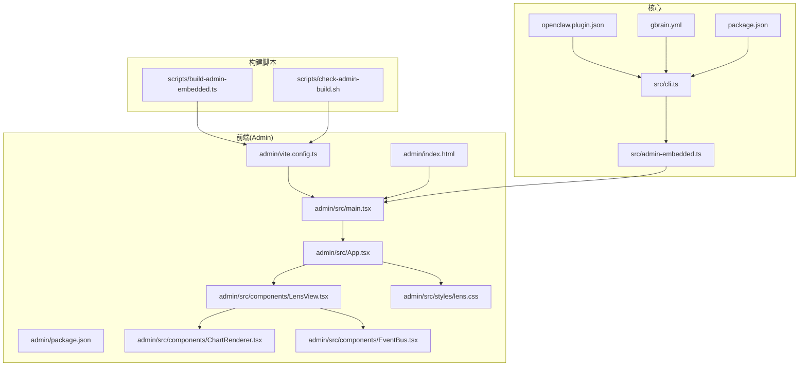
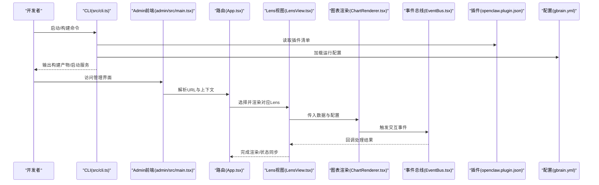
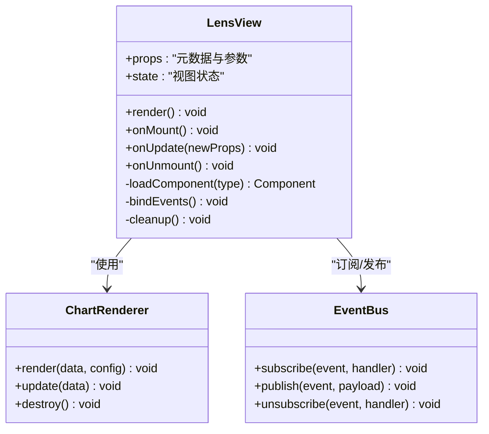
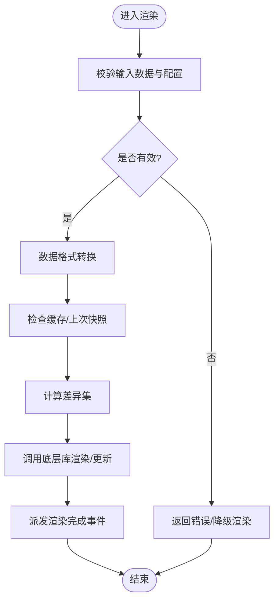
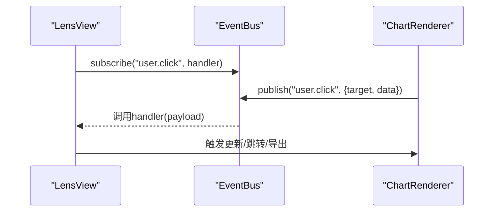
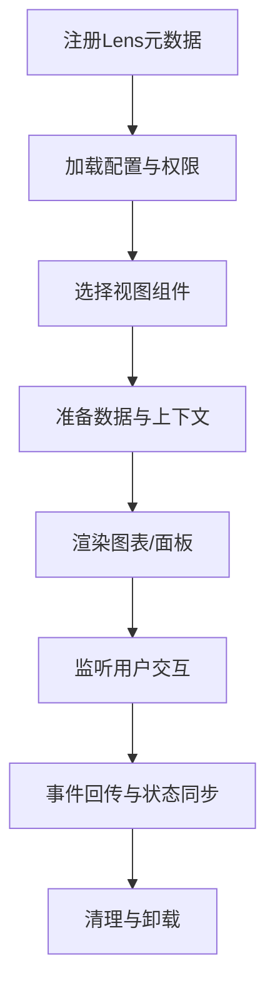
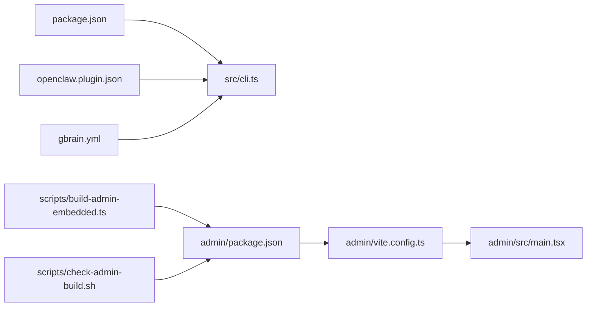

# Lens包开发

<cite>
**本文引用的文件**   
- [README.md](file://README.md)
- [DESIGN.md](file://DESIGN.md)
- [gbrain.yml](file://gbrain.yml)
- [openclaw.plugin.json](file://openclaw.plugin.json)
- [package.json](file://package.json)
- [src/cli.ts](file://src/cli.ts)
- [src/admin-embedded.ts](file://src/admin-embedded.ts)
- [admin/package.json](file://admin/package.json)
- [admin/vite.config.ts](file://admin/vite.config.ts)
- [admin/index.html](file://admin/index.html)
- [admin/src/main.tsx](file://admin/src/main.tsx)
- [admin/src/App.tsx](file://admin/src/App.tsx)
- [admin/src/components/LensView.tsx](file://admin/src/components/LensView.tsx)
- [admin/src/components/ChartRenderer.tsx](file://admin/src/components/ChartRenderer.tsx)
- [admin/src/components/EventBus.tsx](file://admin/src/components/EventBus.tsx)
- [admin/src/styles/lens.css](file://admin/src/styles/lens.css)
- [scripts/build-admin-embedded.ts](file://scripts/build-admin-embedded.ts)
- [scripts/check-admin-build.sh](file://scripts/check-admin-build.sh)
- [docs/guides/skillpack-anatomy.md](file://docs/guides/skillpack-anatomy.md)
- [docs/architecture/plugin-system.md](file://docs/architecture/plugin-system.md)
- [docs/architecture/ui-layer.md](file://docs/architecture/ui-layer.md)
- [docs/architecture/data-flow.md](file://docs/architecture/data-flow.md)
- [docs/architecture/event-handling.md](file://docs/architecture/event-handling.md)
- [docs/designs/lens-pack-design.md](file://docs/designs/lens-pack-design.md)
- [examples/skillpack-reference/skillpack.json](file://examples/skillpack-reference/skillpack.json)
- [skills/manifest.json](file://skills/manifest.json)
</cite>

## 目录
1. [简介](#简介)
2. [项目结构](#项目结构)
3. [核心组件](#核心组件)
4. [架构总览](#架构总览)
5. [详细组件分析](#详细组件分析)
6. [依赖分析](#依赖分析)
7. [性能考虑](#性能考虑)
8. [故障排查指南](#故障排查指南)
9. [结论](#结论)
10. [附录](#附录)

## 简介
本指南面向希望基于现有工程构建“Lens包”的开发者，系统阐述Lens的概念、用途与架构设计，覆盖目录结构、配置文件、UI组件开发、数据可视化与图表渲染、用户交互实现、注册机制、生命周期管理、事件处理、样式定制、打包发布与安装流程，并提供实际示例与最佳实践。

- Lens是什么：在系统中提供可插拔的数据可视化视图能力，将后端数据以图表、时间线、拓扑等形式呈现，并支持用户交互与事件回传。
- 为什么需要：通过统一插件化机制扩展前端界面，使不同业务域（如指标监控、知识图谱、审计日志）能以一致方式接入与展示。
- 目标读者：前端/全栈工程师、插件作者、平台集成者。

[本节不直接分析具体源文件]

## 项目结构
仓库采用多模块组织，Lens相关能力主要位于 admin 前端工程与 src 核心入口中，并通过脚本进行构建与嵌入。

图示来源
- [admin/package.json:1-200](file://admin/package.json#L1-L200)
- [admin/vite.config.ts:1-200](file://admin/vite.config.ts#L1-L200)
- [admin/index.html:1-200](file://admin/index.html#L1-L200)
- [admin/src/main.tsx:1-200](file://admin/src/main.tsx#L1-L200)
- [admin/src/App.tsx:1-200](file://admin/src/App.tsx#L1-L200)
- [admin/src/components/LensView.tsx:1-200](file://admin/src/components/LensView.tsx#L1-L200)
- [admin/src/components/ChartRenderer.tsx:1-200](file://admin/src/components/ChartRenderer.tsx#L1-L200)
- [admin/src/components/EventBus.tsx:1-200](file://admin/src/components/EventBus.tsx#L1-L200)
- [admin/src/styles/lens.css:1-200](file://admin/src/styles/lens.css#L1-L200)
- [src/cli.ts:1-200](file://src/cli.ts#L1-L200)
- [src/admin-embedded.ts:1-200](file://src/admin-embedded.ts#L1-L200)
- [openclaw.plugin.json:1-200](file://openclaw.plugin.json#L1-L200)
- [gbrain.yml:1-200](file://gbrain.yml#L1-L200)
- [package.json:1-200](file://package.json#L1-L200)
- [scripts/build-admin-embedded.ts:1-200](file://scripts/build-admin-embedded.ts#L1-L200)
- [scripts/check-admin-build.sh:1-200](file://scripts/check-admin-build.sh#L1-L200)

章节来源
- [README.md:1-200](file://README.md#L1-L200)
- [DESIGN.md:1-200](file://DESIGN.md#L1-L200)
- [admin/package.json:1-200](file://admin/package.json#L1-L200)
- [admin/vite.config.ts:1-200](file://admin/vite.config.ts#L1-L200)
- [admin/index.html:1-200](file://admin/index.html#L1-L200)
- [admin/src/main.tsx:1-200](file://admin/src/main.tsx#L1-L200)
- [admin/src/App.tsx:1-200](file://admin/src/App.tsx#L1-L200)
- [admin/src/components/LensView.tsx:1-200](file://admin/src/components/LensView.tsx#L1-L200)
- [admin/src/components/ChartRenderer.tsx:1-200](file://admin/src/components/ChartRenderer.tsx#L1-L200)
- [admin/src/components/EventBus.tsx:1-200](file://admin/src/components/EventBus.tsx#L1-L200)
- [admin/src/styles/lens.css:1-200](file://admin/src/styles/lens.css#L1-L200)
- [src/cli.ts:1-200](file://src/cli.ts#L1-L200)
- [src/admin-embedded.ts:1-200](file://src/admin-embedded.ts#L1-L200)
- [openclaw.plugin.json:1-200](file://openclaw.plugin.json#L1-L200)
- [gbrain.yml:1-200](file://gbrain.yml#L1-L200)
- [package.json:1-200](file://package.json#L1-L200)
- [scripts/build-admin-embedded.ts:1-200](file://scripts/build-admin-embedded.ts#L1-L200)
- [scripts/check-admin-build.sh:1-200](file://scripts/check-admin-build.sh#L1-L200)

## 核心组件
- 应用入口与路由
  - main.tsx：初始化React应用、挂载根节点、加载全局配置与主题。
  - App.tsx：顶层路由与布局，负责按当前上下文选择渲染对应Lens视图。
- Lens视图容器
  - LensView.tsx：根据元数据与参数实例化具体图表或面板，管理子组件生命周期。
- 图表渲染器
  - ChartRenderer.tsx：封装通用图表渲染逻辑，适配多种可视化库，统一数据格式与更新策略。
- 事件总线
  - EventBus.tsx：提供跨组件事件订阅/发布，用于用户交互与外部系统回调。
- 样式体系
  - lens.css：定义Lens组件的主题变量、网格布局与响应式规则。

章节来源
- [admin/src/main.tsx:1-200](file://admin/src/main.tsx#L1-L200)
- [admin/src/App.tsx:1-200](file://admin/src/App.tsx#L1-L200)
- [admin/src/components/LensView.tsx:1-200](file://admin/src/components/LensView.tsx#L1-L200)
- [admin/src/components/ChartRenderer.tsx:1-200](file://admin/src/components/ChartRenderer.tsx#L1-L200)
- [admin/src/components/EventBus.tsx:1-200](file://admin/src/components/EventBus.tsx#L1-L200)
- [admin/src/styles/lens.css:1-200](file://admin/src/styles/lens.css#L1-L200)

## 架构总览
下图展示了从CLI到前端可视化的端到端流程，包括插件注册、嵌入式构建与运行时注入。

图示来源
- [src/cli.ts:1-200](file://src/cli.ts#L1-L200)
- [openclaw.plugin.json:1-200](file://openclaw.plugin.json#L1-L200)
- [gbrain.yml:1-200](file://gbrain.yml#L1-L200)
- [admin/src/main.tsx:1-200](file://admin/src/main.tsx#L1-L200)
- [admin/src/App.tsx:1-200](file://admin/src/App.tsx#L1-L200)
- [admin/src/components/LensView.tsx:1-200](file://admin/src/components/LensView.tsx#L1-L200)
- [admin/src/components/ChartRenderer.tsx:1-200](file://admin/src/components/ChartRenderer.tsx#L1-L200)
- [admin/src/components/EventBus.tsx:1-200](file://admin/src/components/EventBus.tsx#L1-L200)

## 详细组件分析

### 组件A：Lens视图容器（LensView.tsx）
职责
- 接收来自路由与配置的元数据（类型、参数、权限）。
- 动态加载并渲染具体图表或面板。
- 管理子组件生命周期（创建、更新、销毁），确保资源释放。
- 与事件总线协作，转发用户操作与系统事件。

图示来源
- [admin/src/components/LensView.tsx:1-200](file://admin/src/components/LensView.tsx#L1-L200)
- [admin/src/components/ChartRenderer.tsx:1-200](file://admin/src/components/ChartRenderer.tsx#L1-L200)
- [admin/src/components/EventBus.tsx:1-200](file://admin/src/components/EventBus.tsx#L1-L200)

章节来源
- [admin/src/components/LensView.tsx:1-200](file://admin/src/components/LensView.tsx#L1-L200)

### 组件B：图表渲染器（ChartRenderer.tsx）
职责
- 统一数据格式转换，屏蔽底层可视化库差异。
- 提供增量更新策略，避免全量重绘。
- 暴露标准API供上层调用（渲染、更新、销毁）。

图示来源
- [admin/src/components/ChartRenderer.tsx:1-200](file://admin/src/components/ChartRenderer.tsx#L1-L200)

章节来源
- [admin/src/components/ChartRenderer.tsx:1-200](file://admin/src/components/ChartRenderer.tsx#L1-L200)

### 组件C：事件总线（EventBus.tsx）
职责
- 提供轻量级发布/订阅机制，解耦组件间通信。
- 支持命名空间与过滤，避免事件风暴。
- 提供生命周期钩子，便于调试与监控。

图示来源
- [admin/src/components/EventBus.tsx:1-200](file://admin/src/components/EventBus.tsx#L1-L200)
- [admin/src/components/LensView.tsx:1-200](file://admin/src/components/LensView.tsx#L1-L200)
- [admin/src/components/ChartRenderer.tsx:1-200](file://admin/src/components/ChartRenderer.tsx#L1-L200)

章节来源
- [admin/src/components/EventBus.tsx:1-200](file://admin/src/components/EventBus.tsx#L1-L200)

### 组件D：样式定制（lens.css）
职责
- 定义CSS变量（颜色、字号、间距）以实现主题切换。
- 提供网格与弹性布局，适配不同屏幕尺寸。
- 为图表容器提供基础样式与过渡动画。

章节来源
- [admin/src/styles/lens.css:1-200](file://admin/src/styles/lens.css#L1-L200)

### 概念性概览
下图为概念性工作流，帮助理解Lens从注册到渲染的整体过程，不直接映射具体代码文件。

[此图为概念性流程图，无需图示来源]

## 依赖分析
- 前端依赖
  - admin/package.json：声明React、可视化库、工具链等依赖。
  - vite.config.ts：构建配置，包含路径别名、插件、优化选项。
- 核心依赖
  - openclaw.plugin.json：插件清单，定义Lens包的元信息、入口与能力。
  - gbrain.yml：运行期配置，控制功能开关、数据源与权限。
  - package.json：根包配置，聚合脚本与版本管理。
- 构建脚本
  - build-admin-embedded.ts：将Admin前端产物嵌入核心包。
  - check-admin-build.sh：校验构建产物完整性。

图示来源
- [package.json:1-200](file://package.json#L1-L200)
- [src/cli.ts:1-200](file://src/cli.ts#L1-L200)
- [openclaw.plugin.json:1-200](file://openclaw.plugin.json#L1-L200)
- [gbrain.yml:1-200](file://gbrain.yml#L1-L200)
- [admin/package.json:1-200](file://admin/package.json#L1-L200)
- [admin/vite.config.ts:1-200](file://admin/vite.config.ts#L1-L200)
- [admin/src/main.tsx:1-200](file://admin/src/main.tsx#L1-L200)
- [scripts/build-admin-embedded.ts:1-200](file://scripts/build-admin-embedded.ts#L1-L200)
- [scripts/check-admin-build.sh:1-200](file://scripts/check-admin-build.sh#L1-L200)

章节来源
- [admin/package.json:1-200](file://admin/package.json#L1-L200)
- [admin/vite.config.ts:1-200](file://admin/vite.config.ts#L1-L200)
- [openclaw.plugin.json:1-200](file://openclaw.plugin.json#L1-L200)
- [gbrain.yml:1-200](file://gbrain.yml#L1-L200)
- [package.json:1-200](file://package.json#L1-L200)
- [scripts/build-admin-embedded.ts:1-200](file://scripts/build-admin-embedded.ts#L1-L200)
- [scripts/check-admin-build.sh:1-200](file://scripts/check-admin-build.sh#L1-L200)

## 性能考虑
- 数据层
  - 增量更新：优先使用差异集而非全量替换，减少重绘开销。
  - 分页与懒加载：对大数据集采用分页、虚拟滚动与按需加载。
  - 缓存策略：对静态或低频变化数据设置合理TTL与失效策略。
- 渲染层
  - 防抖与节流：对高频交互（缩放、拖拽）进行节流，降低CPU占用。
  - 分片渲染：大列表或复杂图采用分片渲染与Web Worker。
  - 资源压缩：启用Gzip/Brotli，图片与字体按需加载。
- 构建与部署
  - Tree-shaking与Code Splitting：按路由与组件拆分，减少首屏体积。
  - 预编译与缓存：利用Vite缓存与CDN缓存提升加载速度。

[本节提供一般性指导，不直接分析具体文件]

## 故障排查指南
- 构建失败
  - 检查Vite配置与依赖版本一致性。
  - 确认构建脚本执行顺序与产物路径正确。
- 运行时异常
  - 查看事件总线是否有未捕获异常或重复订阅。
  - 验证图表渲染器的数据格式是否符合预期。
- 样式错乱
  - 检查CSS变量是否被覆盖或作用域冲突。
  - 确认响应式断点与容器尺寸是否正确。
- 权限与配置
  - 核对插件清单与运行配置中的能力开关与数据源。

章节来源
- [admin/vite.config.ts:1-200](file://admin/vite.config.ts#L1-L200)
- [scripts/build-admin-embedded.ts:1-200](file://scripts/build-admin-embedded.ts#L1-L200)
- [scripts/check-admin-build.sh:1-200](file://scripts/check-admin-build.sh#L1-L200)
- [admin/src/components/EventBus.tsx:1-200](file://admin/src/components/EventBus.tsx#L1-L200)
- [admin/src/components/ChartRenderer.tsx:1-200](file://admin/src/components/ChartRenderer.tsx#L1-L200)
- [admin/src/styles/lens.css:1-200](file://admin/src/styles/lens.css#L1-L200)
- [openclaw.plugin.json:1-200](file://openclaw.plugin.json#L1-L200)
- [gbrain.yml:1-200](file://gbrain.yml#L1-L200)

## 结论
通过统一的插件化机制与清晰的组件分层，Lens包实现了可扩展的数据可视化能力。遵循本文档的结构与实践建议，开发者可以快速构建高质量、易维护的可视化视图，并在生产环境中稳定运行。

[本节为总结性内容，不直接分析具体文件]

## 附录

### 开发示例与最佳实践
- 最小可用示例
  - 在LensView中新增一个视图类型，绑定ChartRenderer并传入样例数据。
  - 在EventBus中订阅自定义事件，实现点击高亮或导出功能。
- 样式定制
  - 通过CSS变量集中管理主题色与排版，避免硬编码。
  - 使用媒体查询适配移动端与小屏设备。
- 注册机制
  - 在插件清单中声明Lens元数据，包括名称、图标、权限范围与入口组件。
  - 在运行配置中开启对应功能开关，并配置数据源连接。
- 生命周期管理
  - 在onMount中初始化资源，在onUpdate中处理增量更新，在onUnmount中释放资源。
- 事件处理
  - 使用命名空间隔离事件，避免冲突；对关键事件添加日志与埋点。
- 打包发布与安装
  - 使用构建脚本生成Admin嵌入产物，校验产物完整性后发布。
  - 通过包管理器或平台安装接口进行安装与升级。

章节来源
- [admin/src/components/LensView.tsx:1-200](file://admin/src/components/LensView.tsx#L1-L200)
- [admin/src/components/ChartRenderer.tsx:1-200](file://admin/src/components/ChartRenderer.tsx#L1-L200)
- [admin/src/components/EventBus.tsx:1-200](file://admin/src/components/EventBus.tsx#L1-L200)
- [admin/src/styles/lens.css:1-200](file://admin/src/styles/lens.css#L1-L200)
- [openclaw.plugin.json:1-200](file://openclaw.plugin.json#L1-L200)
- [gbrain.yml:1-200](file://gbrain.yml#L1-L200)
- [scripts/build-admin-embedded.ts:1-200](file://scripts/build-admin-embedded.ts#L1-L200)
- [scripts/check-admin-build.sh:1-200](file://scripts/check-admin-build.sh#L1-L200)

### 参考文档与规范
- 技能包结构与清单
  - skillpack-anatomy.md：说明技能包的组织方式与清单字段。
  - examples/skillpack-reference/skillpack.json：参考清单示例。
- 架构与设计
  - plugin-system.md：插件系统总体设计与约定。
  - ui-layer.md：UI层分层与组件契约。
  - data-flow.md：数据流与状态同步规范。
  - event-handling.md：事件模型与处理流程。
  - lens-pack-design.md：Lens包设计文档与演进路线。
- 工程规范
  - README.md：项目概述与快速开始。
  - DESIGN.md：整体设计原则与约束。

章节来源
- [docs/guides/skillpack-anatomy.md:1-200](file://docs/guides/skillpack-anatomy.md#L1-L200)
- [examples/skillpack-reference/skillpack.json:1-200](file://examples/skillpack-reference/skillpack.json#L1-L200)
- [docs/architecture/plugin-system.md:1-200](file://docs/architecture/plugin-system.md#L1-L200)
- [docs/architecture/ui-layer.md:1-200](file://docs/architecture/ui-layer.md#L1-L200)
- [docs/architecture/data-flow.md:1-200](file://docs/architecture/data-flow.md#L1-L200)
- [docs/architecture/event-handling.md:1-200](file://docs/architecture/event-handling.md#L1-L200)
- [docs/designs/lens-pack-design.md:1-200](file://docs/designs/lens-pack-design.md#L1-L200)
- [README.md:1-200](file://README.md#L1-L200)
- [DESIGN.md:1-200](file://DESIGN.md#L1-L200)