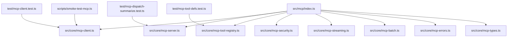
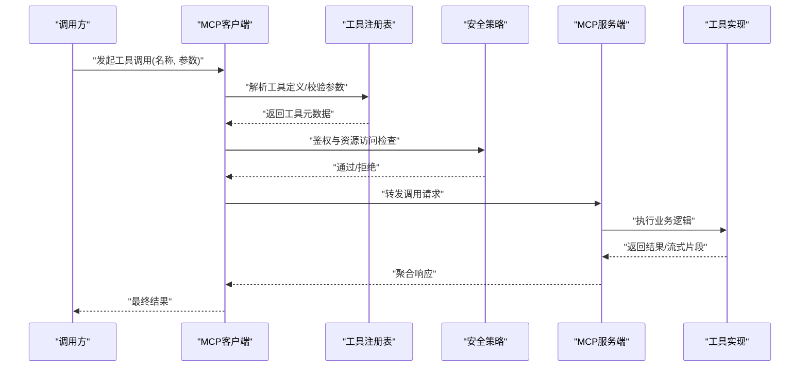
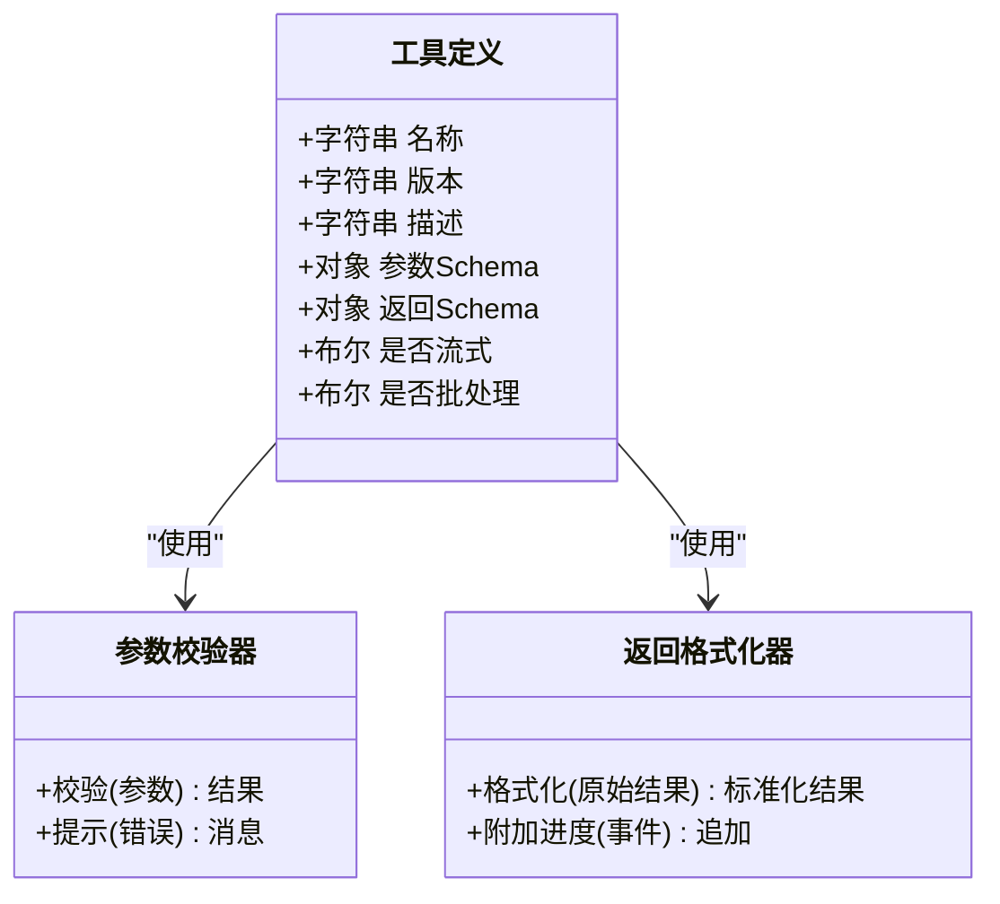
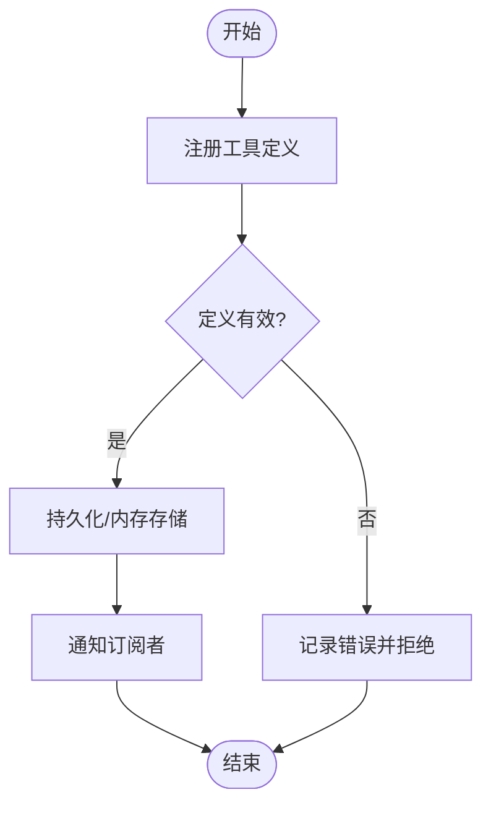
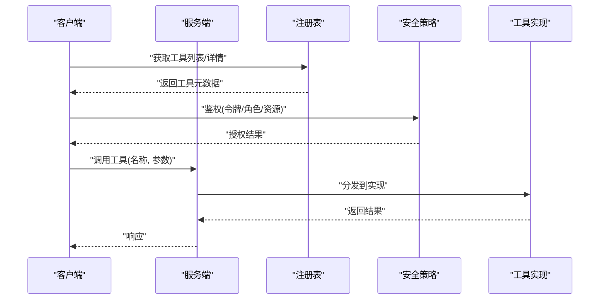
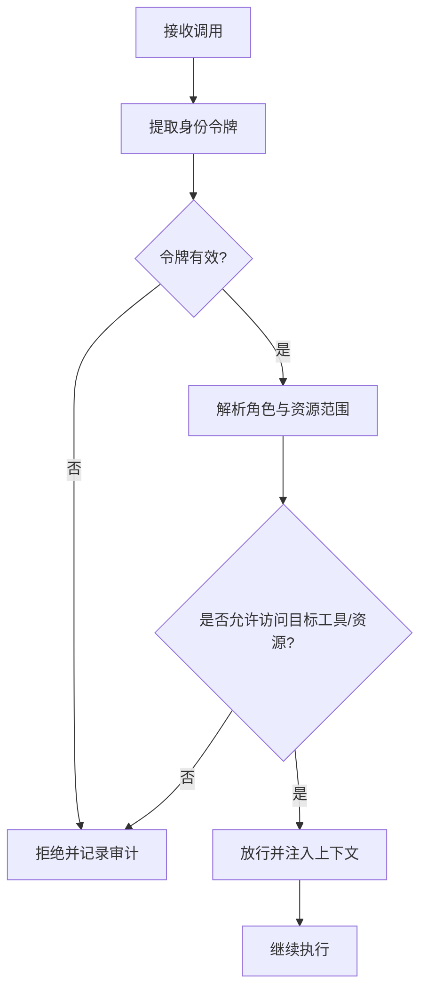
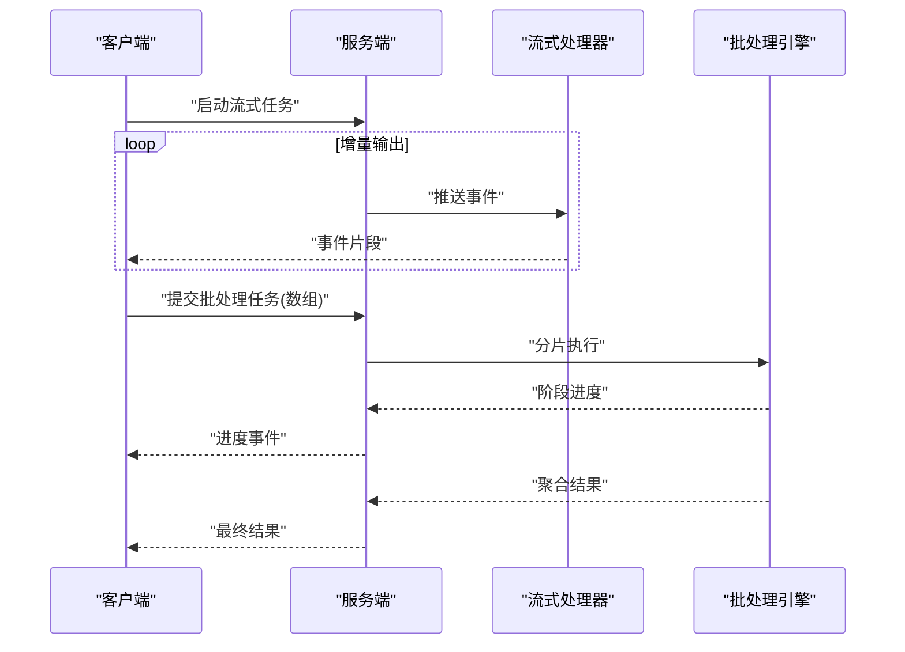
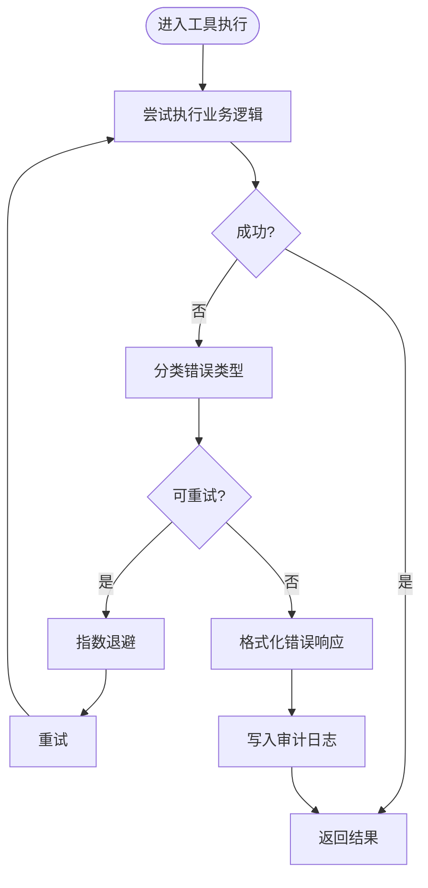
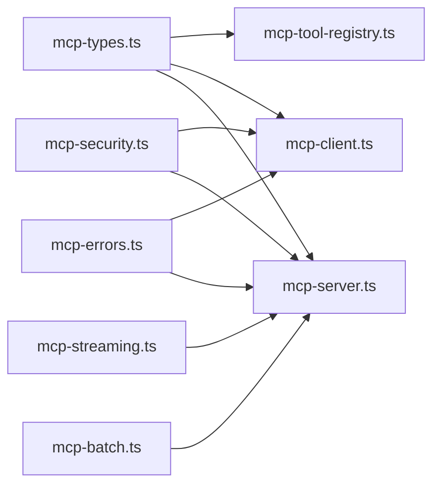

# MCP工具开发

<cite>
**本文引用的文件**   
- [src/mcp/index.ts](file://src/mcp/index.ts)
- [src/core/mcp-client.ts](file://src/core/mcp-client.ts)
- [src/core/mcp-server.ts](file://src/core/mcp-server.ts)
- [src/core/mcp-tool-registry.ts](file://src/core/mcp-tool-registry.ts)
- [src/core/mcp-security.ts](file://src/core/mcp-security.ts)
- [src/core/mcp-streaming.ts](file://src/core/mcp-streaming.ts)
- [src/core/mcp-batch.ts](file://src/core/mcp-batch.ts)
- [src/core/mcp-errors.ts](file://src/core/mcp-errors.ts)
- [src/core/mcp-types.ts](file://src/core/mcp-types.ts)
- [test/mcp-client.test.ts](file://test/mcp-client.test.ts)
- [test/mcp-tool-defs.test.ts](file://test/mcp-tool-defs.test.ts)
- [test/mcp-dispatch-summarize.test.ts](file://test/mcp-dispatch-summarize.test.ts)
- [scripts/smoke-test-mcp.ts](file://scripts/smoke-test-mcp.ts)
</cite>

## 目录
1. [简介](#简介)
2. [项目结构](#项目结构)
3. [核心组件](#核心组件)
4. [架构总览](#架构总览)
5. [详细组件分析](#详细组件分析)
6. [依赖分析](#依赖分析)
7. [性能考虑](#性能考虑)
8. [故障排查指南](#故障排查指南)
9. [结论](#结论)
10. [附录](#附录)

## 简介
本指南面向希望基于MCP协议在项目中实现、注册与调用工具的开发者。内容覆盖：
- 工具定义、参数规范与返回格式
- 工具注册机制、调用流程与错误处理
- 安全模型、权限控制与资源访问限制
- 异步工具、流式工具与批处理工具的实现模式
- 测试方法、调试技巧与性能监控
- 第三方服务集成最佳实践与认证处理

## 项目结构
围绕MCP工具能力，仓库中相关代码主要分布在以下模块：
- src/mcp：MCP入口与对外导出
- src/core：MCP客户端/服务端、工具注册表、安全策略、流式与批处理、错误类型与公共类型
- test：针对MCP客户端、工具定义、调度汇总等的测试用例
- scripts：MCP冒烟测试脚本

图表来源
- [src/mcp/index.ts](file://src/mcp/index.ts)
- [src/core/mcp-client.ts](file://src/core/mcp-client.ts)
- [src/core/mcp-server.ts](file://src/core/mcp-server.ts)
- [src/core/mcp-tool-registry.ts](file://src/core/mcp-tool-registry.ts)
- [src/core/mcp-security.ts](file://src/core/mcp-security.ts)
- [src/core/mcp-streaming.ts](file://src/core/mcp-streaming.ts)
- [src/core/mcp-batch.ts](file://src/core/mcp-batch.ts)
- [src/core/mcp-errors.ts](file://src/core/mcp-errors.ts)
- [src/core/mcp-types.ts](file://src/core/mcp-types.ts)
- [test/mcp-client.test.ts](file://test/mcp-client.test.ts)
- [test/mcp-tool-defs.test.ts](file://test/mcp-tool-defs.test.ts)
- [test/mcp-dispatch-summarize.test.ts](file://test/mcp-dispatch-summarize.test.ts)
- [scripts/smoke-test-mcp.ts](file://scripts/smoke-test-mcp.ts)

章节来源
- [src/mcp/index.ts](file://src/mcp/index.ts)
- [src/core/mcp-client.ts](file://src/core/mcp-client.ts)
- [src/core/mcp-server.ts](file://src/core/mcp-server.ts)
- [src/core/mcp-tool-registry.ts](file://src/core/mcp-tool-registry.ts)
- [src/core/mcp-security.ts](file://src/core/mcp-security.ts)
- [src/core/mcp-streaming.ts](file://src/core/mcp-streaming.ts)
- [src/core/mcp-batch.ts](file://src/core/mcp-batch.ts)
- [src/core/mcp-errors.ts](file://src/core/mcp-errors.ts)
- [src/core/mcp-types.ts](file://src/core/mcp-types.ts)
- [test/mcp-client.test.ts](file://test/mcp-client.test.ts)
- [test/mcp-tool-defs.test.ts](file://test/mcp-tool-defs.test.ts)
- [test/mcp-dispatch-summarize.test.ts](file://test/mcp-dispatch-summarize.test.ts)
- [scripts/smoke-test-mcp.ts](file://scripts/smoke-test-mcp.ts)

## 核心组件
- 工具定义与类型：集中描述工具元数据、参数Schema与返回结构，确保跨进程/跨语言一致。
- 工具注册表：维护工具清单、版本兼容性与发现接口，支持动态增删改查。
- 客户端与服务端：分别负责工具发现、调用封装与路由分发、结果序列化。
- 安全策略：鉴权、授权、资源白名单与审计日志。
- 流式与批处理：对长耗时或大数据量场景提供增量输出与批量执行能力。
- 错误体系：统一错误码、可诊断信息与重试策略。

章节来源
- [src/core/mcp-types.ts](file://src/core/mcp-types.ts)
- [src/core/mcp-tool-registry.ts](file://src/core/mcp-tool-registry.ts)
- [src/core/mcp-client.ts](file://src/core/mcp-client.ts)
- [src/core/mcp-server.ts](file://src/core/mcp-server.ts)
- [src/core/mcp-security.ts](file://src/core/mcp-security.ts)
- [src/core/mcp-streaming.ts](file://src/core/mcp-streaming.ts)
- [src/core/mcp-batch.ts](file://src/core/mcp-batch.ts)
- [src/core/mcp-errors.ts](file://src/core/mcp-errors.ts)

## 架构总览
下图展示了从调用方到工具实现的端到端路径，包括注册、鉴权、调度、执行与结果回传。

图表来源
- [src/core/mcp-client.ts](file://src/core/mcp-client.ts)
- [src/core/mcp-tool-registry.ts](file://src/core/mcp-tool-registry.ts)
- [src/core/mcp-security.ts](file://src/core/mcp-security.ts)
- [src/core/mcp-server.ts](file://src/core/mcp-server.ts)

## 详细组件分析

### 工具定义与类型
- 工具元数据：包含名称、版本、描述、参数Schema与返回Schema等字段，用于生成文档与校验。
- 参数规范：遵循JSON Schema风格，支持必填/可选、默认值、枚举、范围约束等。
- 返回格式：结构化数据优先，必要时附带进度事件与附件引用。

图表来源
- [src/core/mcp-types.ts](file://src/core/mcp-types.ts)

章节来源
- [src/core/mcp-types.ts](file://src/core/mcp-types.ts)
- [test/mcp-tool-defs.test.ts](file://test/mcp-tool-defs.test.ts)

### 工具注册表
- 职责：维护工具清单、版本兼容性、发现接口；支持按命名空间/标签筛选。
- 行为：注册/注销、查询、变更通知；与客户端缓存同步。

图表来源
- [src/core/mcp-tool-registry.ts](file://src/core/mcp-tool-registry.ts)

章节来源
- [src/core/mcp-tool-registry.ts](file://src/core/mcp-tool-registry.ts)
- [test/mcp-tool-defs.test.ts](file://test/mcp-tool-defs.test.ts)

### 客户端与服务端
- 客户端：负责工具发现、参数校验、鉴权前置、请求编排与结果反序列化；支持重试与超时。
- 服务端：负责路由分发、上下文注入、限流与审计；对接具体工具实现。

图表来源
- [src/core/mcp-client.ts](file://src/core/mcp-client.ts)
- [src/core/mcp-server.ts](file://src/core/mcp-server.ts)
- [src/core/mcp-tool-registry.ts](file://src/core/mcp-tool-registry.ts)
- [src/core/mcp-security.ts](file://src/core/mcp-security.ts)

章节来源
- [src/core/mcp-client.ts](file://src/core/mcp-client.ts)
- [src/core/mcp-server.ts](file://src/core/mcp-server.ts)
- [test/mcp-client.test.ts](file://test/mcp-client.test.ts)
- [test/mcp-dispatch-summarize.test.ts](file://test/mcp-dispatch-summarize.test.ts)

### 安全模型与权限控制
- 身份与令牌：支持Bearer Token、会话上下文与短期凭证。
- 授权策略：基于角色的访问控制（RBAC）与资源级白名单。
- 审计与追踪：记录调用链、输入摘要与结果摘要，便于合规与排障。
- 最小权限原则：仅暴露必要工具与资源路径。

图表来源
- [src/core/mcp-security.ts](file://src/core/mcp-security.ts)

章节来源
- [src/core/mcp-security.ts](file://src/core/mcp-security.ts)

### 异步工具、流式工具与批处理工具
- 异步工具：返回Promise或JobID，客户端轮询或通过回调获取结果。
- 流式工具：以事件流形式逐步产出中间结果，适合大文本/分块数据。
- 批处理工具：接受数组输入，内部并行/分片执行，返回聚合结果与明细状态。

图表来源
- [src/core/mcp-streaming.ts](file://src/core/mcp-streaming.ts)
- [src/core/mcp-batch.ts](file://src/core/mcp-batch.ts)

章节来源
- [src/core/mcp-streaming.ts](file://src/core/mcp-streaming.ts)
- [src/core/mcp-batch.ts](file://src/core/mcp-batch.ts)

### 错误处理与诊断
- 错误分类：参数错误、鉴权失败、资源不可用、超时、内部异常等。
- 统一响应：包含错误码、消息、建议修复动作与追踪ID。
- 重试与退避：对瞬时错误采用指数退避与最大重试次数。

图表来源
- [src/core/mcp-errors.ts](file://src/core/mcp-errors.ts)

章节来源
- [src/core/mcp-errors.ts](file://src/core/mcp-errors.ts)

## 依赖分析
- 内聚性：各组件职责清晰，类型与错误体系共享，降低耦合。
- 外部依赖：网络传输、认证提供者、数据库/对象存储等由上层注入。
- 潜在循环：注册表不应反向依赖客户端/服务端，避免环依赖。

图表来源
- [src/core/mcp-types.ts](file://src/core/mcp-types.ts)
- [src/core/mcp-tool-registry.ts](file://src/core/mcp-tool-registry.ts)
- [src/core/mcp-client.ts](file://src/core/mcp-client.ts)
- [src/core/mcp-server.ts](file://src/core/mcp-server.ts)
- [src/core/mcp-security.ts](file://src/core/mcp-security.ts)
- [src/core/mcp-streaming.ts](file://src/core/mcp-streaming.ts)
- [src/core/mcp-batch.ts](file://src/core/mcp-batch.ts)
- [src/core/mcp-errors.ts](file://src/core/mcp-errors.ts)

章节来源
- [src/core/mcp-types.ts](file://src/core/mcp-types.ts)
- [src/core/mcp-tool-registry.ts](file://src/core/mcp-tool-registry.ts)
- [src/core/mcp-client.ts](file://src/core/mcp-client.ts)
- [src/core/mcp-server.ts](file://src/core/mcp-server.ts)
- [src/core/mcp-security.ts](file://src/core/mcp-security.ts)
- [src/core/mcp-streaming.ts](file://src/core/mcp-streaming.ts)
- [src/core/mcp-batch.ts](file://src/core/mcp-batch.ts)
- [src/core/mcp-errors.ts](file://src/core/mcp-errors.ts)

## 性能考虑
- 参数校验与Schema预编译：减少运行时开销。
- 连接复用与池化：HTTP/STDIO连接池，避免频繁握手。
- 流式输出：降低峰值内存占用，提升首字节延迟。
- 批处理分片：根据CPU/IO特性设置并发度与批次大小。
- 缓存热点：对只读工具结果进行短TTL缓存。
- 指标与追踪：采集QPS、P95/P99延迟、错误率与吞吐。

[本节为通用指导，不直接分析具体文件]

## 故障排查指南
- 常见问题
  - 参数校验失败：检查Schema必填项与类型约束。
  - 鉴权失败：确认令牌有效期、角色与资源白名单。
  - 超时/重试风暴：调整超时阈值与退避策略。
  - 流式中断：检查网络稳定性与背压处理。
- 定位手段
  - 启用审计日志与追踪ID，关联上下游。
  - 使用冒烟脚本快速验证端到端链路。
  - 单元测试聚焦边界条件与错误分支。

章节来源
- [test/mcp-client.test.ts](file://test/mcp-client.test.ts)
- [scripts/smoke-test-mcp.ts](file://scripts/smoke-test-mcp.ts)

## 结论
通过统一的工具定义、严格的注册与鉴权、完善的错误与流式/批处理支持，MCP工具可在多环境稳定运行。建议在生产环境强化审计与指标采集，持续优化参数校验与连接复用策略，保障高可用与低延迟。

[本节为总结性内容，不直接分析具体文件]

## 附录
- 第三方服务集成最佳实践
  - 使用短期凭证与密钥轮换，避免硬编码。
  - 对敏感参数脱敏后入审计日志。
  - 建立熔断与降级策略，保护上游服务。
- 认证处理方式
  - 支持OAuth2/OIDC、API Key与证书双向认证。
  - 将令牌生命周期管理与工具调用解耦。

[本节为通用指导，不直接分析具体文件]