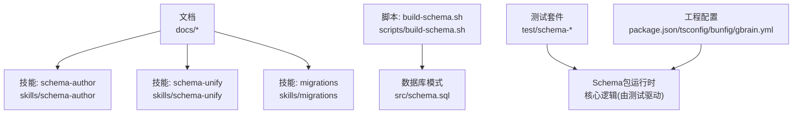
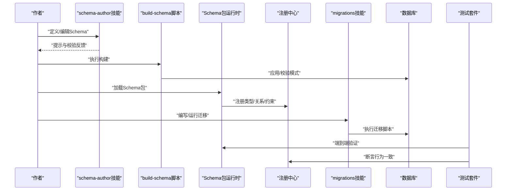
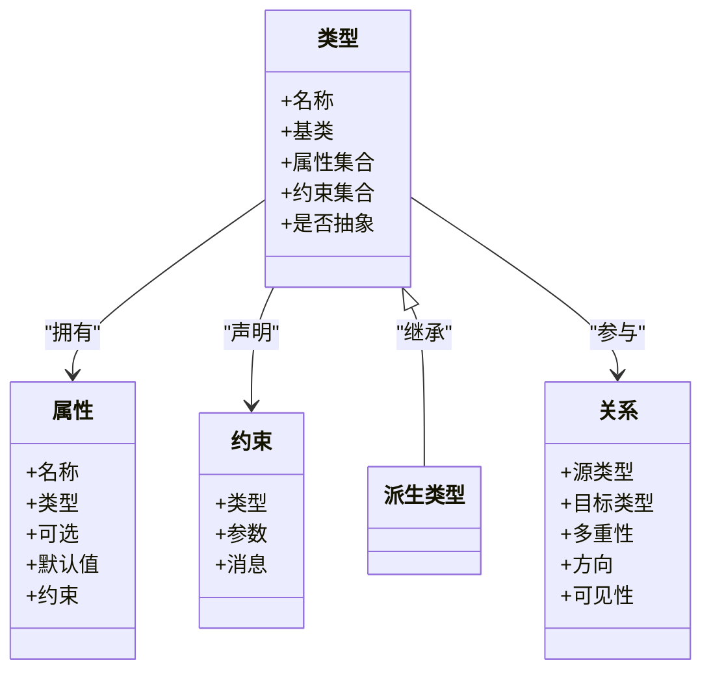
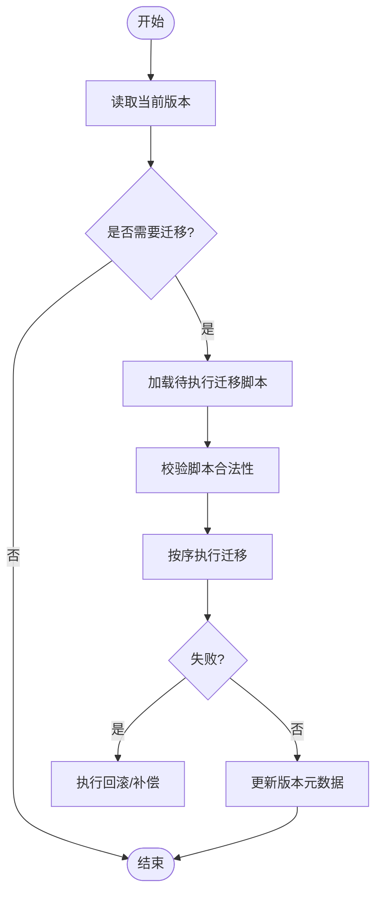
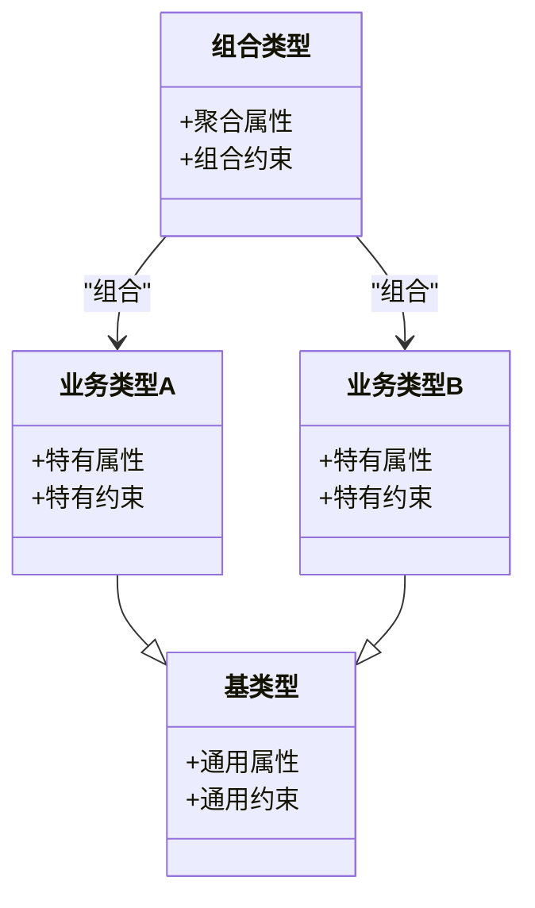
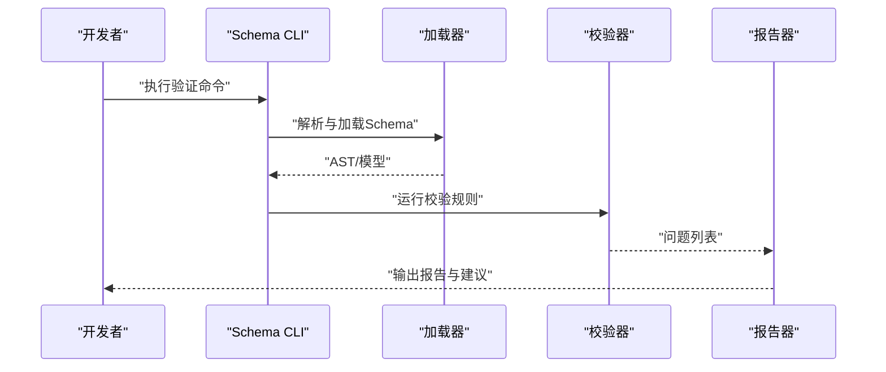
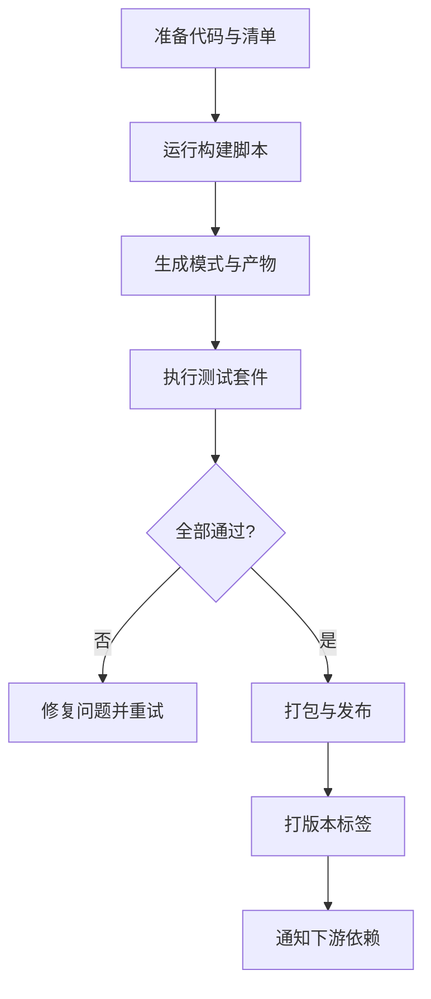
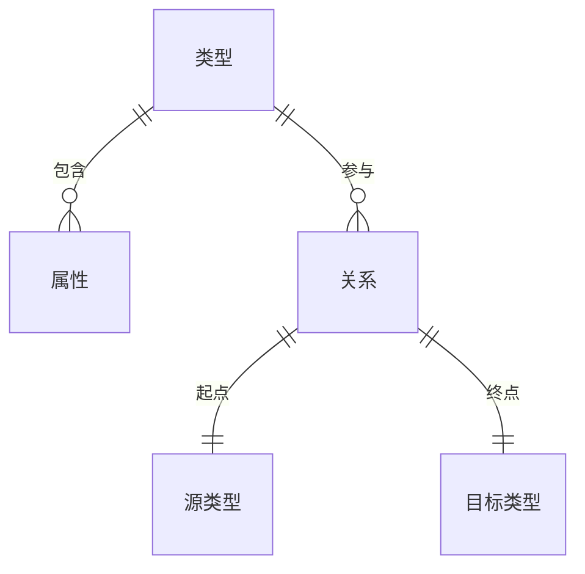
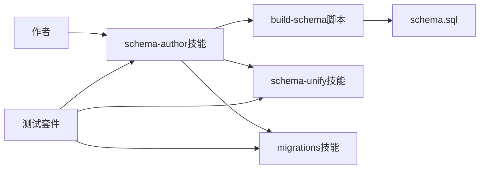

# Schema包开发

<cite>
**本文引用的文件**   
- [README.md](file://README.md)
- [DESIGN.md](file://DESIGN.md)
- [AGENTS.md](file://AGENTS.md)
- [CLAUDE.md](file://CLAUDE.md)
- [CONTRIBUTING.md](file://CONTRIBUTING.md)
- [gbrain.yml](file://gbrain.yml)
- [package.json](file://package.json)
- [tsconfig.json](file://tsconfig.json)
- [bunfig.toml](file://bunfig.toml)
- [src/schema.sql](file://src/schema.sql)
- [scripts/build-schema.sh](file://scripts/build-schema.sh)
- [docs/GBRAIN_RECOMMENDED_SCHEMA.md](file://docs/GBRAIN_RECOMMENDED_SCHEMA.md)
- [docs/schema-author-tutorial.md](file://docs/schema-author-tutorial.md)
- [skills/schema-author/skill.ts](file://skills/schema-author/skill.ts)
- [skills/schema-unify/skill.ts](file://skills/schema-unify/skill.ts)
- [skills/migrations/skill.ts](file://skills/migrations/skill.ts)
- [test/schema-cli.test.ts](file://test/schema-cli.test.ts)
- [test/schema-verify.test.ts](file://test/schema-verify.test.ts)
- [test/schema-pack-loader.test.ts](file://test/schema-pack-loader.test.ts)
- [test/schema-pack-lint-rules.test.ts](file://test/schema-pack-lint-rules.test.ts)
- [test/schema-pack-mutate.test.ts](file://test/schema-pack-mutate.test.ts)
- [test/schema-pack-sync.test.ts](file://test/schema-pack-sync.test.ts)
- [test/schema-pack-registry.test.ts](file://test/schema-pack-registry.test.ts)
- [test/schema-pack-manifest-v041_2.test.ts](file://test/schema-pack-manifest-v041_2.test.ts)
- [test/schema-pack-best-effort.test.ts](file://test/schema-pack-best-effort.test.ts)
- [test/schema-pack-find-pack-successors.serial.test.ts](file://test/schema-pack-find-pack-successors.serial.test.ts)
- [test/schema-pack-infer-type-and-subtype.test.ts](file://test/schema-pack-infer-type-and-subtype.test.ts)
- [test/schema-pack-page-to-alias.test.ts](file://test/schema-pack-page-to-alias.test.ts)
- [test/schema-pack-page-to-link.test.ts](file://test/schema-pack-page-to-link.test.ts)
- [test/schema-pack-query-cache-invalidator.test.ts](file://test/schema-pack-query-cache-invalidator.test.ts)
- [test/schema-pack-retype.test.ts](file://test/schema-pack-retype.test.ts)
- [test/schema-pack-rewrite-links-batch.test.ts](file://test/schema-pack-rewrite-links-batch.test.ts)
- [test/schema-pack-stats.test.ts](file://test/schema-pack-stats.test.ts)
- [test/schema-pack-trust-boundary.test.ts](file://test/schema-pack-trust-boundary.test.ts)
- [test/schema-pack-unify-types-handler.test.ts](file://test/schema-pack-unify-types-handler.test.ts)
- [test/schema-bootstrap-coverage.test.ts](file://test/schema-bootstrap-coverage.test.ts)
- [test/schema-cli-contract.test.ts](file://test/schema-cli-contract.test.ts)
- [test/schema-migrate-link-source-mentions.test.ts](file://test/schema-migrate-link-source-mentions.test.ts)
- [test/schema-pack-load-active.serial.test.ts](file://test/schema-pack-load-active.serial.test.ts)
- [test/schema-pack-mutate-audit.test.ts](file://test/schema-pack-mutate-audit.test.ts)
- [test/schema-pack-pack-lock.test.ts](file://test/schema-pack-pack-lock.test.ts)
- [test/schema-pack-registry-reload.test.ts](file://test/schema-pack-registry-reload.test.ts)
</cite>

## 目录
1. [简介](#简介)
2. [项目结构](#项目结构)
3. [核心组件](#核心组件)
4. [架构总览](#架构总览)
5. [详细组件分析](#详细组件分析)
6. [依赖关系分析](#依赖关系分析)
7. [性能考虑](#性能考虑)
8. [故障排查指南](#故障排查指南)
9. [结论](#结论)
10. [附录](#附录)

## 简介
本指南面向需要开发和维护Schema包的工程师与知识图谱作者，系统阐述Schema定义语言、类型系统与约束规则；说明Schema包的目录结构、版本管理与迁移脚本编写；解释类型继承、组合与扩展机制；覆盖Schema验证、lint规则与最佳实践；并提供构建、测试与发布流程。同时给出与知识图谱的映射关系和数据迁移策略，以及实际开发示例与常见问题解决方案。

## 项目结构
仓库围绕“Schema包”能力提供了文档、技能（skill）实现、脚本与大量测试用例，形成从规范到落地的一体化体系：
- 文档层：包含推荐Schema、作者教程等权威说明
- 技能层：提供Schema作者、统一、迁移等可执行能力
- 脚本层：提供Schema构建与校验工具链
- 测试层：覆盖加载、注册、变更、同步、审计、缓存失效、统计等关键路径
- 工程配置：包含TypeScript、Bun、CLI入口与全局配置

图表来源
- [docs/schema-author-tutorial.md](file://docs/schema-author-tutorial.md)
- [skills/schema-author/skill.ts](file://skills/schema-author/skill.ts)
- [skills/schema-unify/skill.ts](file://skills/schema-unify/skill.ts)
- [skills/migrations/skill.ts](file://skills/migrations/skill.ts)
- [scripts/build-schema.sh](file://scripts/build-schema.sh)
- [src/schema.sql](file://src/schema.sql)
- [test/schema-cli.test.ts](file://test/schema-cli.test.ts)

章节来源
- [README.md](file://README.md)
- [DESIGN.md](file://DESIGN.md)
- [AGENTS.md](file://AGENTS.md)
- [CLAUDE.md](file://CLAUDE.md)
- [CONTRIBUTING.md](file://CONTRIBUTING.md)
- [gbrain.yml](file://gbrain.yml)
- [package.json](file://package.json)
- [tsconfig.json](file://tsconfig.json)
- [bunfig.toml](file://bunfig.toml)

## 核心组件
- Schema定义语言与类型系统
  - 通过文档与技能共同定义类型、属性、关系与约束，支持继承、组合与扩展
  - 推荐Schema与作者教程提供约定与范式
- Schema包生命周期
  - 加载、注册、校验、统一、迁移、发布与回滚
- 验证与Lint
  - 提供CLI与API进行语法/语义校验与规则检查
- 数据迁移
  - 基于迁移技能的版本化脚本，保证向后兼容与一致性
- 构建与测试
  - 脚本与测试套件保障质量与稳定性

章节来源
- [docs/GBRAIN_RECOMMENDED_SCHEMA.md](file://docs/GBRAIN_RECOMMENDED_SCHEMA.md)
- [docs/schema-author-tutorial.md](file://docs/schema-author-tutorial.md)
- [skills/schema-author/skill.ts](file://skills/schema-author/skill.ts)
- [skills/schema-unify/skill.ts](file://skills/schema-unify/skill.ts)
- [skills/migrations/skill.ts](file://skills/migrations/skill.ts)
- [scripts/build-schema.sh](file://scripts/build-schema.sh)
- [src/schema.sql](file://src/schema.sql)

## 架构总览
下图展示Schema包在系统中的位置与交互：作者通过技能定义Schema，构建脚本生成模式，运行时加载并注册，迁移脚本驱动数据演进，测试套件贯穿全链路。

图表来源
- [skills/schema-author/skill.ts](file://skills/schema-author/skill.ts)
- [scripts/build-schema.sh](file://scripts/build-schema.sh)
- [src/schema.sql](file://src/schema.sql)
- [skills/migrations/skill.ts](file://skills/migrations/skill.ts)
- [test/schema-cli.test.ts](file://test/schema-cli.test.ts)

## 详细组件分析

### Schema定义语言与类型系统
- 类型与属性
  - 基础类型、复合类型、枚举、可选/必填、默认值
  - 命名空间与限定名避免冲突
- 关系与边
  - 有向/无向、多重性、方向性与可见性
- 约束与规则
  - 唯一性、非空、范围、正则、自定义校验
- 继承、组合与扩展
  - 单/多继承、接口式组合、扩展点与钩子
- 版本化与兼容性
  - 向前/向后兼容策略、弃用标记、渐进式升级

图表来源
- [docs/GBRAIN_RECOMMENDED_SCHEMA.md](file://docs/GBRAIN_RECOMMENDED_SCHEMA.md)
- [docs/schema-author-tutorial.md](file://docs/schema-author-tutorial.md)

章节来源
- [docs/GBRAIN_RECOMMENDED_SCHEMA.md](file://docs/GBRAIN_RECOMMENDED_SCHEMA.md)
- [docs/schema-author-tutorial.md](file://docs/schema-author-tutorial.md)

### Schema包目录结构与清单
- 典型目录
  - types/：类型定义与关系描述
  - constraints/：约束与规则
  - migrations/：版本化迁移脚本
  - tests/：单元与集成测试
  - docs/：使用说明与示例
- 清单与元数据
  - 包名、版本、依赖、兼容性矩阵、许可证与作者信息
  - 导出与暴露面控制

章节来源
- [skills/schema-author/skill.ts](file://skills/schema-author/skill.ts)
- [test/schema-pack-manifest-v041_2.test.ts](file://test/schema-pack-manifest-v041_2.test.ts)

### 版本管理与迁移脚本
- 版本策略
  - 主/次/补丁版本，破坏性变更需提升主版本
  - 弃用周期与最小支持版本
- 迁移脚本
  - 幂等、可重入、可回滚
  - 增量更新与批量处理
  - 与Schema变更对齐，确保一致性
- 迁移编排
  - 顺序执行、条件分支、失败重试与补偿

图表来源
- [skills/migrations/skill.ts](file://skills/migrations/skill.ts)
- [test/schema-migrate-link-source-mentions.test.ts](file://test/schema-migrate-link-source-mentions.test.ts)

章节来源
- [skills/migrations/skill.ts](file://skills/migrations/skill.ts)
- [test/schema-migrate-link-source-mentions.test.ts](file://test/schema-migrate-link-source-mentions.test.ts)

### 类型继承、组合与扩展机制
- 继承
  - 单根或有限多继承，避免菱形歧义
  - 属性合并与覆盖策略
- 组合
  - 将多个类型组合为复合类型，复用公共约束
- 扩展
  - 开放扩展点，允许第三方在不修改核心的前提下增强能力
  - 钩子与事件用于生命周期注入

图表来源
- [docs/schema-author-tutorial.md](file://docs/schema-author-tutorial.md)

章节来源
- [docs/schema-author-tutorial.md](file://docs/schema-author-tutorial.md)

### Schema验证与Lint规则
- 验证维度
  - 语法正确性、类型一致性、关系完整性、约束满足度
- Lint规则
  - 命名规范、重复定义检测、废弃字段清理、引用可达性
- 报告与修复建议
  - 错误分级、定位信息与自动修复建议

图表来源
- [test/schema-cli.test.ts](file://test/schema-cli.test.ts)
- [test/schema-verify.test.ts](file://test/schema-verify.test.ts)
- [test/schema-pack-lint-rules.test.ts](file://test/schema-pack-lint-rules.test.ts)

章节来源
- [test/schema-cli.test.ts](file://test/schema-cli.test.ts)
- [test/schema-verify.test.ts](file://test/schema-verify.test.ts)
- [test/schema-pack-lint-rules.test.ts](file://test/schema-pack-lint-rules.test.ts)

### 构建、测试与发布流程
- 构建
  - 使用构建脚本生成模式与产物，确保与数据库一致
- 测试
  - 单元测试覆盖加载、注册、变更、同步、审计、缓存失效、统计等
  - 集成测试验证端到端行为
- 发布
  - 版本打标签、清单校验、签名与分发、回滚预案

图表来源
- [scripts/build-schema.sh](file://scripts/build-schema.sh)
- [test/schema-pack-loader.test.ts](file://test/schema-pack-loader.test.ts)
- [test/schema-pack-sync.test.ts](file://test/schema-pack-sync.test.ts)
- [test/schema-pack-stats.test.ts](file://test/schema-pack-stats.test.ts)

章节来源
- [scripts/build-schema.sh](file://scripts/build-schema.sh)
- [test/schema-pack-loader.test.ts](file://test/schema-pack-loader.test.ts)
- [test/schema-pack-sync.test.ts](file://test/schema-pack-sync.test.ts)
- [test/schema-pack-stats.test.ts](file://test/schema-pack-stats.test.ts)

### 与知识图谱的映射关系
- 实体与节点
  - 类型映射为节点类型，属性映射为节点属性
- 关系与边
  - 关系映射为边，方向性与多重性决定查询与索引策略
- 约束与索引
  - 唯一性与非空约束影响索引与写入性能
- 查询优化
  - 基于类型与关系的过滤、投影与聚合

图表来源
- [docs/GBRAIN_RECOMMENDED_SCHEMA.md](file://docs/GBRAIN_RECOMMENDED_SCHEMA.md)

章节来源
- [docs/GBRAIN_RECOMMENDED_SCHEMA.md](file://docs/GBRAIN_RECOMMENDED_SCHEMA.md)

### 数据迁移策略
- 设计原则
  - 幂等、可重入、可回滚、可观测
- 实施步骤
  - 评估影响面、制定灰度计划、分批执行、监控与告警
- 回滚方案
  - 快照与备份、补偿脚本、快速降级

章节来源
- [skills/migrations/skill.ts](file://skills/migrations/skill.ts)
- [test/schema-migrate-link-source-mentions.test.ts](file://test/schema-migrate-link-source-mentions.test.ts)

### 实际开发示例
- 新增类型与属性
  - 在types中声明类型与属性，添加约束，编写迁移脚本
- 扩展现有关系
  - 增加关系方向或多重性，更新查询与索引
- 发布新版本
  - 更新清单与版本，运行构建与测试，发布并通知下游

章节来源
- [docs/schema-author-tutorial.md](file://docs/schema-author-tutorial.md)
- [skills/schema-author/skill.ts](file://skills/schema-author/skill.ts)
- [skills/migrations/skill.ts](file://skills/migrations/skill.ts)

### 常见问题与解决方案
- 类型不兼容导致迁移失败
  - 采用渐进式变更与双写策略，逐步替换旧字段
- 约束过严引发写入瓶颈
  - 调整约束粒度，引入异步校验与批处理
- 关系循环引用导致查询异常
  - 引入中间类型或延迟加载，拆分查询路径
- 缓存不一致
  - 变更时主动失效相关缓存键，确保最终一致

章节来源
- [test/schema-pack-query-cache-invalidator.test.ts](file://test/schema-pack-query-cache-invalidator.test.ts)
- [test/schema-pack-rewrite-links-batch.test.ts](file://test/schema-pack-rewrite-links-batch.test.ts)

## 依赖关系分析
Schema包与技能、脚本、测试之间的依赖如下：

图表来源
- [skills/schema-author/skill.ts](file://skills/schema-author/skill.ts)
- [skills/schema-unify/skill.ts](file://skills/schema-unify/skill.ts)
- [skills/migrations/skill.ts](file://skills/migrations/skill.ts)
- [scripts/build-schema.sh](file://scripts/build-schema.sh)
- [src/schema.sql](file://src/schema.sql)
- [test/schema-cli.test.ts](file://test/schema-cli.test.ts)

章节来源
- [skills/schema-author/skill.ts](file://skills/schema-author/skill.ts)
- [skills/schema-unify/skill.ts](file://skills/schema-unify/skill.ts)
- [skills/migrations/skill.ts](file://skills/migrations/skill.ts)
- [scripts/build-schema.sh](file://scripts/build-schema.sh)
- [src/schema.sql](file://src/schema.sql)
- [test/schema-cli.test.ts](file://test/schema-cli.test.ts)

## 性能考虑
- 索引与约束
  - 合理设置唯一与非空约束，减少无效扫描
- 批量操作
  - 迁移与重写链接时使用批处理降低锁竞争
- 缓存策略
  - 变更时精准失效，避免全量重建
- 查询优化
  - 基于类型与关系进行预过滤与投影

章节来源
- [test/schema-pack-rewrite-links-batch.test.ts](file://test/schema-pack-rewrite-links-batch.test.ts)
- [test/schema-pack-query-cache-invalidator.test.ts](file://test/schema-pack-query-cache-invalidator.test.ts)

## 故障排查指南
- 常见错误
  - 清单格式错误、版本不匹配、迁移幂等性缺失、约束冲突
- 诊断步骤
  - 查看构建日志、运行验证命令、检查注册中心状态、回放迁移
- 恢复手段
  - 回滚至上一稳定版本、执行补偿脚本、重建索引

章节来源
- [test/schema-pack-manifest-v041_2.test.ts](file://test/schema-pack-manifest-v041_2.test.ts)
- [test/schema-pack-pack-lock.test.ts](file://test/schema-pack-pack-lock.test.ts)
- [test/schema-pack-mutate-audit.test.ts](file://test/schema-pack-mutate-audit.test.ts)

## 结论
通过统一的Schema定义语言、严格的验证与Lint、完善的迁移与发布流程，Schema包能够支撑知识图谱的稳定演进。遵循本文档的规范与实践，可在保证兼容性的前提下高效迭代类型与关系，提升整体系统的可维护性与可扩展性。

## 附录
- 参考文档
  - 推荐Schema与作者教程
- 工程配置
  - TypeScript、Bun、CLI入口与全局配置
- 测试清单
  - 加载、注册、变更、同步、审计、缓存失效、统计等

章节来源
- [docs/GBRAIN_RECOMMENDED_SCHEMA.md](file://docs/GBRAIN_RECOMMENDED_SCHEMA.md)
- [docs/schema-author-tutorial.md](file://docs/schema-author-tutorial.md)
- [package.json](file://package.json)
- [tsconfig.json](file://tsconfig.json)
- [bunfig.toml](file://bunfig.toml)
- [gbrain.yml](file://gbrain.yml)