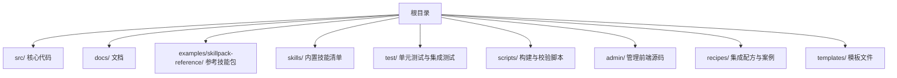
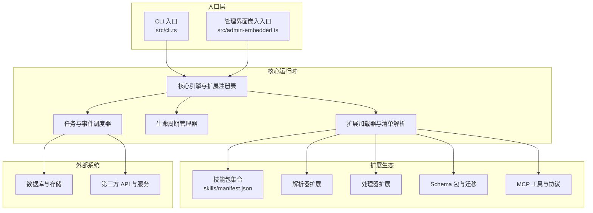
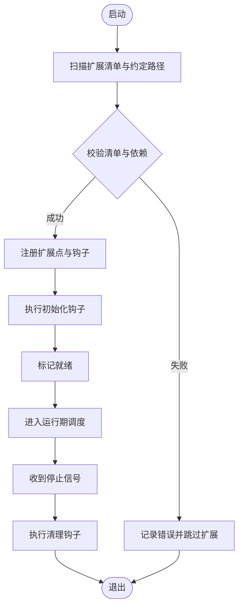
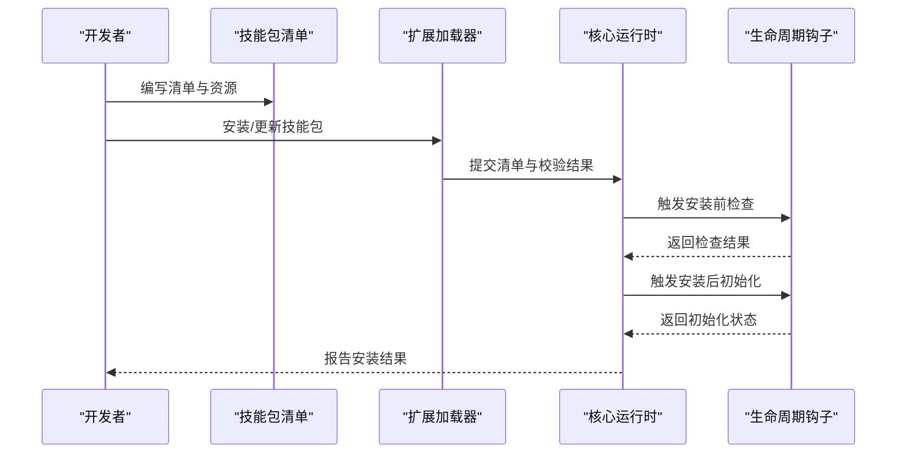
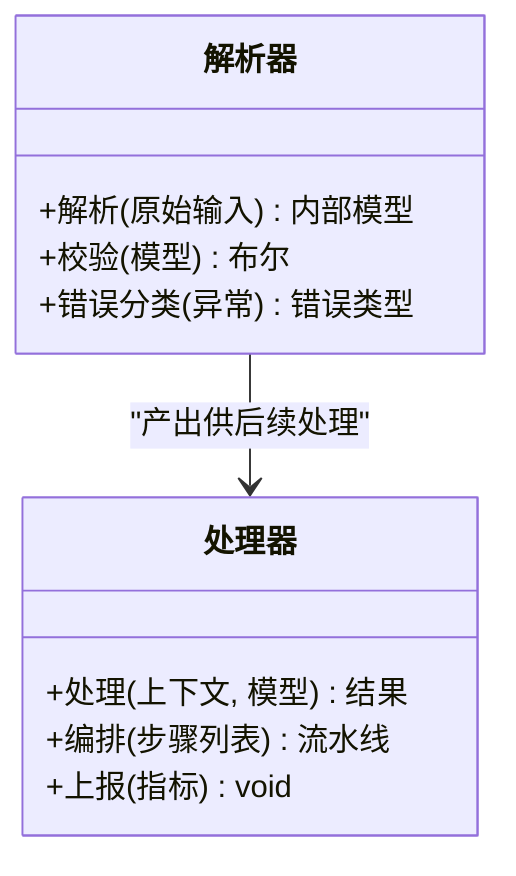
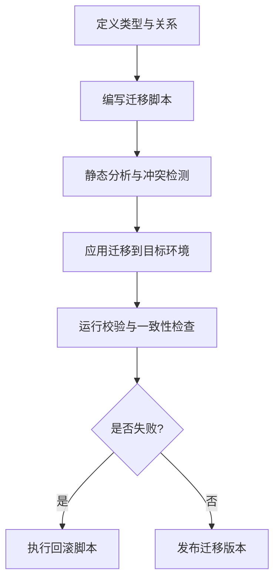
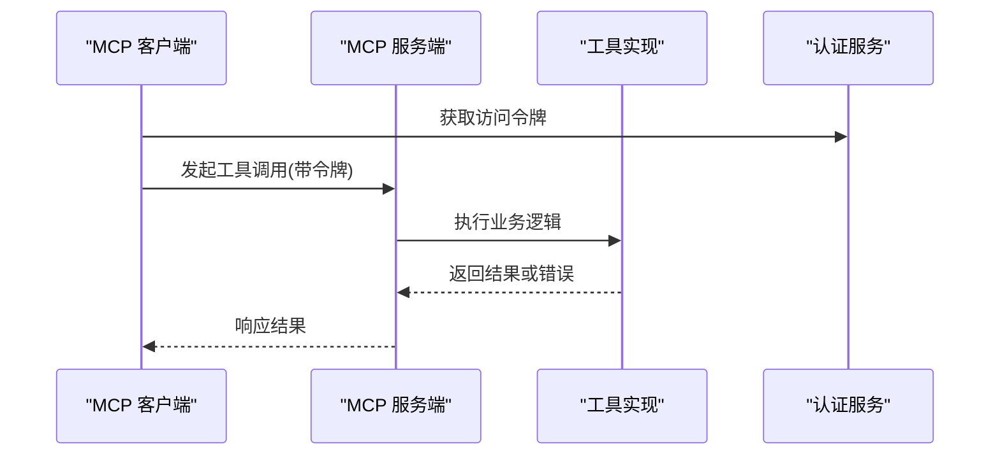
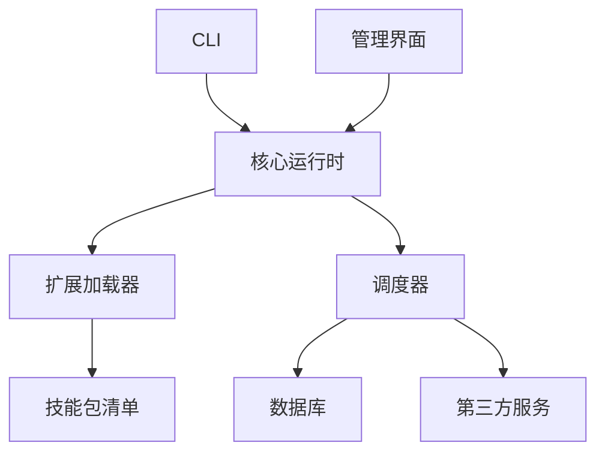

# 扩展开发

<cite>
**本文引用的文件**   
- [README.md](file://README.md)
- [DESIGN.md](file://DESIGN.md)
- [AGENTS.md](file://AGENTS.md)
- [CLAUDE.md](file://CLAUDE.md)
- [CONTRIBUTING.md](file://CONTRIBUTING.md)
- [INSTALL.md](file://docs/INSTALL.md)
- [RELEASING.md](file://docs/RELEASING.md)
- [TESTING.md](file://docs/TESTING.md)
- [GBRAIN_SKILLPACK.md](file://docs/GBRAIN_SKILLPACK.md)
- [skillpack-anatomy.md](file://docs/skillpack-anatomy.md)
- [schema-author-tutorial.md](file://docs/schema-author-tutorial.md)
- [what-schemas-unlock.md](file://docs/what-schemas-unlock.md)
- [mcp-overview.md](file://docs/mcp/overview.md)
- [mcp-client.md](file://docs/mcp/client.md)
- [mcp-server.md](file://docs/mcp/server.md)
- [mcp-tools.md](file://docs/mcp/tools.md)
- [mcp-auth.md](file://docs/mcp/auth.md)
- [mcp-security.md](file://docs/mcp/security.md)
- [mcp-troubleshooting.md](file://docs/mcp/troubleshooting.md)
- [openclaw.plugin.json](file://openclaw.plugin.json)
- [package.json](file://package.json)
- [src/cli.ts](file://src/cli.ts)
- [src/admin-embedded.ts](file://src/admin-embedded.ts)
- [skills/manifest.json](file://skills/manifest.json)
</cite>

## 目录
1. [简介](#简介)
2. [项目结构](#项目结构)
3. [核心组件](#核心组件)
4. [架构总览](#架构总览)
5. [详细组件分析](#详细组件分析)
6. [依赖分析](#依赖分析)
7. [性能考虑](#性能考虑)
8. [故障排查指南](#故障排查指南)
9. [结论](#结论)
10. [附录](#附录)

## 简介
本指南面向希望为 GBrain 进行扩展开发的工程师与集成商，围绕插件架构、扩展点、技能包（Skillpack）规范、解析器与处理器扩展、Schema 包与迁移脚本、MCP 工具与自定义协议、第三方系统集成等主题，提供从概念到落地的系统化说明。文档同时覆盖生命周期管理、执行环境隔离、打包发布与版本管理流程，以及调试技巧与测试策略，帮助你在保证稳定性的前提下快速交付高质量扩展。

## 项目结构
仓库采用“核心 + 文档 + 示例 + 内置技能 + 测试”的分层组织方式：
- 核心代码位于 src/，包含 CLI、嵌入式管理界面入口、命令实现与核心运行时逻辑。
- 文档集中于 docs/，涵盖架构设计、使用指南、MCP 规范、迁移与评估等。
- 示例与参考实现位于 examples/skillpack-reference/，展示标准技能包结构与最佳实践。
- 内置技能位于 skills/，以清单形式注册并驱动系统能力。
- 测试覆盖广泛，位于 test/ 与 tests/heavy/，用于验证功能、回归与性能。

[本节为总体概览，不直接分析具体源文件]

## 核心组件
- 插件与扩展点
  - 通过清单与约定式发现机制加载扩展能力，包括技能包、解析器、数据源、处理器与 MCP 工具。
  - 扩展点通常以接口或契约定义，由核心在启动阶段扫描并注册。
- 技能包（Skillpack）
  - 以声明式清单描述能力边界、依赖、资源与生命周期钩子；支持安装、升级与卸载。
  - 参考实现与解剖文档提供了标准目录结构与元数据规范。
- 解析器与处理器
  - 解析器负责将外部输入转换为内部模型；处理器对事件流进行编排与转换。
  - 两者均遵循统一的上下文与错误模型，便于组合与可观测性。
- Schema 包与迁移
  - Schema 包定义类型、约束与关系；迁移脚本确保数据演进的可逆性与一致性。
  - 提供校验、合并与回滚策略，保障多租户与跨脑场景下的稳定性。
- MCP 工具与协议
  - MCP 作为统一工具总线，支持客户端与服务端双向通信、认证与安全控制。
  - 工具定义、调用链路与错误处理均有明确规范。

章节来源
- [README.md](file://README.md)
- [DESIGN.md](file://DESIGN.md)
- [AGENTS.md](file://AGENTS.md)
- [CLAUDE.md](file://CLAUDE.md)
- [CONTRIBUTING.md](file://CONTRIBUTING.md)
- [docs/GBRAIN_SKILLPACK.md](file://docs/GBRAIN_SKILLPACK.md)
- [docs/skillpack-anatomy.md](file://docs/skillpack-anatomy.md)
- [docs/schema-author-tutorial.md](file://docs/schema-author-tutorial.md)
- [docs/what-schemas-unlock.md](file://docs/what-schemas-unlock.md)
- [docs/mcp/overview.md](file://docs/mcp/overview.md)
- [docs/mcp/client.md](file://docs/mcp/client.md)
- [docs/mcp/server.md](file://docs/mcp/server.md)
- [docs/mcp/tools.md](file://docs/mcp/tools.md)
- [docs/mcp/auth.md](file://docs/mcp/auth.md)
- [docs/mcp/security.md](file://docs/mcp/security.md)
- [docs/mcp/troubleshooting.md](file://docs/mcp/troubleshooting.md)
- [skills/manifest.json](file://skills/manifest.json)

## 架构总览
下图展示了扩展生态的核心交互：CLI 与管理界面作为入口，核心运行时负责扩展发现、生命周期管理与调度；技能包、解析器、处理器与 MCP 工具通过约定式契约接入；Schema 包与迁移脚本贯穿数据建模与演进过程。

图表来源
- [src/cli.ts](file://src/cli.ts)
- [src/admin-embedded.ts](file://src/admin-embedded.ts)
- [skills/manifest.json](file://skills/manifest.json)

章节来源
- [src/cli.ts](file://src/cli.ts)
- [src/admin-embedded.ts](file://src/admin-embedded.ts)
- [skills/manifest.json](file://skills/manifest.json)

## 详细组件分析

### 插件与扩展点
- 扩展发现与注册
  - 通过清单与约定路径扫描扩展项，建立扩展索引并在启动时完成注册。
  - 支持按作用域与优先级进行排序与过滤，避免冲突。
- 生命周期管理
  - 初始化、就绪、运行中、停止与销毁各阶段提供钩子，允许扩展注入资源与清理状态。
  - 错误恢复与重试策略在生命周期内统一处理，提升鲁棒性。
- 执行环境隔离
  - 扩展运行于受控沙箱中，限制文件系统、网络与系统调用访问。
  - 资源配额与超时控制防止异常扩展影响核心稳定性。

[本节为通用流程说明，未直接映射具体源文件]

### 技能包（Skillpack）开发规范
- 清单与元数据
  - 清单文件描述名称、版本、依赖、入口与资源；遵循语义化版本与兼容性矩阵。
  - 参考清单与解剖文档提供字段含义与约束。
- 目录结构与资源
  - 标准目录划分职责：配置、脚本、数据、文档与测试。
  - 资源引用需使用相对路径与命名空间，避免污染全局。
- 生命周期与钩子
  - 安装前检查、安装后初始化、运行期事件、卸载清理。
  - 钩子函数需幂等且可重入，确保中断恢复与并发安全。
- 安全与信任边界
  - 权限最小化原则，敏感信息通过密钥管理服务注入。
  - 白名单与沙箱策略限制危险操作。

图表来源
- [docs/GBRAIN_SKILLPACK.md](file://docs/GBRAIN_SKILLPACK.md)
- [docs/skillpack-anatomy.md](file://docs/skillpack-anatomy.md)

章节来源
- [docs/GBRAIN_SKILLPACK.md](file://docs/GBRAIN_SKILLPACK.md)
- [docs/skillpack-anatomy.md](file://docs/skillpack-anatomy.md)

### 解析器与处理器扩展机制
- 解析器
  - 输入适配：将外部格式（文本、JSON、二进制）转换为内部模型。
  - 校验与清洗：基于 Schema 约束进行强校验，缺失字段提供默认值或拒绝。
  - 错误分类：区分可恢复与不可恢复错误，便于重试与降级。
- 处理器
  - 事件编排：串联多个处理器形成流水线，支持分支与聚合。
  - 上下文传递：携带请求溯源、审计信息与预算指标。
  - 可观测性：输出进度事件与指标，便于监控与诊断。

[本节为概念性类图，未直接映射具体源文件]

### Schema 包开发与迁移脚本
- 类型定义
  - 使用声明式语言定义实体、属性、关系与约束；支持枚举、联合与可选字段。
  - 类型系统提供向后兼容规则与废弃字段过渡策略。
- 迁移脚本
  - 增量式变更，每个迁移具备唯一标识与幂等性。
  - 支持回滚与校验，确保数据一致性与完整性。
- 校验与合并
  - 提供静态分析与冲突检测，避免多包并行修改导致的不一致。
  - 合并策略支持三方合并与人工干预。

图表来源
- [docs/schema-author-tutorial.md](file://docs/schema-author-tutorial.md)
- [docs/what-schemas-unlock.md](file://docs/what-schemas-unlock.md)

章节来源
- [docs/schema-author-tutorial.md](file://docs/schema-author-tutorial.md)
- [docs/what-schemas-unlock.md](file://docs/what-schemas-unlock.md)

### MCP 工具开发与自定义协议
- 工具定义
  - 工具元数据包含名称、描述、参数模式与返回值结构。
  - 支持同步与异步调用，提供超时与重试配置。
- 客户端与服务端
  - 客户端负责序列化请求、鉴权与错误处理。
  - 服务端实现工具逻辑、资源访问与限流保护。
- 认证与安全
  - 支持多种认证方案与令牌轮换。
  - 传输加密与签名校验，防止中间人攻击。
- 自定义协议
  - 在 MCP 之上扩展领域协议，保持与核心解耦。
  - 协议版本协商与降级策略确保兼容性。

图表来源
- [docs/mcp/client.md](file://docs/mcp/client.md)
- [docs/mcp/server.md](file://docs/mcp/server.md)
- [docs/mcp/tools.md](file://docs/mcp/tools.md)
- [docs/mcp/auth.md](file://docs/mcp/auth.md)
- [docs/mcp/security.md](file://docs/mcp/security.md)

章节来源
- [docs/mcp/client.md](file://docs/mcp/client.md)
- [docs/mcp/server.md](file://docs/mcp/server.md)
- [docs/mcp/tools.md](file://docs/mcp/tools.md)
- [docs/mcp/auth.md](file://docs/mcp/auth.md)
- [docs/mcp/security.md](file://docs/mcp/security.md)

### 第三方系统集成
- 适配器模式
  - 通过适配器封装第三方 SDK，暴露统一接口给核心。
  - 配置集中管理，支持多实例与多租户。
- 连接池与重试
  - 连接复用与背压控制，避免雪崩效应。
  - 指数退避与熔断策略提升可用性。
- 审计与合规
  - 全链路日志脱敏与审计追踪。
  - 数据出境与隐私合规检查。

[本节为通用集成建议，未直接映射具体源文件]

## 依赖分析
- 内部依赖
  - CLI 与管理界面依赖核心运行时；核心运行时依赖扩展加载器与调度器。
  - 技能包清单驱动扩展发现，解析器与处理器通过契约注册。
- 外部依赖
  - 数据库与存储服务提供持久化能力。
  - 第三方 API 通过适配器与 MCP 工具接入。
- 潜在循环依赖
  - 通过分层与接口抽象避免循环；必要时引入事件总线解耦。

图表来源
- [src/cli.ts](file://src/cli.ts)
- [src/admin-embedded.ts](file://src/admin-embedded.ts)
- [skills/manifest.json](file://skills/manifest.json)

章节来源
- [src/cli.ts](file://src/cli.ts)
- [src/admin-embedded.ts](file://src/admin-embedded.ts)
- [skills/manifest.json](file://skills/manifest.json)

## 性能考虑
- 扩展加载优化
  - 延迟加载与按需启用，减少冷启动开销。
  - 缓存扩展元数据与解析结果，降低重复计算。
- 调度与并发
  - 合理设置并发度与队列长度，避免资源争用。
  - 批处理与流式处理结合，提高吞吐。
- 内存与 CPU
  - 对象池与零拷贝技术减少分配压力。
  - 热点路径 profiling 与基准测试定位瓶颈。

[本节为通用性能指导，未直接映射具体源文件]

## 故障排查指南
- 常见问题
  - 扩展加载失败：检查清单格式、依赖版本与权限。
  - 解析器报错：确认输入格式与 Schema 约束，查看错误分类。
  - MCP 调用超时：检查网络连通、令牌有效性与服务端负载。
- 调试技巧
  - 启用详细日志与追踪 ID，关联上下游调用。
  - 使用断点与快照回放定位问题。
- 测试策略
  - 单元与集成测试覆盖关键路径与异常分支。
  - 端到端演练模拟真实流量与故障注入。

章节来源
- [docs/mcp/troubleshooting.md](file://docs/mcp/troubleshooting.md)
- [docs/TESTING.md](file://docs/TESTING.md)

## 结论
通过清晰的扩展点与契约、完善的生命周期与环境隔离、规范的技能包与 Schema 包体系，以及强大的 MCP 工具总线，GBrain 为扩展开发提供了高内聚、低耦合的生态基础。遵循本文档的最佳实践与流程，你将能够高效构建稳定、可维护且可扩展的能力模块，并与第三方系统无缝集成。

[本节为总结性内容，未直接分析具体文件]

## 附录
- 安装与入门
  - 环境准备、依赖安装与首次运行指引。
- 发布与版本管理
  - 版本策略、变更日志与发布流水线。
- 贡献与协作
  - 代码规范、审查流程与持续集成。

章节来源
- [docs/INSTALL.md](file://docs/INSTALL.md)
- [docs/RELEASING.md](file://docs/RELEASING.md)
- [CONTRIBUTING.md](file://CONTRIBUTING.md)
- [openclaw.plugin.json](file://openclaw.plugin.json)
- [package.json](file://package.json)