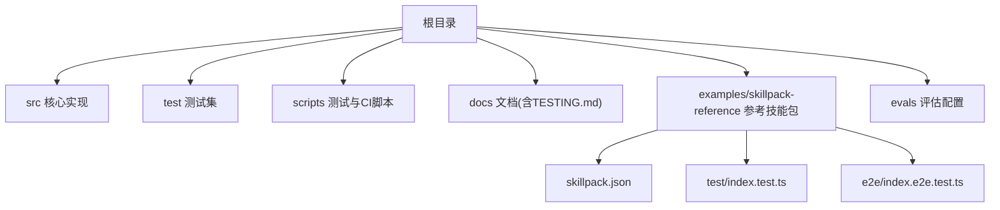
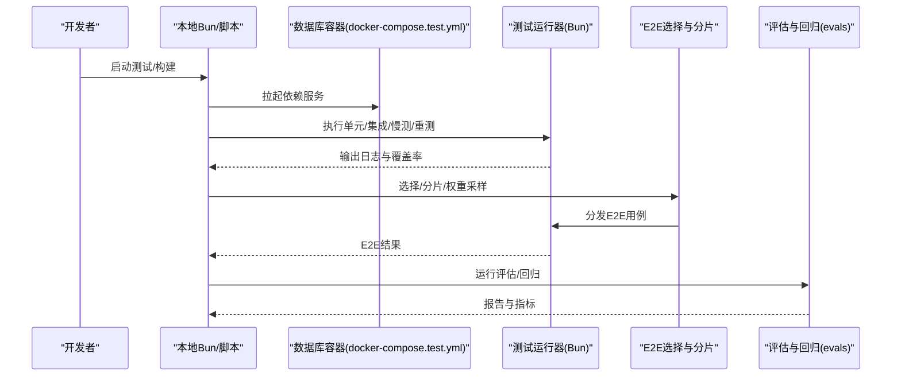
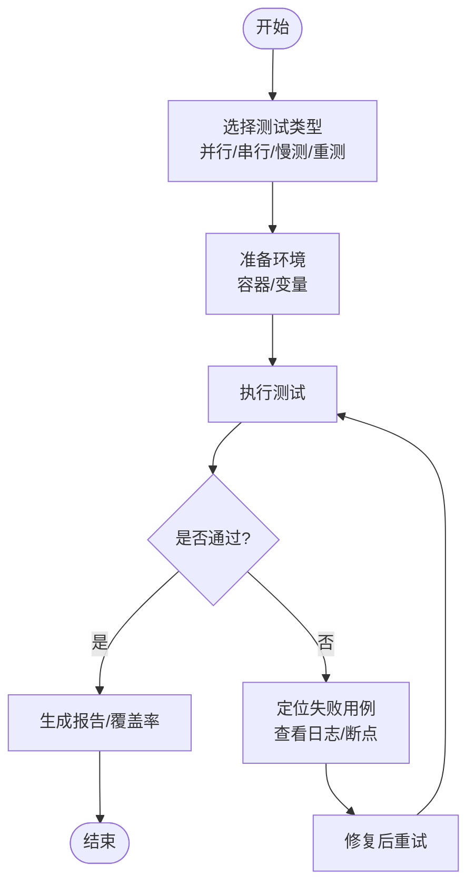
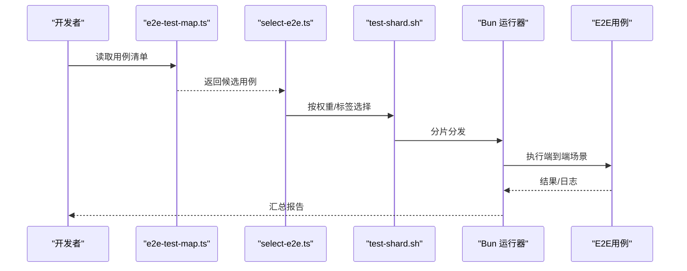
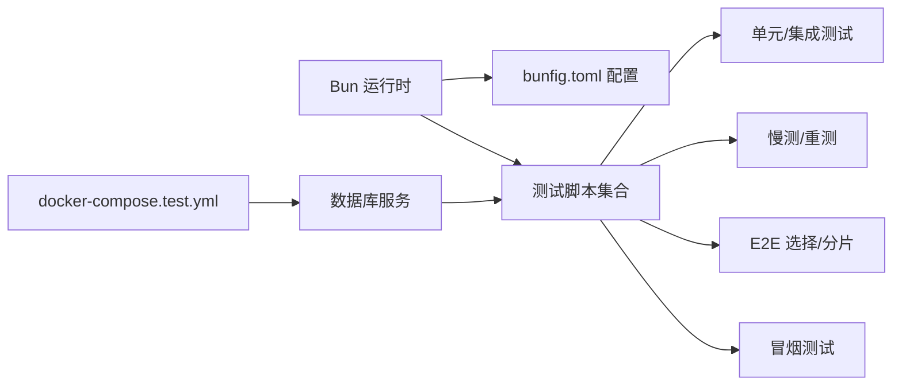

# 扩展测试与调试

<cite>
**本文引用的文件**   
- [README.md](file://README.md)
- [CONTRIBUTING.md](file://CONTRIBUTING.md)
- [TESTING.md](file://docs/TESTING.md)
- [package.json](file://package.json)
- [bunfig.toml](file://bunfig.toml)
- [docker-compose.test.yml](file://docker-compose.test.yml)
- [scripts/run-unit-parallel.sh](file://scripts/run-unit-parallel.sh)
- [scripts/run-serial-tests.sh](file://scripts/run-serial-tests.sh)
- [scripts/run-slow-tests.sh](file://scripts/run-slow-tests.sh)
- [scripts/run-heavy.sh](file://scripts/run-heavy.sh)
- [scripts/profile-tests.sh](file://scripts/profile-tests.sh)
- [scripts/smoke-test.sh](file://scripts/smoke-test.sh)
- [scripts/e2e-test-map.ts](file://scripts/e2e-test-map.ts)
- [scripts/select-e2e.ts](file://scripts/select-e2e.ts)
- [scripts/run-e2e.sh](file://scripts/run-e2e.sh)
- [scripts/test-shard.sh](file://scripts/test-shard.sh)
- [scripts/ci-local.sh](file://scripts/ci-local.sh)
- [scripts/check-test-isolation.sh](file://scripts/check-test-isolation.sh)
- [scripts/check-test-real-names.sh](file://scripts/check-test-real-names.sh)
- [scripts/sharding.ts](file://scripts/sharding.ts)
- [scripts/test-weights.json](file://scripts/test-weights.json)
- [examples/skillpack-reference/README.md](file://examples/skillpack-reference/README.md)
- [examples/skillpack-reference/skillpack.json](file://examples/skillpack-reference/skillpack.json)
- [examples/skillpack-reference/test/index.test.ts](file://examples/skillpack-reference/test/index.test.ts)
- [examples/skillpack-reference/e2e/index.e2e.test.ts](file://examples/skillpack-reference/e2e/index.e2e.test.ts)
- [evals/embedding-provider-eval.json](file://evals/embedding-provider-eval.json)
</cite>

## 目录
1. [简介](#简介)
2. [项目结构](#项目结构)
3. [核心组件](#核心组件)
4. [架构总览](#架构总览)
5. [详细组件分析](#详细组件分析)
6. [依赖分析](#依赖分析)
7. [性能考虑](#性能考虑)
8. [故障排查指南](#故障排查指南)
9. [结论](#结论)
10. [附录](#附录)

## 简介
本指南面向扩展开发者，系统化阐述在该项目中如何为不同类型的扩展（技能包、评估脚本、集成能力等）设计并执行测试与调试策略。内容覆盖单元测试、集成测试、端到端测试、性能与压力测试、回归测试，以及调试工具、日志分析与错误追踪方法，并提供质量评估标准与最佳实践和常见问题诊断方案。

## 项目结构
仓库采用“源码 + 文档 + 示例 + 评估 + 脚本”的分层组织方式：
- src：核心实现
- test：大量单测与集成用例
- scripts：测试编排、CI 与辅助脚本
- docs：测试与工程规范文档
- examples/skillpack-reference：参考技能包，包含最小可运行的测试与 e2e 用例
- evals：评估相关配置与数据

图表来源
- [docs/TESTING.md](file://docs/TESTING.md)
- [examples/skillpack-reference/skillpack.json](file://examples/skillpack-reference/skillpack.json)
- [examples/skillpack-reference/test/index.test.ts](file://examples/skillpack-reference/test/index.test.ts)
- [examples/skillpack-reference/e2e/index.e2e.test.ts](file://examples/skillpack-reference/e2e/index.e2e.test.ts)

章节来源
- [README.md](file://README.md)
- [CONTRIBUTING.md](file://CONTRIBUTING.md)
- [docs/TESTING.md](file://docs/TESTING.md)

## 核心组件
- 测试运行器与配置
  - 使用 Bun 作为运行时与测试框架，配置文件位于 bunfig.toml；package.json 提供常用命令入口。
- 测试分层与执行脚本
  - 并行单元、串行单元、慢速测试、重型测试、冒烟测试、E2E 选择与分片、权重采样等由 scripts 下脚本统一编排。
- 参考技能包
  - examples/skillpack-reference 提供最小可复现的 skillpack 测试与 e2e 用例，便于扩展开发者对照实现。
- 评估与回归
  - evals 目录存放评估配置与数据集，用于回归与质量度量。

章节来源
- [bunfig.toml](file://bunfig.toml)
- [package.json](file://package.json)
- [scripts/run-unit-parallel.sh](file://scripts/run-unit-parallel.sh)
- [scripts/run-serial-tests.sh](file://scripts/run-serial-tests.sh)
- [scripts/run-slow-tests.sh](file://scripts/run-slow-tests.sh)
- [scripts/run-heavy.sh](file://scripts/run-heavy.sh)
- [scripts/smoke-test.sh](file://scripts/smoke-test.sh)
- [scripts/e2e-test-map.ts](file://scripts/e2e-test-map.ts)
- [scripts/select-e2e.ts](file://scripts/select-e2e.ts)
- [scripts/run-e2e.sh](file://scripts/run-e2e.sh)
- [scripts/test-shard.sh](file://scripts/test-shard.sh)
- [scripts/test-weights.json](file://scripts/test-weights.json)
- [examples/skillpack-reference/README.md](file://examples/skillpack-reference/README.md)
- [examples/skillpack-reference/skillpack.json](file://examples/skillpack-reference/skillpack.json)
- [examples/skillpack-reference/test/index.test.ts](file://examples/skillpack-reference/test/index.test.ts)
- [examples/skillpack-reference/e2e/index.e2e.test.ts](file://examples/skillpack-reference/e2e/index.e2e.test.ts)
- [evals/embedding-provider-eval.json](file://evals/embedding-provider-eval.json)

## 架构总览
下图展示从本地开发到 CI 的测试与调试流程，包括环境准备、测试分层执行、结果汇总与回归评估。

图表来源
- [docker-compose.test.yml](file://docker-compose.test.yml)
- [scripts/run-unit-parallel.sh](file://scripts/run-unit-parallel.sh)
- [scripts/run-serial-tests.sh](file://scripts/run-serial-tests.sh)
- [scripts/run-slow-tests.sh](file://scripts/run-slow-tests.sh)
- [scripts/run-heavy.sh](file://scripts/run-heavy.sh)
- [scripts/smoke-test.sh](file://scripts/smoke-test.sh)
- [scripts/e2e-test-map.ts](file://scripts/e2e-test-map.ts)
- [scripts/select-e2e.ts](file://scripts/select-e2e.ts)
- [scripts/run-e2e.sh](file://scripts/run-e2e.sh)
- [scripts/test-shard.sh](file://scripts/test-shard.sh)
- [scripts/test-weights.json](file://scripts/test-weights.json)
- [evals/embedding-provider-eval.json](file://evals/embedding-provider-eval.json)

## 详细组件分析

### 测试环境与依赖
- 容器化依赖
  - 通过 docker-compose.test.yml 拉起测试所需的外部服务（如数据库），确保测试隔离与一致性。
- 本地运行
  - 使用 package.json 的命令或 scripts 下的脚本直接驱动 Bun 测试运行器。
- 环境变量与配置
  - 结合 bunfig.toml 与脚本参数控制并发、超时、过滤等。

章节来源
- [docker-compose.test.yml](file://docker-compose.test.yml)
- [package.json](file://package.json)
- [bunfig.toml](file://bunfig.toml)

### 单元测试与集成测试
- 并行与串行
  - run-unit-parallel.sh 用于高并发快速反馈；run-serial-tests.sh 用于需要顺序执行的场景。
- 慢测与重测
  - run-slow-tests.sh 与 run-heavy.sh 分别针对耗时较长与资源密集的用例，避免阻塞主流程。
- 隔离与命名检查
  - check-test-isolation.sh 与 check-test-real-names.sh 保障用例隔离与命名规范。

图表来源
- [scripts/run-unit-parallel.sh](file://scripts/run-unit-parallel.sh)
- [scripts/run-serial-tests.sh](file://scripts/run-serial-tests.sh)
- [scripts/run-slow-tests.sh](file://scripts/run-slow-tests.sh)
- [scripts/run-heavy.sh](file://scripts/run-heavy.sh)
- [scripts/check-test-isolation.sh](file://scripts/check-test-isolation.sh)
- [scripts/check-test-real-names.sh](file://scripts/check-test-real-names.sh)

章节来源
- [scripts/run-unit-parallel.sh](file://scripts/run-unit-parallel.sh)
- [scripts/run-serial-tests.sh](file://scripts/run-serial-tests.sh)
- [scripts/run-slow-tests.sh](file://scripts/run-slow-tests.sh)
- [scripts/run-heavy.sh](file://scripts/run-heavy.sh)
- [scripts/check-test-isolation.sh](file://scripts/check-test-isolation.sh)
- [scripts/check-test-real-names.sh](file://scripts/check-test-real-names.sh)

### 端到端测试（E2E）
- 用例选择与映射
  - e2e-test-map.ts 定义 E2E 用例集合；select-e2e.ts 支持按标签/权重筛选。
- 执行与分片
  - run-e2e.sh 协调执行；test-shard.sh 将用例分片以并行加速。
- 参考实现
  - examples/skillpack-reference/e2e/index.e2e.test.ts 提供最小 E2E 样例。

图表来源
- [scripts/e2e-test-map.ts](file://scripts/e2e-test-map.ts)
- [scripts/select-e2e.ts](file://scripts/select-e2e.ts)
- [scripts/run-e2e.sh](file://scripts/run-e2e.sh)
- [scripts/test-shard.sh](file://scripts/test-shard.sh)
- [examples/skillpack-reference/e2e/index.e2e.test.ts](file://examples/skillpack-reference/e2e/index.e2e.test.ts)

章节来源
- [scripts/e2e-test-map.ts](file://scripts/e2e-test-map.ts)
- [scripts/select-e2e.ts](file://scripts/select-e2e.ts)
- [scripts/run-e2e.sh](file://scripts/run-e2e.sh)
- [scripts/test-shard.sh](file://scripts/test-shard.sh)
- [examples/skillpack-reference/e2e/index.e2e.test.ts](file://examples/skillpack-reference/e2e/index.e2e.test.ts)

### 性能测试与基准
- 性能剖析
  - profile-tests.sh 用于对关键路径进行性能剖析，定位瓶颈。
- 重型负载
  - run-heavy.sh 承载高负载场景，验证稳定性与资源占用。
- 基准数据
  - tests/bench 与 scripts 中的基准脚本配合，形成稳定的回归基线。

章节来源
- [scripts/profile-tests.sh](file://scripts/profile-tests.sh)
- [scripts/run-heavy.sh](file://scripts/run-heavy.sh)

### 回归测试与评估
- 评估配置
  - evals/embedding-provider-eval.json 提供评估输入与期望，支撑回归对比。
- 自动化回归
  - 结合 CI 脚本（ci-local.sh）与评估流程，保证变更不引入退化。

章节来源
- [evals/embedding-provider-eval.json](file://evals/embedding-provider-eval.json)
- [scripts/ci-local.sh](file://scripts/ci-local.sh)

### 冒烟测试与快速反馈
- smoke-test.sh 用于快速验证核心链路，适合提交前自检与 PR 门禁。

章节来源
- [scripts/smoke-test.sh](file://scripts/smoke-test.sh)

### 参考技能包的测试范式
- 技能包清单
  - examples/skillpack-reference/skillpack.json 描述包元信息与依赖。
- 单测与 E2E
  - test/index.test.ts 与 e2e/index.e2e.test.ts 分别覆盖功能与端到端场景。
- 说明文档
  - examples/skillpack-reference/README.md 给出使用与测试指引。

章节来源
- [examples/skillpack-reference/skillpack.json](file://examples/skillpack-reference/skillpack.json)
- [examples/skillpack-reference/test/index.test.ts](file://examples/skillpack-reference/test/index.test.ts)
- [examples/skillpack-reference/e2e/index.e2e.test.ts](file://examples/skillpack-reference/e2e/index.e2e.test.ts)
- [examples/skillpack-reference/README.md](file://examples/skillpack-reference/README.md)

## 依赖分析
- 运行期依赖
  - Bun 作为测试与运行平台，bunfig.toml 提供全局行为配置。
- 外部服务依赖
  - docker-compose.test.yml 管理测试所需的数据库等服务，确保环境一致。
- 脚本间协作
  - 各脚本通过共享的 sharding 与权重配置协同工作，提升可扩展性与可维护性。

图表来源
- [bunfig.toml](file://bunfig.toml)
- [docker-compose.test.yml](file://docker-compose.test.yml)
- [scripts/run-unit-parallel.sh](file://scripts/run-unit-parallel.sh)
- [scripts/run-slow-tests.sh](file://scripts/run-slow-tests.sh)
- [scripts/run-heavy.sh](file://scripts/run-heavy.sh)
- [scripts/run-e2e.sh](file://scripts/run-e2e.sh)
- [scripts/test-shard.sh](file://scripts/test-shard.sh)
- [scripts/smoke-test.sh](file://scripts/smoke-test.sh)

章节来源
- [bunfig.toml](file://bunfig.toml)
- [docker-compose.test.yml](file://docker-compose.test.yml)
- [scripts/sharding.ts](file://scripts/sharding.ts)
- [scripts/test-weights.json](file://scripts/test-weights.json)

## 性能考虑
- 并行与分片
  - 利用并行单元与 E2E 分片缩短反馈时间；合理设置并发度以避免资源争用。
- 权重采样
  - 通过 test-weights.json 对高频/高风险用例加权，提高回归命中率。
- 资源隔离
  - 使用容器化依赖与独立进程，降低跨用例干扰。
- 剖析与监控
  - 使用 profile-tests.sh 对热点路径进行剖析，结合日志与指标持续优化。

[本节为通用指导，无需特定文件引用]

## 故障排查指南
- 常见失败定位
  - 优先查看对应脚本输出的日志与覆盖率信息；必要时切换到串行模式缩小范围。
- 环境不一致
  - 确认 docker-compose.test.yml 服务状态与版本；清理并重建容器。
- 用例不稳定
  - 检查 check-test-isolation.sh 与 check-test-real-names.sh 的结果；调整用例隔离与命名。
- E2E 超时或资源不足
  - 调整分片数量与权重；增加资源配额或拆分更细粒度用例。
- 回归退化
  - 基于 evals 配置复现实验，对比历史报告定位差异。

章节来源
- [scripts/check-test-isolation.sh](file://scripts/check-test-isolation.sh)
- [scripts/check-test-real-names.sh](file://scripts/check-test-real-names.sh)
- [scripts/run-serial-tests.sh](file://scripts/run-serial-tests.sh)
- [scripts/run-e2e.sh](file://scripts/run-e2e.sh)
- [scripts/test-shard.sh](file://scripts/test-shard.sh)
- [evals/embedding-provider-eval.json](file://evals/embedding-provider-eval.json)

## 结论
通过分层测试（单元/集成/E2E）、严格的隔离与命名规范、权重与分片策略、以及完善的性能与回归评估，可以显著提升扩展的质量与交付效率。建议在新扩展中直接复用参考技能包的测试范式，并结合脚本生态快速落地。

[本节为总结性内容，无需特定文件引用]

## 附录
- 快速上手
  - 参考 examples/skillpack-reference/README.md 与对应测试文件，搭建最小可运行测试。
- 文档与规范
  - 阅读 docs/TESTING.md 了解整体测试策略与最佳实践。
- 贡献与流程
  - 参考 CONTRIBUTING.md 与 README.md 了解提交与门禁要求。

章节来源
- [examples/skillpack-reference/README.md](file://examples/skillpack-reference/README.md)
- [docs/TESTING.md](file://docs/TESTING.md)
- [CONTRIBUTING.md](file://CONTRIBUTING.md)
- [README.md](file://README.md)