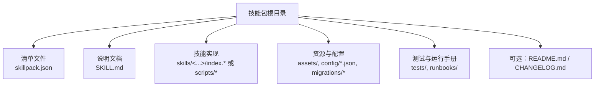
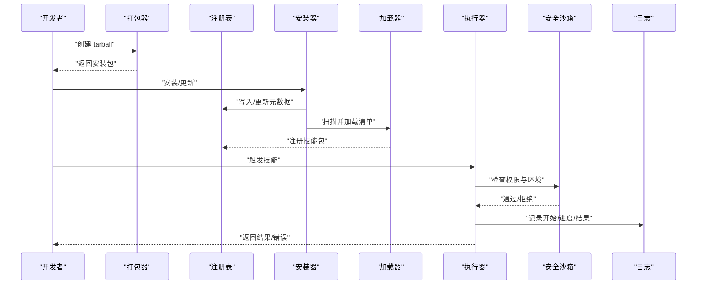
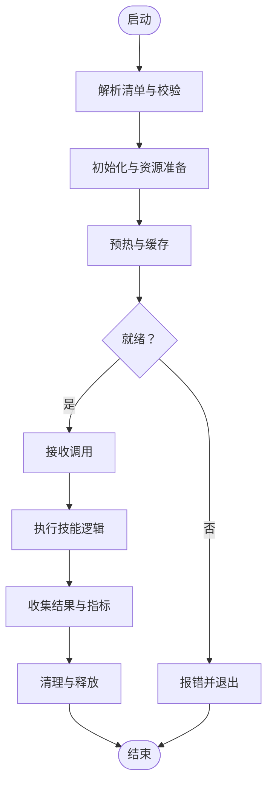
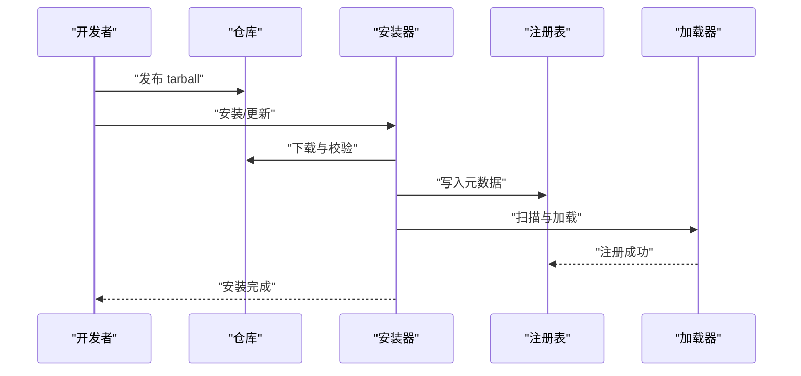
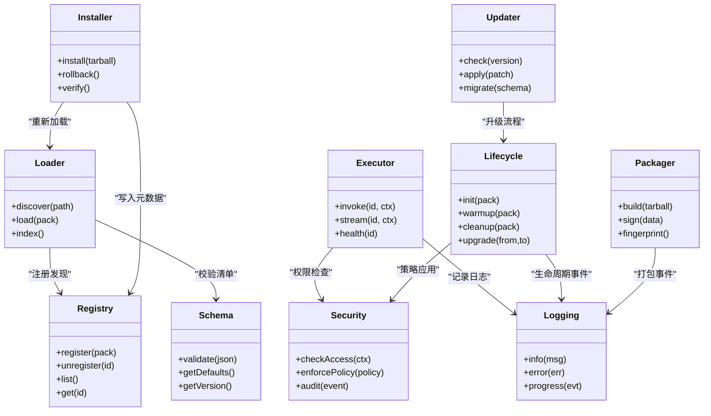

# 技能包开发

<cite>
**本文引用的文件**   
- [GBRAIN_SKILLPACK.md](file://docs/GBRAIN_SKILLPACK.md)
- [skillpack-anatomy.md](file://docs/skillpack-anatomy.md)
- [examples/skillpack-reference/skillpack.json](file://examples/skillpack-reference/skillpack.json)
- [skills/manifest.json](file://skills/manifest.json)
- [scripts/skillify-check.ts](file://scripts/skillify-check.ts)
- [src/core/skillpack/index.ts](file://src/core/skillpack/index.ts)
- [src/core/skillpack/loader.ts](file://src/core/skillpack/loader.ts)
- [src/core/skillpack/registry.ts](file://src/core/skillpack/registry.ts)
- [src/core/skillpack/executor.ts](file://src/core/skillpack/executor.ts)
- [src/core/skillpack/security.ts](file://src/core/skillpack/security.ts)
- [src/core/skillpack/lifecycle.ts](file://src/core/skillpack/lifecycle.ts)
- [src/core/skillpack/logging.ts](file://src/core/skillpack/logging.ts)
- [src/core/skillpack/packager.ts](file://src/core/skillpack/packager.ts)
- [src/core/skillpack/installer.ts](file://src/core/skillpack/installer.ts)
- [src/core/skillpack/updater.ts](file://src/core/skillpack/updater.ts)
- [src/core/skillpack/schema.ts](file://src/core/skillpack/schema.ts)
- [test/skill-manifest.test.ts](file://test/skill-manifest.test.ts)
- [test/skillpack-install.test.ts](file://test/skillpack-install.test.ts)
- [test/skillpack-harvest-lint.test.ts](file://test/skillpack-harvest-lint.test.ts)
- [test/skillpack-scaffold.test.ts](file://test/skillpack-scaffold.test.ts)
- [test/skillpack-tarball.test.ts](file://test/skillpack-tarball.test.ts)
</cite>

## 目录
1. [简介](#简介)
2. [项目结构](#项目结构)
3. [核心组件](#核心组件)
4. [架构总览](#架构总览)
5. [详细组件分析](#详细组件分析)
6. [依赖关系分析](#依赖关系分析)
7. [性能考虑](#性能考虑)
8. [故障排查指南](#故障排查指南)
9. [结论](#结论)
10. [附录](#附录)

## 简介
本指南面向希望为 GBrain 构建“技能包”的开发者，系统阐述技能包的目录组织、清单与说明文档规范、执行环境与安全边界、生命周期管理、错误处理与日志记录、打包分发与安装流程，以及与 GBrain 核心系统的集成方式。文档同时提供可操作的示例路径、调试技巧与测试策略，帮助你在保证安全与可维护性的前提下高效交付高质量技能包。

## 项目结构
一个标准的技能包通常包含以下关键元素：
- 清单文件：描述元数据、版本、入口、权限、依赖等
- 说明文档：定义能力范围、使用方式、约束与注意事项
- 技能实现：脚本或程序，遵循约定的输入输出契约
- 资源与配置：静态资源、环境变量约定、迁移脚本等
- 测试与运行手册：单元测试、端到端用例、运行步骤

章节来源
- [GBRAIN_SKILLPACK.md](file://docs/GBRAIN_SKILLPACK.md)
- [skillpack-anatomy.md](file://docs/skillpack-anatomy.md)

## 核心组件
本节聚焦技能包在 GBrain 中的关键抽象与职责划分：
- 清单解析与校验：负责读取并验证 skillpack.json 的结构与字段语义
- 加载器：发现、枚举与装载技能包，建立内部索引
- 注册表：维护已安装/激活的技能包集合，提供查询与变更通知
- 执行器：在受控环境中调用技能入口，传递上下文与参数
- 安全沙箱：限制网络、文件系统、进程与凭据访问
- 生命周期：初始化、预热、运行、清理与升级
- 日志与遥测：结构化日志、进度事件与审计
- 打包与安装：生成 tarball、校验签名、解压到目标位置、注册

章节来源
- [src/core/skillpack/schema.ts](file://src/core/skillpack/schema.ts)
- [src/core/skillpack/loader.ts](file://src/core/skillpack/loader.ts)
- [src/core/skillpack/registry.ts](file://src/core/skillpack/registry.ts)
- [src/core/skillpack/executor.ts](file://src/core/skillpack/executor.ts)
- [src/core/skillpack/security.ts](file://src/core/skillpack/security.ts)
- [src/core/skillpack/lifecycle.ts](file://src/core/skillpack/lifecycle.ts)
- [src/core/skillpack/logging.ts](file://src/core/skillpack/logging.ts)
- [src/core/skillpack/packager.ts](file://src/core/skillpack/packager.ts)
- [src/core/skillpack/installer.ts](file://src/core/skillpack/installer.ts)
- [src/core/skillpack/updater.ts](file://src/core/skillpack/updater.ts)

## 架构总览
下图展示了技能包从清单到执行的端到端流程，以及各核心模块之间的交互关系。

图表来源
- [src/core/skillpack/packager.ts](file://src/core/skillpack/packager.ts)
- [src/core/skillpack/installer.ts](file://src/core/skillpack/installer.ts)
- [src/core/skillpack/loader.ts](file://src/core/skillpack/loader.ts)
- [src/core/skillpack/registry.ts](file://src/core/skillpack/registry.ts)
- [src/core/skillpack/executor.ts](file://src/core/skillpack/executor.ts)
- [src/core/skillpack/security.ts](file://src/core/skillpack/security.ts)
- [src/core/skillpack/logging.ts](file://src/core/skillpack/logging.ts)

## 详细组件分析

### 清单与说明文档规范（skillpack.json 与 SKILL.md）
- 清单文件（skillpack.json）
  - 必需字段：标识、名称、版本、入口点、运行时要求、权限声明、依赖项、兼容性矩阵等
  - 可选字段：图标、作者、许可证、仓库地址、问题反馈链接、内置资源清单、迁移脚本列表等
  - 校验规则：由 schema 定义，安装与加载阶段进行严格校验
- 说明文档（SKILL.md）
  - 建议包含：能力概述、前置条件、输入输出约定、环境变量、错误码、示例用法、安全注意事项、升级影响等
  - 用于人类可读的使用说明与自动化提示注入

参考示例与权威定义
- 示例清单：[examples/skillpack-reference/skillpack.json](file://examples/skillpack-reference/skillpack.json)
- 官方规范与解剖：[GBRAIN_SKILLPACK.md](file://docs/GBRAIN_SKILLPACK.md)、[skillpack-anatomy.md](file://docs/skillpack-anatomy.md)
- 清单校验与类型定义：[src/core/skillpack/schema.ts](file://src/core/skillpack/schema.ts)
- 清单测试用例：[test/skill-manifest.test.ts](file://test/skill-manifest.test.ts)

章节来源
- [examples/skillpack-reference/skillpack.json](file://examples/skillpack-reference/skillpack.json)
- [GBRAIN_SKILLPACK.md](file://docs/GBRAIN_SKILLPACK.md)
- [skillpack-anatomy.md](file://docs/skillpack-anatomy.md)
- [src/core/skillpack/schema.ts](file://src/core/skillpack/schema.ts)
- [test/skill-manifest.test.ts](file://test/skill-manifest.test.ts)

### 目录组织与命名约定
- 根目录：放置清单与说明文档
- skills 子目录：按功能域拆分具体技能实现，每个技能一个目录，包含入口文件与本地资源
- assets：静态资源（图片、模板、字典等）
- config：配置模板或默认值
- migrations：向后兼容的数据迁移脚本
- tests：单元与集成测试
- runbooks：运维与排障手册

章节来源
- [skillpack-anatomy.md](file://docs/skillpack-anatomy.md)

### 依赖管理与版本控制
- 运行时依赖：在清单中声明语言运行时、外部工具、模型接口等
- 包依赖：支持锁定依赖版本，确保可重现构建
- 版本策略：语义化版本；主版本不兼容变更需配合迁移脚本与升级说明
- 冲突解决：当多个技能包声明相同依赖时，优先满足最小兼容集或显式覆盖策略

章节来源
- [src/core/skillpack/schema.ts](file://src/core/skillpack/schema.ts)
- [src/core/skillpack/updater.ts](file://src/core/skillpack/updater.ts)

### 执行环境与权限模型
- 执行环境：隔离进程或容器化沙箱，限制 CPU/内存/超时
- 权限模型：基于清单声明的最小权限原则，白名单控制网络、文件系统、进程、凭据访问
- 安全边界：禁止直接访问宿主敏感路径，强制代理与审计
- 动态授权：根据上下文按需申请临时权限，记录审计日志

章节来源
- [src/core/skillpack/security.ts](file://src/core/skillpack/security.ts)
- [src/core/skillpack/executor.ts](file://src/core/skillpack/executor.ts)

### 生命周期管理
- 初始化：解析清单、校验、准备资源、建立连接
- 预热：缓存必要数据、预拉取模型或资源
- 运行：接收调用、参数校验、执行、产出结果
- 清理：释放资源、关闭连接、回收临时文件
- 升级：增量更新、回滚策略、迁移执行

图表来源
- [src/core/skillpack/lifecycle.ts](file://src/core/skillpack/lifecycle.ts)
- [src/core/skillpack/executor.ts](file://src/core/skillpack/executor.ts)

章节来源
- [src/core/skillpack/lifecycle.ts](file://src/core/skillpack/lifecycle.ts)

### 错误处理与日志记录
- 错误分类：参数错误、权限拒绝、资源不可用、超时、上游服务异常等
- 错误传播：标准化错误对象，附带上下文与追踪 ID
- 重试与退避：对幂等操作实施指数退避与熔断
- 日志记录：结构化 JSON 日志，包含时间戳、级别、模块、请求 ID、耗时、状态码
- 审计：关键操作（安装、升级、权限变更）写入审计日志

章节来源
- [src/core/skillpack/logging.ts](file://src/core/skillpack/logging.ts)
- [src/core/skillpack/executor.ts](file://src/core/skillpack/executor.ts)

### 打包、分发与安装
- 打包：将清单、实现、资源与测试打包为 tarball，计算指纹与签名
- 分发：上传至私有或公共仓库，提供版本索引与校验和
- 安装：下载、校验、解压、注册、初始化；失败自动回滚
- 更新：检测新版本、差异合并、迁移执行、健康检查

图表来源
- [src/core/skillpack/packager.ts](file://src/core/skillpack/packager.ts)
- [src/core/skillpack/installer.ts](file://src/core/skillpack/installer.ts)
- [src/core/skillpack/loader.ts](file://src/core/skillpack/loader.ts)
- [src/core/skillpack/registry.ts](file://src/core/skillpack/registry.ts)

章节来源
- [src/core/skillpack/packager.ts](file://src/core/skillpack/packager.ts)
- [src/core/skillpack/installer.ts](file://src/core/skillpack/installer.ts)
- [src/core/skillpack/loader.ts](file://src/core/skillpack/loader.ts)
- [src/core/skillpack/registry.ts](file://src/core/skillpack/registry.ts)

### 与 GBrain 核心系统集成
- 注册表集成：统一注册、发现与查询
- 命令路由：通过 CLI 或服务层路由到对应技能
- 上下文注入：会话、用户、来源、权限上下文透传
- 事件总线：进度、告警、审计事件上报

章节来源
- [src/core/skillpack/registry.ts](file://src/core/skillpack/registry.ts)
- [src/core/skillpack/executor.ts](file://src/core/skillpack/executor.ts)

### 开发示例与最佳实践
- 参考示例：查看示例技能包结构与清单
  - [examples/skillpack-reference/skillpack.json](file://examples/skillpack-reference/skillpack.json)
- 清单校验与脚手架：
  - [scripts/skillify-check.ts](file://scripts/skillify-check.ts)
  - [test/skillpack-scaffold.test.ts](file://test/skillpack-scaffold.test.ts)
- 清单与安装测试：
  - [test/skill-manifest.test.ts](file://test/skill-manifest.test.ts)
  - [test/skillpack-install.test.ts](file://test/skillpack-install.test.ts)
- 打包与归档：
  - [test/skillpack-tarball.test.ts](file://test/skillpack-tarball.test.ts)
- 清单采集与 Lint：
  - [test/skillpack-harvest-lint.test.ts](file://test/skillpack-harvest-lint.test.ts)

章节来源
- [examples/skillpack-reference/skillpack.json](file://examples/skillpack-reference/skillpack.json)
- [scripts/skillify-check.ts](file://scripts/skillify-check.ts)
- [test/skillpack-scaffold.test.ts](file://test/skillpack-scaffold.test.ts)
- [test/skill-manifest.test.ts](file://test/skill-manifest.test.ts)
- [test/skillpack-install.test.ts](file://test/skillpack-install.test.ts)
- [test/skillpack-tarball.test.ts](file://test/skillpack-tarball.test.ts)
- [test/skillpack-harvest-lint.test.ts](file://test/skillpack-harvest-lint.test.ts)

## 依赖关系分析
技能包核心模块之间的依赖关系如下：

图表来源
- [src/core/skillpack/schema.ts](file://src/core/skillpack/schema.ts)
- [src/core/skillpack/loader.ts](file://src/core/skillpack/loader.ts)
- [src/core/skillpack/registry.ts](file://src/core/skillpack/registry.ts)
- [src/core/skillpack/executor.ts](file://src/core/skillpack/executor.ts)
- [src/core/skillpack/security.ts](file://src/core/skillpack/security.ts)
- [src/core/skillpack/lifecycle.ts](file://src/core/skillpack/lifecycle.ts)
- [src/core/skillpack/logging.ts](file://src/core/skillpack/logging.ts)
- [src/core/skillpack/packager.ts](file://src/core/skillpack/packager.ts)
- [src/core/skillpack/installer.ts](file://src/core/skillpack/installer.ts)
- [src/core/skillpack/updater.ts](file://src/core/skillpack/updater.ts)

章节来源
- [src/core/skillpack/index.ts](file://src/core/skillpack/index.ts)

## 性能考虑
- 清单解析与索引：批量扫描与增量更新，避免全量重算
- 资源预热：按需预加载常用资源，减少冷启动延迟
- 并发与限流：限制并行任务数，防止资源争用
- 缓存策略：对只读数据进行短期缓存，设置失效与一致性校验
- 日志开销：异步落盘与采样，避免阻塞主流程

## 故障排查指南
- 清单校验失败：检查字段类型、必填项与版本兼容性
- 权限拒绝：核对权限声明与实际访问是否匹配，审查审计日志
- 安装失败：确认 tarball 完整性、签名与仓库可达性，查看回滚日志
- 执行超时：调整超时阈值，优化资源占用，检查上游依赖
- 日志定位：通过请求 ID 关联调用链，结合进度事件定位瓶颈

章节来源
- [src/core/skillpack/logging.ts](file://src/core/skillpack/logging.ts)
- [src/core/skillpack/security.ts](file://src/core/skillpack/security.ts)
- [src/core/skillpack/installer.ts](file://src/core/skillpack/installer.ts)
- [src/core/skillpack/executor.ts](file://src/core/skillpack/executor.ts)

## 结论
通过规范的清单与说明文档、严格的权限与安全边界、完善的生命周期与日志机制，以及可靠的打包安装流程，技能包能够在 GBrain 中安全、稳定地扩展能力。建议在开发过程中充分使用示例与测试套件，持续进行清单校验与回归测试，确保升级过程平滑且可追溯。

## 附录
- 清单字段速查：参见清单校验与示例
  - [src/core/skillpack/schema.ts](file://src/core/skillpack/schema.ts)
  - [examples/skillpack-reference/skillpack.json](file://examples/skillpack-reference/skillpack.json)
- 全局技能清单（聚合）：
  - [skills/manifest.json](file://skills/manifest.json)
- 清单采集与 Lint 工具：
  - [scripts/skillify-check.ts](file://scripts/skillify-check.ts)
  - [test/skillpack-harvest-lint.test.ts](file://test/skillpack-harvest-lint.test.ts)