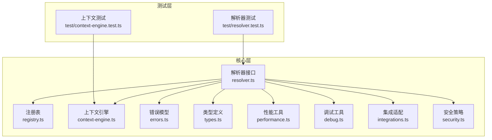
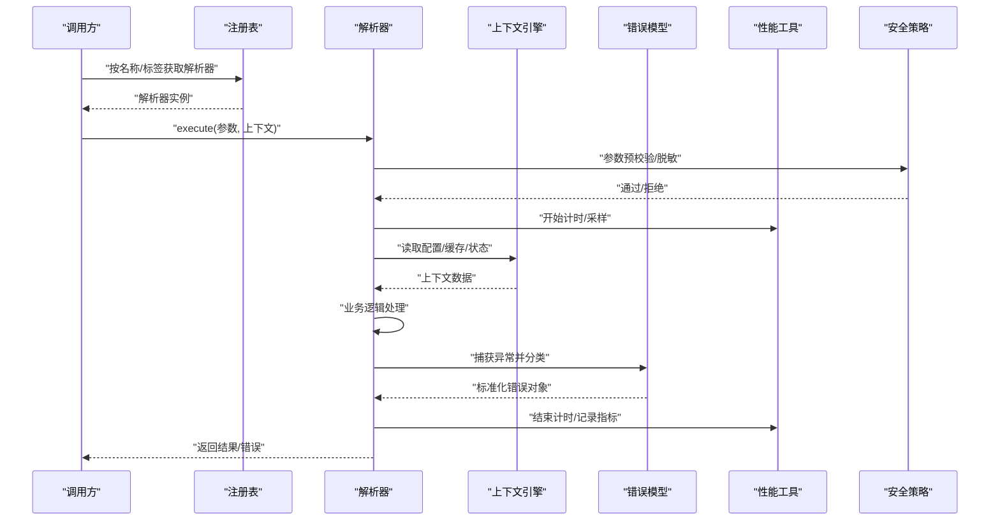
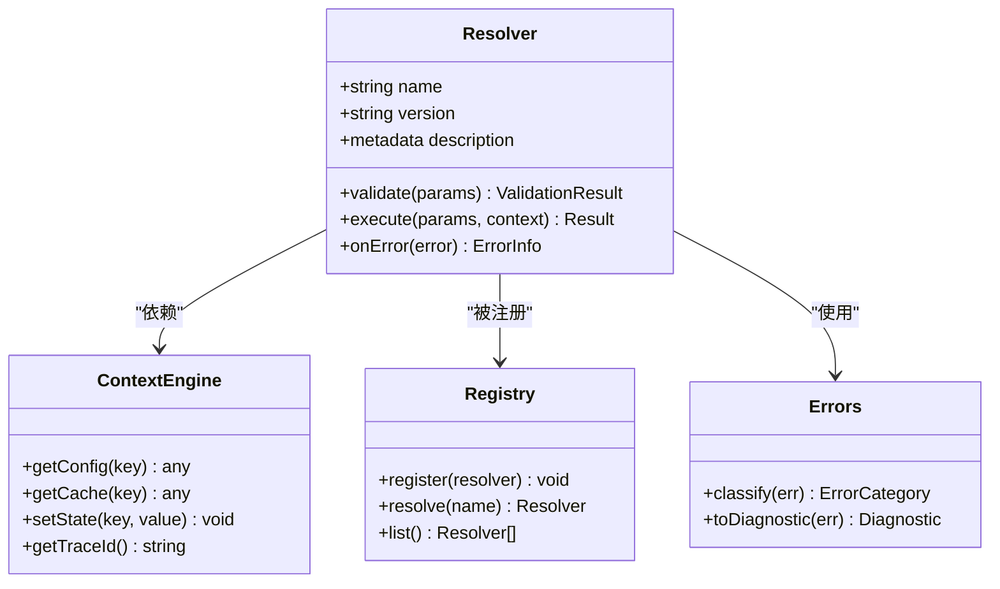
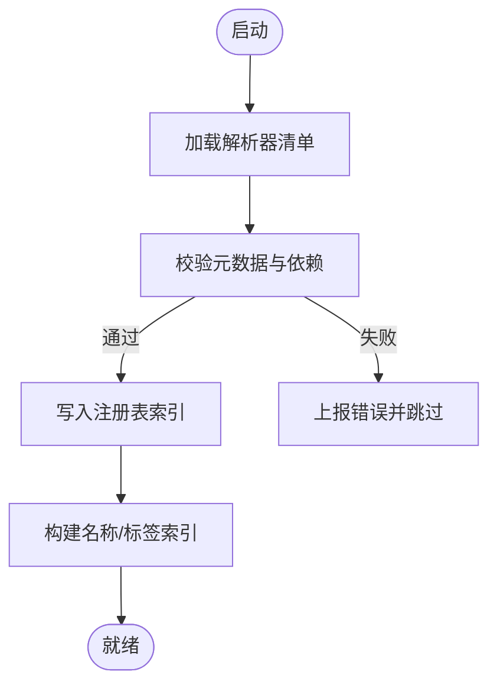
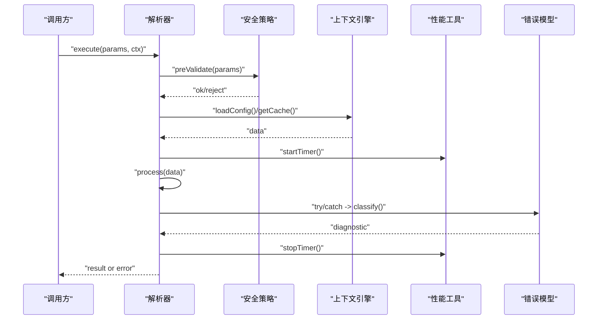
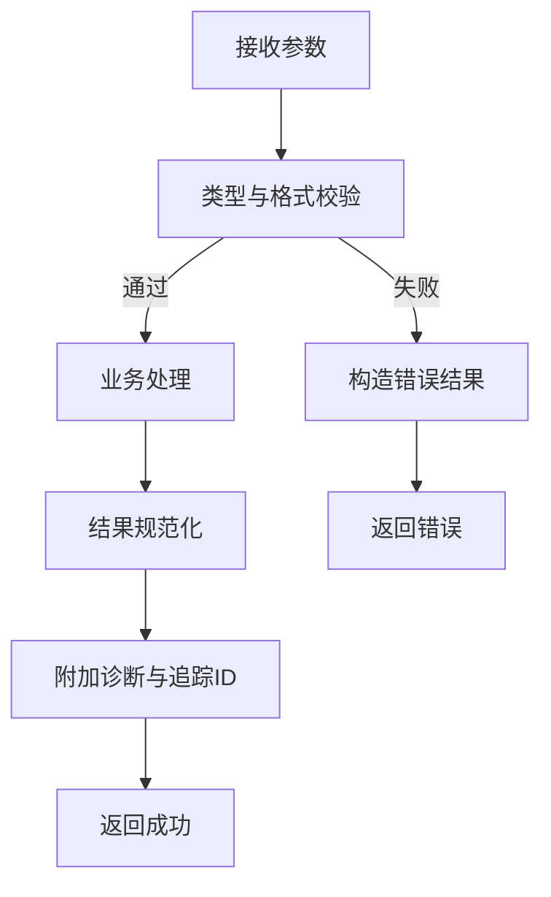
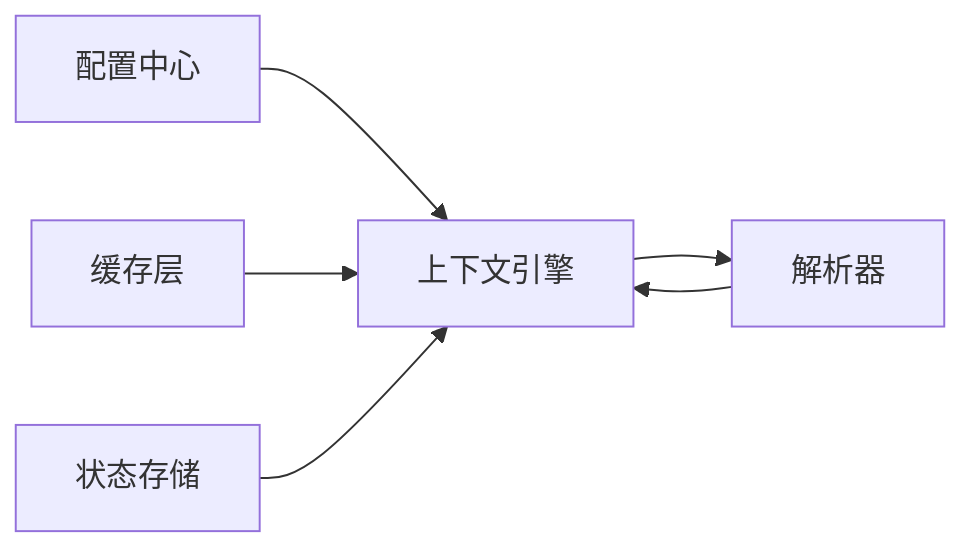
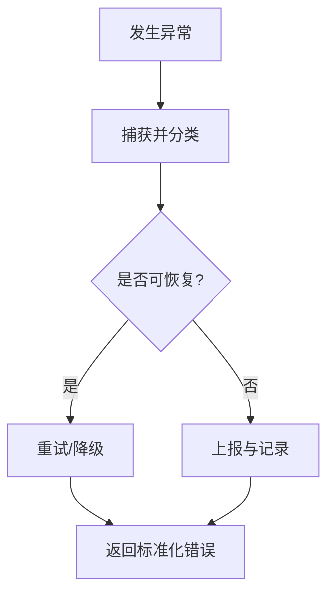
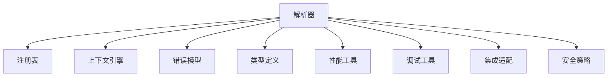

# 解析器开发

<cite>
**本文引用的文件**   
- [src/core/resolver.ts](file://src/core/resolver.ts)
- [src/core/context-engine.ts](file://src/core/context-engine.ts)
- [src/core/registry.ts](file://src/core/registry.ts)
- [src/core/errors.ts](file://src/core/errors.ts)
- [src/core/types.ts](file://src/core/types.ts)
- [src/core/performance.ts](file://src/core/performance.ts)
- [src/core/debug.ts](file://src/core/debug.ts)
- [src/core/integrations.ts](file://src/core/integrations.ts)
- [src/core/security.ts](file://src/core/security.ts)
- [test/resolver.test.ts](file://test/resolver.test.ts)
- [test/context-engine.test.ts](file://test/context-engine.test.ts)
</cite>

## 目录
1. [简介](#简介)
2. [项目结构](#项目结构)
3. [核心组件](#核心组件)
4. [架构总览](#架构总览)
5. [详细组件分析](#详细组件分析)
6. [依赖关系分析](#依赖关系分析)
7. [性能考虑](#性能考虑)
8. [故障排查指南](#故障排查指南)
9. [结论](#结论)
10. [附录](#附录)

## 简介
本指南面向希望实现自定义解析器的开发者，系统阐述解析器的接口定义、注册机制与执行流程；深入说明类型定义、参数校验与返回值处理；解释上下文引擎的集成方式、数据流与状态管理；提供内置解析器示例与扩展模式；并覆盖错误处理、性能优化、调试技巧以及第三方数据源集成的最佳实践与安全考量。

## 项目结构
本项目采用分层与模块化组织方式：
- 核心层（core）：包含解析器接口、注册表、上下文引擎、错误与类型定义、性能与调试工具、集成与安全模块等。
- 测试层（test）：围绕核心能力编写单元测试与集成测试，覆盖解析器生命周期、上下文交互、错误路径与性能回归。
- 文档与示例：README、设计文档与示例脚本辅助理解整体架构与使用方式。

图表来源
- [src/core/resolver.ts](file://src/core/resolver.ts)
- [src/core/registry.ts](file://src/core/registry.ts)
- [src/core/context-engine.ts](file://src/core/context-engine.ts)
- [src/core/errors.ts](file://src/core/errors.ts)
- [src/core/types.ts](file://src/core/types.ts)
- [src/core/performance.ts](file://src/core/performance.ts)
- [src/core/debug.ts](file://src/core/debug.ts)
- [src/core/integrations.ts](file://src/core/integrations.ts)
- [src/core/security.ts](file://src/core/security.ts)
- [test/resolver.test.ts](file://test/resolver.test.ts)
- [test/context-engine.test.ts](file://test/context-engine.test.ts)

章节来源
- [src/core/resolver.ts](file://src/core/resolver.ts)
- [src/core/registry.ts](file://src/core/registry.ts)
- [src/core/context-engine.ts](file://src/core/context-engine.ts)
- [src/core/errors.ts](file://src/core/errors.ts)
- [src/core/types.ts](file://src/core/types.ts)
- [src/core/performance.ts](file://src/core/performance.ts)
- [src/core/debug.ts](file://src/core/debug.ts)
- [src/core/integrations.ts](file://src/core/integrations.ts)
- [src/core/security.ts](file://src/core/security.ts)
- [test/resolver.test.ts](file://test/resolver.test.ts)
- [test/context-engine.test.ts](file://test/context-engine.test.ts)

## 核心组件
- 解析器接口：定义统一的输入输出契约、元数据描述、参数校验与结果返回规范。
- 注册表：集中管理解析器实例，支持按名称或标签查找、版本兼容与优先级排序。
- 上下文引擎：为解析器提供运行时上下文访问、资源加载、缓存与状态同步。
- 错误模型：统一异常分类、可恢复性标记与诊断信息。
- 类型定义：约束输入参数、中间态与输出结果的类型结构。
- 性能工具：计时、采样、限流与并发控制。
- 调试工具：结构化日志、断点注入与追踪ID传播。
- 集成适配：对接外部数据源、认证与网络层的抽象。
- 安全策略：输入过滤、权限校验与敏感信息脱敏。

章节来源
- [src/core/resolver.ts](file://src/core/resolver.ts)
- [src/core/registry.ts](file://src/core/registry.ts)
- [src/core/context-engine.ts](file://src/core/context-engine.ts)
- [src/core/errors.ts](file://src/core/errors.ts)
- [src/core/types.ts](file://src/core/types.ts)
- [src/core/performance.ts](file://src/core/performance.ts)
- [src/core/debug.ts](file://src/core/debug.ts)
- [src/core/integrations.ts](file://src/core/integrations.ts)
- [src/core/security.ts](file://src/core/security.ts)

## 架构总览
下图展示了解析器从注册到执行的端到端流程，以及与上下文引擎、错误与类型系统的协作关系。

图表来源
- [src/core/resolver.ts](file://src/core/resolver.ts)
- [src/core/registry.ts](file://src/core/registry.ts)
- [src/core/context-engine.ts](file://src/core/context-engine.ts)
- [src/core/errors.ts](file://src/core/errors.ts)
- [src/core/performance.ts](file://src/core/performance.ts)
- [src/core/security.ts](file://src/core/security.ts)

## 详细组件分析

### 解析器接口与类型定义
- 输入参数：遵循强类型约束，支持可选字段与默认值；提供参数校验钩子以在执行业务前进行合法性检查。
- 元数据：包含名称、版本、描述、依赖声明与兼容性矩阵，便于注册表管理与升级策略。
- 返回值：统一封装成功结果与失败结果，附带诊断信息与追踪ID，便于观测与排障。
- 副作用：明确标注是否允许IO、网络请求与状态变更，配合安全策略进行白名单控制。

图表来源
- [src/core/resolver.ts](file://src/core/resolver.ts)
- [src/core/context-engine.ts](file://src/core/context-engine.ts)
- [src/core/registry.ts](file://src/core/registry.ts)
- [src/core/errors.ts](file://src/core/errors.ts)

章节来源
- [src/core/resolver.ts](file://src/core/resolver.ts)
- [src/core/types.ts](file://src/core/types.ts)

### 注册机制与发现
- 注册流程：解析器启动时向注册表登记自身元数据与能力标签；注册表维护索引以便快速查找。
- 版本兼容：注册表根据语义化版本与兼容性矩阵选择最合适的实现。
- 优先级与覆盖：支持多实现并存，通过优先级决定默认行为，并提供显式覆盖机制。
- 动态更新：支持热重载与增量注册，避免重启服务。

图表来源
- [src/core/registry.ts](file://src/core/registry.ts)
- [src/core/resolver.ts](file://src/core/resolver.ts)

章节来源
- [src/core/registry.ts](file://src/core/registry.ts)

### 执行流程与上下文集成
- 前置校验：安全策略对输入进行过滤与脱敏，防止注入与越权。
- 上下文读取：从上下文引擎获取配置、缓存与状态，确保幂等与一致性。
- 业务处理：解析器内部逻辑，可能涉及本地计算与外部调用。
- 后置处理：结果规范化、指标采集与审计日志记录。
- 错误处理：统一捕获与分类，返回诊断信息，必要时触发重试或降级。

图表来源
- [src/core/resolver.ts](file://src/core/resolver.ts)
- [src/core/context-engine.ts](file://src/core/context-engine.ts)
- [src/core/security.ts](file://src/core/security.ts)
- [src/core/performance.ts](file://src/core/performance.ts)
- [src/core/errors.ts](file://src/core/errors.ts)

章节来源
- [src/core/resolver.ts](file://src/core/resolver.ts)
- [src/core/context-engine.ts](file://src/core/context-engine.ts)
- [src/core/security.ts](file://src/core/security.ts)
- [src/core/performance.ts](file://src/core/performance.ts)
- [src/core/errors.ts](file://src/core/errors.ts)

### 参数验证与返回值处理
- 参数验证：基于类型定义进行结构校验、范围检查与格式验证；支持自定义校验规则。
- 返回值处理：成功结果携带必要字段与溯源信息；失败结果包含错误类别、消息与修复建议。
- 幂等与去重：对相同输入生成稳定键，结合缓存减少重复计算。

图表来源
- [src/core/resolver.ts](file://src/core/resolver.ts)
- [src/core/types.ts](file://src/core/types.ts)
- [src/core/errors.ts](file://src/core/errors.ts)

章节来源
- [src/core/resolver.ts](file://src/core/resolver.ts)
- [src/core/types.ts](file://src/core/types.ts)
- [src/core/errors.ts](file://src/core/errors.ts)

### 内置解析器示例与扩展模式
- 内置示例：提供基础文本解析、JSON提取与URL归一化等通用解析器，作为参考实现。
- 扩展模式：
  - 组合式：将多个小解析器串联，形成流水线。
  - 插件式：通过注册表动态加载第三方解析器。
  - 适配器式：对外部API进行适配，屏蔽差异。
- 测试驱动：为每个解析器编写单测与边界用例，确保稳定性。

章节来源
- [src/core/resolver.ts](file://src/core/resolver.ts)
- [src/core/registry.ts](file://src/core/registry.ts)
- [test/resolver.test.ts](file://test/resolver.test.ts)

### 上下文引擎的数据流与状态管理
- 数据流：配置加载、缓存命中、状态快照与事件广播。
- 状态管理：原子更新、冲突检测与回滚；支持只读视图与写隔离。
- 集成方式：解析器通过上下文引擎访问共享资源，避免直接耦合外部系统。

图表来源
- [src/core/context-engine.ts](file://src/core/context-engine.ts)

章节来源
- [src/core/context-engine.ts](file://src/core/context-engine.ts)
- [test/context-engine.test.ts](file://test/context-engine.test.ts)

### 错误处理与诊断
- 错误分类：网络、校验、业务、系统四类，便于分级处理与告警。
- 诊断信息：包含堆栈、上下文快照与追踪ID，提升定位效率。
- 恢复策略：重试、降级与熔断；对可恢复错误自动补偿。

图表来源
- [src/core/errors.ts](file://src/core/errors.ts)
- [src/core/resolver.ts](file://src/core/resolver.ts)

章节来源
- [src/core/errors.ts](file://src/core/errors.ts)
- [src/core/resolver.ts](file://src/core/resolver.ts)

### 性能优化与调试技巧
- 性能优化：
  - 批量处理与合并请求，降低网络开销。
  - 缓存热点数据，设置合理TTL与失效策略。
  - 限制并发度，避免资源争用。
- 调试技巧：
  - 启用结构化日志与采样率控制。
  - 注入追踪ID贯穿调用链。
  - 使用断点与慢查询分析定位瓶颈。

章节来源
- [src/core/performance.ts](file://src/core/performance.ts)
- [src/core/debug.ts](file://src/core/debug.ts)

### 第三方数据源集成与安全性
- 集成最佳实践：
  - 使用适配器抽象外部API差异。
  - 统一认证与令牌刷新机制。
  - 超时、重试与退避策略。
- 安全考虑：
  - 输入过滤与输出脱敏。
  - 最小权限原则与访问白名单。
  - 敏感配置加密存储与传输保护。

章节来源
- [src/core/integrations.ts](file://src/core/integrations.ts)
- [src/core/security.ts](file://src/core/security.ts)

## 依赖关系分析
解析器与注册表、上下文引擎、错误与类型系统之间存在清晰的分层依赖，避免循环引用与紧耦合。

图表来源
- [src/core/resolver.ts](file://src/core/resolver.ts)
- [src/core/registry.ts](file://src/core/registry.ts)
- [src/core/context-engine.ts](file://src/core/context-engine.ts)
- [src/core/errors.ts](file://src/core/errors.ts)
- [src/core/types.ts](file://src/core/types.ts)
- [src/core/performance.ts](file://src/core/performance.ts)
- [src/core/debug.ts](file://src/core/debug.ts)
- [src/core/integrations.ts](file://src/core/integrations.ts)
- [src/core/security.ts](file://src/core/security.ts)

章节来源
- [src/core/resolver.ts](file://src/core/resolver.ts)
- [src/core/registry.ts](file://src/core/registry.ts)
- [src/core/context-engine.ts](file://src/core/context-engine.ts)
- [src/core/errors.ts](file://src/core/errors.ts)
- [src/core/types.ts](file://src/core/types.ts)
- [src/core/performance.ts](file://src/core/performance.ts)
- [src/core/debug.ts](file://src/core/debug.ts)
- [src/core/integrations.ts](file://src/core/integrations.ts)
- [src/core/security.ts](file://src/core/security.ts)

## 性能考虑
- 批处理与合并：将多次小请求合并为批量操作，减少往返次数。
- 缓存策略：区分读写热点，设置合理的过期时间与失效条件。
- 并发控制：限制并行度，避免数据库与外部API过载。
- 监控与告警：采集延迟、吞吐与错误率，设定阈值触发告警。

[本节为通用指导，不直接分析具体文件]

## 故障排查指南
- 常见问题：
  - 参数校验失败：检查类型定义与输入格式。
  - 上下文缺失：确认配置加载与缓存初始化顺序。
  - 外部调用超时：调整超时与重试策略，检查网络连通性。
- 诊断步骤：
  - 查看结构化日志与追踪ID。
  - 复现最小用例并开启详细日志。
  - 使用性能工具定位瓶颈。

章节来源
- [src/core/errors.ts](file://src/core/errors.ts)
- [src/core/debug.ts](file://src/core/debug.ts)
- [src/core/performance.ts](file://src/core/performance.ts)

## 结论
通过统一的解析器接口、完善的注册机制与上下文引擎集成，本项目提供了可扩展、可观测且安全的解析器开发框架。遵循本文档的最佳实践，可以快速实现高质量自定义解析器，并在生产环境中获得稳定的性能与可靠性。

[本节为总结性内容，不直接分析具体文件]

## 附录
- 术语表：解析器、注册表、上下文引擎、错误分类、诊断信息。
- 参考链接：README与设计文档，帮助理解整体架构与演进路线。

[本节为补充信息，不直接分析具体文件]