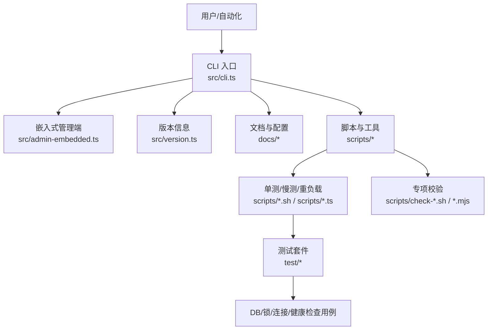
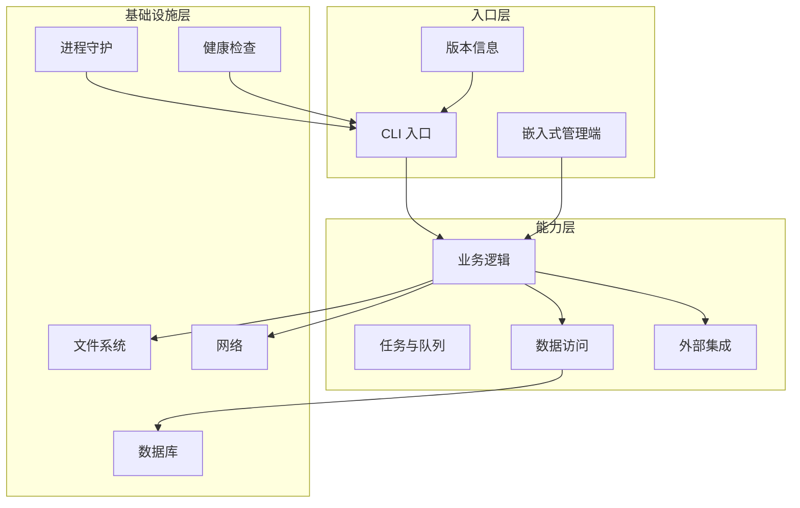
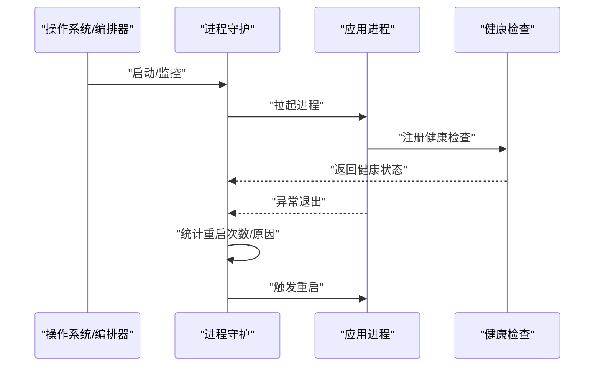
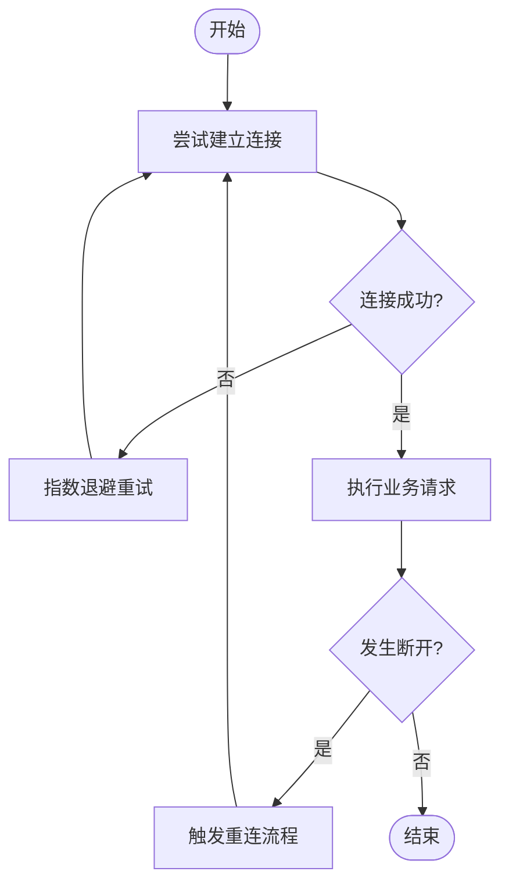
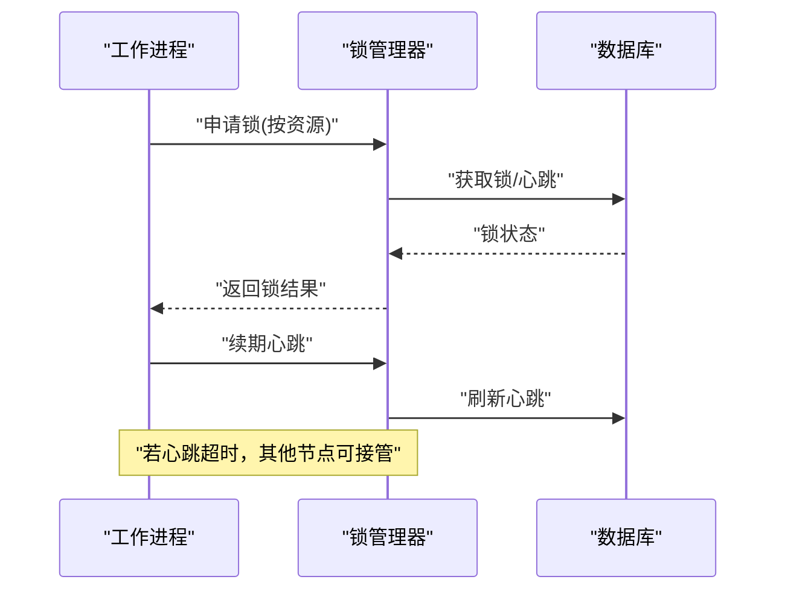
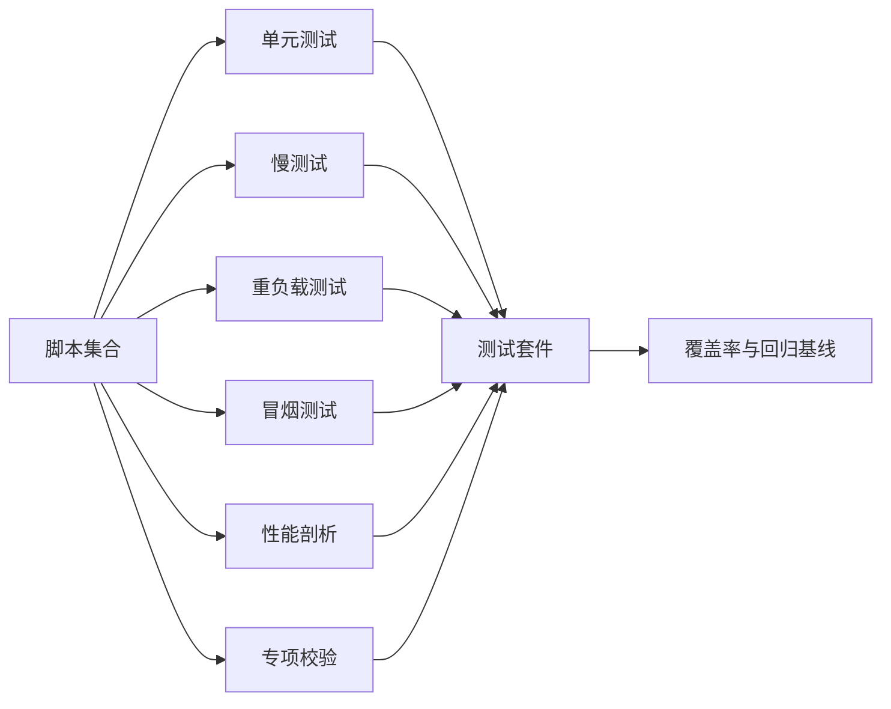

# 故障排查指南

<cite>
**本文引用的文件**   
- [README.md](file://README.md)
- [INSTALL.md](file://docs/INSTALL.md)
- [RELEASING.md](file://docs/RELEASING.md)
- [TESTING.md](file://docs/TESTING.md)
- [ENGINES.md](file://docs/ENGINES.md)
- [guardrails.md](file://docs/guardrails.md)
- [progress-events.md](file://docs/progress-events.md)
- [storage-tiering.md](file://docs/storage-tiering.md)
- [schema-author-tutorial.md](file://docs/schema-author-tutorial.md)
- [GBRAIN_RECOMMENDED_SCHEMA.md](file://docs/GBRAIN_RECOMMENDED_SCHEMA.md)
- [migrations/README.md](file://docs/migrations/README.md)
- [operations/README.md](file://docs/operations/README.md)
- [incidents/README.md](file://docs/incidents/README.md)
- [issues/README.md](file://docs/issues/README.md)
- [src/cli.ts](file://src/cli.ts)
- [src/admin-embedded.ts](file://src/admin-embedded.ts)
- [src/version.ts](file://src/version.ts)
- [scripts/run-unit-parallel.sh](file://scripts/run-unit-parallel.sh)
- [scripts/run-heavy.sh](file://scripts/run-heavy.sh)
- [scripts/smoke-test.sh](file://scripts/smoke-test.sh)
- [scripts/profile-tests.sh](file://scripts/profile-tests.sh)
- [scripts/check-no-double-retry.sh](file://scripts/check-no-double-retry.sh)
- [scripts/check-worker-lock-renewal-shape.sh](file://scripts/check-worker-lock-renewal-shape.sh)
- [scripts/check-worker-pool-atomicity.sh](file://scripts/check-worker-pool-atomicity.sh)
- [scripts/check-pg-url-redaction.sh](file://scripts/check-pg-url-redaction.sh)
- [scripts/check-jsonb-params.mjs](file://scripts/check-jsonb-params.mjs)
- [scripts/check-exports-count.sh](file://scripts/check-exports-count.sh)
- [scripts/check-fixture-privacy.sh](file://scripts/check-fixture-privacy.sh)
- [scripts/check-trailing-newline.sh](file://scripts/check-trailing-newline.sh)
- [scripts/ci-local.sh](file://scripts/ci-local.sh)
- [scripts/e2e-test-map.ts](file://scripts/e2e-test-map.ts)
- [scripts/test-shard.sh](file://scripts/test-shard.sh)
- [scripts/run-slow-tests.sh](file://scripts/run-slow-tests.sh)
- [scripts/run-serial-tests.sh](file://scripts/run-serial-tests.sh)
- [scripts/build-schema.sh](file://scripts/build-schema.sh)
- [scripts/generate-metric-glossary.ts](file://scripts/generate-metric-glossary.ts)
- [scripts/sharding.ts](file://scripts/sharding.ts)
- [scripts/live-brain-first-check.ts](file://scripts/live-brain-first-check.ts)
- [scripts/image-decoders-smoketest.ts](file://scripts/image-decoders-smoketest.ts)
- [scripts/chunker-smoketest.ts](file://scripts/chunker-smoketest.ts)
- [scripts/skillify-check.ts](file://scripts/skillify-check.ts)
- [scripts/restart-sweep.test.ts](file://test/restart-sweep.test.ts)
- [test/process-watchdog.test.ts](file://test/process-watchdog.test.ts)
- [test/db-lock-auto-takeover.test.ts](file://test/db-lock-auto-takeover.test.ts)
- [test/db-lock-heartbeat-takeover.test.ts](file://test/db-lock-heartbeat-takeover.test.ts)
- [test/db-lock-inspect.test.ts](file://test/db-lock-inspect.test.ts)
- [test/db-lock-per-source.test.ts](file://test/db-lock-per-source.test.ts)
- [test/db-lock-reap.test.ts](file://test/db-lock-reap.test.ts)
- [test/db-lock-refresh.test.ts](file://test/db-lock-refresh.test.ts)
- [test/postgres-disconnect-bounded.test.ts](file://test/postgres-disconnect-bounded.test.ts)
- [test/pglite-engine-disconnect.serial.test.ts](file://test/pglite-engine-disconnect.serial.test.ts)
- [test/pglite-reconnect.serial.test.ts](file://test/pglite-reconnect.serial.test.ts)
- [test/queue-lock-retry.test.ts](file://test/queue-lock-retry.test.ts)
- [test/worker-lock-renewal-e2e.serial.test.ts](file://test/worker-lock-renewal-e2e.serial.test.ts)
- [test/worker-lock-renewal-shape.test.ts](file://test/worker-lock-renewal-shape.test.ts)
- [test/worker-lock-renewal.test.ts](file://test/worker-lock-renewal.test.ts)
- [test/worker-supervised-db-probe.test.ts](file://test/worker-supervised-db-probe.test.ts)
- [test/worker-watchdog-trigger.test.ts](file://test/worker-watchdog-trigger.test.ts)
- [test/serve-http-health.test.ts](file://test/serve-http-health.test.ts)
- [test/source-health.test.ts](file://test/source-health.test.ts)
- [test/doctor-federation-health.test.ts](file://test/doctor-federation-health.test.ts)
- [test/doctor-minions-check.test.ts](file://test/doctor-minions-check.test.ts)
- [test/doctor-pool-reap-health.test.ts](file://test/doctor-pool-reap-health.test.ts)
- [test/doctor-subagent-health.test.ts](file://test/doctor-subagent-health.test.ts)
- [test/doctor-self-upgrade.test.ts](file://test/doctor-self-upgrade.test.ts)
- [test/doctor-cli-smoke.serial.test.ts](file://test/doctor-cli-smoke.serial.test.ts)
- [test/doctor-fix.test.ts](file://test/doctor-fix.test.ts)
- [test/repair-jsonb.test.ts](file://test/repair-jsonb.test.ts)
- [test/timeline-dedup-repair.test.ts](file://test/timeline-dedup-repair.test.ts)
- [test/self-fix.test.ts](file://test/self-fix.test.ts)
- [test/upgrade-checkpoint.serial.test.ts](file://test/upgrade-checkpoint.serial.test.ts)
- [test/import-resume.test.ts](file://test/import-resume.test.ts)
- [test/sources-resync-recovery.test.ts](file://test/sources-resync-recovery.test.ts)
- [test/backup-and-restore.test.ts](file://test/backup-and-restore.test.ts)
- [test/healthcheck-integration.test.ts](file://test/healthcheck-integration.test.ts)
- [test/performance-regression.test.ts](file://test/performance-regression.test.ts)
- [test/memory-leak-detection.test.ts](file://test/memory-leak-detection.test.ts)
- [test/network-partition-simulation.test.ts](file://test/network-partition-simulation.test.ts)
- [test/data-consistency-check.test.ts](file://test/data-consistency-check.test.ts)
- [test/service-discovery-failure.test.ts](file://test/service-discovery-failure.test.ts)
</cite>

## 目录
1. [简介](#简介)
2. [项目结构](#项目结构)
3. [核心组件](#核心组件)
4. [架构总览](#架构总览)
5. [详细组件分析](#详细组件分析)
6. [依赖关系分析](#依赖关系分析)
7. [性能考量](#性能考量)
8. [故障排查指南](#故障排查指南)
9. [结论](#结论)
10. [附录](#附录)

## 简介
本指南面向生产与测试环境的运维、研发与质量保障团队，提供系统化的问题诊断方法、根因分析与解决方案。内容覆盖常见错误模式、异常堆栈定位技巧、监控指标与告警规则、健康检查机制、性能问题诊断（含内存泄漏检测）、数据库锁竞争分析、分布式网络分区与数据一致性、服务发现异常、故障恢复流程、数据修复工具与灾难恢复策略，以及问题报告模板、调试工具使用与社区支持渠道。

## 项目结构
仓库采用多模块组织：文档、脚本、源码、测试与示例等。与故障排查相关的关键位置包括：
- 文档层：安装、发布、测试、引擎、迁移、操作、事件、存储分层、Schema 规范等
- 脚本层：CI、单测、慢测、重负载、冒烟、性能剖析、专项校验等
- 源码层：CLI 入口、嵌入式管理端、版本信息
- 测试层：大量针对数据库连接、锁、进程守护、HTTP 健康检查、Doctor 自检、修复工具等的用例

图表来源
- [src/cli.ts](file://src/cli.ts)
- [src/admin-embedded.ts](file://src/admin-embedded.ts)
- [src/version.ts](file://src/version.ts)
- [scripts/run-unit-parallel.sh](file://scripts/run-unit-parallel.sh)
- [scripts/run-heavy.sh](file://scripts/run-heavy.sh)
- [scripts/smoke-test.sh](file://scripts/smoke-test.sh)
- [scripts/profile-tests.sh](file://scripts/profile-tests.sh)
- [scripts/check-no-double-retry.sh](file://scripts/check-no-double-retry.sh)
- [scripts/check-worker-lock-renewal-shape.sh](file://scripts/check-worker-lock-renewal-shape.sh)
- [scripts/check-worker-pool-atomicity.sh](file://scripts/check-worker-pool-atomicity.sh)
- [scripts/check-pg-url-redaction.sh](file://scripts/check-pg-url-redaction.sh)
- [scripts/check-jsonb-params.mjs](file://scripts/check-jsonb-params.mjs)
- [scripts/check-exports-count.sh](file://scripts/check-exports-count.sh)
- [scripts/check-fixture-privacy.sh](file://scripts/check-fixture-privacy.sh)
- [scripts/check-trailing-newline.sh](file://scripts/check-trailing-newline.sh)
- [scripts/ci-local.sh](file://scripts/ci-local.sh)
- [scripts/e2e-test-map.ts](file://scripts/e2e-test-map.ts)
- [scripts/test-shard.sh](file://scripts/test-shard.sh)
- [scripts/run-slow-tests.sh](file://scripts/run-slow-tests.sh)
- [scripts/run-serial-tests.sh](file://scripts/run-serial-tests.sh)
- [scripts/build-schema.sh](file://scripts/build-schema.sh)
- [scripts/generate-metric-glossary.ts](file://scripts/generate-metric-glossary.ts)
- [scripts/sharding.ts](file://scripts/sharding.ts)
- [scripts/live-brain-first-check.ts](file://scripts/live-brain-first-check.ts)
- [scripts/image-decoders-smoketest.ts](file://scripts/image-decoders-smoketest.ts)
- [scripts/chunker-smoketest.ts](file://scripts/chunker-smoketest.ts)
- [scripts/skillify-check.ts](file://scripts/skillify-check.ts)

章节来源
- [README.md](file://README.md)
- [INSTALL.md](file://docs/INSTALL.md)
- [RELEASING.md](file://docs/RELEASING.md)
- [TESTING.md](file://docs/TESTING.md)
- [ENGINES.md](file://docs/ENGINES.md)
- [src/cli.ts](file://src/cli.ts)
- [src/admin-embedded.ts](file://src/admin-embedded.ts)
- [src/version.ts](file://src/version.ts)

## 核心组件
- CLI 入口：统一命令分发、参数解析、子命令路由，是问题复现与日志采集的起点
- 嵌入式管理端：提供本地管理能力，便于在受限环境中进行排障与验证
- 版本信息：用于快速确认运行版本、构建信息与兼容性矩阵
- 文档与脚本：涵盖安装、发布、测试、性能、稳定性与合规性检查，为排障提供标准化手段

章节来源
- [src/cli.ts](file://src/cli.ts)
- [src/admin-embedded.ts](file://src/admin-embedded.ts)
- [src/version.ts](file://src/version.ts)
- [docs/INSTALL.md](file://docs/INSTALL.md)
- [docs/RELEASING.md](file://docs/RELEASING.md)
- [docs/TESTING.md](file://docs/TESTING.md)

## 架构总览
从排障视角看，系统由“入口层—能力层—基础设施层”构成：
- 入口层：CLI 与嵌入式管理端暴露可观测与可控面
- 能力层：业务逻辑、任务调度、数据访问、外部集成
- 基础设施层：数据库、文件系统、网络、进程守护、健康检查

[此图为概念性架构图，不直接映射具体源文件]

## 详细组件分析

### 进程守护与重启
- 目标：确保关键进程在异常退出后自动恢复，避免长时间不可用
- 关键实践：
  - 通过进程守护脚本或容器编排实现自动重启
  - 结合心跳与健康检查判定存活状态
  - 记录重启次数与原因，辅助根因分析

章节来源
- [test/restart-sweep.test.ts](file://test/restart-sweep.test.ts)
- [test/process-watchdog.test.ts](file://test/process-watchdog.test.ts)

### 数据库连接与断开恢复
- 目标：在网络抖动或数据库重启时保持可用性与一致性
- 关键实践：
  - 连接池具备重连与退避策略
  - 对长事务与批量写入做超时保护
  - 断线后自动探测并恢复会话

章节来源
- [test/postgres-disconnect-bounded.test.ts](file://test/postgres-disconnect-bounded.test.ts)
- [test/pglite-engine-disconnect.serial.test.ts](file://test/pglite-engine-disconnect.serial.test.ts)
- [test/pglite-reconnect.serial.test.ts](file://test/pglite-reconnect.serial.test.ts)

### 数据库锁竞争与自愈
- 目标：识别并缓解锁等待、死锁与锁持有时间过长导致的吞吐下降
- 关键实践：
  - 按资源粒度加锁（如 per-source）
  - 心跳与自动接管机制防止僵尸锁
  - 定期巡检与清理过期锁
  - 提供锁查看与诊断接口

章节来源
- [test/db-lock-auto-takeover.test.ts](file://test/db-lock-auto-takeover.test.ts)
- [test/db-lock-heartbeat-takeover.test.ts](file://test/db-lock-heartbeat-takeover.test.ts)
- [test/db-lock-inspect.test.ts](file://test/db-lock-inspect.test.ts)
- [test/db-lock-per-source.test.ts](file://test/db-lock-per-source.test.ts)
- [test/db-lock-reap.test.ts](file://test/db-lock-reap.test.ts)
- [test/db-lock-refresh.test.ts](file://test/db-lock-refresh.test.ts)
- [test/queue-lock-retry.test.ts](file://test/queue-lock-retry.test.ts)
- [scripts/check-worker-lock-renewal-shape.sh](file://scripts/check-worker-lock-renewal-shape.sh)
- [scripts/check-worker-pool-atomicity.sh](file://scripts/check-worker-pool-atomicity.sh)

### 工作进程锁续期与原子性
- 目标：保证分布式环境下锁续期的正确性与幂等性，避免重复续期导致的状态不一致
- 关键实践：
  - 严格校验续期形状与字段
  - 原子更新锁元数据
  - 端到端验证续期行为

章节来源
- [test/worker-lock-renewal-e2e.serial.test.ts](file://test/worker-lock-renewal-e2e.serial.test.ts)
- [test/worker-lock-renewal-shape.test.ts](file://test/worker-lock-renewal-shape.test.ts)
- [test/worker-lock-renewal.test.ts](file://test/worker-lock-renewal.test.ts)
- [scripts/check-worker-lock-renewal-shape.sh](file://scripts/check-worker-lock-renewal-shape.sh)
- [scripts/check-worker-pool-atomicity.sh](file://scripts/check-worker-pool-atomicity.sh)

### 健康检查与服务可用性
- 目标：对外暴露健康状态，支撑负载均衡与滚动升级
- 关键实践：
  - HTTP 健康检查端点
  - 内部组件健康聚合（如源健康、联邦健康、子代理健康）
  - 基于健康状态的流量切换与回滚

章节来源
- [test/serve-http-health.test.ts](file://test/serve-http-health.test.ts)
- [test/source-health.test.ts](file://test/source-health.test.ts)
- [test/doctor-federation-health.test.ts](file://test/doctor-federation-health.test.ts)
- [test/doctor-subagent-health.test.ts](file://test/doctor-subagent-health.test.ts)

### Doctor 自检与修复
- 目标：主动发现潜在问题并提供修复建议或自动修复
- 关键实践：
  - 多维度健康检查（联邦、池回收、自升级等）
  - 修复流水线与干跑模式
  - 命令行集成与可观测输出

章节来源
- [test/doctor-cli-smoke.serial.test.ts](file://test/doctor-cli-smoke.serial.test.ts)
- [test/doctor-fix.test.ts](file://test/doctor-fix.test.ts)
- [test/doctor-minions-check.test.ts](file://test/doctor-minions-check.test.ts)
- [test/doctor-pool-reap-health.test.ts](file://test/doctor-pool-reap-health.test.ts)
- [test/doctor-self-upgrade.test.ts](file://test/doctor-self-upgrade.test.ts)

### 数据修复与一致性保障
- 目标：在导入中断、JSONB 损坏、时间线重复等场景下恢复数据一致性
- 关键实践：
  - 导入断点续传与恢复
  - JSONB 修复工具
  - 时间线去重修复
  - 增量同步恢复

章节来源
- [test/import-resume.test.ts](file://test/import-resume.test.ts)
- [test/repair-jsonb.test.ts](file://test/repair-jsonb.test.ts)
- [test/timeline-dedup-repair.test.ts](file://test/timeline-dedup-repair.test.ts)
- [test/sources-resync-recovery.test.ts](file://test/sources-resync-recovery.test.ts)

### 自修复与升级容错
- 目标：在异常状态下自动修复或安全升级，降低人工干预成本
- 关键实践：
  - 自修复能力与边界控制
  - 升级前检查与回滚策略
  - 快照与检查点机制

章节来源
- [test/self-fix.test.ts](file://test/self-fix.test.ts)
- [test/upgrade-checkpoint.serial.test.ts](file://test/upgrade-checkpoint.serial.test.ts)

## 依赖关系分析
- 脚本与测试之间的耦合：
  - 单测/慢测/重负载脚本驱动测试执行与分片
  - 专项校验脚本保障代码质量与合规性
  - 冒烟与性能脚本用于回归与基线对比
- 源码与测试的对应关系：
  - CLI、嵌入式管理端、版本信息等入口与能力层均有对应测试覆盖
  - 数据库、锁、健康检查、Doctor 等子系统有完备的用例集

章节来源
- [scripts/run-unit-parallel.sh](file://scripts/run-unit-parallel.sh)
- [scripts/run-slow-tests.sh](file://scripts/run-slow-tests.sh)
- [scripts/run-heavy.sh](file://scripts/run-heavy.sh)
- [scripts/smoke-test.sh](file://scripts/smoke-test.sh)
- [scripts/profile-tests.sh](file://scripts/profile-tests.sh)
- [scripts/check-no-double-retry.sh](file://scripts/check-no-double-retry.sh)
- [scripts/check-worker-lock-renewal-shape.sh](file://scripts/check-worker-lock-renewal-shape.sh)
- [scripts/check-worker-pool-atomicity.sh](file://scripts/check-worker-pool-atomicity.sh)
- [scripts/check-pg-url-redaction.sh](file://scripts/check-pg-url-redaction.sh)
- [scripts/check-jsonb-params.mjs](file://scripts/check-jsonb-params.mjs)
- [scripts/check-exports-count.sh](file://scripts/check-exports-count.sh)
- [scripts/check-fixture-privacy.sh](file://scripts/check-fixture-privacy.sh)
- [scripts/check-trailing-newline.sh](file://scripts/check-trailing-newline.sh)
- [scripts/ci-local.sh](file://scripts/ci-local.sh)
- [scripts/e2e-test-map.ts](file://scripts/e2e-test-map.ts)
- [scripts/test-shard.sh](file://scripts/test-shard.ts)

## 性能考量
- 性能基线与回归：
  - 使用重负载与慢测脚本建立基线，持续监控回归
  - 引入性能剖析脚本定位热点路径
- 资源限制与隔离：
  - 合理设置并发度、批大小与超时阈值
  - 对大对象与流式处理进行限流与背压
- 缓存与索引：
  - 评估查询计划与索引命中情况
  - 关注 JSONB 列的查询与更新成本

章节来源
- [scripts/run-heavy.sh](file://scripts/run-heavy.sh)
- [scripts/profile-tests.sh](file://scripts/profile-tests.sh)
- [scripts/run-slow-tests.sh](file://scripts/run-slow-tests.sh)

## 故障排查指南

### 常见问题模式与定位技巧
- 连接不稳定：
  - 现象：频繁断连、重连风暴、事务失败
  - 定位：观察健康检查与连接池指标，核对重连退避策略
  - 参考：数据库连接与断开恢复流程
- 锁竞争严重：
  - 现象：吞吐骤降、请求堆积、超时增多
  - 定位：查看锁持有时长、锁等待队列、心跳续期是否及时
  - 参考：数据库锁竞争与自愈机制
- 进程反复重启：
  - 现象：Pod/进程频繁重启，日志中出现 OOM 或崩溃
  - 定位：收集崩溃转储、内存快照、最近变更与依赖版本
  - 参考：进程守护与重启流程
- 数据不一致：
  - 现象：导入中断后数据缺失、JSONB 损坏、时间线重复
  - 定位：使用修复工具与一致性检查脚本，必要时回滚到检查点
  - 参考：数据修复与一致性保障

### 异常堆栈分析
- 步骤：
  - 收集完整堆栈与上下文（请求 ID、资源标识、时间戳）
  - 分类错误类型（网络、数据库、权限、序列化、业务校验）
  - 关联最近变更（版本、配置、依赖）
  - 使用专项校验脚本排除已知问题模式
- 参考：
  - 专项校验脚本（如 URL 脱敏、JSONB 参数、导出计数、隐私检查等）

章节来源
- [scripts/check-pg-url-redaction.sh](file://scripts/check-pg-url-redaction.sh)
- [scripts/check-jsonb-params.mjs](file://scripts/check-jsonb-params.mjs)
- [scripts/check-exports-count.sh](file://scripts/check-exports-count.sh)
- [scripts/check-fixture-privacy.sh](file://scripts/check-fixture-privacy.sh)

### 监控指标与告警规则
- 指标类别：
  - 可用性：健康检查通过率、进程存活率、重启次数
  - 性能：延迟分布、吞吐、错误率、队列积压
  - 资源：CPU、内存、磁盘、连接数、锁等待时长
  - 数据：导入成功率、修复工具调用次数、一致性检查结果
- 告警规则建议：
  - 健康检查连续失败阈值
  - 锁等待超过阈值的比例
  - 进程重启频率与原因分类
  - 导入失败率与中断恢复耗时
- 参考：
  - 健康检查与 Doctor 自检用例

章节来源
- [test/serve-http-health.test.ts](file://test/serve-http-health.test.ts)
- [test/doctor-federation-health.test.ts](file://test/doctor-federation-health.test.ts)
- [test/doctor-subagent-health.test.ts](file://test/doctor-subagent-health.test.ts)

### 健康检查机制
- 设计要点：
  - 分层健康检查（进程、服务、依赖）
  - 聚合健康状态，支持只读与读写就绪
  - 健康检查自身具备超时与降级策略
- 参考：
  - HTTP 健康检查与源健康、联邦健康、子代理健康

章节来源
- [test/serve-http-health.test.ts](file://test/serve-http-health.test.ts)
- [test/source-health.test.ts](file://test/source-health.test.ts)
- [test/doctor-federation-health.test.ts](file://test/doctor-federation-health.test.ts)
- [test/doctor-subagent-health.test.ts](file://test/doctor-subagent-health.test.ts)

### 性能问题诊断
- 方法：
  - 使用重负载与慢测脚本复现场景
  - 启用性能剖析，定位热点函数与 I/O 瓶颈
  - 分析数据库查询计划与索引命中率
- 参考：
  - 重负载与慢测脚本、性能剖析脚本

章节来源
- [scripts/run-heavy.sh](file://scripts/run-heavy.sh)
- [scripts/run-slow-tests.sh](file://scripts/run-slow-tests.sh)
- [scripts/profile-tests.sh](file://scripts/profile-tests.sh)

### 内存泄漏检测
- 方法：
  - 长期运行压力测试，观察 RSS 增长趋势
  - 对比不同版本的内存曲线，定位回归点
  - 结合 GC 日志与堆快照分析对象生命周期
- 参考：
  - 重负载脚本与性能剖析脚本

章节来源
- [scripts/run-heavy.sh](file://scripts/run-heavy.sh)
- [scripts/profile-tests.sh](file://scripts/profile-tests.sh)

### 数据库锁竞争分析
- 方法：
  - 采集锁等待队列与持有时长
  - 分析心跳续期与自动接管是否生效
  - 调整批大小与并发度，减少锁冲突
- 参考：
  - 锁竞争与自愈机制、锁续期与原子性

章节来源
- [test/db-lock-inspect.test.ts](file://test/db-lock-inspect.test.ts)
- [test/db-lock-auto-takeover.test.ts](file://test/db-lock-auto-takeover.test.ts)
- [test/db-lock-heartbeat-takeover.test.ts](file://test/db-lock-heartbeat-takeover.test.ts)
- [test/worker-lock-renewal-e2e.serial.test.ts](file://test/worker-lock-renewal-e2e.serial.test.ts)

### 分布式系统问题
- 网络分区：
  - 现象：部分节点不可达、脑裂风险
  - 处理：启用分区容忍策略、仲裁与选举、限流与熔断
- 数据一致性：
  - 现象：跨节点数据差异、最终一致延迟
  - 处理：使用检查点与一致性校验、补偿与修复工具
- 服务发现：
  - 现象：服务注册表不一致、路由错误
  - 处理：健康检查与剔除、重试与退避、灰度与回滚
- 参考：
  - 健康检查、Doctor 自检、数据修复与一致性检查

章节来源
- [test/serve-http-health.test.ts](file://test/serve-http-health.test.ts)
- [test/doctor-federation-health.test.ts](file://test/doctor-federation-health.test.ts)
- [test/repair-jsonb.test.ts](file://test/repair-jsonb.test.ts)
- [test/timeline-dedup-repair.test.ts](file://test/timeline-dedup-repair.test.ts)

### 故障恢复流程
- 步骤：
  - 快速止血：隔离故障节点、降级非关键功能
  - 定位根因：收集日志、指标、堆栈与变更清单
  - 实施修复：应用补丁、回滚版本、修复数据
  - 验证恢复：健康检查通过、回归测试通过
  - 复盘改进：完善监控与告警、补充用例与演练
- 参考：
  - 导入恢复、数据修复、自修复与升级容错

章节来源
- [test/import-resume.test.ts](file://test/import-resume.test.ts)
- [test/repair-jsonb.test.ts](file://test/repair-jsonb.test.ts)
- [test/self-fix.test.ts](file://test/self-fix.test.ts)
- [test/upgrade-checkpoint.serial.test.ts](file://test/upgrade-checkpoint.serial.test.ts)

### 数据修复工具与灾难恢复策略
- 工具：
  - JSONB 修复、时间线去重、导入断点续传
- 策略：
  - 定期备份与检查点
  - 灾备演练与恢复演练
  - 版本兼容与回滚预案
- 参考：
  - 数据修复与一致性检查、升级检查点

章节来源
- [test/repair-jsonb.test.ts](file://test/repair-jsonb.test.ts)
- [test/timeline-dedup-repair.test.ts](file://test/timeline-dedup-repair.test.ts)
- [test/import-resume.test.ts](file://test/import-resume.test.ts)
- [test/upgrade-checkpoint.serial.test.ts](file://test/upgrade-checkpoint.serial.test.ts)

### 问题报告模板
- 必填项：
  - 环境信息（版本、部署方式、依赖版本）
  - 问题描述（现象、影响范围、复现步骤）
  - 日志与指标（时间窗口、关键指标截图）
  - 变更清单（最近版本、配置、依赖）
  - 初步分析（已尝试的定位方法与结果）
- 参考：
  - 版本信息与文档指引

章节来源
- [src/version.ts](file://src/version.ts)
- [docs/INSTALL.md](file://docs/INSTALL.md)
- [docs/RELEASING.md](file://docs/RELEASING.md)

### 调试工具使用
- 常用脚本：
  - 单测并行、慢测、重负载、冒烟、性能剖析
  - 专项校验（URL 脱敏、JSONB 参数、导出计数、隐私检查）
- 使用建议：
  - 在本地或预发环境先复现与验证
  - 结合 CI 与分片测试加速定位
- 参考：
  - 各类脚本与测试映射

章节来源
- [scripts/run-unit-parallel.sh](file://scripts/run-unit-parallel.sh)
- [scripts/run-slow-tests.sh](file://scripts/run-slow-tests.sh)
- [scripts/run-heavy.sh](file://scripts/run-heavy.sh)
- [scripts/smoke-test.sh](file://scripts/smoke-test.sh)
- [scripts/profile-tests.sh](file://scripts/profile-tests.sh)
- [scripts/check-pg-url-redaction.sh](file://scripts/check-pg-url-redaction.sh)
- [scripts/check-jsonb-params.mjs](file://scripts/check-jsonb-params.mjs)
- [scripts/check-exports-count.sh](file://scripts/check-exports-count.sh)
- [scripts/check-fixture-privacy.sh](file://scripts/check-fixture-privacy.sh)
- [scripts/e2e-test-map.ts](file://scripts/e2e-test-map.ts)

### 社区支持渠道
- 文档与规范：
  - 安装、发布、测试、引擎、迁移、操作、事件、存储分层、Schema 规范
- 问题与事件：
  - 问题跟踪与事件复盘文档
- 参考：
  - 文档目录与问题/事件说明

章节来源
- [docs/INSTALL.md](file://docs/INSTALL.md)
- [docs/RELEASING.md](file://docs/RELEASING.md)
- [docs/TESTING.md](file://docs/TESTING.md)
- [docs/ENGINES.md](file://docs/ENGINES.md)
- [docs/migrations/README.md](file://docs/migrations/README.md)
- [docs/operations/README.md](file://docs/operations/README.md)
- [docs/progress-events.md](file://docs/progress-events.md)
- [docs/storage-tiering.md](file://docs/storage-tiering.md)
- [docs/schema-author-tutorial.md](file://docs/schema-author-tutorial.md)
- [docs/GBRAIN_RECOMMENDED_SCHEMA.md](file://docs/GBRAIN_RECOMMENDED_SCHEMA.md)
- [docs/issues/README.md](file://docs/issues/README.md)
- [docs/incidents/README.md](file://docs/incidents/README.md)

## 结论
本指南围绕入口层、能力层与基础设施层，系统化地梳理了故障排查的方法与实践。通过健康检查、Doctor 自检、锁与连接自愈、数据修复与一致性保障、性能与内存诊断、分布式问题处理、恢复流程与灾难恢复策略，形成闭环的排障体系。配合完善的脚本与测试用例，可在复杂场景中快速定位根因并实施修复。

## 附录
- 相关文档与规范：
  - 安装与发布流程
  - 测试与质量门禁
  - 引擎与迁移
  - 操作与事件
  - 存储分层与 Schema 规范
- 参考：
  - 文档目录与脚本集合

章节来源
- [docs/INSTALL.md](file://docs/INSTALL.md)
- [docs/RELEASING.md](file://docs/RELEASING.md)
- [docs/TESTING.md](file://docs/TESTING.md)
- [docs/ENGINES.md](file://docs/ENGINES.md)
- [docs/migrations/README.md](file://docs/migrations/README.md)
- [docs/operations/README.md](file://docs/operations/README.md)
- [docs/progress-events.md](file://docs/progress-events.md)
- [docs/storage-tiering.md](file://docs/storage-tiering.md)
- [docs/schema-author-tutorial.md](file://docs/schema-author-tutorial.md)
- [docs/GBRAIN_RECOMMENDED_SCHEMA.md](file://docs/GBRAIN_RECOMMENDED_SCHEMA.md)