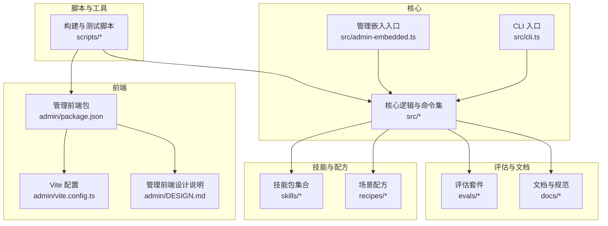
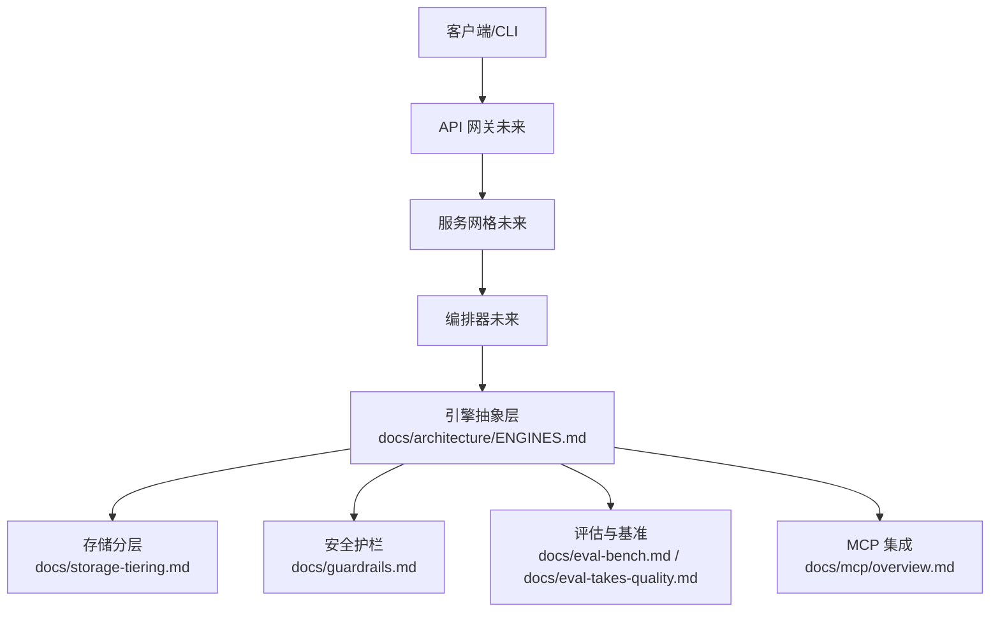
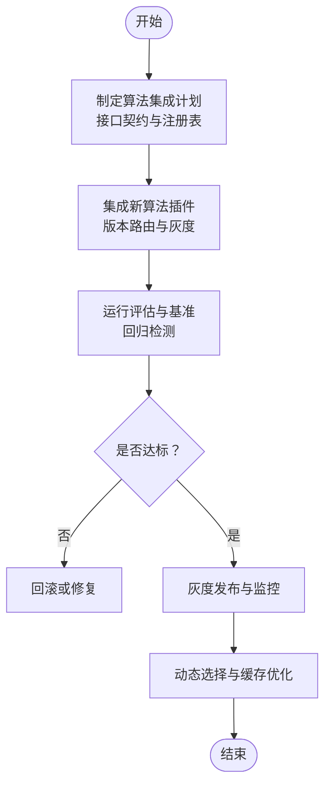
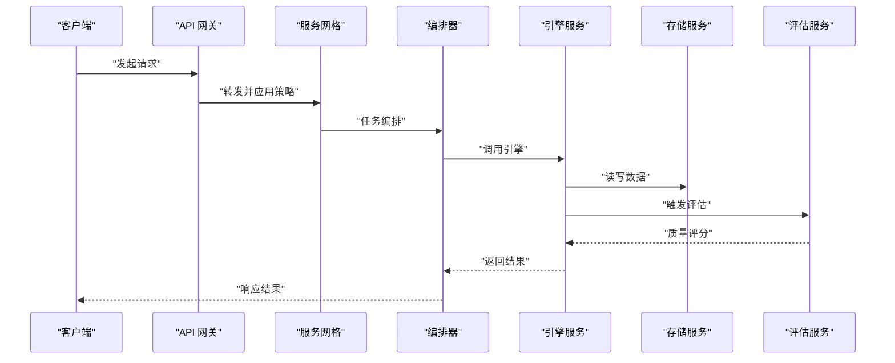
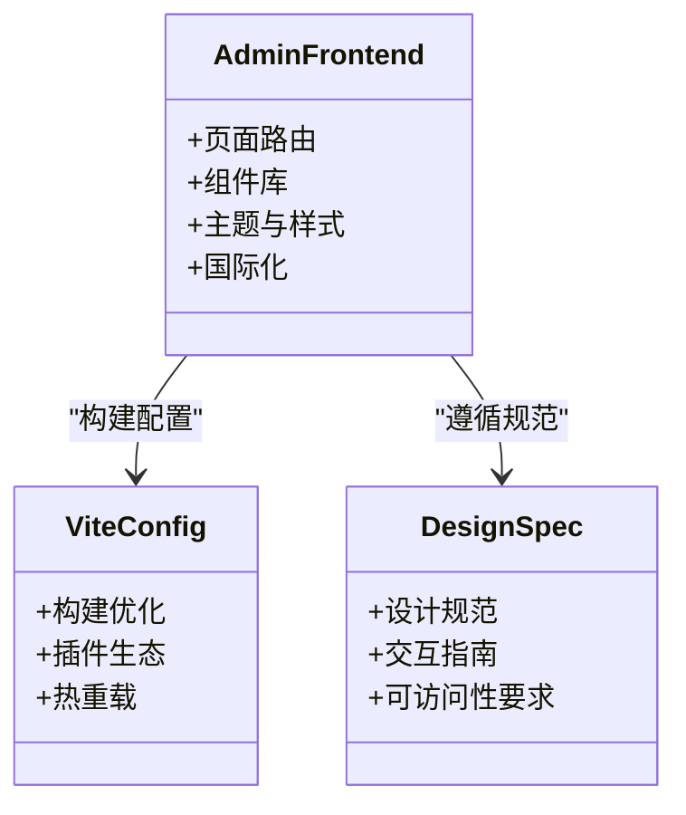
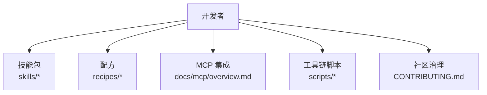
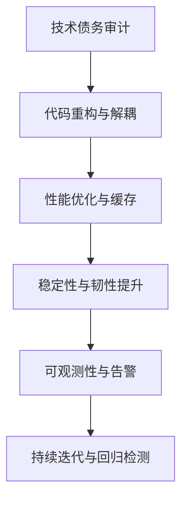
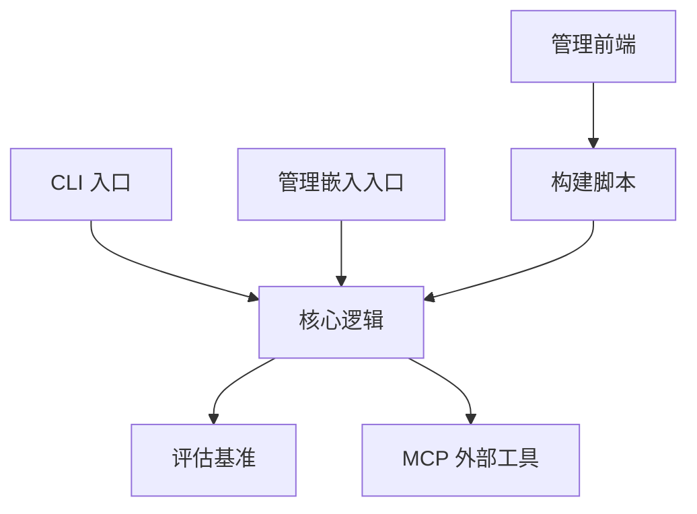

# 未来演进方向

<cite>
**本文引用的文件**   
- [README.md](file://README.md)
- [DESIGN.md](file://DESIGN.md)
- [AGENTS.md](file://AGENTS.md)
- [CLAUDE.md](file://CLAUDE.md)
- [CONTRIBUTING.md](file://CONTRIBUTING.md)
- [package.json](file://package.json)
- [tsconfig.json](file://tsconfig.json)
- [bunfig.toml](file://bunfig.toml)
- [gbrain.yml](file://gbrain.yml)
- [src/cli.ts](file://src/cli.ts)
- [src/admin-embedded.ts](file://src/admin-embedded.ts)
- [admin/package.json](file://admin/package.json)
- [admin/vite.config.ts](file://admin/vite.config.ts)
- [admin/DESIGN.md](file://admin/DESIGN.md)
- [docs/architecture/ENGINES.md](file://docs/architecture/ENGINES.md)
- [docs/guardrails.md](file://docs/guardrails.md)
- [docs/storage-tiering.md](file://docs/storage-tiering.md)
- [docs/progress-events.md](file://docs/progress-events.md)
- [docs/embedding-migrations.md](file://docs/embedding-migrations.md)
- [docs/eval-bench.md](file://docs/eval-bench.md)
- [docs/eval-capture.md](file://docs/eval-capture.md)
- [docs/eval-takes-quality.md](file://docs/eval-takes-quality.md)
- [docs/mcp/overview.md](file://docs/mcp/overview.md)
- [recipes/agent-voice.md](file://recipes/agent-voice.md)
- [recipes/retrieval-reflex.md](file://recipes/retrieval-reflex.md)
- [scripts/build-admin-embedded.ts](file://scripts/build-admin-embedded.ts)
- [scripts/check-no-double-retry.sh](file://scripts/check-no-double-retry.sh)
- [scripts/run-unit-parallel.sh](file://scripts/run-unit-parallel.sh)
- [scripts/smoke-test.sh](file://scripts/smoke-test.sh)
</cite>

## 目录
1. [引言](#引言)
2. [项目结构](#项目结构)
3. [核心组件](#核心组件)
4. [架构总览](#架构总览)
5. [详细组件分析](#详细组件分析)
6. [依赖分析](#依赖分析)
7. [性能考量](#性能考量)
8. [故障排查指南](#故障排查指南)
9. [结论](#结论)
10. [附录](#附录)

## 引言
本规划文档面向 gBrain 系统的中长期演进，围绕以下目标展开：
- 新技术集成路径：AI 能力、检索增强、多模态与工具链升级。
- 架构演进计划：分布式化、微服务解耦与服务网格接入。
- 功能增强路线图：用户体验现代化、交互设计与生态体系完善。
- 模型优化策略：评估体系、质量门禁与持续校准。
- 技术债务清理与重构：代码治理、可观测性与稳定性提升。

本规划以仓库现有工程结构与文档为依据，确保建议具备落地可行性与可度量性。

## 项目结构
仓库采用“核心引擎 + 管理前端 + 技能包 + 评估与示例”的分层组织方式：
- 核心引擎：src 下包含 CLI、嵌入式管理入口、命令集与核心逻辑。
- 管理前端：admin 为独立前端工程，提供可视化运维与配置能力。
- 技能与配方：skills 与 recipes 提供领域能力与场景化方案。
- 评估与基准：evals 与 docs/eval-* 提供评测与质量保障。
- 脚本与工具：scripts 覆盖构建、测试、检查与发布流程。
- 文档与规范：docs 涵盖架构、设计、迁移、操作与最佳实践。

图表来源
- [src/cli.ts](file://src/cli.ts)
- [src/admin-embedded.ts](file://src/admin-embedded.ts)
- [admin/package.json](file://admin/package.json)
- [admin/vite.config.ts](file://admin/vite.config.ts)
- [admin/DESIGN.md](file://admin/DESIGN.md)
- [scripts/build-admin-embedded.ts](file://scripts/build-admin-embedded.ts)

章节来源
- [README.md](file://README.md)
- [DESIGN.md](file://DESIGN.md)
- [AGENTS.md](file://AGENTS.md)
- [CLAUDE.md](file://CLAUDE.md)
- [CONTRIBUTING.md](file://CONTRIBUTING.md)
- [package.json](file://package.json)
- [tsconfig.json](file://tsconfig.json)
- [bunfig.toml](file://bunfig.toml)
- [gbrain.yml](file://gbrain.yml)

## 核心组件
- CLI 与进程生命周期：通过命令行驱动系统启动、任务编排与退出处理，支撑自动化与集成。
- 嵌入式管理界面：将管理面板内嵌至主进程，降低部署复杂度并统一访问入口。
- 引擎与存储分层：文档定义了引擎抽象与存储分层策略，为后续分布式与多后端扩展奠定基础。
- 安全护栏与合规：guardrails 机制贯穿调用链路，保障内容安全与审计可追溯。
- 进度事件与可观测性：标准化进度事件输出，便于外部监控与用户反馈。
- 评估与质量门禁：评估框架与基准用于模型与检索质量的持续验证。

章节来源
- [src/cli.ts](file://src/cli.ts)
- [src/admin-embedded.ts](file://src/admin-embedded.ts)
- [docs/architecture/ENGINES.md](file://docs/architecture/ENGINES.md)
- [docs/guardrails.md](file://docs/guardrails.md)
- [docs/progress-events.md](file://docs/progress-events.md)
- [docs/eval-bench.md](file://docs/eval-bench.md)
- [docs/eval-capture.md](file://docs/eval-capture.md)
- [docs/eval-takes-quality.md](file://docs/eval-takes-quality.md)

## 架构总览
未来演进将以“模块化内核 + 可插拔引擎 + 可观测管线 + 安全护栏”为核心原则，逐步引入分布式与微服务化能力，并通过服务网格实现跨域通信与流量治理。

图表来源
- [docs/architecture/ENGINES.md](file://docs/architecture/ENGINES.md)
- [docs/storage-tiering.md](file://docs/storage-tiering.md)
- [docs/guardrails.md](file://docs/guardrails.md)
- [docs/eval-bench.md](file://docs/eval-bench.md)
- [docs/eval-takes-quality.md](file://docs/eval-takes-quality.md)
- [docs/mcp/overview.md](file://docs/mcp/overview.md)

## 详细组件分析

### AI 技术与算法集成路径
- 趋势影响
  - 多模态融合：文本、图像、语音的统一理解与生成，提升检索与问答体验。
  - 检索增强（RAG）：结合向量索引与结构化知识图谱，提高准确性与可解释性。
  - 工具与代理：通过 MCP 等协议扩展外部工具调用能力，形成智能体工作流。
- 新算法集成方案
  - 在引擎抽象层新增“算法插件接口”，定义输入/输出契约、资源配额与回退策略。
  - 建立“算法注册表 + 版本路由”，支持灰度发布与 A/B 实验。
  - 引入“提示词模板库 + 参数空间搜索”，实现自动调参与效果对比。
- 模型优化策略
  - 基于评估基准的回归检测与阈值门禁，防止质量退化。
  - 动态选择最优模型（按成本/延迟/质量权衡），结合缓存与批处理降低开销。
  - 增量微调与蒸馏流水线，沉淀领域知识与轻量化模型。

图表来源
- [docs/architecture/ENGINES.md](file://docs/architecture/ENGINES.md)
- [docs/eval-bench.md](file://docs/eval-bench.md)
- [docs/eval-takes-quality.md](file://docs/eval-takes-quality.md)
- [docs/mcp/overview.md](file://docs/mcp/overview.md)

章节来源
- [docs/architecture/ENGINES.md](file://docs/architecture/ENGINES.md)
- [docs/eval-bench.md](file://docs/eval-bench.md)
- [docs/eval-takes-quality.md](file://docs/eval-takes-quality.md)
- [docs/mcp/overview.md](file://docs/mcp/overview.md)

### 分布式架构升级与微服务解耦
- 现状基础
  - 引擎抽象与存储分层已就绪，适合横向扩展与多后端切换。
  - 嵌入式管理简化了部署形态，但长期需向微服务化演进以提升弹性与隔离性。
- 升级路线
  - 阶段一：服务拆分。将 CLI、管理、引擎、存储、评估拆分为独立服务，定义清晰 API 边界。
  - 阶段二：服务网格。引入网格进行流量治理、熔断、重试与遥测，提升可靠性与可观测性。
  - 阶段三：编排与自治。引入编排器实现任务调度、扩缩容与自愈，结合评估结果自动调整策略。
- 数据一致性
  - 采用最终一致与补偿事务，结合幂等键与去重机制避免重复执行。
  - 存储分层与冷热分离，热点数据就近缓存，冷数据归档到低成本介质。

图表来源
- [docs/architecture/ENGINES.md](file://docs/architecture/ENGINES.md)
- [docs/storage-tiering.md](file://docs/storage-tiering.md)

章节来源
- [docs/architecture/ENGINES.md](file://docs/architecture/ENGINES.md)
- [docs/storage-tiering.md](file://docs/storage-tiering.md)

### 用户体验改进与界面现代化
- 管理前端现代化
  - 使用现代前端工程化（Vite、TypeScript、组件库）提升开发效率与运行时性能。
  - 强化可视化能力：任务状态、质量指标、成本与延迟分布一目了然。
- 交互设计优化
  - 渐进式引导与上下文帮助，降低上手门槛。
  - 实时进度与错误定位，提升排障效率。
- 无障碍与国际化
  - 遵循 WCAG 标准，支持键盘导航与屏幕阅读器。
  - 多语言与本地化配置，满足全球化需求。

图表来源
- [admin/package.json](file://admin/package.json)
- [admin/vite.config.ts](file://admin/vite.config.ts)
- [admin/DESIGN.md](file://admin/DESIGN.md)

章节来源
- [admin/package.json](file://admin/package.json)
- [admin/vite.config.ts](file://admin/vite.config.ts)
- [admin/DESIGN.md](file://admin/DESIGN.md)

### 生态体系建设与开发者工具链
- 技能包与配方
  - 通过 skills 与 recipes 形成可复用的能力单元与场景化解决方案。
  - 提供脚手架与校验工具，降低开发与维护成本。
- MCP 集成
  - 借助 MCP 协议打通外部工具与服务，扩展智能体能力边界。
- 社区治理
  - 贡献者指南、行为准则与安全策略，保障社区健康与可持续。
- 开发者工具链
  - 统一的构建、测试、检查与发布脚本，提升协作效率与质量。

图表来源
- [recipes/agent-voice.md](file://recipes/agent-voice.md)
- [recipes/retrieval-reflex.md](file://recipes/retrieval-reflex.md)
- [docs/mcp/overview.md](file://docs/mcp/overview.md)
- [CONTRIBUTING.md](file://CONTRIBUTING.md)
- [scripts/build-admin-embedded.ts](file://scripts/build-admin-embedded.ts)

章节来源
- [recipes/agent-voice.md](file://recipes/agent-voice.md)
- [recipes/retrieval-reflex.md](file://recipes/retrieval-reflex.md)
- [docs/mcp/overview.md](file://docs/mcp/overview.md)
- [CONTRIBUTING.md](file://CONTRIBUTING.md)
- [scripts/build-admin-embedded.ts](file://scripts/build-admin-embedded.ts)

### 技术债务清理与持续优化
- 代码重构
  - 明确模块边界与职责，减少耦合与循环依赖。
  - 统一错误分类与日志规范，提升可观测性与排障效率。
- 性能优化
  - 并行测试与构建，缩短反馈周期。
  - 引入缓存与批处理，降低外部依赖调用成本。
- 稳定性与韧性
  - 重试与退避策略规范化，避免双重重试等问题。
  - 健康检查与自恢复机制，提升系统韧性。

图表来源
- [scripts/run-unit-parallel.sh](file://scripts/run-unit-parallel.sh)
- [scripts/check-no-double-retry.sh](file://scripts/check-no-double-retry.sh)
- [scripts/smoke-test.sh](file://scripts/smoke-test.sh)

章节来源
- [scripts/run-unit-parallel.sh](file://scripts/run-unit-parallel.sh)
- [scripts/check-no-double-retry.sh](file://scripts/check-no-double-retry.sh)
- [scripts/smoke-test.sh](file://scripts/smoke-test.sh)

## 依赖分析
- 内部依赖
  - CLI 与管理嵌入入口共同依赖核心逻辑，形成“控制面 + 数据面”的初步解耦。
  - 管理前端通过构建脚本与配置与核心工程联动，保证版本一致与快速迭代。
- 外部依赖
  - 评估与基准依赖外部模型与数据集，需建立镜像与缓存策略。
  - MCP 与外部工具集成需关注安全边界与权限最小化。
- 潜在风险
  - 循环依赖与隐式耦合需通过静态检查与依赖图分析识别。
  - 第三方依赖更新需纳入变更管理与回归测试。

图表来源
- [src/cli.ts](file://src/cli.ts)
- [src/admin-embedded.ts](file://src/admin-embedded.ts)
- [scripts/build-admin-embedded.ts](file://scripts/build-admin-embedded.ts)
- [docs/eval-bench.md](file://docs/eval-bench.md)
- [docs/mcp/overview.md](file://docs/mcp/overview.md)

章节来源
- [src/cli.ts](file://src/cli.ts)
- [src/admin-embedded.ts](file://src/admin-embedded.ts)
- [scripts/build-admin-embedded.ts](file://scripts/build-admin-embedded.ts)
- [docs/eval-bench.md](file://docs/eval-bench.md)
- [docs/mcp/overview.md](file://docs/mcp/overview.md)

## 性能考量
- 构建与测试
  - 并行化单元测试与构建流程，缩短 CI 时间。
  - 引入增量构建与缓存命中策略，提升本地开发体验。
- 运行时性能
  - 批处理与异步管道，降低 I/O 阻塞。
  - 多级缓存与预取，减少重复计算与网络往返。
- 资源治理
  - 限制并发与超时，避免雪崩效应。
  - 监控关键指标（CPU、内存、I/O、延迟、错误率），设定阈值与告警。

[本节为通用指导，不直接分析具体文件]

## 故障排查指南
- 常见问题定位
  - 重试与退避：检查是否存在双重重试或不合理退避策略。
  - 健康检查：确认服务健康探针与自恢复逻辑是否生效。
  - 日志与追踪：统一日志格式与链路追踪，快速定位问题根因。
- 回归与门禁
  - 评估基准失败时阻断发布，强制修复后再合并。
  - 安全扫描与隐私检查纳入流水线，防止敏感信息泄露。
- 应急与回滚
  - 灰度发布与一键回滚，降低变更风险。
  - 预案演练与复盘，持续提升团队应急响应能力。

章节来源
- [scripts/check-no-double-retry.sh](file://scripts/check-no-double-retry.sh)
- [docs/guardrails.md](file://docs/guardrails.md)
- [docs/progress-events.md](file://docs/progress-events.md)

## 结论
本规划以现有工程结构与文档为基础，提出从 AI 技术集成、分布式架构升级、用户体验现代化到生态体系建设的系统性演进路径。通过明确的阶段目标、可度量的质量门禁与完善的工具链，确保系统在可扩展性、可靠性与易用性方面持续进步。建议按季度滚动评审与调整，保持与技术趋势和业务需求的同步。

[本节为总结性内容，不直接分析具体文件]

## 附录
- 参考文档
  - 架构与引擎：docs/architecture/ENGINES.md
  - 存储分层：docs/storage-tiering.md
  - 安全护栏：docs/guardrails.md
  - 进度事件：docs/progress-events.md
  - 评估与基准：docs/eval-bench.md、docs/eval-capture.md、docs/eval-takes-quality.md
  - MCP 集成：docs/mcp/overview.md
- 工程配置
  - 包与类型：package.json、tsconfig.json
  - 构建与运行：bunfig.toml、gbrain.yml
  - 管理前端：admin/package.json、admin/vite.config.ts、admin/DESIGN.md
  - 入口与嵌入：src/cli.ts、src/admin-embedded.ts
  - 构建脚本：scripts/build-admin-embedded.ts

章节来源
- [docs/architecture/ENGINES.md](file://docs/architecture/ENGINES.md)
- [docs/storage-tiering.md](file://docs/storage-tiering.md)
- [docs/guardrails.md](file://docs/guardrails.md)
- [docs/progress-events.md](file://docs/progress-events.md)
- [docs/eval-bench.md](file://docs/eval-bench.md)
- [docs/eval-capture.md](file://docs/eval-capture.md)
- [docs/eval-takes-quality.md](file://docs/eval-takes-quality.md)
- [docs/mcp/overview.md](file://docs/mcp/overview.md)
- [package.json](file://package.json)
- [tsconfig.json](file://tsconfig.json)
- [bunfig.toml](file://bunfig.toml)
- [gbrain.yml](file://gbrain.yml)
- [admin/package.json](file://admin/package.json)
- [admin/vite.config.ts](file://admin/vite.config.ts)
- [admin/DESIGN.md](file://admin/DESIGN.md)
- [src/cli.ts](file://src/cli.ts)
- [src/admin-embedded.ts](file://src/admin-embedded.ts)
- [scripts/build-admin-embedded.ts](file://scripts/build-admin-embedded.ts)