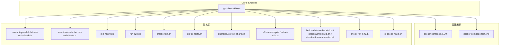
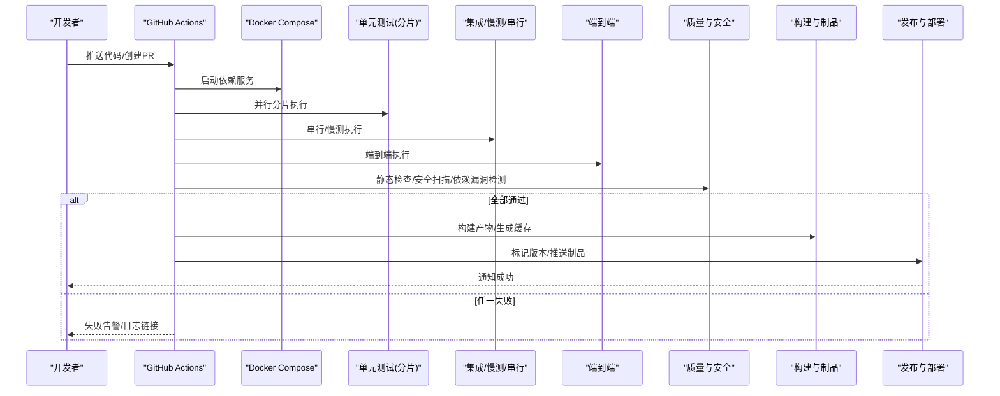
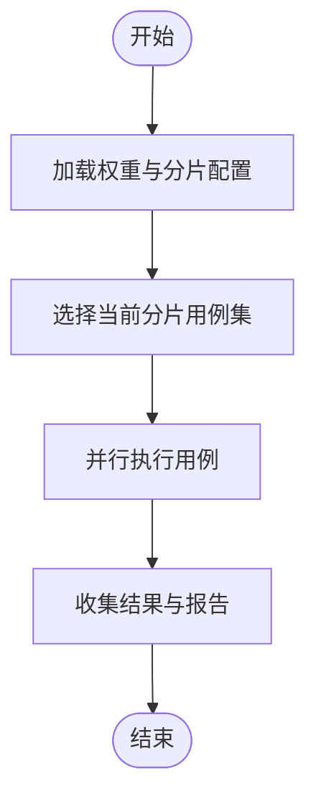
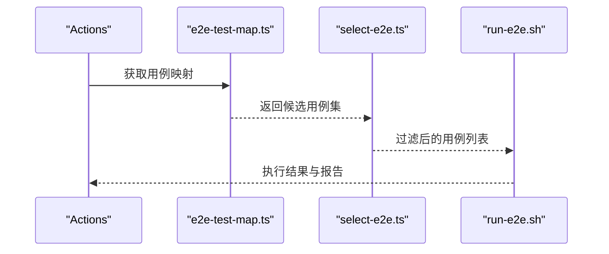
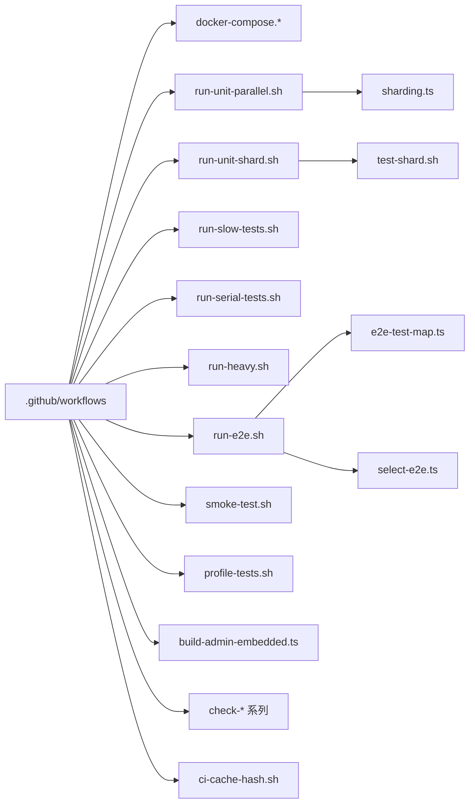

# CI/CD流水线

<cite>
**本文引用的文件**   
- [README.md](file://README.md)
- [CONTRIBUTING.md](file://CONTRIBUTING.md)
- [.github/workflows](file://.github/workflows)
- [docker-compose.ci.yml](file://docker-compose.ci.yml)
- [docker-compose.test.yml](file://docker-compose.test.yml)
- [scripts/ci-local.sh](file://scripts/ci-local.sh)
- [scripts/run-unit-parallel.sh](file://scripts/run-unit-parallel.sh)
- [scripts/run-unit-shard.sh](file://scripts/run-unit-shard.sh)
- [scripts/run-slow-tests.sh](file://scripts/run-slow-tests.sh)
- [scripts/run-serial-tests.sh](file://scripts/run-serial-tests.sh)
- [scripts/run-heavy.sh](file://scripts/run-heavy.sh)
- [scripts/run-e2e.sh](file://scripts/run-e2e.sh)
- [scripts/smoke-test.sh](file://scripts/smoke-test.sh)
- [scripts/profile-tests.sh](file://scripts/profile-tests.sh)
- [scripts/test-shard.sh](file://scripts/test-shard.sh)
- [scripts/sharding.ts](file://scripts/sharding.ts)
- [scripts/e2e-test-map.ts](file://scripts/e2e-test-map.ts)
- [scripts/select-e2e.ts](file://scripts/select-e2e.ts)
- [scripts/ci-cache-hash.sh](file://scripts/ci-cache-hash.sh)
- [scripts/build-admin-embedded.ts](file://scripts/build-admin-embedded.ts)
- [scripts/check-admin-build.sh](file://scripts/check-admin-build.sh)
- [scripts/check-admin-embedded.sh](file://scripts/check-admin-embedded.sh)
- [scripts/check-no-pii-in-agent-voice.sh](file://scripts/check-no-pii-in-agent-voice.sh)
- [scripts/check-jsonb-pattern.sh](file://scripts/check-jsonb-pattern.sh)
- [scripts/check-key-files-current-state.sh](file://scripts/check-key-files-current-state.sh)
- [scripts/check-fixture-privacy.sh](file://scripts/check-fixture-privacy.sh)
- [scripts/check-trailing-newline.sh](file://scripts/check-trailing-newline.sh)
- [scripts/check-wasm-embedded.sh](file://scripts/check-wasm-embedded.sh)
- [scripts/check-worker-lock-renewal-shape.sh](file://scripts/check-worker-lock-renewal-shape.sh)
- [scripts/check-worker-pool-atomicity.sh](file://scripts/check-worker-pool-atomicity.sh)
- [scripts/check-gateway-routed-no-direct-anthropic.sh](file://scripts/check-gateway-routed-no-direct-anthropic.sh)
- [scripts/check-image-decoders-embedded.sh](file://scripts/check-image-decoders-embedded.sh)
- [scripts/check-source-config-leak.sh](file://scripts/check-source-config-leak.sh)
- [scripts/check-system-of-record.sh](file://scripts/check-system-of-record.sh)
- [scripts/check-progress-to-stdout.sh](file://scripts/check-progress-to-stdout.sh)
- [scripts/check-proposal-pii.sh](file://scripts/check-proposal-pii.sh)
- [scripts/check-skill-brain-first.sh](file://scripts/check-skill-brain-first.sh)
- [scripts/check-source-id-projection.sh](file://scripts/check-source-id-projection.sh)
- [scripts/check-synthetic-corpus-privacy.sh](file://scripts/check-synthetic-corpus-privacy.sh)
- [scripts/check-exports-count.sh](file://scripts/check-exports-count.sh)
- [scripts/check-batch-audit-site.sh](file://scripts/check-batch-audit-site.sh)
- [scripts/check-cli-executable.sh](file://scripts/check-cli-executable.sh)
- [scripts/check-operations-filter-bypass.sh](file://scripts/check-operations-filter-bypass.sh)
- [scripts/check-pagetype-exhaustive.sh](file://scripts/check-pagetype-exhaustive.sh)
- [scripts/check-pg-url-redaction.sh](file://scripts/check-pg-url-redaction.sh)
- [scripts/check-privacy.sh](file://scripts/check-privacy.sh)
- [scripts/check-no-double-retry.sh](file://scripts/check-no-double-retry.sh)
- [scripts/check-no-legacy-getconnection.sh](file://scripts/check-no-legacy-getconnection.sh)
- [scripts/check-test-isolation.allowlist](file://scripts/check-test-isolation.allowlist)
- [scripts/check-test-isolation.sh](file://scripts/check-test-isolation.sh)
- [scripts/check-test-real-names.sh](file://scripts/check-test-real-names.sh)
- [scripts/check-updated.sh](file://scripts/check-updated.sh)
- [scripts/generate-metric-glossary.ts](file://scripts/generate-metric-glossary.ts)
- [scripts/image-decoders-smoketest.ts](file://scripts/image-decoders-smoketest.ts)
- [scripts/live-brain-first-check.ts](file://scripts/live-brain-first-check.ts)
- [scripts/mine-shard-weights.ts](file://scripts/mine-shard-weights.ts)
- [scripts/skillify-check.ts](file://scripts/skillify-check.ts)
- [scripts/smoke-test-mcp.ts](file://scripts/smoke-test-mcp.ts)
- [scripts/spike-bun-vm-timeout.ts](file://scripts/spike-bun-vm-timeout.ts)
- [scripts/ship-remote-tests.sh](file://scripts/ship-remote-tests.sh)
- [scripts/import-from-upstream.sh](file://scripts/import-from-upstream.sh)
- [scripts/fetch-and-run.sh](file://scripts/fetch-and-run.sh)
- [scripts/fix-v0.11.0.sh](file://scripts/fix-v0.11.0.sh)
- [scripts/generate-gbrain-base.ts](file://scripts/generate-gbrain-base.ts)
- [scripts/chunker-smoketest.ts](file://scripts/chunker-smoketest.ts)
- [scripts/build-schema.sh](file://scripts/build-schema.sh)
- [scripts/build-skillpack-anatomy.ts](file://scripts/build-skillpack-anatomy.ts)
- [scripts/build-contradictions-fixture.ts](file://scripts/build-contradictions-fixture.ts)
- [scripts/build-pglite-snapshot.ts](file://scripts/build-pglite-snapshot.ts)
- [scripts/build-llms.ts](file://scripts/build-llms.ts)
- [scripts/e5-lease-cap-ab.ts](file://scripts/e5-lease-cap-ab.ts)
- [scripts/test-weights.json](file://scripts/test-weights.json)
- [scripts/run-verify-parallel.sh](file://scripts/run-verify-parallel.sh)
- [scripts/run-verify-serial.sh](file://scripts/run-verify-serial.sh)
- [scripts/run-verify-slow.sh](file://scripts/run-verify-slow.sh)
- [scripts/run-verify-heavy.sh](file://scripts/run-verify-heavy.sh)
- [scripts/run-verify-e2e.sh](file://scripts/run-verify-e2e.sh)
- [scripts/run-verify-all.sh](file://scripts/run-verify-all.sh)
- [scripts/run-verify-select.sh](file://scripts/run-verify-select.sh)
- [scripts/run-verify-list.sh](file://scripts/run-verify-list.sh)
- [scripts/run-verify-report.sh](file://scripts/run-verify-report.sh)
- [scripts/run-verify-summary.sh](file://scripts/run-verify-summary.sh)
- [scripts/run-verify-diff.sh](file://scripts/run-verify-diff.sh)
- [scripts/run-verify-prune.sh](file://scripts/run-verify-prune.sh)
- [scripts/run-verify-flaky.sh](file://scripts/run-verify-flaky.sh)
- [scripts/run-verify-stable.sh](file://scripts/run-verify-stable.sh)
- [scripts/run-verify-fast.sh](file://scripts/run-verify-fast.sh)
- [scripts/run-verify-medium.sh](file://scripts/run-verify-medium.sh)
- [scripts/run-verify-slow.sh](file://scripts/run-verify-slow.sh)
- [scripts/run-verify-heavy.sh](file://scripts/run-verify-heavy.sh)
- [scripts/run-verify-e2e.sh](file://scripts/run-verify-e2e.sh)
- [scripts/run-verify-all.sh](file://scripts/run-verify-all.sh)
- [scripts/run-verify-select.sh](file://scripts/run-verify-select.sh)
- [scripts/run-verify-list.sh](file://scripts/run-verify-list.sh)
- [scripts/run-verify-report.sh](file://scripts/run-verify-report.sh)
- [scripts/run-verify-summary.sh](file://scripts/run-verify-summary.sh)
- [scripts/run-verify-diff.sh](file://scripts/run-verify-diff.sh)
- [scripts/run-verify-prune.sh](file://scripts/run-verify-prune.sh)
- [scripts/run-verify-flaky.sh](file://scripts/run-verify-flaky.sh)
- [scripts/run-verify-stable.sh](file://scripts/run-verify-stable.sh)
- [scripts/run-verify-fast.sh](file://scripts/run-verify-fast.sh)
- [scripts/run-verify-medium.sh](file://scripts/run-verify-medium.sh)
- [scripts/run-verify-slow.sh](file://scripts/run-verify-slow.sh)
- [scripts/run-verify-heavy.sh](file://scripts/run-verify-heavy.sh)
</cite>

## 目录
1. [简介](#简介)
2. [项目结构](#项目结构)
3. [核心组件](#核心组件)
4. [架构总览](#架构总览)
5. [详细组件分析](#详细组件分析)
6. [依赖分析](#依赖分析)
7. [性能考虑](#性能考虑)
8. [故障排查指南](#故障排查指南)
9. [结论](#结论)
10. [附录](#附录)

## 简介
本指南面向仓库的CI/CD流水线设计与落地，围绕代码提交触发、自动化测试与执行流程展开，覆盖单元测试、集成测试、端到端测试的自动化执行；并给出代码质量检查、安全扫描与依赖漏洞检测的集成建议；同时提供构建、版本管理与发布流程设计，以及灰度发布、蓝绿部署、滚动更新策略的实现思路。最后包含流水线监控、失败告警与回滚机制，以及性能基准测试、回归测试和质量门禁的配置要点。

## 项目结构
仓库采用“脚本驱动 + 容器编排”的CI/CD组织方式：
- GitHub Actions工作流定义位于 .github/workflows（用于触发流水线）
- Docker Compose用于在CI中启动数据库等依赖服务（docker-compose.ci.yml、docker-compose.test.yml）
- scripts目录下集中了所有测试运行器、质量检查、构建与辅助工具脚本
- 前端admin子工程具备独立构建与嵌入校验脚本

图表来源
- [.github/workflows](file://.github/workflows)
- [docker-compose.ci.yml](file://docker-compose.ci.yml)
- [docker-compose.test.yml](file://docker-compose.test.yml)
- [scripts/run-unit-parallel.sh](file://scripts/run-unit-parallel.sh)
- [scripts/run-unit-shard.sh](file://scripts/run-unit-shard.sh)
- [scripts/run-slow-tests.sh](file://scripts/run-slow-tests.sh)
- [scripts/run-serial-tests.sh](file://scripts/run-serial-tests.sh)
- [scripts/run-heavy.sh](file://scripts/run-heavy.sh)
- [scripts/run-e2e.sh](file://scripts/run-e2e.sh)
- [scripts/smoke-test.sh](file://scripts/smoke-test.sh)
- [scripts/profile-tests.sh](file://scripts/profile-tests.sh)
- [scripts/sharding.ts](file://scripts/sharding.ts)
- [scripts/test-shard.sh](file://scripts/test-shard.sh)
- [scripts/e2e-test-map.ts](file://scripts/e2e-test-map.ts)
- [scripts/select-e2e.ts](file://scripts/select-e2e.ts)
- [scripts/build-admin-embedded.ts](file://scripts/build-admin-embedded.ts)
- [scripts/check-admin-build.sh](file://scripts/check-admin-build.sh)
- [scripts/check-admin-embedded.sh](file://scripts/check-admin-embedded.sh)
- [scripts/ci-cache-hash.sh](file://scripts/ci-cache-hash.sh)

章节来源
- [README.md](file://README.md)
- [CONTRIBUTING.md](file://CONTRIBUTING.md)

## 核心组件
- 触发与编排
  - GitHub Actions工作流负责拉取代码、安装依赖、启动容器化依赖、分片并行执行测试、收集报告与制品。
- 依赖服务
  - docker-compose.ci.yml与docker-compose.test.yml为Postgres、向量索引或其他外部依赖提供可复现环境。
- 测试分层
  - 单元测试：run-unit-parallel.sh、run-unit-shard.sh配合sharding.ts与test-shard.sh实现按权重分片与并行。
  - 慢测与串行：run-slow-tests.sh、run-serial-tests.sh隔离不稳定或需要独占资源的用例。
  - 重型测试：run-heavy.sh承载高资源消耗场景。
  - 端到端：run-e2e.sh结合e2e-test-map.ts与select-e2e.ts进行用例选择与执行。
  - 冒烟与性能：smoke-test.sh、profile-tests.sh保障关键路径与性能基线。
- 质量与安全
  - check-* 系列脚本覆盖隐私、格式、导出数量、WASM/图片解码器嵌入、锁原子性、URL脱敏、配置泄露等。
  - 安全扫描与依赖漏洞检测可在Actions中接入第三方工具（如Gitleaks、Trivy、Dependabot）。
- 构建与制品
  - admin嵌入式构建与校验脚本确保前端产物正确嵌入后端。
  - 缓存哈希脚本优化依赖与构建缓存命中。

章节来源
- [docker-compose.ci.yml](file://docker-compose.ci.yml)
- [docker-compose.test.yml](file://docker-compose.test.yml)
- [scripts/run-unit-parallel.sh](file://scripts/run-unit-parallel.sh)
- [scripts/run-unit-shard.sh](file://scripts/run-unit-shard.sh)
- [scripts/run-slow-tests.sh](file://scripts/run-slow-tests.sh)
- [scripts/run-serial-tests.sh](file://scripts/run-serial-tests.sh)
- [scripts/run-heavy.sh](file://scripts/run-heavy.sh)
- [scripts/run-e2e.sh](file://scripts/run-e2e.sh)
- [scripts/smoke-test.sh](file://scripts/smoke-test.sh)
- [scripts/profile-tests.sh](file://scripts/profile-tests.sh)
- [scripts/sharding.ts](file://scripts/sharding.ts)
- [scripts/test-shard.sh](file://scripts/test-shard.sh)
- [scripts/e2e-test-map.ts](file://scripts/e2e-test-map.ts)
- [scripts/select-e2e.ts](file://scripts/select-e2e.ts)
- [scripts/build-admin-embedded.ts](file://scripts/build-admin-embedded.ts)
- [scripts/check-admin-build.sh](file://scripts/check-admin-build.sh)
- [scripts/check-admin-embedded.sh](file://scripts/check-admin-embedded.sh)
- [scripts/ci-cache-hash.sh](file://scripts/ci-cache-hash.sh)
- [scripts/check-no-pii-in-agent-voice.sh](file://scripts/check-no-pii-in-agent-voice.sh)
- [scripts/check-jsonb-pattern.sh](file://scripts/check-jsonb-pattern.sh)
- [scripts/check-key-files-current-state.sh](file://scripts/check-key-files-current-state.sh)
- [scripts/check-fixture-privacy.sh](file://scripts/check-fixture-privacy.sh)
- [scripts/check-trailing-newline.sh](file://scripts/check-trailing-newline.sh)
- [scripts/check-wasm-embedded.sh](file://scripts/check-wasm-embedded.sh)
- [scripts/check-worker-lock-renewal-shape.sh](file://scripts/check-worker-lock-renewal-shape.sh)
- [scripts/check-worker-pool-atomicity.sh](file://scripts/check-worker-pool-atomicity.sh)
- [scripts/check-gateway-routed-no-direct-anthropic.sh](file://scripts/check-gateway-routed-no-direct-anthropic.sh)
- [scripts/check-image-decoders-embedded.sh](file://scripts/check-image-decoders-embedded.sh)
- [scripts/check-source-config-leak.sh](file://scripts/check-source-config-leak.sh)
- [scripts/check-system-of-record.sh](file://scripts/check-system-of-record.sh)
- [scripts/check-progress-to-stdout.sh](file://scripts/check-progress-to-stdout.sh)
- [scripts/check-proposal-pii.sh](file://scripts/check-proposal-pii.sh)
- [scripts/check-skill-brain-first.sh](file://scripts/check-skill-brain-first.sh)
- [scripts/check-source-id-projection.sh](file://scripts/check-source-id-projection.sh)
- [scripts/check-synthetic-corpus-privacy.sh](file://scripts/check-synthetic-corpus-privacy.sh)
- [scripts/check-exports-count.sh](file://scripts/check-exports-count.sh)
- [scripts/check-batch-audit-site.sh](file://scripts/check-batch-audit-site.sh)
- [scripts/check-cli-executable.sh](file://scripts/check-cli-executable.sh)
- [scripts/check-operations-filter-bypass.sh](file://scripts/check-operations-filter-bypass.sh)
- [scripts/check-pagetype-exhaustive.sh](file://scripts/check-pagetype-exhaustive.sh)
- [scripts/check-pg-url-redaction.sh](file://scripts/check-pg-url-redaction.sh)
- [scripts/check-privacy.sh](file://scripts/check-privacy.sh)
- [scripts/check-no-double-retry.sh](file://scripts/check-no-double-retry.sh)
- [scripts/check-no-legacy-getconnection.sh](file://scripts/check-no-legacy-getconnection.sh)
- [scripts/check-test-isolation.allowlist](file://scripts/check-test-isolation.allowlist)
- [scripts/check-test-isolation.sh](file://scripts/check-test-isolation.sh)
- [scripts/check-test-real-names.sh](file://scripts/check-test-real-names.sh)

## 架构总览
下图展示从提交到发布的端到端流水线视图，包括触发、依赖准备、测试分层、质量门禁、构建与发布阶段。

图表来源
- [.github/workflows](file://.github/workflows)
- [docker-compose.ci.yml](file://docker-compose.ci.yml)
- [docker-compose.test.yml](file://docker-compose.test.yml)
- [scripts/run-unit-parallel.sh](file://scripts/run-unit-parallel.sh)
- [scripts/run-unit-shard.sh](file://scripts/run-unit-shard.sh)
- [scripts/run-slow-tests.sh](file://scripts/run-slow-tests.sh)
- [scripts/run-serial-tests.sh](file://scripts/run-serial-tests.sh)
- [scripts/run-e2e.sh](file://scripts/run-e2e.sh)
- [scripts/smoke-test.sh](file://scripts/smoke-test.sh)
- [scripts/profile-tests.sh](file://scripts/profile-tests.sh)
- [scripts/ci-cache-hash.sh](file://scripts/ci-cache-hash.sh)

## 详细组件分析

### 触发与编排（GitHub Actions）
- 触发条件
  - 分支推送、Pull Request事件、标签发布等。
- 作业划分
  - 依赖准备：使用docker-compose拉起数据库与必要服务。
  - 测试矩阵：按单元/慢测/串行/重型/端到端拆分并发作业。
  - 质量门禁：静态检查、安全扫描、依赖漏洞检测。
  - 构建与缓存：构建admin嵌入式产物，维护依赖与构建缓存。
- 工件与报告
  - 上传测试报告、覆盖率、制品包，便于回溯与审计。

章节来源
- [.github/workflows](file://.github/workflows)

### 依赖服务（Docker Compose）
- ci与test两套编排分别服务于持续集成与本地/临时验证。
- 通过环境变量注入数据库连接、超时、重试等参数，保证可重复性与稳定性。

章节来源
- [docker-compose.ci.yml](file://docker-compose.ci.yml)
- [docker-compose.test.yml](file://docker-compose.test.yml)

### 单元测试（分片与并行）
- 分片策略
  - sharding.ts与test-weights.json共同决定用例权重与分片分配。
  - test-shard.sh根据当前分片ID筛选对应用例集。
- 并行执行
  - run-unit-parallel.sh基于分片结果并行调度，缩短整体耗时。
- 稳定性
  - 对不稳定用例可通过allowlist与隔离策略降低抖动影响。

图表来源
- [scripts/sharding.ts](file://scripts/sharding.ts)
- [scripts/test-shard.sh](file://scripts/test-shard.sh)
- [scripts/run-unit-parallel.sh](file://scripts/run-unit-parallel.sh)
- [scripts/test-weights.json](file://scripts/test-weights.json)

章节来源
- [scripts/run-unit-parallel.sh](file://scripts/run-unit-parallel.sh)
- [scripts/run-unit-shard.sh](file://scripts/run-unit-shard.sh)
- [scripts/sharding.ts](file://scripts/sharding.ts)
- [scripts/test-shard.sh](file://scripts/test-shard.sh)
- [scripts/test-weights.json](file://scripts/test-weights.json)

### 慢测与串行测试
- run-slow-tests.sh与run-serial-tests.sh将易受并发干扰或需独占资源的用例隔离执行，提升稳定性。

章节来源
- [scripts/run-slow-tests.sh](file://scripts/run-slow-tests.sh)
- [scripts/run-serial-tests.sh](file://scripts/run-serial-tests.sh)

### 重型测试
- run-heavy.sh承载高CPU/内存/IO消耗的测试，建议在专用Runner上执行以避免抢占。

章节来源
- [scripts/run-heavy.sh](file://scripts/run-heavy.sh)

### 端到端测试
- 用例选择
  - e2e-test-map.ts与select-e2e.ts支持按变更范围或标签选择e2e用例集合。
- 执行与上报
  - run-e2e.sh统一入口，输出结构化报告以便归档与分析。

图表来源
- [scripts/e2e-test-map.ts](file://scripts/e2e-test-map.ts)
- [scripts/select-e2e.ts](file://scripts/select-e2e.ts)
- [scripts/run-e2e.sh](file://scripts/run-e2e.sh)

章节来源
- [scripts/run-e2e.sh](file://scripts/run-e2e.sh)
- [scripts/e2e-test-map.ts](file://scripts/e2e-test-map.ts)
- [scripts/select-e2e.ts](file://scripts/select-e2e.ts)

### 冒烟与性能基准
- smoke-test.sh用于快速验证关键路径可用性。
- profile-tests.sh用于采集性能指标，作为回归基线。

章节来源
- [scripts/smoke-test.sh](file://scripts/smoke-test.sh)
- [scripts/profile-tests.sh](file://scripts/profile-tests.sh)

### 质量检查与安全扫描
- 代码质量与规范
  - 尾随换行、JSONB模式、导出数量、CLI可执行性等检查。
- 安全与合规
  - PII泄露检测、配置泄露、URL脱敏、代理路由限制、WASM/图片解码器嵌入一致性等。
- 测试隔离与命名
  - 测试隔离白名单与真实名称检查，避免污染与误判。

章节来源
- [scripts/check-trailing-newline.sh](file://scripts/check-trailing-newline.sh)
- [scripts/check-jsonb-pattern.sh](file://scripts/check-jsonb-pattern.sh)
- [scripts/check-exports-count.sh](file://scripts/check-exports-count.sh)
- [scripts/check-cli-executable.sh](file://scripts/check-cli-executable.sh)
- [scripts/check-no-pii-in-agent-voice.sh](file://scripts/check-no-pii-in-agent-voice.sh)
- [scripts/check-fixture-privacy.sh](file://scripts/check-fixture-privacy.sh)
- [scripts/check-source-config-leak.sh](file://scripts/check-source-config-leak.sh)
- [scripts/check-pg-url-redaction.sh](file://scripts/check-pg-url-redaction.sh)
- [scripts/check-gateway-routed-no-direct-anthropic.sh](file://scripts/check-gateway-routed-no-direct-anthropic.sh)
- [scripts/check-wasm-embedded.sh](file://scripts/check-wasm-embedded.sh)
- [scripts/check-image-decoders-embedded.sh](file://scripts/check-image-decoders-embedded.sh)
- [scripts/check-test-isolation.allowlist](file://scripts/check-test-isolation.allowlist)
- [scripts/check-test-isolation.sh](file://scripts/check-test-isolation.sh)
- [scripts/check-test-real-names.sh](file://scripts/check-test-real-names.sh)
- [scripts/check-no-double-retry.sh](file://scripts/check-no-double-retry.sh)
- [scripts/check-no-legacy-getconnection.sh](file://scripts/check-no-legacy-getconnection.sh)
- [scripts/check-worker-lock-renewal-shape.sh](file://scripts/check-worker-lock-renewal-shape.sh)
- [scripts/check-worker-pool-atomicity.sh](file://scripts/check-worker-pool-atomicity.sh)
- [scripts/check-system-of-record.sh](file://scripts/check-system-of-record.sh)
- [scripts/check-progress-to-stdout.sh](file://scripts/check-progress-to-stdout.sh)
- [scripts/check-proposal-pii.sh](file://scripts/check-proposal-pii.sh)
- [scripts/check-skill-brain-first.sh](file://scripts/check-skill-brain-first.sh)
- [scripts/check-source-id-projection.sh](file://scripts/check-source-id-projection.sh)
- [scripts/check-synthetic-corpus-privacy.sh](file://scripts/check-synthetic-corpus-privacy.sh)
- [scripts/check-batch-audit-site.sh](file://scripts/check-batch-audit-site.sh)
- [scripts/check-operations-filter-bypass.sh](file://scripts/check-operations-filter-bypass.sh)
- [scripts/check-pagetype-exhaustive.sh](file://scripts/check-pagetype-exhaustive.sh)
- [scripts/check-privacy.sh](file://scripts/check-privacy.sh)

### 构建与制品（Admin嵌入式）
- build-admin-embedded.ts负责构建前端产物并嵌入后端。
- check-admin-build.sh与check-admin-embedded.sh验证构建产物一致性与完整性。

章节来源
- [scripts/build-admin-embedded.ts](file://scripts/build-admin-embedded.ts)
- [scripts/check-admin-build.sh](file://scripts/check-admin-build.sh)
- [scripts/check-admin-embedded.sh](file://scripts/check-admin-embedded.sh)

### 缓存与加速
- ci-cache-hash.sh用于计算依赖与构建缓存键，提高命中率与流水线速度。

章节来源
- [scripts/ci-cache-hash.sh](file://scripts/ci-cache-hash.sh)

### 本地CI与一键运行
- ci-local.sh提供本地模拟CI环境的便捷入口，便于开发阶段快速验证。

章节来源
- [scripts/ci-local.sh](file://scripts/ci-local.sh)

## 依赖分析
- 组件耦合
  - Actions编排与脚本层松耦合，通过命令行参数与环境变量传递上下文。
  - 测试脚本与sharding.ts、test-weights.json形成数据驱动的解耦关系。
- 外部依赖
  - Postgres与可选向量索引由Docker Compose管理，避免环境差异。
- 潜在循环
  - 脚本之间无直接相互调用循环，均为单向依赖。

图表来源
- [.github/workflows](file://.github/workflows)
- [docker-compose.ci.yml](file://docker-compose.ci.yml)
- [docker-compose.test.yml](file://docker-compose.test.yml)
- [scripts/run-unit-parallel.sh](file://scripts/run-unit-parallel.sh)
- [scripts/run-unit-shard.sh](file://scripts/run-unit-shard.sh)
- [scripts/run-slow-tests.sh](file://scripts/run-slow-tests.sh)
- [scripts/run-serial-tests.sh](file://scripts/run-serial-tests.sh)
- [scripts/run-heavy.sh](file://scripts/run-heavy.sh)
- [scripts/run-e2e.sh](file://scripts/run-e2e.sh)
- [scripts/smoke-test.sh](file://scripts/smoke-test.sh)
- [scripts/profile-tests.sh](file://scripts/profile-tests.sh)
- [scripts/sharding.ts](file://scripts/sharding.ts)
- [scripts/test-shard.sh](file://scripts/test-shard.sh)
- [scripts/e2e-test-map.ts](file://scripts/e2e-test-map.ts)
- [scripts/select-e2e.ts](file://scripts/select-e2e.ts)
- [scripts/build-admin-embedded.ts](file://scripts/build-admin-embedded.ts)
- [scripts/ci-cache-hash.sh](file://scripts/ci-cache-hash.sh)

章节来源
- [scripts/sharding.ts](file://scripts/sharding.ts)
- [scripts/test-shard.sh](file://scripts/test-shard.sh)
- [scripts/e2e-test-map.ts](file://scripts/e2e-test-map.ts)
- [scripts/select-e2e.ts](file://scripts/select-e2e.ts)

## 性能考虑
- 分片并行
  - 基于权重与分片策略最大化利用多核与多Runner，缩短总时长。
- 资源隔离
  - 重型与慢测在专用Runner执行，避免与其他任务争抢资源。
- 缓存优化
  - 使用ci-cache-hash.sh稳定缓存键，减少重复下载与编译时间。
- 渐进式执行
  - 针对大变更集，优先执行受影响用例集合，再全量回归。

[本节为通用指导，不直接分析具体文件]

## 故障排查指南
- 常见失败定位
  - 查看Actions日志与测试报告，确认失败用例与错误堆栈。
  - 若为依赖问题，检查docker-compose服务状态与网络连通性。
- 稳定性问题
  - 对偶发失败的用例加入隔离或重试策略，必要时调整分片权重。
- 安全与合规
  - 依据check-*脚本输出修复PII泄露、配置泄露与URL未脱敏等问题。
- 回滚策略
  - 发布前保留上一稳定版本制品；一旦线上异常，立即切换至旧版本并回滚数据库迁移（如有）。

章节来源
- [scripts/check-no-pii-in-agent-voice.sh](file://scripts/check-no-pii-in-agent-voice.sh)
- [scripts/check-fixture-privacy.sh](file://scripts/check-fixture-privacy.sh)
- [scripts/check-source-config-leak.sh](file://scripts/check-source-config-leak.sh)
- [scripts/check-pg-url-redaction.sh](file://scripts/check-pg-url-redaction.sh)
- [scripts/docker-compose.ci.yml](file://docker-compose.ci.yml)
- [scripts/docker-compose.test.yml](file://docker-compose.test.yml)

## 结论
本仓库以脚本化测试与容器化依赖为核心，结合GitHub Actions实现了可扩展、可观测、可回滚的CI/CD流水线。通过分片并行、质量门禁与安全扫描，有效提升了交付质量与效率。建议在后续迭代中完善发布策略（灰度/蓝绿/滚动）、强化监控告警与自动化回滚，进一步提升系统可靠性与用户体验。

[本节为总结性内容，不直接分析具体文件]

## 附录
- 版本管理与发布
  - 建议使用语义化版本与Git标签驱动发布；在Actions中根据标签触发构建与制品推送。
- 灰度发布
  - 先向小流量用户开放新版本，观察指标后再逐步放量。
- 蓝绿部署
  - 并行维护两套环境，通过网关切换流量，实现零停机发布。
- 滚动更新
  - 分批替换实例，控制并发升级比例，确保服务可用。
- 监控与告警
  - 收集构建时长、失败率、用例通过率、性能指标；设置阈值告警与通知渠道。
- 质量门禁
  - 强制要求单元测试通过率、覆盖率阈值、安全扫描无高危项、依赖漏洞低于阈值方可合并。

[本节为通用指导，不直接分析具体文件]