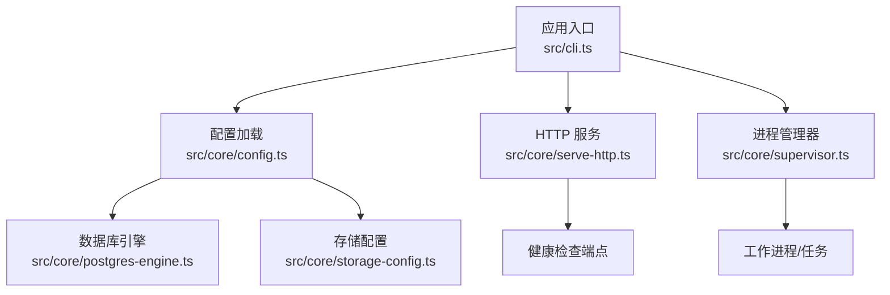
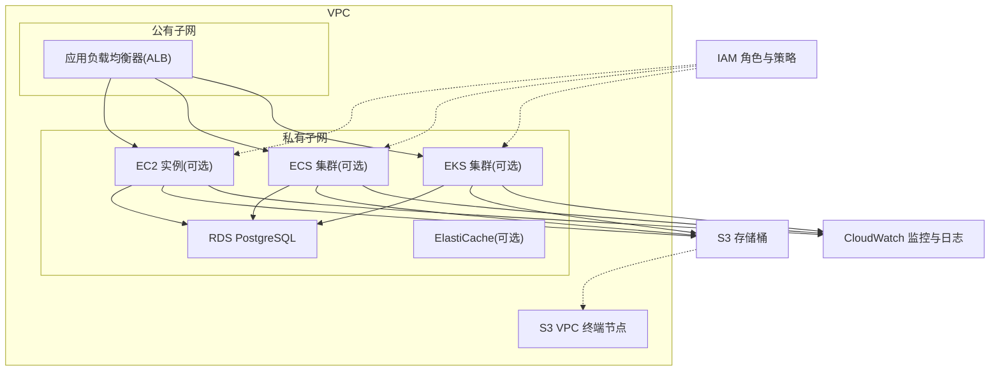
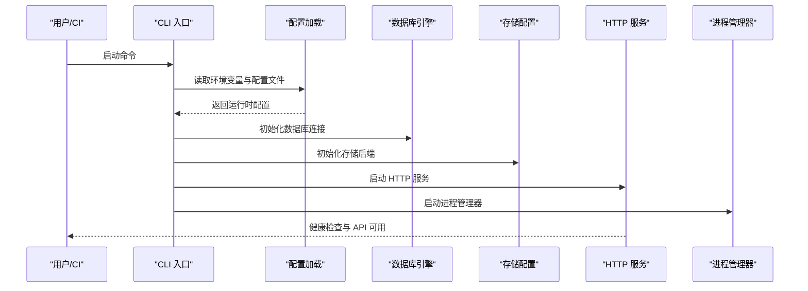
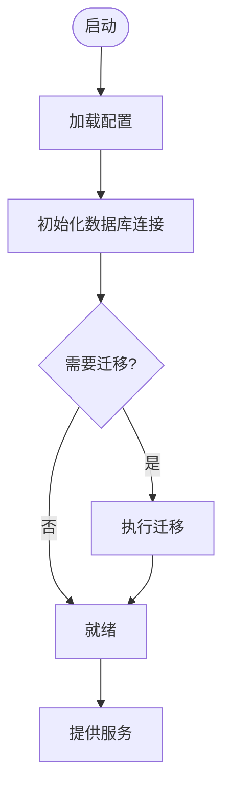
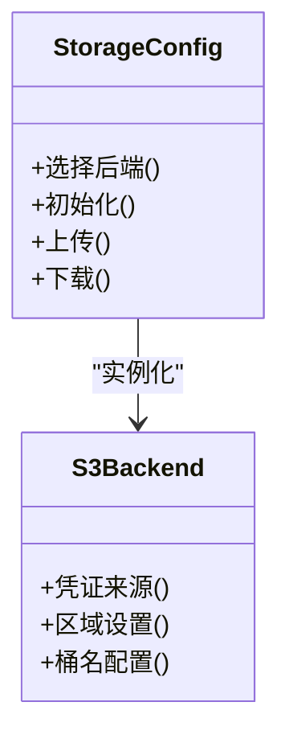
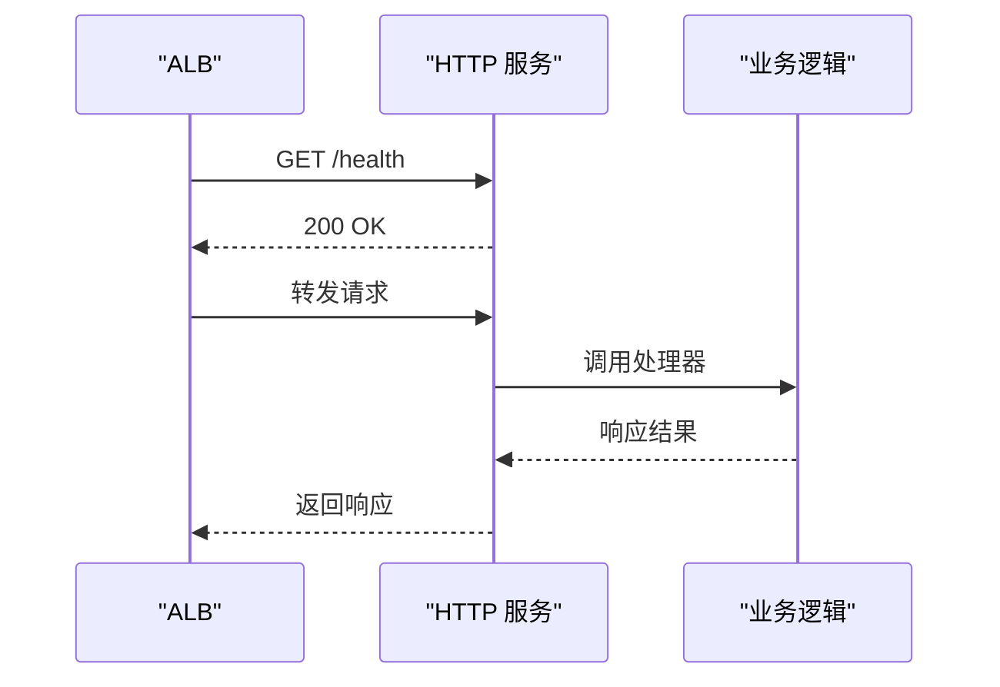
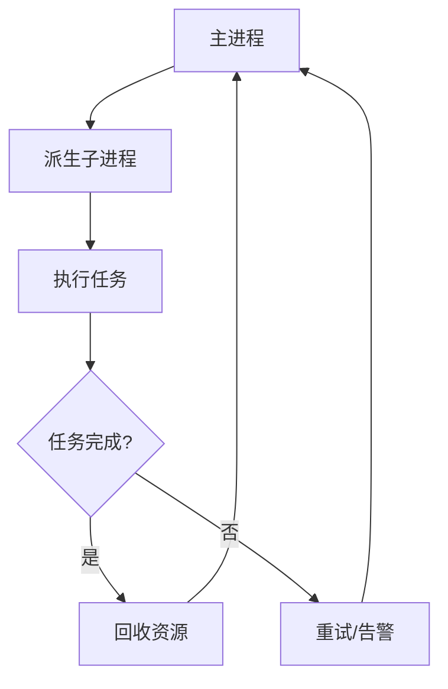
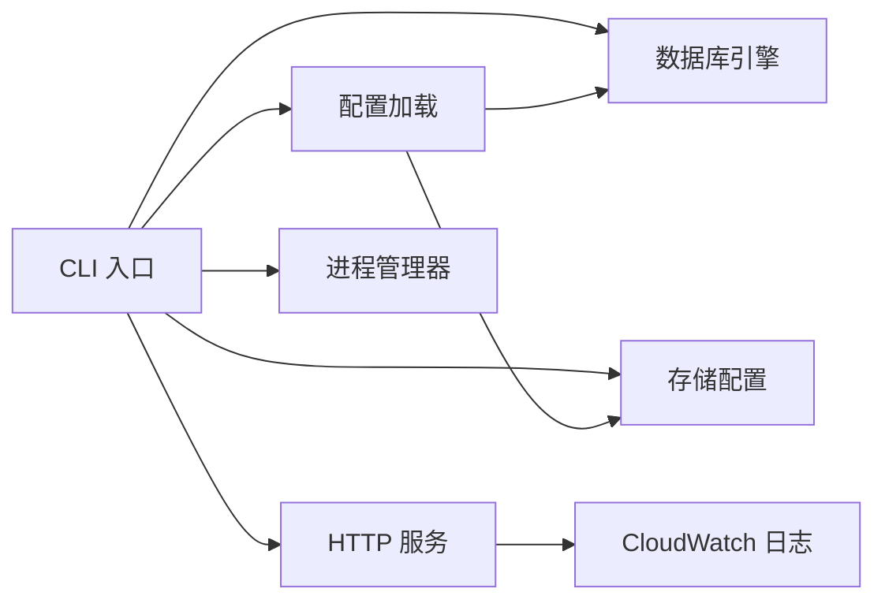

# AWS 部署

<cite>
**本文引用的文件**   
- [README.md](file://README.md)
- [INSTALL.md](file://docs/INSTALL.md)
- [gbrain.yml](file://gbrain.yml)
- [docker-compose.ci.yml](file://docker-compose.ci.yml)
- [docker-compose.test.yml](file://docker-compose.test.yml)
- [package.json](file://package.json)
- [src/cli.ts](file://src/cli.ts)
- [src/core/config.ts](file://src/core/config.ts)
- [src/core/postgres-engine.ts](file://src/core/postgres-engine.ts)
- [src/core/storage-config.ts](file://src/core/storage-config.ts)
- [src/core/serve-http.ts](file://src/core/serve-http.ts)
- [src/core/supervisor.ts](file://src/core/supervisor.ts)
- [scripts/smoke-test.sh](file://scripts/smoke-test.sh)
</cite>

## 目录
1. [简介](#简介)
2. [项目结构](#项目结构)
3. [核心组件](#核心组件)
4. [架构总览](#架构总览)
5. [详细组件分析](#详细组件分析)
6. [依赖分析](#依赖分析)
7. [性能考虑](#性能考虑)
8. [故障排查指南](#故障排查指南)
9. [结论](#结论)
10. [附录](#附录)

## 简介
本指南面向在 AWS 上部署 GBrain 的工程师与运维人员，覆盖 EC2、ECS、EKS 三种运行方式，并给出 IAM 权限、VPC 网络与安全组策略、RDS PostgreSQL、S3 对象存储集成、CloudWatch 监控、Auto Scaling 与负载均衡、弹性伸缩策略、成本优化建议、资源标签规范以及备份恢复方案。同时提供基于 AWS CLI 与 Terraform 的自动化部署思路与步骤说明。

GBrain 是一个可本地或云端运行的智能体平台，支持多种后端（PostgreSQL、SQLite/PGLite、对象存储等），通过环境变量和配置文件驱动行为。其 HTTP 服务、数据库连接、存储后端、进程管理器等均可在云环境中稳定运行。

## 项目结构
仓库包含应用源码、文档、脚本与示例配置。与 AWS 部署相关的关键位置包括：
- 应用入口与命令：src/cli.ts
- 运行时配置加载：src/core/config.ts
- 数据库引擎（PostgreSQL）：src/core/postgres-engine.ts
- 存储后端配置（含 S3 等）：src/core/storage-config.ts
- HTTP 服务启动与健康检查：src/core/serve-http.ts
- 进程管理与子进程调度：src/core/supervisor.ts
- 容器编排与测试环境：docker-compose.*.yml
- 根级配置与安装说明：gbrain.yml、docs/INSTALL.md、README.md

**图表来源**
- [src/cli.ts](file://src/cli.ts)
- [src/core/config.ts](file://src/core/config.ts)
- [src/core/postgres-engine.ts](file://src/core/postgres-engine.ts)
- [src/core/storage-config.ts](file://src/core/storage-config.ts)
- [src/core/serve-http.ts](file://src/core/serve-http.ts)
- [src/core/supervisor.ts](file://src/core/supervisor.ts)

**章节来源**
- [README.md](file://README.md)
- [docs/INSTALL.md](file://docs/INSTALL.md)
- [gbrain.yml](file://gbrain.yml)
- [docker-compose.ci.yml](file://docker-compose.ci.yml)
- [docker-compose.test.yml](file://docker-compose.test.yml)
- [package.json](file://package.json)
- [src/cli.ts](file://src/cli.ts)
- [src/core/config.ts](file://src/core/config.ts)
- [src/core/postgres-engine.ts](file://src/core/postgres-engine.ts)
- [src/core/storage-config.ts](file://src/core/storage-config.ts)
- [src/core/serve-http.ts](file://src/core/serve-http.ts)
- [src/core/supervisor.ts](file://src/core/supervisor.ts)

## 核心组件
- 配置系统：集中读取环境变量与配置文件，为数据库、存储、HTTP 服务等提供运行时参数。
- 数据库引擎：封装 PostgreSQL 连接、迁移与查询执行，支持连接池与重连策略。
- 存储后端：抽象对象存储接口，适配 S3 等后端，用于持久化与缓存。
- HTTP 服务：暴露 API 与内部端点，提供健康检查、限流与日志输出。
- 进程管理器：负责主进程与工作进程的协调、重启与资源回收。

这些组件共同构成 GBrain 在 AWS 上的可部署单元，可通过容器镜像在 EC2/ECS/EKS 中运行。

**章节来源**
- [src/core/config.ts](file://src/core/config.ts)
- [src/core/postgres-engine.ts](file://src/core/postgres-engine.ts)
- [src/core/storage-config.ts](file://src/core/storage-config.ts)
- [src/core/serve-http.ts](file://src/core/serve-http.ts)
- [src/core/supervisor.ts](file://src/core/supervisor.ts)

## 架构总览
下图展示在 AWS 上推荐的部署拓扑：VPC 内划分公有子网与私有子网，ALB 位于公有子网，EC2/ECS/EKS 节点位于私有子网；RDS 与 ElastiCache（可选）置于私有子网；S3 作为对象存储通过 VPC Endpoint 访问；CloudWatch 收集指标与日志；IAM 控制最小权限访问。

[此图为概念性架构图，不直接映射具体源文件]

## 详细组件分析

### 组件一：配置与启动流程
- 入口命令解析与子命令分发由 CLI 模块完成。
- 配置加载阶段合并环境变量与配置文件，形成最终运行时配置。
- 根据配置初始化数据库连接、存储后端与 HTTP 服务。
- 进程管理器启动后，按策略派生子进程处理任务。

**图表来源**
- [src/cli.ts](file://src/cli.ts)
- [src/core/config.ts](file://src/core/config.ts)
- [src/core/postgres-engine.ts](file://src/core/postgres-engine.ts)
- [src/core/storage-config.ts](file://src/core/storage-config.ts)
- [src/core/serve-http.ts](file://src/core/serve-http.ts)
- [src/core/supervisor.ts](file://src/core/supervisor.ts)

**章节来源**
- [src/cli.ts](file://src/cli.ts)
- [src/core/config.ts](file://src/core/config.ts)
- [src/core/postgres-engine.ts](file://src/core/postgres-engine.ts)
- [src/core/storage-config.ts](file://src/core/storage-config.ts)
- [src/core/serve-http.ts](file://src/core/serve-http.ts)
- [src/core/supervisor.ts](file://src/core/supervisor.ts)

### 组件二：数据库连接与迁移
- 使用 PostgreSQL 作为关系型数据层，连接参数来自配置。
- 支持连接池、重试与错误分类，确保在高负载下的稳定性。
- 迁移脚本在启动时按需执行，保证 schema 一致性。

**图表来源**
- [src/core/postgres-engine.ts](file://src/core/postgres-engine.ts)
- [src/core/config.ts](file://src/core/config.ts)

**章节来源**
- [src/core/postgres-engine.ts](file://src/core/postgres-engine.ts)
- [src/core/config.ts](file://src/core/config.ts)

### 组件三：对象存储集成（S3）
- 存储后端通过配置选择实现，支持 S3。
- 在 AWS 环境中建议使用 VPC Endpoint 减少公网流量与延迟。
- 通过 IAM 角色授予最小权限，仅允许读写指定存储桶与路径。

**图表来源**
- [src/core/storage-config.ts](file://src/core/storage-config.ts)

**章节来源**
- [src/core/storage-config.ts](file://src/core/storage-config.ts)

### 组件四：HTTP 服务与健康检查
- 启动 HTTP 服务监听端口，暴露 API 与内部端点。
- 提供健康检查端点供负载均衡器探测。
- 结合 CloudWatch 输出结构化日志，便于检索与分析。

**图表来源**
- [src/core/serve-http.ts](file://src/core/serve-http.ts)

**章节来源**
- [src/core/serve-http.ts](file://src/core/serve-http.ts)

### 组件五：进程管理与任务调度
- 主进程负责生命周期管理与资源清理。
- 子进程处理耗时任务，具备自动重启与优雅退出机制。
- 在 ECS/EKS 中配合容器编排进行横向扩展。

**图表来源**
- [src/core/supervisor.ts](file://src/core/supervisor.ts)

**章节来源**
- [src/core/supervisor.ts](file://src/core/supervisor.ts)

## 依赖分析
- 外部依赖
  - AWS 服务：RDS PostgreSQL、S3、CloudWatch、IAM、ELB/ALB、Auto Scaling、ECS/EKS。
  - 容器运行时：Docker（构建镜像）、容器编排（ECS/EKS）。
- 内部依赖
  - CLI 依赖配置、数据库、存储、HTTP 与进程管理器。
  - 配置模块被所有子系统共享，是耦合中心。

**图表来源**
- [src/cli.ts](file://src/cli.ts)
- [src/core/config.ts](file://src/core/config.ts)
- [src/core/postgres-engine.ts](file://src/core/postgres-engine.ts)
- [src/core/storage-config.ts](file://src/core/storage-config.ts)
- [src/core/serve-http.ts](file://src/core/serve-http.ts)
- [src/core/supervisor.ts](file://src/core/supervisor.ts)

**章节来源**
- [src/cli.ts](file://src/cli.ts)
- [src/core/config.ts](file://src/core/config.ts)
- [src/core/postgres-engine.ts](file://src/core/postgres-engine.ts)
- [src/core/storage-config.ts](file://src/core/storage-config.ts)
- [src/core/serve-http.ts](file://src/core/serve-http.ts)
- [src/core/supervisor.ts](file://src/core/supervisor.ts)

## 性能考虑
- 数据库
  - 合理设置连接池大小与超时，避免连接耗尽。
  - 使用只读副本分担查询压力，主库专注写入。
  - 对热点表建立合适索引，定期统计信息更新。
- 对象存储
  - 启用分片上传与并行读取，提升大文件吞吐。
  - 使用 VPC Endpoint 降低跨域延迟与费用。
- HTTP 服务
  - 开启连接复用与压缩，减少带宽占用。
  - 针对健康检查与高频接口做缓存与限流。
- 进程管理
  - 根据 CPU/内存使用率调整工作进程数量。
  - 设置优雅退出与超时，避免任务中断导致状态不一致。

[本节为通用指导，不直接分析具体文件]

## 故障排查指南
- 常见问题
  - 数据库连接失败：检查 RDS 安全组、IAM 角色与网络连通性。
  - S3 访问拒绝：确认 IAM 策略与桶策略，验证 VPC Endpoint 是否生效。
  - 健康检查失败：查看 HTTP 服务日志与 ALB 目标组状态。
  - 进程频繁重启：检查子进程错误日志与资源限制。
- 定位手段
  - 使用 CloudWatch Logs Insights 检索关键错误。
  - 通过 ALB 访问日志分析请求分布与错误码。
  - 使用 AWS X-Ray（可选）追踪分布式调用链。

**章节来源**
- [src/core/serve-http.ts](file://src/core/serve-http.ts)
- [src/core/postgres-engine.ts](file://src/core/postgres-engine.ts)
- [src/core/storage-config.ts](file://src/core/storage-config.ts)
- [src/core/supervisor.ts](file://src/core/supervisor.ts)

## 结论
通过在 AWS 上采用 VPC 隔离、IAM 最小权限、RDS 高可用与 S3 对象存储，并结合 ALB、Auto Scaling 与 CloudWatch，可实现 GBrain 的高可用、可扩展与可观测部署。推荐优先在 ECS/Fargate 或 EKS 上运行以简化运维，并在生产环境实施严格的变更管理与备份恢复策略。

[本节为总结性内容，不直接分析具体文件]

## 附录

### 一、AWS 环境准备清单
- VPC 与子网
  - 创建 VPC，划分至少两个私有子网与一个公有子网。
  - 在公有子网部署 ALB，在私有子网部署计算与数据库。
- 安全组与网络 ACL
  - ALB 安全组：开放 443/80 入站，出站允许到私有子网。
  - 计算实例/任务安全组：入站允许从 ALB，出站允许到 RDS 与 S3。
  - RDS 安全组：仅允许来自计算的安全组访问默认端口。
- IAM 权限
  - 为 EC2/ECS/EKS 实例/任务分配最小权限角色。
  - 仅授予对指定 RDS 实例与 S3 桶的读写权限。
  - 允许向 CloudWatch 推送日志与指标。
- 负载均衡器
  - 创建 ALB，监听 443/80，转发到目标组。
  - 配置健康检查路径与阈值。
- Auto Scaling
  - 为 EC2 或 ECS Service 创建 Auto Scaling 组。
  - 基于 CPU/内存/自定义指标触发扩缩容。
- 监控与告警
  - 启用 CloudWatch 日志与指标。
  - 设置关键指标告警（错误率、延迟、队列积压等）。

[本节为通用指导，不直接分析具体文件]

### 二、RDS PostgreSQL 配置要点
- 多可用区部署，启用自动备份与快照保留。
- 设置合理的最大连接数与超时时间。
- 使用只读副本承载读多写少场景。
- 通过安全组限制访问来源。

**章节来源**
- [src/core/postgres-engine.ts](file://src/core/postgres-engine.ts)

### 三、S3 对象存储集成要点
- 使用 VPC Endpoint 访问 S3，减少公网流量。
- 为实例/任务分配 IAM 角色，限定桶与路径。
- 启用版本控制与生命周期策略，降低成本。

**章节来源**
- [src/core/storage-config.ts](file://src/core/storage-config.ts)

### 四、CloudWatch 监控设置
- 应用日志：将 stdout/stderr 输出至 CloudWatch Logs。
- 指标：CPU、内存、磁盘、网络与应用自定义指标。
- 告警：错误率、延迟、队列长度、数据库连接数等。

[本节为通用指导，不直接分析具体文件]

### 五、Auto Scaling 与弹性伸缩策略
- 目标跟踪：基于平均 CPU 使用率或自定义指标。
- 预测性扩缩：根据历史负载提前扩容。
- 步进缩放：不同阈值对应不同扩缩容幅度。

[本节为通用指导，不直接分析具体文件]

### 六、成本优化建议
- 使用 Spot 实例处理批处理与非关键任务。
- 选择合适的实例族与规格，避免过度配置。
- 利用 S3 分层存储与生命周期规则归档冷数据。
- 关闭未使用的资源与快照，定期审计 IAM 权限。

[本节为通用指导，不直接分析具体文件]

### 七、资源标签规范
- 统一标签键：Project、Environment、Owner、Team、CostCenter、Version。
- 强制要求：所有资源必须包含 Project 与 Environment。
- 自动化：在 Terraform 或 CLI 脚本中注入标签。

[本节为通用指导，不直接分析具体文件]

### 八、备份与恢复方案
- RDS：每日快照与事务日志备份，保留周期按合规要求设定。
- S3：启用版本控制与跨区域复制，制定灾难恢复演练计划。
- 恢复演练：定期进行恢复测试，验证 RTO/RPO 达标。

[本节为通用指导，不直接分析具体文件]

### 九、AWS CLI 自动化部署步骤
- 准备环境
  - 安装 AWS CLI 并配置凭据。
  - 准备 SSH 密钥或 IAM 角色。
- 创建 VPC 与子网
  - 使用 CLI 创建 VPC、子网、路由表与 NAT 网关。
- 创建安全组
  - 定义 ALB、计算与数据库的安全组规则。
- 创建 RDS 实例
  - 指定引擎、版本、实例类、存储与备份策略。
- 创建 S3 桶
  - 启用版本控制与加密，设置生命周期策略。
- 创建 IAM 角色与策略
  - 为 EC2/ECS/EKS 分配最小权限。
- 创建 ALB 与目标组
  - 配置监听器与健康检查。
- 创建 Auto Scaling 组
  - 设置 Launch Template 与扩缩容策略。
- 部署应用
  - 在 EC2 上拉取镜像并启动服务，或在 ECS/EKS 中发布任务/服务。
- 验证与监控
  - 检查健康检查与日志，设置告警。

[本节为通用指导，不直接分析具体文件]

### 十、Terraform 自动化部署思路
- 模块组织
  - 网络模块：VPC、子网、路由、NAT。
  - 安全模块：安全组与 NACL。
  - 数据层模块：RDS、备份与只读副本。
  - 存储模块：S3 桶与策略。
  - 计算模块：EC2/ECS/EKS 与 Auto Scaling。
  - 接入模块：ALB、监听器与健康检查。
  - 监控模块：CloudWatch 日志组、指标与告警。
- 变量与状态
  - 使用变量文件与环境区分。
  - 远程状态与锁定，多人协作安全。
- 最佳实践
  - 最小权限原则与资源标签。
  - 模块化与复用，版本化管理。

[本节为通用指导，不直接分析具体文件]

### 十一、容器化与编排参考
- Docker 镜像构建
  - 使用多阶段构建减小镜像体积。
  - 将配置与密钥通过环境变量注入。
- ECS 部署
  - 使用 Fargate 无服务器模式，简化运维。
  - 通过任务定义挂载卷与侧车容器。
- EKS 部署
  - 使用 Helm Chart 管理应用与依赖。
  - 结合 Ingress 与外部 DNS 暴露服务。

**章节来源**
- [docker-compose.ci.yml](file://docker-compose.ci.yml)
- [docker-compose.test.yml](file://docker-compose.test.yml)
- [package.json](file://package.json)

### 十二、端到端验证与冒烟测试
- 启动应用后，调用健康检查端点验证可用性。
- 执行冒烟测试脚本，确保核心功能正常。
- 观察 CloudWatch 日志与指标，确认无异常。

**章节来源**
- [scripts/smoke-test.sh](file://scripts/smoke-test.sh)
- [src/core/serve-http.ts](file://src/core/serve-http.ts)