# Kubernetes 部署

<cite>
**本文引用的文件**   
- [README.md](file://README.md)
- [INSTALL.md](file://docs/INSTALL.md)
- [docker-compose.ci.yml](file://docker-compose.ci.yml)
- [docker-compose.test.yml](file://docker-compose.test.yml)
- [gbrain.yml](file://gbrain.yml)
- [package.json](file://package.json)
- [tsconfig.json](file://tsconfig.json)
- [bunfig.toml](file://bunfig.toml)
</cite>

## 目录
1. [简介](#简介)
2. [项目结构](#项目结构)
3. [核心组件](#核心组件)
4. [架构总览](#架构总览)
5. [详细组件分析](#详细组件分析)
6. [依赖关系分析](#依赖关系分析)
7. [性能与可伸缩性](#性能与可伸缩性)
8. [故障排查指南](#故障排查指南)
9. [结论](#结论)
10. [附录](#附录)

## 简介
本指南面向在 Kubernetes 集群中部署该项目的工程团队，提供从资源清单到 Helm Chart、持久化存储、Ingress/TLS、水平自动扩缩容（HPA）、滚动更新与健康检查、多环境策略以及 CI/CD 集成的完整实践。文档内容基于仓库现有配置与说明进行归纳，确保落地可操作且与代码库保持一致。

## 项目结构
仓库包含应用源码、测试、示例技能包、构建脚本与运维文档等。与 K8s 部署直接相关的要点包括：
- 应用入口与依赖定义位于根级配置文件；
- 安装与运行说明位于文档目录；
- 本地与 CI 的容器编排通过 docker-compose 文件描述；
- 运行时配置通过 YAML 文件集中管理。

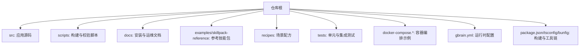

[本节为概览性说明，不直接分析具体文件，故无“章节来源”]

## 核心组件
- 应用进程与服务暴露
  - 应用以 Node/Bun 运行时启动，HTTP 服务对外暴露端口，供 Ingress/Service 转发。
  - 健康检查端点由 HTTP 服务提供，用于 Liveness/Readiness 探针。
- 外部依赖
  - 数据库：PostgreSQL（生产建议托管实例）；开发/CI 可使用容器化 Postgres。
  - 向量索引/嵌入：根据模型与提供者配置，可能依赖外部向量存储或嵌入式实现。
  - 对象存储：可选，用于附件与导出产物。
- 配置与密钥
  - 运行时配置通过 gbrain.yml 注入环境变量或挂载文件。
  - 敏感信息（数据库连接串、第三方 API Key）使用 Secret 管理。
- 存储
  - 工作目录与缓存数据可通过 PersistentVolume/PersistentVolumeClaim 持久化。
  - 若启用外部对象存储，则无需本地 PV。

**章节来源**
- [README.md](file://README.md)
- [docs/INSTALL.md](file://docs/INSTALL.md)
- [gbrain.yml](file://gbrain.yml)
- [docker-compose.ci.yml](file://docker-compose.ci.yml)
- [docker-compose.test.yml](file://docker-compose.test.yml)

## 架构总览
下图展示典型的生产部署拓扑：Ingress 将域名流量路由至 Service，Service 转发到 Deployment 管理的 Pod；Pod 访问数据库与可选的对象存储；配置与密钥通过 ConfigMap/Secret 注入。

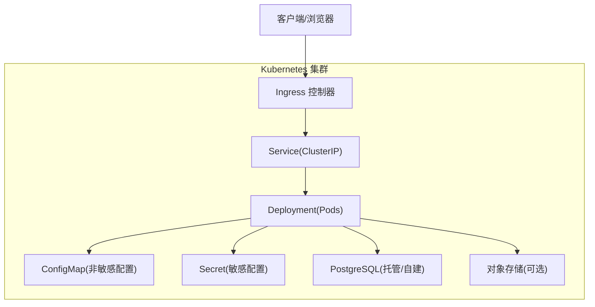

[本图为概念性架构图，未映射到具体源文件，故无“图表来源”]

## 详细组件分析

### 1) 基础资源清单（Deployment、Service、ConfigMap、Secret）
- Deployment
  - 镜像：来自私有/公有镜像仓库，建议使用固定标签或 digest。
  - 副本数：默认 1，结合 HPA 动态调整。
  - 资源限制：设置 requests/limits，保障调度与稳定性。
  - 卷挂载：挂载工作目录、缓存目录或日志目录。
  - 探针：Liveness/Readiness 指向 HTTP 健康端点。
  - 滚动更新：采用 RollingUpdate，设置 maxUnavailable/maxSurge。
- Service
  - 类型 ClusterIP，暴露内部访问；对外由 Ingress 暴露。
- ConfigMap
  - 注入非敏感配置项（如功能开关、超时阈值）。
- Secret
  - 注入敏感配置（数据库连接串、API Key），以环境变量或文件形式挂载。

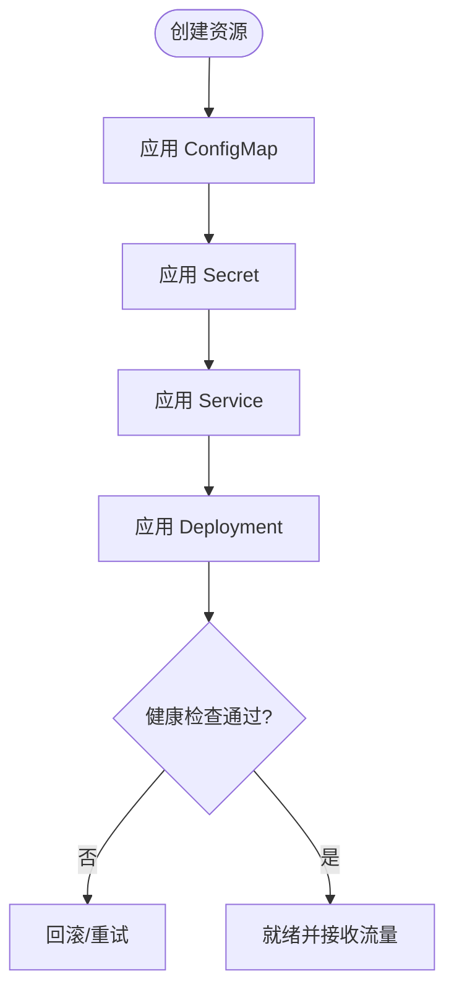

[本图为通用流程示意，未映射到具体源文件，故无“图表来源”]

**章节来源**
- [docs/INSTALL.md](file://docs/INSTALL.md)
- [gbrain.yml](file://gbrain.yml)

### 2) Helm Chart 模板结构与自定义值
- 推荐目录结构
  - templates/deployment.yaml
  - templates/service.yaml
  - templates/configmap.yaml
  - templates/secret.yaml
  - templates/ingress.yaml
  - templates/hpa.yaml
  - templates/pvc.yaml
  - values.yaml
- values.yaml 关键键位
  - image.repository / image.tag
  - replicaCount
  - resources.requests/limits
  - envFrom.configMapRef / secretRef
  - service.type / port
  - ingress.hosts / tls
  - autoscaling.enabled / minReplicas / maxReplicas / targetCPUUtilizationPercentage
  - persistence.enabled / storageClass / size
- 模板变量替换
  - 使用 .Values 访问自定义值，避免硬编码。
  - 对敏感字段使用 fromSecret 或 external-secrets 集成。

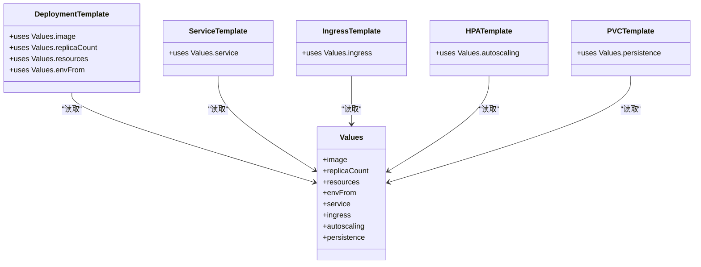

[本图为概念性模板结构图，未映射到具体源文件，故无“图表来源”]

**章节来源**
- [docs/INSTALL.md](file://docs/INSTALL.md)

### 3) 持久化存储（PersistentVolume 与 StorageClass）
- 适用场景
  - 本地缓存、索引快照、上传附件等需要跨 Pod 重启保留的数据。
- 配置要点
  - 使用 PVC 申请容量，绑定到 Deployment 的卷。
  - 指定 StorageClass 以选择后端（云盘、NFS、Ceph RBD 等）。
  - 对于只读共享数据，可使用 ReadOnlyMany 的 PV。
- 注意事项
  - 单写多读：确保同一时间仅一个 Pod 写入。
  - 备份策略：定期快照或迁移到对象存储。

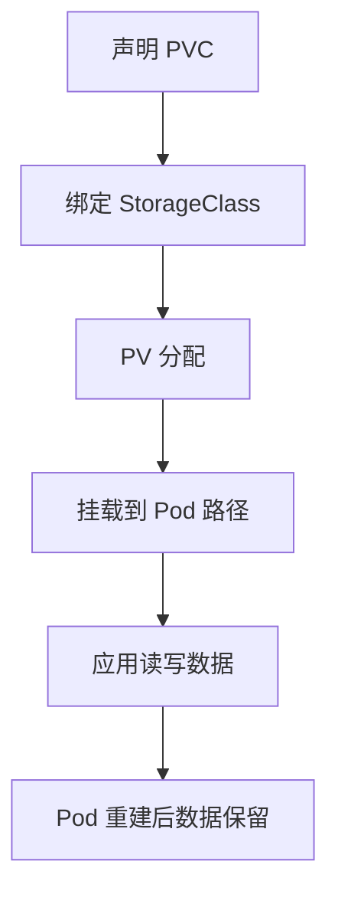

[本图为通用流程示意，未映射到具体源文件，故无“图表来源”]

**章节来源**
- [docs/INSTALL.md](file://docs/INSTALL.md)

### 4) Ingress 控制器、TLS 证书与域名绑定
- Ingress 控制器
  - 常见实现：Nginx、Traefik、Contour、AWS ALB/NLB 等。
  - 注解：用于设置超时、限流、WAF、重定向等。
- TLS 证书
  - 手动：通过 Secret 注入证书与私钥。
  - 自动化：Cert-manager 配合 Let’s Encrypt 签发与续期。
- 域名绑定
  - hosts 列表与 path 规则，按路径或子域分流。

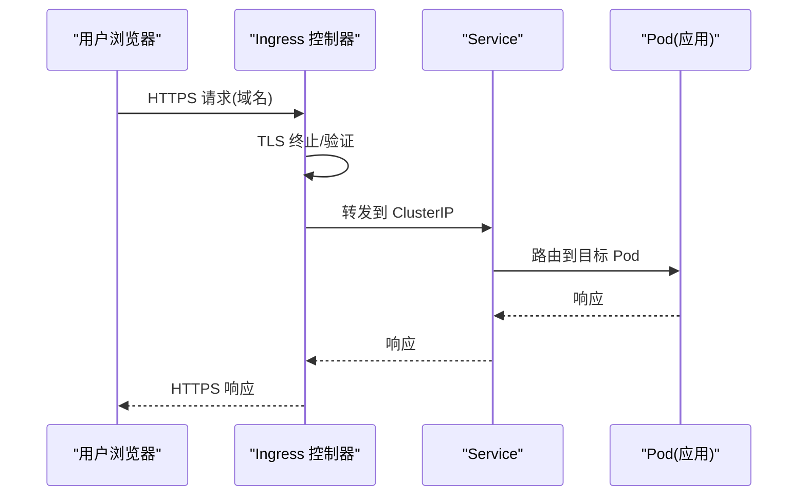

[本图为通用流程示意，未映射到具体源文件，故无“图表来源”]

**章节来源**
- [docs/INSTALL.md](file://docs/INSTALL.md)

### 5) Horizontal Pod Autoscaler（HPA）、资源限制与质量等级
- HPA
  - 指标：CPU/内存利用率、自定义指标（QPS、延迟、队列长度）。
  - 行为：minReplicas/maxReplicas、target 阈值、稳定窗口。
- 资源限制
  - requests：保证调度的最小资源。
  - limits：防止资源争用与 OOM。
- 质量等级（QoS）
  - Guaranteed：requests=limits，最高优先级。
  - Burstable：requests<=limits，弹性可用。
  - BestEffort：未设置 requests/limits，最低优先级。

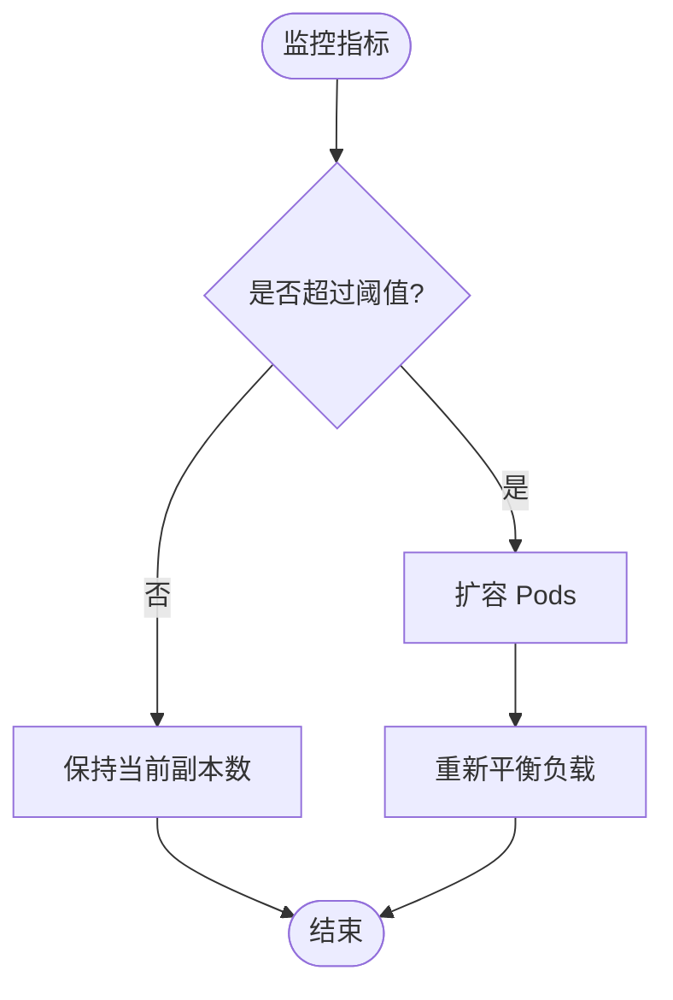

[本图为通用流程示意，未映射到具体源文件，故无“图表来源”]

**章节来源**
- [docs/INSTALL.md](file://docs/INSTALL.md)

### 6) 滚动更新、健康检查与故障恢复
- 滚动更新策略
  - strategy.rollingUpdate.maxUnavailable/maxSurge。
  - 升级前执行 preStop 钩子优雅退出。
- 健康检查
  - livenessProbe：失败触发重启。
  - readinessProbe：失败剔除流量。
  - startupProbe：长启动场景下避免误判。
- 故障恢复
  - 自动重启失败 Pod。
  - 升级失败时自动回滚。
  - 数据库变更前后置检查与幂等迁移。

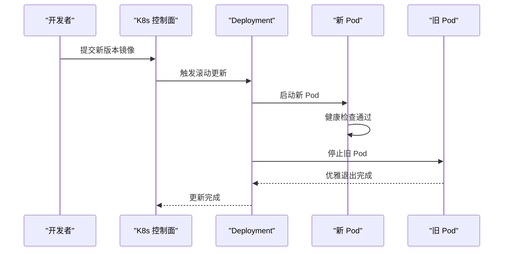

[本图为通用流程示意，未映射到具体源文件，故无“图表来源”]

**章节来源**
- [docs/INSTALL.md](file://docs/INSTALL.md)

### 7) 多环境部署方案
- 环境划分
  - dev/staging/prod，隔离命名空间与资源配额。
- 配置差异
  - 通过 values-{env}.yaml 或 ConfigMap/Secret 区分。
  - 使用 Helm release name 与 namespace 管理。
- 安全与权限
  - RBAC 最小权限原则。
  - 网络策略限制跨命名空间访问。

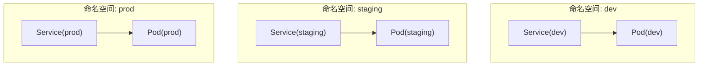

[本图为概念性多环境示意图，未映射到具体源文件，故无“图表来源”]

**章节来源**
- [docs/INSTALL.md](file://docs/INSTALL.md)

### 8) CI/CD 流水线集成示例
- 阶段设计
  - 构建镜像：推送至镜像仓库。
  - 静态检查：lint/test/build。
  - 部署预发：helm upgrade --install 到 staging。
  - 发布生产：人工审批后 helm upgrade 到 prod。
- 关键工件
  - Docker 镜像、Helm Chart、Chart 版本与 Git tag 对齐。
- 回滚策略
  - 记录每次发布版本，支持一键回滚。

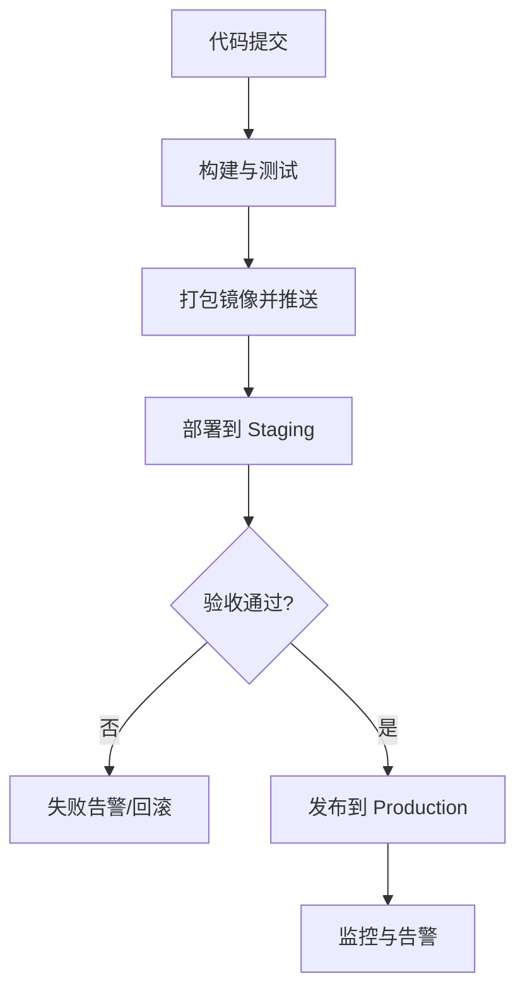

[本图为通用流程示意，未映射到具体源文件，故无“图表来源”]

**章节来源**
- [docker-compose.ci.yml](file://docker-compose.ci.yml)
- [docker-compose.test.yml](file://docker-compose.test.yml)
- [package.json](file://package.json)

## 依赖关系分析
- 运行时依赖
  - Node/Bun 运行时与依赖包由 package.json 与 bunfig.toml 管理。
  - TypeScript 编译与类型检查由 tsconfig.json 控制。
- 外部服务依赖
  - PostgreSQL：连接串通过 Secret 注入。
  - 可选对象存储：通过环境变量或配置文件接入。
- 配置依赖
  - gbrain.yml 作为主配置，可被 ConfigMap 覆盖或通过环境变量注入。

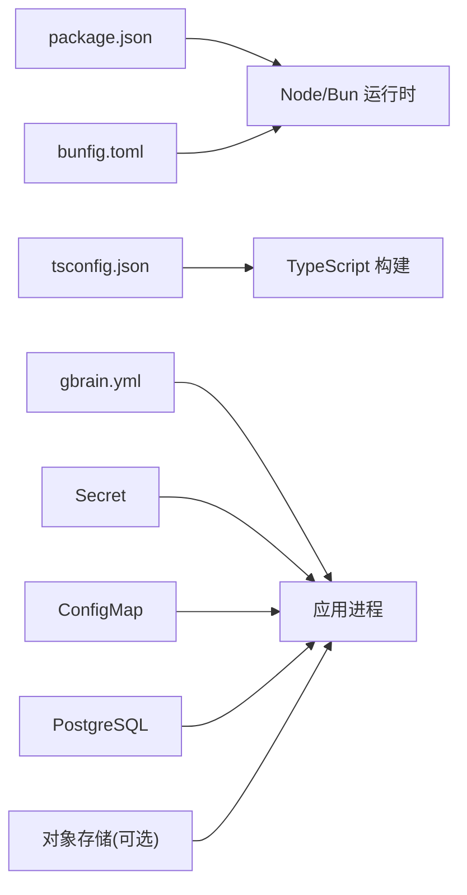

**图表来源**
- [package.json](file://package.json)
- [tsconfig.json](file://tsconfig.json)
- [bunfig.toml](file://bunfig.toml)
- [gbrain.yml](file://gbrain.yml)

**章节来源**
- [package.json](file://package.json)
- [tsconfig.json](file://tsconfig.json)
- [bunfig.toml](file://bunfig.toml)
- [gbrain.yml](file://gbrain.yml)

## 性能与可伸缩性
- 资源规划
  - 合理设置 requests/limits，避免过度预留或不足导致抖动。
- 水平扩展
  - 基于 CPU/内存或业务指标配置 HPA，关注稳定窗口与抖动抑制。
- 存储优化
  - 热点数据落盘需评估 IOPS 与吞吐；冷数据归档至对象存储。
- 网络与代理
  - Ingress 层开启 gzip、缓存与连接复用；合理设置超时与缓冲。
- 数据库
  - 连接池参数与慢查询优化；读写分离与分库分表按需演进。

[本节为通用指导，不直接分析具体文件，故无“章节来源”]

## 故障排查指南
- 常见问题定位
  - Pod 无法启动：查看事件与日志，确认镜像拉取、健康检查与配置注入。
  - 服务不可达：检查 Service/Ingress 规则、DNS 解析与网络策略。
  - 存储问题：确认 PVC 状态、StorageClass 与 PV 绑定情况。
  - 数据库连接失败：核对 Secret 中的连接串与白名单。
- 诊断命令
  - kubectl describe pod/service/ingress/pvc
  - kubectl logs -f <pod>
  - kubectl get events --sort-by=.metadata.creationTimestamp
- 回滚与恢复
  - 使用 Helm rollback 或 kubectl rollout undo 快速回滚。
  - 数据库迁移失败时，执行幂等修复或回滚脚本。

**章节来源**
- [docs/INSTALL.md](file://docs/INSTALL.md)

## 结论
通过合理的资源清单、Helm 模板、持久化与网络配置、HPA 与滚动更新策略，结合 CI/CD 流水线，可以在 Kubernetes 上稳定地部署和演进该项目。建议在生产环境引入证书自动化、可观测性与安全加固，持续提升可靠性与可维护性。

[本节为总结性内容，不直接分析具体文件，故无“章节来源”]

## 附录
- 参考文件
  - README：项目概述与快速开始。
  - INSTALL：安装与运行说明。
  - docker-compose.*：本地与 CI 的容器编排示例。
  - gbrain.yml：运行时配置样例。
  - package.json/tsconfig/bunfig：构建与工具链配置。

**章节来源**
- [README.md](file://README.md)
- [docs/INSTALL.md](file://docs/INSTALL.md)
- [docker-compose.ci.yml](file://docker-compose.ci.yml)
- [docker-compose.test.yml](file://docker-compose.test.yml)
- [gbrain.yml](file://gbrain.yml)
- [package.json](file://package.json)
- [tsconfig.json](file://tsconfig.json)
- [bunfig.toml](file://bunfig.toml)