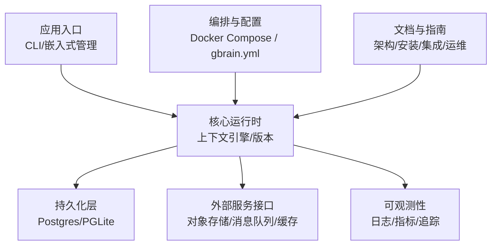
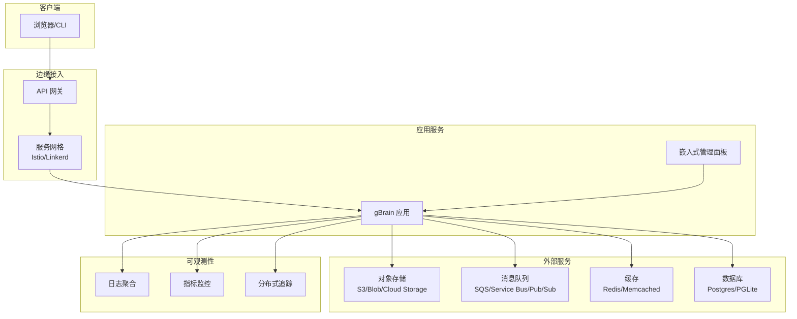
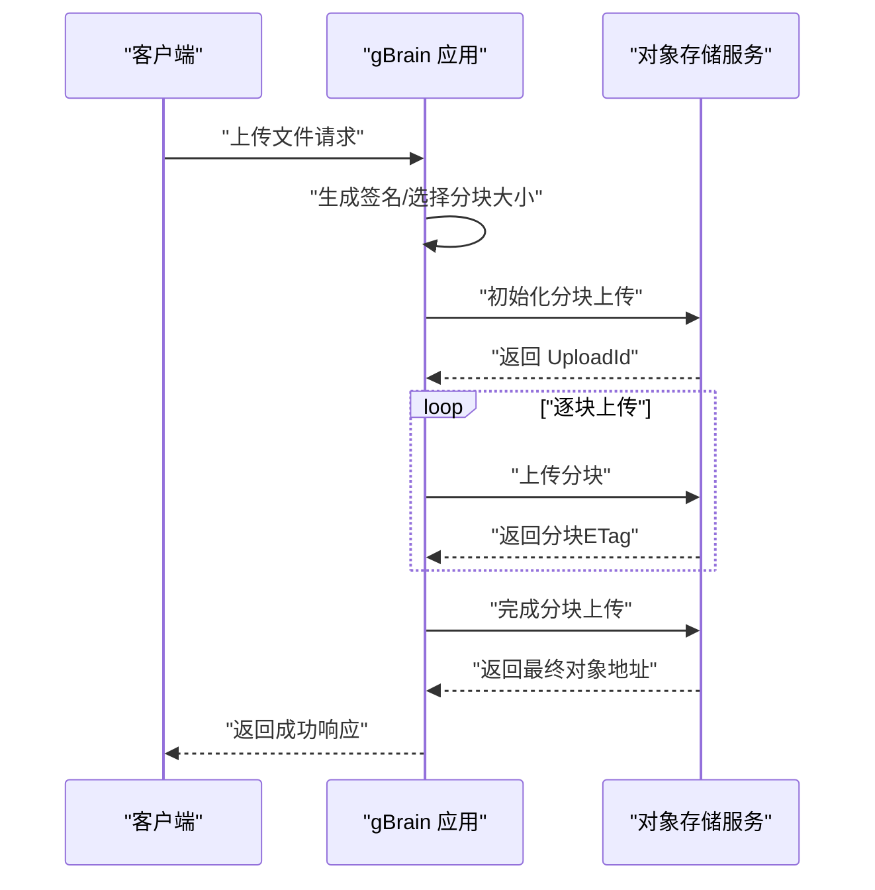
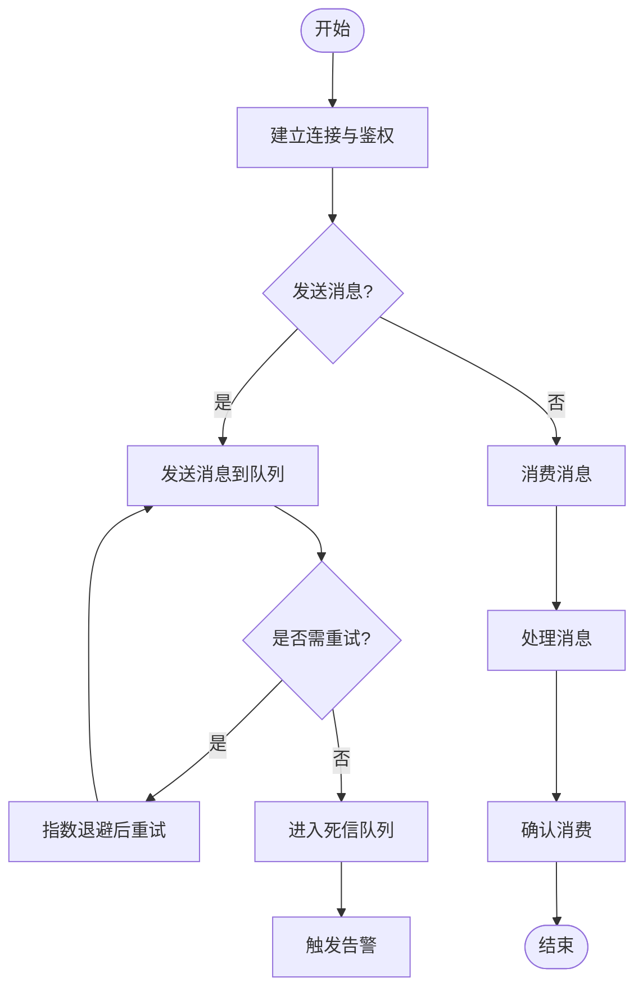
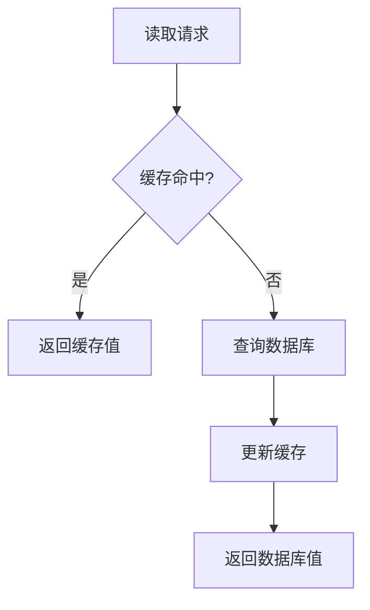
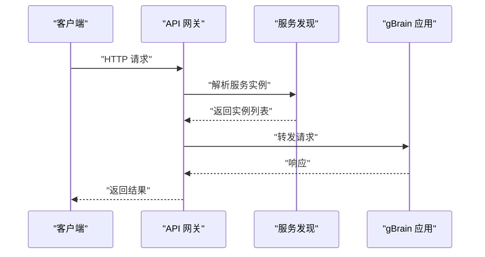
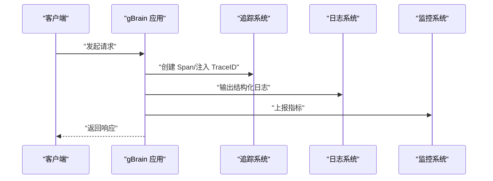
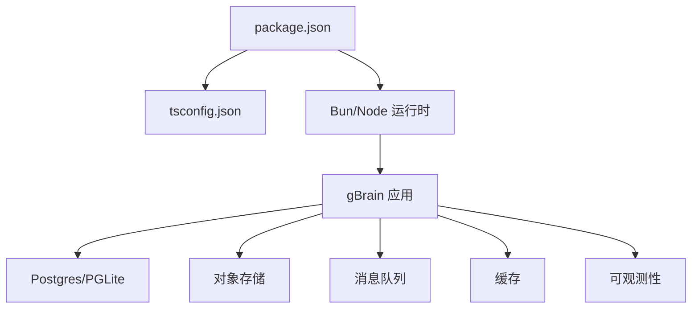

# 云原生服务集成

<cite>
**本文引用的文件**   
- [README.md](file://README.md)
- [gbrain.yml](file://gbrain.yml)
- [docker-compose.ci.yml](file://docker-compose.ci.yml)
- [docker-compose.test.yml](file://docker-compose.test.yml)
- [package.json](file://package.json)
- [tsconfig.json](file://tsconfig.json)
- [bunfig.toml](file://bunfig.toml)
- [src/cli.ts](file://src/cli.ts)
- [src/admin-embedded.ts](file://src/admin-embedded.ts)
- [src/openclaw-context-engine.ts](file://src/openclaw-context-engine.ts)
- [src/version.ts](file://src/version.ts)
- [src/schema.sql](file://src/schema.sql)
- [docs/architecture/overview.md](file://docs/architecture/overview.md)
- [docs/guides/installation.md](file://docs/guides/installation.md)
- [docs/integrations/index.md](file://docs/integrations/index.md)
- [docs/operations/runbooks.md](file://docs/operations/runbooks.md)
- [recipes/credential-gateway.md](file://recipes/credential-gateway.md)
- [recipes/ngrok-tunnel.md](file://recipes/ngrok-tunnel.md)
</cite>

## 目录
1. [简介](#简介)
2. [项目结构](#项目结构)
3. [核心组件](#核心组件)
4. [架构总览](#架构总览)
5. [详细组件分析](#详细组件分析)
6. [依赖分析](#依赖分析)
7. [性能考虑](#性能考虑)
8. [故障排查指南](#故障排查指南)
9. [结论](#结论)
10. [附录](#附录)

## 简介
本指南面向在云原生环境中部署与集成 gBrain 的团队，聚焦以下主题：对象存储（S3、Blob Storage、Cloud Storage）、消息队列（SQS、Azure Service Bus、Pub/Sub）、缓存（Redis、Memcached）、API 网关与服务发现、配置中心、分布式追踪、日志聚合与监控告警，以及服务网格（Istio、Linkerd）与安全通信。文档基于仓库现有结构与文档进行梳理，提供可操作的集成思路与最佳实践，并给出可视化架构图与流程图，帮助读者快速落地。

## 项目结构
仓库采用多模块组织方式，包含核心源码、文档、示例配方、测试与脚本等。与云原生集成相关的重点位置包括：
- 应用入口与运行时：CLI、嵌入式管理面板、上下文引擎、版本信息
- 数据库模式定义：schema.sql
- 运行与编排：docker-compose.*、配置文件 gbrain.yml
- 文档与指南：architecture、guides、integrations、operations
- 示例配方：credential-gateway、ngrok-tunnel 等



图表来源
- [src/cli.ts:1-200](file://src/cli.ts#L1-L200)
- [src/admin-embedded.ts:1-200](file://src/admin-embedded.ts#L1-L200)
- [src/openclaw-context-engine.ts:1-200](file://src/openclaw-context-engine.ts#L1-L200)
- [src/version.ts:1-200](file://src/version.ts#L1-L200)
- [src/schema.sql:1-200](file://src/schema.sql#L1-L200)
- [gbrain.yml:1-200](file://gbrain.yml#L1-L200)
- [docker-compose.ci.yml:1-200](file://docker-compose.ci.yml#L1-L200)
- [docker-compose.test.yml:1-200](file://docker-compose.test.yml#L1-L200)

章节来源
- [README.md:1-200](file://README.md#L1-L200)
- [gbrain.yml:1-200](file://gbrain.yml#L1-L200)
- [docker-compose.ci.yml:1-200](file://docker-compose.ci.yml#L1-L200)
- [docker-compose.test.yml:1-200](file://docker-compose.test.yml#L1-L200)
- [package.json:1-200](file://package.json#L1-L200)
- [tsconfig.json:1-200](file://tsconfig.json#L1-L200)
- [bunfig.toml:1-200](file://bunfig.toml#L1-L200)
- [src/cli.ts:1-200](file://src/cli.ts#L1-L200)
- [src/admin-embedded.ts:1-200](file://src/admin-embedded.ts#L1-L200)
- [src/openclaw-context-engine.ts:1-200](file://src/openclaw-context-engine.ts#L1-L200)
- [src/version.ts:1-200](file://src/version.ts#L1-L200)
- [src/schema.sql:1-200](file://src/schema.sql#L1-L200)

## 核心组件
- CLI 与管理面板：提供命令行入口与嵌入式管理界面，便于本地调试与生产运维。
- 上下文引擎：承载业务逻辑与对外部服务的调用抽象，是集成各类云服务的枢纽。
- 配置与编排：通过 gbrain.yml 与环境变量注入配置；使用 docker-compose 编排依赖服务。
- 数据模型：schema.sql 定义核心表结构，支撑上层能力。

章节来源
- [src/cli.ts:1-200](file://src/cli.ts#L1-L200)
- [src/admin-embedded.ts:1-200](file://src/admin-embedded.ts#L1-L200)
- [src/openclaw-context-engine.ts:1-200](file://src/openclaw-context-engine.ts#L1-L200)
- [src/version.ts:1-200](file://src/version.ts#L1-L200)
- [src/schema.sql:1-200](file://src/schema.sql#L1-L200)
- [gbrain.yml:1-200](file://gbrain.yml#L1-L200)

## 架构总览
下图展示云原生环境下的典型集成拓扑：应用通过 API 网关暴露能力，内部服务间通信由服务网格保障安全与可观测性；对象存储、消息队列与缓存作为外部依赖；可观测性栈采集日志、指标与追踪数据。



图表来源
- [docs/architecture/overview.md:1-200](file://docs/architecture/overview.md#L1-L200)
- [docs/guides/installation.md:1-200](file://docs/guides/installation.md#L1-L200)
- [docs/integrations/index.md:1-200](file://docs/integrations/index.md#L1-L200)
- [docs/operations/runbooks.md:1-200](file://docs/operations/runbooks.md#L1-L200)

## 详细组件分析

### 对象存储集成（S3、Blob Storage、Cloud Storage）
- 目标：统一抽象不同厂商的对象存储接口，支持上传、下载、列举、删除等操作。
- 集成要点：
  - 凭据管理：通过配置中心或密钥管理服务注入访问密钥、端点、区域等信息。
  - 传输安全：强制 HTTPS，启用服务端加密与客户端签名校验。
  - 分块与重试：大文件分块上传，失败自动重试与幂等键。
  - 生命周期与分层：冷热分层策略，降低长期存储成本。
  - 权限最小化：按桶/容器粒度授权，避免宽泛权限。
- 参考实现路径：
  - 配置与启动流程参见 [gbrain.yml](file://gbrain.yml) 与 [docker-compose.ci.yml](file://docker-compose.ci.yml)。
  - 外部服务调用抽象位于上下文引擎相关文件中，如 [src/openclaw-context-engine.ts](file://src/openclaw-context-engine.ts)。



图表来源
- [src/openclaw-context-engine.ts:1-200](file://src/openclaw-context-engine.ts#L1-L200)
- [gbrain.yml:1-200](file://gbrain.yml#L1-L200)

章节来源
- [gbrain.yml:1-200](file://gbrain.yml#L1-L200)
- [docker-compose.ci.yml:1-200](file://docker-compose.ci.yml#L1-L200)
- [src/openclaw-context-engine.ts:1-200](file://src/openclaw-context-engine.ts#L1-L200)

### 消息队列集成（SQS、Azure Service Bus、Pub/Sub）
- 目标：解耦生产者与消费者，提升吞吐与弹性伸缩能力。
- 集成要点：
  - 连接与认证：使用托管身份或短期凭据，避免硬编码密钥。
  - 可靠性：至少一次投递、死信队列、指数退避重试。
  - 顺序与分区：根据业务需求选择 FIFO/分区键。
  - 背压与限流：消费者侧控制并发度，防止下游过载。
- 参考实现路径：
  - 外部服务调用抽象位于上下文引擎相关文件中，如 [src/openclaw-context-engine.ts](file://src/openclaw-context-engine.ts)。
  - 编排与依赖服务可在 docker-compose 中扩展，参考 [docker-compose.ci.yml](file://docker-compose.ci.yml)。



图表来源
- [src/openclaw-context-engine.ts:1-200](file://src/openclaw-context-engine.ts#L1-L200)
- [docker-compose.ci.yml:1-200](file://docker-compose.ci.yml#L1-L200)

章节来源
- [src/openclaw-context-engine.ts:1-200](file://src/openclaw-context-engine.ts#L1-L200)
- [docker-compose.ci.yml:1-200](file://docker-compose.ci.yml#L1-L200)

### 缓存服务集成（Redis、Memcached）
- 目标：降低热点数据读取延迟，减轻后端压力。
- 集成要点：
  - 一致性：缓存失效策略（TTL、写穿透/旁路）。
  - 高可用：主从/哨兵/集群模式，故障转移。
  - 序列化与压缩：合理选择格式与压缩级别。
  - 容量规划：内存上限、淘汰策略（LRU/LFU）。
- 参考实现路径：
  - 外部服务调用抽象位于上下文引擎相关文件中，如 [src/openclaw-context-engine.ts](file://src/openclaw-context-engine.ts)。
  - 本地开发可通过 docker-compose 拉起 Redis/Memcached，参考 [docker-compose.ci.yml](file://docker-compose.ci.yml)。



图表来源
- [src/openclaw-context-engine.ts:1-200](file://src/openclaw-context-engine.ts#L1-L200)
- [docker-compose.ci.yml:1-200](file://docker-compose.ci.yml#L1-L200)

章节来源
- [src/openclaw-context-engine.ts:1-200](file://src/openclaw-context-engine.ts#L1-L200)
- [docker-compose.ci.yml:1-200](file://docker-compose.ci.yml#L1-L200)

### API 网关与服务发现
- API 网关：统一入口、路由、限流、鉴权、协议转换。
- 服务发现：动态注册与注销实例，健康检查与负载均衡。
- 集成建议：
  - 网关前置 TLS 终止与 WAF。
  - 使用服务网格或服务发现系统（如 Kubernetes Service、Consul）进行内部寻址。
  - 灰度发布与蓝绿切换通过网关路由权重控制。
- 参考实现路径：
  - 入口与嵌入管理面板见 [src/cli.ts](file://src/cli.ts)、[src/admin-embedded.ts](file://src/admin-embedded.ts)。
  - 架构概览与安装指南见 [docs/architecture/overview.md](file://docs/architecture/overview.md)、[docs/guides/installation.md](file://docs/guides/installation.md)。



图表来源
- [src/cli.ts:1-200](file://src/cli.ts#L1-L200)
- [src/admin-embedded.ts:1-200](file://src/admin-embedded.ts#L1-L200)
- [docs/architecture/overview.md:1-200](file://docs/architecture/overview.md#L1-L200)

章节来源
- [src/cli.ts:1-200](file://src/cli.ts#L1-L200)
- [src/admin-embedded.ts:1-200](file://src/admin-embedded.ts#L1-L200)
- [docs/architecture/overview.md:1-200](file://docs/architecture/overview.md#L1-L200)
- [docs/guides/installation.md:1-200](file://docs/guides/installation.md#L1-L200)

### 配置中心
- 目标：集中化管理配置，支持热更新与多环境隔离。
- 集成要点：
  - 优先级：环境变量 > 配置中心 > 默认配置。
  - 安全：敏感字段加密存储，运行时解密。
  - 变更审计：记录配置变更历史与回滚。
- 参考实现路径：
  - 应用配置入口与编排见 [gbrain.yml](file://gbrain.yml)、[docker-compose.ci.yml](file://docker-compose.ci.yml)。
  - 构建与运行参数见 [package.json](file://package.json)、[bunfig.toml](file://bunfig.toml)。

章节来源
- [gbrain.yml:1-200](file://gbrain.yml#L1-L200)
- [docker-compose.ci.yml:1-200](file://docker-compose.ci.yml#L1-L200)
- [package.json:1-200](file://package.json#L1-L200)
- [bunfig.toml:1-200](file://bunfig.toml#L1-L200)

### 分布式追踪、日志聚合与监控告警
- 分布式追踪：为跨服务请求添加 TraceID/SpanID，关联上下游链路。
- 日志聚合：结构化日志、统一收集与检索。
- 监控告警：关键指标（延迟、错误率、饱和度）阈值告警。
- 集成建议：
  - 在应用启动时注入追踪中间件与日志格式化器。
  - 将指标导出至 Prometheus/Grafana，日志输出至 ELK/Opensearch。
  - 结合服务网格的 Sidecar 采集 L7 指标。
- 参考实现路径：
  - 应用入口与运行时见 [src/cli.ts](file://src/cli.ts)、[src/openclaw-context-engine.ts](file://src/openclaw-context-engine.ts)。
  - 运维手册与排障见 [docs/operations/runbooks.md](file://docs/operations/runbooks.md)。



图表来源
- [src/cli.ts:1-200](file://src/cli.ts#L1-L200)
- [src/openclaw-context-engine.ts:1-200](file://src/openclaw-context-engine.ts#L1-L200)
- [docs/operations/runbooks.md:1-200](file://docs/operations/runbooks.md#L1-L200)

章节来源
- [src/cli.ts:1-200](file://src/cli.ts#L1-L200)
- [src/openclaw-context-engine.ts:1-200](file://src/openclaw-context-engine.ts#L1-L200)
- [docs/operations/runbooks.md:1-200](file://docs/operations/runbooks.md#L1-L200)

### 服务网格（Istio、Linkerd）与服务间通信安全
- 目标：以 Sidecar 代理实现 mTLS、流量治理与可观测性。
- 集成要点：
  - 证书自动化：CA 签发与轮换。
  - 访问控制：基于身份的细粒度策略。
  - 流量镜像与熔断：提高韧性与可恢复性。
- 参考实现路径：
  - 应用容器化与编排见 [docker-compose.ci.yml](file://docker-compose.ci.yml)、[docker-compose.test.yml](file://docker-compose.test.yml)。
  - 架构概览见 [docs/architecture/overview.md](file://docs/architecture/overview.md)。

```mermaid
graph TB
subgraph "Pod/容器"
APP["gBrain 应用"]
PROXY["Sidecar 代理"]
end
subgraph "网格控制面"
CTRL["Istio/Linkerd 控制面"]
end
APP --> PROXY
PROXY < --> CTRL
```

图表来源
- [docker-compose.ci.yml:1-200](file://docker-compose.ci.yml#L1-L200)
- [docker-compose.test.yml:1-200](file://docker-compose.test.yml#L1-L200)
- [docs/architecture/overview.md:1-200](file://docs/architecture/overview.md#L1-L200)

章节来源
- [docker-compose.ci.yml:1-200](file://docker-compose.ci.yml#L1-L200)
- [docker-compose.test.yml:1-200](file://docker-compose.test.yml#L1-L200)
- [docs/architecture/overview.md:1-200](file://docs/architecture/overview.md#L1-L200)

## 依赖分析
- 直接依赖：
  - 运行时与构建：Node/Bun 生态，TypeScript 编译与打包。
  - 数据库：Postgres/PGLite，通过 schema.sql 管理迁移。
  - 外部服务：对象存储、消息队列、缓存、可观测性栈。
- 间接依赖：
  - 编排与网络：Docker Compose、Kubernetes、服务网格。
  - 配置与密钥：环境变量、配置中心、密钥管理服务。



图表来源
- [package.json:1-200](file://package.json#L1-L200)
- [tsconfig.json:1-200](file://tsconfig.json#L1-L200)
- [src/schema.sql:1-200](file://src/schema.sql#L1-L200)

章节来源
- [package.json:1-200](file://package.json#L1-L200)
- [tsconfig.json:1-200](file://tsconfig.json#L1-L200)
- [src/schema.sql:1-200](file://src/schema.sql#L1-L200)

## 性能考虑
- 对象存储：启用分块上传与并行上传，合理设置超时与重试；对静态资源启用 CDN。
- 消息队列：调整消费者并发度与批处理大小，避免下游抖动；使用幂等键防重。
- 缓存：热点键加 TTL 与随机过期抖动，避免雪崩；读写分离与本地缓存结合。
- 数据库：索引优化、连接池调优、慢查询分析与分页游标。
- 可观测性：采样策略平衡精度与开销，指标维度精简。

## 故障排查指南
- 常见问题定位：
  - 连接失败：检查网络策略、DNS、端口与防火墙。
  - 认证失败：核对凭据有效期与作用域，确保密钥未泄露。
  - 超时与重试风暴：调整超时阈值与退避策略，增加熔断。
  - 数据不一致：核查事务边界与幂等性设计。
- 排障工具与流程：
  - 查看应用日志与追踪链路，定位异常 Span。
  - 使用健康检查与就绪探针验证服务状态。
  - 参考运维手册执行标准 Runbook。
- 参考实现路径：
  - 运维手册见 [docs/operations/runbooks.md](file://docs/operations/runbooks.md)。
  - 凭证网关与隧道示例见 [recipes/credential-gateway.md](file://recipes/credential-gateway.md)、[recipes/ngrok-tunnel.md](file://recipes/ngrok-tunnel.md)。

章节来源
- [docs/operations/runbooks.md:1-200](file://docs/operations/runbooks.md#L1-L200)
- [recipes/credential-gateway.md:1-200](file://recipes/credential-gateway.md#L1-L200)
- [recipes/ngrok-tunnel.md:1-200](file://recipes/ngrok-tunnel.md#L1-L200)

## 结论
通过在应用层抽象外部服务、在编排层统一管理配置与依赖、在服务网格层保障安全与可观测性，gBrain 能够在多云与混合环境中稳定运行。建议优先完善凭据管理与可观测性基线，再逐步引入高级特性（灰度、熔断、自适应扩缩容），以确保演进过程中的可控性与可维护性。

## 附录
- 安装与部署：参考 [docs/guides/installation.md](file://docs/guides/installation.md) 与 [docker-compose.ci.yml](file://docker-compose.ci.yml)。
- 集成清单：参考 [docs/integrations/index.md](file://docs/integrations/index.md)。
- 架构说明：参考 [docs/architecture/overview.md](file://docs/architecture/overview.md)。