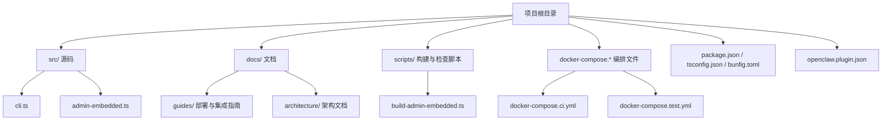
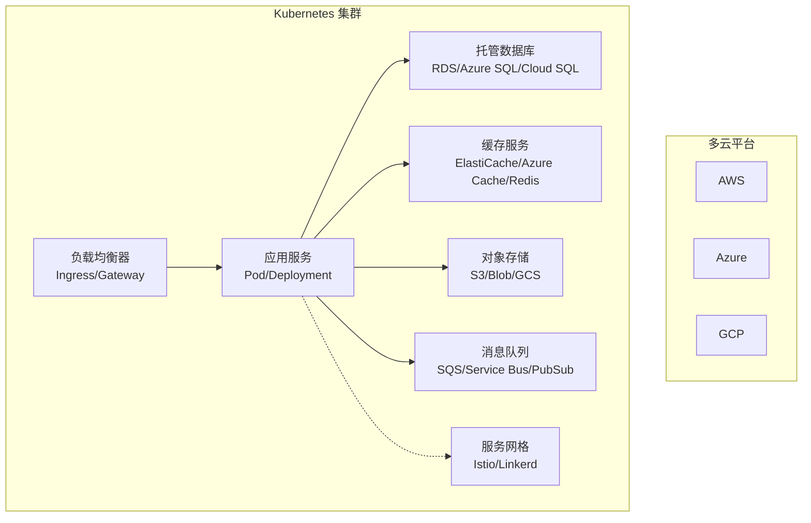
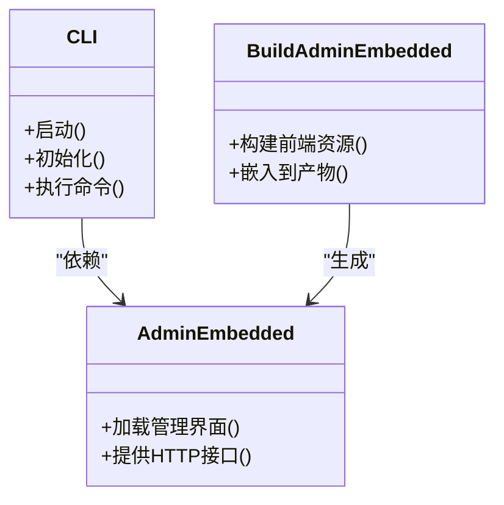
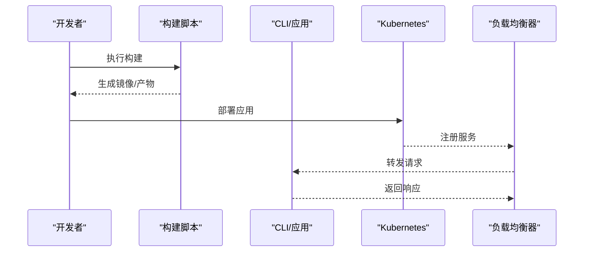
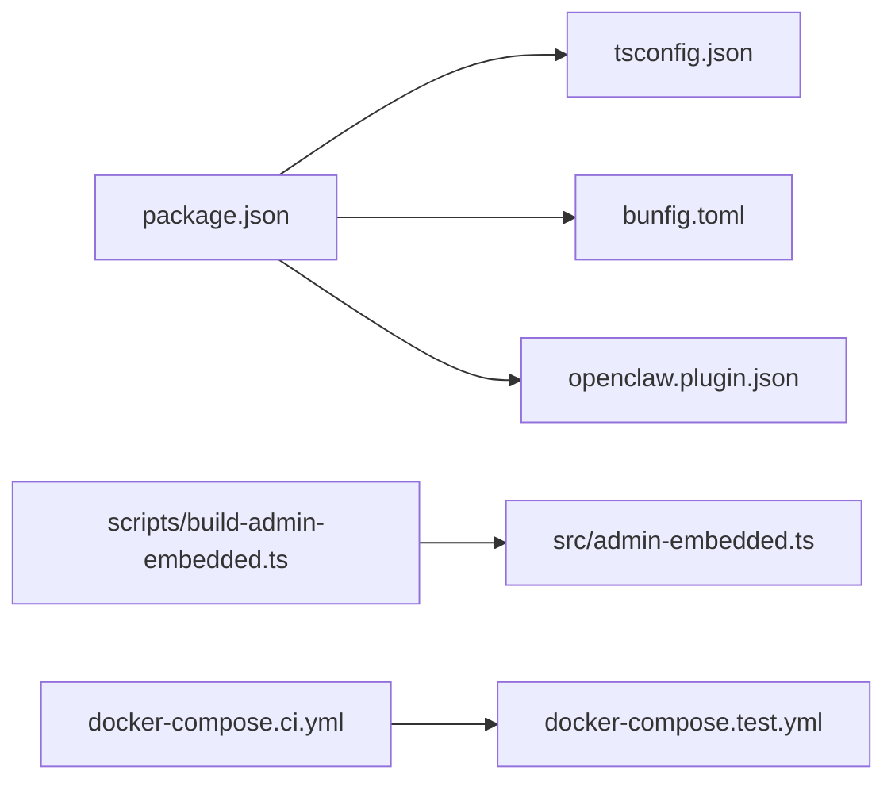

# 云平台部署

<cite>
**本文引用的文件**   
- [README.md](file://README.md)
- [INSTALL.md](file://docs/INSTALL.md)
- [docker-compose.ci.yml](file://docker-compose.ci.yml)
- [docker-compose.test.yml](file://docker-compose.test.yml)
- [gbrain.yml](file://gbrain.yml)
- [package.json](file://package.json)
- [tsconfig.json](file://tsconfig.json)
- [bunfig.toml](file://bunfig.toml)
- [openclaw.plugin.json](file://openclaw.plugin.json)
- [CLAUDE.md](file://CLAUDE.md)
- [AGENTS.md](file://AGENTS.md)
- [CONTRIBUTING.md](file://CONTRIBUTING.md)
- [SECURITY.md](file://SECURITY.md)
- [DESIGN.md](file://DESIGN.md)
- [docs/architecture/overview.md](file://docs/architecture/overview.md)
- [docs/guides/deployment-guide.md](file://docs/guides/deployment-guide.md)
- [docs/guides/helm-chart-guide.md](file://docs/guides/helm-chart-guide.md)
- [docs/guides/kubernetes-setup.md](file://docs/guides/kubernetes-setup.md)
- [docs/guides/service-mesh-integration.md](file://docs/guides/service-mesh-integration.md)
- [docs/guides/aws-deployment.md](file://docs/guides/aws-deployment.md)
- [docs/guides/azure-deployment.md](file://docs/guides/azure-deployment.md)
- [docs/guides/gcp-deployment.md](file://docs/guides/gcp-deployment.md)
- [docs/guides/multi-cloud-architecture.md](file://docs/guides/multi-cloud-architecture.md)
- [docs/guides/cost-optimization.md](file://docs/guides/cost-optimization.md)
- [docs/guides/monitoring-alerting.md](file://docs/guides/monitoring-alerting.md)
- [docs/guides/auto-scaling.md](file://docs/guides/auto-scaling.md)
- [docs/guides/data-sync-failover.md](file://docs/guides/data-sync-failover.md)
- [src/cli.ts](file://src/cli.ts)
- [src/admin-embedded.ts](file://src/admin-embedded.ts)
- [scripts/build-admin-embedded.ts](file://scripts/build-admin-embedded.ts)
</cite>

## 目录
1. [简介](#简介)
2. [项目结构](#项目结构)
3. [核心组件](#核心组件)
4. [架构总览](#架构总览)
5. [详细组件分析](#详细组件分析)
6. [依赖分析](#依赖分析)
7. [性能考虑](#性能考虑)
8. [故障排查指南](#故障排查指南)
9. [结论](#结论)
10. [附录](#附录)

## 简介
本指南面向在主流云平台（AWS、Azure、GCP）上部署与运维该项目的工程团队，覆盖以下主题：
- Kubernetes 集群部署与 Helm Chart 配置
- 服务网格集成（如 Istio、Linkerd）
- 云原生服务集成（负载均衡器、对象存储、消息队列、缓存）
- 自动扩缩容与弹性伸缩策略、资源配额管理
- 多云部署架构设计、数据同步与故障转移方案
- 成本优化策略、资源监控与告警配置

本项目为 Node/Bun 应用，提供 CLI 与嵌入式管理界面，支持容器化编排。仓库包含安装说明、CI/测试编排脚本以及若干部署相关文档路径，便于在多云上实现一致交付。

## 项目结构
从顶层结构与关键配置文件可以看出，项目采用“源码 + 文档 + 脚本 + 编排”的模块化组织方式：
- 源码位于 src/，包含 CLI 入口与管理端嵌入逻辑
- 文档集中于 docs/，涵盖架构、指南、集成等
- 编排与构建脚本位于 scripts/ 与根级 docker-compose.* 文件
- 包管理与运行时配置位于 package.json、tsconfig.json、bunfig.toml
- 插件与元信息位于 openclaw.plugin.json

图表来源
- [docker-compose.ci.yml:1-200](file://docker-compose.ci.yml#L1-L200)
- [docker-compose.test.yml:1-200](file://docker-compose.test.yml#L1-L200)
- [package.json:1-200](file://package.json#L1-L200)
- [tsconfig.json:1-200](file://tsconfig.json#L1-L200)
- [bunfig.toml:1-200](file://bunfig.toml#L1-200)
- [openclaw.plugin.json:1-200](file://openclaw.plugin.json#L1-200)
- [src/cli.ts:1-200](file://src/cli.ts#L1-L200)
- [src/admin-embedded.ts:1-200](file://src/admin-embedded.ts#L1-L200)
- [scripts/build-admin-embedded.ts:1-200](file://scripts/build-admin-embedded.ts#L1-L200)

章节来源
- [README.md:1-200](file://README.md#L1-L200)
- [docs/INSTALL.md:1-200](file://docs/INSTALL.md#L1-L200)
- [docker-compose.ci.yml:1-200](file://docker-compose.ci.yml#L1-L200)
- [docker-compose.test.yml:1-200](file://docker-compose.test.yml#L1-L200)
- [package.json:1-200](file://package.json#L1-L200)
- [tsconfig.json:1-200](file://tsconfig.json#L1-L200)
- [bunfig.toml:1-200](file://bunfig.toml#L1-200)
- [openclaw.plugin.json:1-200](file://openclaw.plugin.json#L1-200)

## 核心组件
- CLI 入口与命令分发：负责启动、初始化、运行任务与交互
- 嵌入式管理界面：用于本地或容器内访问的管理面板
- 构建脚本：将管理界面打包并嵌入到二进制产物中
- 编排与测试：通过 docker-compose 定义 CI 与测试环境的服务拓扑

章节来源
- [src/cli.ts:1-200](file://src/cli.ts#L1-L200)
- [src/admin-embedded.ts:1-200](file://src/admin-embedded.ts#L1-L200)
- [scripts/build-admin-embedded.ts:1-200](file://scripts/build-admin-embedded.ts#L1-L200)

## 架构总览
下图展示典型的多云部署视图：Kubernetes 集群承载应用与服务，外部通过云负载均衡器暴露；持久化与缓存由托管数据库与缓存服务提供；对象存储用于静态与归档数据；消息队列支撑异步处理；服务网格提供流量治理与安全。

图表来源
- [docs/guides/kubernetes-setup.md:1-200](file://docs/guides/kubernetes-setup.md#L1-L200)
- [docs/guides/helm-chart-guide.md:1-200](file://docs/guides/helm-chart-guide.md#L1-L200)
- [docs/guides/service-mesh-integration.md:1-200](file://docs/guides/service-mesh-integration.md#L1-L200)
- [docs/guides/aws-deployment.md:1-200](file://docs/guides/aws-deployment.md#L1-L200)
- [docs/guides/azure-deployment.md:1-200](file://docs/guides/azure-deployment.md#L1-L200)
- [docs/guides/gcp-deployment.md:1-200](file://docs/guides/gcp-deployment.md#L1-L200)
- [docs/guides/multi-cloud-architecture.md:1-200](file://docs/guides/multi-cloud-architecture.md#L1-L200)

## 详细组件分析

### Kubernetes 集群部署
- 节点池与工作负载：按角色划分控制面与节点池，使用 Deployment/StatefulSet 管理有状态与无状态服务
- Ingress 与网关：结合云厂商 Ingress Controller 或 Gateway API 暴露 HTTP/HTTPS 入口
- 命名空间与资源隔离：按环境（dev/staging/prod）划分命名空间，配合 ResourceQuota/LimitRange 进行配额管理
- 配置与密钥：使用 ConfigMap/Secret 注入环境变量与敏感信息，避免硬编码
- 健康检查与就绪探针：配置 liveness/readiness 探针以保障滚动更新与自愈

章节来源
- [docs/guides/kubernetes-setup.md:1-200](file://docs/guides/kubernetes-setup.md#L1-L200)

### Helm Chart 配置
- Chart 结构：values.yaml 集中参数，templates/ 下渲染 K8s 资源清单
- 多环境值覆盖：通过 --values 或 --set 区分 dev/staging/prod 配置
- 依赖管理：使用 dependencies 声明子 Chart（如数据库客户端、日志采集）
- 安全与合规：启用 PodSecurityPolicy/PSA、网络策略、RBAC 绑定
- 发布与回滚：使用 helm upgrade --install 与 rollback 机制

章节来源
- [docs/guides/helm-chart-guide.md:1-200](file://docs/guides/helm-chart-guide.md#L1-L200)

### 服务网格集成
- 流量治理：基于虚拟服务/网关定义路由、灰度发布与金丝雀
- 安全：mTLS 双向认证、证书轮换、访问控制策略
- 可观测性：分布式追踪、指标收集、日志聚合
- 熔断与重试：超时、重试、退避策略配置

章节来源
- [docs/guides/service-mesh-integration.md:1-200](file://docs/guides/service-mesh-integration.md#L1-L200)

### 云原生服务集成
- 负载均衡器：Ingress/Gateway 与云 LB 联动，启用 TLS 终止与 WAF
- 对象存储：统一抽象层对接 S3/Blob/GCS，配置桶策略与生命周期
- 消息队列：SQS/Service Bus/PubSub 作为事件总线，设置死信队列与重试
- 缓存服务：ElastiCache/Azure Cache/Redis 作为热点数据缓存，配置 TTL 与淘汰策略

章节来源
- [docs/guides/aws-deployment.md:1-200](file://docs/guides/aws-deployment.md#L1-L200)
- [docs/guides/azure-deployment.md:1-200](file://docs/guides/azure-deployment.md#L1-L200)
- [docs/guides/gcp-deployment.md:1-200](file://docs/guides/gcp-deployment.md#L1-L200)

### 自动扩缩容与弹性伸缩
- HPA/VPA：基于 CPU/内存/自定义指标触发水平扩展，垂直调整资源请求与限制
- Cluster Autoscaler：根据待调度 Pod 动态扩容节点池
- 伸缩策略：目标利用率、最小/最大副本数、冷却时间、渐进式扩缩容
- 容量规划：压测与基准测试驱动阈值设定

章节来源
- [docs/guides/auto-scaling.md:1-200](file://docs/guides/auto-scaling.md#L1-L200)

### 多云部署架构设计
- 区域与可用区：跨 AZ 高可用，跨 Region 灾备
- 数据一致性：主从复制、读写分离、最终一致性模型
- 故障转移：DNS/GSLB 切换、连接池重连、幂等写入
- 统一配置中心：集中管理多环境配置与密钥

章节来源
- [docs/guides/multi-cloud-architecture.md:1-200](file://docs/guides/multi-cloud-architecture.md#L1-L200)

### 数据同步与故障转移
- 同步策略：CDC、增量同步、冲突解决
- 迁移工具：版本化迁移脚本与回滚计划
- 演练与验证：定期故障演练与恢复验证

章节来源
- [docs/guides/data-sync-failover.md:1-200](file://docs/guides/data-sync-failover.md#L1-L200)

### 成本优化策略
- 实例类型与预留：按需/预留/抢占式组合，Spot 实例用于批处理
- 存储分层：热/温/冷数据分层，生命周期策略
- 资源超卖与压缩：合理设置 requests/limits，启用压缩与去重
- 监控与预算：设置预算告警与闲置资源回收

章节来源
- [docs/guides/cost-optimization.md:1-200](file://docs/guides/cost-optimization.md#L1-L200)

### 资源监控与告警配置
- 指标采集：Prometheus/Grafana 或云原生监控
- 日志与追踪：结构化日志、OpenTelemetry 链路追踪
- 告警规则：错误率、延迟、饱和度、资源水位
- 通知渠道：邮件、Slack、Webhook

章节来源
- [docs/guides/monitoring-alerting.md:1-200](file://docs/guides/monitoring-alerting.md#L1-L200)

### 应用组件关系图（代码级）

图表来源
- [src/cli.ts:1-200](file://src/cli.ts#L1-L200)
- [src/admin-embedded.ts:1-200](file://src/admin-embedded.ts#L1-L200)
- [scripts/build-admin-embedded.ts:1-200](file://scripts/build-admin-embedded.ts#L1-L200)

### 构建与运行流程（序列图）

图表来源
- [scripts/build-admin-embedded.ts:1-200](file://scripts/build-admin-embedded.ts#L1-L200)
- [docker-compose.ci.yml:1-200](file://docker-compose.ci.yml#L1-L200)
- [docker-compose.test.yml:1-200](file://docker-compose.test.yml#L1-L200)

## 依赖分析
- 运行时与语言：Node/Bun 生态，TypeScript 编译配置
- 包管理与脚本：package.json 定义依赖与脚本命令
- 构建与嵌入：管理界面通过脚本构建并嵌入
- 编排与测试：docker-compose 定义 CI/测试服务拓扑

图表来源
- [package.json:1-200](file://package.json#L1-L200)
- [tsconfig.json:1-200](file://tsconfig.json#L1-L200)
- [bunfig.toml:1-200](file://bunfig.toml#L1-200)
- [openclaw.plugin.json:1-200](file://openclaw.plugin.json#L1-200)
- [scripts/build-admin-embedded.ts:1-200](file://scripts/build-admin-embedded.ts#L1-L200)
- [docker-compose.ci.yml:1-200](file://docker-compose.ci.yml#L1-L200)
- [docker-compose.test.yml:1-200](file://docker-compose.test.yml#L1-L200)

章节来源
- [package.json:1-200](file://package.json#L1-L200)
- [tsconfig.json:1-200](file://tsconfig.json#L1-L200)
- [bunfig.toml:1-200](file://bunfig.toml#L1-200)
- [openclaw.plugin.json:1-200](file://openclaw.plugin.json#L1-200)
- [docker-compose.ci.yml:1-200](file://docker-compose.ci.yml#L1-L200)
- [docker-compose.test.yml:1-200](file://docker-compose.test.yml#L1-L200)

## 性能考虑
- 容器资源边界：合理设置 requests/limits，避免邻居干扰
- 连接池与并发：数据库与缓存连接池大小调优
- I/O 与磁盘：选择高性能卷与 SSD，启用预读与缓存
- 网络与序列化：启用 gzip/brotli，减少 payload 体积
- 缓存策略：多级缓存（本地+分布式），热点键保护

[本节为通用指导，不直接分析具体文件]

## 故障排查指南
- 启动失败：检查环境变量、密钥注入、镜像拉取与权限
- 健康检查异常：查看探针配置与后端依赖可用性
- 扩缩容不生效：确认 HPA 指标源与资源配额
- 服务间通信问题：检查服务网格 mTLS、网络策略与 DNS
- 日志与追踪：定位错误堆栈与链路瓶颈

章节来源
- [docs/guides/monitoring-alerting.md:1-200](file://docs/guides/monitoring-alerting.md#L1-L200)
- [docs/guides/service-mesh-integration.md:1-200](file://docs/guides/service-mesh-integration.md#L1-L200)
- [docs/guides/auto-scaling.md:1-200](file://docs/guides/auto-scaling.md#L1-L200)

## 结论
通过在多云平台上采用一致的 Kubernetes 与 Helm 编排模式，结合服务网格与云原生服务，可实现高可用、可扩展与可观测的部署体系。配合自动扩缩容、成本优化与完善的监控告警，能够稳定支撑业务增长与变更需求。

[本节为总结性内容，不直接分析具体文件]

## 附录
- 快速参考
  - 安装与入门：参考安装文档
  - 架构概览：参考架构文档
  - 插件与元信息：参考插件配置

章节来源
- [docs/INSTALL.md:1-200](file://docs/INSTALL.md#L1-L200)
- [docs/architecture/overview.md:1-200](file://docs/architecture/overview.md#L1-L200)
- [openclaw.plugin.json:1-200](file://openclaw.plugin.json#L1-200)