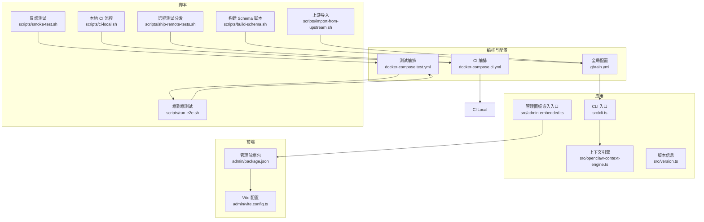
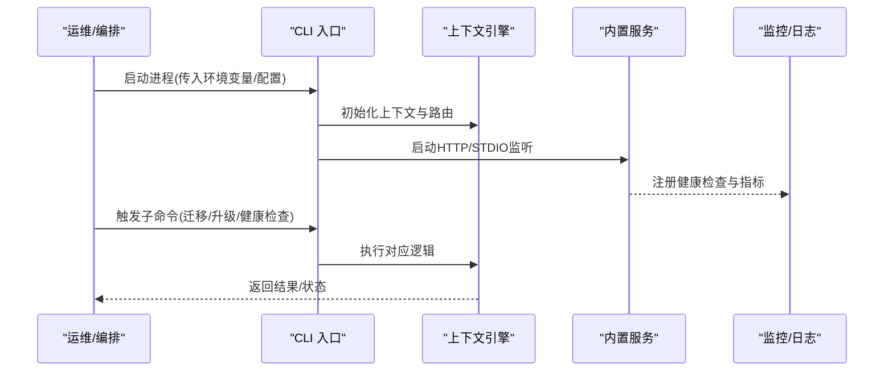
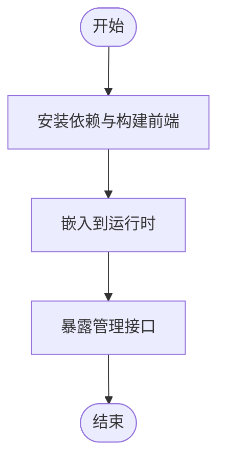
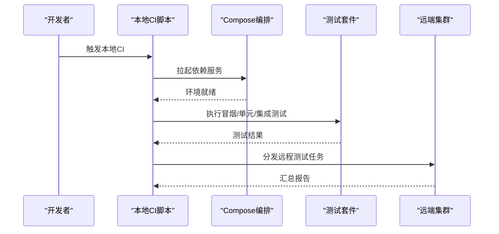
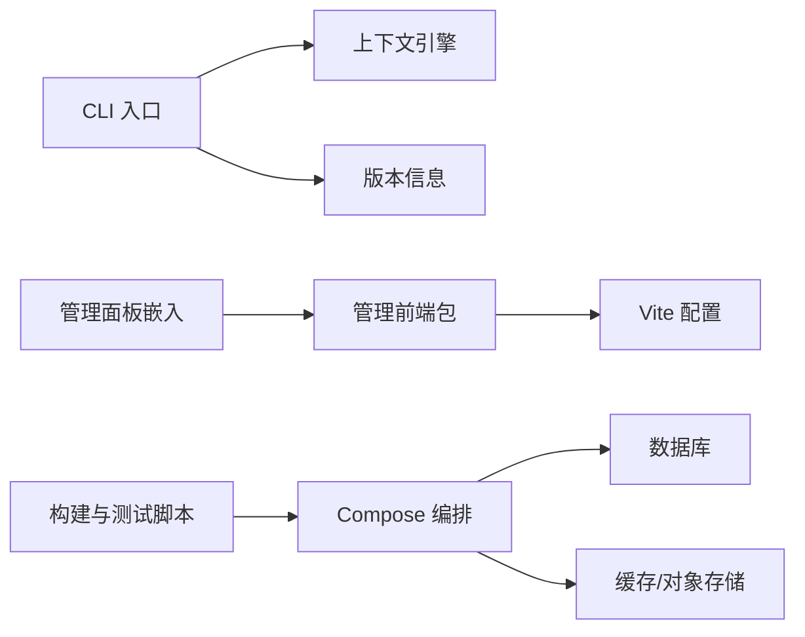
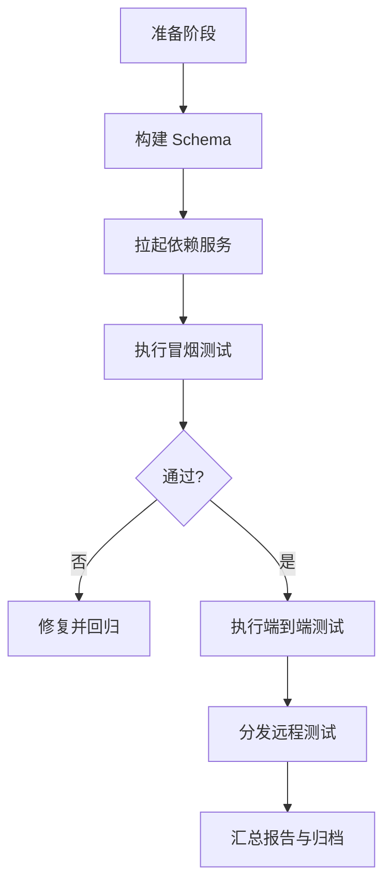

# 多云部署策略

<cite>
**本文引用的文件**   
- [README.md](file://README.md)
- [DESIGN.md](file://DESIGN.md)
- [gbrain.yml](file://gbrain.yml)
- [docker-compose.ci.yml](file://docker-compose.ci.yml)
- [docker-compose.test.yml](file://docker-compose.test.yml)
- [package.json](file://package.json)
- [tsconfig.json](file://tsconfig.json)
- [bunfig.toml](file://bunfig.toml)
- [src/cli.ts](file://src/cli.ts)
- [src/admin-embedded.ts](file://src/admin-embedded.ts)
- [src/openclaw-context-engine.ts](file://src/openclaw-context-engine.ts)
- [src/version.ts](file://src/version.ts)
- [scripts/build-schema.sh](file://scripts/build-schema.sh)
- [scripts/smoke-test.sh](file://scripts/smoke-test.sh)
- [scripts/run-e2e.sh](file://scripts/run-e2e.sh)
- [scripts/ci-local.sh](file://scripts/ci-local.sh)
- [scripts/ship-remote-tests.sh](file://scripts/ship-remote-tests.sh)
- [scripts/import-from-upstream.sh](file://scripts/import-from-upstream.sh)
- [admin/package.json](file://admin/package.json)
- [admin/vite.config.ts](file://admin/vite.config.ts)
- [docs/architecture/](file://docs/architecture/)
- [docs/guides/](file://docs/guides/)
- [docs/operations/](file://docs/operations/)
- [docs/migrations/](file://docs/migrations/)
</cite>

## 目录
1. [引言](#引言)
2. [项目结构](#项目结构)
3. [核心组件](#核心组件)
4. [架构总览](#架构总览)
5. [详细组件分析](#详细组件分析)
6. [依赖关系分析](#依赖关系分析)
7. [性能与延迟优化](#性能与延迟优化)
8. [故障转移与灾难恢复](#故障转移与灾难恢复)
9. [配置、密钥与环境隔离](#配置密钥与环境隔离)
10. [监控告警与日志集中化](#监控告警与日志集中化)
11. [成本监控与优化](#成本监控与优化)
12. [迁移工具与自动化脚本](#迁移工具与自动化脚本)
13. [结论](#结论)
14. [附录](#附录)

## 引言
本文件面向在多云环境中部署和运营该项目的工程团队，提供从架构设计到落地实施的全链路策略。内容覆盖跨云数据同步与一致性、故障转移与灾备、网络拓扑与延迟优化、配置与密钥管理、环境隔离、统一监控与日志、成本治理以及迁移与自动化等关键主题。文档同时结合仓库中的构建、测试、编排与运维脚本，给出可操作的实践建议。

## 项目结构
仓库采用“核心源码 + 管理前端 + 文档 + 脚本”的分层组织方式：
- 核心源码位于 src/，包含 CLI、嵌入式管理面板入口、上下文引擎与版本信息模块等。
- 管理前端位于 admin/，使用 Vite 构建并集成到主应用。
- 文档集中于 docs/，涵盖架构、指南、操作手册、迁移记录等。
- 构建与测试脚本集中在 scripts/，用于本地 CI、端到端测试、远程测试分发与上游导入等。
- 容器编排与多环境配置通过 docker-compose.* 与 gbrain.yml 管理。



图表来源
- [src/cli.ts](file://src/cli.ts)
- [src/admin-embedded.ts](file://src/admin-embedded.ts)
- [src/openclaw-context-engine.ts](file://src/openclaw-context-engine.ts)
- [src/version.ts](file://src/version.ts)
- [admin/package.json](file://admin/package.json)
- [admin/vite.config.ts](file://admin/vite.config.ts)
- [gbrain.yml](file://gbrain.yml)
- [docker-compose.ci.yml](file://docker-compose.ci.yml)
- [docker-compose.test.yml](file://docker-compose.test.yml)
- [scripts/build-schema.sh](file://scripts/build-schema.sh)
- [scripts/smoke-test.sh](file://scripts/smoke-test.sh)
- [scripts/run-e2e.sh](file://scripts/run-e2e.sh)
- [scripts/ci-local.sh](file://scripts/ci-local.sh)
- [scripts/ship-remote-tests.sh](file://scripts/ship-remote-tests.sh)
- [scripts/import-from-upstream.sh](file://scripts/import-from-upstream.sh)

章节来源
- [README.md](file://README.md)
- [DESIGN.md](file://DESIGN.md)
- [gbrain.yml](file://gbrain.yml)
- [docker-compose.ci.yml](file://docker-compose.ci.yml)
- [docker-compose.test.yml](file://docker-compose.test.yml)
- [package.json](file://package.json)
- [tsconfig.json](file://tsconfig.json)
- [bunfig.toml](file://bunfig.toml)
- [src/cli.ts](file://src/cli.ts)
- [src/admin-embedded.ts](file://src/admin-embedded.ts)
- [src/openclaw-context-engine.ts](file://src/openclaw-context-engine.ts)
- [src/version.ts](file://src/version.ts)
- [admin/package.json](file://admin/package.json)
- [admin/vite.config.ts](file://admin/vite.config.ts)
- [scripts/build-schema.sh](file://scripts/build-schema.sh)
- [scripts/smoke-test.sh](file://scripts/smoke-test.sh)
- [scripts/run-e2e.sh](file://scripts/run-e2e.sh)
- [scripts/ci-local.sh](file://scripts/ci-local.sh)
- [scripts/ship-remote-tests.sh](file://scripts/ship-remote-tests.sh)
- [scripts/import-from-upstream.sh](file://scripts/import-from-upstream.sh)

## 核心组件
- CLI 入口：负责命令解析、子命令调度与运行期参数注入，是多云环境下启动、升级、健康检查与运维操作的主要入口。
- 管理面板嵌入：将管理界面以嵌入式方式集成到运行时，便于在多云各节点统一访问。
- 上下文引擎：为上层能力提供统一的上下文装配与路由能力，是多云场景下服务发现与请求路由的关键支撑。
- 版本信息：提供运行时版本与兼容性校验，配合发布流水线实现灰度与回滚控制。

章节来源
- [src/cli.ts](file://src/cli.ts)
- [src/admin-embedded.ts](file://src/admin-embedded.ts)
- [src/openclaw-context-engine.ts](file://src/openclaw-context-engine.ts)
- [src/version.ts](file://src/version.ts)

## 架构总览
多云部署的总体思路是以“单仓多环境”为核心，通过容器编排与配置中心驱动，在不同云平台间实现一致的应用形态与数据面策略。

```mermaid
graph TB
subgraph "多云区域 A"
GW_A["网关/负载均衡"]
APP_A["应用实例集群"]
DB_A["数据库(主)"]
CACHE_A["缓存/对象存储"]
end
subgraph "多云区域 B"
GW_B["网关/负载均衡"]
APP_B["应用实例集群"]
DB_B["数据库(备)"]
CACHE_B["缓存/对象存储"]
end
subgraph "多云区域 C"
GW_C["网关/负载均衡"]
APP_C["应用实例集群"]
DB_C["数据库(只读副本)"]
CACHE_C["缓存/对象存储"]
end
subgraph "管控面"
CI["CI/CD 流水线"]
REG["镜像仓库"]
CFG["配置中心/密钥库"]
MON["监控与日志平台"]
end
GW_A --> APP_A
GW_B --> APP_B
GW_C --> APP_C
APP_A --> DB_A
APP_B --> DB_B
APP_C --> DB_C
APP_A --> CACHE_A
APP_B --> CACHE_B
APP_C --> CACHE_C
CI --> REG
CI --> CFG
CI --> MON
DB_A < --> DB_B
DB_B < --> DB_C
```

图表来源
- [docker-compose.ci.yml](file://docker-compose.ci.yml)
- [docker-compose.test.yml](file://docker-compose.test.yml)
- [gbrain.yml](file://gbrain.yml)

## 详细组件分析

### 组件A：CLI 与运行期生命周期
- 职责：解析命令行参数、加载配置、初始化上下文引擎、启动内置服务（如 HTTP/STDIO）、执行子命令（安装、迁移、健康检查、升级）。
- 多云要点：
  - 通过环境变量与配置文件区分多环境；在容器编排中注入不同区域的凭据与端点。
  - 支持健康检查与优雅退出，配合编排系统完成滚动更新与故障自愈。
  - 与版本信息模块协作，确保跨云节点版本一致性或灰度策略。



图表来源
- [src/cli.ts](file://src/cli.ts)
- [src/openclaw-context-engine.ts](file://src/openclaw-context-engine.ts)
- [src/version.ts](file://src/version.ts)

章节来源
- [src/cli.ts](file://src/cli.ts)
- [src/openclaw-context-engine.ts](file://src/openclaw-context-engine.ts)
- [src/version.ts](file://src/version.ts)

### 组件B：管理面板嵌入与前端构建
- 职责：将管理前端打包并嵌入到运行时，提供统一的运维界面。
- 多云要点：
  - 通过 Vite 配置与包管理进行构建产物管理，确保在多环境构建一致性。
  - 嵌入后由 CLI 暴露统一访问路径，避免在各云单独维护独立站点。



图表来源
- [admin/package.json](file://admin/package.json)
- [admin/vite.config.ts](file://admin/vite.config.ts)
- [src/admin-embedded.ts](file://src/admin-embedded.ts)

章节来源
- [admin/package.json](file://admin/package.json)
- [admin/vite.config.ts](file://admin/vite.config.ts)
- [src/admin-embedded.ts](file://src/admin-embedded.ts)

### 组件C：构建与测试流水线
- 职责：封装 Schema 构建、冒烟测试、端到端测试、本地 CI 与远程测试分发。
- 多云要点：
  - 使用 docker-compose 编排测试环境，模拟多云依赖（数据库、缓存、外部服务）。
  - 通过脚本将测试工件分发至远端集群，验证跨云兼容性与稳定性。



图表来源
- [scripts/ci-local.sh](file://scripts/ci-local.sh)
- [scripts/build-schema.sh](file://scripts/build-schema.sh)
- [scripts/smoke-test.sh](file://scripts/smoke-test.sh)
- [scripts/run-e2e.sh](file://scripts/run-e2e.sh)
- [scripts/ship-remote-tests.sh](file://scripts/ship-remote-tests.sh)
- [docker-compose.ci.yml](file://docker-compose.ci.yml)
- [docker-compose.test.yml](file://docker-compose.test.yml)

章节来源
- [scripts/ci-local.sh](file://scripts/ci-local.sh)
- [scripts/build-schema.sh](file://scripts/build-schema.sh)
- [scripts/smoke-test.sh](file://scripts/smoke-test.sh)
- [scripts/run-e2e.sh](file://scripts/run-e2e.sh)
- [scripts/ship-remote-tests.sh](file://scripts/ship-remote-tests.sh)
- [docker-compose.ci.yml](file://docker-compose.ci.yml)
- [docker-compose.test.yml](file://docker-compose.test.yml)

## 依赖关系分析
- 应用内依赖：CLI 依赖上下文引擎与版本模块；管理面板嵌入依赖前端构建产物。
- 构建与测试依赖：脚本依赖 docker-compose 与 Node/Bun 工具链；测试依赖编排的数据库与缓存服务。
- 外部依赖：对象存储、消息队列、向量索引、LLM 网关等（根据实际部署选择）。



图表来源
- [src/cli.ts](file://src/cli.ts)
- [src/openclaw-context-engine.ts](file://src/openclaw-context-engine.ts)
- [src/version.ts](file://src/version.ts)
- [src/admin-embedded.ts](file://src/admin-embedded.ts)
- [admin/package.json](file://admin/package.json)
- [admin/vite.config.ts](file://admin/vite.config.ts)
- [scripts/ci-local.sh](file://scripts/ci-local.sh)
- [docker-compose.ci.yml](file://docker-compose.ci.yml)
- [docker-compose.test.yml](file://docker-compose.test.yml)

章节来源
- [package.json](file://package.json)
- [tsconfig.json](file://tsconfig.json)
- [bunfig.toml](file://bunfig.toml)

## 性能与延迟优化
- 就近接入：在各云区域部署网关与应用实例，用户流量就近进入，降低首包时延。
- 读写分离与分片：数据库按区域主备/只读副本分层，热点数据使用区域缓存；写路径走主库，读路径走副本。
- 连接复用与池化：应用侧对数据库与外部服务建立连接池，减少握手开销。
- 静态资源就近分发：管理面板与前端资源通过 CDN 分发，提升加载速度。
- 批处理与异步化：批量写入与重计算任务异步化，削峰填谷，避免阻塞在线请求。

[本节为通用指导，不直接分析具体文件]

## 故障转移与灾难恢复
- 自动故障检测：基于健康检查与心跳机制，编排系统快速识别异常节点并剔除。
- 区域级切换：当某区域不可用时，通过 DNS/GSLB 将流量切换到可用区域；数据库主备切换需满足 RPO/RTO 目标。
- 幂等与重试：对外部依赖调用增加幂等键与退避重试，避免重复写入与雪崩。
- 数据一致性：跨区复制采用强一致或最终一致策略，依据业务容忍度选择；必要时引入补偿事务与对账任务。
- 演练与回滚：定期开展故障演练，验证切换流程；发布过程支持灰度与一键回滚。

[本节为通用指导，不直接分析具体文件]

## 配置、密钥与环境隔离
- 配置分层：基础配置（默认值）+ 环境配置（区域/租户）+ 运行时注入（动态参数），优先级自低到高。
- 密钥管理：使用云原生密钥管理服务（KMS/Secrets Manager），应用侧通过安全通道拉取，禁止硬编码。
- 环境隔离：通过命名空间、标签与资源配额实现多租户与多环境隔离；敏感数据落盘加密。
- 配置变更审计：所有配置与密钥变更纳入审计日志，支持回溯与告警。

[本节为通用指导，不直接分析具体文件]

## 监控告警与日志集中化
- 指标采集：应用埋点（请求量、错误率、时延、队列积压、资源使用）与基础设施指标（CPU、内存、磁盘、网络）统一上报。
- 日志规范：结构化日志（JSON）、统一字段（trace_id、region、tenant）、分级输出（INFO/WARN/ERROR）。
- 告警策略：基于阈值与异常检测，设置多级告警（警告/严重/致命），并联动通知渠道。
- 可观测性闭环：指标、日志、追踪三件套关联，定位问题更快更准。

[本节为通用指导，不直接分析具体文件]

## 成本监控与优化
- 资源利用率分析：按区域与租户维度统计 CPU/内存/存储/网络使用率，识别闲置与低效资源。
- 弹性伸缩：基于负载指标自动扩缩容，低谷期释放资源，高峰期快速扩容。
- 存储分层：热数据高性能存储，冷数据归档到低成本存储；定期清理过期与冗余数据。
- 成本看板与预算：建立成本看板，设定预算与阈值，超支自动告警与限流。

[本节为通用指导，不直接分析具体文件]

## 迁移工具与自动化脚本
- Schema 构建：通过构建脚本生成/校验 Schema，确保多环境一致。
- 冒烟与端到端测试：在编排环境中执行冒烟与 E2E 用例，验证功能与兼容性。
- 远程测试分发：将测试工件分发至远端集群，覆盖多云差异场景。
- 上游导入：提供导入脚本，将上游变更同步到当前分支，保持演进一致性。



图表来源
- [scripts/build-schema.sh](file://scripts/build-schema.sh)
- [scripts/smoke-test.sh](file://scripts/smoke-test.sh)
- [scripts/run-e2e.sh](file://scripts/run-e2e.sh)
- [scripts/ship-remote-tests.sh](file://scripts/ship-remote-tests.sh)
- [scripts/import-from-upstream.sh](file://scripts/import-from-upstream.sh)
- [docker-compose.test.yml](file://docker-compose.test.yml)

章节来源
- [scripts/build-schema.sh](file://scripts/build-schema.sh)
- [scripts/smoke-test.sh](file://scripts/smoke-test.sh)
- [scripts/run-e2e.sh](file://scripts/run-e2e.sh)
- [scripts/ship-remote-tests.sh](file://scripts/ship-remote-tests.sh)
- [scripts/import-from-upstream.sh](file://scripts/import-from-upstream.sh)
- [docker-compose.test.yml](file://docker-compose.test.yml)

## 结论
通过在多云区域部署一致的组件形态、完善的数据复制与一致性策略、健壮的故障转移与灾备方案、严格的配置与密钥管理、统一的监控与日志体系，以及完善的迁移与自动化脚本，可以在保障高可用与一致性的前提下，实现低成本、高效率的多云运营。建议持续进行容量规划、压测与演练，确保系统在真实负载下的稳健表现。

[本节为总结性内容，不直接分析具体文件]

## 附录
- 参考文档：
  - 架构与设计说明：docs/architecture/
  - 操作指南：docs/guides/
  - 运维手册：docs/operations/
  - 迁移记录：docs/migrations/
- 关键配置与编排：
  - 全局配置：gbrain.yml
  - CI 编排：docker-compose.ci.yml
  - 测试编排：docker-compose.test.yml

[本节为指引性内容，不直接分析具体文件]