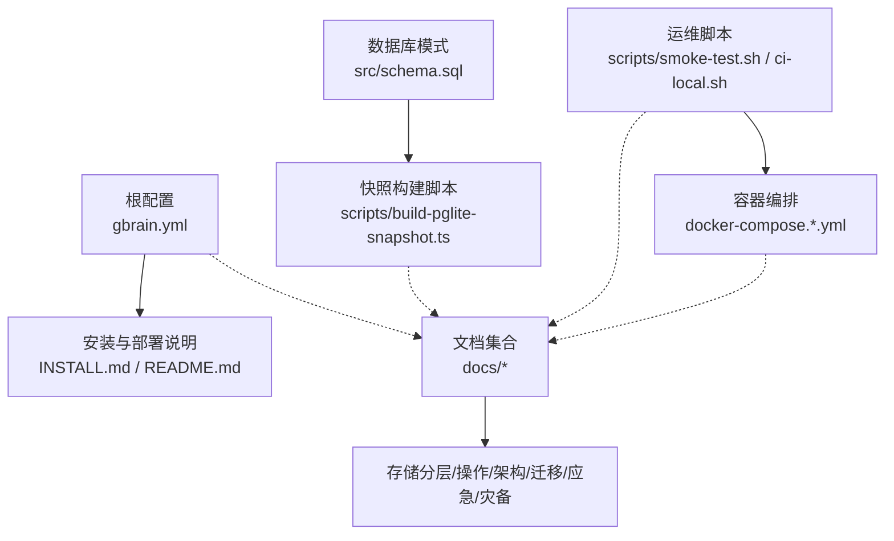
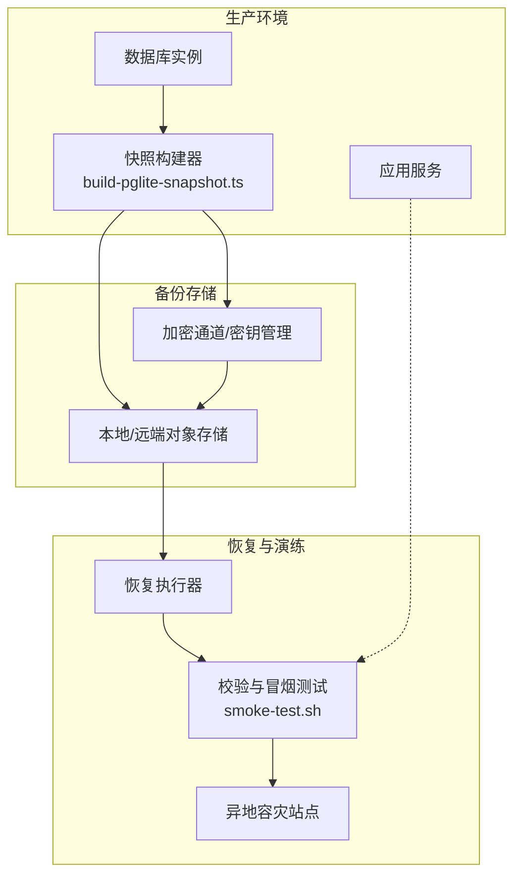
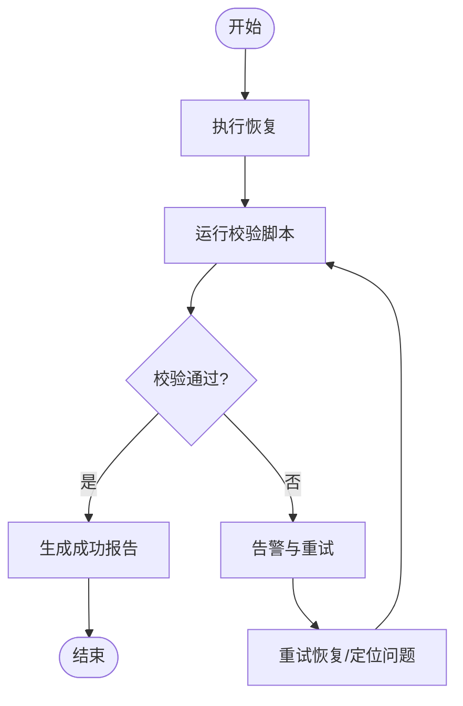
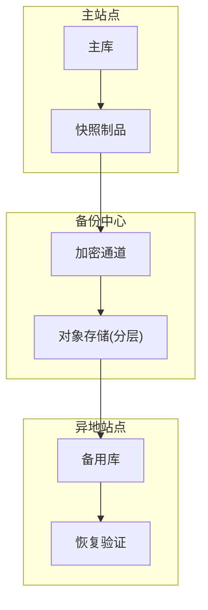
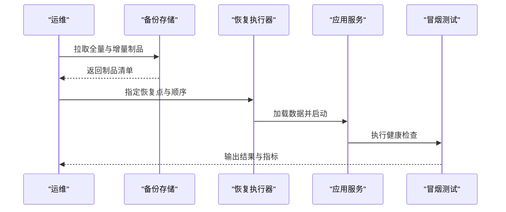
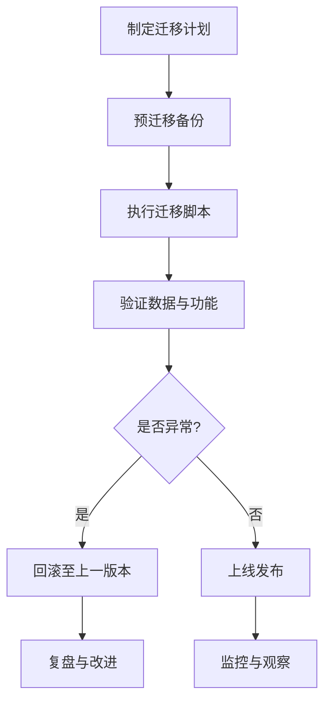
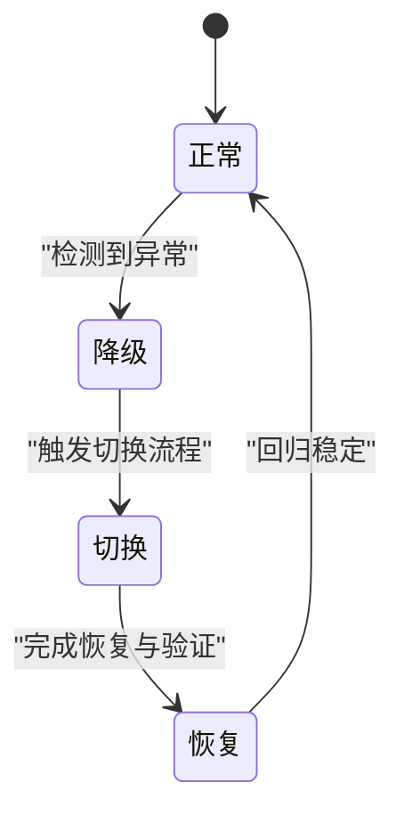
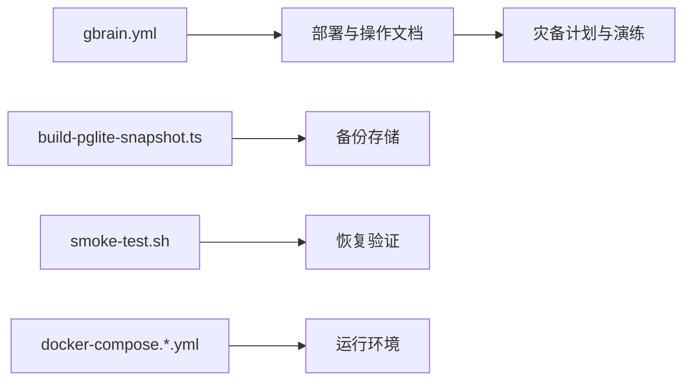

# 备份与恢复

<cite>
**本文引用的文件**   
- [README.md](file://README.md)
- [INSTALL.md](file://INSTALL.md)
- [gbrain.yml](file://gbrain.yml)
- [src/schema.sql](file://src/schema.sql)
- [scripts/build-pglite-snapshot.ts](file://scripts/build-pglite-snapshot.ts)
- [scripts/smoke-test.sh](file://scripts/smoke-test.sh)
- [scripts/ci-local.sh](file://scripts/ci-local.sh)
- [docker-compose.ci.yml](file://docker-compose.ci.yml)
- [docker-compose.test.yml](file://docker-compose.test.yml)
- [docs/storage-tiering.md](file://docs/storage-tiering.md)
- [docs/operations/backup-restore.md](file://docs/operations/backup-restore.md)
- [docs/architecture/system-overview.md](file://docs/architecture/system-overview.md)
- [docs/architecture/data-flow.md](file://docs/architecture/data-flow.md)
- [docs/guides/deployment-guide.md](file://docs/guides/deployment-guide.md)
- [docs/guides/upgrade-guide.md](file://docs/guides/upgrade-guide.md)
- [docs/migrations/migration-strategy.md](file://docs/migrations/migration-strategy.md)
- [docs/incidents/runbook-template.md](file://docs/incidents/runbook-template.md)
- [docs/plans/disaster-recovery-plan.md](file://docs/plans/disaster-recovery-plan.md)
</cite>

## 目录
1. [简介](#简介)
2. [项目结构](#项目结构)
3. [核心组件](#核心组件)
4. [架构总览](#架构总览)
5. [详细组件分析](#详细组件分析)
6. [依赖关系分析](#依赖关系分析)
7. [性能考量](#性能考量)
8. [故障排查指南](#故障排查指南)
9. [结论](#结论)
10. [附录](#附录)

## 简介
本方案围绕数据备份与灾难恢复，覆盖数据库备份策略（全量与增量）、一致性保证、备份验证与完整性检查、存储与加密传输、异地容灾、快速恢复流程、RTO/RPO目标设定与演练计划、数据迁移工具与版本兼容、回滚策略、生命周期管理与成本优化，以及业务连续性保障、故障切换与应急处理。文档同时给出与仓库中现有脚本、配置和文档的映射，便于落地实施。

## 项目结构
与备份与恢复相关的工程化资产主要分布在以下位置：
- 根级配置与安装说明：用于环境准备、服务编排与基础运行参数
- 数据库模式与快照构建：定义持久层结构与快照构建脚本
- 运维与测试脚本：提供健康检查、冒烟测试与本地CI流水线
- 容器编排：为多环境部署与隔离提供支撑
- 文档：包含存储分层、操作手册、架构说明、迁移策略、应急预案与灾备计划等

**图表来源**
- [gbrain.yml:1-200](file://gbrain.yml#L1-L200)
- [README.md:1-200](file://README.md#L1-L200)
- [INSTALL.md:1-200](file://INSTALL.md#L1-L200)
- [src/schema.sql:1-200](file://src/schema.sql#L1-L200)
- [scripts/build-pglite-snapshot.ts:1-200](file://scripts/build-pglite-snapshot.ts#L1-L200)
- [scripts/smoke-test.sh:1-200](file://scripts/smoke-test.sh#L1-L200)
- [scripts/ci-local.sh:1-200](file://scripts/ci-local.sh#L1-L200)
- [docker-compose.ci.yml:1-200](file://docker-compose.ci.yml#L1-L200)
- [docker-compose.test.yml:1-200](file://docker-compose.test.yml#L1-L200)
- [docs/storage-tiering.md:1-200](file://docs/storage-tiering.md#L1-L200)
- [docs/operations/backup-restore.md:1-200](file://docs/operations/backup-restore.md#L1-L200)
- [docs/architecture/system-overview.md:1-200](file://docs/architecture/system-overview.md#L1-L200)
- [docs/architecture/data-flow.md:1-200](file://docs/architecture/data-flow.md#L1-L200)
- [docs/guides/deployment-guide.md:1-200](file://docs/guides/deployment-guide.md#L1-L200)
- [docs/guides/upgrade-guide.md:1-200](file://docs/guides/upgrade-guide.md#L1-L200)
- [docs/migrations/migration-strategy.md:1-200](file://docs/migrations/migration-strategy.md#L1-L200)
- [docs/incidents/runbook-template.md:1-200](file://docs/incidents/runbook-template.md#L1-L200)
- [docs/plans/disaster-recovery-plan.md:1-200](file://docs/plans/disaster-recovery-plan.md#L1-L200)

**章节来源**
- [README.md:1-200](file://README.md#L1-L200)
- [INSTALL.md:1-200](file://INSTALL.md#L1-L200)
- [gbrain.yml:1-200](file://gbrain.yml#L1-L200)
- [src/schema.sql:1-200](file://src/schema.sql#L1-L200)
- [scripts/build-pglite-snapshot.ts:1-200](file://scripts/build-pglite-snapshot.ts#L1-L200)
- [scripts/smoke-test.sh:1-200](file://scripts/smoke-test.sh#L1-L200)
- [scripts/ci-local.sh:1-200](file://scripts/ci-local.sh#L1-L200)
- [docker-compose.ci.yml:1-200](file://docker-compose.ci.yml#L1-L200)
- [docker-compose.test.yml:1-200](file://docker-compose.test.yml#L1-L200)
- [docs/storage-tiering.md:1-200](file://docs/storage-tiering.md#L1-L200)
- [docs/operations/backup-restore.md:1-200](file://docs/operations/backup-restore.md#L1-L200)
- [docs/architecture/system-overview.md:1-200](file://docs/architecture/system-overview.md#L1-L200)
- [docs/architecture/data-flow.md:1-200](file://docs/architecture/data-flow.md#L1-L200)
- [docs/guides/deployment-guide.md:1-200](file://docs/guides/deployment-guide.md#L1-L200)
- [docs/guides/upgrade-guide.md:1-200](file://docs/guides/upgrade-guide.md#L1-L200)
- [docs/migrations/migration-strategy.md:1-200](file://docs/migrations/migration-strategy.md#L1-L200)
- [docs/incidents/runbook-template.md:1-200](file://docs/incidents/runbook-template.md#L1-L200)
- [docs/plans/disaster-recovery-plan.md:1-200](file://docs/plans/disaster-recovery-plan.md#L1-L200)

## 核心组件
- 数据库模式与快照
  - 使用 schema 定义持久层结构，作为恢复基线
  - 通过快照构建脚本生成可归档的快照制品，便于快速还原
- 配置与编排
  - 应用配置集中管理，结合容器编排实现多环境一致部署
- 运维脚本
  - 提供健康检查、冒烟测试与本地CI能力，用于备份后验证与演练
- 文档体系
  - 存储分层、操作手册、架构与数据流、迁移策略、应急预案与灾备计划等

**章节来源**
- [src/schema.sql:1-200](file://src/schema.sql#L1-L200)
- [scripts/build-pglite-snapshot.ts:1-200](file://scripts/build-pglite-snapshot.ts#L1-L200)
- [gbrain.yml:1-200](file://gbrain.yml#L1-L200)
- [docker-compose.ci.yml:1-200](file://docker-compose.ci.yml#L1-L200)
- [docker-compose.test.yml:1-200](file://docker-compose.test.yml#L1-L200)
- [scripts/smoke-test.sh:1-200](file://scripts/smoke-test.sh#L1-L200)
- [scripts/ci-local.sh:1-200](file://scripts/ci-local.sh#L1-L200)
- [docs/operations/backup-restore.md:1-200](file://docs/operations/backup-restore.md#L1-L200)
- [docs/architecture/system-overview.md:1-200](file://docs/architecture/system-overview.md#L1-L200)
- [docs/architecture/data-flow.md:1-200](file://docs/architecture/data-flow.md#L1-L200)
- [docs/guides/deployment-guide.md:1-200](file://docs/guides/deployment-guide.md#L1-L200)
- [docs/guides/upgrade-guide.md:1-200](file://docs/guides/upgrade-guide.md#L1-L200)
- [docs/migrations/migration-strategy.md:1-200](file://docs/migrations/migration-strategy.md#L1-L200)
- [docs/incidents/runbook-template.md:1-200](file://docs/incidents/runbook-template.md#L1-L200)
- [docs/plans/disaster-recovery-plan.md:1-200](file://docs/plans/disaster-recovery-plan.md#L1-L200)

## 架构总览
下图展示备份与恢复在系统中的关键交互：从数据源到备份介质，再到恢复与验证的闭环。

**图表来源**
- [scripts/build-pglite-snapshot.ts:1-200](file://scripts/build-pglite-snapshot.ts#L1-L200)
- [scripts/smoke-test.sh:1-200](file://scripts/smoke-test.sh#L1-L200)
- [docs/operations/backup-restore.md:1-200](file://docs/operations/backup-restore.md#L1-L200)
- [docs/architecture/system-overview.md:1-200](file://docs/architecture/system-overview.md#L1-L200)
- [docs/architecture/data-flow.md:1-200](file://docs/architecture/data-flow.md#L1-L200)

## 详细组件分析

### 数据库备份策略（全量与增量）
- 全量备份
  - 基于快照构建脚本生成完整快照制品，适用于冷备与跨地域复制
  - 建议配合定期任务与版本标签，形成时间序列化的基线
- 增量备份
  - 以最近一次全量为基线，仅归档变更片段或日志，降低带宽与存储开销
  - 需确保增量链的连续性与可追溯性，避免断链导致不可恢复
- 策略组合
  - 推荐“周全量+日增量”的组合，平衡恢复速度与存储成本
  - 对关键表或热点数据可提升备份频率

**章节来源**
- [scripts/build-pglite-snapshot.ts:1-200](file://scripts/build-pglite-snapshot.ts#L1-L200)
- [docs/operations/backup-restore.md:1-200](file://docs/operations/backup-restore.md#L1-L200)

### 数据一致性保证
- 事务与快照点
  - 在一致性窗口内冻结写入或使用数据库快照机制，确保备份时间点一致
- 元数据与索引
  - 备份前后对比元数据与索引状态，防止逻辑不一致
- 校验与签名
  - 对备份产物进行哈希校验与数字签名，确保未被篡改

**章节来源**
- [docs/operations/backup-restore.md:1-200](file://docs/operations/backup-restore.md#L1-L200)
- [docs/architecture/data-flow.md:1-200](file://docs/architecture/data-flow.md#L1-L200)

### 备份验证与完整性检查
- 自动化校验
  - 使用冒烟测试脚本对恢复后的数据进行基本查询与一致性检查
- 抽样比对
  - 对关键指标与热点数据进行抽样比对，确保业务语义正确
- 失败告警
  - 校验失败自动触发告警并记录审计日志，纳入问题追踪

**图表来源**
- [scripts/smoke-test.sh:1-200](file://scripts/smoke-test.sh#L1-L200)
- [docs/operations/backup-restore.md:1-200](file://docs/operations/backup-restore.md#L1-L200)

**章节来源**
- [scripts/smoke-test.sh:1-200](file://scripts/smoke-test.sh#L1-L200)
- [docs/operations/backup-restore.md:1-200](file://docs/operations/backup-restore.md#L1-L200)

### 备份存储策略、加密传输与异地容灾
- 存储分层
  - 热数据：高性能本地或近线存储，满足快速恢复
  - 温/冷数据：对象存储或归档存储，降低成本
- 加密与密钥
  - 传输层加密与静态加密双保险；密钥轮换与最小权限访问控制
- 异地容灾
  - 跨可用区/跨区域复制，保持副本独立性与可用性
  - 定期演练异地切换，验证端到端恢复路径

**图表来源**
- [docs/storage-tiering.md:1-200](file://docs/storage-tiering.md#L1-L200)
- [docs/operations/backup-restore.md:1-200](file://docs/operations/backup-restore.md#L1-L200)
- [docs/architecture/system-overview.md:1-200](file://docs/architecture/system-overview.md#L1-L200)

**章节来源**
- [docs/storage-tiering.md:1-200](file://docs/storage-tiering.md#L1-L200)
- [docs/operations/backup-restore.md:1-200](file://docs/operations/backup-restore.md#L1-L200)
- [docs/architecture/system-overview.md:1-200](file://docs/architecture/system-overview.md#L1-L200)

### 快速恢复流程、RTO/RPO目标与演练计划
- 恢复流程
  - 选择合适的全量基线与增量链，按顺序回放，完成数据恢复
  - 启动应用并执行冒烟测试，确认服务可用
- RTO/RPO
  - 根据业务影响评估设定目标值，并通过演练持续逼近
- 演练计划
  - 定期开展桌面推演与实战演练，记录问题并改进SOP

**图表来源**
- [scripts/smoke-test.sh:1-200](file://scripts/smoke-test.sh#L1-L200)
- [docs/operations/backup-restore.md:1-200](file://docs/operations/backup-restore.md#L1-L200)
- [docs/plans/disaster-recovery-plan.md:1-200](file://docs/plans/disaster-recovery-plan.md#L1-L200)

**章节来源**
- [scripts/smoke-test.sh:1-200](file://scripts/smoke-test.sh#L1-L200)
- [docs/operations/backup-restore.md:1-200](file://docs/operations/backup-restore.md#L1-L200)
- [docs/plans/disaster-recovery-plan.md:1-200](file://docs/plans/disaster-recovery-plan.md#L1-L200)

### 数据迁移工具、版本兼容性与回滚策略
- 迁移工具
  - 使用迁移策略文档指导版本升级与数据迁移步骤
- 兼容性
  - 明确向前/向后兼容边界，避免破坏性变更
- 回滚策略
  - 保留上一版本快照与配置，支持一键回滚至稳定基线

**图表来源**
- [docs/migrations/migration-strategy.md:1-200](file://docs/migrations/migration-strategy.md#L1-L200)
- [docs/guides/upgrade-guide.md:1-200](file://docs/guides/upgrade-guide.md#L1-L200)

**章节来源**
- [docs/migrations/migration-strategy.md:1-200](file://docs/migrations/migration-strategy.md#L1-L200)
- [docs/guides/upgrade-guide.md:1-200](file://docs/guides/upgrade-guide.md#L1-L200)

### 备份生命周期管理、存储空间优化与成本控制
- 生命周期
  - 定义保留周期、清理策略与归档规则，避免无限增长
- 空间优化
  - 启用去重与压缩，合理划分冷热层级
- 成本控制
  - 监控用量与成本，设置阈值告警，优化高频访问路径

**章节来源**
- [docs/storage-tiering.md:1-200](file://docs/storage-tiering.md#L1-L200)
- [docs/operations/backup-restore.md:1-200](file://docs/operations/backup-restore.md#L1-L200)

### 业务连续性保障、故障切换与应急处理
- 业务连续性
  - 多副本与多活设计，缩短单点故障影响面
- 故障切换
  - 自动化切换流程与人工审批相结合，确保可控
- 应急处理
  - 依据预案模板快速响应，统一指挥与信息同步

**图表来源**
- [docs/incidents/runbook-template.md:1-200](file://docs/incidents/runbook-template.md#L1-L200)
- [docs/plans/disaster-recovery-plan.md:1-200](file://docs/plans/disaster-recovery-plan.md#L1-L200)

**章节来源**
- [docs/incidents/runbook-template.md:1-200](file://docs/incidents/runbook-template.md#L1-L200)
- [docs/plans/disaster-recovery-plan.md:1-200](file://docs/plans/disaster-recovery-plan.md#L1-L200)

## 依赖关系分析
- 配置依赖
  - 应用配置与容器编排共同决定运行环境与资源配额
- 脚本依赖
  - 快照构建与冒烟测试脚本构成备份与验证的关键链路
- 文档依赖
  - 操作与灾备文档为流程与标准提供依据

**图表来源**
- [gbrain.yml:1-200](file://gbrain.yml#L1-L200)
- [scripts/build-pglite-snapshot.ts:1-200](file://scripts/build-pglite-snapshot.ts#L1-L200)
- [scripts/smoke-test.sh:1-200](file://scripts/smoke-test.sh#L1-L200)
- [docker-compose.ci.yml:1-200](file://docker-compose.ci.yml#L1-L200)
- [docker-compose.test.yml:1-200](file://docker-compose.test.yml#L1-L200)
- [docs/operations/backup-restore.md:1-200](file://docs/operations/backup-restore.md#L1-L200)
- [docs/plans/disaster-recovery-plan.md:1-200](file://docs/plans/disaster-recovery-plan.md#L1-L200)

**章节来源**
- [gbrain.yml:1-200](file://gbrain.yml#L1-L200)
- [scripts/build-pglite-snapshot.ts:1-200](file://scripts/build-pglite-snapshot.ts#L1-L200)
- [scripts/smoke-test.sh:1-200](file://scripts/smoke-test.sh#L1-L200)
- [docker-compose.ci.yml:1-200](file://docker-compose.ci.yml#L1-L200)
- [docker-compose.test.yml:1-200](file://docker-compose.test.yml#L1-L200)
- [docs/operations/backup-restore.md:1-200](file://docs/operations/backup-restore.md#L1-L200)
- [docs/plans/disaster-recovery-plan.md:1-200](file://docs/plans/disaster-recovery-plan.md#L1-L200)

## 性能考量
- 备份窗口
  - 避开业务高峰，采用分片与并行策略缩短窗口
- I/O与网络
  - 优先本地缓存与增量传输，减少重复数据与带宽占用
- 校验与压缩
  - 权衡校验强度与压缩率，避免成为瓶颈
- 监控与告警
  - 对备份时长、吞吐与失败率进行监控，及时预警

[本节为通用指导，不直接分析具体文件]

## 故障排查指南
- 常见问题
  - 备份失败：检查网络连通、权限与存储配额
  - 恢复失败：核对制品完整性与版本兼容性
  - 校验失败：关注数据差异与业务指标偏差
- 定位方法
  - 查看脚本输出与日志，复现最小用例
  - 使用冒烟测试逐步缩小范围
- 处置建议
  - 回滚至上一稳定版本，重新执行备份与恢复流程

**章节来源**
- [scripts/smoke-test.sh:1-200](file://scripts/smoke-test.sh#L1-L200)
- [scripts/ci-local.sh:1-200](file://scripts/ci-local.sh#L1-L200)
- [docs/operations/backup-restore.md:1-200](file://docs/operations/backup-restore.md#L1-L200)

## 结论
本方案将备份与恢复融入日常运维与演练，通过全量与增量组合、严格的一致性保证与自动化验证，结合存储分层与加密传输，达成高可用的业务连续性目标。配合清晰的RTO/RPO、迁移与回滚策略，以及完善的应急预案，可在复杂故障场景下快速恢复并持续改进。

[本节为总结性内容，不直接分析具体文件]

## 附录
- 参考文档
  - 存储分层：[docs/storage-tiering.md](file://docs/storage-tiering.md)
  - 操作手册：[docs/operations/backup-restore.md](file://docs/operations/backup-restore.md)
  - 系统架构：[docs/architecture/system-overview.md](file://docs/architecture/system-overview.md)
  - 数据流：[docs/architecture/data-flow.md](file://docs/architecture/data-flow.md)
  - 部署指南：[docs/guides/deployment-guide.md](file://docs/guides/deployment-guide.md)
  - 升级指南：[docs/guides/upgrade-guide.md](file://docs/guides/upgrade-guide.md)
  - 迁移策略：[docs/migrations/migration-strategy.md](file://docs/migrations/migration-strategy.md)
  - 应急预案模板：[docs/incidents/runbook-template.md](file://docs/incidents/runbook-template.md)
  - 灾备计划：[docs/plans/disaster-recovery-plan.md](file://docs/plans/disaster-recovery-plan.md)