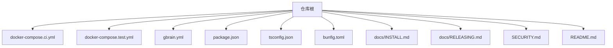
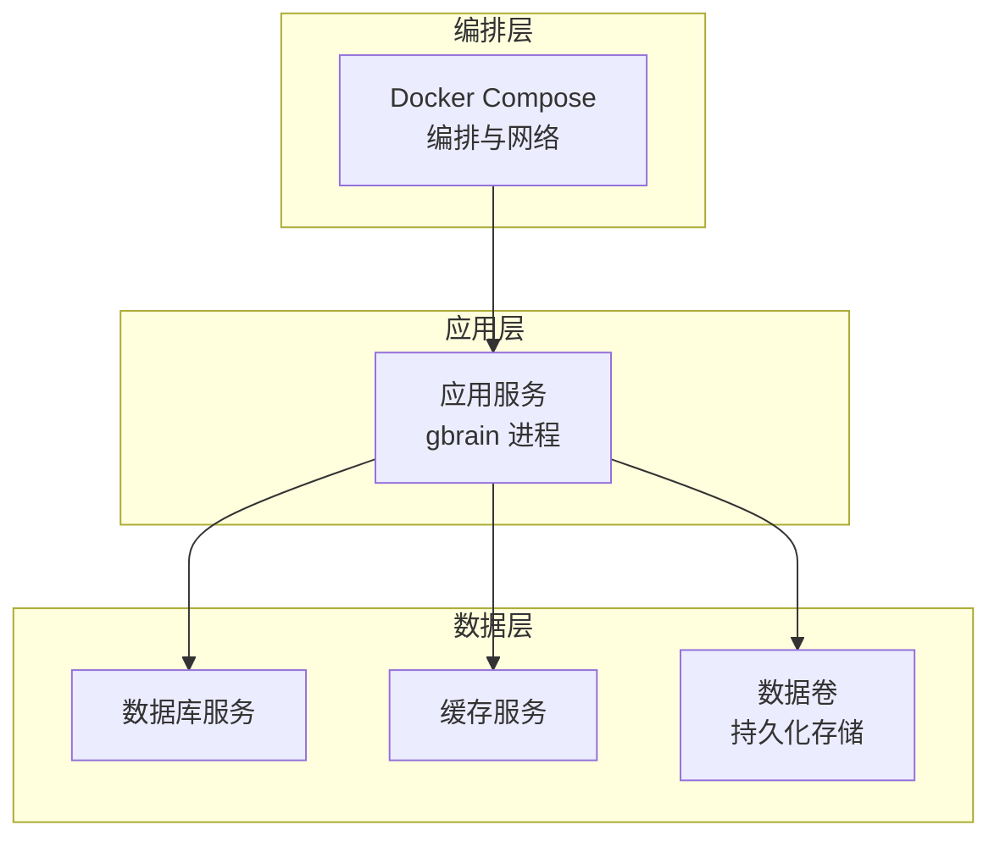
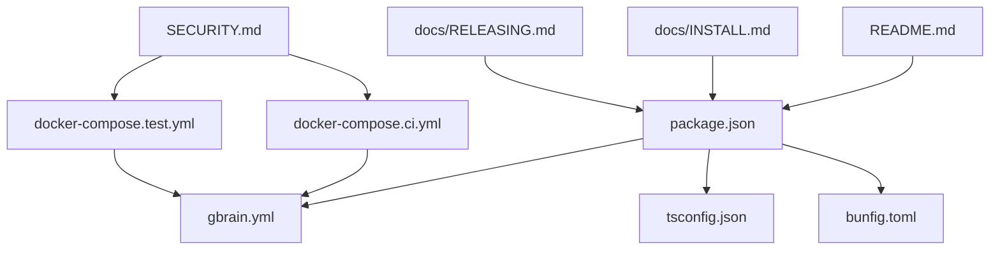

# 容器化部署

<cite>
**本文引用的文件**   
- [docker-compose.ci.yml](file://docker-compose.ci.yml)
- [docker-compose.test.yml](file://docker-compose.test.yml)
- [gbrain.yml](file://gbrain.yml)
- [package.json](file://package.json)
- [tsconfig.json](file://tsconfig.json)
- [bunfig.toml](file://bunfig.toml)
- [README.md](file://README.md)
- [INSTALL.md](file://docs/INSTALL.md)
- [RELEASING.md](file://docs/RELEASING.md)
- [SECURITY.md](file://SECURITY.md)
</cite>

## 目录
1. [简介](#简介)
2. [项目结构](#项目结构)
3. [核心组件](#核心组件)
4. [架构总览](#架构总览)
5. [详细组件分析](#详细组件分析)
6. [依赖分析](#依赖分析)
7. [性能考虑](#性能考虑)
8. [故障排查指南](#故障排查指南)
9. [结论](#结论)
10. [附录](#附录)

## 简介
本指南面向将本项目容器化的工程团队，覆盖镜像构建、多阶段构建优化与镜像安全扫描；基于现有仓库中的 docker-compose 编排文件，说明服务编排、网络配置与数据卷管理；阐述资源限制、健康检查与重启策略；提供日志收集、监控集成与调试技巧；并给出开发、测试与生产环境的差异化配置建议与安全最佳实践（非 root 用户运行、只读文件系统、最小权限原则）。

## 项目结构
仓库中已包含用于 CI 与测试的 docker-compose 配置文件，以及应用主配置与打包元信息。这些文件是容器化落地的重要基础：
- 编排与流水线：docker-compose.ci.yml、docker-compose.test.yml
- 应用配置：gbrain.yml
- 构建与运行时元信息：package.json、tsconfig.json、bunfig.toml
- 安装与发布文档：docs/INSTALL.md、docs/RELEASING.md
- 安全策略：SECURITY.md
- 顶层说明：README.md

图表来源
- [docker-compose.ci.yml](file://docker-compose.ci.yml)
- [docker-compose.test.yml](file://docker-compose.test.yml)
- [gbrain.yml](file://gbrain.yml)
- [package.json](file://package.json)
- [tsconfig.json](file://tsconfig.json)
- [bunfig.toml](file://bunfig.toml)
- [docs/INSTALL.md](file://docs/INSTALL.md)
- [docs/RELEASING.md](file://docs/RELEASING.md)
- [SECURITY.md](file://SECURITY.md)
- [README.md](file://README.md)

章节来源
- [docker-compose.ci.yml](file://docker-compose.ci.yml)
- [docker-compose.test.yml](file://docker-compose.test.yml)
- [gbrain.yml](file://gbrain.yml)
- [package.json](file://package.json)
- [tsconfig.json](file://tsconfig.json)
- [bunfig.toml](file://bunfig.toml)
- [docs/INSTALL.md](file://docs/INSTALL.md)
- [docs/RELEASING.md](file://docs/RELEASING.md)
- [SECURITY.md](file://SECURITY.md)
- [README.md](file://README.md)

## 核心组件
- 编排与流水线
  - CI 编排：docker-compose.ci.yml 定义了 CI 环境下的服务组合与依赖关系，便于在持续集成中拉起必要的基础设施与服务。
  - 测试编排：docker-compose.test.yml 为本地或 CI 测试场景提供服务编排，通常包含数据库、缓存等依赖服务。
- 应用配置
  - gbrain.yml 作为应用主配置，承载运行时参数、功能开关、外部服务连接信息等，是容器化时通过环境变量或挂载文件注入的关键点。
- 构建与运行时元信息
  - package.json 定义脚本命令与依赖，常用于构建产物生成与启动入口。
  - tsconfig.json 控制 TypeScript 编译行为，影响构建产物体积与兼容性。
  - bunfig.toml 指定 Bun 运行时配置，影响包解析、缓存与执行行为。
- 文档与安全
  - docs/INSTALL.md 与 docs/RELEASING.md 提供安装与发布流程参考，有助于对齐容器化构建与发布步骤。
  - SECURITY.md 描述安全策略与漏洞响应流程，指导镜像安全扫描与修复闭环。
  - README.md 提供项目概览与快速上手指引。

章节来源
- [docker-compose.ci.yml](file://docker-compose.ci.yml)
- [docker-compose.test.yml](file://docker-compose.test.yml)
- [gbrain.yml](file://gbrain.yml)
- [package.json](file://package.json)
- [tsconfig.json](file://tsconfig.json)
- [bunfig.toml](file://bunfig.toml)
- [docs/INSTALL.md](file://docs/INSTALL.md)
- [docs/RELEASING.md](file://docs/RELEASING.md)
- [SECURITY.md](file://SECURITY.md)
- [README.md](file://README.md)

## 架构总览
下图展示容器化后的典型服务拓扑：应用服务通过 docker-compose 编排，依赖数据库与缓存等基础设施，统一通过网络进行通信，并通过数据卷持久化关键状态。

图表来源
- [docker-compose.ci.yml](file://docker-compose.ci.yml)
- [docker-compose.test.yml](file://docker-compose.test.yml)
- [gbrain.yml](file://gbrain.yml)

## 详细组件分析

### Docker 镜像构建与多阶段构建优化
- 目标
  - 使用多阶段构建分离依赖安装、编译与运行阶段，减小最终镜像体积。
  - 利用构建缓存提升重复构建速度。
  - 仅将必要产物复制到运行镜像，避免携带源码与工具链。
- 建议实现要点
  - 第一阶段：安装依赖与构建产物（可复用缓存层）。
  - 第二阶段：仅复制构建产物与运行时所需二进制，设置最小基础镜像。
  - 使用 .dockerignore 排除无关文件（如 test、docs、node_modules 等）。
  - 固定依赖版本与锁文件，确保构建可重现。
- 与仓库关联
  - 构建脚本与依赖声明位于 package.json，TypeScript 编译由 tsconfig.json 控制，Bun 运行时配置由 bunfig.toml 提供。
  - 发布流程参考 docs/RELEASING.md，可与镜像打标签策略对齐。

章节来源
- [package.json](file://package.json)
- [tsconfig.json](file://tsconfig.json)
- [bunfig.toml](file://bunfig.toml)
- [docs/RELEASING.md](file://docs/RELEASING.md)

### 镜像安全扫描与修复闭环
- 目标
  - 在 CI 中对镜像进行漏洞扫描，阻断高危漏洞合并。
  - 建立修复与复测流程，形成闭环。
- 建议实现要点
  - 在 CI 流水线中集成镜像扫描工具，输出报告并设置阈值。
  - 对已知漏洞制定修复优先级与 SLA。
  - 定期更新基础镜像与依赖，减少暴露面。
- 与仓库关联
  - 安全策略与流程参考 SECURITY.md。
  - 发布与版本管理参考 docs/RELEASING.md。

章节来源
- [SECURITY.md](file://SECURITY.md)
- [docs/RELEASING.md](file://docs/RELEASING.md)

### docker-compose 服务编排、网络与数据卷
- 服务编排
  - CI 编排：docker-compose.ci.yml 用于在 CI 环境中拉起必要服务，保证构建与测试的可重复性。
  - 测试编排：docker-compose.test.yml 用于本地或 CI 测试，通常包含数据库与缓存等依赖。
- 网络配置
  - 默认桥接网络下，服务间可通过服务名互相访问。
  - 如需跨主机或更复杂拓扑，可自定义网络并绑定端口映射。
- 数据卷管理
  - 使用命名卷或绑定挂载持久化数据库与缓存数据，避免容器重建导致数据丢失。
  - 将敏感配置以只读方式挂载，降低误写风险。
- 与仓库关联
  - 编排文件位置与内容见 docker-compose.ci.yml 与 docker-compose.test.yml。
  - 应用配置通过 gbrain.yml 注入到容器中。

章节来源
- [docker-compose.ci.yml](file://docker-compose.ci.yml)
- [docker-compose.test.yml](file://docker-compose.test.yml)
- [gbrain.yml](file://gbrain.yml)

### 资源限制、健康检查与重启策略
- 资源限制
  - 在编排文件中为各服务设置 CPU 与内存上限，防止单服务占用过多资源。
  - 根据工作负载调整并发与队列大小，避免 OOM。
- 健康检查
  - 为应用与依赖服务配置健康检查端点，结合编排工具自动探测与恢复。
  - 合理设置超时与重试次数，避免误判。
- 重启策略
  - 针对无状态服务采用“失败即重启”的策略。
  - 对有状态服务谨慎使用自动重启，配合优雅退出与数据一致性保障。
- 与仓库关联
  - 健康检查端点与启动命令需与应用入口一致，参考 package.json 中的脚本与 gbrain.yml 的配置项。

章节来源
- [package.json](file://package.json)
- [gbrain.yml](file://gbrain.yml)

### 日志收集、监控集成与调试技巧
- 日志收集
  - 将应用标准输出与错误输出重定向至系统日志驱动，便于集中采集。
  - 结构化日志字段包含请求 ID、服务名、级别与时间戳，便于检索与分析。
- 监控集成
  - 暴露指标端点，接入 Prometheus/Grafana 等监控系统。
  - 对关键业务指标（吞吐、延迟、错误率）与系统指标（CPU、内存、磁盘 IO）进行告警。
- 调试技巧
  - 在开发环境启用详细日志与调试端口，但生产环境关闭调试接口。
  - 使用编排工具查看容器日志与实时跟踪，结合分布式追踪定位问题。
- 与仓库关联
  - 应用启动与配置由 package.json 与 gbrain.yml 控制，日志与监控相关参数应在此处配置。

章节来源
- [package.json](file://package.json)
- [gbrain.yml](file://gbrain.yml)

### 环境差异配置（开发、测试、生产）
- 开发环境
  - 开启热重载与详细日志，禁用严格的安全限制。
  - 使用本地数据卷或临时数据库，便于快速迭代。
- 测试环境
  - 隔离的网络与数据卷，确保测试用例互不干扰。
  - 预置测试数据与种子脚本，保证可重复性。
- 生产环境
  - 最小权限与只读文件系统，严格资源限制与健康检查。
  - 集中日志与监控，灰度发布与回滚策略。
- 与仓库关联
  - 不同环境的配置可通过 gbrain.yml 与环境变量区分，编排文件按环境选择对应 compose 文件。

章节来源
- [gbrain.yml](file://gbrain.yml)
- [docker-compose.ci.yml](file://docker-compose.ci.yml)
- [docker-compose.test.yml](file://docker-compose.test.yml)

### 容器安全最佳实践
- 非 root 用户运行
  - 在运行镜像中创建专用用户并以该用户启动进程，避免使用 root。
- 只读文件系统
  - 将应用目录设为只读，仅挂载必要的可写目录（如日志、缓存），降低被篡改风险。
- 最小权限原则
  - 仅授予容器运行所需的文件系统与网络权限，关闭不必要的 Capabilities。
- 供应链安全
  - 固定基础镜像版本，定期扫描并更新依赖。
  - 在 CI 中集成镜像签名与校验，确保镜像来源可信。
- 与仓库关联
  - 安全策略与流程参考 SECURITY.md，发布流程参考 docs/RELEASING.md。

章节来源
- [SECURITY.md](file://SECURITY.md)
- [docs/RELEASING.md](file://docs/RELEASING.md)

## 依赖分析
- 直接依赖
  - 编排依赖：docker-compose.ci.yml 与 docker-compose.test.yml 定义了服务间的依赖关系与网络拓扑。
  - 应用依赖：package.json 与 tsconfig.json 决定构建产物与运行时行为。
  - 运行时依赖：bunfig.toml 控制 Bun 的行为与缓存策略。
- 间接依赖
  - 文档与流程：docs/INSTALL.md、docs/RELEASING.md、SECURITY.md 与 README.md 影响构建、发布与安全策略。
- 潜在耦合点
  - 应用配置 gbrain.yml 与编排文件的注入方式强耦合，变更时需同步更新。
  - 构建脚本与镜像构建步骤需保持一致，避免产物不一致。

图表来源
- [package.json](file://package.json)
- [tsconfig.json](file://tsconfig.json)
- [bunfig.toml](file://bunfig.toml)
- [gbrain.yml](file://gbrain.yml)
- [docker-compose.ci.yml](file://docker-compose.ci.yml)
- [docker-compose.test.yml](file://docker-compose.test.yml)
- [SECURITY.md](file://SECURITY.md)
- [README.md](file://README.md)
- [docs/INSTALL.md](file://docs/INSTALL.md)
- [docs/RELEASING.md](file://docs/RELEASING.md)

章节来源
- [package.json](file://package.json)
- [tsconfig.json](file://tsconfig.json)
- [bunfig.toml](file://bunfig.toml)
- [gbrain.yml](file://gbrain.yml)
- [docker-compose.ci.yml](file://docker-compose.ci.yml)
- [docker-compose.test.yml](file://docker-compose.test.yml)
- [SECURITY.md](file://SECURITY.md)
- [README.md](file://README.md)
- [docs/INSTALL.md](file://docs/INSTALL.md)
- [docs/RELEASING.md](file://docs/RELEASING.md)

## 性能考虑
- 构建优化
  - 使用多阶段构建与 .dockerignore 减少镜像体积。
  - 固定依赖版本与锁文件，最大化构建缓存命中。
- 运行时优化
  - 合理设置并发与队列大小，避免上下文切换开销过大。
  - 使用只读文件系统与最小权限，减少内核态开销。
- 资源规划
  - 依据压测结果设定 CPU 与内存限制，预留缓冲空间。
  - 对热点路径进行监控与调优，关注 GC 与 I/O 瓶颈。

[本节为通用指导，无需特定文件引用]

## 故障排查指南
- 常见问题
  - 启动失败：检查应用入口与配置项是否正确注入。
  - 健康检查失败：确认健康端点可达且返回正确状态码。
  - 数据丢失：核对数据卷挂载路径与权限。
  - 权限错误：确认非 root 用户与只读文件系统配置。
- 排查步骤
  - 查看容器日志与系统日志，定位错误堆栈。
  - 进入容器内部验证依赖与网络连通性。
  - 逐步缩小范围，隔离问题服务与配置。
- 与仓库关联
  - 应用入口与配置参考 package.json 与 gbrain.yml。
  - 编排与网络参考 docker-compose.ci.yml 与 docker-compose.test.yml。

章节来源
- [package.json](file://package.json)
- [gbrain.yml](file://gbrain.yml)
- [docker-compose.ci.yml](file://docker-compose.ci.yml)
- [docker-compose.test.yml](file://docker-compose.test.yml)

## 结论
通过多阶段构建与镜像安全扫描，结合 docker-compose 的服务编排、网络与数据卷管理，可实现稳定、安全、高效的容器化部署。在生产环境中，遵循非 root 用户运行、只读文件系统与最小权限原则，并完善资源限制、健康检查与重启策略，能够显著提升系统的可靠性与安全性。同时，完善的日志收集、监控集成与调试技巧，有助于快速定位与解决问题。

[本节为总结，无需特定文件引用]

## 附录
- 快速上手
  - 参考 README.md 与 docs/INSTALL.md 了解项目背景与安装流程。
- 发布流程
  - 参考 docs/RELEASING.md 对齐镜像打标签与发布策略。
- 安全策略
  - 参考 SECURITY.md 了解漏洞扫描与修复流程。

章节来源
- [README.md](file://README.md)
- [docs/INSTALL.md](file://docs/INSTALL.md)
- [docs/RELEASING.md](file://docs/RELEASING.md)
- [SECURITY.md](file://SECURITY.md)