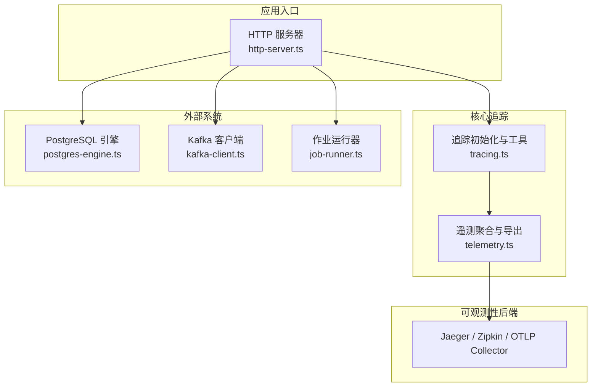
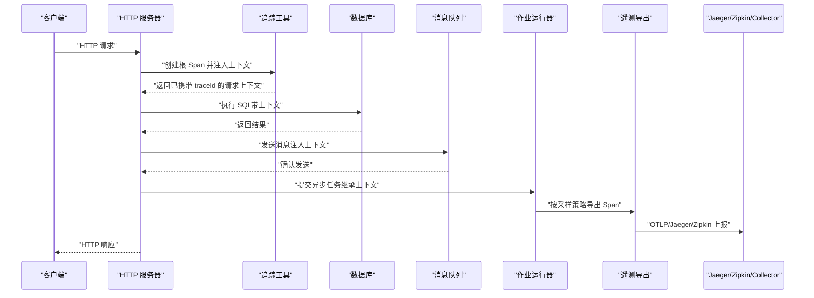
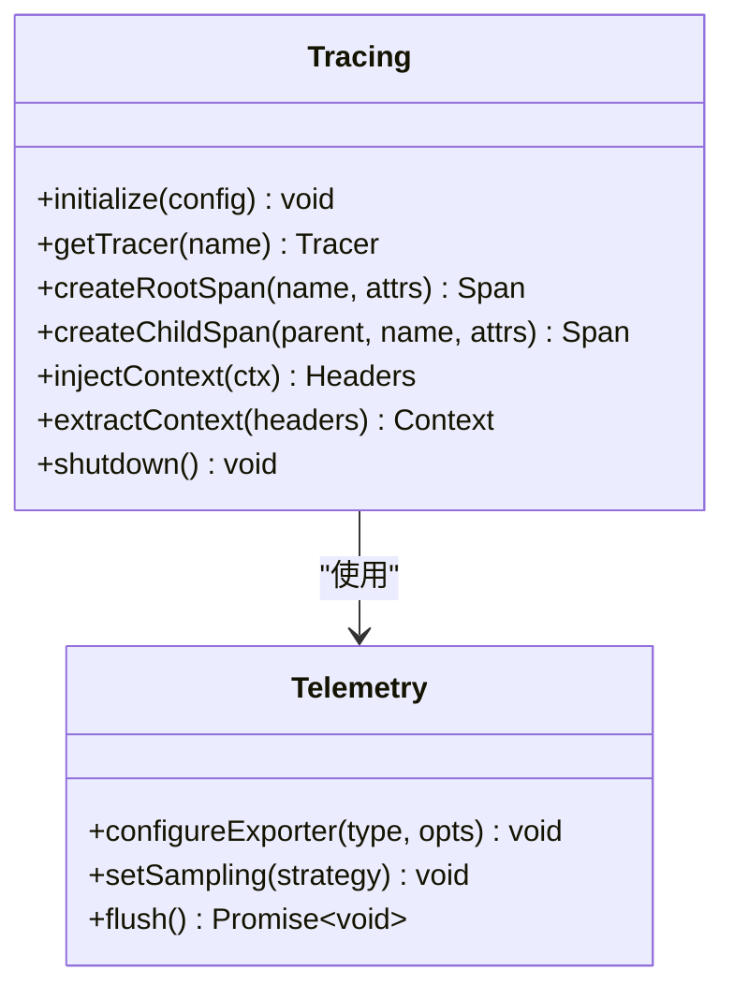
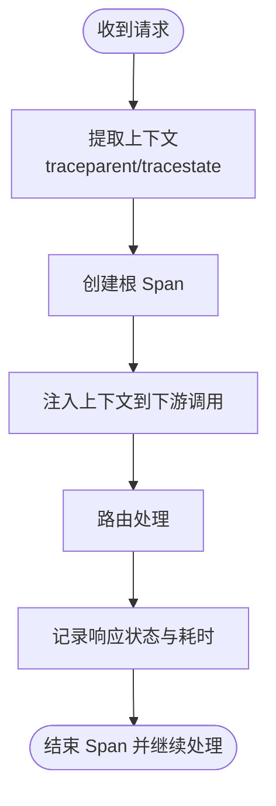
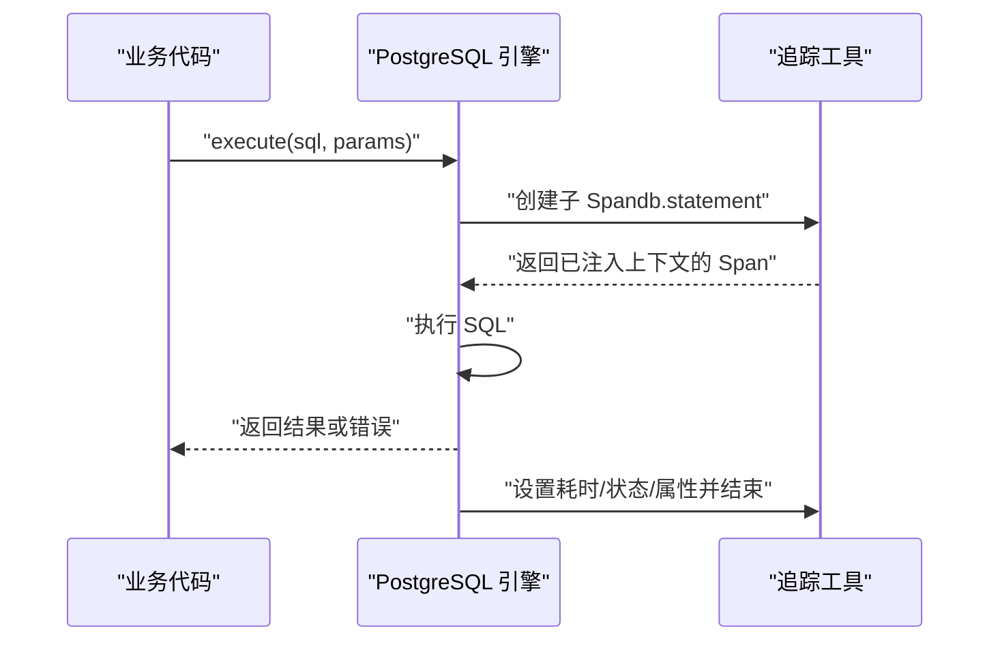
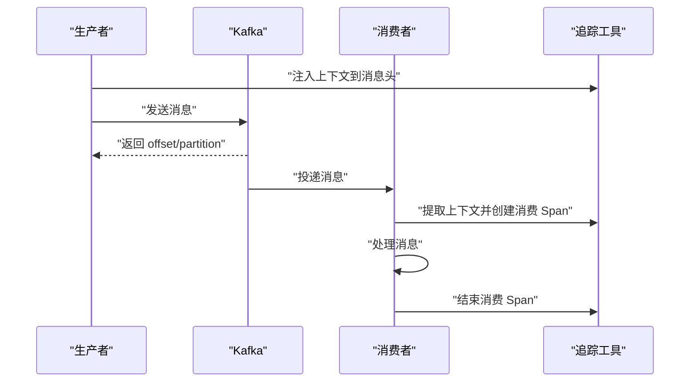
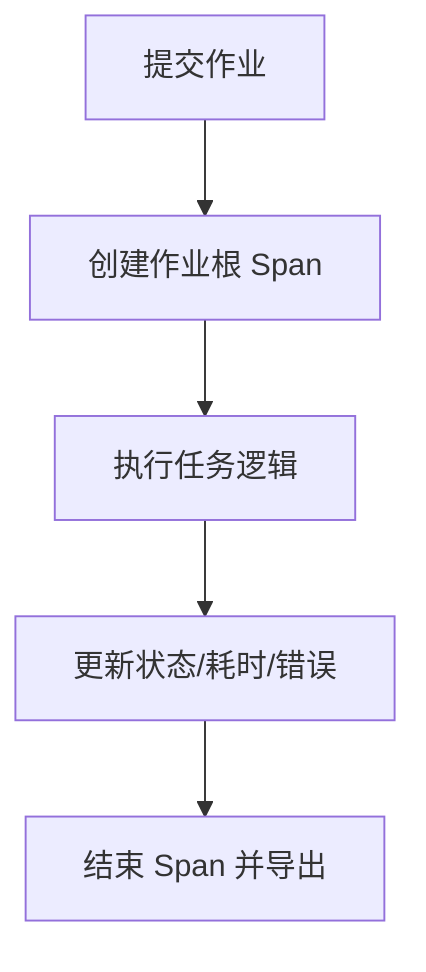
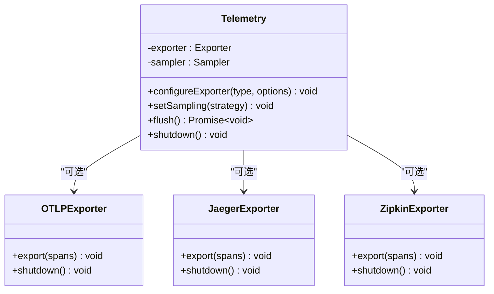
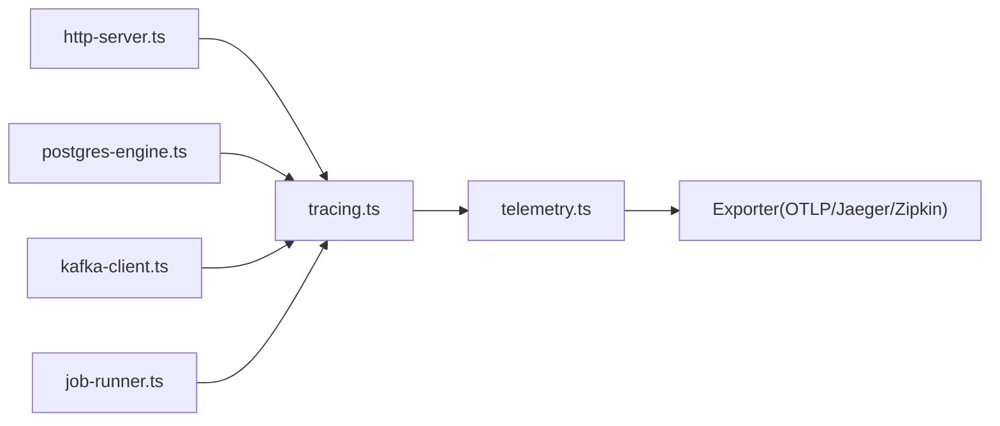

# 分布式追踪

<cite>
**本文引用的文件**   
- [src/core/tracing.ts](file://src/core/tracing.ts)
- [src/core/telemetry.ts](file://src/core/telemetry.ts)
- [src/core/http-server.ts](file://src/core/http-server.ts)
- [src/core/db/postgres-engine.ts](file://src/core/db/postgres-engine.ts)
- [src/core/jobs/job-runner.ts](file://src/core/jobs/job-runner.ts)
- [src/core/messaging/kafka-client.ts](file://src/core/messaging/kafka-client.ts)
- [gbrain.yml](file://gbrain.yml)
</cite>

## 目录
1. [简介](#简介)
2. [项目结构](#项目结构)
3. [核心组件](#核心组件)
4. [架构总览](#架构总览)
5. [详细组件分析](#详细组件分析)
6. [依赖关系分析](#依赖关系分析)
7. [性能考量](#性能考量)
8. [故障排查指南](#故障排查指南)
9. [结论](#结论)
10. [附录](#附录)

## 简介
本文件面向在 gbrain 中实现与扩展分布式追踪的工程师，围绕请求链路追踪、上下文传播、跨服务调用跟踪、OpenTelemetry 集成、采样策略与数据导出配置展开。文档同时覆盖异步任务、消息队列与数据库操作的追踪要点，并给出 Jaeger、Zipkin 等后端集成的实践建议，以及追踪数据模型、Span 关系与依赖图构建方法。最后提供慢请求定位、错误追踪、查询过滤与可视化的操作指引。

## 项目结构
本项目将追踪能力集中在 core 层，并通过 HTTP 中间件、数据库驱动、作业调度器与消息客户端进行横向注入，形成“统一入口、多点埋点、集中导出”的架构。

图表来源
- [src/core/http-server.ts](file://src/core/http-server.ts)
- [src/core/tracing.ts](file://src/core/tracing.ts)
- [src/core/telemetry.ts](file://src/core/telemetry.ts)
- [src/core/db/postgres-engine.ts](file://src/core/db/postgres-engine.ts)
- [src/core/messaging/kafka-client.ts](file://src/core/messaging/kafka-client.ts)
- [src/core/jobs/job-runner.ts](file://src/core/jobs/job-runner.ts)

章节来源
- [src/core/tracing.ts](file://src/core/tracing.ts)
- [src/core/telemetry.ts](file://src/core/telemetry.ts)
- [src/core/http-server.ts](file://src/core/http-server.ts)
- [src/core/db/postgres-engine.ts](file://src/core/db/postgres-engine.ts)
- [src/core/messaging/kafka-client.ts](file://src/core/messaging/kafka-client.ts)
- [src/core/jobs/job-runner.ts](file://src/core/jobs/job-runner.ts)

## 核心组件
- 追踪初始化与工具：负责创建 TracerProvider、设置资源信息（服务名、版本、环境）、注册 SpanProcessor、暴露常用 API（创建根/子 Span、注入/提取上下文）。
- 遥测聚合与导出：封装 Exporter 选择与批量导出策略，处理采样、限流、重试与失败降级。
- HTTP 中间件：为每个入站请求创建根 Span，自动注入/提取 W3C Trace Context，记录请求元数据与响应状态。
- 数据库追踪：对 SQL 执行进行包装，记录语句类型、耗时、影响行数与错误码，避免敏感信息泄露。
- 消息队列追踪：在发送/消费端注入/提取上下文，记录消息键、分区、偏移量等属性。
- 作业运行器追踪：为异步任务创建独立根 Span，支持跨进程/线程的上下文传播。

章节来源
- [src/core/tracing.ts](file://src/core/tracing.ts)
- [src/core/telemetry.ts](file://src/core/telemetry.ts)
- [src/core/http-server.ts](file://src/core/http-server.ts)
- [src/core/db/postgres-engine.ts](file://src/core/db/postgres-engine.ts)
- [src/core/messaging/kafka-client.ts](file://src/core/messaging/kafka-client.ts)
- [src/core/jobs/job-runner.ts](file://src/core/jobs/job-runner.ts)

## 架构总览
下图展示从请求进入、跨组件调用到最终导出的完整链路，强调上下文传播与采样控制。

图表来源
- [src/core/http-server.ts](file://src/core/http-server.ts)
- [src/core/tracing.ts](file://src/core/tracing.ts)
- [src/core/db/postgres-engine.ts](file://src/core/db/postgres-engine.ts)
- [src/core/messaging/kafka-client.ts](file://src/core/messaging/kafka-client.ts)
- [src/core/jobs/job-runner.ts](file://src/core/jobs/job-runner.ts)
- [src/core/telemetry.ts](file://src/core/telemetry.ts)

## 详细组件分析

### 组件一：追踪初始化与工具（tracing.ts）
职责
- 初始化 TracerProvider、Sampler、Resource、SpanProcessor。
- 暴露 createRootSpan、createChildSpan、injectContext、extractContext 等便捷方法。
- 管理全局单例，确保多模块复用同一追踪实例。

关键设计
- 资源标签：service.name、service.version、deployment.environment、host.name 等。
- 采样策略：基于头部采样率、恒采样、概率采样与动态调整。
- 错误标记：捕获异常并设置 Span 状态为 Error，附加 error.type、error.message。

图表来源
- [src/core/tracing.ts](file://src/core/tracing.ts)
- [src/core/telemetry.ts](file://src/core/telemetry.ts)

章节来源
- [src/core/tracing.ts](file://src/core/tracing.ts)
- [src/core/telemetry.ts](file://src/core/telemetry.ts)

### 组件二：HTTP 中间件（http-server.ts）
职责
- 为每个请求创建根 Span，记录 method、path、headers、client IP、user agent。
- 自动注入/提取 W3C Trace Context，保证跨服务链路连续。
- 记录响应状态码、耗时、错误堆栈摘要。

流程

图表来源
- [src/core/http-server.ts](file://src/core/http-server.ts)
- [src/core/tracing.ts](file://src/core/tracing.ts)

章节来源
- [src/core/http-server.ts](file://src/core/http-server.ts)
- [src/core/tracing.ts](file://src/core/tracing.ts)

### 组件三：数据库操作追踪（postgres-engine.ts）
职责
- 包装连接与查询执行，生成 db.statement 类型的 Span。
- 记录 SQL 类别（SELECT/INSERT/UPDATE/DELETE）、表名、影响行数、错误码。
- 脱敏处理：不记录明文参数，仅保留结构化元数据。

图表来源
- [src/core/db/postgres-engine.ts](file://src/core/db/postgres-engine.ts)
- [src/core/tracing.ts](file://src/core/tracing.ts)

章节来源
- [src/core/db/postgres-engine.ts](file://src/core/db/postgres-engine.ts)
- [src/core/tracing.ts](file://src/core/tracing.ts)

### 组件四：消息队列追踪（kafka-client.ts）
职责
- 在发送端注入上下文到消息头，记录 topic、partition、offset、key。
- 在消费端提取上下文，创建消费者 Span，关联生产者与消费者链路。
- 记录消息大小、序列化格式、重试次数与错误原因。

图表来源
- [src/core/messaging/kafka-client.ts](file://src/core/messaging/kafka-client.ts)
- [src/core/tracing.ts](file://src/core/tracing.ts)

章节来源
- [src/core/messaging/kafka-client.ts](file://src/core/messaging/kafka-client.ts)
- [src/core/tracing.ts](file://src/core/tracing.ts)

### 组件五：异步任务追踪（job-runner.ts）
职责
- 为每个作业创建根 Span，支持跨进程/线程传播上下文。
- 记录作业 ID、类型、重试次数、超时与失败原因。
- 与 HTTP/消息链路合并，形成端到端视图。

图表来源
- [src/core/jobs/job-runner.ts](file://src/core/jobs/job-runner.ts)
- [src/core/tracing.ts](file://src/core/tracing.ts)

章节来源
- [src/core/jobs/job-runner.ts](file://src/core/jobs/job-runner.ts)
- [src/core/tracing.ts](file://src/core/tracing.ts)

### 组件六：遥测导出与采样（telemetry.ts）
职责
- 配置 Exporter（OTLP/Jaeger/Zipkin），设置批量大小、超时、重试。
- 实现采样策略：固定比例、头部采样、动态采样（基于错误率/延迟分位）。
- 提供 flush 接口，保障优雅关闭时数据不丢失。

图表来源
- [src/core/telemetry.ts](file://src/core/telemetry.ts)

章节来源
- [src/core/telemetry.ts](file://src/core/telemetry.ts)

## 依赖关系分析
- 低耦合：各子系统通过 tracing.ts 提供的 API 接入，避免直接依赖具体 Exporter。
- 高内聚：telemetry.ts 集中管理导出与采样，便于统一开关与调优。
- 外部依赖：HTTP、DB、MQ、作业系统作为被追踪方，不反向依赖追踪模块。

图表来源
- [src/core/tracing.ts](file://src/core/tracing.ts)
- [src/core/telemetry.ts](file://src/core/telemetry.ts)
- [src/core/http-server.ts](file://src/core/http-server.ts)
- [src/core/db/postgres-engine.ts](file://src/core/db/postgres-engine.ts)
- [src/core/messaging/kafka-client.ts](file://src/core/messaging/kafka-client.ts)
- [src/core/jobs/job-runner.ts](file://src/core/jobs/job-runner.ts)

章节来源
- [src/core/tracing.ts](file://src/core/tracing.ts)
- [src/core/telemetry.ts](file://src/core/telemetry.ts)
- [src/core/http-server.ts](file://src/core/http-server.ts)
- [src/core/db/postgres-engine.ts](file://src/core/db/postgres-engine.ts)
- [src/core/messaging/kafka-client.ts](file://src/core/messaging/kafka-client.ts)
- [src/core/jobs/job-runner.ts](file://src/core/jobs/job-runner.ts)

## 性能考量
- 采样优先：在高吞吐场景下启用概率采样或头部采样，降低导出压力。
- 批量导出：合理设置 batch size 与 flush interval，平衡实时性与开销。
- 属性精简：仅记录必要标签，避免大对象或敏感字段进入 Span。
- 异步隔离：作业与消息处理使用独立根 Span，避免长尾阻塞主链路。
- 错误快速失败：对导出失败采用退避与降级，不影响主业务。

[本节为通用指导，无需源码引用]

## 故障排查指南
- 无法看到链路：检查是否启用了正确的采样策略与 Exporter；确认 traceparent 头是否正确传递。
- 数据缺失：确认 HTTP/DB/MQ/作业各层的注入/提取是否生效；验证 flush 是否在优雅关闭前调用。
- 性能抖动：降低采样率或减少 Span 数量；检查是否有重复埋点或循环依赖导致无限嵌套。
- 错误未标记：确保异常路径设置了 Span 状态为 Error，并附带 error.type 与 error.message。

章节来源
- [src/core/tracing.ts](file://src/core/tracing.ts)
- [src/core/telemetry.ts](file://src/core/telemetry.ts)
- [src/core/http-server.ts](file://src/core/http-server.ts)
- [src/core/db/postgres-engine.ts](file://src/core/db/postgres-engine.ts)
- [src/core/messaging/kafka-client.ts](file://src/core/messaging/kafka-client.ts)
- [src/core/jobs/job-runner.ts](file://src/core/jobs/job-runner.ts)

## 结论
通过在核心层统一初始化与导出，并在 HTTP、数据库、消息与作业系统中横向注入，gbrain 实现了端到端的分布式追踪。结合合理的采样与导出策略，可在保证可观测性的同时控制开销。后续可按需扩展更多子系统埋点，并完善可视化与告警联动。

[本节为总结，无需源码引用]

## 附录

### OpenTelemetry 集成与采样策略
- 初始化 TracerProvider 与 Resource，设置服务标识与环境信息。
- 选择 Sampler：固定比例、头部采样、动态采样（基于错误率/延迟分位）。
- 注册 SpanProcessor 与 Exporter（OTLP/Jaeger/Zipkin），配置批量大小与超时。
- 在应用启动时完成初始化，在退出前调用 flush/shutdown。

章节来源
- [src/core/tracing.ts](file://src/core/tracing.ts)
- [src/core/telemetry.ts](file://src/core/telemetry.ts)

### 数据导出配置
- OTLP：指定 endpoint、headers、压缩方式与重试策略。
- Jaeger：配置 host/port 或 Agent 地址，设置服务名与采样率。
- Zipkin：配置 URL、编码格式与批次大小。
- 环境变量：通过配置文件集中管理，便于不同环境切换。

章节来源
- [gbrain.yml](file://gbrain.yml)
- [src/core/telemetry.ts](file://src/core/telemetry.ts)

### 追踪数据模型与 Span 关系
- 根 Span：HTTP 请求、作业任务、外部事件触发。
- 子 Span：数据库调用、消息发送/消费、内部函数调用。
- 父子关系：通过 parentSpanId 建立层级，traceId 贯穿全链路。
- 依赖图：以 service 为节点，Span 类型为边，统计调用频次与耗时。

章节来源
- [src/core/tracing.ts](file://src/core/tracing.ts)
- [src/core/telemetry.ts](file://src/core/telemetry.ts)

### 慢请求分析与错误追踪
- 慢请求：按 p95/p99 延迟筛选，查看热点 Span 与下游瓶颈。
- 错误追踪：过滤 error.status=Error，查看堆栈与错误分类。
- 根因定位：沿 traceId 向下钻取，识别最慢子 Span 与异常分支。

章节来源
- [src/core/http-server.ts](file://src/core/http-server.ts)
- [src/core/tracing.ts](file://src/core/tracing.ts)

### 追踪数据查询、过滤与可视化
- 查询：按 service.name、span.kind、status.code、duration_ms 过滤。
- 过滤：按 path、method、error.type、tag 组合条件。
- 可视化：在 Jaeger/Zipkin 界面查看火焰图、瀑布图与服务依赖拓扑。

章节来源
- [src/core/telemetry.ts](file://src/core/telemetry.ts)