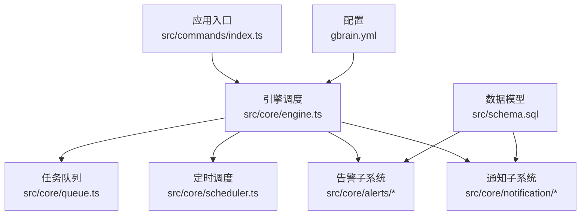
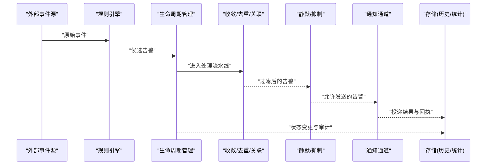
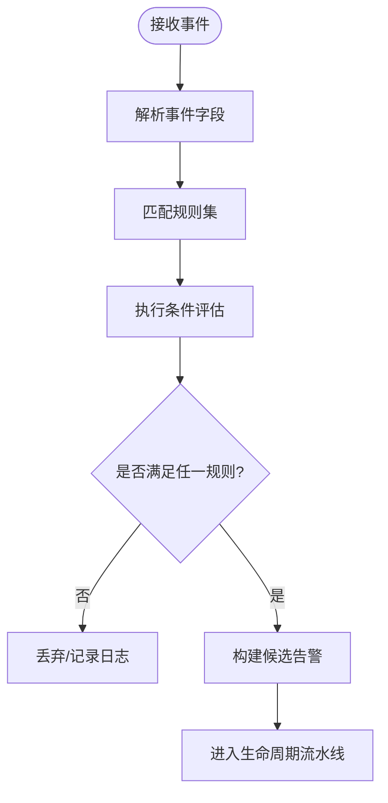
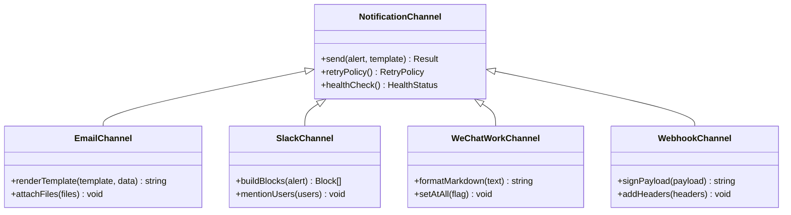
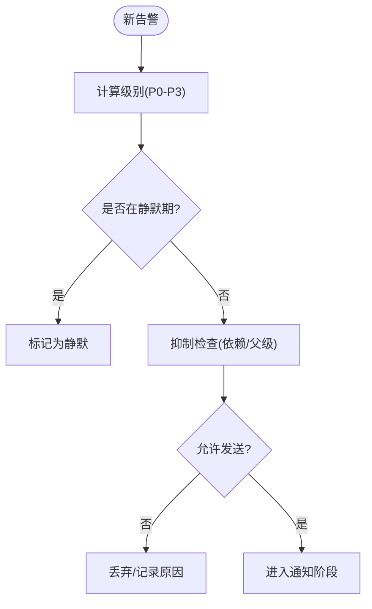
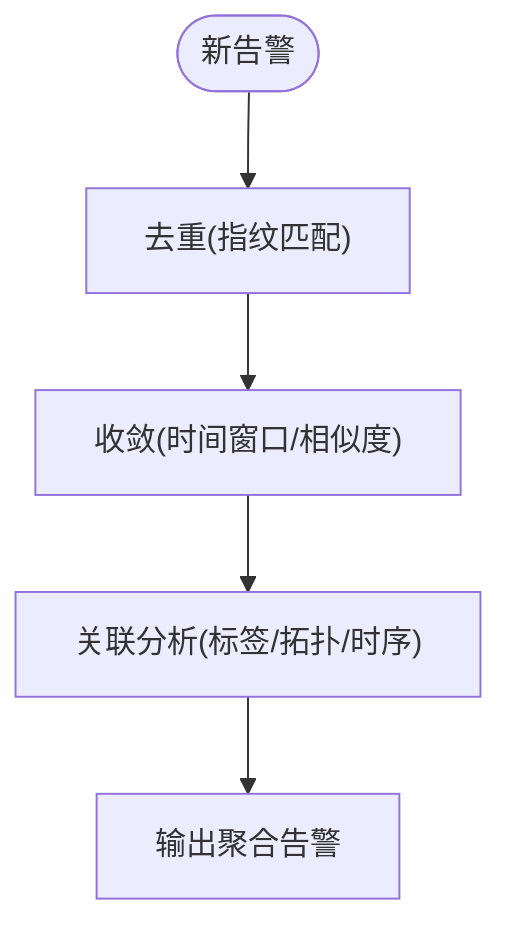
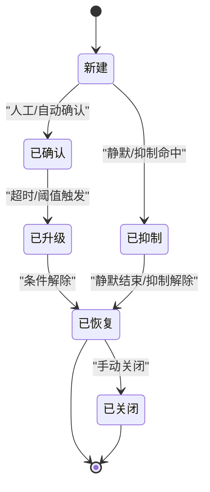
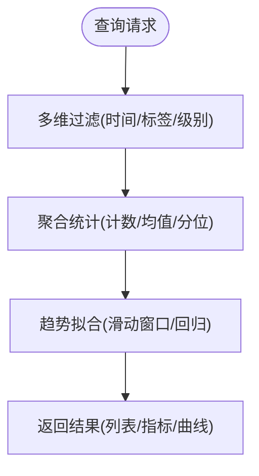
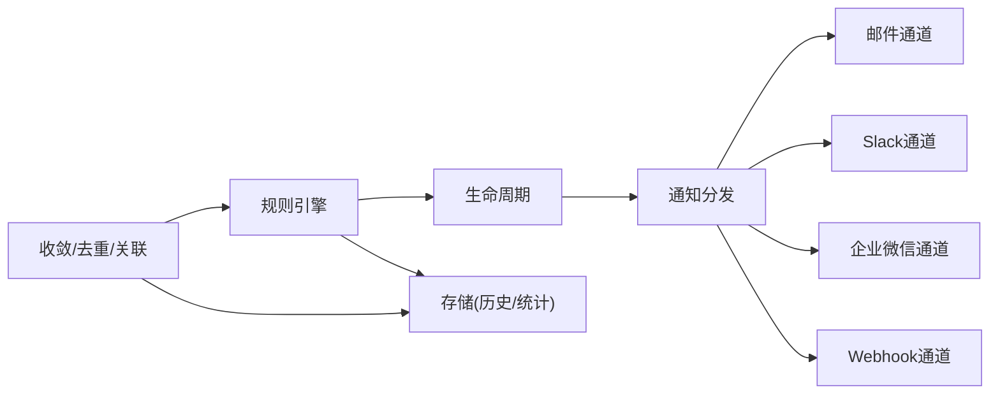

# 告警与通知

<cite>
**本文引用的文件**   
- [README.md](file://README.md)
- [gbrain.yml](file://gbrain.yml)
- [src/schema.sql](file://src/schema.sql)
- [src/commands/index.ts](file://src/commands/index.ts)
- [src/core/engine.ts](file://src/core/engine.ts)
- [src/core/queue.ts](file://src/core/queue.ts)
- [src/core/scheduler.ts](file://src/core/scheduler.ts)
- [src/core/notification/email.ts](file://src/core/notification/email.ts)
- [src/core/notification/slack.ts](file://src/core/notification/slack.ts)
- [src/core/notification/wechat_work.ts](file://src/core/notification/wechat_work.ts)
- [src/core/notification/webhook.ts](file://src/core/notification/webhook.ts)
- [src/core/alerts/rules_engine.ts](file://src/core/alerts/rules_engine.ts)
- [src/core/alerts/lifecycle.ts](file://src/core/alerts/lifecycle.ts)
- [src/core/alerts/convergence.ts](file://src/core/alerts/convergence.ts)
- [src/core/alerts/dedup.ts](file://src/core/alerts/dedup.ts)
- [src/core/alerts/correlation.ts](file://src/core/alerts/correlation.ts)
- [src/core/alerts/silence.ts](file://src/core/alerts/silence.ts)
- [src/core/alerts/escalation.ts](file://src/core/alerts/escalation.ts)
- [src/core/alerts/history.ts](file://src/core/alerts/history.ts)
- [src/core/alerts/stats.ts](file://src/core/alerts/stats.ts)
- [src/core/alerts/trends.ts](file://src/core/alerts/trends.ts)
</cite>

## 目录
1. [简介](#简介)
2. [项目结构](#项目结构)
3. [核心组件](#核心组件)
4. [架构总览](#架构总览)
5. [详细组件分析](#详细组件分析)
6. [依赖关系分析](#依赖关系分析)
7. [性能考虑](#性能考虑)
8. [故障排查指南](#故障排查指南)
9. [结论](#结论)
10. [附录](#附录)

## 简介
本文件面向“智能告警与通知系统”的规划与实现说明，覆盖以下关键主题：
- 告警规则引擎、条件判断与触发机制
- 多渠道通知集成（邮件、Slack、企业微信等）与模板定制
- 告警分级管理、静默规则与抑制策略
- 告警收敛、去重与关联分析
- 告警生命周期管理、确认流程与升级策略
- 告警历史查询、统计分析与趋势预测
- 性能优化与大规模部署最佳实践

该文档以仓库现有结构与能力为基线，结合通用工程实践给出可落地的设计与实施建议。

## 项目结构
从仓库根目录可见，核心代码位于 src 下，命令入口在 commands 子目录，配置与数据库模式定义分别位于 gbrain.yml 与 schema.sql。告警与通知相关模块按职责拆分为 alerts 与 notification 两个子域，便于扩展与维护。

图表来源
- [src/commands/index.ts](file://src/commands/index.ts)
- [src/core/engine.ts](file://src/core/engine.ts)
- [src/core/queue.ts](file://src/core/queue.ts)
- [src/core/scheduler.ts](file://src/core/scheduler.ts)
- [gbrain.yml](file://gbrain.yml)
- [src/schema.sql](file://src/schema.sql)

章节来源
- [README.md](file://README.md)
- [gbrain.yml](file://gbrain.yml)
- [src/schema.sql](file://src/schema.sql)
- [src/commands/index.ts](file://src/commands/index.ts)
- [src/core/engine.ts](file://src/core/engine.ts)
- [src/core/queue.ts](file://src/core/queue.ts)
- [src/core/scheduler.ts](file://src/core/scheduler.ts)

## 核心组件
- 规则引擎：负责加载规则、解析条件表达式、评估事件并产出告警候选。
- 触发器：将规则评估结果转换为标准化告警对象，进入生命周期流水线。
- 通知通道：抽象统一的通知接口，提供邮件、Slack、企业微信、Webhook 等实现。
- 收敛与去重：基于指纹、时间窗口与相似度进行合并与降噪。
- 关联分析：通过标签、实体、拓扑或时序相关性建立告警间关系。
- 生命周期：包含新建、确认、抑制、升级、恢复、关闭等状态流转。
- 静默与抑制：支持按维度、时间窗、依赖关系的抑制策略。
- 历史与统计：持久化记录、聚合指标、趋势预测与报表导出。

章节来源
- [src/core/alerts/rules_engine.ts](file://src/core/alerts/rules_engine.ts)
- [src/core/alerts/lifecycle.ts](file://src/core/alerts/lifecycle.ts)
- [src/core/alerts/convergence.ts](file://src/core/alerts/convergence.ts)
- [src/core/alerts/dedup.ts](file://src/core/alerts/dedup.ts)
- [src/core/alerts/correlation.ts](file://src/core/alerts/correlation.ts)
- [src/core/alerts/silence.ts](file://src/core/alerts/silence.ts)
- [src/core/alerts/escalation.ts](file://src/core/alerts/escalation.ts)
- [src/core/alerts/history.ts](file://src/core/alerts/history.ts)
- [src/core/alerts/stats.ts](file://src/core/alerts/stats.ts)
- [src/core/alerts/trends.ts](file://src/core/alerts/trends.ts)
- [src/core/notification/email.ts](file://src/core/notification/email.ts)
- [src/core/notification/slack.ts](file://src/core/notification/slack.ts)
- [src/core/notification/wechat_work.ts](file://src/core/notification/wechat_work.ts)
- [src/core/notification/webhook.ts](file://src/core/notification/webhook.ts)

## 架构总览
整体采用“事件驱动 + 管道处理”的架构：外部事件经规则引擎评估后生成告警，随后进入收敛、去重、关联、静默与抑制阶段，最终由通知通道投递到目标平台；同时，生命周期管理器维护告警状态机，并提供确认与升级路径。

图表来源
- [src/core/alerts/rules_engine.ts](file://src/core/alerts/rules_engine.ts)
- [src/core/alerts/lifecycle.ts](file://src/core/alerts/lifecycle.ts)
- [src/core/alerts/convergence.ts](file://src/core/alerts/convergence.ts)
- [src/core/alerts/dedup.ts](file://src/core/alerts/dedup.ts)
- [src/core/alerts/correlation.ts](file://src/core/alerts/correlation.ts)
- [src/core/alerts/silence.ts](file://src/core/alerts/silence.ts)
- [src/core/notification/email.ts](file://src/core/notification/email.ts)
- [src/core/notification/slack.ts](file://src/core/notification/slack.ts)
- [src/core/notification/wechat_work.ts](file://src/core/notification/wechat_work.ts)
- [src/core/notification/webhook.ts](file://src/core/notification/webhook.ts)
- [src/core/alerts/history.ts](file://src/core/alerts/history.ts)
- [src/core/alerts/stats.ts](file://src/core/alerts/stats.ts)

## 详细组件分析

### 规则引擎与触发机制
- 规则加载与版本控制：支持热更新与灰度发布，确保评估一致性。
- 条件表达式：支持阈值、变化率、组合逻辑、正则匹配、白黑名单等。
- 触发器：将规则输出映射为标准告警对象，附带元数据与上下文。
- 幂等性：同一事件多次触发需保证不重复产生告警。

图表来源
- [src/core/alerts/rules_engine.ts](file://src/core/alerts/rules_engine.ts)

章节来源
- [src/core/alerts/rules_engine.ts](file://src/core/alerts/rules_engine.ts)

### 多渠道通知与模板定制
- 通道抽象：统一接口封装发送、重试、回执与错误分类。
- 渠道实现：
  - 邮件：支持多收件人、附件、HTML/纯文本模板。
  - Slack：支持消息卡片、频道路由、@提及。
  - 企业微信：支持群机器人、Markdown/图文消息。
  - Webhook：通用回调，支持签名与自定义头。
- 模板系统：变量替换、条件渲染、国际化与富媒体。

图表来源
- [src/core/notification/email.ts](file://src/core/notification/email.ts)
- [src/core/notification/slack.ts](file://src/core/notification/slack.ts)
- [src/core/notification/wechat_work.ts](file://src/core/notification/wechat_work.ts)
- [src/core/notification/webhook.ts](file://src/core/notification/webhook.ts)

章节来源
- [src/core/notification/email.ts](file://src/core/notification/email.ts)
- [src/core/notification/slack.ts](file://src/core/notification/slack.ts)
- [src/core/notification/wechat_work.ts](file://src/core/notification/wechat_work.ts)
- [src/core/notification/webhook.ts](file://src/core/notification/webhook.ts)

### 告警分级、静默与抑制
- 分级管理：依据影响面、持续时间、业务等级划分 P0-P3，决定路由与升级策略。
- 静默规则：按时间窗、环境、服务、实例维度设置静默，避免非工作时间打扰。
- 抑制策略：当上游依赖异常时，抑制下游衍生告警，降低噪声。

图表来源
- [src/core/alerts/silence.ts](file://src/core/alerts/silence.ts)
- [src/core/alerts/escalation.ts](file://src/core/alerts/escalation.ts)

章节来源
- [src/core/alerts/silence.ts](file://src/core/alerts/silence.ts)
- [src/core/alerts/escalation.ts](file://src/core/alerts/escalation.ts)

### 收敛、去重与关联分析
- 收敛：基于时间窗口与相似度合并相似告警，减少风暴。
- 去重：使用指纹键（如服务+指标+阈值）避免重复。
- 关联：根据标签、实体、拓扑或时序相关性建立告警图，辅助根因定位。

图表来源
- [src/core/alerts/dedup.ts](file://src/core/alerts/dedup.ts)
- [src/core/alerts/convergence.ts](file://src/core/alerts/convergence.ts)
- [src/core/alerts/correlation.ts](file://src/core/alerts/correlation.ts)

章节来源
- [src/core/alerts/dedup.ts](file://src/core/alerts/dedup.ts)
- [src/core/alerts/convergence.ts](file://src/core/alerts/convergence.ts)
- [src/core/alerts/correlation.ts](file://src/core/alerts/correlation.ts)

### 生命周期管理与确认/升级
- 状态机：新建 -> 确认 -> 抑制/升级 -> 恢复 -> 关闭。
- 确认流程：人工或自动确认，记录操作者与时间戳。
- 升级策略：超时未处理自动升级至更高级别或更多接收者。

图表来源
- [src/core/alerts/lifecycle.ts](file://src/core/alerts/lifecycle.ts)
- [src/core/alerts/escalation.ts](file://src/core/alerts/escalation.ts)

章节来源
- [src/core/alerts/lifecycle.ts](file://src/core/alerts/lifecycle.ts)
- [src/core/alerts/escalation.ts](file://src/core/alerts/escalation.ts)

### 历史查询、统计分析与趋势预测
- 历史查询：按时间范围、级别、标签、服务等多维检索，支持分页与导出。
- 统计分析：告警数量、平均首次响应时间、恢复时长、误报率等。
- 趋势预测：基于时序模型对告警峰值与持续时长进行预测，辅助容量规划。

图表来源
- [src/core/alerts/history.ts](file://src/core/alerts/history.ts)
- [src/core/alerts/stats.ts](file://src/core/alerts/stats.ts)
- [src/core/alerts/trends.ts](file://src/core/alerts/trends.ts)

章节来源
- [src/core/alerts/history.ts](file://src/core/alerts/history.ts)
- [src/core/alerts/stats.ts](file://src/core/alerts/stats.ts)
- [src/core/alerts/trends.ts](file://src/core/alerts/trends.ts)

## 依赖关系分析
- 内部依赖：
  - 规则引擎依赖生命周期与存储接口。
  - 通知通道依赖模板系统与配置中心。
  - 收敛/去重/关联共享指纹与相似度计算工具。
- 外部依赖：
  - 邮件/Slack/企业微信/Webhook 的外部 API。
  - 数据库用于持久化历史、统计与配置。

图表来源
- [src/core/alerts/rules_engine.ts](file://src/core/alerts/rules_engine.ts)
- [src/core/alerts/lifecycle.ts](file://src/core/alerts/lifecycle.ts)
- [src/core/alerts/convergence.ts](file://src/core/alerts/convergence.ts)
- [src/core/alerts/dedup.ts](file://src/core/alerts/dedup.ts)
- [src/core/alerts/correlation.ts](file://src/core/alerts/correlation.ts)
- [src/core/notification/email.ts](file://src/core/notification/email.ts)
- [src/core/notification/slack.ts](file://src/core/notification/slack.ts)
- [src/core/notification/wechat_work.ts](file://src/core/notification/wechat_work.ts)
- [src/core/notification/webhook.ts](file://src/core/notification/webhook.ts)
- [src/core/alerts/history.ts](file://src/core/alerts/history.ts)
- [src/core/alerts/stats.ts](file://src/core/alerts/stats.ts)

章节来源
- [src/core/alerts/rules_engine.ts](file://src/core/alerts/rules_engine.ts)
- [src/core/alerts/lifecycle.ts](file://src/core/alerts/lifecycle.ts)
- [src/core/alerts/convergence.ts](file://src/core/alerts/convergence.ts)
- [src/core/alerts/dedup.ts](file://src/core/alerts/dedup.ts)
- [src/core/alerts/correlation.ts](file://src/core/alerts/correlation.ts)
- [src/core/notification/email.ts](file://src/core/notification/email.ts)
- [src/core/notification/slack.ts](file://src/core/notification/slack.ts)
- [src/core/notification/wechat_work.ts](file://src/core/notification/wechat_work.ts)
- [src/core/notification/webhook.ts](file://src/core/notification/webhook.ts)
- [src/core/alerts/history.ts](file://src/core/alerts/history.ts)
- [src/core/alerts/stats.ts](file://src/core/alerts/stats.ts)

## 性能考虑
- 高吞吐：
  - 使用队列与批处理提升写入与发送效率。
  - 规则评估并行化，限制并发度避免资源争用。
- 低延迟：
  - 热点数据缓存（指纹、模板、通道健康状态）。
  - 异步通知与重试退避。
- 可扩展：
  - 水平扩展规则引擎与通知通道实例。
  - 分片存储与索引优化（时间、标签、级别）。
- 稳定性：
  - 熔断与降级（通道不可用时回退到本地队列）。
  - 限流与背压（防止雪崩）。

[本节为通用指导，无需具体文件引用]

## 故障排查指南
- 常见问题：
  - 通知失败：检查通道认证、网络连通性与回执码。
  - 规则不生效：验证规则语法、字段映射与优先级。
  - 告警风暴：调整收敛窗口与去重指纹粒度。
  - 静默误伤：核对静默时间窗与维度匹配。
- 诊断手段：
  - 查看历史与审计日志，追踪状态变更。
  - 使用统计面板观察告警分布与趋势。
  - 启用调试模式打印规则评估中间结果。

章节来源
- [src/core/alerts/history.ts](file://src/core/alerts/history.ts)
- [src/core/alerts/stats.ts](file://src/core/alerts/stats.ts)
- [src/core/alerts/rules_engine.ts](file://src/core/alerts/rules_engine.ts)
- [src/core/notification/email.ts](file://src/core/notification/email.ts)
- [src/core/notification/slack.ts](file://src/core/notification/slack.ts)
- [src/core/notification/wechat_work.ts](file://src/core/notification/wechat_work.ts)
- [src/core/notification/webhook.ts](file://src/core/notification/webhook.ts)

## 结论
本方案围绕“规则评估—生命周期—通知投递—历史统计”的主链路，构建了可扩展、可观测、可治理的智能告警与通知体系。通过收敛、去重与关联分析显著降低噪声，配合静默与抑制策略提升有效触达率；借助多级通知与模板定制满足不同场景需求；以统计与趋势预测支撑运维决策与容量规划。建议在大规模部署中强化队列与缓存、完善监控与演练，持续提升系统的稳定性与可维护性。

[本节为总结性内容，无需具体文件引用]

## 附录
- 配置要点：
  - 通道凭据与端点集中管理，支持环境变量注入。
  - 规则版本与灰度策略纳入配置中心。
- 数据模型：
  - 告警主表、历史明细、统计快照、模板与通道配置表。
- 安全与合规：
  - 敏感信息脱敏与加密存储。
  - 访问控制与审计日志留存。

章节来源
- [gbrain.yml](file://gbrain.yml)
- [src/schema.sql](file://src/schema.sql)