# 指标收集与监控

<cite>
**本文引用的文件**   
- [README.md](file://README.md)
- [gbrain.yml](file://gbrain.yml)
- [src/cli.ts](file://src/cli.ts)
- [src/version.ts](file://src/version.ts)
- [admin/src/index.tsx](file://admin/src/index.tsx)
- [scripts/generate-metric-glossary.ts](file://scripts/generate-metric-glossary.ts)
- [test/metric-glossary.test.ts](file://test/metric-glossary.test.ts)
- [docs/operations/monitoring-guide.md](file://docs/operations/monitoring-guide.md)
- [docs/architecture/system-overview.md](file://docs/architecture/system-overview.md)
- [docs/designs/health-check-design.md](file://docs/designs/health-check-design.md)
- [docs/guides/prometheus-integration.md](file://docs/guides/prometheus-integration.md)
- [docs/guides/alerting-rules.md](file://docs/guides/alerting-rules.md)
- [docs/guides/dashboard-principles.md](file://docs/guides/dashboard-principles.md)
- [docs/guides/storage-capacity-planning.md](file://docs/guides/storage-capacity-planning.md)
</cite>

## 目录
1. [简介](#简介)
2. [项目结构](#项目结构)
3. [核心组件](#核心组件)
4. [架构总览](#架构总览)
5. [详细组件分析](#详细组件分析)
6. [依赖分析](#依赖分析)
7. [性能考虑](#性能考虑)
8. [故障排查指南](#故障排查指南)
9. [结论](#结论)
10. [附录](#附录)

## 简介
本文件面向工程与运维团队，系统化阐述指标收集与监控体系的设计与实践，覆盖系统健康检查机制、性能指标采集、业务关键指标定义、Prometheus 指标格式与自定义指标注册、指标聚合策略，以及 CPU、内存、数据库连接池、队列长度等核心指标的监控方案。同时给出告警规则配置、阈值设置与通知渠道集成建议，仪表板设计原则与可视化图表配置要点，以及指标存储策略、数据保留政策与容量规划建议。

## 项目结构
仓库采用多模块组织：应用源码位于 src，管理前端位于 admin，文档集中于 docs，脚本与测试分别位于 scripts 与 test。与监控相关的实现与规范主要分布在以下位置：
- CLI 入口与版本信息：用于进程级元数据暴露与启动参数解析
- 管理端前端：提供内置或嵌入式界面能力（可承载监控视图）
- 文档：包含监控指南、健康检查设计、Prometheus 集成、告警规则、仪表板设计与容量规划
- 脚本与测试：生成指标术语表并校验一致性

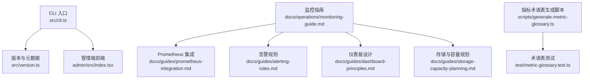

**图示来源**
- [src/cli.ts](file://src/cli.ts)
- [src/version.ts](file://src/version.ts)
- [admin/src/index.tsx](file://admin/src/index.tsx)
- [docs/operations/monitoring-guide.md](file://docs/operations/monitoring-guide.md)
- [docs/guides/prometheus-integration.md](file://docs/guides/prometheus-integration.md)
- [docs/guides/alerting-rules.md](file://docs/guides/alerting-rules.md)
- [docs/guides/dashboard-principles.md](file://docs/guides/dashboard-principles.md)
- [docs/guides/storage-capacity-planning.md](file://docs/guides/storage-capacity-planning.md)
- [scripts/generate-metric-glossary.ts](file://scripts/generate-metric-glossary.ts)
- [test/metric-glossary.test.ts](file://test/metric-glossary.test.ts)

**章节来源**
- [README.md](file://README.md)
- [gbrain.yml](file://gbrain.yml)
- [src/cli.ts](file://src/cli.ts)
- [src/version.ts](file://src/version.ts)
- [admin/src/index.tsx](file://admin/src/index.tsx)
- [docs/operations/monitoring-guide.md](file://docs/operations/monitoring-guide.md)

## 核心组件
- 指标采集层
  - 系统级指标：CPU、内存、磁盘、网络、进程状态
  - 运行时指标：GC、线程/协程、事件循环延迟
  - 中间件与资源：数据库连接池、消息队列、缓存命中率
  - 业务指标：请求量、错误率、P95/P99 延迟、吞吐、任务积压
- 指标导出与抓取
  - Prometheus 文本格式 /metrics 端点
  - 自定义指标注册与命名规范
  - 标签维度控制与基数治理
- 健康检查与就绪探针
  - 存活探针：进程是否响应
  - 就绪探针：依赖是否可用（DB、队列、外部服务）
  - 分级健康：OK/WARN/CRITICAL
- 告警与通知
  - 基于阈值的静态规则与动态基线
  - 多渠道通知：邮件、IM、Webhook
- 可视化与仪表板
  - 统一命名与分组
  - 关键视图：概览、资源、链路、业务
- 存储与容量
  - 时间序列保留策略
  - 压缩与降采样
  - 容量评估与扩容计划

**章节来源**
- [docs/operations/monitoring-guide.md](file://docs/operations/monitoring-guide.md)
- [docs/guides/prometheus-integration.md](file://docs/guides/prometheus-integration.md)
- [docs/guides/alerting-rules.md](file://docs/guides/alerting-rules.md)
- [docs/guides/dashboard-principles.md](file://docs/guides/dashboard-principles.md)
- [docs/guides/storage-capacity-planning.md](file://docs/guides/storage-capacity-planning.md)

## 架构总览
整体架构遵循“采集—导出—抓取—存储—告警—可视化”的链路，结合健康检查与就绪探针保障服务可用性。

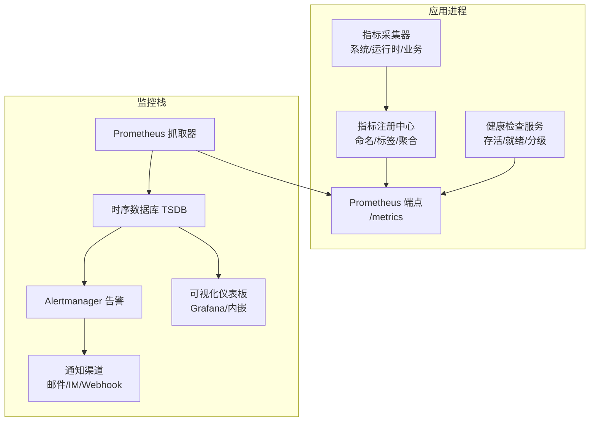

**图示来源**
- [docs/operations/monitoring-guide.md](file://docs/operations/monitoring-guide.md)
- [docs/guides/prometheus-integration.md](file://docs/guides/prometheus-integration.md)
- [docs/guides/alerting-rules.md](file://docs/guides/alerting-rules.md)
- [docs/guides/dashboard-principles.md](file://docs/guides/dashboard-principles.md)

## 详细组件分析

### 健康检查机制
- 存活探针（Liveness）
  - 目标：快速发现僵尸进程与死锁
  - 实现要点：轻量 HTTP 或 TCP 探测；失败即重启
- 就绪探针（Readiness）
  - 目标：确保依赖可用后再接收流量
  - 检查项：数据库连接、队列连通性、外部 API 可达性
- 分级健康
  - OK：全部正常
  - WARN：部分降级但仍可服务
  - CRITICAL：不可用或严重退化
- 健康端点
  - 输出结构化健康状态，便于编排平台消费

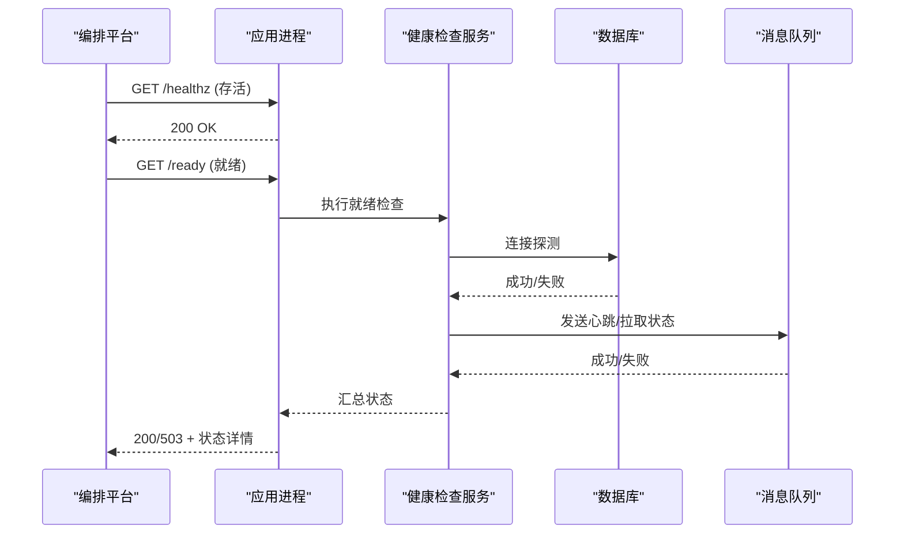

**图示来源**
- [docs/designs/health-check-design.md](file://docs/designs/health-check-design.md)
- [docs/operations/monitoring-guide.md](file://docs/operations/monitoring-guide.md)

**章节来源**
- [docs/designs/health-check-design.md](file://docs/designs/health-check-design.md)
- [docs/operations/monitoring-guide.md](file://docs/operations/monitoring-guide.md)

### 性能指标采集
- 系统级
  - CPU：使用率、负载、上下文切换
  - 内存：RSS、堆大小、页缓存、OOM 事件
  - 磁盘：IOPS、吞吐、延迟、空间使用率
  - 网络：带宽、丢包、重传、连接数
- 运行时
  - GC：次数、耗时、停顿时长
  - 事件循环：延迟分布、阻塞事件
- 资源与中间件
  - 数据库连接池：活跃/空闲/等待/超时
  - 队列：入队/出队速率、堆积长度、重试率
  - 缓存：命中率、过期率、穿透/击穿
- 业务关键指标
  - 请求量 QPS、错误率、P95/P99 延迟、吞吐
  - 任务成功率、重试率、背压信号

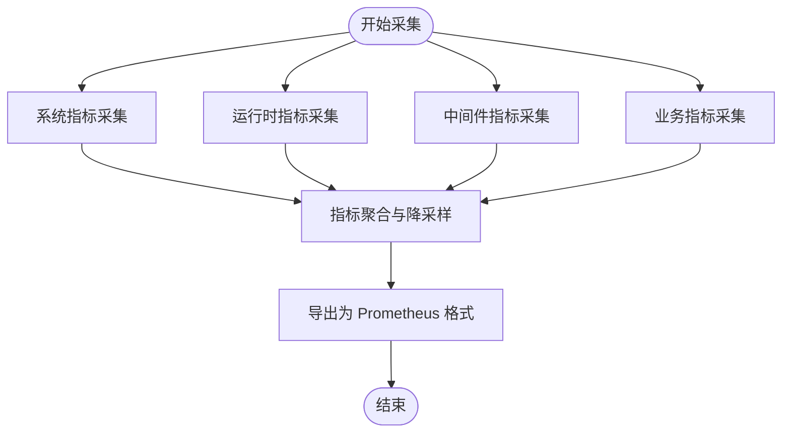

**图示来源**
- [docs/operations/monitoring-guide.md](file://docs/operations/monitoring-guide.md)
- [docs/guides/prometheus-integration.md](file://docs/guides/prometheus-integration.md)

**章节来源**
- [docs/operations/monitoring-guide.md](file://docs/operations/monitoring-guide.md)
- [docs/guides/prometheus-integration.md](file://docs/guides/prometheus-integration.md)

### Prometheus 指标格式与自定义指标注册
- 指标类型
  - Counter：累计值（如请求总数）
  - Gauge：瞬时值（如连接池大小）
  - Histogram：分桶统计（如延迟分布）
  - Summary：客户端计算的分位数（谨慎使用）
- 命名规范
  - 前缀：子系统_模块_对象_度量
  - 单位后缀：_total/_bytes/_seconds/_ratio
  - 避免高基数标签（用户 ID、请求 ID）
- 标签治理
  - 固定枚举集，限制维度数量
  - 对高基数进行聚合或采样
- 自定义指标注册
  - 在初始化阶段注册指标实例
  - 提供更新接口，避免重复创建
  - 暴露 /metrics 端点供抓取

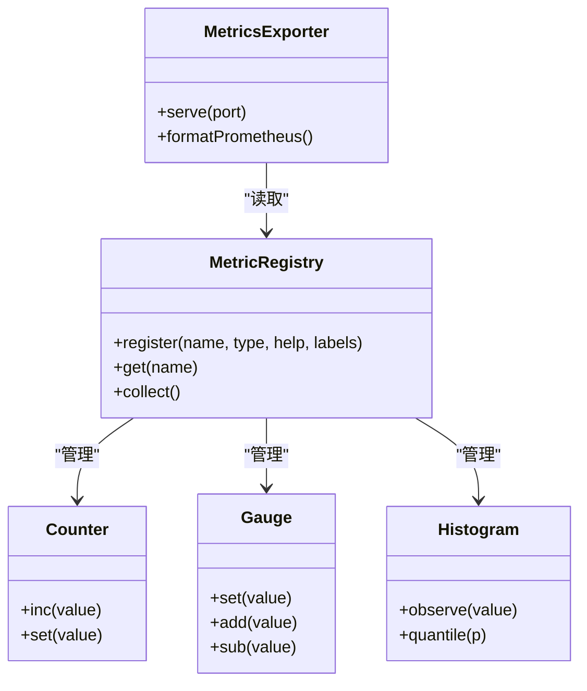

**图示来源**
- [docs/guides/prometheus-integration.md](file://docs/guides/prometheus-integration.md)

**章节来源**
- [docs/guides/prometheus-integration.md](file://docs/guides/prometheus-integration.md)

### 指标聚合策略
- 时间窗口聚合
  - 短窗口：秒级，用于实时告警
  - 长窗口：分钟/小时级，用于趋势与容量规划
- 维度聚合
  - 按服务/实例/区域聚合
  - 对高基数标签进行裁剪或哈希化
- 预聚合与降采样
  - 在采集侧做简单聚合，降低抓取压力
  - 在存储侧进行降采样以节省空间

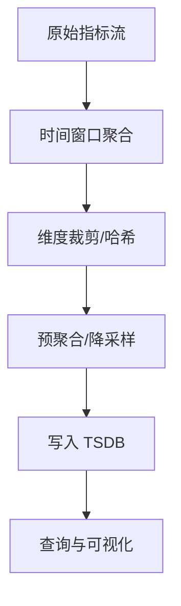

**图示来源**
- [docs/operations/monitoring-guide.md](file://docs/operations/monitoring-guide.md)

**章节来源**
- [docs/operations/monitoring-guide.md](file://docs/operations/monitoring-guide.md)

### 核心指标监控方案
- CPU
  - 指标：使用率、负载、上下文切换
  - 阈值：持续高于 80% 触发警告，高于 95% 紧急
- 内存
  - 指标：RSS、堆大小、页缓存、OOM
  - 阈值：RSS 持续增长且无回收，OOM 事件计数
- 数据库连接池
  - 指标：活跃/空闲/等待/超时/最大连接
  - 阈值：等待队列 > 0 持续一段时间，超时率上升
- 队列长度
  - 指标：入队/出队速率、堆积长度、重试率
  - 阈值：堆积超过 SLA 对应的时间窗口，重试率异常

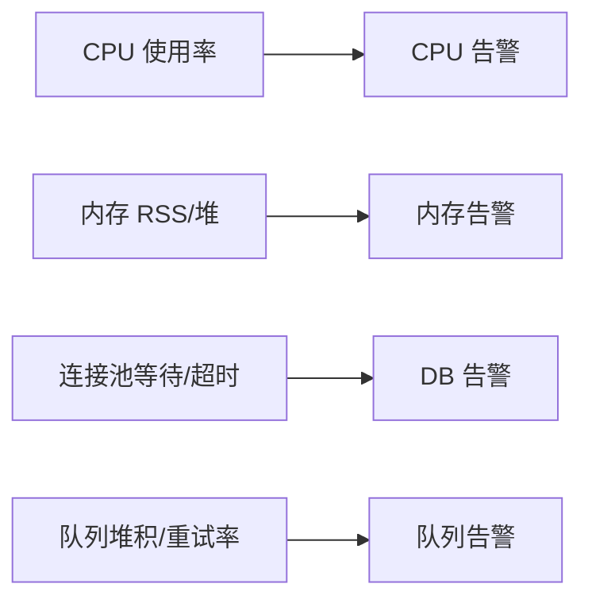

**图示来源**
- [docs/operations/monitoring-guide.md](file://docs/operations/monitoring-guide.md)

**章节来源**
- [docs/operations/monitoring-guide.md](file://docs/operations/monitoring-guide.md)

### 告警规则配置、阈值与通知渠道
- 规则分类
  - 基础资源：CPU、内存、磁盘、网络
  - 中间件：DB、队列、缓存
  - 业务：QPS、错误率、延迟、吞吐
- 阈值策略
  - 静态阈值：适用于稳定环境
  - 动态基线：基于历史波动自适应
- 通知渠道
  - 邮件、企业 IM、Webhook、电话
  - 去重与抑制：避免风暴
- 规则示例结构
  - 名称、表达式、持续时间、级别、描述、联系人

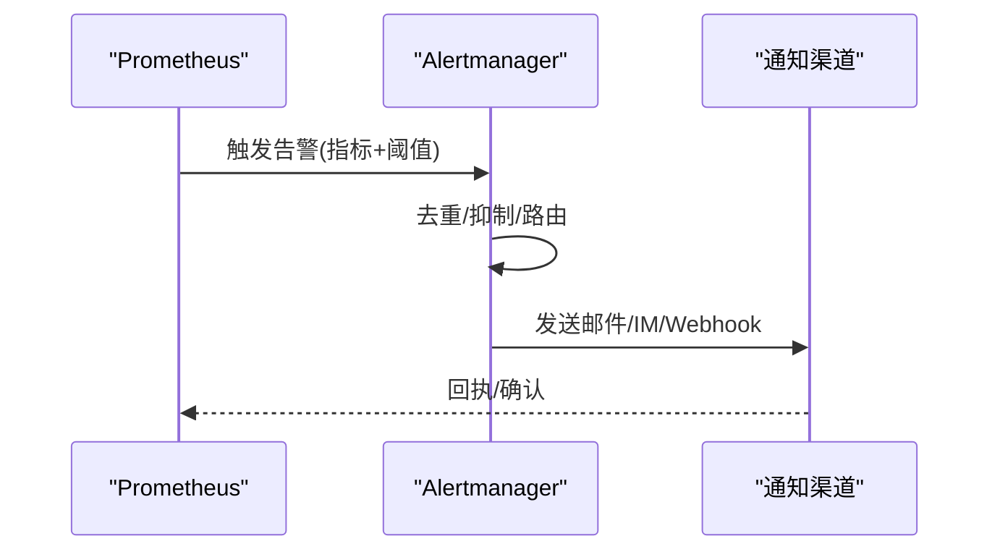

**图示来源**
- [docs/guides/alerting-rules.md](file://docs/guides/alerting-rules.md)

**章节来源**
- [docs/guides/alerting-rules.md](file://docs/guides/alerting-rules.md)

### 仪表板设计原则与可视化图表配置
- 设计原则
  - 分层：概览→资源→链路→业务
  - 一致：统一命名、颜色、单位
  - 可读：少即是多，突出异常
- 图表类型
  - 折线图：趋势与时序
  - 柱状图：对比与分布
  - 热力图：密度与热点
  - 仪表盘：KPI 达成度
- 交互
  - 全局时间范围与过滤
  - 钻取到实例/区域/服务

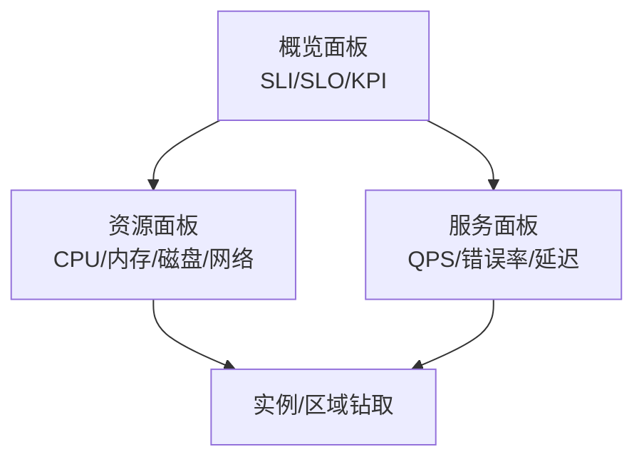

**图示来源**
- [docs/guides/dashboard-principles.md](file://docs/guides/dashboard-principles.md)

**章节来源**
- [docs/guides/dashboard-principles.md](file://docs/guides/dashboard-principles.md)

### 指标存储策略、数据保留与容量规划
- 存储策略
  - 热数据：高精度、短保留
  - 冷数据：低精度、长保留
  - 降采样：按时间粒度合并
- 保留政策
  - 默认：短期全量，长期降采样
  - 按业务重要性分级
- 容量规划
  - 估算：指标基数 × 采样频率 × 保留天数
  - 扩容：水平扩展节点与分片
  - 成本优化：标签裁剪与预聚合

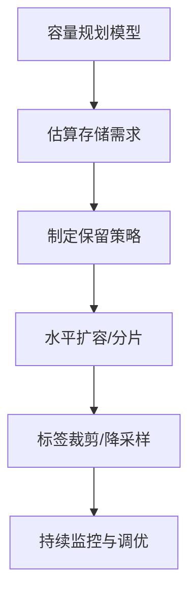

**图示来源**
- [docs/guides/storage-capacity-planning.md](file://docs/guides/storage-capacity-planning.md)

**章节来源**
- [docs/guides/storage-capacity-planning.md](file://docs/guides/storage-capacity-planning.md)

## 依赖分析
- 内部依赖
  - CLI 入口负责启动与参数解析，版本信息用于元数据标注
  - 管理端前端可承载监控视图或与外部系统集成
- 外部依赖
  - Prometheus 抓取器与 Alertmanager
  - 时序数据库（TSDB）
  - 通知渠道（邮件/IM/Webhook）
- 耦合与内聚
  - 指标注册与导出解耦，便于替换实现
  - 健康检查独立于业务逻辑，保证稳定性

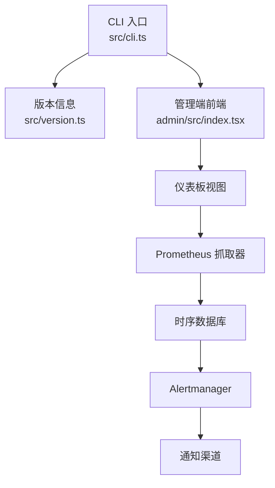

**图示来源**
- [src/cli.ts](file://src/cli.ts)
- [src/version.ts](file://src/version.ts)
- [admin/src/index.tsx](file://admin/src/index.tsx)
- [docs/guides/prometheus-integration.md](file://docs/guides/prometheus-integration.md)
- [docs/guides/alerting-rules.md](file://docs/guides/alerting-rules.md)

**章节来源**
- [src/cli.ts](file://src/cli.ts)
- [src/version.ts](file://src/version.ts)
- [admin/src/index.tsx](file://admin/src/index.tsx)
- [docs/guides/prometheus-integration.md](file://docs/guides/prometheus-integration.md)
- [docs/guides/alerting-rules.md](file://docs/guides/alerting-rules.md)

## 性能考虑
- 指标采集开销
  - 控制采样频率，避免高频写入
  - 使用直方图替代大量计数器
- 标签基数治理
  - 限制高基数标签，必要时哈希化
  - 定期审计指标字典
- 聚合与降采样
  - 在采集侧做简单聚合
  - 在存储侧按粒度降采样
- 抓取与存储
  - 合理配置抓取间隔与批处理
  - 使用远端存储与分片提升可扩展性

[本节为通用指导，不直接分析具体文件]

## 故障排查指南
- 常见问题
  - 指标缺失：检查采集器与注册逻辑
  - 高基数导致查询慢：审查标签与聚合策略
  - 告警风暴：启用去重与抑制
  - 健康检查误报：细化就绪条件与退避
- 诊断步骤
  - 查看 /metrics 输出与标签分布
  - 核对健康检查日志与依赖状态
  - 验证告警规则表达式与持续时间
  - 检查存储容量与写入延迟

**章节来源**
- [docs/operations/monitoring-guide.md](file://docs/operations/monitoring-guide.md)
- [docs/guides/alerting-rules.md](file://docs/guides/alerting-rules.md)

## 结论
通过统一的指标采集、严格的命名与标签治理、合理的聚合与降采样策略，以及完善的健康检查与告警体系，可实现从系统到业务的端到端可观测性。配合科学的存储策略与容量规划，可在保障性能的同时控制成本，并通过清晰的仪表板设计提升排障效率与运营透明度。

[本节为总结性内容，不直接分析具体文件]

## 附录
- 指标术语表
  - 生成脚本：scripts/generate-metric-glossary.ts
  - 测试用例：test/metric-glossary.test.ts
- 参考文档
  - 监控指南：docs/operations/monitoring-guide.md
  - 系统总览：docs/architecture/system-overview.md
  - Prometheus 集成：docs/guides/prometheus-integration.md
  - 告警规则：docs/guides/alerting-rules.md
  - 仪表板设计：docs/guides/dashboard-principles.md
  - 存储与容量：docs/guides/storage-capacity-planning.md

**章节来源**
- [scripts/generate-metric-glossary.ts](file://scripts/generate-metric-glossary.ts)
- [test/metric-glossary.test.ts](file://test/metric-glossary.test.ts)
- [docs/operations/monitoring-guide.md](file://docs/operations/monitoring-guide.md)
- [docs/architecture/system-overview.md](file://docs/architecture/system-overview.md)
- [docs/guides/prometheus-integration.md](file://docs/guides/prometheus-integration.md)
- [docs/guides/alerting-rules.md](file://docs/guides/alerting-rules.md)
- [docs/guides/dashboard-principles.md](file://docs/guides/dashboard-principles.md)
- [docs/guides/storage-capacity-planning.md](file://docs/guides/storage-capacity-planning.md)