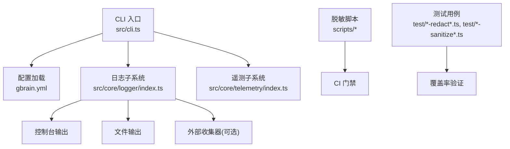
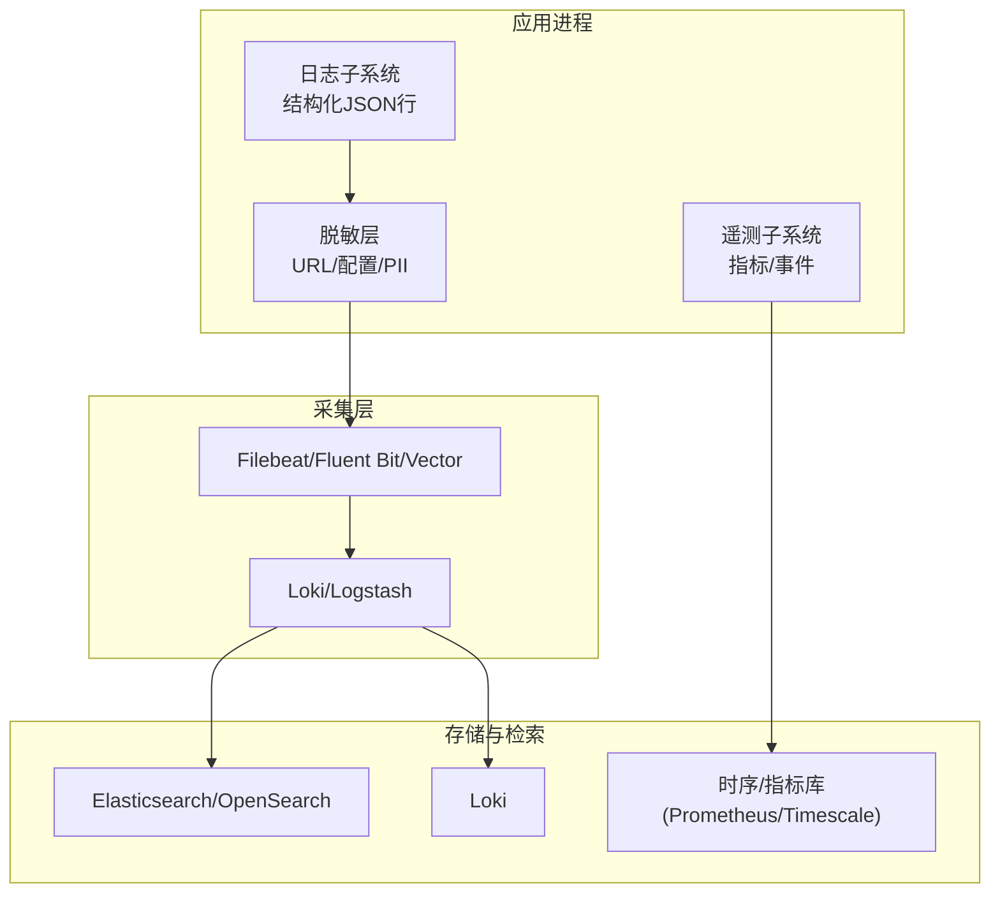
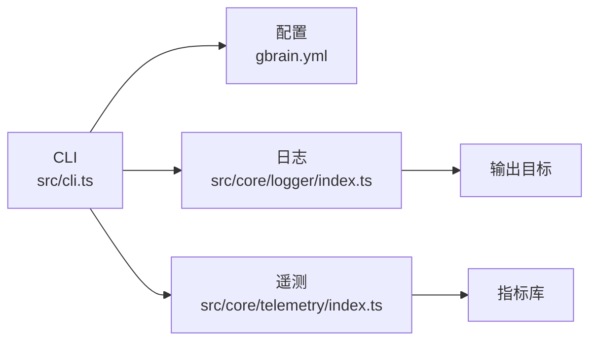

# 日志聚合与分析

<cite>
**本文引用的文件**   
- [README.md](file://README.md)
- [gbrain.yml](file://gbrain.yml)
- [src/cli.ts](file://src/cli.ts)
- [src/core/telemetry/index.ts](file://src/core/telemetry/index.ts)
- [src/core/logger/index.ts](file://src/core/logger/index.ts)
- [scripts/check-pg-url-redaction.sh](file://scripts/check-pg-url-redaction.sh)
- [scripts/check-no-pii-in-agent-voice.sh](file://scripts/check-no-pii-in-agent-voice.sh)
- [scripts/check-source-config-leak.sh](file://scripts/check-source-config-leak.sh)
- [scripts/check-privacy.sh](file://scripts/check-privacy.sh)
- [test/url-redact.test.ts](file://test/url-redact.test.ts)
- [test/source-config-redact.test.ts](file://test/source-config-redact.test.ts)
- [test/eval-capture-sanitize.test.ts](file://test/eval-capture-sanitize.test.ts)
- [test/minions-shell-redact.test.ts](file://test/minions-shell-redact.test.ts)
- [test/query-sanitization.test.ts](file://test/query-sanitization.test.ts)
- [test/facts-absorb-log.test.ts](file://test/facts-absorb-log.test.ts)
- [test/progress-tail.test.ts](file://test/progress-tail.test.ts)
- [test/serve-http-health.test.ts](file://test/serve-http-health.test.ts)
- [docker-compose.ci.yml](file://docker-compose.ci.yml)
- [docker-compose.test.yml](file://docker-compose.test.yml)
</cite>

## 目录
1. [简介](#简介)
2. [项目结构](#项目结构)
3. [核心组件](#核心组件)
4. [架构总览](#架构总览)
5. [详细组件分析](#详细组件分析)
6. [依赖关系分析](#依赖关系分析)
7. [性能考虑](#性能考虑)
8. [故障排查指南](#故障排查指南)
9. [结论](#结论)
10. [附录](#附录)

## 简介
本文件面向“日志聚合与分析”的落地方案，结合仓库中现有的日志、脱敏与可观测性相关实现，给出结构化日志设计模式、级别控制、格式规范、分布式采集与路由策略、存储后端选择、敏感信息脱敏、日志轮转与压缩、ELK/Loki集成、查询语法与索引优化、审计与安全事件追踪、以及故障排查与性能分析方法。文档既提供高层架构视图，也深入到具体源码位置以便对照实现。

## 项目结构
从仓库视角看，日志与可观测性相关能力分布在以下区域：
- CLI入口与启动流程：负责初始化配置、加载运行时参数、输出控制台日志与进度信息
- 核心日志子系统：集中管理日志级别、格式化、输出目标（控制台/文件/外部）
- 遥测与指标：用于上报系统运行状态与关键事件
- 安全与合规脚本：在CI阶段检查是否泄露敏感信息（如PG URL、PII等）
- 测试用例：覆盖URL脱敏、配置脱敏、查询脱敏、Shell输出脱敏、评估数据脱敏等
- 容器编排：定义CI/测试环境中的服务组合，便于集成日志收集器

图表来源
- [src/cli.ts](file://src/cli.ts)
- [gbrain.yml](file://gbrain.yml)
- [src/core/logger/index.ts](file://src/core/logger/index.ts)
- [src/core/telemetry/index.ts](file://src/core/telemetry/index.ts)
- [scripts/check-pg-url-redaction.sh](file://scripts/check-pg-url-redaction.sh)
- [scripts/check-no-pii-in-agent-voice.sh](file://scripts/check-no-pii-in-agent-voice.sh)
- [scripts/check-source-config-leak.sh](file://scripts/check-source-config-leak.sh)
- [scripts/check-privacy.sh](file://scripts/check-privacy.sh)
- [test/url-redact.test.ts](file://test/url-redact.test.ts)
- [test/source-config-redact.test.ts](file://test/source-config-redact.test.ts)
- [test/eval-capture-sanitize.test.ts](file://test/eval-capture-sanitize.test.ts)
- [test/minions-shell-redact.test.ts](file://test/minions-shell-redact.test.ts)
- [test/query-sanitization.test.ts](file://test/query-sanitization.test.ts)

章节来源
- [README.md](file://README.md)
- [gbrain.yml](file://gbrain.yml)
- [src/cli.ts](file://src/cli.ts)

## 核心组件
- 日志子系统
  - 职责：统一日志级别控制、结构化字段注入、输出目标抽象、采样与节流、上下文传播（如traceId）。
  - 关键点：建议采用JSON行式结构化输出，包含时间戳、级别、模块、消息、键值对上下文；避免将大对象直接序列化到日志正文。
- 遥测子系统
  - 职责：上报关键业务指标、错误计数、耗时分布、资源使用等；可与日志关联（通过traceId或spanId）。
- 脱敏与隐私保护
  - 职责：在写入日志前对敏感信息进行替换或截断，确保不泄露密码、令牌、PII等。
- 配置与开关
  - 职责：通过配置文件或环境变量控制日志级别、输出目标、采样率、是否启用遥测等。

章节来源
- [src/core/logger/index.ts](file://src/core/logger/index.ts)
- [src/core/telemetry/index.ts](file://src/core/telemetry/index.ts)
- [gbrain.yml](file://gbrain.yml)

## 架构总览
下图展示从应用进程到外部日志系统的端到端路径，包括本地结构化日志、脱敏层、采集器与存储后端。

图表来源
- [src/core/logger/index.ts](file://src/core/logger/index.ts)
- [src/core/telemetry/index.ts](file://src/core/telemetry/index.ts)
- [docker-compose.ci.yml](file://docker-compose.ci.yml)
- [docker-compose.test.yml](file://docker-compose.test.yml)

## 详细组件分析

### 结构化日志设计模式
- 字段约定
  - 基础字段：timestamp、level、service、version、host、pid、traceId、spanId
  - 业务字段：module、op、sourceId、tenantId、userId、requestId
  - 结果字段：status、durationMs、errorClass、errorCode
- 输出格式
  - JSON行式，单条一行，便于流式处理
  - 避免嵌套过深，必要时将复杂对象扁平化或仅保留摘要
- 上下文传播
  - 请求级链路ID贯穿调用链，便于跨服务关联
- 示例参考路径
  - 日志子系统实现与用法：[src/core/logger/index.ts](file://src/core/logger/index.ts)
  - CLI初始化与日志级别设置：[src/cli.ts](file://src/cli.ts)

章节来源
- [src/core/logger/index.ts](file://src/core/logger/index.ts)
- [src/cli.ts](file://src/cli.ts)

### 日志级别控制与格式规范
- 级别建议
  - debug：仅开发/调试环境开启
  - info：生产默认级别，记录关键操作与状态变更
  - warn：潜在问题与降级行为
  - error：异常与失败路径
  - fatal：进程不可恢复错误
- 格式规范
  - 统一JSON行式，固定字段名，避免自由文本混排
  - 错误对象包含class、message、stackTrace（按需），并做长度限制
- 示例参考路径
  - 日志级别与输出目标：[src/core/logger/index.ts](file://src/core/logger/index.ts)
  - 健康检查接口输出：[test/serve-http-health.test.ts](file://test/serve-http-health.test.ts)

章节来源
- [src/core/logger/index.ts](file://src/core/logger/index.ts)
- [test/serve-http-health.test.ts](file://test/serve-http-health.test.ts)

### 分布式日志收集架构与路由策略
- 采集器选型
  - Filebeat/Fluent Bit/Vector：轻量、低开销，适合旁路采集
- 路由策略
  - 按服务/模块/租户分流到不同索引或标签
  - 按级别分流：error/warn进入告警通道，info/debug进入归档
- 存储后端
  - ELK：Elasticsearch/OpenSearch + Logstash + Kibana
  - Loki：轻量、低成本，适合云原生
- 示例参考路径
  - CI/测试编排（可加入采集器）：[docker-compose.ci.yml](file://docker-compose.ci.yml), [docker-compose.test.yml](file://docker-compose.test.yml)

章节来源
- [docker-compose.ci.yml](file://docker-compose.ci.yml)
- [docker-compose.test.yml](file://docker-compose.test.yml)

### 敏感信息脱敏与合规
- 脱敏范围
  - 数据库连接串（含密码）、访问令牌、PII（个人身份信息）、内部密钥
- 实现要点
  - 在日志写入前进行正则/规则匹配替换
  - 针对URL、配置对象、Shell输出、查询语句等进行专项脱敏
- 自动化门禁
  - CI脚本扫描日志与代码输出，禁止出现明文敏感信息
- 示例参考路径
  - PG URL脱敏脚本：[scripts/check-pg-url-redaction.sh](file://scripts/check-pg-url-redaction.sh)
  - Agent语音PII检查：[scripts/check-no-pii-in-agent-voice.sh](file://scripts/check-no-pii-in-agent-voice.sh)
  - 源配置泄露检查：[scripts/check-source-config-leak.sh](file://scripts/check-source-config-leak.sh)
  - 通用隐私检查：[scripts/check-privacy.sh](file://scripts/check-privacy.sh)
  - URL脱敏测试：[test/url-redact.test.ts](file://test/url-redact.test.ts)
  - 源配置脱敏测试：[test/source-config-redact.test.ts](file://test/source-config-redact.test.ts)
  - 评估捕获脱敏测试：[test/eval-capture-sanitize.test.ts](file://test/eval-capture-sanitize.test.ts)
  - Shell输出脱敏测试：[test/minions-shell-redact.test.ts](file://test/minions-shell-redact.test.ts)
  - 查询脱敏测试：[test/query-sanitization.test.ts](file://test/query-sanitization.test.ts)

章节来源
- [scripts/check-pg-url-redaction.sh](file://scripts/check-pg-url-redaction.sh)
- [scripts/check-no-pii-in-agent-voice.sh](file://scripts/check-no-pii-in-agent-voice.sh)
- [scripts/check-source-config-leak.sh](file://scripts/check-source-config-leak.sh)
- [scripts/check-privacy.sh](file://scripts/check-privacy.sh)
- [test/url-redact.test.ts](file://test/url-redact.test.ts)
- [test/source-config-redact.test.ts](file://test/source-config-redact.test.ts)
- [test/eval-capture-sanitize.test.ts](file://test/eval-capture-sanitize.test.ts)
- [test/minions-shell-redact.test.ts](file://test/minions-shell-redact.test.ts)
- [test/query-sanitization.test.ts](file://test/query-sanitization.test.ts)

### 日志轮转与压缩策略
- 轮转策略
  - 按大小或时间切分，保留N天/GB，自动清理旧文件
- 压缩策略
  - 滚动后压缩为gzip/zstd，降低存储成本
- 可靠性
  - 原子写入+幂等重放，避免采集器丢失
- 示例参考路径
  - 进度输出与尾部读取（可用于验证轮转效果）：[test/progress-tail.test.ts](file://test/progress-tail.test.ts)

章节来源
- [test/progress-tail.test.ts](file://test/progress-tail.test.ts)

### ELK Stack 与 Loki 集成指南
- ELK
  - 采集：Filebeat/Fluent Bit 抓取JSON行日志
  - 解析：Logstash/Grok 提取字段，映射到ES映射
  - 可视化：Kibana创建索引模式、仪表盘、告警
- Loki
  - 采集：Promtail/Fluent Bit 推送至Loki
  - 标签：service、level、module、tenantId
  - 查询：LogQL，支持正则、聚合、统计
- 示例参考路径
  - 编排文件（可扩展采集器）：[docker-compose.ci.yml](file://docker-compose.ci.yml), [docker-compose.test.yml](file://docker-compose.test.yml)

章节来源
- [docker-compose.ci.yml](file://docker-compose.ci.yml)
- [docker-compose.test.yml](file://docker-compose.test.yml)

### 日志查询语法、索引优化与性能调优
- 查询语法
  - Elasticsearch：DSL查询、聚合、过滤；Kibana Discover/KQL
  - Loki：LogQL，基于标签与正则表达式
- 索引优化
  - 合理分片与副本数，避免热点
  - 字段类型与映射优化，减少倒排体积
  - 冷热分层与生命周期管理（ILM/Rollover）
- 性能调优
  - 客户端批量发送、背压与重试
  - 服务端内存与GC调优，磁盘IO优化
  - 采样与节流，降低高负载时的开销
- 示例参考路径
  - 健康检查与HTTP服务（可作为监控点）：[test/serve-http-health.test.ts](file://test/serve-http-health.test.ts)

章节来源
- [test/serve-http-health.test.ts](file://test/serve-http-health.test.ts)

### 审计日志记录、合规性与安全事件追踪
- 审计范围
  - 用户操作、权限变更、数据导入导出、模型调用、错误与异常
- 合规要求
  - 最小化原则、可追溯、不可篡改、保留周期
- 安全事件
  - 认证失败、越权访问、注入尝试、异常流量
- 示例参考路径
  - 事实吸收日志（可用于审计线索）：[test/facts-absorb-log.test.ts](file://test/facts-absorb-log.test.ts)

章节来源
- [test/facts-absorb-log.test.ts](file://test/facts-absorb-log.test.ts)

## 依赖关系分析
- 组件耦合
  - CLI依赖配置与日志子系统
  - 日志子系统依赖脱敏层与输出目标
  - 遥测子系统独立于日志，但可通过traceId关联
- 外部依赖
  - 采集器（Filebeat/Fluent Bit/Vector）
  - 存储后端（Elasticsearch/OpenSearch/Loki/时序库）
- 潜在循环依赖
  - 日志不应反向依赖业务逻辑，避免阻塞主流程

图表来源
- [src/cli.ts](file://src/cli.ts)
- [gbrain.yml](file://gbrain.yml)
- [src/core/logger/index.ts](file://src/core/logger/index.ts)
- [src/core/telemetry/index.ts](file://src/core/telemetry/index.ts)

章节来源
- [src/cli.ts](file://src/cli.ts)
- [gbrain.yml](file://gbrain.yml)
- [src/core/logger/index.ts](file://src/core/logger/index.ts)
- [src/core/telemetry/index.ts](file://src/core/telemetry/index.ts)

## 性能考虑
- 日志写入开销
  - 异步队列+批处理，避免同步阻塞
  - 采样与节流，在高吞吐场景下降低CPU与IO压力
- 传输与存储
  - 压缩与去重，减少网络带宽与存储占用
  - 合理分片与副本，平衡查询性能与写入吞吐
- 监控与告警
  - 采集器延迟、丢弃率、堆积量
  - 存储后端QPS、延迟、磁盘使用率

## 故障排查指南
- 常见问题
  - 日志缺失：检查采集器状态、权限、路径与轮转策略
  - 字段缺失：确认结构化输出与解析规则一致
  - 敏感信息泄露：运行隐私检查脚本，定位并修复
- 定位方法
  - 通过traceId串联多服务日志
  - 使用Kibana/Loki快速过滤级别与模块
  - 对比健康检查接口输出，验证服务可用性
- 示例参考路径
  - 隐私检查脚本：[scripts/check-privacy.sh](file://scripts/check-privacy.sh)
  - URL/配置/查询脱敏测试：[test/url-redact.test.ts](file://test/url-redact.test.ts), [test/source-config-redact.test.ts](file://test/source-config-redact.test.ts), [test/query-sanitization.test.ts](file://test/query-sanitization.test.ts)
  - 健康检查测试：[test/serve-http-health.test.ts](file://test/serve-http-health.test.ts)

章节来源
- [scripts/check-privacy.sh](file://scripts/check-privacy.sh)
- [test/url-redact.test.ts](file://test/url-redact.test.ts)
- [test/source-config-redact.test.ts](file://test/source-config-redact.test.ts)
- [test/query-sanitization.test.ts](file://test/query-sanitization.test.ts)
- [test/serve-http-health.test.ts](file://test/serve-http-health.test.ts)

## 结论
通过统一的日志子系统、严格的脱敏策略、完善的采集与存储方案，以及可操作的查询与运维手段，可实现高效、安全、可观测的日志聚合与分析体系。建议在CI中加入隐私检查门禁，在生产中持续优化索引与查询性能，并结合审计日志满足合规要求。

## 附录
- 术语
  - traceId：一次请求的全链路标识
  - 脱敏：对敏感信息进行替换或隐藏
  - 轮转：按时间或大小切分日志文件
- 参考路径
  - 项目说明与安装指引：[README.md](file://README.md)
  - 配置样例：[gbrain.yml](file://gbrain.yml)
  - CLI入口：[src/cli.ts](file://src/cli.ts)
  - 日志与遥测实现：[src/core/logger/index.ts](file://src/core/logger/index.ts), [src/core/telemetry/index.ts](file://src/core/telemetry/index.ts)
  - 脱敏与隐私脚本：[scripts/check-pg-url-redaction.sh](file://scripts/check-pg-url-redaction.sh), [scripts/check-no-pii-in-agent-voice.sh](file://scripts/check-no-pii-in-agent-voice.sh), [scripts/check-source-config-leak.sh](file://scripts/check-source-config-leak.sh), [scripts/check-privacy.sh](file://scripts/check-privacy.sh)
  - 测试用例：见各test文件路径